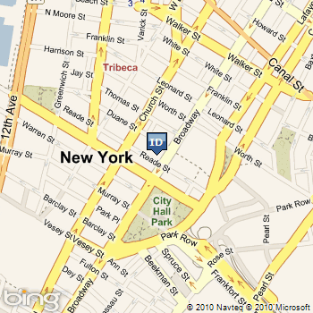
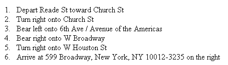

# Accessing the Bing Maps REST Services using PHP
This article will describe how to write a PHP application that can interact with the [Bing Maps REST Services](http://msdn.microsoft.com/en-us/library/ff701713.aspx) APIs.  
  
 Representational State Transfer (REST) is an architecture for distributed systems. It follows a stateless client-server model, meaning that there is no memory (context) of past requests stored on the server between client requests. A RESTful web service is a collection of resources, stored under a central URL, which supports a set of operations all of which can be activated using HTTP methods (POST, GET, etc.).  
  
 The Bing Maps REST Services consist of three RESTful APIs, all of which can be accessed using HTTP GET requests that include a URI and parameters indicating what information is to be returned. The three available Bing Maps REST Services APIs are:  
  
1.  **Locations** – This API performs geocoding operations, which means you can get the location (as well as other information) about an address or place. The Locations API allows you to find, or geocode, locations by structured address or unstructured query. It also allows you to reverse geocode an address by specifying a point (latitude and longitude).  
  
2.  **Imagery** – This API allows you to download a static map, which can be customized to a specific size, style, and zoom level, and can also include one or more pushpins representing different locations.  
  
3.  **Routes** – This API allows you to specify two or more waypoints and get a route between those waypoints, including a full itinerary. You can customize routes to include traffic information, provide walking directions (rather than driving), and use custom pushpins to represent itinerary points.  
  
 The Locations, Imagery, and Routes APIs can be accessed using specially formatted URLs that contain all parameters required to get the requested information. Both of these APIs will return results in an HTTP message that may contain either JSON or XML.  
  
 Working with the Bing Maps REST Services APIs in PHP is extremely straightforward. There are no extensions required, since all requests and responses work through standard HTTP (unlike the SOAP web services, which require a php_soap extension in order to function from PHP). If you request response information in XML format, it can be parsed and manipulated using built-in PHP extensions such as SimpleXML.  
  
 This article will describe how to construct PHP pages that interact with all three of the currently available Bing Maps REST Services APIs.  
  
## Setting Up Your Environment  
 Before continuing with this article, you should ensure that you have the correct software installed and environment setup to develop and host PHP pages that will connect to the Bing Maps REST Services APIs.  
  
### Required Software  
 To work with and run the sample applications in this article, you will need a PHP-enabled web server. To develop the samples, we used **WampServer** (http://www.wampserver.com), a Windows-based development environment that includes Apache, PHP, and MySQL Database. It is easy to install and has everything you need to create and host PHP applications quickly and easily. You do not need to install any special extensions in order to work with the Bing Maps REST Services APIs.  
  
 **Microsoft IIS 6 or 7** can also be used to host PHP applications, and we tested several of the examples on it to confirm that they work. If you are using IIS to host PHP, you may also want to install **FastCGI**, which improves performance of CGI applications in IIS. You can find a very detailed set of instructions for installing and configuring FastCGI and PHP at:  
  
-   IIS 6 - [http://learn.iis.net/page.aspx/247/using-fastcgi-to-host-php-applications-on-iis-60/](http://learn.iis.net/page.aspx/247/using-fastcgi-to-host-php-applications-on-iis-60/)  
  
-   IIS 7 - [http://learn.iis.net/page.aspx/246/using-fastcgi-to-host-php-applications-on-iis-7/](http://learn.iis.net/page.aspx/246/using-fastcgi-to-host-php-applications-on-iis-7/)  
  
 There are many other servers that can be configured to host PHP, and you are free to use any of those instead if you are more familiar with their functionality.  
  
 Finally, in terms of a development environment, you can use anything from a text editor such as Windows Notepad to a full-fledged PHP IDE such as PHP Designer to write your code.  
  
### PHP Starter Code  
 This article contains numerous samples of interacting with Bing Maps REST Services APIs using PHP. If you are already familiar with PHP, you may not need any assistance creating and setting up a PHP page in which to include your Bing Maps code. However, if you need assistance getting started, you may want to being with the following simple PHP page, which includes a form that asks for the user’s Bing Maps Key, an address to be geocoded, and a zoom level for the map to be returned. Bing Maps Keys are discussed in the Authentication section below.  
  
 **Listing 1 - PHP starter code for working with Bing Maps REST Services APIs**  
  
```  
<html>  
  <head>  
    <title>Using PHP and Bing Maps REST Services APIs</title>  
  </head>  
  <body>  
    <form action="BingMaps_REST_LocationsSample.php" method="post">  
      Bing Maps Key: <input type="text" name="key"  
     value="<?php echo (isset($_POST['key'])?$_POST['key']:'') ?>"><br>  
        Street Address: <input type="text" name="address"  
      value="<?php echo (isset($_POST['address'])?$_POST['address']:'') ?>"><br>  
          City: <input type="text" name="city"  
      value="<?php echo (isset($_POST['city'])?$_POST['city']:'') ?>"><br>  
            State: <input type="text" name="state"  
       value="<?php echo (isset($_POST['state'])?$_POST['state']:'') ?>"><br>  
              Zip Code: <input type="text" name="zipcode"  
      value="<?php echo (isset($_POST['zipcode'])?$_POST['zipcode']:'') ?>"><br>  
                <input type="submit" value="Submit">  
    </form>  
    <?php   
  // Code goes here  
    ?>  
  </body>  
</html>  
```  
  
 We will use this simple page as a starting point for our Locations and Imagery API examples, building on it as necessary to show different options for searching.  
  
## Authentication  
 All Bing Maps REST Services APIs require authentication from the client each time they are called. In order to authenticate against any of the REST Services APIs, you will need a Bing Maps Key. For information about how to sign up for a Bing Maps Developer Account and get a Bing Maps Key, see [Getting a Bing Maps Key](http://msdn.microsoft.com/en-us/library/ff428642.aspx).  
  
 When you send an HTTP request to one of the REST Services APIs, which we will discuss in the next section of this article, you must include the Bing Maps Key as a parameter. For example, you might send an HTTP request like the one shown in Listing 2.  
  
 **Listing 2 - Authenticating using a Bing Maps key**  
  
```  
http://dev.virtualearth.net/REST/v1/Locations/US/NY/10007/New York/291 Broadway?output=xml&key=yourKeyHere  
```  
  
 In all of the examples in this article, you will see the Bing Maps Key sent to the REST Services APIs in this way.  
  
## Working with the Locations API  
 The Locations API allows you to geocode locations based on an address or query, or reverse geocode addresses based on a specified point. All three of these functions can be accessed simply by sending a specially formatted URI that includes parameters for the function. The Locations API can return results as either JSON or XML. For the purposes of this article, we will get results in XML format because we found it easier to work with using PHP’s built in XML classes.  
  
> [!NOTE]
>  You can find the complete sample described in this section in the **Code Samples** section at the end of this article.  
  
### Geocoding by Address  
 To geocode a location by address, you must access the Locations API using a specially formatted URI that includes the street address, city, state, and postal code of the location you are trying to access.  
  
 As of this writing, the Locations API supports structured address URIs for the following countries:  
  
-   United States (US)  
  
-   United Kingdom (GB)  
  
-   Canada (CA)  
  
-   Germany (DE)  
  
-   France (FR)  
  
 If you want to geocode addresses in a country other than one of the ones mentioned above, you must use an unformatted query string as discussed in the next section of this article.The general URI format for geocoding by address using the Locations API is as follows:  
  
 The general URI format for geocoding by address using the Locations API is as follows:  
  
 **Listing 3 - URI format for geocoding by address**  
  
```  
http://dev.virtualearth.net/REST/v1/Locations/countryRegion/adminDistrict/postalCode/locality/addressLine?key=yourBingMapsKey  
```  
  
 There are a few exceptions to this general URL format:  
  
1.  In the United States, you can leave out the postal code (zip code) if it is unknown.  
  
2.  In any of the supported countries, you can replace an address value (adminDistrict, postalCode, locality, or addressLine) with a dash (“-“) character if it is unknown.  
  
 Assuming you are using the PHP starter code we included as Listing 1 and have collected a Bing Maps key and address information from the user, you could use the following code to call the Locations API and geocode an address in the United States:  
  
 **Listing 4 - Geocoding a location by address using REST Services Locations API**  
  
```  
// URL of Bing Maps REST Services Locations API   
$baseURL = "http://dev.virtualearth.net/REST/v1/Locations";  
  
// Create variables for search parameters (encode all spaces by specifying '%20' in the URI)  
$key = $_POST['key'];  
$country = "US";   
$addressLine = str_ireplace(" ","%20",$_POST['address']);  
$adminDistrict = str_ireplace(" ","%20",$_POST['state']);  
$locality = str_ireplace(" ","%20",$_POST['city']);  
$postalCode = str_ireplace(" ","%20",$_POST['zipcode']);  
  
// Compose URI for Locations API request  
$findURL = $baseURL."/".$country."/".$adminDistrict."/".$postalCode."/".$locality."/"  
 .$addressLine."?output=xml&key=".$key;  
  
```  
  
 For each of the parameters accepted from the user, we use the PHP **str_ireplace** method to encode the spaces in the URL with the %20 character so that the URI is correctly formed. We then append all of the parameters together in a URI string, which will look something like this:  
  
 **Listing 5 - REST Services Locations sample URI**  
  
```  
http://dev.virtualearth.net/REST/v1/Locations/US/ny/10007/new%20york/291%20broadway?output=xml&key=yourBingMapsKey  
```  
  
 Notice that the URI indicates output=xml. We include this parameter so that the response data is returned as XML instead of JSON, which is the default. If you obtain JSON format result data, you will need to either manually parse the JSON string using PHP string functions, or locate a JSON extension for PHP.  
  
 In order to easily extract data from the response, we can first use the PHP method **file_get_contents** to send the request and save the result to a string, and then create a **SimpleXMLElement** object using that string. **SimpleXMLElement** is part of the XML API included with PHP, and allows you to access XML elements and attributes using PHP syntax.  
  
 Once we have a **SimpleXMLElement** containing the response data, we can extract information from it by navigating through its structure.  Listing 6 shows the code for obtaining the XML result data and pulling out the latitude and longitude coordinates of the geocoded address.  
  
 **Listing 6 - Working with response data from the Locations API**  
  
```  
// get the response from the Locations API and store it in a string  
$output = file_get_contents($findURL);  
  
// create an XML element based on the XML string    
$response = new SimpleXMLElement($output);  
  
// Extract data (e.g. latitude and longitude) from the results  
$latitude =   
 $response->ResourceSets->ResourceSet->Resources->Location->Point->Latitude;  
$longitude =   
 $response->ResourceSets->ResourceSet->Resources->Location->Point->Longitude;  
```  
  
 The response from a geocode operation may, of course, include multiple results, in which case **ResourceSet** would be an indexed array. **ResourceSets** includes an element, **EstimatedTotal**, which you can use to easily determine the number of results. Each Resource, in addition to point location information, also contains a **BoundingBox** element that indicates northeast and southwest points for use in determining an optimal map view for the results, as well as additional EntityType elements that contain further information (usually a fully formatted Address) about the location that was geocoded. You can find complete documentation for the information returned from the Locations API at [Location Data](../rest-services/location-data.md).  
  
### Geocoding by Query  
 If you don’t want to provide all of the information required by the Address method, or you want to geocode a location in a country that does not have a supported URL, you can perform a geocode operation using a query instead. A query is an unstructured string, which might be something like “119 Spadina Ave, Toronto, Ontario”.  
  
 The URI format for accessing the Locations API using a query is as follows:  
  
 **Listing 7 - URI format for geocoding by query**  
  
```  
http://dev.virtualearth.net/REST/v1/Locations/locationQuery?key=BingMapsKey  
```  
  
 Assuming you obtained a query string from the user (using a similar form field as the ones shown in Listing 1) you could construct a Locations API query request in PHP as shown in Listing 8.  
  
 **Listing 8 - Geocoding a location by query using the REST Services Locations API**  
  
```  
// Store the query in a PHP variable (assuming you obtained it from the form)  
$query = str_ireplace(" ","%20",$_POST['query']);  
  
// Construct the final Locations API URI  
$findURL = $baseURL."/".$query."?output=xml&key=".$key;  
  
// get the response from the Locations API and store it in a string  
$output = file_get_contents($findURL);  
  
// create an XML element based on the XML string  
$response = new SimpleXMLElement($output);  
  
// Extract data (e.g. latitude and longitude) from the results  
$latitude =  
$response->ResourceSets->ResourceSet->Resources->Location->Point->Latitude;  
$longitude =  
$response->ResourceSets->ResourceSet->Resources->Location->Point->Longitude;  
  
```  
  
 Notice that the code is almost identical to that used for accessing the Locations API using an address; the only difference is the structure of the URI.  
  
### Reverse Geocoding  
 You can use the Locations API to reverse geocode an address from a point as well. To reverse geocode, you provide a latitude and longitude representing a location on the map, and the Locations API will return location information (including formatted address) of whatever is at that location (street address or place). You will get an empty response (EstimatedTotal = 0) if Bing Maps is unable to find an address that matches the location you specified.  
  
 The URI format for a reverse geocode request is as follows:  
  
 **Listing 9 - URI format for reverse geocoding by point**  
  
```  
http://dev.virtualearth.net/REST/v1/Locations/point?key=BingMapsKey  
```  
  
 The *point* must be specified as a pair of latitude and longitude coordinates, separated by a comma. You could use the following PHP code to perform a reverse geocode request (we are hardcoding the point here, but generally this would come from a data source of some kind):  
  
 **Listing 10 - Reverse geocoding using the Locations API**  
  
```  
$point = "43.64,-79.39";  
$revGeocodeURL = $baseURL."/".$point."?output=xml&key=".$key;  
  
$rgOutput = file_get_contents($revGeocodeURL);  
$rgResponse = new SimpleXMLElement($rgOutput);  
  
$address = $rgResponse->ResourceSets->  
 ResourceSet->Resources->Location->Address->FormattedAddress;  
  
```  
  
 Note that the FormattedAddress element combines the street address, city, state, country, and postal code.  
  
 You can find complete information on the Locations API and its operations at [Locations](../rest-services/locations-api.md).  
  
## Working with the Imagery API  
 The Bing Maps REST Services Imagery API allows you to request a customized static map image based on information you specify in a URI. You can also request imagery metadata and map tile URLs. As with the Locations API, request URIs for the Imagery API must include parameters. For example, to request a static map, you must specify the center point of the map and/or any pushpins you want to appear on it, as well as other options such as map style, size, and zoom level.  
  
 The Imagery API actually allows you to request maps based on three main types of input:  
  
-   You can request a map by specifying a center point for the map (as a latitude/longitude pair);  
  
-   You can request a map using an unstructured query, in which case you will get a map that most closely matches the query (e.g. ‘119 Spadina Avenue, Toronto, ON’); or  
  
-   You can request a map that shows a specified map area (provided as a bounding box – two sets of coordinates representing the northeast and southwest corners of the area).  
  
 In all three of these cases, you can also provide one or more pushpin locations to be displayed on the map, as well as additional options.  
  
 We will focus on the first option (requesting a map by a center point) in this article; you can find the URI format and information about parameters for all three options at [Imagery](../rest-services/imagery-api.md).  
  
> [!NOTE]
>  You can find the complete sample described in this section in the **Code Samples** section at the end of this article.  
  
### Generating a Map using the Imagery API  
 We will begin this example by assuming that you have used the Locations API to geocode an address, as described in the previous section of this article. You will need to obtain the latitude and longitude coordinates of the geocoded location, as demonstrated in the previous section of this article.  
  
 The general URI format for getting an image by specifying a center point is:  
  
 **Listing 11 - General URI format for requesting a map from the Imagery API, using a center point**  
  
```  
http://dev.virtualearth.net/REST/v1/Imagery/Map/imagerySet/centerPoint/zoomLevel=zoomLevel&mapSize=mapSize&pushpin=pushpin&mapLayer=mapLayer&key=BingMapsKey  
  
```  
  
 A brief description of the parameters for this URI follows:  
  
-   **imagerySet** – This part of the URL must be one of **Aerial**, **AerialWithLabels**, or **Road**. It indicates the style of map image that will be returned.  
  
-   **centerPoint** – A pair of coordinates representing the center of the map to be generated. Typically, you will obtain these coordinates from a data source or by geocoding an address or place using the Locations API. Example: `45.8237, -120.1933`  
  
-   **zoomLevel** – An integer from 1-19 representing the zoom level for the generated map. This is required if generating a map by center point.  
  
-   **mapSize**– The width and height (separated by a comma) in pixels for the map to be generated.  
  
-   **mapLayer** – This optional parameter allows you to specify additional layers to appear on top of the map. Currently the only option available is **TrafficFlow**.  
  
-   **pushpin** – This parameter allows you to specify one or more pushpins to appear on the generated map. You can include up to 18 sets of pushpin parameters URI. A pushpin must include a latitude and longitude at which the pushpin will be placed, and can also include an iconStyle (see [Pushpin Syntax and Icon Styles](../rest-services/pushpin-syntax-and-icon-styles.md) for a list of icon styles) and a label (two-character maximum). The format for a pushpin property is: `pushpin=latitude,longitude;iconStyle;label`. Example: `pushpin=47.620548,-122.34874;5;P1`  
  
 Assuming we already have a latitude and longitude available, the PHP code for generating a URI to access the Imagery API might look something like this:  
  
 **Listing 12 - Requesting a map image from the Imagery API**  
  
```  
// Save the base URL for the Imagery API to a string  
$imageryBaseURL = "http://dev.virtualearth.net/REST/v1/Imagery/Map";  
  
// Setup the parameters for the Imagery API request (using a center point)    
$imagerySet = "Road";  
$centerPoint = $latitude.",".$longitude;  
$pushpin = $centerPoint.";4;ID";  
$zoomLevel = "15";  
  
// Display the image in the browser    
echo "";  
  
```  
  
 Notice that each time this page is loaded, a new image is requested from the Imagery API. The advantage of this is that the image will be updated if map data changes (e.g. streets are added/changed/removed). The disadvantage is that if the REST APIs are unavailable or the access point changes, the image will no longer load. In a real world scenario, you would likely want to cache a backup image in case of API unavailability.  
  
 The code in Listing 12 will produce a map image like figure 1 (assuming a geocoded address at 291 Broadway, New York, NY).  
  
 **Figure1 - Results of retrieving an image using the Imagery API**  
  
   
  
## Working with the Routes API  
 The Bing Maps Routes API is a REST web service that allows you to get routing information for two or more locations. As with the SOAP Routing service, the Routes API can provide routing information for both driving and walking routes, and is able to include additional layers such as traffic information in the response data.  
  
 A call to the Routes API requires a URI that specifies at least two, and up to twenty-five, waypoints. Waypoints can be identified by latitude and longitude coordinates, landmark names, or addresses. Waypoints are numbered (starting at 0) and the route is generated by using the waypoints in sequential order.  
  
 Calls to the Routes API can also include the following optional parameters:  
  
-   **optimize** – Optimize the route by **distance**, **time**, or **timeWithTraffic**. The default is **time**.  
  
-   **routePathOutput** – Set to **Points** to return a list of points along the route’s path, for use in rendering the route on a map. The default is **None**.  
  
-   **distanceUnit** – Get distances in miles (**mi**) or kilometers (**km**). The default is **km**.  
  
-   **travelMode** – Get directions for **Driving** or **Walking**. The default is **Driving**.  
  
> [!NOTE]
>  You can find the complete sample described in this section in the **Code Samples** section at the end of this article.  
  
### Getting a Route using the Routes API  
 The URI format for getting a route from the Routes API is as follows:  
  
 **Listing 13 - General URI format for accessing the Routes API**  
  
```  
http://dev.virtualearth.net/REST/v1/Routes?wayPoint.1=wayPoint1&waypoint.2=wayPoint2&wayPoint.n=wayPointn&optimize=optimize&routePathOutput=routePathOutput&distanceUnit=distanceUnit&key=BingMapsKey  
```  
  
 For this example, we will obtain a route from the Routes API that includes only two waypoints: an origin and a destination. We will specify both of these points as addresses, which we can obtain from the user using a simple form like the one shown in Listing 14.  
  
 **Listing 14 - A simple PHP form that obtains a Bing Maps Key, origin address, and destination address from the user**  
  
```  
<html>  
  <head>  
    <title>Using PHP and Bing Maps REST Services Routes API</title>  
  </head>  
  <body>  
    <form action="BingMaps_REST_RoutingSample.php" method="post">  
      Bing Maps Key: <input type="text" name="key" value=""<?php echo (isset($_POST['key'])?$_POST['key']:'') ?>"><br>  
        Origin: <input type="text" name="origin" value=""<?php echo (isset($_POST['origin'])?$_POST['origin']:'') ?>"><br>  
          Destination: <input type="text" name="destination" value=""<?php echo (isset($_POST['destination'])?$_POST['destination']:'') ?>"><br>  
            <input type="submit" value="Submit">  
  </form>  
    <?php  
  // PHP code goes here  
  ?>  
  </body>  
</html>  
```  
  
 Once we have obtained the origin and destination addresses from the user, we can use those addresses to construct the URI required to call the Routes API. Listing 15 shows PHP code that constructs a Routes API call that:  
  
-   Provides driving directions  
  
-   Optimizes the route for time  
  
-   Provides distance units in km  
  
-   Returns a set of points representing the route  
  
 **Listing 15 - Constructing a Routes API URI**  
  
```  
// URL of Bing Maps REST Services Routes API;   
$baseURL = "http://dev.virtualearth.net/REST/v1/Routes";  
  
// Get the Bing Maps key from the user    
$key = $_POST['key'];  
  
// construct parameter variables for Routes call  
$wayPoint0 = str_ireplace(" ","%20",$_POST['origin']);  
$wayPoint1 = str_ireplace(" ","%20",$_POST['destination']);  
$optimize = "time";  
$routePathOutput = "Points";  
$distanceUnit = "km";  
$travelMode = "Driving";  
  
// Construct final URL for call to Routes API  
$routesURL =     
  $baseURL."/".$travelMode."?wp.0=".$wayPoint0."&wp.1=".$wayPoint1  
   ."&optimize=".$optimize."&routePathOutput=".$routePathOutput  
   ."&distanceUnit=".$distanceUnit."&output=xml&key=".$key;  
  
```  
  
 Note that the set of points returned when you specify **routePathOutput=points** is different (and in addition to) the maneuver points that are used to provide driving directions along the route. Whereas maneuver points represent only places along a route where the driver or walker must take action (e.g., take a turn), the **points** array includes all points required to draw the line representing the route on a map (including all curves in roads and other geographic features).  
  
 As we did in  REF _Ref263769059 \h Working with the Locations API earlier in this article, we can use the **file_get_contents()** method and PHP XML library to call the Routes API using the URI we constructed and parse the return XML into an object that we can then manipulate in code. Listing 16 shows code that creates this XML object and, as an example, obtains and prints the number of routes returned in the response from the object.  
  
 **Listing 16 - Getting a response from the Routes API and working with the response as an XML object**  
  
```  
// Get output from Routes API and convert to XML element using php_xml  
$output = file_get_contents($routesURL);    
$response = new SimpleXMLElement($output);  
  
// Extract and print number of routes from response  
$numRoutes = $response->ResourceSets->ResourceSet->EstimatedTotal;  
echo "Number of routes found: ".$numRoutes."<br>";  
  
```  
  
 Assuming the call produced a successful route, we can get the route instructions by looping through the itinerary items and pulling out the instruction text, as shown in  Listing 17.  
  
 **Listing 17 - Extracting and printing route instructions from Routes API response**  
  
```  
// Extract and print route instructions from response  
$itinerary =   
  $response->ResourceSets->ResourceSet->Resources->Route->RouteLeg->ItineraryItem;  
  
echo "<ol>";  
for ($i = 0; $i < count($itinerary); $i++) {  
  $instruction = $itinerary[$i]->Instruction;  
  echo "<li>".$instruction."</li>";  
}  
echo "</ol>";  
  
```  
  
 The code in Listing 17 will produce output something like figure 2.  
  
 **Figure 2 - Displaying route information from a call to the Routes API**  
  
   
  
 You can find a complete description of the Routes API and its options at [Routes](../rest-services/routes-api.md).  
  
## Conclusions and Further Reading  
 This article has demonstrated how to use PHP to access the three Bing Maps REST Services APIs. We have shown how you can geocode and reverse geocode locations using the Locations API, generate customized static maps using the Imagery API, and create routes using the Routes API.  
  
 You can find full API documentation for the Bing Maps REST Services at: [Bing Maps REST Services](../rest-services/index.md)  
  
 The author of this article is Craig Wills at [Infusion Development](http://www.infusion.com/).  
  
## Code Samples  
 The following sections provide the complete code samples described in this article.  
  
### Locations and Imagery Code Sample  
 Save this sample to a file named BingMaps_REST_LocationsSample.php.  This sample geocodes specific address information or a query using the Locations API and then displays a static map using the Imagery API.  
  
```  
<html>  
  <head>  
    <title>Using PHP and Bing Maps REST Services APIs</title>  
  </head>  
  <body>  
    <form action="BingMaps_REST_LocationsSampleOrig.php" method="post">  
      Bing Maps Key: <input type="text" name="key" value="<?php echo (isset($_POST['key'])?$_POST['key']:'') ?>"><br>  
        Street Address: <input type="text" name="address" value="<?php echo (isset($_POST['address'])?$_POST['address']:'') ?>"><br>  
          City: <input type="text" name="city" value="<?php echo (isset($_POST['city'])?$_POST['city']:'') ?>"><br>  
            State: <input type="text" name="state" value="<?php echo (isset($_POST['state'])?$_POST['state']:'') ?>"><br>  
              Zip Code: <input type="text" name="zipcode" value="<?php echo (isset($_POST['zipcode'])?$_POST['zipcode']:'') ?>"><br>  
                Query: <input type="text" name="query" value="<?php echo (isset($_POST['query'])?$_POST['query']:'') ?>"><br>  
                  <input type="submit" value="Submit">  
  </form>  
<?php  
  
if(isset($_POST['key']) &&   
     ( isset($_POST['address']) || isset($_POST['city']) || isset($_POST['state']) || isset($_POST['zipcode']) || isset($_POST['query']) ))  
  {  
  // URL of Bing Maps REST Locations API;   
    $baseURL = "http://dev.virtualearth.net/REST/v1/Locations";  
  
  // Set key based on user input  
  $key = $_POST['key'];  
  
  if ($_POST['query']!= "")//if query value is provided, find location using query  
  {  
   // Create URL to find a location by query  
    $query = str_ireplace(" ","%20",$_POST['query']);  
    $findURL = $baseURL."/".$query."?output=xml&key=".$key;  
  }  
  else //if query value is not provided, find location using specified US address values  
    // Create a URL to find a location by address  
  {  
    $country = "US";  
    $addressLine = str_ireplace(" ","%20",$_POST['address']);  
    $adminDistrict = str_ireplace(" ","%20",$_POST['state']);  
    $locality = str_ireplace(" ","%20",$_POST['city']);  
    $postalCode = str_ireplace(" ","%20",$_POST['zipcode']);    
    // Construct final URL for call to Locations API  
    $findURL = $baseURL."/".$country."/".$adminDistrict."/".$postalCode."/".$locality."/".$addressLine."?output=xml&key=".$key;  
  }  
  
   // Get output from URL and convert to XML element using php_xml  
  
   $output = file_get_contents($findURL)  
   $response = new SimpleXMLElement($output);  
  
  // Extract and pring latitude and longitude coordinates from results  
  $latitude = $response->ResourceSets->ResourceSet->Resources->Location->Point->Latitude;  
  $longitude = $response->ResourceSets->ResourceSet->Resources->Location->Point->Longitude;  
  
  echo "Latitude: ".$latitude."<br>";  
  echo "Longitude: ".$longitude."<br>";  
  
  // Display the location on a map using the Imagery API  
  $imageryBaseURL = "http://dev.virtualearth.net/REST/v1/Imagery/Map";  
  
  $imagerySet = "Road";  
  $centerPoint = $latitude.",".$longitude;  
  $pushpin = $centerPoint.";4;ID";  
  $zoomLevel = "15";  
  
  echo "";  
  
}  
else  
{  
  echo "<p>Please enter your Bing Maps key and complete all address fields for a US address or the Query field, then click submit.</p>";  
}  
?>  
</body>  
</html>  
```  
  
### Locations Reverse Geocode Sample  
 Save this sample to a file named BingMaps_REST_ReverseGeocodeSample.php. This sample shows how to use the Locations API to reverse-geocode a pair of latitude and longitude values.  
  
```  
<html>  
  <head>  
    <title>Using PHP and Bing Maps REST Services Locations API</title>  
  </head>  
  <body>  
    <form action="BingMaps_REST_ReverseGeocodeSample.php" method="post">  
      Bing Maps Key: <input type="text" name="key" value=""<?php echo (isset($_POST['key'])?$_POST['key']:'') ?>"><br>  
        Latitude: <input type="text" name="latitude" value=""<?php echo (isset($_POST['latitude'])?$_POST['latitude']:'') ?>"><br>  
          Longitude: <input type="text" name="longitude" value=""<?php echo (isset($_POST['longitude'])?$_POST['longitude']:'') ?>"><br>  
            <input type="submit" value="Submit">  
  </form>  
<?php  
// Reverse geocode a location by point  
if(isset($_POST['key']) && isset($_POST['latitude']) && isset($_POST['longitude']))  
{  
  
  // Set key based on user input  
  $key = $_POST['key'];   
  $latitude = $_POST['latitude'];  
  $longitude = $_POST['longitude'];  
  
  // URL of Bing Maps REST Locations API;   
  $baseURL = "http://dev.virtualearth.net/REST/v1/Locations";  
  $revGeocodeURL = $baseURL."/".$latitude.",".$longitude."?output=xml&key=".$key;  
  
   $rgOutput = file_get_contents($revGeocodeURL);  
  $rgResponse = new SimpleXMLElement($rgOutput);  
  
  $address= $rgResponse->ResourceSets->ResourceSet->Resources->Location->Address->FormattedAddress;  
  echo $address;  
  }  
else  
{  
  echo "<p>Please enter your Bing Maps key and a latitude and longitude pair, then click Submit.</p>";  
}  
  
?>  
</body>  
</html>  
```  
  
### Routes Code Sample  
 Save this sample to a file named BingMaps_REST_RoutesSample.php. You will also need the BingMapsHelperFunctions code provided later in this section.  
  
```  
<html>  
  <head>  
    <title>Using PHP and Bing Maps REST Services Routes API</title>  
  </head>  
  <body>  
    <form action="BingMaps_REST_RoutesSample.php" method="post">  
      Bing Maps Key: <input type="text" name="key" value=""<?php echo (isset($_POST['key'])?$_POST['key']:'') ?>"><br>  
        Origin: <input type="text" name="origin" value=""<?php echo (isset($_POST['origin'])?$_POST['origin']:'') ?>"><br>  
          Destination: <input type="text" name="destination" value=""<?php echo (isset($_POST['destination'])?$_POST['destination']:'') ?>"><br>  
            <input type="submit" value="Submit">  
  </form>  
<?php  
  
include 'BingMapsHelperFunctions.php';  
  
if(isset($_POST['key']) && isset($_POST['origin']) && isset($_POST['destination']))  
{  
  // Set default map width and height  
  $mapWidth = 300;  
  $mapHeight = 300;  
  
  // URL of Bing Maps REST Routes API;   
  $baseURL = "http://dev.virtualearth.net/REST/v1/Routes";  
  
  // Set key based on user input  
  $key = $_POST['key'];  
  
  // construct parameter variables for Routes call  
  $wayPoint0 = str_ireplace(" ","%20",$_POST['origin']);  
  $wayPoint1 = str_ireplace(" ","%20",$_POST['destination']);  
  $optimize = "time";  
  $routePathOutput = "Points";  
  $distanceUnit = "km";  
  $travelMode = "Driving";  
  
  // Construct final URL for call to Routes API  
  $routesURL = $baseURL."/".$travelMode."?wp.0=".$wayPoint0."&wp.1=".$wayPoint1."&optimize=".$optimize."&routePathOutput=".$routePathOutput."&distanceUnit=".$distanceUnit."&output=xml&key=".$key;  
  
  // Get output from API and convert to XML element using php_xml  
  $output = file_get_contents($routesURL);    
  $response = new SimpleXMLElement($output);  
  
  // Extract and print number of routes from response  
  $numRoutes = $response->ResourceSets->ResourceSet->EstimatedTotal;  
  echo "Number of routes found: ".$numRoutes."<br>";  
  
  // Extract and print route instructions from response  
  $itinerary = $response->ResourceSets->ResourceSet->Resources->Route->RouteLeg->ItineraryItem;  
  
  echo "<ol>";  
  for ($i = 0; $i < count($itinerary); $i++) {  
    $instruction = $itinerary[$i]->Instruction;  
// While looping, construct the $maneuverPoints array for later use (note casting to double)  
$maneuverPoints[$i]->Latitude = (double) $itinerary[$i]->ManeuverPoint->Latitude;  
$maneuverPoints[$i]->Longitude = (double) $itinerary[$i]->ManeuverPoint->Longitude;  
echo "<li>".$instruction."</li>";  
  }  
  echo "</ol>";  
  
}  
else  
{  
  echo "<p>Please enter your Bing Maps key and complete all address fields, then click submit.</p>";  
}  
?>  
</body>  
</html>  
```  
  
### BingMapsHelperFunctions Code Sample  
 Save this code to a file named BingMapsHelperFunctions.php. This PHP code is referenced in the Routes code sample.  
  
```  
<?php  
  
function LatLongToPixel(&$x, &$y, $lat, $long, $clat, $clong, $zoom, $mapWidth, $mapHeight)  
{  
$sinLatCenter = sin($clat * pi() / 180);  
$pixelXCenter = ($clong + 180) / 360 * 256 * pow(2,$zoom);  
$pixelYCenter = (0.5 - log((1 + $sinLatCenter) / (1-$sinLatCenter)) / (4*pi())) * 256 * pow(2,$zoom);  
  
$sinLat = sin($lat * pi() / 180);  
$pixelX = ($long + 180) / 360 * 256 * pow(2,$zoom);  
$pixelY = (0.5 - log((1 + $sinLat) / (1-$sinLat)) / (4*pi())) * 256 * pow(2,$zoom);  
  
$topLeftPixelX = $pixelXCenter - $mapWidth / 2;  
$topLeftPixelY = $pixelYCenter - $mapHeight /2;  
$x = $pixelX - $topLeftPixelX;  
$y = $pixelY - $topLeftPixelY;  
}  
  
function haversineDistance($lat1, $lon1, $lat2, $lon2)  
{  
$radius = 6371;  
$factor = pi() / 180;  
$dLat = ($lat2-$lat1)*$factor;  
$dLon = ($lon2-$lon1)*$factor;  
$a = sin($dLat/2) * sin($dLat/2) + cos($lat1*$factor) * cos($lat2*$factor) * sin($dLon/2) * sin($dLon/2);  
$c = 2 * atan2(sqrt($a), sqrt(1-$a));  
return $radius*$c;  
}  
  
function calculateView($points)  
    {  
  
  global $mapWidth, $mapHeight;  
  
      $maxLat = -90;  
      $minLat = 90;  
      $maxLon = -180;  
      $minLon = 180;  
  
      $defaultScales = array(78.27152, 39.13576, 19.56788, 9.78394, 4.89197, 2.44598, 1.22299, 0.61150, 0.30575, 0.15287, .07644, 0.03822, 0.01911, 0.00955, 0.00478, 0.00239, 0.00119, 0.0006, 0.0003);  
  
  // calculate bounding box for array of locations  
  for($i = 0; $i < count($points); $i++)  
      {  
        if ($points[$i]->Latitude > $maxLat) $maxLat = $points[$i]->Latitude;  
        if ($points[$i]->Latitude < $minLat) $minLat = $points[$i]->Latitude;  
        if ($points[$i]->Longitude > $maxLon) $maxLon = $points[$i]->Longitude;  
        if ($points[$i]->Longitude < $minLon) $minLon = $points[$i]->Longitude;  
  }  
  
  // calculate center coordinate of bounding box  
  $centerLat = ($maxLat + $minLat) / 2;  
  $centerLon = ($maxLon + $minLon) / 2;  
  
  // create a Location object for the center point  
  $centerPoint = array(  
    'Latitude' => $centerLat,  
'Longitude' => $centerLon  
  );  
  
  // want to calculate the distance in km along the center latitude between the two longitudes  
  $meanDistanceX = haversineDistance($centerLat, $minLon, $centerLat, $maxLon);  
  
  // want to calculate the distance in km along the center longitude between the two latitudes  
  $meanDistanceY = haversineDistance($maxLat, $centerLon, $minLat, $centerLon) * 2;  
  
  // calculate the X and Y scales  
  $meanScaleValueX = $meanDistanceX / $mapWidth;  
  $meanScaleValueY = $meanDistanceY / $mapHeight;  
  
  // gets the largest scale value to work with  
  if ($meanScaleValueX > $meanScaleValueY)   
    $meanScale = $meanScaleValueX;  
  else  
    $meanScale = $meanScaleValueY;  
  
      // initialize zoom level variable  
  $zoom = 1;  
  
  // calculate zoom level  
  for ($i = 1; $i < 19; $i++) {  
    if ($meanScale >= $defaultScales[$i]) {$zoom = $i; break;}  
  }  
  
  // return a BestView "object" with the center point and zoom level to use  
  $bestView = array(  
    'CenterPoint' => $centerPoint,  
'Zoom' => $zoom  
  );  
  
  return $bestView;  
    }  
  
function imagelinethick($image, $x1, $y1, $x2, $y2, $color, $thick = 1)  
    {  
    /* this way it works well only for orthogonal lines  
    imagesetthickness($image, $thick);  
    return imageline($image, $x1, $y1, $x2, $y2, $color);  
    */  
    if ($thick == 1) {  
        return imageline($image, $x1, $y1, $x2, $y2, $color);  
    }  
    $t = $thick / 2 - 0.5;  
    if ($x1 == $x2 || $y1 == $y2) {  
        return imagefilledrectangle($image, round(min($x1, $x2) - $t), round(min($y1, $y2) - $t), round(max($x1, $x2) + $t), round(max($y1, $y2) + $t), $color);  
    }  
    $k = ($y2 - $y1) / ($x2 - $x1); //y = kx + q  
    $a = $t / sqrt(1 + pow($k, 2));  
    $points = array(  
        round($x1 - (1+$k)*$a), round($y1 + (1-$k)*$a),  
        round($x1 - (1-$k)*$a), round($y1 - (1+$k)*$a),  
        round($x2 + (1+$k)*$a), round($y2 - (1-$k)*$a),  
        round($x2 + (1-$k)*$a), round($y2 + (1+$k)*$a),  
    );  
    imagefilledpolygon($image, $points, 4, $color);  
    return imagepolygon($image, $points, 4, $color);  
    }  
  
?>  
```