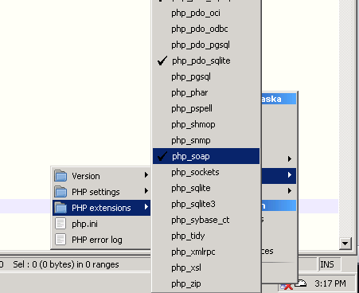
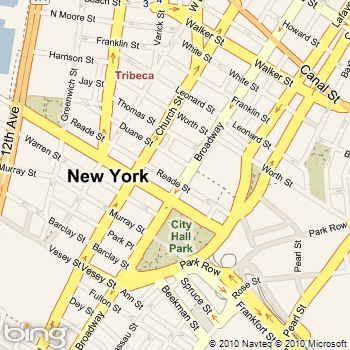
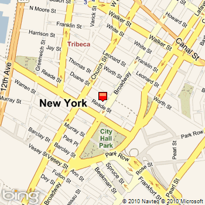
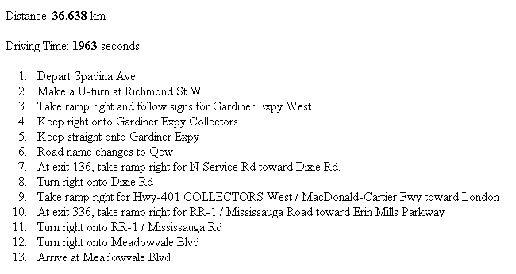
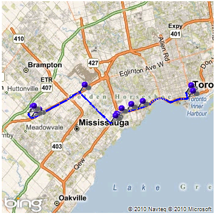
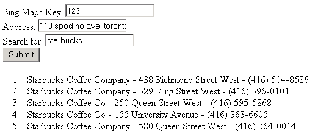
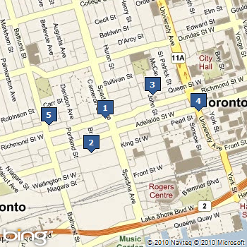

# Accessing the Bing Maps SOAP Services Using PHP
This article will describe how to write a PHP application that can interact with the [!INCLUDE[vews_product_name](../articles/includes/vews-product-name-md.md)].  
  
 The [!INCLUDE[vews_product_name](../articles/includes/vews-product-name-md.md)] are a set of four web services that allow you to access mapping functionality from your web or desktop applications using a standard SOAP API and methodology. The four web services include:  
  
-   The **Geocode Service**, which allows you to locate addresses or places on a map (geocoding) or find addresses or places that correspond to a given location or set of coordinates (reverse geocoding).  
  
-   The **Route Service**, which allows you to find driving (or walking) directions between two or more locations on a map.  
  
-   The **Search Service**, which allows you to search the Bing Maps POI (point-of-interest) database and return a list of locations based on a query string (e.g. “Starbucks near 291 Broadway, New York, NY”).  
  
-   The **Imagery Service**, which allows you to retrieve a URI to a static map image that has been generated based on parameters you provide (including map size, zoom level, center point, pushpin(s), map styles, etc.).  
  
 Because these four web services conform to the SOAP specification, they can be accessed by programs written in any language with which you can construct, send, and receive HTTP requests and responses. Most modern languages also have specific SOAP APIs or extensions available to them as well, which allows you to interact with SOAP web services without having to manually write and parse the SOAP grammar.  
  
 PHP includes an extension, php_soap, which allows you to easily work with SOAP from PHP applications. In this article, you will learn how to interact with each of the [!INCLUDE[vews_product_name](../articles/includes/vews-product-name-md.md)] from a PHP application, using the classes and methods provided in php_soap.  
  
## Setting Up Your Environment  
 Before continuing with this article, you should ensure that you have the correct software installed and environment setup to develop and host PHP pages that will connect to the [!INCLUDE[vews_product_name](../articles/includes/vews-product-name-md.md)].  
  
### Required Software  
 To work with and run the sample applications in this article, you will need a PHP-enabled web server with the php_soap extension enabled. To develop the samples, we used WampServer ([http://www.wampserver.com](http://www.wampserver.com)), a Windows-based development environment that includes Apache, PHP, and MySQL Database. It is easy to install and has everything you need to create and host PHP applications quickly and easily. After installing WampServer, you need only activate the php_soap extension by selecting it from the WampServer taskbar menu under **PHP->PHP extensions->php_soap**.  
  
 **Figure 1 - Activating the php_soap extension**  
  
   
  
 **Microsoft IIS 6 or 7** can also be used to host PHP applications, and we tested several of the examples on it to confirm that they work. If you are using IIS to host PHP, you may also want to install **FastCGI**, which improves performance of CGI applications in IIS. You can find a very detailed set of instructions for installing and configuring FastCGI and PHP at:  
  
-   IIS 6 - [http://learn.iis.net/page.aspx/247/using-fastcgi-to-host-php-applications-on-iis-60/](http://learn.iis.net/page.aspx/247/using-fastcgi-to-host-php-applications-on-iis-60/)  
  
-   IIS 7 - [http://learn.iis.net/page.aspx/246/using-fastcgi-to-host-php-applications-on-iis-7/](http://learn.iis.net/page.aspx/246/using-fastcgi-to-host-php-applications-on-iis-7/)  
  
 There are many other servers that can be configured to host PHP, and you are free to use any of those instead if you are more familiar with their functionality.  
  
 Finally, in terms of a development environment, you can use anything from a text editor such as Windows Notepad to a full-fledged PHP IDE such as PHP Designer to write your code.  
  
### PHP Starter Code  
 This article contains numerous samples of interacting with [!INCLUDE[vews_product_name](../articles/includes/vews-product-name-md.md)] using PHP. If you are already familiar with PHP, you may not need any assistance creating and setting up a PHP page in which to include your Bing Maps code. However, if you need assistance getting started, you may want to begin with the following simple PHP page, which includes a form that asks for the user’s Bing Maps key, an address to be geocoded, and a zoom level for the map to be returned.  
  
 **Listing 1 - PHP starter code for working with Bing Maps SOAP services**  
  
```  
<html>  
  <head>  
    <title>Loading the Bing Maps map using PHP and SOAP Services</title>  
  </head>  
  <body>  
    <form action="BingMaps_SOAP_GeocodeSample.php" method="post">  
      Bing Maps Key: <input type="text" name="key"   
        value="<?php echo (isset($_POST['key'])?$_POST['key']:'') ?>"><br>  
      Address: <input type="text" name="address"   
        value="<?php echo (isset($_POST['address'])?$_POST['address']:'') ?>"><br>  
      Zoom Level (1-19): <input type="text" name="zoom"   
        value="<?php echo (isset($_POST['zoom'])?$_POST['zoom']:'') ?>"><br>  
    <input type="submit" value="Submit">  
    </form>  
<?php  
 // Code goes here  
?>  
  </body>  
</html>  
  
```  
  
## Authentication  
 All [!INCLUDE[vews_product_name](../articles/includes/vews-product-name-md.md)] require authentication from the client each time they are called. In order to authenticate against any of the SOAP Services, you will need a [!INCLUDE[maps_ticket](../articles/includes/maps-ticket-md.md)]. For information about how to sign up for a Bing Maps Developer Account and get a [!INCLUDE[maps_ticket](../articles/includes/maps-ticket-md.md)], see [Getting a Bing Maps Key](http://msdn.microsoft.com/en-us/library/ff428642.aspx).  
  
 When you construct a request object, which we will discuss in the next section of this article, you must include as a parameter a **Credentials** object, which in turn includes an **ApplicationId** property, which is a string containing the Bing Maps Key. In general, the PHP code for authentication will follow the pattern shown in Listing 2.  
  
 **Listing 2 - Authenticating using a Bing Maps key**  
  
```  
// Hardcode the key into a variable, or obtain it from POST request  
$key = "YourBingMapsKey";  
// Setup a credentials ‘object’ to be included as a parameter  
$credentials = array('ApplicationId' => $key);  
// Construct a request ‘object’ that includes the credentials as a parameter  
$geocodeRequest = array(  'Credentials' => $credentials,  'Query' => "119 Spadina Avenue, Toronto");  
```  
  
 In all of the examples in this article, you will see the Bing Maps Key passed to the web service in this way.  
  
## Geocoding  
 Geocoding is the process of obtaining a location (usually represented by latitude and longitude coordinates) based on a provided address (e.g. “119 Spadina Avenue, Toronto, Ontario) or place (e.g. “CN Tower”).  
  
 Reverse geocoding allows you to find the closest address(es) or place(s) to a provided location (again, usually a set of latitude and longitude coordinates).  
  
 The [!INCLUDE[vews_product_name](../articles/includes/vews-product-name-md.md)] provides both of these functionalities via its **Geocode** and **ReverseGeocode** methods. We’ll focus mainly on the Geocode web method, but the procedures for using either are similar.  
  
### Accessing the Geocode Service  
 Accessing the Geocode Service from PHP involves the following basic steps:  
  
1.  Identify the location of the Geocode Service WSDL, which describes the available protocols and methods within the Geocode Service. You can find the current addresses for each of the four SOAP services at: [http://msdn.microsoft.com/en-us/library/cc966738(v=MSDN.10).aspx](http://msdn.microsoft.com/en-us/library/cc966738\(v=MSDN.10\).aspx). Click on any of the service URLs to open it in a separate window; the WSDL address will be listed at the top of the page. You can either download the WSDL file and access it locally (hosting it on your web server), or link directly to the Microsoft-hosted version in your code.  
  
2.  Create a SOAP Client object (using the API offered by php_soap), based on the Geocode Service WSDL.  
  
3.  Construct a Geocode request ‘object’, which includes credentials, a query (address or place), and any options.  
  
4.  Call the **Geocode** (or **ReverseGeocode**) method on your Geocode SOAP Client, passing in the request object, and store the response object in a variable.  
  
5.  Parse the response object to obtain the information you want, such as the latitude and longitude of the address you provided.  
  
### Creating and Sending a Geocode Request  
 Steps 1-4 involve creating a Geocode request object and passing it to the Geocode method on the Geocode web service. The code do perform these steps should look something like  REF _Ref260132322 \r \h Listing 3.  
  
 **Listing 3 - Creating and sending a Geocode request using a quer**  
  
```  
$key = "YourBingMapsKey";  
  
// Using a local version of the WSDL file  
$geocodeServiceWsdl = "geocodeservice.wsdl";  
  
// Construct the credentials object to be passed in with the Geocode request  
$credentials = array('ApplicationId' => $key);  
  
// Create a SOAP client for the Bing Maps SOAP Geocode service using its WSDL  
$geocodeClient = new SoapClient($geocodeServiceWsdl, array('trace' => 1));  
  
// Construct a Geocode request "object"   
$geocodeRequest = array(  
  'Credentials' => $credentials,  
  'Query' => $_POST['address']  
);  
  
// Send the Geocode request to the web service and receive a response  
try {  
  $geocodeResponse = $geocodeClient->Geocode(array('request' => $geocodeRequest));  
}  
catch(SoapFault $e)  
{  
  die('Fault occurred using Web Service: '.$e->getMessage());  
}  
  
```  
  
 Notice that we create ‘objects’ for method parameters, such as **Credentials** or **request**, by constructing them as PHP arrays with named elements.  
  
 The Geocode request we created in  REF _Ref260132322 \r \h Listing 3 uses a simple **Query** to search Bing Maps for one or more matching addresses or places. This query is just a freeform string, and can be anything from ‘291 Broadway, New York, NY’ to ‘123 Mulberry Street’ (no state or city) to ‘Empire State Building.’ The web service may return multiple results depending on how many it finds that match the query. Instead of a Query, you can also pass in an **Address** object, which is a much more complicated entity consisting of properties representing country, region, administrative district, locality (city or town), postal code, and so on. If geocoding by address, you might use code something like  REF _Ref260132356 \r \h Listing 4.  
  
 **Listing 4 -Creating and sending a Geocode request using an Address**  
  
```  
// Construct address 'object'  
$address = array(  
  'AddressLine' => "291 Broadway",  
  'Locality' => "New York"  
  'AdminDistrict' => "NY",  
  'CountryRegion' => "United States",  
  'PostalCode' => "10007"  
);  
  
// Construct a Geocode request "object" using an address instead of a query string  
$geocodeRequest = array(  
  'Credentials' => $credentials,  
  'Address' => $address  
);  
  
```  
  
 Obviously, a request using an address will return more accurate (and generally fewer) results than a query string, but also has a greater risk of returning no results if one of the specified parameters doesn’t exist.  
  
 Finally, your Geocode request can, if required, include an ‘Options’ parameter that includes additional options for the geocode, including a number of results to return (the default is 5) or a filter for the results (typically used to filter by confidence of matches). See the following link for more details on properties of the GeocodeRequest object: [http://msdn.microsoft.com/en-us/library/cc980924(v=MSDN.10).aspx](http://msdn.microsoft.com/en-us/library/cc980924\(v=MSDN.10\).aspx).  
  
 Now that we have created and sent a Geocode request, we will move on to parsing and using the results.  
  
### Getting and Parsing a Geocode Response  
 In  REF _Ref260132322 \r \h Listing 3, we stored the response from our Geocode request in a variable called $geocodeResponse. The GeocodeResponse object, by default, will contain up to five results for the provided query, each of which contains a great deal of information about the address that was geocoded.  
  
 The code for parsing a GeocodeResponse object will vary depending upon the information you need to extract and work with from the response. For example, if you wanted to retrieve the latitude and longitude of the address you specified, you could do so using the code in  REF _Ref260132883 \r \h Listing 5.  
  
 **Listing 5 - Retrieving latitude and longitude from a GeocodeResponse object**  
  
```  
// Ouput geocoded latitude and longitude of provided address  
if (is_array($geocodeResponse->GeocodeResult->Results->GeocodeResult)) {  
  if (is_array($geocodeResponse->GeocodeResult->Results->GeocodeResult[0]->  
   Locations->GeocodeLocation)) {  
    $lat = $geocodeResponse->GeocodeResult->Results->GeocodeResult[0]->  
     Locations->GeocodeLocation[0]->Latitude;  
    $lon = $geocodeResponse->GeocodeResult->Results->GeocodeResult[0]->  
     Locations->GeocodeLocation[0]->Longitude;  
  }  
  else {  
    $lat = $geocodeResponse->GeocodeResult->Results->GeocodeResult[0]->  
     Locations->GeocodeLocation->Latitude;  
    $lon = $geocodeResponse->GeocodeResult->Results->GeocodeResult[0]->  
     Locations->GeocodeLocation->Longitude;  
  }  
}  
else  
{  
  $lat = $geocodeResponse->GeocodeResult->Results->GeocodeResult->  
   Locations->GeocodeLocation[0]->Latitude;  
  $lon = $geocodeResponse->GeocodeResult->Results->GeocodeResult->  
   Locations->GeocodeLocation[0]->Longitude;  
}  
  
```  
  
 Note the frequent use of the PHP **is_array** method in  REF _Ref260132883 \r \h Listing 5. The reason for this is that the **Results** object may or may not be represented as an array in the XML that gets returned from the web service, depending upon whether or not more than one possible match was found. Similarly, the **Locations** object may contain a single **GeocodeLocation** or an array of **GeocodeLocation** objects, if the geocode search used several different matches to obtain results. In either case, if you attempt to access a non-array as an array (or vice versa), PHP will give an error and will not parse the object, so it is generally best to cover all cases with **is_array** checks.  
  
 For each GeocodeResult, you can also get:  
  
-   **Address**, an object that follows the same format described in the previous section of this article.  
  
-   **BestView**, which defines a rectangle (northeast and southwest corners) that represents the best view for this geocode result.  
  
-   **EntityType**, which indicates what type of entity the result is (Address, Road, Lake, etc.). See this link for a list of entity types: [http://msdn.microsoft.com/en-us/library/cc981001(v=MSDN.10).aspx](http://msdn.microsoft.com/en-us/library/cc981001\(v=MSDN.10\).aspx).  
  
 To see a complete description of all properties of the GeocodeResponse and GeocodeResult objects, see: [http://msdn.microsoft.com/en-us/library/cc980928(v=MSDN.10).aspx](http://msdn.microsoft.com/en-us/library/cc980928\(v=MSDN.10\).aspx).  
  
### Displaying the Geocoded Location on a Map  
 One of the most common things to do after geocoding a location is to plot it on a map. In order to display a map and plot locations on it, you need to use the Imagery web service, which allows to get a URI to a static map that has been customized based on the parameters you specify (e.g. map size, zoom level, center point, pushpins, etc.).  
  
 The Imagery service provides a **GetMapUri** method, to which you must provide one of three pieces of information:  
  
1.  A Location object (latitude and longitude) representing the **Center** of the map.  
  
2.  An array of **Pushpin** objects (**Pushpins**), which contains a collection of Locations, all of which will be represented on the map by pushpins.  
  
3.  A Location object (latitude and longitude), **MajorRoutesDestination**, which indicates that the returned map should include up to four major routes to that location.  
  
 For example, in the previous section of this article, we looked at how to use the Geocode service to geocode a location and obtain latitude and longitude coordinates. We can take those coordinates and use them to load a map in the browser with that location as its center point.  REF _Ref260230973 \r \h Listing 6 shows the code to perform this **GetMapUri** request.  
  
 **Listing 6 - Retrieving latitude and longitude from a GeocodeResponse object**  
  
```  
// Create a SOAP client for the Imagery service using the WSDL  
$imageryClient = new SoapClient($imageryServiceWsdl, array('trace' => 1));  
  
// Create a location 'object' to use as a parameter, using geocoded lat/lon  
$location = array(  
  'Latitude' => $lat,  
  'Longitude' => $lon  
);  
  
// Create an options 'object' that includes the Zoom level (taken from user input)  
$options = array(  
  'ZoomLevel' => $_POST['zoom']  
);  
  
// Construct the request 'object' for the Imagery service  
$mapUriRequest = array(  
  'Credentials' => $credentials,  
  'Center' => $location,  
  'Options' => $options  
);  
  
// Send the Imagery service request and get the URI of a map image as a response  
try {  
  $mapUriResponse = $imageryClient->GetMapUri(array('request' => $mapUriRequest));  
}  
catch(SoapFault $e)  
{  
  die('Fault occurred using Web Service: '.$e->getMessage());  
}  
  
// Display the resulting image in the browser  
echo "GetMapUriResult->Uri . "'><br>";  
  
```  
  
 This code creates a SOAP client for the Imagery service, constructs a **mapUriRequest** object, passes that object into the **GetMapUri** method of the Imagery service, and then obtains the URI of the static map from the resulting **mapUriResponse** object and displays it in the browser.  
  
 Assuming the user provided an address of “291 Broadway, New York, NY” and a zoom level of “15” using the form on our sample PHP page, this code would display the following map in the browser (when combined with the geocoding sample from the previous section):  
  
 **Figure 2 - Displaying a geocoded location on a map**  
  
   
  
 Notice that if you provide the location as a ‘Center’ parameter, it appears in the center of the map but is not indicated by a pushpin. If you wanted to include a pushpin for the geocoded location, you could change your code as shown in  REF _Ref260231009 \r \h Listing 7.  
  
 **Listing 7 – Adding a pushpin to the map**  
  
```  
// Create a pushpin 'object'  
$pushpin = array(  
  'IconStyle' => "11",  
  'Location' => $location  
);  
  
// Create an array of pushpins to use as a parameter  
$pushpins = array($pushpin);  
  
// Construct the request 'object' for the Imagery service  
$mapUriRequest = array(  
  'Credentials' => $credentials,  
  'Pushpins' => $pushpins,  
  'Options' => $options  
);  
  
```  
  
 The ‘Pushpins’ property of the request object is an array of **Pushpin** objects, each of which includes a **Location** (latitude and longitude) as well as other properties such as **IconStyle** and Label (not shown here). If you wanted to include multiple pushpins on the map, you could simply add additional items to the **$pushpins** array before including it in the request. The code in  REF _Ref260231009 \r \h Listing 7 would display the following map:  
  
 **Figure 3 - Displaying pushpins on a map**  
  
   
  
 Finally, it is worth noting that in addition to **ZoomLevel**, you can specify additional options for the map to be loaded, including (but not limited to):  
  
-   **ImageSize**, an object that contains the height and width (in pixels) of the map you want to return.  
  
-   **Style**, an enumeration that allows you to choose between Road, Aerial, or AerielWithLabels maps.  
  
 See this link for a complete description of the **MapUriRequest** object and its parameters: [http://msdn.microsoft.com/en-us/library/cc980912(v=MSDN.10).aspx](http://msdn.microsoft.com/en-us/library/cc980912\(v=MSDN.10\).aspx).  
  
 See the **Code Samples** section at the end of this article for a complete geocode PHP example.  
  
## Routing  
 Routing is the process of finding driving (or walking) directions between two or more locations on a map. The Bing Maps SOAP Route service provides a method, **CalculateRoute**, which allows you to provide a set of waypoints and get back a set of directions (a collection of instructions and “legs” making up the route) as well as raw route data that can be used to draw route information on a map.  
  
 In this section we will look at how to access the route service, construct a route request, parse a route response, and draw the waypoints and route on a map.  
  
 One thing to note before continuing is that while the Imagery service can be used to indicate route waypoints on a map (by specifying them as **Pushpin** locations), it cannot be used to draw routes (that is, lines on the map between specified points). Therefore, in the  REF _Ref260231122 \h Displaying a Route on the Map section of this article, we will use the PHP GD2 graphics library extension as well as some custom calculation methods to draw the route onto the map.  
  
### Accessing the Route Service  
 Accessing the Route Service from PHP involves the following basic steps:  
  
1.  Identify the location of the Route Service WSDL, which describes the available protocols and methods within the Route Service. You can find the current addresses for each of the four SOAP services at: [http://msdn.microsoft.com/en-us/library/cc966738(v=MSDN.10).aspx](http://msdn.microsoft.com/en-us/library/cc966738\(v=MSDN.10\).aspx). Click on any of the service URLs to open it in a separate window; the WSDL address will be listed at the top of the page. You can either download the WSDL file and access it locally (hosting it on your web server), or link directly to the Microsoft-hosted version in your code.  
  
2.  Create a SOAP Client object (using the API offered by php_soap), based on the Route Service WSDL.  
  
3.  Construct a Route request ‘object’, which includes credentials, a list of waypoints, and any options.  
  
4.  Call the **CalculateRoute** method on your Route SOAP Client, passing in the request object, and store the response object in a variable.  
  
5.  Parse the response object to obtain the information you want, which may be route legs and instructions, raw route path data, or both, depending upon what you want to do with it.  
  
### Creating and Sending a Route Request  
 Before you can send a route request, you will need to have location information (latitude and longitude) for at least two points: a start point and an end point. The **CalculateRoute** method allows you to provide multiple waypoints for routing, but for this example we will just use two.The code in  REF _Ref260231192 \r \h Listing 8 shows how to create and send a two-point route request, assuming you have already geocoded (or otherwise determined) the locations of the start and end points (as **$originLocation** and **$destLocation**, respectively).  
  
 **Listing 8 - Creating and Sending a Route Request**  
  
```  
// Create Waypoint 'objects' for the origin and destination Locations  
$origin = array(  
  'Description' => "Infusion Toronto",  
  'Location' => $originLocation  
);  
  
$destination = array(  
  'Description' => "Microsoft Canada",  
  'Location' => $destLocation  
);  
  
// Create an array of Waypoint 'objects'    
$waypoints[0] = $origin;  
$waypoints[1] = $destination;  
  
// Create an options 'object' to indicate that you want to return a RoutePath  
// Note: By default, no RoutePath is returned  
$options = array(  
  'RoutePathType' => "Points"  
);  
  
// Construct the Route request 'object'  
$routeRequest = array(  
  'Credentials' => $credentials,  
  'Waypoints' => $waypoints,  
  'Options' => $options  
);  
  
// Call the CalculateRoute method on the Route Service and get a Route response  
try {  
  $routeResponse = $routeClient->CalculateRoute(array('request' => $routeRequest));  
}  
catch(SoapFault $e)  
{  
  die('Fault occurred using Web Service: '.$e->getMessage());  
}  
  
```  
  
 One thing to note in  REF _Ref260231192 \r \h Listing 8 is that you only need to set the **RoutePathType** option if you plan to draw your route on a map locally (which we will show later in this article). If you are only interested in the directions and waypoints, you can skip this part of the code.  
  
### Getting and Parsing a Route Response  
 Once you have successfully obtained a Route response object, you can extract information from it about the route and its waypoints and itinerary. For example, the code in  REF _Ref260231242 \r \h Listing 9 can be used to determine the total distance and driving time (in kilometers and seconds, respectively) of the calculated route.  
  
 **Listing 9 - Extracting information about a calculated route**  
  
```  
$routeDistance = $routeResponse->CalculateRouteResult->Result->Summary->Distance;  
$routeTime = $routeResponse->CalculateRouteResult->Result->Summary->TimeInSeconds;  
  
echo "<p>Distance: <b>" . $routeDistance."</b> km</p>";  
echo "<p>Driving Time: <b>" . $routeTime."</b> seconds</p>";  
  
```  
  
 In addition to route summary information, the Result object also has a property named **Legs**, which contains an array of **RouteLeg** objects. There will be one **RouteLeg** object for each waypoint you specified in your request beyond the origin (e.g., if we had provided four waypoints, there would be three **RouteLeg**s in the **Legs** array). A **RouteLeg** includes:  
  
-   **Summary** information about the leg (distance and time information);  
  
-   Location data for the **ActualStart** and **ActualEnd** of the leg (useful if either provided point was not on a known road, therefore causing the service to adjust them to the nearest road);  
  
-   An **Itinerary** for the route leg, which includes **Location** information, instruction **Text**, and several other pieces of information about each step in the leg.  
  
 For example, if you want to print out the instructions for the route calculated in  REF _Ref260231192 \r \h Listing 8, you could use the following code to loop through the Itinerary and pull out the instructions for each step, putting them into an HTML ordered list:  
  
 **Listing 10 - Displaying Route instructions for a calculated route**  
  
```  
// Extract the Legs array (in this case containing a single RouteLeg) into a variable  
$routeLegs = $routeResponse->CalculateRouteResult->Result->Legs;  
  
// Determine the number of itinerary items (steps) in the route leg  
$numSteps = count($routeLegs->RouteLeg->Itinerary->ItineraryItem);  
  
// Loop through each itinerary item in the leg and output its instruction Text   
echo "<ol>";  
for ($i=0; $i < $numSteps ; $i++) {  
  $legText = $routeLegs->RouteLeg->Itinerary->ItineraryItem[$i]->Text;  
  echo "<li>".$legText."</li>";  
}  
echo "</ol>";  
  
```  
  
 The output of the code in  REF _Ref260231297 \r \h Listing 10 will look something like the following, assuming two successfully geocoded addresses.  
  
 **Figure 4 - Output of route summary information and instructions**  
  
   
  
 As previously mentioned, the route Itinerary includes actual start and end locations for each step in the route. However, you cannot use these points to draw a route on the map; they represent points in the route where instructions indicate a turn or direction, but they do not cover every curve in the road or other geographical features. If you try to use these points to draw route lines on a map, you will likely end up with lines through buildings, parks, or other non-drivable areas. In order to get a complete representation of the shape of a route, you must obtain the full list of points from the **RoutePath**, as described in the next section of this article.  
  
### Displaying a Route on the Map  
 As shown previously, the Imagery service can be used to obtain a map with multiple locations marked by pushpins. If you wanted only to indicate route steps on the map, with no lines drawn to represent roads, you could do so using the Imagery service exactly as shown in  REF _Ref260231009 \r \h Listing 7. However, the Imagery service cannot be used to draw custom routes on a map. Therefore, for the purpose of this article, we will use a different method to display a route on the map:  
  
1.  Obtain a map image using the Imagery service, with an optimal center point and zoom level (“best view”) for displaying the entire route on the map at once.  
  
2.  Draw the route lines on the map using GD2, a PHP extension for manipulating graphics. The source for these lines is the **RoutePath** object returned from our original **CalculateRoute** request.  
  
3.  Draw pushpins on the map for each step in the route instructions, also using GD2.  
  
 Note that even though the Imagery service provides the functionality to add pushpins on a map, we are going to use GD2 instead, because we do not want our route lines to appear on top of the pushpins! If we requested a map with pushpins already in place and then added lines to it, it would be graphically unappealing. In addition, using GD2 allows us to use any image as a pushpin, rather than the limited set offered by the Imagery service, so we could, in theory, add corporate logos or other custom graphics to the map and make it more attractive and usable.  
  
 **Obtaining a Map with the “Best View” for a Route**  
  
 Our first step in creating a map with a route depicted on it is to obtain a map from the Imagery service that provides a “best view” (location and zoom level) to show the route. The calculations to produce this best view are somewhat complicated, so we have created a **calculateView** method in PHP that takes in an array of points (**Location** objects with **Latitude** and **Longitude** values) and returns a **BestView** object that includes an optimal center point and zoom level. The center point and zoom level can then be used to call the Imagery service and return the appropriate map.  
  
 The PHP source code for **calculateView** is included in the downloadable source code for this article, but it is lengthy so we will not repeat it here. Once you have cut and pasted or imported the **calculateView** method into your code, you can use it to obtain a map as shown in  REF _Ref260231437 \r \h Listing 11.  
  
 **Listing 11 - Determining the best view for a route and obtaining a map image for the view**  
  
```  
// Pull the array of Locations from the RoutePath ojbect and call calculateView()  
// to get an optimal center point and zoom level  
$points = $routeResponse->CalculateRouteResult->Result->RoutePath->Points->Location;  
$bestView = calculateView($points);  
  
// Create an Imagery service request object using the provided center point and zoom    
$centerPoint = $bestView["CenterPoint"];  
  
$options = array(  
  'ZoomLevel' => $bestView["Zoom"]  
);  
  
$mapUriRequest = array(  
  'Credentials' => $credentials,  
  'Center' => $centerPoint,  
  'Options' => $options  
);  
  
// Call the GetMapUri method on the Imagery service and obtain a map    
try {  
  $mapUriResponse = $imageryClient->GetMapUri(array('request' => $mapUriRequest));  
}  
catch(SoapFault $e)  
{  
  die('Fault occurred using Web Service: '.$e->getMessage());  
}  
  
```  
  
 **Draw Route Lines on the Map**  
  
 To draw the route lines on the map, we will use a PHP extension, GD2, which contains a host of classes and methods for graphics manipulation. If you are using WampServer, you can enable the GD2 extension for PHP by selecting it (php_gd2) from the extensions list, as you did with php_soap earlier in this article.  
  
 The code in  REF _Ref260231463 \r \h Listing 12 creates a local image using the map retrieved from the Imagery service, then creates a new destination image onto which the original image and all lines and points will be “stamped.” It then loops through each point in the **RoutePath** (the collection of raw route data points) and draws a thick blue line between each point onto the destination image. In order to accomplish this, the code makes use of several custom methods (which are also included in the source code for this article but not shown here):  
  
-   **LatLongToPixel()** converts latitude and longitude coordinate values from a map to x and y pixel coordinate values on an image. This method is required in order to translate the latitude/longitude coordinates into values that will make sense to GD2 when drawing to an image, since it has no concept of geography or mapping systems and is simply working with raw pixels.  
  
-   **imagelinethick()** is a custom method that we use instead of the standard GD2 **imageline()**. While **imageline()** draws lines that are one pixel in width and difficult to see on a map, **imagelinethick()** allows you to specify a line thickness in pixels. Note that what it is actually doing is drawing filled rectangles instead of lines if the thickness specified is greater than 1. **imagelinethick()** was taken from the example code for **imageline()** on the PHP home page: [http://ca2.php.net/manual/en/function.imageline.php](http://ca2.php.net/manual/en/function.imageline.php).  
  
 Again, you will need to cut-and-paste or import these methods into your PHP code before the code in  REF _Ref260231463 \r \h Listing 12 will work.  
  
 **Listing 12 – Drawing route lines on a map using GD2**  
  
```  
// Determine map center point in lat/lon and zoom level  
$mapLatCenter = $centerPoint['Latitude'];  
$mapLonCenter = $centerPoint['Longitude'];  
$zoom = $options['ZoomLevel'];  
  
// Create a source image to work with using the GD2 imagecreatefrompng() method  
$image = imagecreatefrompng($mapUriResponse->GetMapUriResult->Uri);  
  
// Create a destination image onto which lines and pushpins will be drawn  
$dstImage = imagecreatetruecolor(imagesx($image),imagesy($image));  
  
// Determine map width and height from source image size  
$mapWidth = imagesx($image);  
$mapHeight = imagesy($image);  
  
// Call GD2 imagecopymerge() method to stamp map image onto destination image  
imagecopymerge($dstImage,$image,0,0,0,0,imagesx($image),imagesy($image),100);  
  
// Define a line colour (blue) for the route lines    
$lineColor = imagecolorallocate($dstImage,0,0,255);  
  
// Loop through each point in the RoutePath and draw lines between them  
for ($i = 0; $i < count($points)-1; $i++) {  
  
  // Determine starting and ending points for this line  
  $startLat = $points[$i]->Latitude;  
  $startLon = $points[$i]->Longitude;  
  $endLat = $points[$i+1]->Latitude;  
  $endLon = $points[$i+1]->Longitude;  
  
  // Initialize x/y variables to be used by LatLongToPixel()  
  $x1 = 0; $x2 = 0; $y1 = 0; $y2 = 0;  
  
  // Call LatLongToPixel() to convert map lat/long to pixel x/y values for start  
  // and end points of this line  
  LatLongToPixel($x1, $y1, $startLat, $startLon, $mapLatCenter, $mapLonCenter,   
   $zoom, $mapWidth, $mapHeight);  
  LatLongToPixel($x2, $y2, $endLat, $endLon, $mapLatCenter, $mapLonCenter,   
   $zoom, $mapWidth, $mapHeight);  
  
  // Call the imagelinethick() method to draw a thick blue line on the map  
  imagelinethick($dstImage,$x1,$y1,$x2,$y2,$lineColor,3);  
}    
```  
  
 **Drawing Pushpins on the Route Map**  
  
 Now that we have route lines drawn on the map, we can safely insert the pushpins on top without having to worry that route lines will be drawn over them. The code in  REF _Ref260231511 \r \h Listing 13 loops through the list of itinerary steps (not the points in the RoutePath) and places a pushpin icon on the map for each step. It uses **LatLongToPixel**, described in the previous section, to convert map coordinates to pixel coordinates for GD2 to use. Finally, the code in  REF _Ref260231511 \r \h Listing 13 saves the completed image, with route lines and pushpins, to a local file, and then displays it in the browser using a standard \ element.  
  
 **Listing 13 – Drawing pushpins on the map using GD2, and displaying the map in the browser**  
  
```  
//construct pushpins array from ItineraryItem locations  
$pushpins = array();  
  
for ($i = 0; $i < $numSteps; $i++) {  
  $pushpin = array(  
    'Location' => $routeResponse->CalculateRouteResult->Result->Legs->  
     RouteLeg->Itinerary->ItineraryItem[$i]->Location  
  );  
  $pushpins[$i] = $pushpin;  
}  
  
// Initialize x and y values that will be used by LatLongToPixel()  
$x = 0;  
$y = 0;  
  
// Create a pushpin image in GD2 from a locally stored .GIF  
$pinImage=imagecreatefromgif("pushpin.gif");  
  
// Loop through the list of pushpins and stamp each one on the map in its proper  
// location  
for ($i = 0; $i < count($pushpins); $i++) {  
  $lat = $pushpins[$i]['Location']->Latitude;  
  $lon = $pushpins[$i]['Location']->Longitude;  
  LatLongToPixel($x, $y, $lat, $lon, $mapLatCenter, $mapLonCenter,   
   $zoom, $mapWidth, $mapHeight);  
  imagecopymerge($dstImage,$pinImage,$x,$y-imagesy($pinImage),  
   0,0,imagesx($pinImage),imagesy($pinImage),100);   
}  
  
// Save the completed image to a local file    
imagepng($dstImage, "mapping.png");  
  
// Display the image in the browser using an HTML  element    
echo "<br>";  
  
```  
  
 The output from the code in Listings 11-13, when combined, should be a map image that looks something like the following.  
  
 **Figure 5 - Route and pushpins drawn on a map using GD2**  
  
   
  
 With additional code and time, you could also use GD2 to draw different pushpins representing your start and end points, or label some or all of the points with instructions.  
  
 See the **Code Samples** section at the end of this article for a complete PHP routing example.  
  
## Searching  
 The final Bing Maps SOAP web service discussed in this article is the Search Service, which allows you to search the Bing Maps database of points-of-interest (POIs) for businesses or destinations of a wide variety of types (restaurants, stores, offices, parks, etc.).  
  
 In this section, we will describe how to create a Search request, retrieve Search results, and display those results on a map.  
  
### Accessing the Search Service  
 Accessing the Search Service from PHP involves the following basic steps:  
  
1.  Identify the location of the Search Service WSDL, which describes the available protocols and methods within the Search Service. You can find the current addresses for each of the four SOAP services at: [http://msdn.microsoft.com/en-us/library/cc966738(v=MSDN.10).aspx](http://msdn.microsoft.com/en-us/library/cc966738\(v=MSDN.10\).aspx). Click on any of the service URLs to open it in a separate window; the WSDL address will be listed at the top of the page. You can either download the WSDL file and access it locally (hosting it on your web server), or link directly to the Microsoft-hosted version in your code.  
  
2.  Create a SOAP Client object (using the API offered by php_soap), based on the Search Service WSDL.  
  
3.  Construct a Search request ‘object’, which includes a query (structured or unstructured) that will be used to search the POI database.  
  
4.  Call the **Search** method on your Search SOAP Client, passing in the request object, and store the response object in a variable.  
  
5.  Parse the response object to obtain the information you want, which is typically the details of the business(es) you searched for as well as location information for each search result.  
  
### Performing a Search Using a Search Request  
 The method for accessing the Search service is very similar to that used for accessing the Geocode, Route, and Imagery services shown previously. The Search service has a single web method, **Search**, which accepts either a structured query (an object that includes an address representing the ‘where’ of the query, and a string representing the ‘what) or an unstructured query (a string that includes both ‘where’ and ‘what,’ such as “Starbucks near 119 Spadina Avenue, Toronto, ON.”  
  
 The code in  REF _Ref260231698 \r \h Listing 14 shows a simple example of constructing a Search request that uses an unstructured query, and calling the **Search** method to return a list of results. In this case, note we are using the ‘Count’ option to restrict the number of results to 5 (the default is 10). Also note that this example assumes we have modified the original HTML form shown in  REF _Ref260231715 \r \h Listing 1 to include an additional field, ‘search.’  
  
 **Listing 14 – Calling the Search service from PHP**  
  
```  
// Reference a local copy of the Search service WSDL  
$searchServiceWsdl = "searchservice.wsdl";  
  
// Store the Bing Maps key obtained from the form in a credentials 'object'      
$credentials = array('ApplicationId' => $_POST['key']);  
  
// Create a Search SOAP client using the Search service WSDL  
$searchClient = new SoapClient($searchServiceWsdl, array('trace' => 1));  
  
// Construct the options 'object', and restrict the number of results returned to 5  
$options = array(  
  'Count' => 5  
);  
  
// Construct the search request object using the 'what' and 'where' obtained from the // form  
$searchRequest = array(  
  'Credentials' => $credentials,  
  'Query' => $_POST['search']." near ".$_POST['address'],  
  'SearchOptions' => $options  
);  
  
// Call the Search() method and store the result in $searchResponse  
try {  
  $searchResponse = $searchClient->Search(array('request' => $searchRequest));  
}  
catch(SoapFault $e)  
{  
  die('Fault occurred using Web Service: '.$e->getMessage());  
}  
```  
  
 The resulting **$searchResponse** object is somewhat complicated, and the next section of this article will discuss the easiest way to extract the information you need from it.  
  
### Parsing Results from a Search Response  
 Whenever you use the Search web service to search for POIs, the result object may contain up to three distinct search result sets: one for businesses, one for collections, and one for people. For this example, we are only going to be concerned with the business result set which, in many cases, will be the only one returned.  
  
 In order to get information about the results of a search, we can start by using the following line of code to create a PHP variable representing only the set of business results returned by a search:  
  
 **Listing 15 – Obtaining business search results from a Search response object**  
  
```  
$searchResults = $searchResponse->SearchResult->ResultSets->SearchResultSet->Results->SearchResultBase;  
```  
  
 Using **$searchResults**, we can now iterate through the list of returned results and, for example, print out their names, addresses, and phone numbers in an HTML list, as shown in  REF _Ref260231762 \r \h Listing 16.  
  
 **Listing 16 – Printing information from search results**  
  
```  
// Determine the number of results available in $searchResults  
$numResults = count($searchResults);  
  
// Loop through each result, extract name, address, and phone, and output to list      
echo "<ol>";  
for ($i = 0; $i < $numResults; $i++) {  
  $resultName = $searchResults[$i]->Name;  
  $resultAddress = $searchResults[$i]->Address->AddressLine;  
  $resultPhone = $searchResults[$i]->PhoneNumber;  
  echo "<li>".$resultName." - ".$resultAddress." - ".$resultPhone."</li>";  
}  
echo "</ol>";  
```  
  
 For example, if the user entered “119 Spadina Avenue, Toronto, ON” as an address and “Starbucks” as the search string, the code in  REF _Ref260231762 \r \h Listing 16 would produce output something like the following.  
  
 **Figure 6 - Printing search results to the browser**  
  
   
  
 For business search results, you can obtain much more data about each result including distance from the center point of the search, business category, ratings and reviews (if available), the business’s website, and more. Collection and Person search results also have their own set of information that is included. To see a complete list of what is available in different types of search results, see this page: [http://msdn.microsoft.com/en-us/library/cc966776(v=MSDN.10).aspx](http://msdn.microsoft.com/en-us/library/cc966776\(v=MSDN.10\).aspx).  
  
### Displaying Search Results on the Map  
 The last thing this article will demonstrate is how to display search results on a map. As shown previously in this article, the Imagery service can be used to return a map that includes one or more pushpins. By providing the locations of our search results as pushpin locations to the Imagery service, we can have it generate a map with the appropriate center point and zoom level to show all of the results.  
  
 The code in  REF _Ref260231809 \r \h Listing 17 shows how to construct an array of pushpin objects based on the search results and display them on a map.  
  
 **Listing 17 - Displaying Search results on a map**  
  
```  
// Create and populate an array of pushpin ‘objects’ to send to Imagery service  
$pushpins = array();  
  
for ($i = 0; $i < $numResults; $i++)   
  $pp_location = array(  
 'Latitude' => $searchResults[$i]->LocationData->Locations->GeocodeLocation->Latitude,  
'Longitude' => $searchResults[$i]->LocationData->Locations->GeocodeLocation->Longitude  
  );  
  
  $pushpins[$i] = array(  
    'Label' => $i+1,  
    'Location' => $pp_location  
  );  
}  
  
// Create a SOAP Imagery client from the Imagery service WSDL    
$imageryClient = new SoapClient($imageryServiceWsdl, array('trace' => 1));  
  
// Build the Imagery service request, including the $pushpins array  
$mapUriRequest = array(  
  'Credentials' => $credentials,  
  'Pushpins' => $pushpins,  
);  
  
// Call the GetMapUri method on the Imagery service      
try {  
  $mapUriResponse = $imageryClient->GetMapUri(array('request' => $mapUriRequest));  
}  
catch(SoapFault $e)  
{  
  die('Fault occurred using Web Service: '.$e->getMessage());  
}  
  
// Output the resulting image to the browser  
echo "GetMapUriResult->Uri . "'><br>";  
```  
  
 The code in  REF _Ref260231809 \r \h Listing 17, using the same search as mentioned previously, would produce an image like the following.  
  
 **Figure 7 - Search results displayed on a map**  
  
   
  
 Notice that we have labeled the pushpins to match the list output from the previous map image so that it is easy for users to determine which pushpin represents which Starbucks location.  
  
 See the **Code Samples** section at the end of this article for a complete PHP search  example.  
  
## Conclusions and Further Reading  
 This article has shown how the complete functionality of all four [!INCLUDE[vews_product_name](../articles/includes/vews-product-name-md.md)] can be accessed and used using PHP and the php_soap extension. We have also shown how you can expand on the power of the Bing Maps Imagery service using the php_gd2 extension to add custom pushpins and route lines to your map imagery.  
  
 This article is not a comprehensive guide to every class and method offered by the Bing Maps SOAP SDK.  
  
 You can find full SDK documentation at: [http://msdn.microsoft.com/en-us/library/cc980922(v=MSDN.10).aspx](http://msdn.microsoft.com/en-us/library/cc980922\(v=MSDN.10\).aspx)  
  
 You can access an API reference for each of the four services from: [http://msdn.microsoft.com/en-us/library/cc966763(v=MSDN.10).aspx](http://msdn.microsoft.com/en-us/library/cc966763\(v=MSDN.10\).aspx)  
  
 Finally, this article owes a great deal to the advice of Jonathan Ng, a Bing Maps expert working for Infusion Development in Toronto. Jon has written several articles that provide additional introductions for working with PHP (and many other languages) and Bing Maps, and you can find his Bing Maps Blog at [http://j-ng.spaces.live.com/](http://j-ng.spaces.live.com/).  
  
 The author of this article is Craig Wills at [Infusion Development](http://www.infusion.com/).  
  
## Code Samples  
 The following complete code samples reflect the code described in this article.  
  
### Geocode Service Sample  
 Save this sample to a file named BingMaps_SOAP_GeocodeSample.php. You will also need the BingMapsHelperFunctions code provided later in this section.  
  
```  
<html>  
  <head>  
    <title>Loading the Bing Maps map using PHP and SOAP Services</title>  
  </head>  
  <body>  
  <form action="BingMaps_SOAP_GeocodeSample.php" method="post">  
    Bing Maps Key: <input type="text" name="key" value="<?php echo (isset($_POST['key'])?$_POST['key']:'') ?>"><br>  
    Address: <input type="text" name="address" value="<?php echo (isset($_POST['address'])?$_POST['address']:'') ?>"><br>  
    Zoom Level (1-19): <input type="text" name="zoom" value="<?php echo (isset($_POST['zoom'])?$_POST['zoom']:'') ?>"><br>  
    <input type="submit" value="Submit">  
  </form>  
<?php  
  if(isset($_POST['key']) && isset($_POST['address']) && isset($_POST['zoom']))  
  {  
    // Using local versions of WSDL files  
    $geocodeServiceWsdl = "geocodeservice.wsdl";  
    $imageryServiceWsdl = "imageryservice.wsdl";  
  
    $credentials = array('ApplicationId' => $_POST['key']);  
  
    // Start geocode  
    echo "<p>Starting geocode...</p>";  
  
    // Create a SOAP client for the Bing Maps SOAP Geocode service using its WSDL  
    $geocodeClient = new SoapClient($geocodeServiceWsdl, array('trace' => 1));  
  
    // Construct a request "object"   
    $geocodeRequest = array(  
      'Credentials' => $credentials,  
      'Query' => $_POST['address']  
    );  
  
    // Send the Geocode request to the web service and receive a response  
    try {  
      $geocodeResponse = $geocodeClient->Geocode(array('request' => $geocodeRequest));  
    }  
    catch(SoapFault $e)  
    {  
      die('Fault occurred using Web Service: '.$e->getMessage());  
    }  
  
    // Ouput geocoded latitude and longitude of provided address  
    if (is_array($geocodeResponse->GeocodeResult->Results->GeocodeResult)) {  
      if (is_array($geocodeResponse->GeocodeResult->Results->GeocodeResult[0]->Locations->GeocodeLocation)) {  
        $lat = $geocodeResponse->GeocodeResult->Results->GeocodeResult[0]->Locations->GeocodeLocation[0]->Latitude;  
        $lon = $geocodeResponse->GeocodeResult->Results->GeocodeResult[0]->Locations->GeocodeLocation[0]->Longitude;  
      }  
      else {  
        $lat = $geocodeResponse->GeocodeResult->Results->GeocodeResult[0]->Locations->GeocodeLocation->Latitude;  
        $lon = $geocodeResponse->GeocodeResult->Results->GeocodeResult[0]->Locations->GeocodeLocation->Longitude;  
      }  
    }  
    else  
    {  
      $lat = $geocodeResponse->GeocodeResult->Results->GeocodeResult->Locations->GeocodeLocation[0]->Latitude;  
      $lon = $geocodeResponse->GeocodeResult->Results->GeocodeResult->Locations->GeocodeLocation[0]->Longitude;  
    }  
    echo "<p>Latitude: <b>" . $lat . "</b></p>";  
    echo "<p>Longitude: <b>" . $lon . "</b></p>";  
  
    // Display the geocoded point on the map  
    echo "<p>Starting get image...</p>";  
  
    // Create a SOAP client for the Imagery service  
    $imageryClient = new SoapClient($imageryServiceWsdl, array('trace' => 1));  
  
    // Create a location 'object' to use as a parameter, using geocoded lat/lon  
    $location = array(  
      'Latitude' => $lat,  
      'Longitude' => $lon  
    );  
  
    // Create options 'object' including zoom level and pushpin to use  
    $options = array(  
      'ZoomLevel' => $_POST['zoom']  
    );  
  
    // Create a pushpin 'object'  
    $pushpin = array(  
      'IconStyle' => "11",  
      'Location' => $location  
    );  
  
    // Create an array of pushpins to use as a parameter  
    $pushpins = array($pushpin);  
  
    // Construct the request 'object' for the Imagery service  
    $mapUriRequest = array(  
      'Credentials' => $credentials,  
      'Pushpins' => $pushpins,  
      'Options' => $options  
    );  
  
    // Send the Imagery service request and get the URI of a static map image as a response  
    try {  
      $mapUriResponse = $imageryClient->GetMapUri(array('request' => $mapUriRequest));  
    }  
    catch(SoapFault $e)  
    {  
        die('Fault occurred using Web Service: '.$e->getMessage());  
    }  
  
    // Display the resulting image in the browser  
    echo "GetMapUriResult->Uri . "'><br>";  
  }  
  else  
  {  
    echo "<p>Please enter your Bing Maps key, Address, and a Zoom Level from 1-19, then click Submit.</p>";  
  }  
?>  
  </body>  
</html>  
  
```  
  
### Route Service Sample  
 Save this sample to a file named BingMaps_SOAP_RouteSample.php. You will also need the BingMapsHelperFunctions code provided later in this section.  
  
 This sample also uses the following gif as pushpin.gif.  
  
   
  
```  
<html>  
  <head>  
    <title>Routing using PHP and SOAP Services</title>  
  </head>  
  <body>  
  <form action="BingMaps_SOAP_RouteSample.php" method="post">  
    Bing Maps Key: <input type="text" name="key" value="<?php echo (isset($_POST['key'])?$_POST['key']:'') ?>"><br>  
    Origin Address: <input type="text" name="origin" value="<?php echo (isset($_POST['origin'])?$_POST['origin']:'') ?>"><br>  
    Destination Address: <input type="text" name="destination" value="<?php echo (isset($_POST['destination'])?$_POST['destination']:'') ?>"><br>  
    <input type="submit" value="Submit">  
  </form>  
<?php  
  
  include 'BingMapsHelperFunctions.php';  
  
  if(isset($_POST['key']) && isset($_POST['origin']) && isset($_POST['destination']))  
  {  
    $mapWidth = 350;  
    $mapHeight = 350;  
  
    // Using local versions of WSDL files  
    $geocodeServiceWsdl = "geocodeservice.wsdl";  
    $imageryServiceWsdl = "imageryservice.wsdl";  
    $routeServiceWsdl = "routeservice.wsdl";  
  
    $credentials = array('ApplicationId' => $_POST['key']);  
  
    // start routing  
    echo "<p>Starting routing...</p>";  
  
    $routeClient = new SoapClient($routeServiceWsdl, array('trace' => 1));  
  
    // get origin   
    echo "<p>Getting origin location...</p>";  
  
    $geocodeClient = new SoapClient($geocodeServiceWsdl, array('trace' => 1));  
  
    $geocodeRequest = array(  
      'Credentials' => $credentials,  
      'Query' => $_POST['origin']  
    );  
  
    try {  
      $geocodeOriginResponse = $geocodeClient->Geocode(array('request' => $geocodeRequest));  
    }  
    catch(SoapFault $e)  
    {  
      die('Fault occurred using Web Service: '.$e->getMessage());  
    }  
  
    // get destination  
    echo "<p>Getting destination location...</p>";  
  
    $geocodeRequest = array(  
      'Credentials' => $credentials,  
      'Query' => $_POST['destination']  
    );  
  
    try {  
      $geocodeDestinationResponse = $geocodeClient->Geocode(array('request' => $geocodeRequest));  
    }  
    catch(SoapFault $e)  
    {  
      die('Fault occurred using Web Service: '.$e->getMessage());  
    }  
  
  if (is_array($geocodeOriginResponse->GeocodeResult->Results->GeocodeResult)) {      
    $originLocation = $geocodeOriginResponse->GeocodeResult->Results->GeocodeResult[0]->Locations->GeocodeLocation[0];  
   }  
  else {  
    $originLocation = $geocodeOriginResponse->GeocodeResult->Results->GeocodeResult->Locations->GeocodeLocation[0];  
  }  
  
  if (is_array($geocodeDestinationResponse->GeocodeResult->Results->GeocodeResult)) {  
    $destLocation = $geocodeDestinationResponse->GeocodeResult->Results->GeocodeResult[0]->Locations->GeocodeLocation[0];  
  }  
  else {  
    $destLocation = $geocodeDestinationResponse->GeocodeResult->Results->GeocodeResult->Locations->GeocodeLocation[0];  
  }  
  
  echo "<p>Origin latitude: <b>".$originLocation->Latitude."</b></p>";  
  echo "<p>Origin longitude: <b>".$originLocation->Longitude."</b></p>";  
  echo "<p>Destination latitude: <b>".$destLocation->Latitude."</b></p>";  
  echo "<p>Destination longitude: <b>".$destLocation->Longitude."</b></p>";  
  
  echo "<p>Constructing and sending routing request...</p>";  
  
  $origin = array(  
    'Location' => $originLocation  
  );  
  
  $destination = array(  
    'Location' => $destLocation  
  );  
  
  $waypoints[0] = $origin;  
  $waypoints[1] = $destination;  
  
  $options = array(  
    'RoutePathType' => "Points"  
  );  
  
  $routeRequest = array(  
    'Credentials' => $credentials,  
    'Waypoints' => $waypoints,  
    'Options' => $options  
  );  
  
  try {  
    $routeResponse = $routeClient->CalculateRoute(array('request' => $routeRequest));  
  }  
  catch(SoapFault $e)  
  {  
    die('Fault occurred using Web Service: '.$e->getMessage());  
  }  
  
  $routeDistance = $routeResponse->CalculateRouteResult->Result->Summary->Distance;  
  $routeTime = $routeResponse->CalculateRouteResult->Result->Summary->TimeInSeconds;  
  
  echo "<p>Distance: <b>" . $routeDistance."</b> km</p>";  
  echo "<p>Driving Time: <b>" . $routeTime."</b> seconds</p>";  
  
  //echo "<p>Get and print route descriptions...</p>";  
  
  $routeLegs = $routeResponse->CalculateRouteResult->Result->Legs;  
  $numSteps = count($routeLegs->RouteLeg->Itinerary->ItineraryItem);  
  
  echo "<ol>";  
  for ($i=0; $i < $numSteps ; $i++) {  
    $legText = $routeLegs->RouteLeg->Itinerary->ItineraryItem[$i]->Text;  
    echo "<li>".$legText."</li>";  
  }  
  echo "</ol>";  
  
  // Show route on map  
  echo "<p>Show route on map...</p>";  
  
  //construct pushpins array  
  $pushpins = array();  
  
  for ($i = 0; $i < $numSteps; $i++) {  
    $pushpin = array(  
     'Location' => $routeResponse->CalculateRouteResult->Result->Legs->RouteLeg->Itinerary->ItineraryItem[$i]->Location  
    );  
    $pushpins[$i] = $pushpin;  
  }  
  
  //calculate best view for map and get map image  
  $points = $routeResponse->CalculateRouteResult->Result->RoutePath->Points->Location;  
  $bestView = calculateView($points);  
  
  $centerPoint = $bestView["CenterPoint"];  
  
  $options = array(  
    'ZoomLevel' => $bestView["Zoom"]  
  );  
  
  $mapUriRequest = array(  
    'Credentials' => $credentials,  
    'Center' => $centerPoint,  
    'Options' => $options  
  );  
  
  // Create a SOAP client for the Imagery service  
  $imageryClient = new SoapClient($imageryServiceWsdl, array('trace' => 1));  
  
  try {  
    $mapUriResponse = $imageryClient->GetMapUri(array('request' => $mapUriRequest));  
  }  
  catch(SoapFault $e)  
  {  
      die('Fault occurred using Web Service: '.$e->getMessage());  
  }  
  
  // Draw points and route on map using GD2  
  $mapLatCenter = $centerPoint['Latitude'];  
  $mapLonCenter = $centerPoint['Longitude'];  
  $zoom = $options['ZoomLevel'];  
  $image = imagecreatefrompng($mapUriResponse->GetMapUriResult->Uri);  
  $mapWidth = imagesx($image);  
  $mapHeight = imagesy($image);  
  $dstImage = imagecreatetruecolor(imagesx($image),imagesy($image));  
  $pinImage=imagecreatefromgif("pushpin.gif");  
  $x = 0;  
  $y = 0;  
  
  imagecopymerge($dstImage,$image,0,0,0,0,imagesx($image),imagesy($image),100);  
  
  $lineColor = imagecolorallocate($dstImage,0,0,255);  
  
  for ($i = 0; $i < count($points)-1; $i++) {  
    $startLat = $points[$i]->Latitude;  
    $startLon = $points[$i]->Longitude;  
    $endLat = $points[$i+1]->Latitude;  
    $x1 = 0; $x2 = 0; $y1 = 0; $y2 = 0;  
    LatLongToPixel($x1, $y1, $startLat, $startLon, $mapLatCenter, $mapLonCenter, $zoom, $mapWidth, $mapHeight);  
    LatLongToPixel($x2, $y2, $endLat, $endLon, $mapLatCenter, $mapLonCenter, $zoom, $mapWidth, $mapHeight);  
    imagelinethick($dstImage,$x1,$y1,$x2,$y2,$lineColor,3);  
  }    
  
  for ($i = 0; $i < count($pushpins); $i++) {  
    $lat = $pushpins[$i]['Location']->Latitude;  
    $lon = $pushpins[$i]['Location']->Longitude;  
    LatLongToPixel($x, $y, $lat, $lon, $mapLatCenter, $mapLonCenter, $zoom, $mapWidth, $mapHeight);  
    imagecopymerge($dstImage,$pinImage,$x,$y-imagesy($pinImage),0,0,imagesx($pinImage),imagesy($pinImage),100);   
  }  
  
  unlink("mapping.png");  
  imagepng($dstImage, "mapping.png");  
  
  echo "<br>";  
  }  
  else  
  {  
    echo "<p>Please enter your Bing Maps key, an origin address, and a destination address, then click Submit.</p>";  
}  
  
?>  
  </body>  
</html>  
```  
  
### Search Service Sample  
 Save this sample to a file named BingMaps_SOAP_SearchSample.php. You will also need the BingMapsHelperFunctions code provided later in this section.  
  
```  
<html>  
  <head>  
    <title>Searching using PHP and SOAP Services</title>  
  </head>  
  <body>  
  <form action="BingMaps_SOAP_SearchSample.php" method="post">  
    Bing Maps Key: <input type="text" name="key" value="<?php echo (isset($_POST['key'])?$_POST['key']:'') ?>"><br>  
    Address: <input type="text" name="address" value="<?php echo (isset($_POST['address'])?$_POST['address']:'') ?>"><br>  
    Search for: <input type="text" name="search" value="<?php echo (isset($_POST['search'])?$_POST['search']:'') ?>"><br>  
    <input type="submit" value="Submit">  
  </form>  
<?php  
  include 'BingMapsHelperFunctions.php';  
  
  if(isset($_POST['key']) && isset($_POST['address']) && isset($_POST['search']))  
  {  
    // Using local versions of WSDL files  
    $geocodeServiceWsdl = "geocodeservice.wsdl";  
    $imageryServiceWsdl = "imageryservice.wsdl";  
    $searchServiceWsdl = "searchservice.wsdl";  
  
    $mapWidth = 350;  
    $mapHeight = 350;  
  
    $credentials = array('ApplicationId' => $_POST['key']);  
  
    $searchClient = new SoapClient($searchServiceWsdl, array('trace' => 1));  
  
    $options = array(  
      'Count' => 5  
    );  
  
    $searchRequest = array(  
      'Credentials' => $credentials,  
      'Query' => $_POST['search']." near ".$_POST['address'],  
      'SearchOptions' => $options  
    );  
  
    try {  
      $searchResponse = $searchClient->Search(array('request' => $searchRequest));  
    }  
    catch(SoapFault $e)  
    {  
      die('Fault occurred using Web Service: '.$e->getMessage());  
    }  
  
    $searchResults = $searchResponse->SearchResult->ResultSets->SearchResultSet->Results->SearchResultBase;  
  
    // Print Result names, addresses, and phone numbers  
    $numResults = count($searchResults);  
  
    echo "<ol>";  
    for ($i = 0; $i < $numResults; $i++) {  
      $resultName = $searchResults[$i]->Name;  
      $resultAddress = $searchResults[$i]->Address->AddressLine;  
      $resultPhone = $searchResults[$i]->PhoneNumber;  
  
      echo "<li>".$resultName." - ".$resultAddress." - ".$resultPhone."</li>";  
    }  
    echo "</ol>";  
  
    // Display search results on a map  
    $pushpins = array();  
  
    for ($i = 0; $i < $numResults; $i++) {  
      $pp_location = array(  
        'Latitude' => $searchResults[$i]->LocationData->Locations->GeocodeLocation->Latitude,  
        'Longitude' => $searchResults[$i]->LocationData->Locations->GeocodeLocation->Longitude  
      );  
  
      $pushpins[$i] = array(  
        'IconStyle' => "1",  
        'Label' => $i+1,  
        'Location' => $pp_location  
      );  
    }  
  
    $imageryClient = new SoapClient($imageryServiceWsdl, array('trace' => 1));  
  
    $mapUriRequest = array(  
      'Credentials' => $credentials,  
      'Pushpins' => $pushpins,  
    );  
  
    try {  
      $mapUriResponse = $imageryClient->GetMapUri(array('request' => $mapUriRequest));  
    }  
    catch(SoapFault $e)  
    {  
      die('Fault occurred using Web Service: '.$e->getMessage());  
    }  
  
    echo "GetMapUriResult->Uri . "'><br>";  
  }  
  else  
  {  
    echo "<p>Please enter your Bing Maps key, Address, and what you want to search for, then click Submit.</p>";  
  }  
  
 ?>  
  </body>  
</html>  
```  
  
### BingMapsHelperFunctions Code Sample  
 Save this code to a file named BingMapsHelperFunctions.php. This PHP code is referenced in the above samples.  
  
```  
<?php  
  
    function LatLongToPixel(&$x, &$y, $lat, $long, $clat, $clong, $zoom, $mapWidth, $mapHeight)  
    {  
        $sinLatCenter = sin($clat * pi() / 180);  
        $pixelXCenter = ($clong + 180) / 360 * 256 * pow(2,$zoom);  
        $pixelYCenter = (0.5 - log((1 + $sinLatCenter) / (1-$sinLatCenter)) / (4*pi())) * 256 * pow(2,$zoom);  
  
        $sinLat = sin($lat * pi() / 180);  
        $pixelX = ($long + 180) / 360 * 256 * pow(2,$zoom);  
        $pixelY = (0.5 - log((1 + $sinLat) / (1-$sinLat)) / (4*pi())) * 256 * pow(2,$zoom);  
  
        $topLeftPixelX = $pixelXCenter - $mapWidth / 2;  
        $topLeftPixelY = $pixelYCenter - $mapHeight /2;  
        $x = $pixelX - $topLeftPixelX;  
        $y = $pixelY - $topLeftPixelY;  
    }  
  
    function haversineDistance($lat1, $lon1, $lat2, $lon2)  
    {  
        $radius = 6371;  
        $factor = pi() / 180;  
        $dLat = ($lat2-$lat1)*$factor;  
        $dLon = ($lon2-$lon1)*$factor;  
        $a = sin($dLat/2) * sin($dLat/2) + cos($lat1*$factor) * cos($lat2*$factor) * sin($dLon/2) * sin($dLon/2);  
        $c = 2 * atan2(sqrt($a), sqrt(1-$a));  
        return $radius*$c;  
    }  
  
    function calculateView($points)  
    {  
  
      global $mapWidth, $mapHeight;  
  
      $maxLat = -90;  
      $minLat = 90;  
      $maxLon = -180;  
      $minLon = 180;  
  
      $defaultScales = array(78.27152, 39.13576, 19.56788, 9.78394, 4.89197,   
                          2.44598, 1.22299, 0.61150, 0.30575, 0.15287, .07644,   
                          0.03822, 0.01911, 0.00955, 0.00478, 0.00239, 0.00119,   
                          0.0006, 0.0003);  
  
      // calculate bounding box for array of locations  
      for($i = 0; $i < count($points); $i++)  
      {  
        if ($points[$i]->Latitude > $maxLat) $maxLat = $points[$i]->Latitude;  
        if ($points[$i]->Latitude < $minLat) $minLat = $points[$i]->Latitude;  
        if ($points[$i]->Longitude > $maxLon) $maxLon = $points[$i]->Longitude;  
        if ($points[$i]->Longitude < $minLon) $minLon = $points[$i]->Longitude;          
      }  
  
      // calculate center coordinate of bounding box  
      $centerLat = ($maxLat + $minLat) / 2;  
      $centerLon = ($maxLon + $minLon) / 2;  
  
      // create a Location object for the center point  
      $centerPoint = array(  
        'Latitude' => $centerLat,  
        'Longitude' => $centerLon  
      );  
  
      // want to calculate the distance in km along the center latitude between the two longitudes  
      $meanDistanceX = haversineDistance($centerLat, $minLon, $centerLat, $maxLon);  
  
      // want to calculate the distance in km along the center longitude between the two latitudes  
      $meanDistanceY = haversineDistance($maxLat, $centerLon, $minLat, $centerLon) * 2;  
  
      // calculate the X and Y scales  
      $meanScaleValueX = $meanDistanceX / $mapWidth;  
      $meanScaleValueY = $meanDistanceY / $mapHeight;  
  
      // gets the largest scale value to work with  
      if ($meanScaleValueX > $meanScaleValueY)   
        $meanScale = $meanScaleValueX;  
      else  
        $meanScale = $meanScaleValueY;  
  
      // initialize zoom level variable  
      $zoom = 1;  
  
      // calculate zoom level  
      for ($i = 1; $i < 19; $i++) {  
        if ($meanScale >= $defaultScales[$i]) {$zoom = $i; break;}  
      }  
  
      // return a BestView "object" with the center point and zoom level to use  
      $bestView = array(  
        'CenterPoint' => $centerPoint,  
        'Zoom' => $zoom  
      );  
  
      return $bestView;  
    }  
  
    function imagelinethick($image, $x1, $y1, $x2, $y2, $color, $thick = 1)  
    {  
    /* this way it works well only for orthogonal lines  
    imagesetthickness($image, $thick);  
    return imageline($image, $x1, $y1, $x2, $y2, $color);  
    */  
    if ($thick == 1) {  
        return imageline($image, $x1, $y1, $x2, $y2, $color);  
    }  
    $t = $thick / 2 - 0.5;  
    if ($x1 == $x2 || $y1 == $y2) {  
        return imagefilledrectangle($image, round(min($x1, $x2) - $t), round(min($y1, $y2) - $t),   
                                   round(max($x1, $x2) + $t), round(max($y1, $y2) + $t), $color);  
    }  
    $k = ($y2 - $y1) / ($x2 - $x1); //y = kx + q  
    $a = $t / sqrt(1 + pow($k, 2));  
    $points = array(  
        round($x1 - (1+$k)*$a), round($y1 + (1-$k)*$a),  
        round($x1 - (1-$k)*$a), round($y1 - (1+$k)*$a),  
        round($x2 + (1+$k)*$a), round($y2 - (1-$k)*$a),  
        round($x2 + (1-$k)*$a), round($y2 + (1+$k)*$a),  
    );  
    imagefilledpolygon($image, $points, 4, $color);  
    return imagepolygon($image, $points, 4, $color);  
    }  
  
?>  
```