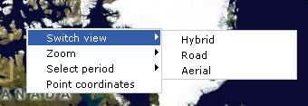

# Adding Your Own Context Menu
> [!CAUTION]
>  The content in this article may still be applicable to the current version of the [!INCLUDE[vemc_product_name](../articles/includes/vemc-product-name-md.md)], but it uses a previous version of the [!INCLUDE[vemc_product_name](../articles/includes/vemc-product-name-md.md)] which is no longer supported. More information about the current version of the [!INCLUDE[vemc_product_name](../articles/includes/vemc-product-name-md.md)] is found in the [Bing Map Control SDK](http://msdn.microsoft.com/en-us/library/bb429619.aspx).  
  
 In this tutorial I'll explain how to add your own context menu (right click popup menu) to your [!INCLUDE[ve_product_name](../articles/includes/ve-product-name-md.md)] application. I have used this technique in my [MapStats application](http://www.viavirtualearth.com/VVE/Gallery/MapStats.ashx).  You can find the complete HTML page at the end of the article.  
  
 It will look like this when you right click the map:  
  
   
  
 The `VEMap` control exposes an `onContextMenu` event that we can use to trigger the creation of our map.  We can 'hook' our menu display callback method to this event and position and display our map whenever a user right clicks on the map control.  We also have to make our popup menu disappear after the user has performed an action.  Unfortunately, the `VEMap` control no longer gathers all global events, so we have to add a line to call our menu removal function into each of our menu events.  
  
 Let's start with a simple page showing a map:  
  
```  
<html>  
<head>  
<script src="http://dev.virtualearth.net/mapcontrol/v4/mapcontrol.js"></script>  
<script>  
  var map;  
  function GetMap()  
  {  
    map = new VEMap('myMap');  
    map.LoadMap();  
  }  
</script>  
  
</head>  
<body onload="GetMap();">  
  <div id='myMap'   
    style="position:relative; width:400px; height:400px;"></div>  
</body>  
```  
  
 The next step is to attach a JavaScript callback to the `oncontextmenu` event.  Add the following line of code to the end of the `GetMap` function:  
  
```  
map.AttachEvent('oncontextmenu', showPopupMenu);  
```  
  
 Now we need to create the `showPopupMenu` function:  
  
```  
function showPopupMenu(e)  
{  
  var latlong = map.LatLongToPixel(new VELatLong(e.view.LatLong.Latitude,e.view.LatLong.Longitude));  
  var x = map.GetLeft();  
  var y = map.GetTop();  
  
  var menu = document.getElementById('popupmenu');  
  menu.style.display='block'; //Showing the menu  
  menu.style.left = latlong.x + x; //Positioning the menu  
  menu.style.top = latlong.y + y;  
}  
```  
  
 This method will move the contents of the 'popupmenu' HTML element to the current mouse position.  We also need another method to make the menu disappear.  Add the following code to your file:  
  
```  
function hidePopupMenu()  
{  
  var menu = document.getElementById('popupmenu').style.display='none';  
}  
```  
  
 In order to make the actual menu in the screenshot, we need a couple of images, and some CSS.  Copy the following to your CSS file (yes, all this for the menus):  
  
```  
/* The gifs can be found at http://www.msgweb.nl/mapstats/view/drop_down_triangle.gif,  
   and http://www.msgweb.nl/mapstats/view/drop_down_triangle_hover.gif.  
   please copy them to your own server. */  
  
ul, li{margin:0;padding:0;}  
  
ul.pmenu {  
        position:absolute;  
         margin: 0;  
         padding: 1px;  
         list-style: none;  
         width: 150px; /* Width of Menu Items */  
         border: 1px solid #ccc;  
        background:white;  
        display:none;  
         z-index:10;  
}  
  
ul.pmenu li {  
         position: relative;  
}  
  
ul.pmenu li ul {  
         position: absolute;  
         left: 150px; /* Set 1px less than menu width */  
         top: 0;  
         display: none;  
         z-index:10;  
}  
  
/* Styles for Menu Items */  
ul.pmenu li a {  
         display: block;  
         text-decoration: none;  
         color: black;  
         padding: 2px 5px 2px 20px;  
}  
  
ul.pmenu li a:hover {  
    background:#335EA8;  
    color:white;  
}  
  
ul.pmenu li a.parent {  
    background:url('drop_down_triangle.gif') no-repeat 140px 4px;   
}  
ul.pmenu li a.parent:hover {  
    background:#335EA8 url('drop_down_triangle_hover.gif') no-repeat 140px 4px;  
}  
  
/* IE \*/  
* html ul.pmenu li { float: left; height: 1%; }  
* html ul.pmenu li a { height: 1%; }  
* html ul.pmenu li ul {left:147px;}  
/* End */  
  
ul.pmenu li:hover ul, ul.pmenu li.over ul { display: block; } /* The magic */  
ul.pmenu li ul{left:150px;}  
```  
  
 Now, we need to add the actual menu to your HTML code. A basic menu looks like this (add it to your HTML body):  
  
```  
<ul id="popupmenu" class="pmenu">  
  <li><a href="#" onclick='' class="parent">Switch view</a>  
  <ul class="pmenu">  
    <li><a href="#"   
      onclick="map.SetMapStyle('h');hidePopupMenu()">Hybrid</a></li>  
    <li><a href="#"   
      onclick="map.SetMapStyle('r');hidePopupMenu()">Road</a></li>  
    <li><a href="#"   
      onclick="map.SetMapStyle('a');hidePopupMenu()">Aerial</a></li>  
  </ul>  
  </li>  
  <li><a href="#" onclick='' class="parent">Zoom</a>  
  <ul class="pmenu">  
    <li><a href="#"   
      onclick="map.ZoomIn();hidePopupMenu()">In</a></li>  
    <li><a href="#"   
      onclick="map.ZoomOut();hidePopupMenu()">Out</a></li>  
  </ul>  
  </li>  
  <li><a href="#" onclick="alert('Map is centered on:  ' +   
    map.GetCenter());hidePopupMenu();">Point coordinates</a></li>  
</ul>  
```  
  
 You will not that the `onlcick` methods for each menu item perform some JavaScript calls against our global map object.  Also, ever menu item makes a call to `hidePopupMenu` in order to close the menu after the other actions complete.  
  
 We have to make one more change to make our menu work properly in Internet Explorer.  Basically, we have to add functions to switch the style when the user hovers over the menu item.  Rather than manually add the calls to each menu item, we will run a small bit of code at the end of our `GetMap` function:  
  
```  
navRoot = document.getElementById("popupmenu");  
var items = navRoot.getElementsByTagName('li');  
for (i=0; i<items.length; i++)  
{  
  node = items[i];  
  if (node.nodeName=="LI")  
  {  
  node.onmouseover = function()  
  {  
    this.className+=" over"; //Show the submenu  
  }  
  node.onmouseout=function()  
  {  
    if (this.className.indexOf('pmenu') > 0)  
    {  
    this.className="pmenu";  
    }  
    else {  
    this.className = "";  
    }  
  }  
  }  
}  
```  
  
 At this point, our menu should work correctly for any [!INCLUDE[ve_product_name](../articles/includes/ve-product-name-md.md)] application in 2D mode.  However, because of the way that Internet Explorer displays embedded ActiveX controls, our menu will not work the way we expect in 3D mode.  The  menu appears behind the 3D map control, making it unusable.  
  
 I hope you find this tutorial useful. If you've got any questions, feel free to contact me.  The HTML/CSS list menu technique used in this article can be found at [A List Apart](http://www.alistapart.com/).  Good luck with your application!  
  
 This is a revision of an original article contributed by [Yousef El-Dardiry](http://www.msgweb.nl/en/).  The revisions were performed by [Robert McGovern MVP (Bing Maps/MapPoint)](https://mvp.support.microsoft.com/profile=A9159573-40DB-4BD1-A079-D57C675E1766).  
  
```  
<html>  
<head>  
<style type="text/css">  
  ul, li{margin:0;padding:0;}  
  
  ul.pmenu {  
    position:absolute;  
    margin: 0;  
    padding: 1px;  
    list-style: none;  
    width: 150px; /* Width of Menu Items */  
    border: 1px solid #ccc;  
    background:white;  
    display:none;  
    z-index:10;  
  }  
  
  ul.pmenu li {position: relative;}  
  
  ul.pmenu li ul {  
    position: absolute;  
    left: 150px; /* Set 1px less than menu width */  
    top: 0;  
    display: none;  
    z-index:10;  
  }  
  
  /* Styles for Menu Items */  
  ul.pmenu li a {  
    display: block;  
    text-decoration: none;  
    color: black;  
    padding: 2px 5px 2px 20px;  
  }  
  
  ul.pmenu li a:hover {  
    background:#335EA8;  
    color:white;  
  }  
  
  ul.pmenu li a.parent {  
    background:url('drop_down_triangle.gif') no-repeat 140px 4px;  
  }  
  ul.pmenu li a.parent:hover {  
    background:#335EA8 url('drop_down_triangle_hover.gif') no-repeat 140px 4px;  
  }  
  
  /* IE \*/  
  * html ul.pmenu li { float: left; height: 1%; }  
  * html ul.pmenu li a { height: 1%; }  
  * html ul.pmenu li ul {left:147px;}  
  /* End */  
  
  ul.pmenu li:hover ul, ul.pmenu li.over ul { display: block; }  
  ul.pmenu li ul{left:150px;}  
  
</style>  
  
<script src="http://dev.virtualearth.net/mapcontrol/v4/mapcontrol.js"></script>  
<script>  
  
    var map;  
  
  function hidePopupMenu()  
  {  
    var menu = document.getElementById('popupmenu').style.display='none';  
  }  
  
  function showPopupMenu(e)  
  {  
    var latlong = map.LatLongToPixel(new VELatLong(e.view.LatLong.Latitude,e.view.LatLong.Longitude));  
    var x = map.GetLeft();  
    var y = map.GetTop();  
  
    var menu = document.getElementById('popupmenu');  
    menu.style.display='block'; //Showing the menu  
    menu.style.left = latlong.x + x; //Positioning the menu  
    menu.style.top = latlong.y + y;  
  }  
  
  function GetMap()  
  {  
    map = new VEMap('myMap');  
    map.LoadMap();  
  
    map.AttachEvent('oncontextmenu', showPopupMenu);  
    prepMenu();  
  }  
  
  function prepMenu()  
  {  
  
    navRoot = document.getElementById("popupmenu");  
    var items = navRoot.getElementsByTagName('li');  
    for (i=0; i<items.length; i++)  
    {  
      node = items[i];  
      if (node.nodeName=="LI")  
      {  
      node.onmouseover = function()  
      {  
        this.className+=" over"; //Show the submenu  
      }  
      node.onmouseout=function()  
      {  
        if (this.className.indexOf('pmenu') > 0)  
        {  
        this.className="pmenu";  
        }  
        else {  
        this.className = "";  
        }  
      }  
      }  
    }  
  }  
  
</script>  
  
</head>  
<body onload="GetMap();">  
  <div id='myMap' style="position:relative; width:400px; height:400px;"></div>  
  
  <ul id="popupmenu" class="pmenu">  
    <li><a href="#" onclick='' class="parent">Switch view</a>  
    <ul class="pmenu">  
      <li><a href="#" onclick="map.SetMapStyle('h');hidePopupMenu()">Hybrid</a></li>  
      <li><a href="#" onclick="map.SetMapStyle('r');hidePopupMenu()">Road</a></li>  
      <li><a href="#" onclick="map.SetMapStyle('a');hidePopupMenu()">Aerial</a></li>  
    </ul>  
    </li>  
    <li><a href="#" onclick='' class="parent">Zoom</a>  
    <ul class="pmenu">  
      <li><a href="#" onclick="map.ZoomIn();hidePopupMenu()">In</a></li>  
      <li><a href="#" onclick="map.ZoomOut();hidePopupMenu()">Out</a></li>  
    </ul>  
    </li>  
    <li><a href="#" onclick="alert('Map is centered on:  ' + map.GetCenter());hidePopupMenu();">Point coordinates</a></li>  
  </ul>  
</body>  
</html>  
```