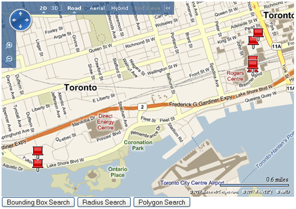
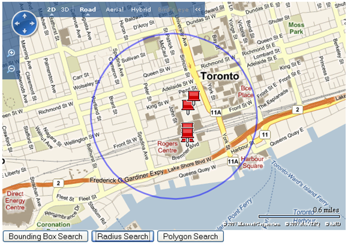
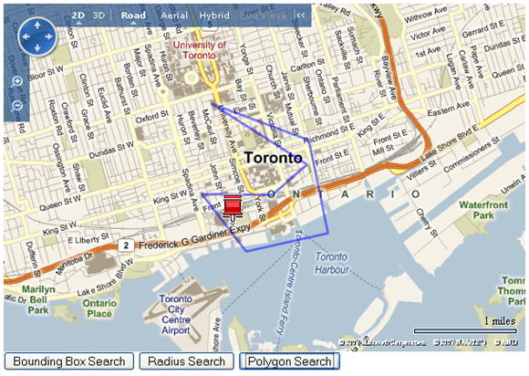

# Bounding Box, Radius, and Polygon Search
This article demonstrates Bounding Box, Radius and Polygon searches against data that is stored in a shape layer. These same principles can be applied when querying data in a database. For simplicity this article imports the initial data from a GeoRSS file and loads it into a shape layer.  
  
## Getting Started  
 First load a [!INCLUDE[ve_product_name](../articles/includes/ve-product-name-md.md)] map and import the location data from a GeoRSS file into a shape layer.  If you are working with a database you can skip this step. You will also import a second layer that draws the outline of the area being searched.  
  
```  
<!DOCTYPE html PUBLIC "-//W3C//DTD XHTML 1.0 Transitional//EN" "http://www.w3.org/TR/xhtml1/DTD/xhtml1-transitional.dtd">  
<html>  
<head>  
<title></title>  
<meta http-equiv="Content-Type" content="text/html; charset=utf-8">  
<script type="text/javascript" src="http://ecn.dev.virtualearth.net/mapcontrol/mapcontrol.ashx?v=6.3"></script>  
<script type="text/javascript">  
var map = null;  
var dataLayer = new VEShapeLayer();;  
var searchShapeLayer = new VEShapeLayer();;  
  
function GetMap()  
{  
        map = new VEMap('myMap');  
  map.LoadMap();  
  
  var veLayerSpec = new VEShapeSourceSpecification(VEDataType.GeoRSS,"http://www.microsoft.com/maps/isdk/ajax/geoRSSTest.xml",dataLayer);  
        map.ImportShapeLayerData(veLayerSpec);  
   map.AddShapeLayer(searchShapeLayer);  
 }     
  
 </script>  
 </head>  
 <body onload="GetMap();">  
      <div id='myMap' style="position: relative; width: 600px; height: 400px;"></div>  
  
<INPUT id="box" type="button" value="Bounding Box Search" name="box" onclick="boundingBoxSearch();">   
<INPUT id="radius" type="button" value="Radius Search" name="radius" onclick="radiusSearch();">   
<INPUT id="poly" type="button" value="Polygon Search" name="poly" onclick="polygonSearch();">   
 </body>  
</html>  
```  
  
 If the above code is opened in a browser it generates the following map showing several locations in the Toronto area.  
  
   
  
 *Figure 1.* Initial [!INCLUDE[ve_product_name](../articles/includes/ve-product-name-md.md)] map  
  
 To distinguish between the shapes that were found and those already on the data layer, hide all shapes on the data layer individually and only show those that meet the search parameters. To hide the shapes, add a callback function to the VEMap.ImportShapeLayerData method.  
  
```  
map.ImportShapeLayerData(veLayerSpec,hideEachShape);  
```  
  
 The **hideEachShape** function iterates through all the shapes in the data layer and hides them.  
  
```  
function hideEachShape()  
{  
  for(var i=0;i<dataLayer.GetShapeCount();i++)  
  {  
    var shape = dataLayer.GetShapeByIndex(i);  
    shape.Hide();  
  }  
}  
```  
  
 You can’t simply hide the whole layer because you want to selectively show the shapes in the layer that match the search criteria.  
  
## Bounding Box Search  
 A bounding box search consists of locating points within a defined rectangular area. The basic algorithm consists of comparing a shape’s coordinates to the coordinates of the bounding box.  The top left corner of the bounding box will have a latitude that is greater than the bottom right corner. And for the majority of cases the top left corner’s longitude will be smaller than the bottom right corner, and so the comparisons that are required to determine if a point are within a bounding box are straight forward. However, there is a special case. If the bounding box crosses over the 180 degree meridian, the longitude of the top left corner will be greater than the longitude of the bottom right corner. In this case the logic used to determine if a point is within the bounding box gets reversed. When you have determined if a shape in the data layer is within the bounding rectangle, make the shape visible.  
  
 This example only considers pushpins as this is the most common case.  Evaluating lines and shapes requires the extra step of determining the max extents of the shape.  
  
```  
function boundingBoxSearch()  
{  
  //hide previous results  
  hideEachShape();  
  
  //clear the search shape layer  
  searchShapeLayer.DeleteAllShapes();  
  
  //bounding box coordinates  
  var topLeft = new VELatLong(43.645,-79.389);  
  var bottomRight = new VELatLong(43.642,-79.385);   
  
  //checks to see if bounding box crosses 180 degrees  
  if(topLeft.Longitude > bottomRight.Longitude)  
  {  
    //iterate through shapes in dataLayer  
    for(var i=0;i<dataLayer.GetShapeCount();i++)  
    {  
      var shape = dataLayer.GetShapeByIndex(i);  
      var latlong = shape.GetPoints()[0];  
      var lat = latlong.Latitude;  
      var lon = latlong.Longitude;  
      if(topLeft.Longitude >= lon && bottomRight.Longitude <= lon   
         && topLeft.Latitude >= lat && bottomRight.Latitude <= lat)  
      {  
        shape.Show();  
      }         
    }  
  }  
  else  
  {  
    //iterate through shapes in dataLayer  
    for(var i=0;i<dataLayer.GetShapeCount();i++)  
    {  
      var shape = dataLayer.GetShapeByIndex(i);  
      var latlong = shape.GetPoints()[0];  
      var lat = latlong.Latitude;  
      var lon = latlong.Longitude;  
  
      if(topLeft.Longitude <= lon && bottomRight.Longitude >= lon   
        && topLeft.Latitude >= lat && bottomRight.Latitude <= lat)  
      {  
        shape.Show();  
       }  
    }  
  }  
  //draw search area  
  drawBox(topLeft,bottomRight);  
  map.SetMapView([topLeft,bottomRight]);  
}  
```  
  
 The algorithm above calls a function **drawBox** which generates a polyline that outlines the bounding box and displays it on the map. Here is the **drawBox** function:  
  
```  
function drawBox(topLeft,bottomRight)  
{  
         var topRight = new VELatLong(topLeft.Latitude,bottomRight.Longitude);  
         var bottomLeft = new VELatLong(bottomRight.Latitude,topLeft.Longitude);  
         var box = new VEShape(VEShapeType.Polyline,[topLeft,topRight,bottomRight,bottomLeft,topLeft]);  
         box.HideIcon();  
         searchShapeLayer.AddShape(box);  
}  
```  
  
 Calling the Bounding Box Search function results in the following map.  
  
   
  
 *Figure 2.* Bounding box search  
  
 You can obviously adapt this search for any shape search area, although rectangles are the easiest.  
  
## Radius Search  
 Radius search is another common search approach, which considers the question, “Which stores are within 5 miles of my current location?”  The basic method for performing a radius search is to calculate the distance from each point to the center search circle and see if the point’s distance is less than that of the desired radius. If it is, then the point is within the search radius.  
  
```  
function radiusSearch()   
{  
  //hide previous results  
  hideEachShape();  
  
  //clear the search shape layer  
  searchShapeLayer.DeleteAllShapes();  
  
  //center of search Radius  
  var origin = new VELatLong(43.645,-79.389);  
  //search radius in km  
  var radius = 1;  
  for(var i=0; i < dataLayer.GetShapeCount(); i++)  
  {  
    var shape = dataLayer.GetShapeByIndex(i);  
    var latlong = shape.GetPoints()[0];  
    var d = distance(origin,latlong);  
    if(Math.abs(d)<= Math.abs(radius))  
    {  
      shape.Show();  
    }  
  }  
  drawCircle(origin,radius);  
}  
```  
  
 When working with coordinate systems you use the Haversine formula to calculate the distance between two points on the earth’s surface. This formula accounts for the curvature of the earth and gives a more precise distance measurement.  
  
```  
function distance(latlong,latlong2)  
{  
  var lat1 = latlong.Latitude;  
  var lon1 = latlong.Longitude;  
  var lat2 = latlong2.Latitude;  
  var lon2 = latlong2.Longitude;  
  var earthRadius = 6371; //appxoximate radius in miles  
  
  var factor = Math.PI/180;  
  var dLat = (lat2-lat1)*factor;  
  var dLon = (lon2-lon1)*factor;   
  var a = Math.sin(dLat/2) * Math.sin(dLat/2) + Math.cos(lat1*factor)   
    * Math.cos(lat2*factor) * Math.sin(dLon/2) * Math.sin(dLon/2);   
  var c = 2 * Math.atan2(Math.sqrt(a), Math.sqrt(1-a));   
  var d = earthRadius * c;  
  return d;  
}  
```  
  
 As with the bounding box search, draw a circle to represent the search area. The algorithm for drawing a circle consists of calculating 360 points, one for each angle of degree, and then attaching them all together with a polyline. This is done using the following function.  
  
```  
function drawCircle(origin,radius)  
{    
  var earthRadius = 6371;  
  
  //latitude in radians  
  var lat = (origin.Latitude*Math.PI)/180;   
  
  //longitude in radians  
  var lon = (origin.Longitude*Math.PI)/180;   
  //angular distance covered on earth's surface  
  var d = parseFloat(radius)/earthRadius;    
  var points = new Array();  
  for (i = 0; i <= 360; i++)   
  {   
    var point = new VELatLong(0,0)              
    var bearing = i * Math.PI / 180; //rad  
    point.Latitude = Math.asin(Math.sin(lat)*Math.cos(d) +   
      Math.cos(lat)*Math.sin(d)*Math.cos(bearing));  
    point.Longitude = ((lon + Math.atan2(Math.sin(bearing)*Math.sin(d)*Math.cos(lat),  
      Math.cos(d)-Math.sin(lat)*Math.sin(point.Latitude))) * 180) / Math.PI;  
    point.Latitude = (point.Latitude * 180) / Math.PI;  
    points.push(point);  
  }  
  
  var circle = new VEShape(VEShapeType.Polyline, points);   
  circle.HideIcon();  
  searchShapeLayer.AddShape(circle);  
  map.SetMapView(points);  
}    
```  
  
 Calling the Radius Search function will result in the following map.  
  
   
  
 *Figure 3.* Radius search  
  
 Note that the circle may distort as you navigate the map.  This is a natural effect of the distortion caused by the Mercator projection.  
  
## Polygon Search  
 A polygon search has a more complex algorithm. The basic algorithm consists of using a line that goes through a data point. Once this line is calculated, the number of points of intersection with the polygon sides is counted on both the left and right side. If there is an odd number of intersecting points on the right side and odd number of intersecting points on the left side then the data point is inside the polygon.  
  
   
  
 *Figure 4.* Data point inside polygon  
  
 If there is an even number of points of intersection on either side of the data point then data point is outside of the polygon.  
  
   
  
 *Figure 5.* Data point outside of polygon  
  
 Note that it really doesn’t matter where you draw the line as any line will eventually intersect the polygon.  
  
 The **polygonSearch** function will iterate each shape in the data layer and pass it to a second function called to **pointInPolygon** to determine if the given data point is within the polygon. If it is, then the data point will be displayed.  
  
```  
function polygonSearch()  
{  
  //hide previous results  
  hideEachShape();  
  //clear the search shape layer  
  searchShapeLayer.DeleteAllShapes();  
  
  //polygon coordinates  
  var points = new Array(new VELatLong(43.64486433588385, -79.3791389465332),  
  new VELatLong(43.64508171979899, -79.3930435180664),  
  new VELatLong(43.63682057801007, -79.38437461853027),  
  new VELatLong(43.63946054004705, -79.36819553375244),  
  new VELatLong(43.652720712083266, -79.37201499938965),  
  new VELatLong(43.65793702655821, -79.39111232757568),  
  new VELatLong(43.64927396999741, -79.37222957611084),  
  new VELatLong(43.64486433588385, -79.3791389465332));  
  
  for(var i=0; i < dataLayer.GetShapeCount(); i++)  
  {  
    var shape = dataLayer.GetShapeByIndex(i);  
    var latlong = shape.GetPoints()[0];  
    var lat = latlong.Latitude;  
    var lon = latlong.Longitude;  
  
    if(pointInPolygon(points,lat,lon))  
    {  
      shape.Show();  
    }  
  }  
  
  drawPolygon(points);  
}  
```  
  
 The next function determines whether the point is actually inside the polygon.  
  
```  
function pointInPolygon(points,lat,lon)   
{  
  var i;  
  var j=points.length-1;  
  var inPoly=false;  
  
  for (i=0; i<points.length; i++)   
  {  
    if (points[i].Longitude<lon && points[j].Longitude>=lon   
      || points[j].Longitude<lon && points[i].Longitude>=lon)   
    {  
      if (points[i].Latitude+(lon-points[i].Longitude)/   
        (points[j].Longitude-points[i].Longitude)*(points[j].Latitude   
          -points[i].Latitude)<lat)   
      {  
        inPoly=!inPoly;   
      }  
    }  
    j=i;   
  }  
  return inPoly;   
}  
```  
  
 As with the bounding box and radius searches, you will also draw a polygon to represent the search area. To draw the polygon using the polylines is just a matter of passing in the array of points that make up the polygon to the [VEShape Constructor](http://msdn.microsoft.com/en-us/14287ec1-cfb2-4434-ad57-d8be896bbd98).  
  
```  
function drawPolygon(points)  
{  
  var polygon = new VEShape(VEShapeType.Polyline, points);  
  polygon.HideIcon();  
  searchShapeLayer.AddShape(polygon);   
  map.SetMapView(points);    
}  
```  
  
 Calling the Polygon Search function will result in the following map.  
  
   
  
 *Figure 6.* Polygon search  
  
## Conclusion  
 This article has shown you the basics of performing several different types of searches. If you add mouse events to this code you can give the user the ability to draw the search areas they want. These same algorithms can be converted to server side code and used to query a database of locations.  
  
## Example  
 The complete sample code is below.  
  
```  
<!DOCTYPE html PUBLIC "-//W3C//DTD XHTML 1.0 Transitional//EN" "http://www.w3.org/TR/xhtml1/DTD/xhtml1-transitional.dtd">  
<html>  
   <head>  
      <title></title>  
      <meta http-equiv="Content-Type" content="text/html; charset=utf-8">  
      <script type="text/javascript" src="http://ecn.dev.virtualearth.net/mapcontrol/mapcontrol.ashx?v=6.3"></script>  
      <script type="text/javascript">  
     var map = null;  
    var dataLayer = new VEShapeLayer();  
    var searchShapeLayer = new VEShapeLayer();  
  
         function GetMap()  
         {  
             map = new VEMap('myMap');  
      map.LoadMap();  
  
      var veLayerSpec = new VEShapeSourceSpecification(VEDataType.GeoRSS,"http://www.microsoft.com/maps/isdk/ajax/geoRSSTest.xml",dataLayer);  
            map.ImportShapeLayerData(veLayerSpec,hideEachShape);    
  
            map.AddShapeLayer(searchShapeLayer);     
         }     
  
         function hideEachShape()  
         {  
           for(var i=0;i<dataLayer.GetShapeCount();i++)  
         {  
           var shape = dataLayer.GetShapeByIndex(i);  
           shape.Hide();  
          }  
         }  
  
         function boundingBoxSearch()  
         {  
          //hide previous results  
          hideEachShape();  
  
          //clear the search shape layer  
          searchShapeLayer.DeleteAllShapes();  
  
          //bounding box coordinates  
         var topLeft = new VELatLong(43.645,-79.389);  
         var bottomRight = new VELatLong(43.642,-79.385);   
  
         //checks to see if bounding box crosses 180 degrees  
         if(topLeft.Longitude > bottomRight.Longitude)  
        {  
           //iterate through shapes in dataLayer  
           for(var i=0;i<dataLayer.GetShapeCount();i++)  
           {  
             var shape = dataLayer.GetShapeByIndex(i);  
          var latlong = shape.GetPoints()[0];  
          var lat = latlong.Latitude;  
          var lon = latlong.Longitude;  
  
             if(topLeft.Longitude >= lon && bottomRight.Longitude <= lon && topLeft.Latitude >= lat && bottomRight.Latitude <= lat)  
             {  
               shape.Show();  
             }         
           }  
         }  
        else  
        {  
         //iterate through shapes in dataLayer  
           for(var i=0;i<dataLayer.GetShapeCount();i++)  
           {  
             var shape = dataLayer.GetShapeByIndex(i);  
          var latlong = shape.GetPoints()[0];  
          var lat = latlong.Latitude;  
          var lon = latlong.Longitude;  
  
          if(topLeft.Longitude <= lon && bottomRight.Longitude >= lon && topLeft.Latitude >= lat && bottomRight.Latitude <= lat)  
             {  
               shape.Show();  
             }  
        }             
        }  
  
        //draw search area  
        drawBox(topLeft,bottomRight);  
  
        map.SetMapView([topLeft,bottomRight]);  
         }  
  
         function drawBox(topLeft,bottomRight)  
         {  
           var topRight = new VELatLong(topLeft.Latitude,bottomRight.Longitude);  
           var bottomLeft = new VELatLong(bottomRight.Latitude,topLeft.Longitude);  
           var box = new VEShape(VEShapeType.Polyline,[topLeft,topRight,bottomRight,bottomLeft,topLeft]);  
           box.HideIcon();  
           searchShapeLayer.AddShape(box);  
         }  
  
        function radiusSearch()   
    {  
      //hide previous results  
          hideEachShape();  
  
          //clear the search shape layer  
          searchShapeLayer.DeleteAllShapes();  
  
      //center of search Radius  
      var origin = new VELatLong(43.645,-79.389);  
  
      //search radius in km  
      var radius = 1;  
  
      for(var i=0; i < dataLayer.GetShapeCount(); i++)  
      {  
        var shape = dataLayer.GetShapeByIndex(i);  
        var latlong = shape.GetPoints()[0];  
  
        var d = distance(origin,latlong);  
  
        if(Math.abs(d)<= Math.abs(radius))  
        {  
          shape.Show();  
        }  
      }  
  
      drawCircle(origin,radius);  
    }  
  
    //calculation of Haversine Forumla  
    function distance(latlong,latlong2)  
    {  
      var lat1 = latlong.Latitude;  
      var lon1 = latlong.Longitude;  
      var lat2 = latlong2.Latitude;  
      var lon2 = latlong2.Longitude;  
      var earthRadius = 6371;  
  
      var factor = Math.PI/180;  
      var dLat = (lat2-lat1)*factor;  
      var dLon = (lon2-lon1)*factor;   
      var a = Math.sin(dLat/2) * Math.sin(dLat/2)+Math.cos(lat1*factor)*Math.cos(lat2*factor)*Math.sin(dLon/2) * Math.sin(dLon/2);   
      var c = 2 * Math.atan2(Math.sqrt(a), Math.sqrt(1-a));   
      var d = earthRadius * c;  
  
      return d;  
    }  
  
    function drawCircle(origin,radius)  
    {    
      var earthRadius = 6371;  
  
      //latitude in radians  
        var lat = (origin.Latitude*Math.PI)/180;   
  
        //longitude in radians  
        var lon = (origin.Longitude*Math.PI)/180;   
  
        //angular distance covered on earth's surface  
        var d = parseFloat(radius)/earthRadius;    
  
        var points = new Array();  
        for (i = 0; i <= 360; i++)   
        {   
            var point = new VELatLong(0,0)              
            var bearing = i * Math.PI / 180; //rad  
            point.Latitude = Math.asin(Math.sin(lat)*Math.cos(d) + Math.cos(lat)*Math.sin(d)*Math.cos(bearing));  
            point.Longitude = ((lon + Math.atan2(Math.sin(bearing)*Math.sin(d)*Math.cos(lat), Math.cos(d)-Math.sin(lat)*Math.sin(point.Latitude))) * 180) / Math.PI;  
            point.Latitude = (point.Latitude * 180) / Math.PI;  
            points.push(point);  
        }  
  
       var circle = new VEShape(VEShapeType.Polyline, points);   
       circle.HideIcon();  
       searchShapeLayer.AddShape(circle);  
  
       map.SetMapView(points);  
    }  
  
    function polygonSearch()  
    {  
      //hide previous results  
          hideEachShape();  
  
          //clear the search shape layer  
          searchShapeLayer.DeleteAllShapes();  
  
      //polygon coordinates  
      var points = new Array(new VELatLong(43.64486433588385, -79.3791389465332),  
  new VELatLong(43.64508171979899, -79.3930435180664),  
  new VELatLong(43.63682057801007, -79.38437461853027),  
  new VELatLong(43.63946054004705, -79.36819553375244),  
  new VELatLong(43.652720712083266, -79.37201499938965),  
  new VELatLong(43.65793702655821, -79.39111232757568),  
  new VELatLong(43.64927396999741, -79.37222957611084),  
  new VELatLong(43.64486433588385, -79.3791389465332));  
  
      for(var i=0; i < dataLayer.GetShapeCount(); i++)  
      {  
        var shape = dataLayer.GetShapeByIndex(i);  
        var latlong = shape.GetPoints()[0];  
        var lat = latlong.Latitude;  
        var lon = latlong.Longitude;  
  
        if(pointInPolygon(points,lat,lon))  
        {  
          shape.Show();  
        }  
      }  
  
      drawPolygon(points);  
    }  
  
    function pointInPolygon(points,lat,lon)   
     {  
        var i;  
        var j=points.length-1;  
        var inPoly=false;  
  
        for (i=0; i<points.length; i++)   
        {  
          if (points[i].Longitude<lon && points[j].Longitude>=lon ||  points[j].Longitude<lon && points[i].Longitude>=lon)   
          {  
              if (points[i].Latitude+(lon-points[i].Longitude)/(points[j].Longitude-points[i].Longitude)*(points[j].Latitude-points[i].Latitude)<lat)   
              {  
                inPoly=!inPoly;   
              }  
          }  
          j=i;   
        }  
  
      return inPoly;   
    }  
  
    function drawPolygon(points)  
    {  
      var polygon = new VEShape(VEShapeType.Polyline, points);  
      polygon.HideIcon();  
           searchShapeLayer.AddShape(polygon);   
  
           map.SetMapView(points);    
    }  
      </script>  
   </head>  
   <body onload="GetMap();">  
      <div id='myMap' style="position: relative; width: 600px; height: 400px;"></div>  
  
      <INPUT id="box" type="button" value="Bounding Box Search" name="box" onclick="boundingBoxSearch();">   
      <INPUT id="radius" type="button" value="Radius Search" name="radius" onclick="radiusSearch();">   
      <INPUT id="poly" type="button" value="Polygon Search" name="poly" onclick="polygonSearch();">   
   </body>  
</html>  
```