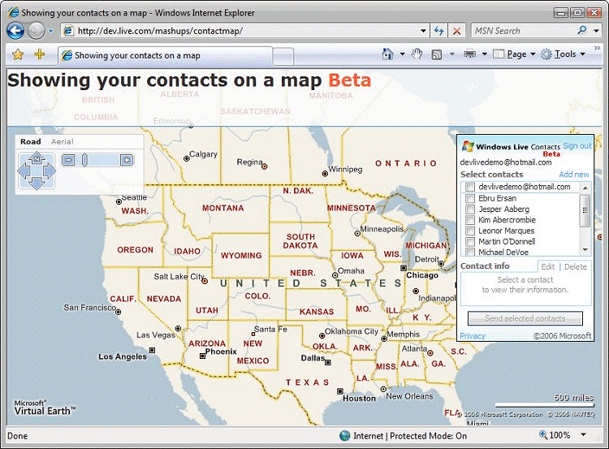
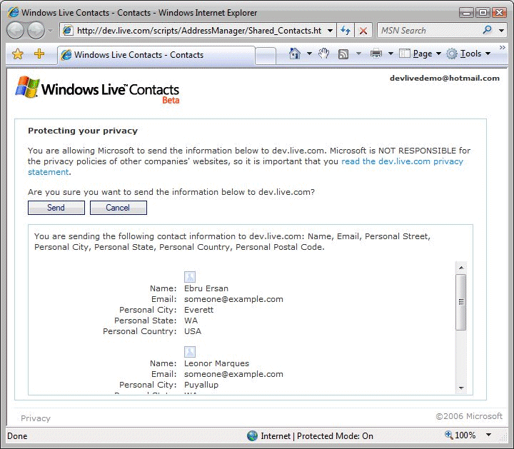
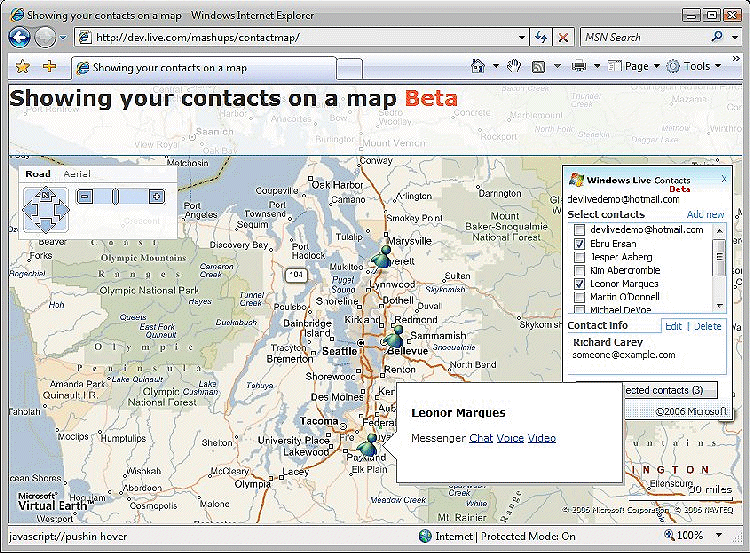

# Building a Mashup with the Windows Live Contacts Gadget and Bing Maps
> [!CAUTION]
>  The content in this article may still be applicable to the current version of the [!INCLUDE[vemc_product_name](../articles/includes/vemc-product-name-md.md)], but it uses a previous version of the [!INCLUDE[vemc_product_name](../articles/includes/vemc-product-name-md.md)] which is no longer supported. More information about the current version of the [!INCLUDE[vemc_product_name](../articles/includes/vemc-product-name-md.md)] is found in the [Bing Map Control SDK](http://msdn.microsoft.com/en-us/library/bb429619.aspx).  
  
 Microsoft is a service provider for one of the world's biggest virtual social networks, namely [!INCLUDE[winlive_contacts_name](../articles/includes/winlive-contacts-name-md.md)]. This mashup uses the [Windows Live Contacts gadget beta](http://dev.live.com/contactscontrol/v0.2/default.aspx) to show how the [!INCLUDE[winlive_contacts_name](../articles/includes/winlive-contacts-name-md.md)] world is opening up, so that you can start building more interesting applications. The core functionality of this mashup was built in a night. A week of work can create a very interesting mashup.  
  
## Introduction: Installing and Running the Sample  
 **Step 1:** This mashup is built using JavaScript and HTML. The three files can be placed on any Web server:  
  
 contact.png: This icon represents a contact on a map.  
  
 default.htm: We chose to keep all script and HTML in one big file to make it easy to view the source.  
  
 channel.htm: This is a file you get from the [Windows Live Contacts gadget SDK](http://dev.live.com/contactscontrol/v0.2/default.aspx). It is important to place this file on the same Web server you placed your other files.  
  
 **Step 2:** After placing these files on your Web server, try browsing to default.htm.  
  
   
  
 **Figure 1. default.htm**  
  
 **Step 3:** You must first sign in with a [!INCLUDE[winlive_id_name](../articles/includes/winlive-id-name-md.md)]. After you sign in, your contacts are listed.  
  
   
  
 **Figure 2. Listing your contacts**  
  
 **Step 4:** Check the contacts you wish to map and click Send selected contacts.  
  
 **Step 5:** All the information that is being sent to the mashup is presented. Click Send after reviewing the information.  
  
   
  
 **Figure 3. Privacy dialog**  
  
 **Step 6:** Confirm your contacts are being mapped. Hover over them and start a messenger session with them.  
  
   
  
 **Figure 4. Mapped contacts**  
  
## Challenges  
 This is perhaps the simplest demonstration of the [!INCLUDE[winlive_contacts_name](../articles/includes/winlive-contacts-name-md.md)] gadget. But even in this case, there are a few technical challenges that require attention.  
  
### Geo-coding  
 Location awareness is a maturing domain where it is still not obvious how to code addresses into latitude/longitude as well as vice versa. In this mashup, we are mapping contacts based on their home addresses. How do you map this contact on a map when the map may require latitude and longitude?  
  
### Asynchronous Control Flow  
 The latency involved in making Web service calls is far larger than typical API calls done locally on your computer. In order to build a usable application that makes Web service calls, it is important to structure your code so that (1) your code makes the Web service call, (2) the control flow is returned so that user interaction is possible while the application waits for a response, and (3) your code responds when a response is returned from the Web service. In this method of managing control flow (typically referred to as a "callback"), there is an increased need to explicitly maintain the application state and to be able to piece together the intended processing of data across multiple nonsequential function calls.  
  
 Adding to the complexity is the fact that you have no assurance that your code will get a response from the Web service, as well as the unpredictability of the sequence of returns (for example, you may issue Web service calls in the order of A to B, but the response may be B to A, or B and no A, or A and no B, or no responses for both).  
  
## How This Sample Can Help You  
 This sample works through the challenges presented above and provides a set of solutions including:  
  
 Geo-coding using a hidden instance of the [!INCLUDE[vemc_product_name](../articles/includes/vemc-product-name-md.md)] to convert addresses to latitude and longitude.  
  
 Issuing Web service calls while maintaining the application state using closure techniques in JavaScript (which effectively pushes state information into the callstack and removes the need for variables beyond the scope of functions).  
  
 Let's take a closer look.  
  
### Factoring and Files  
 There is only one file requiring a closer look in this sample.  
  
 **default.htm**  
  
```  
<HTML>   
<head>   
<title>Showing your contacts on a map</title>   
<script type="text/javascript" src="http://dev.live.com/scripts/AddressManager/proxy.js"></script>   
<script type="text/javascript" src="http://dev.live.com/scripts/AddressManager/ContactSelectorPartner.js"></script>   
```  
  
 The above definitions reference proxy.js and contactselectorpartner.js, which contain a JavaScript class implementation that encapsulates the [!INCLUDE[winlive_contacts_name](../articles/includes/winlive-contacts-name-md.md)] gadget.  
  
```  
<script type="text/javascript" language="javascript" src="http://dev.virtualearth.net/mapcontrol/v3/mapcontrol.js">   
```  
  
 The above definitions reference mapcontrol.js, which is the [!INCLUDE[vemc_product_name](../articles/includes/vemc-product-name-md.md)].  
  
```  
</script>   
<style type="text/css">   
.earth {  
 z-index: 1;   
width: 100%;   
height: 100%;   
}   
.message {   
filter: alpha(opacity=80);   
opacity: .8;   
z-index: 3;   
width: 15em;   
height: 15em;   
border: solid 1px black;   
background: white;   
visibility: hidden;   
overflow: auto;   
font-family: Verdana;   
font-size: 75%;   
position: absolute;   
}   
.contacts {   
z-index: 3;   
width: 12em;   
height: 18em;   
border: solid 1px black;   
background: white;   
position: absolute;   
}   
#header {   
filter: alpha(opacity=80);   
opacity: .8;   
z-index: 2;   
font-family: Verdana;   
font-size: 125%;   
height: 4em;   
width: 100%;   
background: white;   
border-bottom: solid 1px #0088E4;   
position: absolute;   
vertical-align: bottom   
}   
</style>   
```  
  
 The .earth definition is for the map; the .message definition is for the notification box of errors and application responses; the .contacts definition is for styling the DIV used for the [!INCLUDE[winlive_contacts_name](../articles/includes/winlive-contacts-name-md.md)] gadget; and the .#header definition is for the title area in this application.  
  
```  
<script type="text/javascript" language="javascript">   
//   
// contactMapper class   
//   
// The constructor accepts the ID of a map on which to place pushpins, // and the ID of a DIV tag where messages are shown.   
// There is only one public method, namely plot(arrayOfUserData).   
//   
// This geo-coding technique can fail if a valid FindLocation call on // the geo-coding map takes more than 5 seconds, since the Timeout may // start mapping your next contact while the onchangeview event on   
// the geo-coding map returns for the previous contact (the location and   
// your contact can get out of sync). Microsoft is aware of the issue // and working on a solution.   
//   
```  
  
 The contactmapper class encapsulates the geo-coding complexities as well as the asynchronous control flow problem. It's a good place to start tweaking if you are going to use:  
  
-   the [!INCLUDE[winlive_contacts_name](../articles/includes/winlive-contacts-name-md.md)] gadget  
  
-   a map  
  
-   some other asynchronous Web service  
  
```  
function contactMapper(mapToPushpinId, notificationDivID) {   
// class method definition   
this.plot = plot;   
// instantiate the map the user is seeing   
var m_map = new VEMap(mapToPushpinId);   
m_map.LoadMap();   
this.map = m_map;   
```  
  
 The class is defined to only have one public method (namely plot) and one public property (namely map).  
  
```  
// instantiate hidden geo-coding map   
Var elmapgeocode = document.createelement("div");   
Elmapgeocode.id = maptopushpinid + '_geocode';   
Elmapgeocode.style.position = 'absolute';   
Elmapgeocode.style.left = '-1024px';   
Elmapgeocode.style.top = '-768px';   
Elmapgeocode.style.height = '100px';   
Elmapgeocode.style.width = '100px';   
Document.getelementbyid(maptopushpinid).appendchild(elmapgeocode);   
Var m_mapgeocode = new vemap(elmapgeocode.id);   
M_mapgeocode.loadmap();   
```  
  
 The statements above instantiate another [!INCLUDE[vemc_product_name](../articles/includes/vemc-product-name-md.md)] used specifically for geo-coding, hidden from the end user. Hiding is done by placing the map control outside of the view port of the user as compared to using the visibility style.  
  
```  
// function which plots users, and it's helper plotOneContact   
function plot(arrayOfUserData) {   
m_map.DeleteAllPushpins();   
document.getElementById(notificationDivID).style.visibility = "hidden";   
document.getElementById(notificationDivID).innerHTML = "<P><H4>Contacts not mapped</H4></P>";   
plotOneContact(0, arrayOfUserData);   
}   
```  
  
 The plot function gets called every time the [!INCLUDE[winlive_contacts_name](../articles/includes/winlive-contacts-name-md.md)] gadget sends contact information to this mashup. The function itself intitiates successive calls to plotOneContact, which maps one contact at a time. The loop is not created as a for loop, though, because there is an asynchronous control flow required here.  
  
```  
function plotOneContact(index, arrayOfUserData) {   
var name, email, personalstreet, personalcity, personalstate, personalcountry, personalpostalcode;   
if (index < arrayOfUserData.length) {   
name = (typeof arrayOfUserData[index].name != "undefined" ? arrayOfUserData[index].name : "");   
email = (typeof arrayOfUserData[index].email != "undefined" ? arrayOfUserData[index].email : "");   
personalstreet = (typeof arrayOfUserData[index].personalStreet != "undefined" ? arrayOfUserData[index].personalStreet : "");   
personalcity = (typeof arrayOfUserData[index].personalCity != "undefined" ? arrayOfUserData[index].personalCity : "");   
personalstate = (typeof arrayOfUserData[index].personalState != "undefined" ? arrayOfUserData[index].personalState : "");   
personalcountry = (typeof arrayOfUserData[index].personalCountry != "undefined" ? arrayOfUserData[index].personalCountry : "");  
personalpostalcode = (typeof arrayOfUserData[index].personalPostalCode != "undefined" ? arrayOfUserData[index].personalPostalCode : "");   
```  
  
 Note how the contact information is being accessed here. It may not be obvious, but you need to use camel capped case style, with the first letter lowercase, to access the information of contacts.  
  
```  
if (   
personalstreet == "" &&   
personalcity == "" &&   
personalstate == "" &&   
personalcountry == "" &&   
personalpostalcode == ""   
) {   
document.getElementById(notificationDivID).innerHTML +=   
"<P><a href='mailto:" +   
encodeURIComponent(email) +   
"?subject=Location in Windows Live Contacts" +   
"&body=Your location information is missing.'>" +   
hesc(name) +   
"</a></P>";   
document.getElementById(notificationDivID).style.visibility = "visible";   
plotOneContact(index + 1, arrayOfUserData);   
```  
  
 If the contact does not have any address information, a hyperlink is provided on the user interface to make it easier to create an e-mail, which suggests the adding of address information. Then a call to plotOneContact is issued to map the next contact.  
  
```  
} else {   
timeoutId = window.setTimeout(   
getStatefulRestartLoopCallback(index, arrayOfUserData, name),   
5000);  
 m_mapGeocode.AttachEvent(   
'onchangeview',   
getStatefulPushpinCallback(index, arrayOfUserData, timeoutId, name, email));   
m_mapGeocode.FindLocation(   
personalstreet + " " +   
personalcity + " " +   
personalstate + " " +   
personalcountry + " " +   
personalpostalcode);   
```  
  
 There are four things being done here:  
  
1.  A timeout is established so that if an address is not mapped successfully within five seconds, a call to plotOneContact is issued to map the next contact.  
  
2.  Closure is used to create a stateful function that is assigned as the callback to the timeout.  
  
3.  Closure is used to create a stateful function that is assigned as the callback in case the address was successfully mapped.  
  
4.  A FindLocation call is issued on the hidden [!INCLUDE[vemc_product_name](../articles/includes/vemc-product-name-md.md)] used for geo-coding.  
  
```  
}   
} else {   
window.status = "Complete.";   
```  
  
 When all contacts have been processed on plotOneContact function calls, the status message on the window is set to Complete.  
  
```  
}   
}   
function getStatefulPushpinCallback(index, arrayOfUserData, timeoutId, name, email) {   
return arrayOfUserData[index].callback = function() {   
window.clearTimeout(timeoutId);   
m_mapGeocode.DetachEvent('onchangeview', arrayOfUserData[index].callback);   
var latlong = m_mapGeocode.GetCenter();   
var title = "<P>" + hesc(name) + "</P>";   
var description =   
(email != "" ?   
"<nobr>" +   
"Messenger " +   
"<a href='msnim:chat?contact=" + hesc(email) + "'>Chat</a> " +   
"<a href='msnim:voice?contact=" + hesc(email) + "'>Voice</a> " +   
"<a href='msnim:video?contact=" + hesc(email) + "'>Video</a>" +   
"</nobr>"   
:   
"");   
var pin = new VEPushpin(   
index + name,   
latlong,   
"contact.png",   
title,   
description);  
 m_map.AddPushpin(pin);   
plotOneContact(index + 1, arrayOfUserData);   
}   
}   
```  
  
 Here, a stateful function is returned for the callback when the address has been successfully mapped. Note that the timeout to recover from bad addresses is being cleared, and the callback function is being detached from the [!INCLUDE[vemc_product_name](../articles/includes/vemc-product-name-md.md)] used for geo-coding.  
  
```  
// this callback function gets called by the timeout if finding the address requires more than 5 seconds.   
function getStatefulRestartLoopCallback(index, arrayOfUserData, name) {   
return function() {   
m_mapGeocode.DetachEvent('onchangeview', arrayOfUserData[index].callback);  
document.getElementById(notificationDivID).innerHTML +=   
"<P>Failed to map contact " +   
hesc(name) +   
"</P>";   
document.getElementById(notificationDivID).style.visibility = "visible";   
plotOneContact(index + 1, arrayOfUserData);   
}   
}   
```  
  
 Here, a stateful function is returned for the callback to recover from bad addresses (addresses that cannot be mapped). Note that the callback function is being detached from the [!INCLUDE[vemc_product_name](../articles/includes/vemc-product-name-md.md)] used for geo-coding.  
  
```  
// escape utilities   
function hesc(p_str) {   
return p_str.replace(/&/g,"&amp;").replace(/</g,"&lt;").replace(/>/g,"&gt;");   
}   
}   
//   
// global   
//  
var _cm; // contactmapper instance   
//   
// page initializaiton   
//   
function docLoad()   
{ try {   
updateContactLayout();   
_cm = new contactMapper('myMap' , 'myMessage');   
_cm.map.AddControl(document.getElementById('myContacts'));   
_cm.map.AddControl(document.getElementById('header'));   
_cm.map.AddControl(document.getElementById('myMessage'));   
```  
  
 The above statement instantiates a contactMapper instance while handing in the IDs for two DIV tags, the former for the map DIV and the latter for the message DIV where instructions and errors are displayed.  
  
```  
var s = "http://" + window.location.host + window.location.pathname;   
s = s.split('/');   
s[s.length - 1] = "channel.htm";   
var CP = new Microsoft.Gadget.ContactSelectorPartner(   
document.getElementById("myContacts"), //element to bind to   
"http://g.msn.com/0PR_/enus", //privacy policy URL   
"name,email,personalstreet,personalcity,personalstate,personalcountry,personalpostalcode",   
//comma delimited list of requested columms to return   
receiveData, //callback function   
s.join('/')); // channel URL   
```  
  
 Here, finally, a [!INCLUDE[winlive_contacts_name](../articles/includes/winlive-contacts-name-md.md)] gadget instance is created.  
  
```  
window.onresize = winResize;   
winResize();   
} catch(e) {   
var myMessage = document.getElementById('myMessage');   
myMessage.innerHTML = "<P><H4>Unknown error</H4></P><P>Initialization of map and contacts failed.</P>";   
myMessage.style.visibility = "visible";   
}   
}   
function receiveData(p_command, p_contacts ) {  
switch(p_command) {   
case "SIGN_IN":   
window.status = "Logged in.";   
break;   
case "SIGN_OUT":   
window.status = "Logged out.";   
break;   
case "DATA":   
window.status = "Received data.";   
_cm.plot(p_contacts);   
```  
  
 Then the plot method on the contactMapper instance is called on receiving contact information from the [!INCLUDE[winlive_contacts_name](../articles/includes/winlive-contacts-name-md.md)] gadget.  
  
```  
break;   
}   
}   
//   
// layout utilities   
//   
function winResize() {   
var dsbTop = document.getElementById('header').offsetHeight + 10;   
var dsb = document.getElementById("myMap_dashboard");   
dsb.style.top = dsbTop + "px";   
dsb.style.left = "10px";   
var el = document.getElementById("myMessage");   
var elTop = dsbTop + dsb.offsetHeight + 10;   
el.style.top = elTop + "px";   
el.style.left = "10px";   
updateContactLayout();   
}   
function updateContactLayout() {   
var el = document.getElementById("myContacts");   
el.style.top = (document.getElementById('header').offsetHeight + 10) + "px";   
el.style.left = (getWindowWidth() - 10 - el.offsetWidth) + "px";   
}   
function getWindowWidth(){   
if(window.innerWidth) return window.innerWidth;   
if(document.documentElement && document.documentElement.clientWidth)return document.documentElement.clientWidth;   
if(document.body && document.body.clientWidth)return document.body.clientWidth;   
return 0;   
}   
```  
  
 The above statements are nice-to-have behaviors that improve the look and feel of your mashup.  
  
```  
</script>   
</head>   
<body onload="docLoad();" style="overflow:hidden">   
<div id="header" alt="0.061401">   
<h2>Showing your contacts on a map <font color='#FF3300'>Beta</font></h2>   
</div>   
<div id= "myContacts" class = "contacts">   
</div>   
<div id= "myMessage" class = "message">   
</div>   
<div id = "myMap" class = "earth">   
</div>   
</body>   
</HTML>   
```  
  
 As you can see, the layout of the page is quite simple. It has four DIVs, a header, the [!INCLUDE[winlive_contacts_name](../articles/includes/winlive-contacts-name-md.md)] gadget, a message area, and the map.  
  
## Conclusion  
 This sample uses the [!INCLUDE[winlive_contacts_name](../articles/includes/winlive-contacts-name-md.md)] gadget and [!INCLUDE[vemc_product_name](../articles/includes/vemc-product-name-md.md)]. It uses the [!INCLUDE[vemc_product_name](../articles/includes/vemc-product-name-md.md)] in a creative manner to do geo-coding from address to longitude and latitude. It demonstrates using closure techniques in JavaScript to simplify state management. The crux of the sample is one HTML file that contains JavaScript and HTML. There are surprising scenarios that can be accomplished as an extension to this sample. We are looking forward to creative applications that use this sample as a springboard.