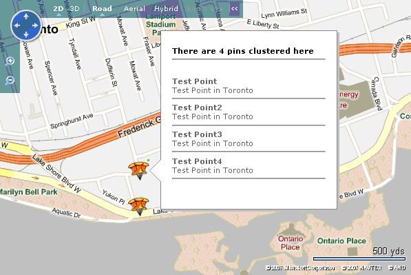

# Client Side Clustering
Suppose you have a few thousand points of interest (POI) that you would like to display on a [!INCLUDE[ve_product_name](../articles/includes/ve-product-name-md.md)] map. If the POIs are all relatively close to one another, as they often are, it can become difficult to select or hover over specific icons on the map because some are hidden behind other icons. One solution to this problem is server side clustering, in which code is written on the server side to handle grouping of close-together icons to improve usability. However, not everyone has the need or the time to develop a server side application solely for this purpose. As an alternative, when there are fewer than a few thousand locations on a map, client side clustering can be implemented instead of server side clustering, with limited performance issues.  
  
 **Note** With the release of [!INCLUDE[vemc_product_name_long](../articles/includes/vemc-product-name-long-md.md)], client side pushpin clustering can be done using the [VEShapeLayer.SetClusteringConfiguration Method](http://msdn.microsoft.com/en-us/6678523a-bd67-46d7-bb96-02879673714f).  
  
## Clustering Basics  
 Clustering is the process of representing several nearby locations with a single location icon. Clustering is typically done using either a grid model clustering method or an icon overlap algorithm. In this article, we will look at the grid model clustering method, which involves breaking the viewable map into a grid and representing all locations within any given cell of the grid with a single icon.  
  
## Importing Data  
 For the example in this article, we are going to load the map data from a GeoRSS file and store the locations in a hidden shape layer. This method makes storing the location data on the client side relatively easy. We also want to create a second layer that will store the clustered data.  
  
 The code in *Listing 1* loads a [!INCLUDE[ve_product_name](../articles/includes/ve-product-name-md.md)] map without displaying any data, stores the data in a hidden layer (baseLayer), and also defines a few global variables which we will need later. Note that the **cluster** callback function is empty. We will implement it in just a moment.  
  
```  
<!DOCTYPE html PUBLIC "-//W3C//DTD XHTML 1.0 Transitional//EN" "http://www.w3.org/TR/xhtml1/DTD/xhtml1-transitional.dtd">  
<html>  
   <head>  
      <meta http-equiv="Content-Type" content="text/html; charset=utf-8">  
      <title>Client Side Clustering</title>  
      <script type="text/javascript" src="http://ecn.dev.virtualearth.net/mapcontrol/mapcontrol.ashx?v=6.3"></script>  
      <script type="text/javascript">  
         var map = null;  
         var mapStyle;  
         var baseLayer = new VEShapeLayer();  
         var clusterLayer = new VEShapeLayer();  
         var zoomLimit = 15;  
         var gridSize = 30  
         var maxDescription = 5;  
  
         function GetMap()  
         {  
            map = new VEMap('myMap');  
            map.LoadMap();  
            var veLayerSpec = new VEShapeSourceSpecification(VEDataType.GeoRSS, "georsstest.xml", baseLayer);  
            map.ImportShapeLayerData(veLayerSpec, cluster);  
            baseLayer.Hide();  
            map.AddShapeLayer(clusterLayer);  
         }  
  
         function cluster()  
         {}  
      </script>  
   </head>  
   <body onload="GetMap();">  
      <div id='myMap' style="position:relative; width:600px; height:450px;"></div>  
   </body>  
</html>  
```  
  
 *Listing 1.* Importing data into base layer  
  
## Handling Map Events  
 When the map is zoomed or panned, we want to handle the appropriate events and ensure that the map displays the clustered locations rather than displaying locations normally. We can handle the two necessary events using the code in *Listing 2*.  
  
```  
map.AttachEvent("onchangeview", cluster);  
map.AttachEvent("onresize", cluster);  
```  
  
 *Listing 2.* Handling map events  
  
 These events are thrown when the map is zoomed or panned, or when the map style is changed. We will explicitly handle the latter event later, since there is no need to re-cluster the data if the map style changes.  
  
## Clustering Algorithm  
 Now that the map data is stored in a hidden layer, we can implement the clustering algorithm. The first thing we want our clustering function to do is to handle the map events that occurred due to the map style changing. If the map style is changed we do not want the function to cluster the data, so we can start out by checking whether the map style was changed and, if so, doing nothing, as shown in *Listing 3*.  
  
```  
function cluster()  
{  
   var theStyle = map.GetMapStyle();  
   if(mapStyle != theStyle)  
   {  
      // The style has changed, so just store the current map style  
      mapStyle = theStyle;  
      return true;  
   }  
   .  
   .  
   .  
}  
```  
  
 *Listing 3.* Handling a map style change  
  
 If the clustering function is called by a map event other than the map style change, such as a zoom or a pan, we want to populate the cluster shape layer with data. First, make sure we are working with an empty layer. This can be done by calling the **VEShapeLayer.DeleteAllShapes()** method, as shown in *Listing 4*.  
  
```  
clusterLayer.DeleteAllShapes();  
```  
  
 *Listing 4.* Ensuring the layer is empty  
  
 In some cases, an application may allow the user to change the size of the map. In this case, we need to calculate the size of the viewable map, as shown in *Listing 5*, before we can continue.  
  
```  
var mapView = map.GetMapView();  
var bottomRight = map.LatLongToPixel(mapView.BottomRightLatLong);  
var mapWidth = parseInt(Math.ceil(bottomRight.x));  
var mapHeight = parseInt(Math.ceil(bottomRight.y));  
```  
  
 *Listing 5.* Calculating the size of the viewable map  
  
 We now need to break the map into a grid. We also want to define an array to keep track of the shapes within each grid cell. A structure is used to store the shape data. The code for implementing a clustering grid is shown in *Listing 6*.  
  
```  
// Break the map up into a grid  
var numXCells = parseInt(Math.ceil(mapWidth / gridSize));  
var numYCells = parseInt(Math.ceil(mapHeight / gridSize));  
  
// Create an array to store all the of grid data  
var gridCells = new Array(numXCells*numYCells);  
  
// Initialize the grid array with a structure to store the data  
for(var i = 0; i < numXCells; i++)  
{  
   for(var j = 0; j < numYCells;j++)  
   {  
      gridCells[i+j*numXCells] = {latlong:new VELatLong(0,0), title:"", description:"", length:0};  
   }  
}  
```  
  
 *Listing 6.* Creating a clustering grid  
  
 We must now iterate through the data in the base layer and populate the gridCells array with shape data. Converting the VELatLong locations in the base layers into Pixel locations makes it easy figure out which grid cell each shape belongs to. If there is more than one location in a grid cell then we will need to combine the title and description information from all the locations.  
  
 In theory, the more zoomed out you are the more clustered points there should be in a grid cell. With this in mind, if you are zoomed far out, it makes sense to only display the number of locations represented by a single pushpin in the description of that pushpin. However, if you are zoomed further in, we will want to display all the description information for all the points that are clustered in within a grid cell. All these things are accomplished in the loop shown in *Listing 7*.  
  
```  
//Iterate through the shapes in the base layer  
for(var cnt = 0; cnt < baseLayer.GetShapeCount(); cnt++)  
{  
   //convert the shapes latlong to a pixel location  
   var shape = baseLayer.GetShapeByIndex(cnt);  
   var latLong = (shape.GetPoints())[0];  
   var pixel = map.LatLongToPixel(latLong);  
   var xPixel = pixel.x;  
   var yPixel = pixel.y;  
  
   // Check whether the shape is within the bounds of the viewable map  
   if(mapWidth >= xPixel && mapHeight >= yPixel && xPixel >= 0 && yPixel >= 0)  
   {  
      // Calculate the grid position on the map where the shape is located  
      var i = Math.floor(xPixel/gridSize);  
      var j = Math.floor(yPixel/gridSize);  
  
      // Calculate the grid location in the array  
      var key = i+j*numXCells;  
  
      // Define a standard way to display an individual shape  
      if(gridCells[key].length == 0)  
      {  
         gridCells[key].latlong = latLong;  
         gridCells[key].title = shape.GetTitle();  
         gridCells[key].description = shape.GetDescription();  
      }  
  
      gridCells[key].length++;  
  
      // Allow the contents of all the points in a grid to be   
      // displayed in the infobox of the shape if the user is zoomed   
      // to the predefined limit. This is done to prevent massive   
      // amounts of data from being displayed inside of the infobox.  
      if(gridCells[key].length > 1 && map.GetZoomLevel() >= zoomLimit)  
      {  
         if(gridCells[key].length == 2)  
         {  
            gridCells[key].description = "<br /><b>" +   
                                         gridCells[key].title +   
                                         "</b><br />" +   
                                         gridCells[key].description +   
                                         "<br /><hr />";  
         }  
  
         gridCells[key].title = "There are " + gridCells[key].length +   
                                " pins clustered here<br /><hr />";  
  
         gridCells[key].description = gridCells[key].description +   
                                      "<b>" + shape.GetTitle() +   
                                      "</b><br />" +   
                                      shape.GetDescription() +   
                                      "<br /><hr />";  
      }  
   }  
}  
```  
  
 *Listing 7.* Clustering data into an array  
  
 Now that we have all the clustered data stored in an array, we want to iterate through the array and add the clustered data to our cluster layer. If the user is not zoomed in, we want the popup of the clustered pins to display a default message that will consist of the number of clustered locations that pin represents. In the code shown in *Listing 8*, we also display a different pushpin icon depending upon whether the grid cell contains a single location or clustered locations.  
  
 Note that one way of determining where to place the pushpin that represents a cluster of locations is to simply place it at the center of the grid cell. However, if the user zooms in or out or pans the map, the center location of the grid cells will change, thereby changing the location of the clustered push pins. This causes a “jumpy” effect, which can reduce user experience. Instead, what we do in *Listing 8* is set the location of the pushpin representing the cluster to the location of the first pushpin in the grid, preventing the “jumpy” effect by ensuring that the location of the cluster pushpin is not tied to the center of the grid cell.  
  
```  
// Iterate through the clustered data in the grid array  
for(var key = 0; key < gridCells.length; key++)  
{  
   // Set the default infobox message for clustered points that are zoomed out  
   if((gridCells[key].length > 1 && map.GetZoomLevel() < zoomLimit)   
       || gridCells[key].length > maxDescription)   
   {  
      gridCells[key].title = "There are " + gridCells[key].length +   
                             " pins clustered here";  
      gridCells[key].description = "";  
   }  
  
   // Add a shape to the cluster layer  
   if(gridCells[key].length > 0)   
   {  
      var clusterShape = new VEShape(VEShapeType.Pushpin,   
                                     gridCells[key].latlong);  
      clusterShape.SetTitle(gridCells[key].title);  
      clusterShape.SetDescription(gridCells[key].description);  
  
      if(gridCells[key].length == 1)  
      {  
         clusterShape.SetCustomIcon("");  
      }  
      else  
      {  
         clusterShape.SetCustomIcon("");  
      }  
  
      clusterLayer.AddShape(clusterShape);  
   }  
}  
```  
  
 *Listing 8.* Adding clustered data to Cluster Layer  
  
 *Figure 1* and *Figure 2* show our client-side clustering code in action. Notice how hovering over a pin that represents a cluster of locations gives a list of all the locations in that cluster if there are just a few, but if there are too many locations it simply gives a count.  
  
   
  
 *Figure 1.* Zoomed in clustered point  
  
   
  
 *Figure 2.* Zoomed out clustered point  
  
## Conclusion  
 Client side clustering works well for scenarios in which you have fewer than a few thousand locations. If client side clustering is used for extremely large sets of data there is a noticeable performance loss. Client side clustering is ideal when importing your data from collections (GeoRSS, KML, and [!INCLUDE[winlive_name](../articles/includes/winlive-name-md.md)] Collections). These collections can only a store a limited number of locations before they become too large for [!INCLUDE[ve_product_name](../articles/includes/ve-product-name-md.md)] to handle. When extremely large amounts of data are to be displayed on [!INCLUDE[ve_product_name](../articles/includes/ve-product-name-md.md)] maps the data is normally stored in a database. In this case server side clustering is a better solution.  
  
## About the Author  
 Richard Brundritt is a software developer at Infusion Development.  
  
## Source Listing  
 *Listing 9* is a complete source listing. *Figure 3* is the icon used to indicate a single location and *Figure 4* is the icon used to indicate multiple locations. *Listing 10* contains 10 items in an GEO RSS file you can save as *georsstest.xml* in the same folder as the other source code. Zoom out to to see some pushpins merge into a multiple location pushpin. Hover over the pushpins to see the descriptions.  
  
   
  
 *Figure 3.* The single location icon  
  
   
  
 *Figure 4.* The multiple location icon  
  
```  
<!DOCTYPE html PUBLIC "-//W3C//DTD XHTML 1.0 Transitional//EN" "http://www.w3.org/TR/xhtml1/DTD/xhtml1-transitional.dtd">  
<html>  
   <head>  
      <title>Client Side Clustering</title>  
      <meta http-equiv="Content-Type" content="text/html; charset=utf-8">  
  
      <script type="text/javascript" src="http://dev.virtualearth.net/mapcontrol/mapcontrol.ashx?v=6.1"></script>  
  
      <script type="text/javascript">  
         var map = null;  
         var mapStyle;  
         var baseLayer = new VEShapeLayer();  
         var clusterLayer = new VEShapeLayer();  
  
         // zoom level where all data is displayed (1-15)  
         var zoomLimit = 15;  
  
         // size, in pixels, of the grid  
         var gridSize = 30;  
  
         // Limit the number of data discriptions that can be displayed in an infobox  
         var maxDiscription = 5;     
  
         function GetMap()  
         {  
            map = new VEMap('myMap');  
            map.LoadMap();  
  
            // Store mapStyle to not reload the data when style changes  
            mapStyle = map.GetMapStyle();  
  
            // Import GeoRSS data from source  
            // All data is stored in a hidden shape layer  
            var veLayerSpec = new VEShapeSourceSpecification(VEDataType.GeoRSS, "georsstest.xml", baseLayer);      
            map.ImportShapeLayerData(veLayerSpec, cluster);  
            baseLayer.Hide();  
  
            // Second shape layer to store the clustered data  
            map.AddShapeLayer(clusterLayer);  
  
            // Events caught from map changes  
            map.AttachEvent("onchangeview", cluster);  
            map.AttachEvent("onresize", cluster);  
         }  
  
         function cluster()  
         {  
            // Check to see whether event is due to map style change  
            if(mapStyle != map.GetMapStyle())  
            {  
               // Store the current map style  
               mapStyle = map.GetMapStyle();  
               return true;  
            }  
  
            // Remove all pins from the cluster layer  
            clusterLayer.DeleteAllShapes();     
  
            // Calculate the size, in pixels, of the map   
            var mapView = map.GetMapView();  
            var bottomRight = map.LatLongToPixel(mapView.BottomRightLatLong);  
            var mapWidth = parseInt(Math.ceil(bottomRight.x));  
            var mapHeight = parseInt(Math.ceil(bottomRight.y));  
  
            // Break the map up into a grid  
            var numXCells = parseInt(Math.ceil(mapWidth / gridSize));  
            var numYCells = parseInt(Math.ceil(mapHeight / gridSize));  
  
            // Create an array to store all the grid data  
            var gridCells = new Array(numXCells*numYCells);  
  
            // Initialize the grid array with a structure to store all the data  
            for(var i = 0; i < numXCells; i++)  
            {  
               for(var j = 0; j < numYCells;j++)  
               {  
                  gridCells[i+j*numXCells]={latlong:new VELatLong(0,0), title:"", description:"", length:0};  
               }  
            }  
  
            // Iterate through the shapes in the base layer  
            for(var cnt = 0; cnt < baseLayer.GetShapeCount(); cnt++)  
            {  
               // Convert the shapes latlong to a pixel location  
               var shape = baseLayer.GetShapeByIndex(cnt);  
               var latLong = (shape.GetPoints())[0];  
               var pixel = map.LatLongToPixel(latLong);  
               var xPixel = pixel.x;  
               var yPixel = pixel.y;  
  
               // Check to see whether the shape is within the bounds of the viewable map  
               if(mapWidth >= xPixel && mapHeight >= yPixel && xPixel >= 0 && yPixel >= 0)   
               {  
                  // Calculate the grid position on the map of where the shape is located  
                  var i = Math.floor(xPixel/gridSize);  
                  var j = Math.floor(yPixel/gridSize);  
  
                  // Calculate the grid location in the array  
                  var key = i+j*numXCells;  
  
                  // Define a standard way to display an individual shape   
                  if(gridCells[key].length == 0)  
                  {  
                     gridCells[key].latlong = latLong;  
                     gridCells[key].title = shape.GetTitle();  
                     gridCells[key].description = shape.GetDescription();  
                  }  
  
                  gridCells[key].length++;  
  
                  // Allow the contents of all the points in a grid to be   
                  // displayed in the infobox of the shape if the user is zoomed   
                  // into a predefined limt. This is done to prevent massive   
                  // amounts of data from being displayed inside of the infobox.  
                  if(gridCells[key].length > 1 && map.GetZoomLevel() >= zoomLimit)  
                  {  
                     if(gridCells[key].length == 2)  
                     {  
                        gridCells[key].description = "<br /><b>" + gridCells[key].title +   
                           "</b><br />" + gridCells[key].description + "<br /><hr />";     
                     }  
  
                     gridCells[key].title = "There are " + gridCells[key].length + " pins clustered here<br /><hr />";  
                     gridCells[key].description = gridCells[key].description +  
                        "<b>" + shape.GetTitle() + "</b><br />" + shape.GetDescription() + "<br /><hr />";  
                  }  
               }  
            }  
  
            // Iterate through the clustered data in the grid array  
            for(var key = 0; key < gridCells.length; key++)  
            {  
               gridCells[key] = gridCells[key];  
  
               // Set the default infobox message for clustered points that are zoomed out  
               if((gridCells[key].length > 1 && map.GetZoomLevel() < zoomLimit)   
                   || gridCells[key].length > maxDiscription)   
               {  
                  gridCells[key].title = "There are " + gridCells[key].length+ " pins clustered here";  
                  gridCells[key].description = "";  
               }  
  
               // Add a shape to the cluster layer  
               if(gridCells[key].length > 0)   
               {  
                  var clusterShape = new VEShape(VEShapeType.Pushpin, gridCells[key].latlong);  
                  clusterShape.SetTitle(gridCells[key].title);  
                  clusterShape.SetDescription(gridCells[key].description);  
  
                  if(gridCells[key].length == 1)  
                     clusterShape.SetCustomIcon("");  
                  else  
                     clusterShape.SetCustomIcon("");  
  
                  clusterLayer.AddShape(clusterShape);  
               }  
            }  
         }  
      </script>  
   </head>  
   <body onload="GetMap();">  
      <div id='myMap' style="position:relative; width:600px; height:400px;"></div>  
   </body>  
</html>  
```  
  
 *Listing 9.* The complete source  
  
```  
<?xml version="1.0" encoding="utf-8" ?>   
<rss version="2.0" xmlns:geo="http://www.w3.org/2003/01/geo/wgs84_pos#" xmlns:georss="http://www.georss.org/georss" xmlns:gml="http://www.opengis.net/gml" xmlns:mappoint="http://virtualearth.msn.com/apis/annotate#">  
   <channel>  
      <title>Mount Saint Helens - Mount Margaret Trail</title>  
      <link></link>  
      <description>Trailheads and campsites in the Mount Margaret area of Mount Saint Helens, WA</description>  
      <mappointIntlCode>cht</mappointIntlCode>  
      <item>  
         <title>Coldwater Lake</title>  
         <description>Formed by the 1980 eruption of Mount St. Helens.</description>  
         <georss:polygon>46.31409 -122.22616 46.31113 -122.22968 46.31083 -122.23320 46.29802 -122.25877 46.29245 -122.26641 46.29286 -122.26392 46.28746 -122.26744 46.28741 -122.26006 46.29049 -122.25955 46.29120 -122.25620 46.28924 -122.255430 46.30271 -122.23251 46.31284 -122.22315 46.31409 -122.22616</georss:polygon>  
         <icon>http://www.microsoft.com/maps/isdk/ajax/img/hiking_icon.gif</icon>  
      </item>  
      <item>  
         <title>Lakes Trailhead</title>  
         <description>This is where we started our hike, just down the road from the visitor center. You could also start at the visitor center.</description>  
              <geo:lat>46.2913246</geo:lat>  
              <geo:long>-122.2658157</geo:long>  
      </item>  
      <item>  
         <title>Snow Lake Camp</title>  
         <description>Our first night. Small, clear lake. Cold and without much sun, but a lovely spot!</description>  
         <geo:lat>46.3321785</geo:lat>  
         <geo:long>-122.15183258</geo:long>  
      </item>  
      <item>  
         <title>Shovel Lake Camp</title>  
         <description>A nice spot for lunch and quick dip (brrrr!).</description>  
         <geo:lat>46.3316395</geo:lat>  
         <geo:long>-122.133036</geo:long>  
      </item>  
      <item>  
         <title>Panhandle Lake Camp</title>  
         <description>We stayed here night #2. It's not far from our first night, but allowed us time to explore the Whittier Ridge trail and swim in the lake.</description>  
         <geo:lat>46.3323506</geo:lat>  
         <geo:long>-122.11964607</geo:long>  
      </item>  
      <item>  
         <title>Obscurity Lake</title>  
         <description>My favorite part of the trail was in this area. Great views and the sound of coyotes off in the distance.</description>  
         <geo:lat>46.333298856</geo:lat>  
         <geo:long>-122.11295128</geo:long>  
      </item>  
      <item>  
         <title>Bear Camp</title>  
         <description>Our third night, after a long hike. Incredible views of Spirit Lake and The Dome. From the pass to the east, you can see Mount Rainier, Mount Adams, Mount Hood, and Mount St. Helens: 4 volcanoes in one view!</description>  
         <geo:lat>46.3180069</geo:lat>  
         <geo:long>-122.1198177</geo:long>  
      </item>  
      <item>  
         <title>Ridge Camp</title>  
         <description>We were supposed to stay here our fourth night, but the camp was really rather depressing, hot, and we still had a good part of the day ahead of us, so we hiked on.</description>  
         <geo:lat>46.309618</geo:lat>  
         <geo:long>-122.20461845</geo:long>  
      </item>  
      <item>  
         <title>South Coldwater Trailhead</title>  
         <description>The end of our hike. We had to get from here back to our car, and it's amazing how few people (none, in fact) stop to pick up a hiker in a National Park.</description>  
         <geo:lat>46.285927348</geo:lat>  
         <geo:long>-122.25377798</geo:long>  
      </item>  
      <item>  
         <title>Walk back to the car.</title>  
         <description>A long walk back to our car.</description>  
         <georss:line>46.28548 -122.25302 46.28489 -122.25492 46.28322 -122.25774 46.28298 -122.25908 46.28337 -122.26040 46.28524 -122.26272 46.285882 -122.26596 46.28652 -122.26736 46.28662 -122.26912 46.28847 -122.27216 46.28963 -122.27268 46.28915 -122.27066 46.28975 -122.26916 46.29141 -122.267146</georss:line>  
      </item>  
   </channel>  
</rss>  
```  
  
 *Listing 10.* A georsstest.xml file for a hike around Mount Saint Helens