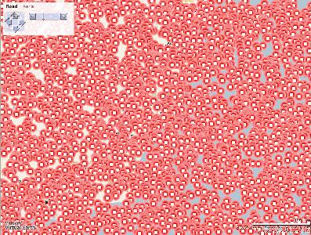
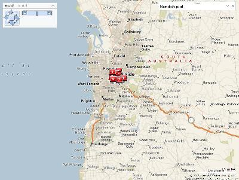
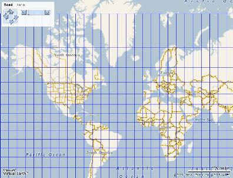
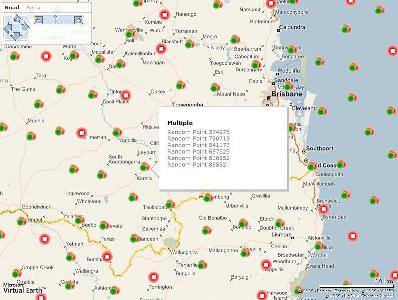

# Clustering
> [!CAUTION]
>  The content in this article may still be applicable to the current version of the [!INCLUDE[vemc_product_name](../articles/includes/vemc-product-name-md.md)], but it uses a previous version of the [!INCLUDE[ve_product_name](../articles/includes/ve-product-name-md.md)] which is no longer supported. More information about the current version of the [!INCLUDE[ve_product_name](../articles/includes/ve-product-name-md.md)] is found in the [Bing Map Control SDK](http://msdn.microsoft.com/en-us/library/bb429619.aspx).  
  
 So you have a million houses, festivals or gnomes you want to display on VE, but when you display them all at once it is messy and slow. Why not try clustering them?  
  
   
  
   
  
 Basically the issue is when you have large number of pins to put on the [!INCLUDE[ve_product_abbr](../articles/includes/ve-product-abbr-md.md)] map two problems occur.  
  
-   If you go and add them all it is going to slow down to a crawl or timeout.  
  
-   If you have pins at a close proximity at certain zoom levels they are going to sit on top of each other and be completely unusable.  
  
## Clustering  
 Dr Neil first mentioned [the idea of a "Mega Cluster" on the Via Virtual Earth forums](http://www.viavirtualearth.com/VVE/Forum/2/449.ashx). A Mega Cluster is simply a single pin that represents many pins at that location. I believe with the current [!INCLUDE[ve_product_abbr](../articles/includes/ve-product-abbr-md.md)] control these are needed as soon as you want to put more then 200 pins on a map.  
  
 A really simple example can be made with 20 pins, let say they represent 20 churches, located in the same city. Now everything is fine when you are zoomed in on the city but as you zoom out all the pins end up on top of each other. The rollover gives you a single church. What about the others? This is an example of the pins being unusable.  
  
   
  
 Using clustering, a mega cluster would be formed to represent all the churches at this zoom level. The rollover then would give you information about each of the churches.  
  
 Now imagine we plotted every church in Australia, or every church in the world. Without clustering this would be impossible, the page size alone would be gigabytes. With a clustering algorithm I will show you how we can plot 1 million pins with consistent performance.  
  
## .NET 2.0 and AJAX  
 For the amount of data we are dealing with we need to perform our clustering server side. The following example is in vb.net but C# offers a few extra features if you're that way inclined. Generics are very cool and part of .net2.0 only. Time to upgrade if you're still in 1.1 land.  
  
 To provide a rich control that seamlessly clusters pins when the user pans and zooms we need to make an asynchronous call to a web service to get out pins in XML. This can then be bound to the [!INCLUDE[ve_product_abbr](../articles/includes/ve-product-abbr-md.md)] control in JavaScript (or Atlas) in various ways. What we want is every time the map is panned or zoomed to get a new set of data. The parameters we will need to pass are: top left Lat Lon, bottom right Lat Lon (so we know the area that is visible) and the zoom level.  
  
 The ASPX page is responsible for getting the data from the web service and producing the JavaScript required to render it on the map.  
  
 When we see ATLAS supporting all the required functionality this will be redundant.  
  
## Calculations  
 So I assume you have a collection of all the pins you want to render in some way. Firstly we can cut our workload by only getting the ones that are visible. If the pins are stored in the database we could query to get only these. If we had a more common set of pins perhaps these are cached, if so we need to get a subset of just the visible ones.  
  
 In my example we have randomly generated 1,000,000 pins within the bounds of the earth. I need to get a subset of visible pins using the passed in parameters. I create a new collection that contains these pins and two other important pieces of information.  
  
 Using the algorithm from [Casey Chesnut](http://www.brains-n-brawn.com/) for a given longitude and zoom level we can calculate the number of pixels from the left. We can also calculate the number of pixels from the top using the latitude and zoom level. These are really important as the latitude and longitude alone do not represent even spacing on our map.  
  
   
  
 VE uses the Mercator projection of the earth which distorts the earth to make it flat.  
  
 Now we need to identify which pins are so close to each other at this zoom level they should be made into a mega cluster. For every visible pin we know its pixel location, we will use this to cluster our pins. For my example I found the best performance when I divided the map into 200 squares. Feel free to play with the number based on your experience.  
  
### randompoints.asmx  
 The first thing we need is our web service providing the clustered data to the [!INCLUDE[ve_product_abbr](../articles/includes/ve-product-abbr-md.md)] control. This is the interesting bit.  
  
```  
'Web service prototype to provide map data  
'This creates 1,000,000 random points across the world.  
'Only points in the visible bounds are selected  
'These are then clustered  
  
Imports System.Web.Services  
Imports System.Collections.Generic  
  
<WebService(Namespace:="http://tempuri.org/")> _  
<WebServiceBinding(ConformsTo:=WsiProfiles.BasicProfile1_1)> _  
<Global.Microsoft.VisualBasic.CompilerServices.DesignerGenerated()> _  
Public Class RandomPoints  
  Inherits System.Web.Services.WebService  
  
  Private Const iMaxRenderedPoints = 200  
  'The maximum number of points to render on a given map -   
  'determined by clients performance  
  Private Const sClusterTitle As String = "Multiple"  
  'What to write as the title of clustered points  
  Private Const sClusterImage As String = "images/megacluster.gif"  
  Private Const sIconImage As String = "images/icon.gif"  
  'What image to use  
  Private Const iMaxMultipleDescription As Integer = 250  
  
  Private Const earthRadius As Double = 6378137  
  'The radius of the earth - should never change!  
  Private Const earthCircum As Double = earthRadius * 2.0 * Math.PI  
  'calulated circumference of the earth  
  Private Const earthHalfCirc As Double = earthCircum / 2  
  'calulated half circumference of the earth  
  
  Private ipixelwidth As Integer  
  'The width the average icon in pixels - used to determine overlapping icons  
  Private ipixelheight As Integer  
  'The height the average icon in pixels - used to determine overlapping icons  
  
  'Gets clustered points within bounds.  
  <WebMethod()> _  
  Public Function GetData(ByVal TopLeftVisible As VELatLong, _  
  ByVal BottomRightVisible As VELatLong, ByVal ZoomLevel As Integer, _  
  ByVal Width As Integer, ByVal Height As Integer) As List(Of VEPushpin)  
  
    Dim rnddata As List(Of VEPushpin) = getrandomdata()  
    Dim pixelvisibledata As List(Of PushpinPixel)  
    Dim groupeddata As List(Of VEPushpin)  
    Dim PPPC As New PushPinPixelComparer  
  
    'get visible points only  
    pixelvisibledata = getVisibleitems(rnddata, TopLeftVisible, _  
    BottomRightVisible, ZoomLevel)  
  
    'order by pixel x then y  
    pixelvisibledata.Sort(PPPC)  
  
    'set the pixel bounds based on height and width and maximum allowed points  
    ipixelwidth = Width / Math.Sqrt(iMaxRenderedPoints)  
    ipixelheight = Height / Math.Sqrt(iMaxRenderedPoints)  
  
    'cluster points  
    groupeddata = clusterpoints(pixelvisibledata)  
  
    Return groupeddata  
  End Function  
```  
  
 So we set a whole bunch of constants, we have a web method that you pass the lat long bounds, zoom level and the height and width. We get our data, get the visible pins only and get their x y pixel values at the same time, sort the list and cluster.  
  
 The getVisibleitems method creates a new list of only the visible pins and populates their pixel positions for this zoom level  
  
```  
'For the specifed bounds creates a new list of visible points and   
'populates their pixel values into the new PushpinPixel object  
Private Function getVisibleitems(ByRef rnddata As List(Of VEPushpin), _  
ByVal TopLeftVisible As VELatLong, ByVal BottomRightVisible As VELatLong, _  
ByVal ZoomLevel As Integer) As List(Of PushpinPixel)  
  Dim pixelvisibledata As New List(Of PushpinPixel)  
  For Each currentitem As VEPushpin In rnddata  
    'make new list of visible points  
    If currentitem.location.Latitude <= TopLeftVisible.Latitude AndAlso _  
    currentitem.location.Latitude >= BottomRightVisible.Latitude AndAlso _  
    currentitem.location.Longitude >= TopLeftVisible.Longitude AndAlso _  
    currentitem.location.Longitude <= BottomRightVisible.Longitude Then  
      'calulate centre pixel  
      pixelvisibledata.Add(New _  
      PushpinPixel(LatitudeToYAtZoom(currentitem.location.Latitude, _  
      ZoomLevel), LongitudeToXAtZoom(currentitem.location.Longitude, _  
      ZoomLevel), currentitem))  
    End If  
  Next  
  Return pixelvisibledata  
End Function  
```  
  
## My Algorithm  
 We go through the list in order, for each pin if we look backwards in the list for any pins within the range that are not already grouped, as the pins are in order we exit as soon as it exceeds the range.  
  
 We then look forwards in the list for any pins within the range, again we short out.  
  
 For each value we find that longitude is in the range we check to see if the latitude is in the range also, if it is we group this. We end up with a list of pins, some of them grouped, all of them visible in the current view.  
  
 The clusterpoints function takes the list of pins with their pixel values and clusters them returning a clustered list of VEPushPin ready to go and plot on the map.  
  
```  
'given a set of points, clusters based on pixel proximity and   
'return a standard list of VEPushpin ready to add to map  
Private Function clusterpoints(ByRef pixelvisibledata As _  
List(Of PushpinPixel)) As List(Of VEPushpin)  
  Dim isCluster As Boolean  
  Dim sClusterDescription As StringBuilder  
  Dim groupeddata As New List(Of VEPushpin)  
  For index As Integer = 0 To (pixelvisibledata.Count - 1)  
    If pixelvisibledata(index).x > 0 Then  
      'cluster points are set to x = -1, skip already cluster points  
      isCluster = False  
      sClusterDescription = New StringBuilder  
      sClusterDescription.Append(pixelvisibledata(index).PushPin.title)  
      sClusterDescription.Append("<br />")  
      'look backwards in the list for any points   
      'within the range that are not already grouped, as the points are   
      'in order we exit as soon as it exceeds the range.    
      sClusterDescription.Append(cluster(pixelvisibledata, isCluster, _  
      index, -1))  
  
      'look forwards in the list for any points within the range,   
      'again we short out.    
      sClusterDescription.Append(cluster(pixelvisibledata, isCluster, _  
      index, 1))  
  
      'if point had other points  
      If isCluster Then  
        'make into a cluster  
        If sClusterDescription.ToString().Length > _  
        iMaxMultipleDescription Then  
          pixelvisibledata(index).PushPin.details = _  
          sClusterDescription.ToString().Substring(0, _  
          iMaxMultipleDescription) & "..."  
        Else  
          pixelvisibledata(index).PushPin.details = _  
          sClusterDescription.ToString()  
        End If  
        pixelvisibledata(index).PushPin.title = sClusterTitle  
        pixelvisibledata(index).PushPin.icon_url = sClusterImage  
      End If  
  
      'add point  
      groupeddata.Add(pixelvisibledata(index).PushPin)  
    End If  
  Next  
  Return groupeddata  
End Function  
```  
  
 The cluster function is a refactored function that searches either backwards or forwards for pins within the proximity.  
  
```  
'look in the list for any points within the range that are not already grouped,   
'as the points are in order we exit as soon as it exceeds the range.   
Private Function cluster(ByRef pixelvisibledata As List(Of PushpinPixel), _  
ByRef isCluster As Boolean, ByVal index As Integer, ByVal direction As Integer) _  
As String  
  Dim finished As Boolean = False  
  Dim searchindex As Integer  
  Dim sClusterDescription As New StringBuilder  
  finished = False  
  searchindex = index + direction  
  While Not finished  
    If searchindex >= pixelvisibledata.Count OrElse searchindex < 0 Then  
      finished = True  
    Else  
      If pixelvisibledata(searchindex).x > 0 Then  
        If Math.Abs(pixelvisibledata(searchindex).x - _  
        pixelvisibledata(index).x) < ipixelwidth Then  
          'within the same x range  
          If Math.Abs(pixelvisibledata(searchindex).y - _  
          pixelvisibledata(index).y) < ipixelheight Then  
            'within the same y range = cluster needed  
            isCluster = True  
            'add to cluster list  
            sClusterDescription.Append( _  
pixelvisibledata(searchindex).PushPin.title)  
            sClusterDescription.Append("<br />")  
            'set pixels to negative to stop any further clustering  
            pixelvisibledata(searchindex).x = -1  
            pixelvisibledata(searchindex).y = -1  
          End If  
        Else  
          finished = True  
        End If  
      End If  
        searchindex += direction  
      End If  
    End While  
  Return sClusterDescription.ToString  
End Function  
```  
  
 The getrandomdata method is where I generate my million random pins for this demo  
  
```  
'Creates some random data to play with - would replace with real data source   
'and cache for performance if possible  
Private Function getrandomdata() As List(Of VEPushpin)  
  Dim rnddata As List(Of VEPushpin)  
  rnddata = New List(Of VEPushpin)  
  Dim randObj As New Random(20)  
  Dim itemlocation As VELatLong  
  For x As Integer = 1 To 1000000 'yes one million points here!  
    itemlocation = New VELatLong((((randObj.NextDouble() * 180) - 90)).ToString, _  
    ((randObj.NextDouble() * 360) - 180).ToString) 'whole world  
    rnddata.Add(New VEPushpin(x, itemlocation, sIconImage, _  
    "Random Point " & x, "Random Description " & x))  
  Next  
  Return rnddata  
End Function  
```  
  
 We also need some helper functions for calculating the pixel positions  
  
```  
'helper function - converts a latitude at a certain zoom into a y pixel  
Private Function LatitudeToYAtZoom(ByVal lat As Double, ByVal zoom As Integer) _  
As Integer  
  Dim arc As Double = earthCircum / ((1 << zoom) * 256)  
  Dim sinLat As Double = Math.Sin(DegToRad(lat))  
  Dim metersY As Double = earthRadius / 2 * Math.Log((1 + sinLat) / _  
  (1 - sinLat))  
  LatitudeToYAtZoom = CInt(Math.Round((earthHalfCirc - metersY) / arc))  
End Function  
  
'helper function - converts a longitude at a certain zoom into a x pixel  
Private Function LongitudeToXAtZoom(ByVal lon As Double, ByVal zoom As Integer) _  
As Integer  
  Dim arc As Double = earthCircum / ((1 << zoom) * 256)  
  Dim metersX As Double = earthRadius * DegToRad(lon)  
  LongitudeToXAtZoom = CInt(Math.Round((earthHalfCirc + metersX) / arc))  
End Function  
  
'helper function - converts degrees to radians  
Private Function DegToRad(ByVal d As Double) As Double  
  Return d * Math.PI / 180.0  
End Function  
  
'helper function - determines meters per pixel for given zoom level  
Private Function MetersPerPixel(ByVal zoom As Integer) As Double  
  MetersPerPixel = earthCircum / ((1 << zoom) * 256)  
End Function  
```  
  
 The PushpinPixel class stores a pin and its x and y pixel values  
  
```  
'Used to populate with VEPushpins with their calulated pixel position  
Public Class PushpinPixel  
  Private _x As Integer  
  Private _y As Integer  
  Private _PushPin As VEPushpin  
  
  Public Property x() As Integer  
    Get  
      Return _x  
    End Get  
    Set(ByVal value As Integer)  
      _x = value  
    End Set  
  End Property  
  
  Public Property y() As Integer  
    Get  
      Return _y  
    End Get  
    Set(ByVal value As Integer)  
      _y = value  
    End Set  
  End Property  
  
  Public Property PushPin() As VEPushpin  
    Get  
      Return _PushPin  
    End Get  
    Set(ByVal value As VEPushpin)  
      _PushPin = value  
    End Set  
  End Property  
  
  Public Sub New()  
  
  End Sub  
  
  Public Sub New(ByVal x As Integer, ByVal y As Integer, ByVal pushpin As VEPushpin)  
    _x = x  
    _y = y  
    _PushPin = pushpin  
  End Sub  
  
End Class  
```  
  
 The PushPinPixelComparer class is a comparer to allow us to sort our PushPinPixel objects. Generics are very cool  
  
```  
'A comparer class for PushPinPixel to sort by pixel x then by pixel y  
Public Class PushPinPixelComparer  
  Implements IComparer(Of PushpinPixel)  
  Public Function Compare(ByVal x As PushpinPixel, ByVal y As PushpinPixel) _  
  As Integer Implements IComparer(Of PushpinPixel).Compare  
  
    If x Is Nothing Then  
      If y Is Nothing Then  
        ' If x is Nothing and y is Nothing, they're  
        ' equal.   
        Return 0  
      Else  
        ' If x is Nothing and y is not Nothing, y  
        ' is greater.   
        Return -1  
      End If  
    Else  
      ' If x is not Nothing...  
      '  
      If y Is Nothing Then  
        ' ...and y is Nothing, x is greater.  
        Return 1  
      Else  
        ' ...and y is not Nothing, compare the   
        ' x values  
        '  
        If x.x > y.x Then  
          'x is greater  
          Return 1  
        Else  
          If x.x = y.x Then  
            'compare the y values  
            If x.y > y.y Then  
              'x is greater  
              Return 1  
            Else  
              If x.x = y.x Then  
                'they're equal.   
                Return 0  
              Else  
                'y is greater  
                Return -1  
              End If  
            End If  
          Else  
            'y is greater  
            Return -1  
          End If  
        End If  
  
      End If  
    End If  
  End Function  
End Class  
```  
  
 I also created two classes to represent VELatLong and VEPushpin.  These classes make it easier to generate the returned JavaScript commands.  
  
```  
'Identical to the VE object to allow for a more seemless transition to Atlas  
Public Class VELatLong  
  Public Latitude As Double  
  Public Longitude As Double  
  
  Public Sub New(ByVal dLatitude As Double, ByVal dLongitude As Double)  
    Latitude = dLatitude  
    Longitude = dLongitude  
  End Sub  
End Class  
  
'Identical to the VE object to allow for a more seemless transition to Atlas   
Public Class VEPushpin  
  Public id As Integer  
  Public location As VELatLong  
  Public icon_url As String  
  Public title As String  
  Public details As String  
  Public iconStyle As String  
  Public titleStyle As String  
  Public detailsStyle As String  
  
  Public Sub New()  
  
  End Sub  
  
  Public Sub New(ByVal _id As Integer, ByVal _location As VELatLong, _  
  ByVal _icon_url As String, ByVal _title As String, ByVal _details As String)  
    id = _id  
    location = _location  
    icon_url = _icon_url  
    title = _title  
    details = _details  
  End Sub  
End Class  
```  
  
### default.aspx  
 Simple map page - could be just html, no code, set width for map div  
  
```  
<head>  
 <script src="http://dev.virtualearth.net/mapcontrol/v4/mapcontrol.js">  
 <script src="scripts/default.js"></script>  
 </script>  
</head>  
<body onload="GetMap();">  
  <div id='MapDiv' style="position:relative; width:800px; height:600px;"></div>   
</body>  
```  
  
### default.js  
 The scripts/default.js file contains all the JavaScript for default.aspx.  The methods load the starting map, and provide the AJAX mechanics for requesting the clustered data points.  
  
```  
// JScript File for default.aspx  
var map = null;  
var pinID = 0;  
  
//initial call to create map  
function GetMap()  
{  
  map = new VEMap('MapDiv');  
  //Yes I'm Australian  
  map.LoadMap(new VELatLong(-33.94578085758696, 151.18131637573242),  
    6 ,'r' ,false);  
  map.SetScaleBarDistanceUnit(VEDistanceUnit.Kilometers);  
  
  map.AttachEvent("onchangeview", DoAjaxQuery);  
  DoAjaxQuery();  
}     
  
//show a loading label  
function ShowLoading()  
{  
  var el = document.createElement("div");   
  el.setAttribute('id',"VELoading");  
  //Now we should know the width and height of the VE map or else go and get it.  
  var curr_width = 800;  
  var curr_height = 600;  
  el.style.top = ((curr_height - 25) / 2) + "px";  
  el.style.left = ((curr_width - 105) / 2) + "px";  
  el.style.border = "1px solid gray";  
  el.style.font = "12px arial";  
  el.style.background = "White";  
  el.style.padding = "2px";  
  el.style.verticalAlign = "middle";  
  el.innerHTML = " Please Wait. Loading data....";    
  map.AddControl(el);  
}  
  
//remove loading label  
function HideLoading()  
{  
  var el = document.getElementById("VELoading");  
  el.parentNode.removeChild(el);  
}  
  
//helper function for AJAX  
function GetXmlHttp()  
{  
  var x = null;  
  try  
  {  
    x = new ActiveXObject("Msxml2.XMLHTTP");  
  }  
  catch (e)  
  {  
    try  
    {  
      x = new ActiveXObject("Microsoft.XMLHTTP");  
    }  
    catch (e)  
    {  
      x = null;  
    }        
  }  
  if (!x && typeof XMLHttpRequest != "undefined")  
  {  
    x = new XMLHttpRequest();        
  }  
  return x;  
}  
  
//call the AJAX query.  
function DoAjaxQuery()  
{  
  //Build the url to call the server  
  var url = "getRandomData.aspx?";  
  url += "tl=" + map.PixelToLatLong(0,0);  
  //Now we should know the width and height of the VE map or else go and get it.  
   var curr_width = 800;  
   var curr_height = 600;  
  
  url += "&w=" + curr_width;  
  url += "&h=" + curr_height;  
  
  url += "&br=" + map.PixelToLatLong(curr_width,curr_height);  
  url += "&z=" + map.GetZoomLevel();  
  
  //put up a loading label  
  ShowLoading();  
  
  //Start by getting the appropriate XMLHTTP object for the browser  
  var xmlhttp = GetXmlHttp();  
  
  //If we have a valid xmlhttp object  
  if (xmlhttp)  
  {  
  
    xmlhttp.open("GET", url, true); // varAsync = true;  
  
    //Set the callback.  This function is called when we   
    xmlhttp.onreadystatechange = function()  
    {  
      if (xmlhttp.readyState == 4)  //4 is a success  
      {  
        //Server code creates javascript "on the fly" for us to  
        //execute using eval()  
        var result = xmlhttp.responseText;  
        eval(result);  
      }  
    }  
    xmlhttp.send(null);  
  }  
}  
```  
  
### GetRandomData.aspx  
 The next piece you need is a wrapper for web service and JavaScript rendering.  **Make sure you delete everything on the aspx page except the initial page include.**  
  
```  
'wrapper for web service and Javascript functionlaity.  
'planned that when Atlas supports all functionality this will be redundant.  
'should be very generic.  
  
Imports System.Collections.Generic  
Partial Class GetRandomData  
  Inherits System.Web.UI.Page  
  
  Const cAddLabel As Boolean = True  
  
  Protected Sub Page_Load(ByVal sender As Object, ByVal e As System.EventArgs) _  
  Handles Me.Load  
    Dim ws As New RandomPoints  
    Dim str As New StringBuilder  
    Dim randompoints As New List(Of VEPushpin)  
  
    'Get query parameters  
    Dim sTopLeft As String() = Request.QueryString("tl").Split(",")  
    Dim sBottomRight As String() = Request.QueryString("br").Split(",")  
    Dim iWidth As Integer = CInt(Request.QueryString("w"))  
    Dim iHeight As Integer = CInt(Request.QueryString("h"))  
    Dim iZoomLevel As Integer = CInt(Request.QueryString("z"))  
  
    'Put into strongly typed objects  
    Dim TopLeftVisible As New VELatLong(CDbl(sTopLeft(0)), CDbl(sTopLeft(1)))  
    Dim BottomRightVisible As New VELatLong(CDbl(sBottomRight(0)), _  
    CDbl(sBottomRight(1)))  
  
    'get date  
    randompoints = ws.GetData(TopLeftVisible, BottomRightVisible, _  
    iZoomLevel, iWidth, iHeight)  
  
    'create javascript to add points to the map  
    str.Append("map.Clear();")  
    For Each randompoint As VEPushpin In randompoints  
      'Create pin  
      str.Append("var loc = new VELatLong(")  
      str.Append(randompoint.location.Latitude)  
      str.Append(", ")  
      str.Append(randompoint.location.Longitude)  
      str.Append(");")  
  
      str.Append("map.AddPushpin(new VEPushpin(pinID++,loc,""")  
      str.Append(randompoint.icon_url)  
      str.Append(""", """)  
      str.Append(randompoint.title)  
      str.Append(""", """)  
      str.Append(randompoint.details)  
      str.Append("""));")  
    Next  
    str.Append("HideLoading();")  
    Response.Write(str.ToString)  
  End Sub  
End Class  
```  
  
 The last pieces you need to make this all work are thee icons.  You need one icon (images/spinner.gif) for the loading screen.  You need a second icon (images/icon.gif) to represent a single icon.  You also need a third icon to represent the clustered icon (images/megacluster.gif).  
  
## Appearance  
 In my example you will see that I have a set icon and title to represent a cluster. All I do is concatenate the titles of the represented pins as the description. Further more I limit this to a set number of characters.  
  
 I'm not sure the best way to represent a mega cluster but I'm sure you have some ideas of how you want to deal with them in your solution.  
  
   
  
## Performance  
 For simplicity I removed all my caching code as it becomes specific to your requirements. Clearly for this example I should cache the 1 million generated pins rather then recreate them every time. A step further would be to store their pixel x and y for each zoom, sort them and store this. But this would assume the data doesn't change much, I have lots of RAM and am expecting lots of requests.  
  
 (One million sounds really good but is slow without caching; try 10,000 pins over your own area for a better experience)  
  
 Importantly this example generates random pins and they look pretty average, try your own data source and the clusters will appear in real locations only.  
  
 Article contributed by [John O'Brien](mailto:john@soulsolutions.com.au) ([www.soulsolutions.com.au](http://www.soulsolutions.com.au/)), and lightly revised by [Robert McGovern MVP (Bing Maps/MapPoint)](https://mvp.support.microsoft.com/profile=A9159573-40DB-4BD1-A079-D57C675E1766). Have you got something to [contribute](mailto:articles@viavirtualearth.com)?