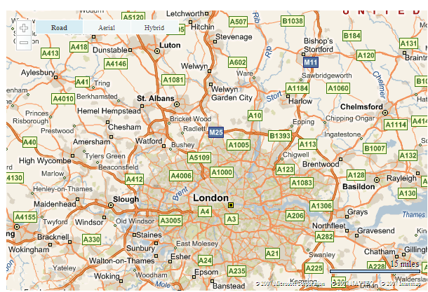

# Converting Earlier Versions to Version 6.3
The [!INCLUDE[vemc_product_name](../articles/includes/vemc-product-name-md.md)] has gone through significant changes with each release. The current version offers more functionality than any previous release of the map control. This article covers some of the changes required to migrate from versions 2, 3, 4, and 5 of the map control to version 6.3 of the map control.  
  
## Creating a Reference to the Map Control  
 Each release of the [!INCLUDE[vemc_product_name](../articles/includes/vemc-product-name-md.md)] requires a slightly different \<script> tag `src` attribute. *Listing 1* through *Listing 5* shows the `src` attributes for versions 2, 3, 4, 5, and 6.3 respectively.  
  
```  
http://dev.virtualearth.net/standard/v2/MapControl.js  
```  
  
 *Listing 1.* The version 2 reference  
  
```  
http://dev.virtualearth.net/mapcontrol/v3/mapcontrol.js  
```  
  
 *Listing 2.* The version 3 reference  
  
```  
http://dev.virtualearth.net/mapcontrol/v4/mapcontrol.js  
```  
  
 *Listing 3.* The version 4 reference  
  
```  
http://dev.virtualearth.net/mapcontrol/mapcontrol.ashx?v=5  
```  
  
 *Listing 4.* The version 5 reference  
  
```  
http://dev.virtualearth.net/mapcontrol/mapcontrol.ashx?v=6.3  
```  
  
 *Listing 5.* The version 6.3 reference  
  
 Therefore, the version 6.3 map control \<script> tag must appear as shown in *Listing 6*.  
  
```  
<script type="text/javascript" src="http://ecn.dev.virtualearth.net/mapcontrol/mapcontrol.ashx?v=6.3"></script>  
```  
  
 *Listing 6.* The full version 6.3 \<script> tag  
  
> [!NOTE]
>  The 6.3 version URL domain is different because this version of the map control uses the Microsoft Content Delivery Network (CDN) to give end users better performance. See the [Bing Map Control Performance](http://msdn.microsoft.com/en-us/8b7f89eb-02c4-4940-8638-1955b66b0de2) topic in the [Bing Maps AJAX Control, Version 6.3](http://msdn.microsoft.com/en-us/e3807b0c-5ad1-4bc1-bff0-7f4af0bad48d) for more information.  
  
## Basic Map Access  
 Version 2 of the map control uses a completely different mechanism to display a map than the newer versions of [!INCLUDE[ve_product_name](../articles/includes/ve-product-name-md.md)]. Version 2 uses the **Msn.VE.MapControl** method to create a map. All newer versions of [!INCLUDE[ve_product_name](../articles/includes/ve-product-name-md.md)] use a **VEMap** object. The sample code in *Listing 7* displays a basic [!INCLUDE[ve_product_name](../articles/includes/ve-product-name-md.md)] map using version 2.  
  
```  
<!DOCTYPE HTML PUBLIC "-//W3C//DTD HTML 4.0 Transitional//EN">  
<html>  
   <head>  
      <title>VE2 Sample</title>  
      <link href="http://dev.virtualearth.net/standard/v2/MapControl.css" type="text/css" rel="stylesheet" />  
  
      <script type="text/javascript" src="http://dev.virtualearth.net/standard/v2/MapControl.js"></script>  
   </head>  
   <script type="text/javascript">  
      var map = null;  
  
      function MyOnLoad()  
      {  
         var params = new Object();  
         params.latitude = 51.64;  
         params.longitude = -0.18;  
         params.zoomlevel = 9;  
         params.mapstyle = 'r';  
         params.showScaleBar = true;  
         params.showDashboard = true;  
         params.dashboardSize = "small";  
         params.dashboardX = 3;  
         params.dashboardY = 3;  
  
         map = new Msn.VE.MapControl(document.getElementById("map"), params);      
         map.Init();  
      }  
   </script>  
   <body onLoad="MyOnLoad();">  
      <div id="map" style="width:600px;height:400px"></div>  
   </body>  
</html>  
```  
  
 *Listing 7.* Code for creating a basic version 2 map  
  
 This produces a map similar to *Figure 1*.  
  
   
  
 *Figure 1.* A basic version 2 map  
  
 Since version 3, the **VEMap** object provides methods for creating, loading and setting the map. With the exception of the map control URL, the code in *Listing 8* generates a basic map similar to the code in *Listing 7* in versions 3, 4, 5, and 6.3.  
  
```  
<!DOCTYPE html PUBLIC "-//W3C//DTD XHTML 1.0 Transitional//EN" "http://www.w3.org/TR/xhtml1/DTD/xhtml1-transitional.dtd">  
<html>  
   <head>  
      <title>VE6.3 Sample</title>  
      <script type="text/javascript" src="http://ecn.dev.virtualearth.net/mapcontrol/mapcontrol.ashx?v=6.3"></script>  
  
      <script type="text/javascript">  
  
         function OnPageLoad()  
         {  
            map = new VEMap('myMap');  
            // SetDashboardSize must be called before calling LoadMap  
            map.SetDashboardSize(VEDashboardSize.Small);  
            map.LoadMap(new VELatLong(51.64, -0.18), 9, VEMapStyle.Road);  
            map.ShowDashboard();  
         }  
      </script>  
   </head>  
   <body onload="OnPageLoad();">  
      <div id='myMap' style="position:relative; width:600px; height:400px;"></div>  
   </body>  
</html>  
```  
  
 *Listing 8.* Code for creating a basic version 6.3 map  
  
 This produces a map similar to *Figure 2*.  
  
   
  
 *Figure 2.* A basic version 6.3 map  
  
 Note how the navigation bar has changed significantly from version 2 to version 6.3.  
  
### Latitude and Longitude  
 Version 2 of [!INCLUDE[ve_product_name](../articles/includes/ve-product-name-md.md)] uses **MSN.VE.LatLong** objects to define latitude and longitude coordinates. All newer versions of [!INCLUDE[ve_product_name](../articles/includes/ve-product-name-md.md)] use a **VELatLong** object to define latitude and longitude coordinate. *Listing 9* shows how a latitude and longitude coordinate is defined in version 2.  
  
```  
var latlong = new Msn.VE.LatLong(47,-112);  
```  
  
 *Listing 9.* Creating a latitude/longitude coordinate in version 2  
  
 *Listing 10* shows how a latitude and longitude coordinate is defined in version 6.3.  
  
```  
var latlong = new VELatLong(47,-112);  
```  
  
 *Listing 10.* Creating a latitude/longitude coordinate in version 6.3  
  
## Pushpins, Polylines, Polygons and Shapes  
 Version 5 release of the map control merged the **VEPushpin**, **VEPolyline**, and **VEPolygon** objects into the **VEShape** class. Version 2 had only pushpins.  
  
 Versions 2 thru 4 use the code shown in *Listing 11* to add a pushpin to a map.  
  
```  
var pin = new VEPushpin(id, latlong, icon_url, title, details, iconStyle, titleStyle, detailsStyle);  
map.AddPushpin(pin);  
```  
  
 *Listing 11.* Adding a pushpin in versions 2, 3, and 4  
  
 Version 6.3 uses the code shown in *Listing 12* to add a pushpin to a map.  
  
```  
var pin = new VEShape(VEShapeType.Pushpin, latlong);  
pin.SetCustomIcon(icon_url);  
pin.SetTitle(title);  
pin.SetDescription(details);  
map.AddShape(pin);  
```  
  
 *Listing 12.* Adding a pushpin in version 6.3  
  
 Versions 3 and 4 use the code in *Listing 13* and *Listing 14* to add a polyline and polygon, respectively, to a map  
  
```  
var polyline = new VEPolyline(id, locations, color, width);  
map.AddPolyline(polyline);  
```  
  
 *Listing 13.* Adding a polyline to a map in versions 3 and 4  
  
```  
var polygon  = new VEPolygon(id, locations, fillColor, outlineColor, outlineWidth);  
map.AddPolygon(polygon);  
```  
  
 *Listing 14.* Adding a polygon to a map in versions 3 and 4  
  
 Versions 5 and 6.3 use the code in *Listing 15* and *Listing 16* to add a polyline and polygon, respectively, to a map  
  
```  
// locations is an array of VELatLong objects  
var polyline = new VEShape(VEShapeType.Polyline, locations);  
polyline.SetLineColor(color);  
polyline.SetLineWidth(width);  
map.AddShape(polyline);  
```  
  
 *Listing 15.* Adding a polyline to a map in versions 5 and 6.3  
  
```  
// locations is an array of VELatLong objects  
var polygon  = new VEShape(VEShapeType.Polygon, locations);  
polygon.SetFillColor(fillColor);  
polygon.SetLineColor(outlineColor);  
polygon.SetLineWidth(outlineWidth);  
map.AddShape(polygon);  
```  
  
 *Listing 16.* Adding a polygon to a map in versions 5 and 6.3  
  
## Searching for Locations  
 The ability to search for locations is essential in all versions of [!INCLUDE[ve_product_name](../articles/includes/ve-product-name-md.md)]. In version 2 this was accomplished using the [!INCLUDE[ve_product_name](../articles/includes/ve-product-name-md.md)] Search Manager. This required accessing content outside of main Web page’s domain. *Listing 17* shows a search in version 2.  
  
```  
function DoFind()  
{  
  var where = document.getElementById("WhereText").value;  
  VE_SearchManager._ResetPaging();  
  VE_SearchManager._CancelAllRequests();  
  VE_SearchManager.searchPage="http://local.live.com/search.aspx";  
  VE_SearchManager._DoSearch(where, where);  
}  
```  
  
 *Listing 17.* Searching for locations in version 2  
  
 This search functionality is no longer supported, as the **local.live.com** URL no longer supports query strings. Versions 3 and 4 use the **Find**, **FindNearby**, and **FindLocation** functions, as shown in *Listing 18, Listing 19*, and *Listing 20*, respectively.  
  
```  
map.Find(what,where, index, callback);  
```  
  
 *Listing 18*. The **Find** function in versions 3 and 4  
  
```  
map.FindNearby(what, callback);  
```  
  
 *Listing 19*. The **FindNearby** function in versions 3 and 4  
  
```  
map.FindLocation(where, callback);  
```  
  
 *Listing 20*. The **FindLocation** function in versions 3 and 4  
  
 Version 5 combined these methods into the **Find** method. This method has many more options than its predecessors. The code in *Listing 21*, *Listing 22*, and *Listing 23* are are equivalent to the **Find**, **FindNearby**, and **FindLocation** functions shown in *Listing 18, Listing 19*, and *Listing 20*, respectively.  
  
```  
map.Find(what, where, null, null, null, null, null, null, null, null, callback);  
```  
  
 *Listing 21*. The **Find** function in versions 5 and 6.3  
  
```  
map.Find(what, null, null, null, null, null, null, null, null, null, callback);  
```  
  
 *Listing 22*. The **Find** (nearby) function in versions 5 and 6.3  
  
```  
map.Find(null, where, null, null, null, null, null, null, null, null, callback);  
```  
  
 *Listing 23*. The **Find** (location) function in versions 5 and 6.3  
  
 The other parameters in the **Find** method allow for extensive control over how the search is performed. You can, for example control whether pushpins are automatically created, or whether the map control displays a disambiguation dialog box if more than one result is returned.  
  
## Events  
 Version 5 renamed some of the map events that are used in versions 2, 3 and 4. In addition there are several new events available. *Table 1* lists the changes.  
  
|Version 2, 3, and 4 Event|Version 5 and 6.3 Event|  
|-------------------------------|-----------------------------|  
|onendcontinuouspan|onendpan|  
|onstartcontinuouspan|onstartpan|  
|oncontextmenu|onclick|  
|VEPushpin.ShowDetailOnMouseover|onmouseover|  
  
 *Table 1.* Event name changes from version 4 to version 5  
  
 In versions 2, 3, and 4 a common method for attaching events was to attach them to pushpins. In version 6.3 events are attached to the map. The code in *Listing 24* is an example of how events are handled in versions 2, 3 and 4.  
  
```  
VEPushpin.OnMouseOverCallback = function(x,y) { // do something }  
```  
  
 *Listing 24*. Handling the **onmouseover** event in versions 2, 3, and 4  
  
 The code in *Listing 25* is an example of how events are handled in versions 5 and 6.3.  
  
```  
map.AttachEvent("onmouseover", onMouseOverCallback);  
…  
function onMouseOverCallback(e)  
{  
   // check to see if we have hovered over a pushpin  
   if(e.elementID != null)  
   {  
    // do something  
   }  
}  
```  
  
 *Listing 25*. Handling the **onmouseover** event in versions 5 and 6.3  
  
 Not only do versions 5 and 6.3 offer more events than previous versions, but you also have greater control over events.  
  
## Routes  
 Versions 3, 4, and 5 used the **VEMap.GetRoute** method to get a route. In version 6.3 this method is deprecated and a new **VEMap.GetDirections** method is used to display multi-point routes. The code in *Listing 26* shows how the **GetRoute** method is used in versions 3, 4, and 5 to get a route from Seattle to Microsoft.  
  
```  
map.GetRoute("Seattle", "Microsoft");  
```  
  
 *Listing 26.* Getting a route using **GetRoute** in versions 3, 4, and 5  
  
 The code in *Listing 27* shows how the **GetDirections** method as used in version 6.3 to get a route from Seattle to Microsoft, through Bellevue.  
  
```  
map.GetDirections(["Seattle", "Bellevue WA", "Microsoft"]);  
```  
  
 *Listing 27.* Getting a multi-point route using **GetDirections** in version 6.3  
  
## Conclusion  
 Although continuing to work with versions 2, 3 and 4 may appear easier than migrating to the newest version of [!INCLUDE[ve_product_name](../articles/includes/ve-product-name-md.md)], migrating will give you a lot more functionality. More information on the new features in version 6.3 can be found online at [http://msdn2.microsoft.com/en-us/library/bb412561.aspx](http://msdn2.microsoft.com/en-us/library/bb412561.aspx).  
  
## About the Author  
 Richard Brundritt is a software developer at Infusion Development.  
  
## See Also  
 [Converting from Version 5 to Version 6.3](../articles/converting-from-version-5-to-version-6-3.md)