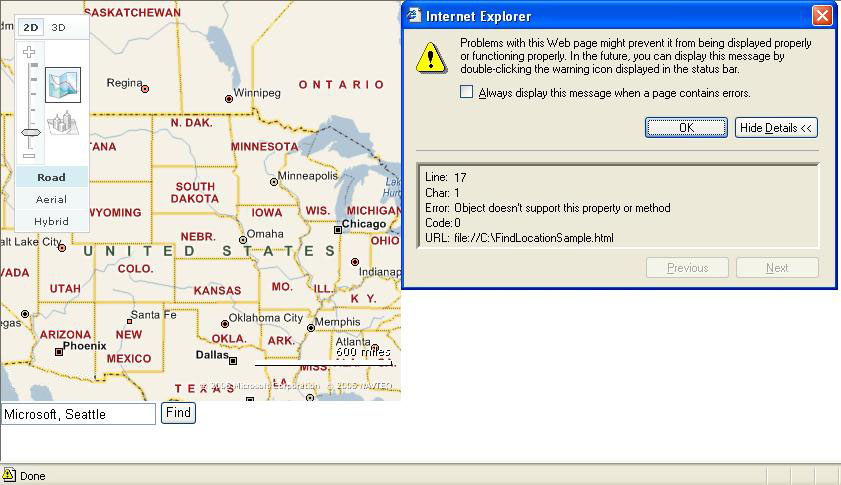
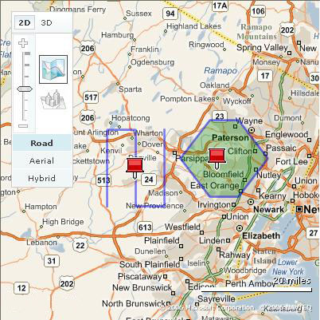
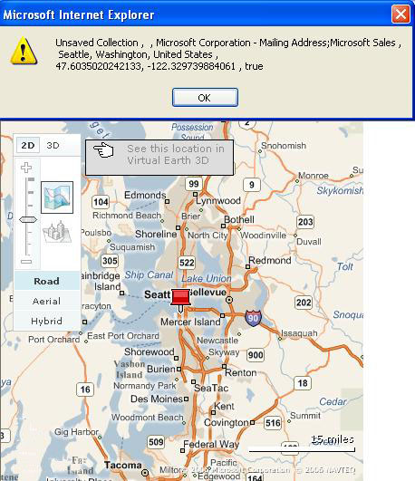

# Converting From VE4 to VE5
> [!CAUTION]
>  The content in this article may still be applicable to the current version of the [!INCLUDE[vemc_product_name](../articles/includes/vemc-product-name-md.md)], but it uses a previous version of the [!INCLUDE[vemc_product_name](../articles/includes/vemc-product-name-md.md)] which is no longer supported. More information about the current version of the [!INCLUDE[vemc_product_name](../articles/includes/vemc-product-name-md.md)] is found in the [Bing Map Control SDK](http://msdn.microsoft.com/en-us/library/bb429619.aspx).  
  
 The [!INCLUDE[vemc_product_name](../articles/includes/vemc-product-name-md.md)] API has gone through many significant changes through its past releases.  The Version 5.0 (V5) release provides yet another set of major changes and new functionality.  In this article, we will look at the API features and code that will need to be changed to upgrade a [!INCLUDE[vemc_product_name](../articles/includes/vemc-product-name-md.md)] version 4 (V4) application to version 5.  
  
 For example, if you are responsible for maintaining your [!INCLUDE[ve_product_name](../articles/includes/ve-product-name-md.md)] applications, you will find that the new shape model in [!INCLUDE[ve_product_name](../articles/includes/ve-product-name-md.md)] will be your biggest challenge and also provide your greatest opportunity for enhancing and improving your application.  You will also see that the streamlining of the Find methods results in greater control with fewer lines of code.  However, these improvements do come at the cost of API changes that may break your application (Figure 1).  In addition to referencing the new API, you will need to modify several aspects of your code to bring your application up into compliance with V5.  
  
   
  
 *Figure 1: Attempting a Map.FindLocation call in Version 5.0 will generate an error message*  
  
 The purpose of this article is to help developers who have some experience using the [!INCLUDE[vemc_product_name](../articles/includes/vemc-product-name-md.md)] 4.0 API migrate their applications to the new [!INCLUDE[vemc_product_name](../articles/includes/vemc-product-name-md.md)] 5.0 API.  The article will also provide a brief overview of a few of the new features in the [!INCLUDE[ve_product_abbr](../articles/includes/ve-product-abbr-md.md)] v5 API.  
  
## Switching to VEShapes  
 [!INCLUDE[vemc_product_name](../articles/includes/vemc-product-name-md.md)] 5.0 has introduced a new class known as `VEShape`, which merges the `VEPushpin`, `VEPolyline`, and `VEPolygon` objects into one class.  Instead of adding specific types of shape objects, you simply create a new `VEShape` and pass in a parameter indicating the type.  All `VEShape` objects are contained inside a `VEShapeLayer`.  The shape layer allows you to quickly and easily organize your shapes and change the properties of those shapes.  
  
 The restructured shape API makes developing with [!INCLUDE[ve_product_abbr](../articles/includes/ve-product-abbr-md.md)] much more intuitive as it cuts back the amount of classes to memorize.  The uniform shape API also provides more control over your shapes and how they are being displayed.  In addition, the new API removes the strain of having to track all your pushpin/polyline/polygon IDs as the ID values are now all auto-generated and kept within the scope of the `VEShapeLayer`.  
  
## Working With Pushpins  
 Since the `VEPushpin` class is now obsolete, you will need to change your pushpin creation to match the `VEShape` methodology.  In version 4.0, you created the `VEPushpin` entirely within the constructor and then had very little control over the pushpin after creation.  
  
```  
var pin = new VEPushpin(id, location, icon_url, title, details,  
  iconStyle, titleStyle, detailsStyle);  
map.AddPushpin(pin);  
```  
  
 *Listing 1: Adding a pushpin in Version 4.0*  
  
 Rather than creating your `VEPushpin` inside the constructor, you can now set each individual parameter using separate methods inside a `VEShape` that is declared with `VEShapeType.Pushpin`.  Also to note, is that the id of the pin is not a settable parameter in version 5.0.  You can retrieve the auto-generated ID by using the `getID` method.  
  
```  
//location is a single VELatLong object  
  
var pin = new VEShape(VEShapeType.Pushpin, location);  
pin.SetCustomIcon(icon_url);  
pin.SetTitle(title);  
pin.SetDescription(details);  
map.AddShape(pin);  
```  
  
 *Listing 2: Adding a pushpin in Version 5.0*  
  
### Styling Pushpins  
 In version 4.0, you could use CSS styling on a pushpin by leveraging the `iconStyle`, `titleStyle` and `detailsStyle` parameters in the pushpin constructor.  In version 5, all three of these parameters have been deprecated and are no longer necessary.  Instead of setting CSS as in version 4, you have full control over the appearance of the pushpin and info bubble.  
  
```  
var pin = new VEPushpin(id, location, icon_url, title, details, iconStyle, titleStyle, detailsStyle);  
Listing 3: Adding style to a pushpin in Version 4.0  
```  
  
 In order to style a pushpin in V5, enclose your styling inside of an HTML \<div> tag using the respective `VEShape.SetCustomIcon(icon)`, `VEShape.SetTitle(title)` and `VEShape.SetDescription(details)` methods.  The div style could easily reference an external CSS file which would give you your desired styling.  A sample would be:  
  
```  
//Remove default styling applied to the bubble  
map.ClearInfoBoxStyles();  
  
pin.SetCustomIcon(“<div class=’pinStyle’></div>”;  
pin.SetTitle(<div class=’titleStyle’>This is my Custom Styled Title</div>);  
pin.SetDescription(“<div class=’descriptionStyle’>This is my Custom Styled Description</div>”);  
```  
  
 *Listing 4: Adding style to a pushpin in Version 5.0*  
  
```  
.pinStyle  
//enter in your pin styles here  
}  
.titleStyle  
{  
//enter in your title styles here  
}  
.descriptionStyle  
{  
//enter in your description styles here  
}  
```  
  
 *Listing 5: The Corresponding CSS file*  
  
 These methods accept plain text HTML, so it’s not necessary to encase your text inside HTML \<div> tags to apply styling to them.  Note also, that by setting the `CustomIcon` property, you can make your pushpins appear any way you would like.  You are no longer restricted to basic icons.  
  
## Polylines and Polygons  
 Creating a `VEPolyline` or `VEPolygon` follows the same conversion procedure as creating a `VEPushpin`.  In version 4.0 the `VEPolyline`/`VEPolygon` was fully created with the constructor and added to the map using `VEMap.AddPolyline` or `VEMap.AddPolygon`.  
  
```  
var PolyLine = new VEPolyline(id, locations, color, width);  
map.AddPolyline(PolyLine);  
Listing 6 Adding a polyline in Version 4.0  
var Polygon = new VEPolygon(id, locations, fillColor, outlineColor, outlineWidth);  
map.AddPolygon(Polygon);  
```  
  
 *Listing 7: Adding a polygon in Version 4.0*  
  
 The `VEPolyline`/`VEPolygon` constructor is now broken down into methods that can be set inside the `VEShape` class. Polygons and Polylines are both now instances of `VEShape` with the shape property set to either `VEShapeType.Polyline` or `VEShapeType.Polygon`. In addition to the shape type, you must pass in an array of `VELatLong` points indicating the vertices of the line or polygon.  
  
```  
//Locations is an array of VELatLong objects  
var Shape = new VEShape(VEShapeType.Polyline, locations);  
Shape.SetLineColor(color);  
Shape.SetLineWidth(width);  
map.AddShape(shape);  
Listing 8 Adding a polyline in Version 5.0  
var Shape = new VEShape(VEShapeType.Polygon, locations);  
Shape.SetFillColor(fillColor);  
Shape.SetLineColor(outlineColor);  
Shape.SetLineWidth(outlineWidth);  
map.AddShape(shape);  
```  
  
 *Listing 9: Adding a polygon in Version 5.0*  
  
 Note that the polygon location array no longer needs to be closed.  That is, [!INCLUDE[ve_product_name](../articles/includes/ve-product-name-md.md)] will automatically connect the last point in your array with the first point in your array for a polygon.  
  
 In addition, a `VEPushpin` is placed on the approximate centroid of each created polyline and polygon.  If you wish to hide this icon, you can simply make a call to `VEShape.Hide()` before adding the shape to the map.  
  
   
  
 Figure 2 Pushpins are now created by default when a Polyline or Polygon is constructed  
  
 As with pushpins, you can completely control the style and display mechanics of the pushpin and resulting info bubble.  You can also adjust the pushpin location by setting the shapes IconAnchor property.  By passing in a `VELatLong` object to the `VEShape.SetIconAnchor` method, you can explicitly decide where your pushpin should go with reference to your polygon or polyline.  
  
## Changes for Finding a Location  
 `VEMap.FindLocation` and `VEMap.FindNearby` have been merged into a single `VEMap.Find` method.  The `VEFindResults` and `VESearchResult` classes in version 4.0 have been replaced with the `FindResult` class and a new `VEPlace` class.  
  
 Using the consolidated `Find` method, Version 5.0 still allows you to search for both "what" and "where" in addition to providing  levels of customization such as disabling the autozoom and disambiguation box.  
  
### Making Find Calls  
 If you need to duplicate a simple `VEMap.FindNearby` or a `VEMap.FindLocation` from version 4.0:  
  
```  
map.FindNearby(what);  
```  
  
 *Listing 10: A simple FindNearby call in Version 4.0*  
  
```  
map.FindLocation(where)  
```  
  
 *Listing 11: A simple FindLocation call in Version 4.0*  
  
 The equivalent methods in Version 5.0 are straightforward:  
  
```  
map.Find(what);  
```  
  
 *Listing 12: A FindNearby equivalent call in Version 5.0*  
  
```  
map.Find(null,where);  
```  
  
 *Listing 13: A FindLocation equivalent call in Version 5.0*  
  
 Likely you will want to consume the results returned from your search.  In version 4.0 you would add the callback parameter at the end of your method:  
  
```  
map.FindNearby(what,callback)  
```  
  
 *Listing 14: A FindNearby with callback in Version 4.0*  
  
```  
map.FindLocation(where,callback)  
```  
  
 *Listing 15: A FindLocation with callback in Version 4.0*  
  
 Due to the vast array of customization options in version 5.0, many nulls will need to be inserted to accommodate for the callback parameter which occurs at the end of the `VEMap.Find` method.  
  
```  
map.Find(what,null,null,null,null,null,null,null,null,null,callback);  
```  
  
 *Listing 16: A FindNearby with callback in Version 5.0*  
  
```  
map.Find(null,where,null,null,null,null,null,null,null,null,callback);  
```  
  
 *Listing 17: A FindLocation with callback in Version 5.0*  
  
 Finally, a `VEMap.Find` call in version 4.0 was a combination of both `VEMap.FindNearby` and `VEMap.FindLocation` methods.  
  
```  
map.Find(what,where,index,callback);  
```  
  
 *Listing 18: A Find with callback in Version 4.0*  
  
 Version 5.0 easily puts them together in its own `VEMap.Find` correspondent.  
  
```  
map.Find(what,where,null,null,null,null,null,null,null,null,callback);  
```  
  
 *Listing 19: A Find with callback in Version 5.0*  
  
### Processing the Find Callback  
 In Version 4.0, the Map.Find callback returned either an array of `VESearchResult` objects or an array of `VEFindResults` objects , depending on what parameters were initially passed to make the `Map.Find` call.  
  
```  
function FindElvis()  
{  
Map.Find(‘elvis’,’Las Vegas,NV ’,’1’,onFoundResults);   
}  
function onFoundResults(findResults)  
{  
var results="Find Results:\n";  
     for (r=0; r < findResults.length; r++)  
{  
                  results += findResults[r].Name + ", ";  
                  results += findResults[r].Description + ": ";  
                  results += findResults[r].Phone + "\n";  
     }  
     alert(results);  
}  
```  
  
 *Listing 20: Sample code for processing the callback in Version 4.0*  
  
 In V5, the information sent to the callback has been split into four parameters: `Shapelayer`, `VEFindResult[]`, `VEPlace[]`, `HasMore`.  Also to note is that the `VEFindResult` and `VEPlace` parameters that are returned are actually arrays even if only one result is returned starting at the [0] index.  The ShapeLayer parameter is only used if you used the `Find` parameter indicating that your results should be added to a specific shape layer rather than the general map.  
  
 A typical find callback skeleton would be:  
  
 function callback(ShapeLayer,FindResultArray,PlaceArray,HasMore)  
  
 {  
  
 // Consume the results here  
  
 }  
  
 *Listing 21: processing the callback in Version 5.0*  
  
 Putting it all together, here’s a sample `VEMap.Find` call that displays the results of a "what and where" search in an alert box.  
  
```  
map.Find(“Microsft”,”Seattle”,null,null,1,null,null,null,null,null,OnFoundResults);  
function OnFoundResults(ShapeLayer,FindResult,Place,HasMore)  
{  
alert(ShapeLayer.GetTitle() + “ , ” + ShapeLayer.GetDescription() + “ , “ + FindResult[0].Name + “ , “ + Place[0].Name + " , "+Place[0].LatLong + “ , “ + HasMore);  
}  
```  
  
 *Listing 22: Sample Find call with Callback in Version 5.0*  
  
   
  
 *Figure 3: Sample Version 5.0 VEMap.Find() Callback Result*  
  
 Note that depending on your `Find` call parameters, the find results and place results parameters may be null.  
  
## Handling Events  
 Version 5.0 has renamed some of the old map events and added in an entire new set of events to help give you full control over all user interaction with the map.  This ranges from keyboard events, to mouse events, and finally [!INCLUDE[ve_product_name](../articles/includes/ve-product-name-md.md)] events which have all been tuned for the `VEMap` class.  In addition, rather than attaching events directly to pushpins, all events are handled directly through the `VEMap` callback mechanism.  
  
### VE Attaching Events Changes  
 Many of the events have been renamed in Version 5.0 in order to make the nomenclature more intuitive and also to merge the use of pushpin events directly into the `VEMap` events.  
  
|Version 4.0|Version 5.0|  
|-----------------|-----------------|  
|onendcontinouspan|onendpan|  
|onstartcontinuouspan|onstartpan|  
|oncontextmenu|onclick|  
|VEPushpin.ShowDetailOnMouseOver|onmouseover|  
  
 *Table 1: Comparison of Version 4.0 to Version 5.0 events*  
  
### The MapEvent Object  
 After any map event is fired, a MapEvent object is returned in the callback.  The view class in Version 4.0 is replaced with the `MapEvent` object in Version 5.0 but with a much larger set of public events for developers to use.  The `MapEvent` object contains several properties to handle the appropriate event type.  Now you are guaranteed an object being returned on the callback as well as a centralized object that contains all the possible properties available to you.  However, the properties on the object will be different for different types of events.  
  
### Sample Code Using Events  
 A common scenario is that you would like to find out the Latitude/Longitude values of a pushpin that the user hovers over.  In version 4.0 you would define a callback inside the `VEPushpin.OnMouseOverCallback` property that would use the global mouse x and y positions. And then you would convert the pixel to a `VELatLong` instance.  
  
```  
VEPushpin.OnMouseOverCallback = function(x,y)  
{  
alert(‘you hovered over latitude :’ + map.PixelToLatLong(x,y).Latitude + ‘ longitude :’ + map.PixelToLatLong(x,y).Longitude);  
}  
```  
  
 *Listing 23: Finding a Latitude/Longitude pair using version 4.0*  
  
 Replacing this code with a V5 equivalent is much easier to understand and requires fewer JavaScript calls.  You can directly figure out which `VEShape` you have hovered over and find the appropriate latitude/longitude pair with direct access to the underlying shape object:  
  
```  
map.AttachEvent(“onmouseover”,onMouseOverCallback);  
  
function onMouseOverCallback(e)  
{  
   // check to see if we have hovered over a pushpin  
   if(e.elementID!=null)  
   {  
     var location = map.GetShapeByID(x.elementID).GetPoints()[0];  
    alert(‘you hovered over latitude :’ + location.Latitude   
       + ‘ longitude :’ + location.Longitude);   }  
}  
```  
  
 *Listing 24: Finding a Latitude/Longitude pair using version 5.0*  
  
 Note that for a polygon or polyline, you can do something similar.  However, you will want to display something other than the raw points.  
  
## Other Additional Changes  
 In addition to the major changes to shapes and the find method, there are many other changes in V5 that may affect your application.  In this section, we will look at a few of the more common upgrade issues and how to resolve these issues.  
  
### PixelToLatLong  
 An API issue with Version 4.0 was the difficulty of finding the `VELatLong` of the user's mouse pointer in Birdseye view.  This has been rectified in Version 5.0 by the introduction of a new method, `VEBirdseyeScene.PixelToLatLong` which correctly calculates the user’s mouse pointer pixel location into its corresponding `VELatLong` position.  In order to use this method, simply pass in the user’s pixel location (using the `VEPixel` class), followed by the current Birdseye zoom level.  
  
 A sample code that calculates the `VELatLong` of the top left corner of the map would be:  
  
```  
var BirdsEyeScene = map.GetBirdseyeScene();  
var LatLong = BirdsEyeScene.PixelToLatLong(new VEPixel(0,0), 1);  
```  
  
 *Listing 25: Calculating the top left corner of a Birdseye map in version 5.0.*  
  
 **Note:** You must be in Birdseye view to use `VEBirdseyeScene.PixelToLatLong`.  
  
 Also, if you are not in Birdseye view, the original `VEMap.PixelToLatLong()` map can still be used, with the change that a `VEPixel` instance must be passed, rather than the x-y pixel co-ordinates of the map.  
  
### VELayerSpecification  
 In Version 4.0, developers were limited to adding pushpins through GeoRSS and `VECollection` feeds, with minimal control over the pins once they had been plotted on the map.  Version 5.0 has integrated its use of these feeds into the new `VEShapeLayer` class.  This means you can now select which layer your feed is added to and toggle off the autozoom when a feed is added to the map.  Also the pins can be individually controlled, as they are now `VEShape` instances and can be directly accessed through the shape layer.  Another noteworthy addition is that you can now attach Polyline and Polygon definitions in your GeoRSS XML file.  
  
 In version 4, you would add a feed through the VELayerSpecification as follows:  
  
```  
var veLayerSpec = new VELayerSpecification();  
veLayerSpec.Type = type.GeoRSS;  
veLayerSpec.ID = layerid;  
veLayerSpec.LayerSource = txtSource.value;  
veLayerSpec.Method = 'get';  
veLayerSpec.FnCallback = onFeedLoad;  
map.AddLayer(veLayerSpec);  
layerid++;  
```  
  
 *Listing 26: Displaying a GeoRSS feed in Version 4.0*  
  
 In version 5, all of this code is replaced by two lines of code:  
  
```  
var shapeSource = new VEShapeSourceSpecification (VEDataType.GeoRSS, txtSource.value, layerid);  
VEMap.ImportShapeLayerData(shapeSource, onFeedLoad, setBestView);  
```  
  
 *Listing 27: Displaying a GeoRSS feed in Version 5.0*  
  
 Below is a sample GeoRSS file taken from the Interactive SDK that can be used to generate a `VEPolyline` and `VEPolygon`:  
  
```  
<?xml version="1.0" encoding="utf-8" ?>   
<rss version="2.0" xmlns:geo="http://www.w3.org/2003/01/geo/wgs84_pos#" xmlns:georss="http://www.georss.org/georss" xmlns:gml="http://www.opengis.net/gml" xmlns:mappoint="http://virtualearth.msn.com/apis/annotate#">  
  <channel>  
    <title>Mount Saint Helens - Mount Margaret Trail</title>  
    <link></link>  
    <description>Trailheads and campsites in the Mount Margaret area of Mount Saint Helens, WA</description>  
    <mappointIntlCode>cht</mappointIntlCode>  
    <item>  
      <title>Coldwater Lake</title>  
      <description>Formed by the 1980 eruption of Mount St. Helens.</description>  
      <georss:polygon>46.31409 -122.22616 46.31113 -122.22968 46.31083 -122.23320 46.29802 -122.25877 46.29245 -122.26641 46.29286 -122.26392 46.28746 -122.26744 46.28741 -122.26006 46.29049 -122.25955 46.29120 -122.25620 46.28924 -122.255430 46.30271 -122.23251 46.31284 -122.22315 46.31409 -122.22616</georss:polygon>  
      <icon>http://www.microsoft.com/maps/isdk/ajax/img/hiking_icon.gif</icon>  
    </item>  
    <item>  
      <title>Lakes Trailhead</title>  
      <description>This is where we started our hike, just down the road from the visitor center. You could also start at the visitor center.</description>  
            <geo:lat>46.2913246</geo:lat>  
            <geo:long>-122.2658157</geo:long>  
    </item>  
    <item>  
      <title>Walk back to the car.</title>  
      <description>A long walk back to our car.</description>  
      <georss:line>46.28548 -122.25302 46.28489 -122.25492 46.28322 -122.25774 46.28298 -122.25908 46.28337 -122.26040 46.28524 -122.26272 46.285882 -122.26596 46.28652 -122.26736 46.28662 -122.26912 46.28847 -122.27216 46.28963 -122.27268 46.28915 -122.27066 46.28975 -122.26916 46.29141 -122.267146</georss:line>   
    </item>  
  </channel>  
</rss>  
```  
  
 *Listing 28: A GeoRSS Feed in version 5.0 that displays a VEPolyline and VEPolygon*  
  
 Also, adding custom tiles is now performed using the `VETileSourceSpecification` rather than the `VELayerSpecification`.  
  
## Summary  
 In order to upgrade your application from version 4 to version 5, you must:  
  
1.  Reference the version 5 API explicitly by changing your include statement to:  
  
    ```  
    <script src="http://dev.virtualearth.net/mapcontrol/mapcontrol.ashx?v=5"></script>  
    ```  
  
     *Listing 29: Referencing V5*  
  
2.  Replacing your pushpin, polygon and polyline generation statements with the new `VEShape` object.  You may also need to change the look and feel of your pushpins and info bubbles using the new options for customization  
  
3.  Replace all of your `FindNearby` and `FindLocation` calls with the consolidated `Find` method.  You will also need to change your callback methods.  
  
4.  Replace your event handling with the new events and callback mechanism.  
  
5.  Change any other affected features such pixel to lat long conversion and `VEShapeLayer` importation.