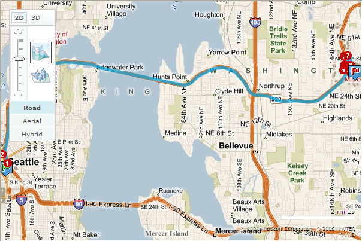
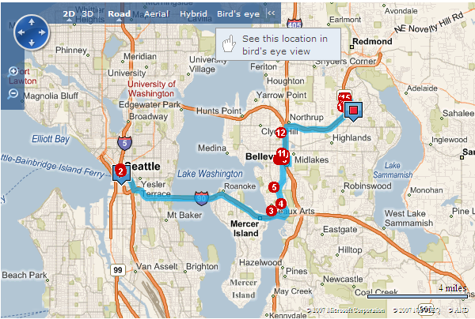

# Converting from Version 5 to Version 6.3
Although the version 6.3 release of the [!INCLUDE[vemc_product_name](../articles/includes/vemc-product-name-md.md)] introduces a number of new features, the map control is largely compatible with the previous version 5 release of the map control. This article does not exhaustively examine the changes from version 5 to version 6.3. See the [!INCLUDE[vemc_product_name](../articles/includes/vemc-product-name-md.md)] SDK topic [What's New in the Map Control](http://msdn2.microsoft.com/en-us/library/bb412561.aspx) for more detailed information on the changes from version 5 to version 6.3. Instead, this article focuses on these areas:  
  
-   Updating the map control reference  
  
-   New multi-point routing functionality  
  
## Updating the Map Control Reference  
 To use the latest version of the map control, place the following script tag in your Web page.  
  
```  
<script type="text/javascript" src="http://ecn.dev.virtualearth.net/mapcontrol/mapcontrol.ashx?v=6.3"></script>  
```  
  
> [!NOTE]
>  The 6.3 version URL domain is different than previous versions because this version of the map control supports the Microsoft Content Delivery Network (CDN) to give end users better performance. See the [Bing Map Control Performance](http://msdn.microsoft.com/en-us/8b7f89eb-02c4-4940-8638-1955b66b0de2) topic in the [Bing Maps AJAX Control, Version 6.3](http://msdn.microsoft.com/en-us/e3807b0c-5ad1-4bc1-bff0-7f4af0bad48d) for more information.  
  
## New Multi-Point Routing Functionality  
 Perhaps the most significant change in the new release is the addition of the **VEMap.GetDirections** method, which replaces the deprecated **VEMap.GetRoute** method.  
  
 This new method allows multi-point routing, which means you can specify multiple points through which a route and directions are computed. Let's take a look at how this change looks to the user.  
  
 *Listing 1* contains version 5 code to create a route from Seattle to Microsoft.  
  
```  
<!DOCTYPE html PUBLIC "-//W3C//DTD XHTML 1.0 Transitional//EN" "http://www.w3.org/TR/xhtml1/DTD/xhtml1-transitional.dtd">  
<html>  
   <head>  
      <meta http-equiv="Content-Type" content="text/html; charset=utf-8">  
      <title></title>  
  
      <script type="text/javascript" src="http://dev.virtualearth.net/mapcontrol/mapcontrol.ashx?v=5"></script>  
  
      <script type="text/javascript">  
         function OnPageLoad()  
         {  
            var map = new VEMap('myMap');  
            map.LoadMap();  
            map.GetRoute("Seattle", "Microsoft");  
         }  
      </script>  
   <body onload="OnPageLoad();">  
      <div id="myMap" style="position:relative;width:600px;height:400px;"></div>  
   </body>  
</html>  
```  
  
 *Listing 1.* Creating a route using version 5  
  
 *Figure 1* shows the resulting map.  
  
   
  
 *Figure 1.* A route from Seattle to Microsoft in version 5  
  
 *Listing 2* shows version 6.3 code to create a route from Seattle to Microsoft, but going through Bellevue.  
  
```  
<!DOCTYPE html PUBLIC "-//W3C//DTD XHTML 1.0 Transitional//EN" "http://www.w3.org/TR/xhtml1/DTD/xhtml1-transitional.dtd">  
<html>  
   <head>  
      <meta http-equiv="Content-Type" content="text/html; charset=utf-8">  
      <title></title>  
  
      <script type="text/javascript" src="http://ecn.dev.virtualearth.net/mapcontrol/mapcontrol.ashx?v=6.3"></script>  
  
      <script type="text/javascript">  
         function OnPageLoad()  
         {  
            var map = new VEMap('myMap');  
            map.LoadMap();  
            map.GetDirections(["Seattle", "Bellevue WA", "Microsoft"]);  
         }  
      </script>  
   <body onload="OnPageLoad();">  
      <div id="myMap" style="position:relative;width:600px;height:400px;"></div>  
   </body>  
</html>  
```  
  
 *Listing 2.* Creating a route using version 6.3  
  
 *Figure 2* shows the resulting map.  
  
   
  
 *Figure 2.* A route from Seattle to Microsoft, through Bellevue, in version 6.3  
  
## About the Author  
 Richard Brundritt is a software developer at Infusion Development.  
  
## See Also  
 [Converting Earlier Versions to Version 6.3](../articles/converting-earlier-versions-to-version-6-3.md)