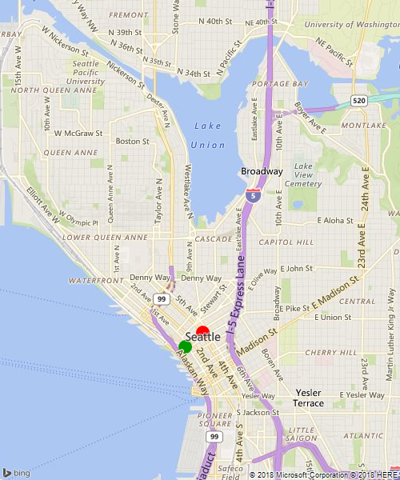
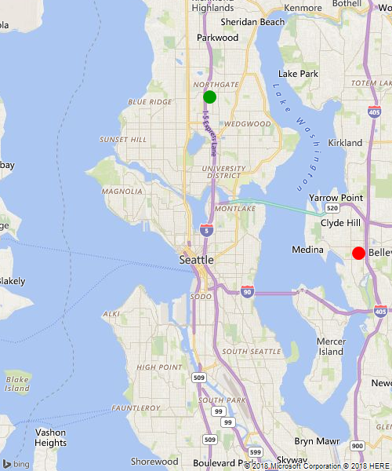

# Create an Optimized Multi-Itinerary

[!INCLUDE [bing-maps-enterprise-service-retirement](../includes/bing-maps-enterprise-service-retirement.md)]

The Bing Maps [Multi-Itinerary Optimization API](../rest-services/routes/optimized-itinerary.md) returns a delivery schedule for a set of agents and itinerary times.

This article demonstrates how to use this API with a POST request to create an optimized itinerary for three agents and thirteen itinerary items.

## Overview

The developer must provide specific information about each agent and itinerary item, summarized by the lists below:

### Agents:

* Name
* Agent shift information; for each shift:
    - Shift ending time
    - Shift starting time
    - Shift staring location (Query or Point)
    - Shift ending location (Query or Point)

### Itinerary Items: 

* Delivery/visit duration, called "dwell time"
* Business opening time
* Business ending time
* Location (Query of Point)
* Item Priority (on a scale from `1` to `100`, from lowest to highest)

## Example

### Formatting the Agent Data

Suppose we have three agents: Yuan, Charlie, and Andre. Each agent has at least one shift, each consisting of: the agent's starting location, staring time, ending location, and ending time.

For example, if Charlie delivers packages from 9 A.M. to 5 P.M., but has a one hour lunch break at noon, then Charlie will have two shifts: one from 9 A.M to noon, and another from 1 P.M. to 5 P.M.

To keep our example simple, we will assume that, although our agents will start and end at different locations, they will all take their lunch break at the same location, at Zeitgeist Cafe, Downtown Seattle, on South Jackson Street (or, in coordinates: `47.599018, -122.331871`).

> [!NOTE]
>
> Below we use a use latitude and longitude coordinates for the Agent's starting and ending locations. Instead, We could instead string query to specify starting/ending locations.

Here is the table of our agent's starting and ending information:

|Agent Name| Shift Starting Location | Shift Starting Coords | Shift Ending Location | Shift Ending Coords|
|:-----:|-----|:---:|----|:---:|
|Yuan   |Pike Place Market|`47.608970, -122.340914`| Westlake Park|`47.610966, -122.337095`
|Charlie|UW Campus | `47.655000, -122.308000`|Ballard Ave.|`47.666423, -122.383223`|
|Andre  |Northgate Mall|`47.706123, -122.325867`|Downtown Bellevue|`47.614151, -122.195686`|

#### Shift Data

The images below show the starting (green circle) and ending (red circle) locations for each agent.

__Yuan__:

|Start Time           |Start Coords            |End Time             |End Coords              |
|---------------------|------------------------|---------------------|------------------------|
|`2018-12-24T08:00:00`|`47.608970, -122.340914`|`2018-12-24T12:00:00`|`47.599018, -122.331871`|
|`2018-12-24T13:00:00`|`47.599018, -122.331871`|`2018-12-24T17:00:00`|`47.610966,-122.337095` |



__Charlie__:

|Start Time           |Start Coords            |End Time             |End Coords              |
|---------------------|------------------------|---------------------|------------------------|
|`2018-12-24T08:00:00`|`47.655000, -122.308000`|`2018-12-24T12:00:00`|`47.666423, -122.383223`|
|`2018-12-24T13:00:00`|`47.599018, -122.331871`|`2018-12-24T17:00:00`|`47.610966,-122.337095`|


__Andre__:

|Start Time           |Start Coords            |End Time             |End Coords              |
|---------------------|------------------------|---------------------|------------------------|
|`2018-12-24T08:00:00`|`47.706123, -122.325867`|`2018-12-24+12:00:00`|`47.599018, -122.331871`|
|`2018-12-24T13:00:00`|`47.599018, -122.331871`|`2018-12-24T17:00:00`|`47.614151, -122.195686`|




### Formatting the Itinerary Data

We will use 13 itinerary items. To simplify things, we'll assume all the coffee shops our agents are delivering goods to have the same opening and closing hours. However, we will assign different priorities and dwell times to each shop (for our example, the priorities and dwell times are chosen randomly).

|Coffee Shop | Coordiantes | Dwell Time | Priority |
|----------|--------------|---|----|
Starbucks   |  47.6140060424805,-122.347236633301 | 01:31:08.3850000 | 2
Storyville Coffee Company|    47.6088790893555,-122.340362548828 | 02:00:00.00 | 5
Seattle Coffee Works|   47.6087913513184,-122.339477539062 | 00:05:00.00 | 67
Monorail Espresso|  47.6110000610352,-122.33544921875 | 00:30:00.00 | 14
Moore Coffee | 47.6116981506348,-122.34105682373 | 03:00:00.00 | 9
Citizen  | 47.6257209777832,-122.345993041992 | 00:10:00.00 | 23
Bang Bang Cafe  | 47.6139373779297,-122.349090576172 | 01:15:00.00 | 7
Espresso Vivace  | 47.6237602233887,-122.32063293457 | 00:01:00.00 | 54
Cafe Cesura  | 47.6195220947266,-122.196739196777 | 01:15:00.00 | 34
Top Pot Doughnuts  | 47.6186218261719,-122.198760986328 | 00:05:00.00 | 6
Seattle Coffee Gear | 47.6176605224609,-122.196708679199 | 00:18:00.00 | 8
777 Cafe | 47.6168899536133,-122.19686126709 | 00:19:30.00 | 91
Starbucks | 47.614330291748,-122.199150085449 | 00:45:00.00 | 99

### Creating The Request

The above example is large: It includes 6 shifts (two for each agent: one before and one after lunch), and 13 itinerary items.

Because the Optimized Itinerary API only allows for a maximum of two agent shifts for synchronous API calls, we have to make an asynchronous request. Moreover, We will also use a POST instead of a GET method to deliver our agent and itinerary. 

The body of the POST request is as follows:

```json
{
    "agents": [
        {
            "name": "Yuan",
            "shifts": [
                {
                    "startTime": "2018-12-24T08:00:00",
                    "startLocation": {
                        "latitude": 47.60897,
                        "longitude": -122.340914
                    },
                    "endTime": "2018-12-24T12:00:00",
                    "endLocation": {
                        "latitude": 47.599018,
                        "longitude": -122.331871
                    }
                },
                {
                    "startTime": "2018-12-24T13:00:00",
                    "startLocation": {
                        "latitude": 47.599018,
                        "longitude": -122.331871
                    },
                    "endTime": "2018-12-24T17:00:00",
                    "endLocation": {
                        "latitude": 47.610966,
                        "longitude": -122.337095
                    }
                }
            ]
        },
        {
            "name": "Charlie",
            "shifts": [
                {
                    "startTime": "2018-12-24T08:00:00",
                    "startLocation": {
                        "latitude": 47.655,
                        "longitude": -122.308
                    },
                    "endTime": "2018-12-24T12:00:00",
                    "endLocation": {
                        "latitude": 47.666423,
                        "longitude": -122.383223
                    }
                },
                {
                    "startTime": "2018-12-24T13:00:00",
                    "startLocation": {
                        "latitude": 47.599018,
                        "longitude": -122.331871
                    },
                    "endTime": "2018-12-24T17:00:00",
                    "endLocation": {
                        "latitude": 47.610966,
                        "longitude": -122.337095
                    }
                }
            ]
        },
        {
            "name": "Andre",
            "shifts": [
                {
                    "startTime": "2018-12-24T08:00:00",
                    "startLocation": {
                        "latitude": 47.706123,
                        "longitude": -122.325867
                    },
                    "endTime": "2018-12-24T12:00:00",
                    "endLocation": {
                        "latitude": 47.599018,
                        "longitude": -122.331871
                    }
                },
                {
                    "startTime": "2018-12-24T13:00:00",
                    "startLocation": {
                        "latitude": 47.599018,
                        "longitude": -122.331871
                    },
                    "endTime": "2018-12-24T17:00:00",
                    "endLocation": {
                        "latitude": 47.614151,
                        "longitude": -122.195686
                    }
                }
            ]
        }
    ],
    "itineraryItems": [
        {
            "openingTime": "2018-12-24T08:00:00",
            "closingTime": "2018-12-24T17:00:00",
            "dwellTime": "01:31:08.3850000",
            "priority": 2,
            "location": {
                "latitude": 47.6140060424805,
                "longitude": -122.347236633301
            }
        },
        {
            "openingTime": "2018-12-24T08:00:00",
            "closingTime": "2018-12-24T17:00:00",
            "dwellTime": "02:00:00.00",
            "priority": 5,
            "location": {
                "latitude": 47.6088790893555,
                "longitude": -122.340362548828
            }
        },
        {
            "openingTime": "2018-12-24T08:00:00",
            "closingTime": "2018-12-24T17:00:00",
            "dwellTime": "00:05:00.00",
            "priority": 67,
            "location": {
                "latitude": 47.6087913513184,
                "longitude": -122.339477539062
            }
        },
        {
            "openingTime": "2018-12-24T08:00:00",
            "closingTime": "2018-12-24T17:00:00",
            "dwellTime": "00:30:00.00",
            "priority": 14,
            "location": {
                "latitude": 47.6110000610352,
                "longitude": -122.33544921875
            }
        },
        {
            "openingTime": "2018-12-24T08:00:00",
            "closingTime": "2018-12-24T17:00:00",
            "dwellTime": "03:00:00.00",
            "priority": 9,
            "location": {
                "latitude": 47.6116981506348,
                "longitude": -122.34105682373
            }
        },
        {
            "openingTime": "2018-12-24T08:00:00",
            "closingTime": "2018-12-24T17:00:00",
            "dwellTime": "00:10:00.00",
            "priority": 23,
            "location": {
                "latitude": 47.6257209777832,
                "longitude": -122.345993041992
            }
        },
        {
            "openingTime": "2018-12-24T08:00:00",
            "closingTime": "2018-12-24T17:00:00",
            "dwellTime": "01:15:00.00",
            "priority": 7,
            "location": {
                "latitude": 47.6139373779297,
                "longitude": -122.349090576172
            }
        },
        {
            "openingTime": "2018-12-24T08:00:00",
            "closingTime": "2018-12-24T17:00:00",
            "dwellTime": "00:01:00.00",
            "priority": 54,
            "location": {
                "latitude": 47.6237602233887,
                "longitude": -122.32063293457
            }
        },
        {
            "openingTime": "2018-12-24T08:00:00",
            "closingTime": "2018-12-24T17:00:00",
            "dwellTime": "01:15:00.00",
            "priority": 34,
            "location": {
                "latitude": 47.6195220947266,
                "longitude": -122.196739196777
            }
        },
        {
            "openingTime": "2018-12-24T08:00:00",
            "closingTime": "2018-12-24T17:00:00",
            "dwellTime": "00:05:00.00",
            "priority": 6,
            "location": {
                "latitude": 47.6186218261719,
                "longitude": -122.198760986328
            }
        },
        {
            "openingTime": "2018-12-24T08:00:00",
            "closingTime": "2018-12-24T17:00:00",
            "dwellTime": "00:18:00.00",
            "priority": 8,
            "location": {
                "latitude": 47.6176605224609,
                "longitude": -122.196708679199
            }
        },
        {
            "openingTime": "2018-12-24T08:00:00",
            "closingTime": "2018-12-24T17:00:00",
            "dwellTime": "00:19:30.00",
            "priority": 91,
            "location": {
                "latitude": 47.6168899536133,
                "longitude": -122.19686126709
            }
        },
        {
            "openingTime": "2018-12-24T08:00:00",
            "closingTime": "2018-12-24T17:00:00",
            "dwellTime": "00:45:00.00",
            "priority": 99,
            "location": {
                "latitude": 47.614330291748,
                "longitude": -122.199150085449
            }
        }
    ]
}
```

We then send this JSON data in the POST body of our API request, making sure to add the POST header `Content-Type: application/json`, with the following URL:

```url
https://dev.virtualearth.net/REST/V1/Routes/OptimizeItineraryAsync?key={BingMapsKey}
```

We get the following response:

```json
{
    "authenticationResultCode": "ValidCredentials",
    "brandLogoUri": "http://dev.virtualearth.net/Branding/logo_powered_by.png",
    "copyright": "Copyright © 2018 Microsoft and its suppliers. All rights reserved. This API cannot be accessed and the content and any results may not be used, reproduced or transmitted in any manner without express written permission from Microsoft Corporation.",
    "resourceSets": [
        {
            "estimatedTotal": 1,
            "resources": [
                {
                    "__type": "RouteProxyAsyncResult:http://schemas.microsoft.com/search/local/ws/rest/v1",
                    "callbackInSeconds": 7,
                    "callbackUrl": "https://dev.virtualearth.net/REST/V1/Routes/OptimizeItineraryAsyncCallback?key={APIKEY}&requestId={RequestID}",
                    "isAccepted": true,
                    "isCompleted": false,
                    "requestId": "{RequestID}"
                }
            ]
        }
    ],
    "statusCode": 200,
    "statusDescription": "OK",
    "traceId": "8ff3844af5604854b45e7ae92547bb2b|CO3230EE0A|7.7.0.0"
}
```

After 7 seconds, we can visit the callback URL to retrieve the JSON response:

```json
{
  "authenticationResultCode": "ValidCredentials",
  "brandLogoUri": "http://dev.virtualearth.net/Branding/logo_powered_by.png",
  "copyright": "Copyright © 2018 Microsoft and its suppliers. All rights reserved. This API cannot be accessed and the content and any results may not be used, reproduced or transmitted in any manner without express written permission from Microsoft Corporation.",
  "resourceSets": [
    {
      "estimatedTotal": 1,
      "resources": [
        {
          "__type": "OptimizeItinerary:http://schemas.microsoft.com/search/local/ws/rest/v1",
          "agentItineraries": [
            {
              "agent": {
                "name": "Yuan",
                "shifts": [
                  {
                    "endLocation": {
                      "latitude": 47.599018,
                      "longitude": -122.331871
                    },
                    "endTime": "2018-12-24T12:00:00",
                    "startLocation": {
                      "latitude": 47.60897,
                      "longitude": -122.340914
                    },
                    "startTime": "2018-12-24T08:00:00"
                  },
                  {
                    "endLocation": {
                      "latitude": 47.610966,
                      "longitude": -122.337095
                    },
                    "endTime": "2018-12-24T17:00:00",
                    "startLocation": {
                      "latitude": 47.599018,
                      "longitude": -122.331871
                    },
                    "startTime": "2018-12-24T13:00:00"
                  }
                ]
              },
              "instructions": [
                {
                  "distance": 0,
                  "instructionType": "LeaveFromStartPoint",
                  "itineraryItem": {
                    "closingTime": "0001-01-01T00:00:00",
                    "dwellTime": "00:00:00",
                    "location": {
                      "latitude": 47.60897,
                      "longitude": -122.340914
                    },
                    "openingTime": "0001-01-01T00:00:00",
                    "priority": 0
                  },
                  "startTime": "2018-12-24T08:00:00"
                },
                {
                  "distance": 17524,
                  "duration": "00:14:00",
                  "endTime": "2018-12-24T08:14:00",
                  "instructionType": "TravelBetweenLocations",
                  "startTime": "2018-12-24T08:00:00"
                },
                {
                  "distance": 0,
                  "duration": "00:18:00",
                  "endTime": "2018-12-24T08:32:00",
                  "instructionType": "VisitLocation",
                  "itineraryItem": {
                    "closingTime": "2018-12-24T17:00:00",
                    "dwellTime": "00:18:00",
                    "location": {
                      "latitude": 47.6176605224609,
                      "longitude": -122.196708679199
                    },
                    "openingTime": "2018-12-24T08:00:00",
                    "priority": 8
                  },
                  "startTime": "2018-12-24T08:14:00"
                },
                {
                  "distance": 17681,
                  "duration": "00:15:00",
                  "endTime": "2018-12-24T08:47:00",
                  "instructionType": "TravelBetweenLocations",
                  "startTime": "2018-12-24T08:32:00"
                },
                {
                  "distance": 0,
                  "duration": "01:31:00",
                  "endTime": "2018-12-24T10:18:00",
                  "instructionType": "VisitLocation",
                  "itineraryItem": {
                    "closingTime": "2018-12-24T17:00:00",
                    "dwellTime": "01:31:08.3850000",
                    "location": {
                      "latitude": 47.6140060424805,
                      "longitude": -122.347236633301
                    },
                    "openingTime": "2018-12-24T08:00:00",
                    "priority": 2
                  },
                  "startTime": "2018-12-24T08:47:00"
                },
                {
                  "distance": 17736,
                  "duration": "00:15:00",
                  "endTime": "2018-12-24T10:33:00",
                  "instructionType": "TravelBetweenLocations",
                  "startTime": "2018-12-24T10:18:00"
                },
                {
                  "distance": 0,
                  "duration": "00:19:00",
                  "endTime": "2018-12-24T10:52:00",
                  "instructionType": "VisitLocation",
                  "itineraryItem": {
                    "closingTime": "2018-12-24T17:00:00",
                    "dwellTime": "00:19:30",
                    "location": {
                      "latitude": 47.6168899536133,
                      "longitude": -122.19686126709
                    },
                    "openingTime": "2018-12-24T08:00:00",
                    "priority": 91
                  },
                  "startTime": "2018-12-24T10:33:00"
                },
                {
                  "distance": 18086,
                  "duration": "00:14:00",
                  "endTime": "2018-12-24T11:06:00",
                  "instructionType": "TravelBetweenLocations",
                  "startTime": "2018-12-24T10:52:00"
                },
                {
                  "distance": 0,
                  "instructionType": "ArriveToEndPoint",
                  "itineraryItem": {
                    "closingTime": "0001-01-01T00:00:00",
                    "dwellTime": "00:00:00",
                    "location": {
                      "latitude": 47.599018,
                      "longitude": -122.331871
                    },
                    "openingTime": "0001-01-01T00:00:00",
                    "priority": 0
                  },
                  "startTime": "2018-12-24T11:06:00"
                },
                {
                  "distance": 0,
                  "instructionType": "LeaveFromStartPoint",
                  "itineraryItem": {
                    "closingTime": "0001-01-01T00:00:00",
                    "dwellTime": "00:00:00",
                    "location": {
                      "latitude": 47.599018,
                      "longitude": -122.331871
                    },
                    "openingTime": "0001-01-01T00:00:00",
                    "priority": 0
                  },
                  "startTime": "2018-12-24T13:00:00"
                },
                {
                  "distance": 3763,
                  "duration": "00:05:00",
                  "endTime": "2018-12-24T13:05:00",
                  "instructionType": "TravelBetweenLocations",
                  "startTime": "2018-12-24T13:00:00"
                },
                {
                  "distance": 0,
                  "duration": "00:01:00",
                  "endTime": "2018-12-24T13:06:00",
                  "instructionType": "VisitLocation",
                  "itineraryItem": {
                    "closingTime": "2018-12-24T17:00:00",
                    "dwellTime": "00:01:00",
                    "location": {
                      "latitude": 47.6237602233887,
                      "longitude": -122.32063293457
                    },
                    "openingTime": "2018-12-24T08:00:00",
                    "priority": 54
                  },
                  "startTime": "2018-12-24T13:05:00"
                },
                {
                  "distance": 2730,
                  "duration": "00:05:00",
                  "endTime": "2018-12-24T13:11:00",
                  "instructionType": "TravelBetweenLocations",
                  "startTime": "2018-12-24T13:06:00"
                },
                {
                  "distance": 0,
                  "duration": "02:00:00",
                  "endTime": "2018-12-24T15:11:00",
                  "instructionType": "VisitLocation",
                  "itineraryItem": {
                    "closingTime": "2018-12-24T17:00:00",
                    "dwellTime": "02:00:00",
                    "location": {
                      "latitude": 47.6088790893555,
                      "longitude": -122.340362548828
                    },
                    "openingTime": "2018-12-24T08:00:00",
                    "priority": 5
                  },
                  "startTime": "2018-12-24T13:11:00"
                },
                {
                  "distance": 17375,
                  "duration": "00:14:00",
                  "endTime": "2018-12-24T15:25:00",
                  "instructionType": "TravelBetweenLocations",
                  "startTime": "2018-12-24T15:11:00"
                },
                {
                  "distance": 0,
                  "duration": "01:15:00",
                  "endTime": "2018-12-24T16:40:00",
                  "instructionType": "VisitLocation",
                  "itineraryItem": {
                    "closingTime": "2018-12-24T17:00:00",
                    "dwellTime": "01:15:00",
                    "location": {
                      "latitude": 47.6195220947266,
                      "longitude": -122.196739196777
                    },
                    "openingTime": "2018-12-24T08:00:00",
                    "priority": 34
                  },
                  "startTime": "2018-12-24T15:25:00"
                },
                {
                  "distance": 16971,
                  "duration": "00:14:00",
                  "endTime": "2018-12-24T16:54:00",
                  "instructionType": "TravelBetweenLocations",
                  "startTime": "2018-12-24T16:40:00"
                },
                {
                  "distance": 0,
                  "instructionType": "ArriveToEndPoint",
                  "itineraryItem": {
                    "closingTime": "0001-01-01T00:00:00",
                    "dwellTime": "00:00:00",
                    "location": {
                      "latitude": 47.610966,
                      "longitude": -122.337095
                    },
                    "openingTime": "0001-01-01T00:00:00",
                    "priority": 0
                  },
                  "startTime": "2018-12-24T16:54:00"
                }
              ],
              "route": {
                "endLocation": {
                  "latitude": 47.610966,
                  "longitude": -122.337095
                },
                "endTime": "2018-12-24T16:54:00",
                "startLocation": {
                  "latitude": 47.60897,
                  "longitude": -122.340914
                },
                "startTime": "2018-12-24T08:00:00",
                "totalTravelDistance": 111866,
                "totalTravelTime": "01:36:00",
                "wayPoints": [
                  {
                    "latitude": 47.6176605224609,
                    "longitude": -122.196708679199
                  },
                  {
                    "latitude": 47.6140060424805,
                    "longitude": -122.347236633301
                  },
                  {
                    "latitude": 47.6168899536133,
                    "longitude": -122.19686126709
                  },
                  {
                    "latitude": 47.599018,
                    "longitude": -122.331871
                  },
                  {
                    "latitude": 47.599018,
                    "longitude": -122.331871
                  },
                  {
                    "latitude": 47.6237602233887,
                    "longitude": -122.32063293457
                  },
                  {
                    "latitude": 47.6088790893555,
                    "longitude": -122.340362548828
                  },
                  {
                    "latitude": 47.6195220947266,
                    "longitude": -122.196739196777
                  }
                ]
              }
            },
            {
              "agent": {
                "name": "Charlie",
                "shifts": [
                  {
                    "endLocation": {
                      "latitude": 47.666423,
                      "longitude": -122.383223
                    },
                    "endTime": "2018-12-24T12:00:00",
                    "startLocation": {
                      "latitude": 47.655,
                      "longitude": -122.308
                    },
                    "startTime": "2018-12-24T08:00:00"
                  },
                  {
                    "endLocation": {
                      "latitude": 47.610966,
                      "longitude": -122.337095
                    },
                    "endTime": "2018-12-24T17:00:00",
                    "startLocation": {
                      "latitude": 47.599018,
                      "longitude": -122.331871
                    },
                    "startTime": "2018-12-24T13:00:00"
                  }
                ]
              },
              "instructions": [
                {
                  "distance": 0,
                  "instructionType": "LeaveFromStartPoint",
                  "itineraryItem": {
                    "closingTime": "0001-01-01T00:00:00",
                    "dwellTime": "00:00:00",
                    "location": {
                      "latitude": 47.655,
                      "longitude": -122.308
                    },
                    "openingTime": "0001-01-01T00:00:00",
                    "priority": 0
                  },
                  "startTime": "2018-12-24T08:00:00"
                },
                {
                  "distance": 7895,
                  "duration": "00:13:00",
                  "endTime": "2018-12-24T08:13:00",
                  "instructionType": "TravelBetweenLocations",
                  "startTime": "2018-12-24T08:00:00"
                },
                {
                  "distance": 0,
                  "duration": "01:15:00",
                  "endTime": "2018-12-24T09:28:00",
                  "instructionType": "VisitLocation",
                  "itineraryItem": {
                    "closingTime": "2018-12-24T17:00:00",
                    "dwellTime": "01:15:00",
                    "location": {
                      "latitude": 47.6139373779297,
                      "longitude": -122.349090576172
                    },
                    "openingTime": "2018-12-24T08:00:00",
                    "priority": 7
                  },
                  "startTime": "2018-12-24T08:13:00"
                },
                {
                  "distance": 20355,
                  "duration": "00:16:00",
                  "endTime": "2018-12-24T09:44:00",
                  "instructionType": "TravelBetweenLocations",
                  "startTime": "2018-12-24T09:28:00"
                },
                {
                  "distance": 0,
                  "duration": "00:45:00",
                  "endTime": "2018-12-24T10:29:00",
                  "instructionType": "VisitLocation",
                  "itineraryItem": {
                    "closingTime": "2018-12-24T17:00:00",
                    "dwellTime": "00:45:00",
                    "location": {
                      "latitude": 47.614330291748,
                      "longitude": -122.199150085449
                    },
                    "openingTime": "2018-12-24T08:00:00",
                    "priority": 99
                  },
                  "startTime": "2018-12-24T09:44:00"
                },
                {
                  "distance": 19216,
                  "duration": "00:15:00",
                  "endTime": "2018-12-24T10:44:00",
                  "instructionType": "TravelBetweenLocations",
                  "startTime": "2018-12-24T10:29:00"
                },
                {
                  "distance": 0,
                  "duration": "00:05:00",
                  "endTime": "2018-12-24T10:49:00",
                  "instructionType": "VisitLocation",
                  "itineraryItem": {
                    "closingTime": "2018-12-24T17:00:00",
                    "dwellTime": "00:05:00",
                    "location": {
                      "latitude": 47.6087913513184,
                      "longitude": -122.339477539062
                    },
                    "openingTime": "2018-12-24T08:00:00",
                    "priority": 67
                  },
                  "startTime": "2018-12-24T10:44:00"
                },
                {
                  "distance": 8754,
                  "duration": "00:12:00",
                  "endTime": "2018-12-24T11:01:00",
                  "instructionType": "TravelBetweenLocations",
                  "startTime": "2018-12-24T10:49:00"
                },
                {
                  "distance": 0,
                  "instructionType": "ArriveToEndPoint",
                  "itineraryItem": {
                    "closingTime": "0001-01-01T00:00:00",
                    "dwellTime": "00:00:00",
                    "location": {
                      "latitude": 47.666423,
                      "longitude": -122.383223
                    },
                    "openingTime": "0001-01-01T00:00:00",
                    "priority": 0
                  },
                  "startTime": "2018-12-24T11:01:00"
                },
                {
                  "distance": 0,
                  "instructionType": "LeaveFromStartPoint",
                  "itineraryItem": {
                    "closingTime": "0001-01-01T00:00:00",
                    "dwellTime": "00:00:00",
                    "location": {
                      "latitude": 47.599018,
                      "longitude": -122.331871
                    },
                    "openingTime": "0001-01-01T00:00:00",
                    "priority": 0
                  },
                  "startTime": "2018-12-24T13:00:00"
                },
                {
                  "distance": 2172,
                  "duration": "00:04:00",
                  "endTime": "2018-12-24T13:04:00",
                  "instructionType": "TravelBetweenLocations",
                  "startTime": "2018-12-24T13:00:00"
                },
                {
                  "distance": 0,
                  "duration": "03:00:00",
                  "endTime": "2018-12-24T16:04:00",
                  "instructionType": "VisitLocation",
                  "itineraryItem": {
                    "closingTime": "2018-12-24T17:00:00",
                    "dwellTime": "03:00:00",
                    "location": {
                      "latitude": 47.6116981506348,
                      "longitude": -122.34105682373
                    },
                    "openingTime": "2018-12-24T08:00:00",
                    "priority": 9
                  },
                  "startTime": "2018-12-24T13:04:00"
                },
                {
                  "distance": 17400,
                  "duration": "00:15:00",
                  "endTime": "2018-12-24T16:19:00",
                  "instructionType": "TravelBetweenLocations",
                  "startTime": "2018-12-24T16:04:00"
                },
                {
                  "distance": 0,
                  "duration": "00:05:00",
                  "endTime": "2018-12-24T16:24:00",
                  "instructionType": "VisitLocation",
                  "itineraryItem": {
                    "closingTime": "2018-12-24T17:00:00",
                    "dwellTime": "00:05:00",
                    "location": {
                      "latitude": 47.6186218261719,
                      "longitude": -122.198760986328
                    },
                    "openingTime": "2018-12-24T08:00:00",
                    "priority": 6
                  },
                  "startTime": "2018-12-24T16:19:00"
                },
                {
                  "distance": 17153,
                  "duration": "00:14:00",
                  "endTime": "2018-12-24T16:38:00",
                  "instructionType": "TravelBetweenLocations",
                  "startTime": "2018-12-24T16:24:00"
                },
                {
                  "distance": 0,
                  "instructionType": "ArriveToEndPoint",
                  "itineraryItem": {
                    "closingTime": "0001-01-01T00:00:00",
                    "dwellTime": "00:00:00",
                    "location": {
                      "latitude": 47.610966,
                      "longitude": -122.337095
                    },
                    "openingTime": "0001-01-01T00:00:00",
                    "priority": 0
                  },
                  "startTime": "2018-12-24T16:38:00"
                }
              ],
              "route": {
                "endLocation": {
                  "latitude": 47.610966,
                  "longitude": -122.337095
                },
                "endTime": "2018-12-24T16:38:00",
                "startLocation": {
                  "latitude": 47.655,
                  "longitude": -122.308
                },
                "startTime": "2018-12-24T08:00:00",
                "totalTravelDistance": 92945,
                "totalTravelTime": "01:29:00",
                "wayPoints": [
                  {
                    "latitude": 47.6139373779297,
                    "longitude": -122.349090576172
                  },
                  {
                    "latitude": 47.614330291748,
                    "longitude": -122.199150085449
                  },
                  {
                    "latitude": 47.6087913513184,
                    "longitude": -122.339477539062
                  },
                  {
                    "latitude": 47.666423,
                    "longitude": -122.383223
                  },
                  {
                    "latitude": 47.599018,
                    "longitude": -122.331871
                  },
                  {
                    "latitude": 47.6116981506348,
                    "longitude": -122.34105682373
                  },
                  {
                    "latitude": 47.6186218261719,
                    "longitude": -122.198760986328
                  }
                ]
              }
            },
            {
              "agent": {
                "name": "Andre",
                "shifts": [
                  {
                    "endLocation": {
                      "latitude": 47.599018,
                      "longitude": -122.331871
                    },
                    "endTime": "2018-12-24T12:00:00",
                    "startLocation": {
                      "latitude": 47.706123,
                      "longitude": -122.325867
                    },
                    "startTime": "2018-12-24T08:00:00"
                  },
                  {
                    "endLocation": {
                      "latitude": 47.614151,
                      "longitude": -122.195686
                    },
                    "endTime": "2018-12-24T17:00:00",
                    "startLocation": {
                      "latitude": 47.599018,
                      "longitude": -122.331871
                    },
                    "startTime": "2018-12-24T13:00:00"
                  }
                ]
              },
              "instructions": [
                {
                  "distance": 0,
                  "instructionType": "LeaveFromStartPoint",
                  "itineraryItem": {
                    "closingTime": "0001-01-01T00:00:00",
                    "dwellTime": "00:00:00",
                    "location": {
                      "latitude": 47.706123,
                      "longitude": -122.325867
                    },
                    "openingTime": "0001-01-01T00:00:00",
                    "priority": 0
                  },
                  "startTime": "2018-12-24T08:00:00"
                },
                {
                  "distance": 13971,
                  "duration": "00:12:00",
                  "endTime": "2018-12-24T08:12:00",
                  "instructionType": "TravelBetweenLocations",
                  "startTime": "2018-12-24T08:00:00"
                },
                {
                  "distance": 0,
                  "instructionType": "ArriveToEndPoint",
                  "itineraryItem": {
                    "closingTime": "0001-01-01T00:00:00",
                    "dwellTime": "00:00:00",
                    "location": {
                      "latitude": 47.599018,
                      "longitude": -122.331871
                    },
                    "openingTime": "0001-01-01T00:00:00",
                    "priority": 0
                  },
                  "startTime": "2018-12-24T08:12:00"
                },
                {
                  "distance": 0,
                  "instructionType": "LeaveFromStartPoint",
                  "itineraryItem": {
                    "closingTime": "0001-01-01T00:00:00",
                    "dwellTime": "00:00:00",
                    "location": {
                      "latitude": 47.599018,
                      "longitude": -122.331871
                    },
                    "openingTime": "0001-01-01T00:00:00",
                    "priority": 0
                  },
                  "startTime": "2018-12-24T13:00:00"
                },
                {
                  "distance": 3847,
                  "duration": "00:05:00",
                  "endTime": "2018-12-24T13:05:00",
                  "instructionType": "TravelBetweenLocations",
                  "startTime": "2018-12-24T13:00:00"
                },
                {
                  "distance": 0,
                  "duration": "00:10:00",
                  "endTime": "2018-12-24T13:15:00",
                  "instructionType": "VisitLocation",
                  "itineraryItem": {
                    "closingTime": "2018-12-24T17:00:00",
                    "dwellTime": "00:10:00",
                    "location": {
                      "latitude": 47.6257209777832,
                      "longitude": -122.345993041992
                    },
                    "openingTime": "2018-12-24T08:00:00",
                    "priority": 23
                  },
                  "startTime": "2018-12-24T13:05:00"
                },
                {
                  "distance": 2373,
                  "duration": "00:04:00",
                  "endTime": "2018-12-24T13:19:00",
                  "instructionType": "TravelBetweenLocations",
                  "startTime": "2018-12-24T13:15:00"
                },
                {
                  "distance": 0,
                  "duration": "00:30:00",
                  "endTime": "2018-12-24T13:49:00",
                  "instructionType": "VisitLocation",
                  "itineraryItem": {
                    "closingTime": "2018-12-24T17:00:00",
                    "dwellTime": "00:30:00",
                    "location": {
                      "latitude": 47.6110000610352,
                      "longitude": -122.33544921875
                    },
                    "openingTime": "2018-12-24T08:00:00",
                    "priority": 14
                  },
                  "startTime": "2018-12-24T13:19:00"
                },
                {
                  "distance": 18679,
                  "duration": "00:14:00",
                  "endTime": "2018-12-24T14:03:00",
                  "instructionType": "TravelBetweenLocations",
                  "startTime": "2018-12-24T13:49:00"
                },
                {
                  "distance": 0,
                  "instructionType": "ArriveToEndPoint",
                  "itineraryItem": {
                    "closingTime": "0001-01-01T00:00:00",
                    "dwellTime": "00:00:00",
                    "location": {
                      "latitude": 47.614151,
                      "longitude": -122.195686
                    },
                    "openingTime": "0001-01-01T00:00:00",
                    "priority": 0
                  },
                  "startTime": "2018-12-24T14:03:00"
                }
              ],
              "route": {
                "endLocation": {
                  "latitude": 47.614151,
                  "longitude": -122.195686
                },
                "endTime": "2018-12-24T14:03:00",
                "startLocation": {
                  "latitude": 47.706123,
                  "longitude": -122.325867
                },
                "startTime": "2018-12-24T08:00:00",
                "totalTravelDistance": 38870,
                "totalTravelTime": "00:35:00",
                "wayPoints": [
                  {
                    "latitude": 47.599018,
                    "longitude": -122.331871
                  },
                  {
                    "latitude": 47.599018,
                    "longitude": -122.331871
                  },
                  {
                    "latitude": 47.6257209777832,
                    "longitude": -122.345993041992
                  },
                  {
                    "latitude": 47.6110000610352,
                    "longitude": -122.33544921875
                  }
                ]
              }
            }
          ],
          "isAccepted": true,
          "isCompleted": true
        }
      ]
    }
  ],
  "statusCode": 200,
  "statusDescription": "OK",
  "traceId": "52c5829a41b646c499cfacca05fb9c07|CO30D831BD|7.7.0.0"
}
```

