# Creating a Store Locator using Bing Maps and Azure Websites
In this topic, we will create a simple store locator using Bing Maps and will then deploy it as an **Azure** Website.  
  
 Store locators are common and a must for most businesses that sell directly to consumers. If you have only a couple of stores, you may be able to get away with only showing an image of a map that shows the location of these stores. However, if you have a chain of 5 or more stores, you really should have a store locator that has an interactive map as this will make it much easier for users to determine which store is most convenient for the user (consumer) to visit.  
  
 Store locators can be as simple or as complicated as you want it to be. In this article, we will focus on creating a simple store locator but I will include some tips along the way to help you extend certain functionalities if you desire. We will create a store locator for a fictional company called Contoso Coffee. The following is a wireframe of what the general layout of the locator that we will build.  
  
 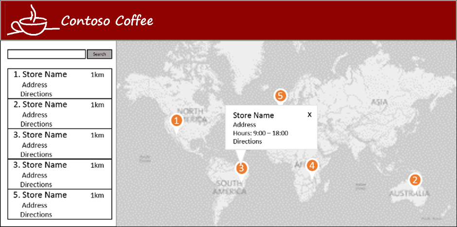  
  
 **Store Locator Wireframe**  
  
 Looking at the wireframe, you can see that it is a fairly straightforward application. We have a search box, a list of results, and a map with some pushpins and an infobox (popup). Going into a bit more detail here are the features we will build into this store locator:  
  
-   The location information for all the coffee shops will be stored in the **Bing Spatial Data Services**. This will expose the data as a spatial REST service and make it easy for us to update and add locations through a user interface.  
  
-   The page will have a layout such that it fills the screen regardless of the window size and not require scrolling the page to see the whole map. This will make it easier for the user.  
  
-   The page will have a simple header that contains the logo for the store.  
  
-   A search box and button will let users enter in location information to do a nearby search for coffee shops. We will also add a key press event to the search box that triggers a search if the user presses the enter key, which makes for a better user experience.  
  
-   Under the search box, a list of results is displayed. Each result will have a number that relates to a numbered pushpin on the map. The name of the store will be clickable, and when clicked will center the map on the pushpin for the selected store and show its infobox. The distance from the users search location to each store is displayed next to the store's name. We will also display the address and a link to get directions. If the list contains many results, the user will be able to scroll through them.  
  
-   To keep things simple instead of writing a bunch of code for displaying directions in the locator, we will create a URL to the Bing Maps consumer site that sets the destination field. For more information on how to create custom URL's for the Bing Maps consumer site, please see [Create a Custom Map URL](http://msdn.microsoft.com/en-us/library/dn217138.aspx).  
  
-   Finally there will be a map that will display the results. When results are added to the map we will zoom in such that all the results are in the view. When the user clicks a pushpin, we will display an infobox that contains the name, address, and some addition metadata about the location, along with a link to get directions.  
  
 Full source code for the client app can be downloaded from the [MSDN Code Gallery](http://code.msdn.microsoft.com/Creating-a-Store-Locator-b64c750c).  
  
## Getting Started with Bing Maps  
 We will use the Bing Maps platform in this application to do two key functions. The first function is to host the store location data and expose it as a spatial web service. The second function is to provide a nice interactive map to display the search results. Before writing code, you will need to create a Bing Maps account and key to use in your application.  
  
### Creating a Bing Maps Account  
 One of the first things you will need to do before you can use the Bing Maps SDK is to create a Bing Maps account. The following steps outline how to create a Bing Maps account:  
  
1.  Go to the Bing Maps Account Center at http://www.bingmapsportal.com and click the "Create a Bing Maps Account" button.  
  
2.  Sign in using a Microsoft Account (formerly known as a Windows Live ID). If you do not have a Microsoft Account then use the sign up link on the sign in page.  
  
3.  After you sign in, provide the following information:  
  
    -   **Account name**: A friendly name that you can use to identify your account. (Required)  
  
    -   **Contact name**: The name of the account owner or someone that can be contacted when questions about this account arise. (Optional)  
  
    -   **Company name**: The name of the company using this account. (Optional)  
  
    -   **Email address**: A contact email address for this account. This address can be the Microsoft Account (Windows Live ID) used to login to the Bing Maps Account Center. (Required)  
  
    -   **Phone number**: A contact phone number for this this account. (Optional)  
  
    -   **Bing Maps API terms of use**: Review the terms of use and check the box to accept them. (Required)  
  
4.  After you enter the required information and click **Save**, your account details are displayed.  
  
### Creating a Bing Maps Key  
 Once you have a Bing Maps account you will need to create a Bing Maps key. A Bing Maps key is required to authenticate your requests to Bing Maps. You will need to use this every time you load a map and any time you call any of the Bing Maps services directly. The following steps outline how to create a basic Bing Maps key that you will use in the store locator.  
  
1.  Go to the Bing Maps Account Center at http://www.bingmapsportal.com and sign in using your Microsoft Account (Windows Live ID).  
  
2.  Select "Create or view keys" under "My Account".  
  
3.  In the Create key box on the My keys page, provide the following information for the application that will use the Bing Maps key:  
  
    -   **Application name**: The name of the application. This is for your own use so you can easily identify the purpose of the key. (Required)  
  
    -   **Application URL**: The URL of the application. This is also for your own reference. You can leave this blank. (Optional)  
  
    -   **Key type**: Select the Basic key type. The key and application types you choose determine your usage limits. Note Trial keys expire after 90 days and Enterprise keys require a Bing Maps license. (Required)  
  
    -   **Application type**: Select the Public Website application type.  
  
4.  Type the characters of the security code, and then click Submit. The new key will be displayed in the list of available keys under the form. (Required)  
  
 A Bing Maps key is a 64 bit encoded string that will look something like this:  
  
 **Ah_C8OJJu8wnNX50rGHf_OYKonuhZ-CfLQ-kXS-4tI-QsTN9pkLPPfgKigwa**  
  
 Make note of the key that you created, as you will need to include it in many of the code examples in this topic. Copying it into a text file and saving it locally will save you having to sign into the Bing Maps portal to retrieve it.  
  
#### A Word on Licensing  
 Bing Maps is an Enterprise platform that offers free terms of use to its users under certain conditions that are defined in the terms of use. For public facing web applications, which store locators usually are, there is a limit of 125,000 transactions per 12-month period. Transactions occur when the map loads and when using the Bing Maps services to perform operations such as geocoding and routing.  
  
 A list detailing all the different types of transactions can be found on this [Terms Of Use](http://www.microsoft.com/maps/product/terms.html) page. For small store locators the free terms of use are usually more than enough. If your store locator does see a large volume of traffic then you may want to purchase a license for Bing Maps. The easiest way to decide if you should get a license is to use the [Bing Maps license wizard](http://www.microsoft.com/maps/Licensing/licensing.aspx).  
  
#### Additional Resources  
 If you are new to Bing Maps, the following are some useful resources for developing with Bing Maps:  
  
-   [Bing Maps V7 documentation](http://msdn.microsoft.com/en-us/library/gg427610.aspx)  
  
-   [Bing Maps V7 Interactive SDK](http://www.bingmapsportal.com/ISDK/AjaxV7)  
  
-   [Bing Maps Blog](http://blogs.bing.com/maps)  
  
-   [Bing Maps Forums](http://social.msdn.microsoft.com/Forums/en-US/home?category=bingmaps)  
  
## Creating the Store Location Data Sources  
 In the past when you wanted to create a store locator, you had to setup a database and a custom web service that could perform complex calculations to do things like find nearby locations. For many applications, this is no longer necessary. The [Bing Spatial Data Services](http://msdn.microsoft.com/en-us/library/ff701734.aspx), one of the many services in Bing Maps, allows you to upload a simple formatted data source file and have it exposed as a spatial REST web service, which that can be integrated into your application. Once complete, you can easily maintain the data by making updates, adding, and removing locations using the [data source management tools](http://msdn.microsoft.com/en-us/library/hh698204.aspx) in the [Bing Maps portal](http://www.bingmapsportal.com/).  
  
 Much data starts out as a two dimensional table inside of Excel. With this in mind, we will use this as the starting point for creating the data source for the store locator. In the code samples, an Excel file is included that contains a set of mock coffee shops in Seattle, San Antonia, San Diego and San Francisco. Here is a screenshot of what the data looks like.  
  
 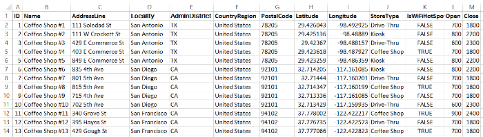  
  
 **Sample Data Source**  
  
 Looking at this table, we can make the following observations:  
  
-   The **ID** column contains a unique value for each location. We will be able to use this as our primary key in our data source.  
  
-   Location information is stored using the **AddressLine**, **Locality**, **AdminDistrict**, **PostalCode**, and **CountryRegion** columns. These are the standard address related column names the Bing Spatial Data Services looks for when geocoding locations.  
  
-   There are **Latitude** and **Longitude** columns that contain the coordinates of each coffee shop. If you are using your own data, you likely do not have this information yet. That is okay because the Bing Spatial Data Services will fill this column in for us when we upload the data source.  
  
-   Some additional columns contain some metadata related to the coffee shops. You can create your own columns that contain metadata that is more relevant to your location data.  
  
 Now that we have a set of data to work with, we need to format it so that it aligns with the [required data source schema](http://msdn.microsoft.com/en-us/library/gg585138.aspx) for the Bing Spatial Data Services. The main changes required to align our data to this schema are as follows:  
  
1.  Add a new row that contains the versioning information of the Bing Spatial Data Services and the entity type name. The entity type name should be something that describes a single location in your data source. In our case, it makes sense to call this "CoffeeShop". We will set the first cell in the first row of the table to "Bing Spatial Data Services, 1.0, CoffeeShop".  
  
2.  Specify the data type as an `OData` type in brackets beside each column header name. Here is a list of the different `OData` type values that can be used:  
  
|Data Type|OData Type|  
|---------------|----------------|  
|String|Edm.String|  
|Long, Integer|Edm.Int64|  
|Double, Float|Edm.Double|  
|Boolean|Edm.Boolean|  
|DateTime|Edm.DateTime|  
|Well Known Text shape|Edm.Geography|  
  
1.  Finally, we need to identify which column contains the primary key for uniquely identifying each location.  
  
 Here is a screenshot of how these changes look when completed.  
  
 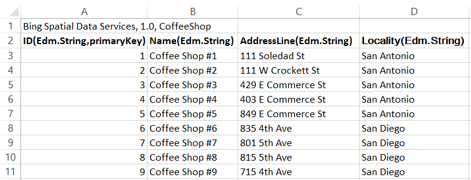  
  
 **Formatted column headers**  
  
 From here we need to export the data into a file format that can be uploaded. The Bing Spatial Data Services supports XML, CSV, Tab and Pipe delimited formatted files. When working with Excel, I prefer to use Tab or Pipe delimited files as it makes the upload process a bit easier. To export this data as a Tab delimited file in Excel press the **Save As** button and in in the Save as type drop down select Text (Tab delimited)(*.txt). We will call this file CoffeeShops_tab.txt.  
  
 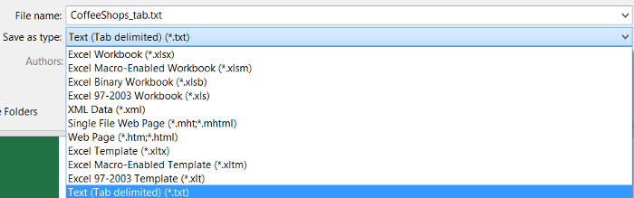  
  
 **Saving Excel File as Tab Delimited File**  
  
 Now that we have a Tab delimited file, we need to open it in a text editor and make a couple of minor edits. The first one is to remove all the trailing Tab characters that are in the first row of the file. The second edit is to remove all the quote characters from the file, as they are not required and can cause issues when uploading. If you are using notepad you can easily do this by pressing **Ctrl+H** to open the find replace functionality. In the screenshot below, you can see that the trailing Tab characters are highlighted in blue.  
  
 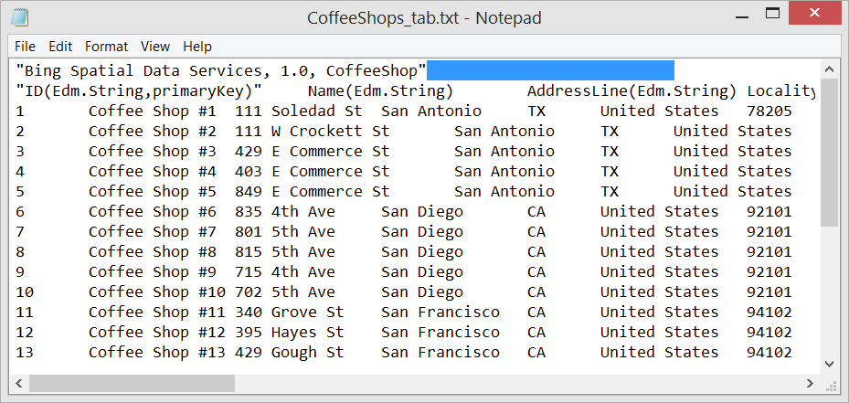  
  
 **Tab Delimited Data Source**  
  
## Uploading Our Data Sources to Bing  
 Now that we have a data sources, we need to upload it to the Bing Spatial Data Services. To upload, log into the [Bing Maps portal](http://www.bingmapsportal.com/) using your Microsoft Account ID. Once signed in, on the left side panel you will see a Data Sources section, select the **Upload data to a data source** link. You will be presented with a form to upload your data source. Set the data source name of the main data set to CoffeeShops. Next, select a Bing Maps key to be your master key. A master key allows you to programmatically query, edit, update and delete your data source. You can optionally provide a second Bing Maps key to be a query key. A Bing Maps key specified as a query key will only be able to search against the data sources and not modify them. If the drop downs are empty, you need to [create a Bing Maps key](http://msdn.microsoft.com/en-us/library/ff428642.aspx). Next, set the data type to TAB and then press the Browser button to select your data source file to upload. Once this is done press the **Upload** button.  
  
 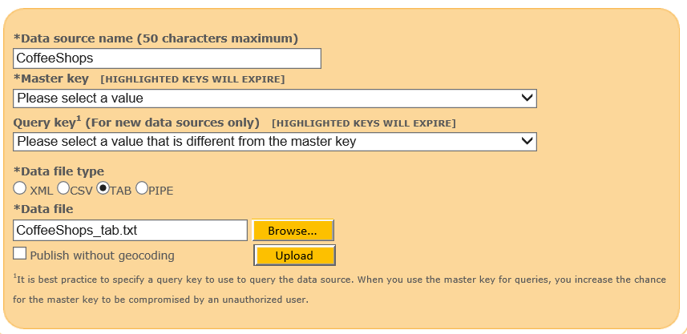  
  
 **Uploading a Data Source**  
  
 From here, click on the Manage my data sources link in the left side panel. You will see a panel listing the data sources that have been geocoded. Press the **Publish** button to have the data source exposed as a spatial REST service through the Bing Spatial Data Services.  
  
 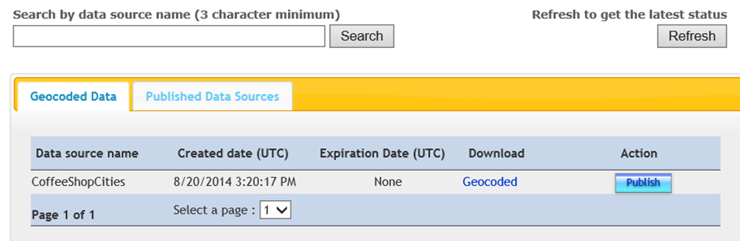  
  
 **Geocoded Data Source**  
  
 The publishing step may take a few minutes. You can monitor this on the Published Data Sources tab. Press the **Refresh** button from time to time update the status.  
  
 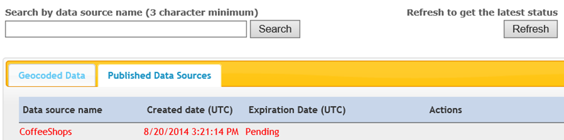  
  
 **Data Source Being Published**  
  
 Once complete, we can stop here if we want. To make things a bit easier for people who download the code, press the **Make Public** button next to the data source. By doing this, any Bing Maps key will query this data source. This is a great way to share data sources with other people.  
  
 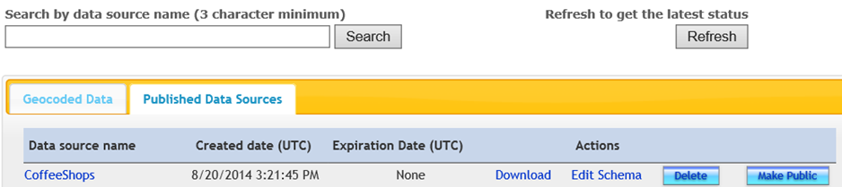  
  
 **Published Data Sources**  
  
 Now that the data source is uploaded, we will need to get the URL information to query it. On the left side panel, select the **View Data Source Information** link. You should see the published data source listed along with the URL, Master key and Query key to access it. We will need the URL later in our code.  
  
 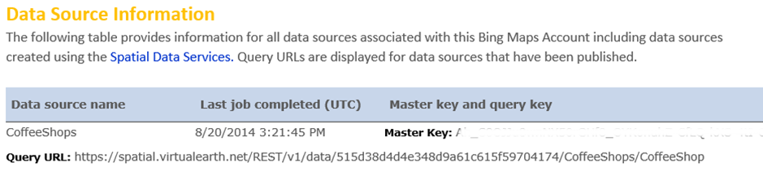  
  
 **Data Source Information**  
  
> [!TIP]
>  If you prefer to upload your data source programmatically you can do so using the [Data Source Management API](http://msdn.microsoft.com/en-us/library/gg585132.aspx)'s for the Bing Spatial Data Services. This is useful if you maintain your data in another system and want to create an automated process for updating your data in your data source.  
  
## Setting Up the Base Project  
 In this topic you have the choice to develop your locator using either Visual Studio or a simple text editor like notepad. Visual Studio is a powerful software development tool that makes developing applications easy. You can download the [express version](http://www.visualstudio.com/en-us/products/visual-studio-express-vs.aspx) free.  
  
### Using Visual Studio  
 If you prefer to use the more powerful and developer friendly approach using Visual Studio then open it up and create a new ASP.NET Web Application project called SimpleStoreLocator.  
  
   
  
 **Creating the Project in Visual Studio**  
  
 When you press the **OK** button, you will be requested to select a template for the ASP.NET project. Select the `Empty` template. You might notice that there is an option to create remote resources for a Windows Azure Website. This will help you to connect the project to Azure so you can do one-click deployments of the locator to Azure. For now, do not check this option. We will discuss how to deploy the project as an Azure Website later in this topic.  
  
 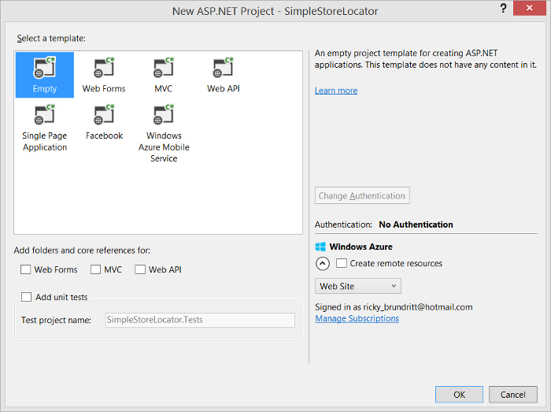  
  
 **Prompt for Selecting ASP.NET Project Template**  
  
 Once the project is loaded, add a new HTML page called **Locator.html** by right clicking on the project and selecting **Add**, **New Item**. Then create three folders called js, css and images. Inside the js folder, create a file called Locator.js. Inside the css folder, create a file called Locator.css. Finally add the following images to the images folder.  
  
|logo.png|dark_red_pin.png|  
|--------------|------------------------|  
|||  
  
> [!TIP]
>  If you would like to use your own logo image, call it logo.png and place that in the images folder as this will save you having to modify any code later.  
  
 At this point your project should look like this:  
  
 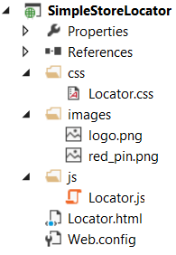  
  
 **Simple Store Locator Project Structure**  
  
### Using a Text Editor and Folders  
 If you want to use the text editor approach, you will need to create some folders on your computer. Find a location on your computer and create a folder called SimpleStoreLocator. Inside this folder, create a file called Locator.html and three folders called js, css, and images. Inside the js folder, create a file called Locator.js. Inside the css folder, create a file called Locator.css. Add the logo to the images folder.  
  
## Creating the User Interface  
 Open the Locator.html file. In here we will load in script references to the Locator.js file along with the Bing Maps V7 SDK, and jQuery. A reference to the Locator.css file will also be added. JQuery ([http://jquery.com/](http://jquery.com/)), if you are not familiar with it, is a very popular JavaScript framework that brings useful JavaScript functions to your application that make cross browser development a lot easier. The body of the HTML file will be basic and consist of a header section that contains an image, a side panel that contains the search box and button, along with an area to render the list of results, and finally a panel for displaying the map. Update the HTML in the Locator.html file with the following.  
  
```  
<!DOCTYPE html>  
<html>  
<head>  
    <title>Contoso Coffee Locator</title>  
    <meta http-equiv="x-ua-compatible" content="IE=Edge" />  
    <meta http-equiv="Content-Type" content="text/html; charset=utf-8" />  
  
    <link rel="stylesheet" type="text/css" href="css/Locator.css"/>  
  
    <script type="text/javascript" src="http://code.jquery.com/jquery-1.11.1.min.js"></script>  
    <script type="text/javascript" src="http://ecn.dev.virtualearth.net/mapcontrol/mapcontrol.ashx?v=7.0"></script>  
    <script type="text/javascript" src="js/locator.js"></script>  
</head>  
<body>  
    <table class="rootTable" border="0">  
        <tr class="header">  
            <td colspan="2"></td>  
        </tr>  
        <tr>  
            <td class="sidePanel">  
                <div class="searchBar">  
                    <input id="searchBox" type="text" />  
                    <input id="searchBtn" type="button" value="Search" />  
                </div>  
                <div class="resultsPanel"></div>  
            </td>  
            <td class="mapPanel"><div id="myMap"></div></td>  
        </tr>  
    </table>  
</body>  
</html>  
```  
  
 Next, open the Locator.css file. This file will contain all the CSS styles used by the store locator. Update this file with the following CSS styles.  
  
```  
html, body { margin: 0; padding: 0; width: 100%; height: 100%; }  
.rootTable { border-collapse: collapse; width: 100%; height: 100%; }  
.header { width: 100%; height: 80px; background-color: #8f0202; }  
.header img { height: 60px; margin-left: 15px; }  
.sidePanel { padding: 10px; width: 300px; height: 100%; vertical-align: top; }  
#searchBox { width: 180px; }  
.searchBar { height: 50px; }  
.resultsPanel { width: 280px; overflow-y: auto; overflow-x: hidden; }  
.mapPanel, #myMap { position: relative; width: 100%; height: 100%; }  
.errorMsg { color: red; }  
.listItem { font-size: 12px; font-family: Arial,Helvetica; width: 260px; margin: 5px 0; }  
.listItem td { vertical-align: top; }  
.listItem span { font-size: 14px; }  
.title, .title:link, .title:visited, .title:active { font-size: 14px; color: #8f0202; }  
.title:hover { color: red; }  
.infobox-info { color: #000 !important; font-size: 12px !important; padding-top: 0px !important; }  
  
html, body { margin: 0; padding: 0; width: 100%; height: 100%; }  
.rootTable { border-collapse: collapse; width: 100%; height: 100%; }  
.header { width: 100%; height: 80px; background-color: #8f0202; }  
.header img { height: 60px; margin-left: 15px; }  
.sidePanel { padding: 10px; width: 300px; height: 100%; vertical-align: top; }  
#searchBox { width: 180px; }  
.searchBar { height: 50px; }  
.resultsPanel { width: 280px; overflow-y: auto; overflow-x: hidden; }  
.mapPanel, #myMap { position: relative; width: 100%; height: 100%; }  
.errorMsg { color: red; }  
.listItem { font-size: 12px; font-family: Arial,Helvetica; width: 260px; margin: 5px 0; }  
.listItem td { vertical-align: top; }  
.listItem span { font-size: 14px; }  
.title, .title:link, .title:visited, .title:active { font-size: 14px; color: #8f0202; }  
.title:hover { color: red; }  
.infobox-info { color: #000 !important; font-size: 12px !important; padding-top: 0px !important; }  
```  
  
 If you run the application you will see the header, search box, and search button, but the map has not been loaded yet. If you try to do a search, nothing will happen.  
  
## Wiring Up the Application with JavaScript  
 At this point, we have all that we need from the user interface side of things. We now need to add some JavaScript to load the map and wire up all the different processes of geocoding the users query, locating nearby stores, and displaying them on the map and in the results list.  
  
 To get started open the Locator.js file and add the following code.  
  
```  
$(function () {  
    // Add all code for this topic inside here.  
  
});  
```  
  
> [!IMPORTANT]
>  This code comes from JQuery and waits to load all the JavaScript that it contains until after the webpage has finished loading. This is important since we need to access some of the HTML DOM objects like the search box and the map DIV. If we did not do this, there would be a chance that if things did not load quickly enough, our code might try to access a DOM element before it's created, which would cause an error and stop our locator from working.  
  
 The first bit of functionality we will add is a few variables that contain information such as the URL to the data source and the distance units to use. After that, we will load the map. When the map is loaded, we will specify the Bing Maps key to load the map and give it an initial zoom setting of 2.  
  
 There are several [map options](http://msdn.microsoft.com/en-us/library/gg427603.aspx) and [view options](http://msdn.microsoft.com/en-us/library/gg427628.aspx) that you can specify to customize the map. After the map loads we will add two `EntityCollections` to it. EntityCollection's allow you to separate data on the map in layers. We will us on EntityCollection to load the pushpins, and the other to load an infobox. By doing this we can ensure that the infobox always renders above our pushpins.  
  
> [!TIP]
>  When using infoboxes, it is best to create a single Infobox object and add it to the map, then update its content whenever we want to display information for a location. The reason for doing this—instead of creating an infobox for each result—is that for every infobox we create, a number of DOM elements that are added to the page. The more DOM elements there are on the page, the more things the browser has to keep track of. If there are too many items, the browser can become slow.  
  
 After adding the EntityCollections, we will get a session key from the map. A session key is a special Bing Maps key that ties all transactions made by your application into a single user session. The benefit of doing this is that all calls to any of the Bing Maps services which uses this session key will be marked as non-billable transactions.  
  
> [!TIP]
>  If the Bing Maps key you use to load the map is either the master or query key to your database, the session keys generated by the map will also have access to your data source using the Bing Spatial Data Service.  
  
 After getting a session key, we will load the Search module for Bing Maps that provides a JavaScript library for geocoding the users query (convert the query into coordinates on the map). This library also provides the ability to reverse geocode coordinates (find an approximate address for a coordinate), and to find points of interest. To do this, add the following code to the Locator.js file.  
  
```  
// URL to the data source that powers the locator.  
var dataSourceUrl = 'https://spatial.virtualearth.net/REST/v1/data/515d38d4d4e348d9a61c615f59704174/CoffeeShops/CoffeeShop';  
  
// A setting for specifying the distance units displayed. Possible values are 'km' and 'mi'.  
var distanceUnits = 'km';  
  
// Load the map.  
var map = new Microsoft.Maps.Map(document.getElementById('myMap'), {  
    credentials: 'YOUR_BING_MAPS_KEY',  
    zoom: 2  
});  
  
// Create a layer to load pushpins to.  
var dataLayer = new Microsoft.Maps.EntityCollection();  
map.entities.push(dataLayer);  
  
// Add a layer for the infobox.  
var infoboxLayer = new Microsoft.Maps.EntityCollection();  
map.entities.push(infoboxLayer);  
  
// Create a global infobox control.  
var infobox = new Microsoft.Maps.Infobox(new Microsoft.Maps.Location(0, 0), {  
    visible: false,  
    offset: new Microsoft.Maps.Point(0, 20),  
    height: 170,  
    width: 230  
});  
infoboxLayer.push(infobox);  
  
// Create a session key from the map to use with data source service requests.  
var sessionKey;  
map.getCredentials(function (c) {  
    sessionKey = c;  
});  
  
// Load the Search Module for Bing Maps for doing geocoding.  
var searchManager;  
Microsoft.Maps.loadModule('Microsoft.Maps.Search', {  
    callback: function () {  
        searchManager = new Microsoft.Maps.Search.SearchManager(map);  
    }  
});  
```  
  
 The following code will modify the height of the results and side-panel panes along with the map so that it fills the available space of the page, without requiring the user to scroll to see the map. We will also call this function right away to set the initial height. Add the following code to the Locator.js file.  
  
```  
// Resize the height of the results panel based on the available space.  
$(window).resize(function () {  
    $('.resultsPanel').height($(window).height() - $('.searchBar').height() - 100);  
    $('.mapPanel').height($(window).height() - 100);  
    $('.sidePanel').height($(window).height() - 100);  
});  
$(window).resize();  
```  
  
 Next, we will add a number of useful helper methods that we will use throughout the application. The first function will make it easy to show error messages in the results panel. This will make for a better user experience than having alerts popup. The second function will give us a convenient way to clear the map and the results panel. The third function will help use format a time expressed in 1000's hour's format (i.e. 730) as a nicely formatted time (i.e. 7:30 AM).  
  
 This last function will allow us to calculate the distance between two locations for the specified distance units. The Bing Spatial Data Services has an option to return the distance between the search location and each result in kilometers, but you would have to convert these values if you wanted the distance in miles. Since calculating the distance between two locations is a very useful thing to do, we will create a simple function for doing this. To do this, add the following code to the Locator.js file.  
  
```  
// A simple function for displaying error messages in the app.  
function showErrorMsg(msg) {  
    $('.resultsPanel').html('<span class="errorMsg">' + msg + '</span>');  
}  
  
// A simple function for clearing the map and results panel.  
function clearMap() {  
    dataLayer.clear();  
    infobox.setOptions({ visible: false });  
    $('.resultsPanel').html('');  
}  
  
// Formats a time in 1000 hours to hh:mm AM/PM format  
function formatTime(val) {  
    var minutes = val % 100;  
    var hours = Math.round(val / 100);  
  
    if (minutes == 0) {  
        minutes = '00';  
    }  
  
    if (hours > 12) {  
        return (hours - 12) + ':' + minutes + 'PM';  
    } else {  
        return hours + ':' + minutes + 'AM';  
    }  
}  
  
// Calculates the shortest distance between two locations on the curvature of the earth.  
function haversineDistance(loc1, loc2) {  
    var degToRad = Math.PI / 180,  
        lat1 = loc1.latitude * degToRad,  
        lon1 = loc1.longitude * degToRad,  
        lat2 = loc2.latitude * degToRad,  
        lon2 = loc2.longitude * degToRad;  
  
    var dLat = lat2 - lat1,  
    dLon = lon2 - lon1,  
    cordLength = Math.pow(Math.sin(dLat / 2), 2) + Math.cos(lat1) * Math.cos(lat2) * Math.pow(Math.sin(dLon / 2), 2),  
    centralAngle = 2 * Math.atan2(Math.sqrt(cordLength), Math.sqrt(1 - cordLength));  
  
    var earthRadius = (distanceUnits == 'km') ? 6378.1 : 3963.1676;  
    var distance = earthRadius * centralAngle;  
  
    // Round off distance to 2 decimal place  
    return Math.round(distance * 100) / 100;  
}  
```  
  
 Next, we will add a click event to the search button, which will clear the map and create a geocode request that will return the first result for the users query. When a result is found, it will be sent to another function that will search for nearby locations. We will also add a key press event to the search box which will trigger a search if the user presses the enter key. To do this, add the following code to the Locator.js file.  
  
```  
// Add a click event to the search button.  
$('#searchBtn').click(function () {  
    clearMap();  
  
    // Create a request to geocode the users search.  
    var geocodeRequest = {  
        where: $('#searchBox').val(),  
        count:1,   
        callback: function (r) {  
            if(r && r.results &&   
                r.results.length > 0 &&   
                r.results[0].location) {  
                findNearbyLocations(r.results[0].location);  
            }else{  
                showErrorMsg('Unable to geocode query');  
            }  
        },  
        errorCallback:function(){  
            showErrorMsg('Unable to geocode query');  
        }};  
  
    // Geocode the users search.  
    searchManager.geocode(geocodeRequest);  
});  
  
// Add a key press event to the search box that triggers the search when the user presses Enter key.  
$('#searchBox').keypress(function (e) {  
    if (e.which == 13) {  
        $('#searchBtn').click();  
    }  
});  
  
// Add a click event to the search button.  
$('#searchBtn').click(function () {  
    clearMap();  
  
    // Create a request to geocode the users search.  
    var geocodeRequest = {  
        where: $('#searchBox').val(),  
        count:1,   
        callback: function (r) {  
            if(r && r.results &&   
                r.results.length > 0 &&   
                r.results[0].location) {  
                findNearbyLocations(r.results[0].location);  
            }else{  
                showErrorMsg('Unable to geocode query');  
            }  
        },  
        errorCallback:function(){  
            showErrorMsg('Unable to geocode query');  
        }};  
  
    // Geocode the users search.  
    searchManager.geocode(geocodeRequest);  
});  
  
// Add a key press event to the search box that triggers the search when the user presses Enter key.  
$('#searchBox').keypress(function (e) {  
    if (e.which == 13) {  
        $('#searchBtn').click();  
    }  
});  
```  
  
 Next, create the functionality to search for nearby locations in the data source using the Bing Spatial Data Services. First, we will create a URL request to find locations in the data source that will return the first 10 results that are within 20 kilometers of the specified location. This URL will then be used with the jQuery ajax function to download the results. Since the data source is on a different web domain (base URL), we have to make this request using `JSONP` which allows cross domain requests to be easily made. When the results are returned, we will loop through each of them and create a custom pushpin that uses the red_pin.png image as the icon and has the result number as the text value displayed on top of the pushpin.  
  
> [!CAUTION]
>  When creating custom pushpins be sure to specify the width, height, and anchor properties. If you don't set the width and height values and your icon is larger than the default pushpin icon, it will be clipped. In addition, the anchor property allows you to specify which part of the icon is anchored to the relative coordinate on the map. If this is not set correctly, you will likely see the pushpin drift away from the coordinate when zooming out. Look at this [blog post](http://blogs.msdn.com/b/rbrundritt/archive/2014/10/02/correcting-anchoring-pushpins-to-the-map.aspx) for more information on this subject.  
  
 Create a custom property on the pushpin called Metadata and store a copy of the location result in this property so that we can easily retrieve all the information for a location when we have a reference to a pushpin. We will then add a click event to the pushpin that will call a function to display an infobox. The pushpin will be added to the dataLayer EntityCollection.  
  
> [!TIP]
>  When creating pushpins, store a copy of the coordinates in an array. This can then be used to calculate the bounding box of all the data that we can pass to the map so set the view. By doing this we will have a nice easy way to ensure that all the results are displayed to the user without them needing to pan the map to find them.  
  
 After the pushpin is created, create some HTML to display the result in the results panel. Make the name of the store clickable so that it will zoom in on the selected store and show its infobox. Since all our locations have a unique ID as specified in the data source, we can store this as an attribute of the HTML element that contains the store name. We will be able to retrieve this attribute later when the user clicks on the name of the store and can do a simple search through the pushpins to find which one has the same ID value in the Metadata. To do this, add the following code to the Locator.js file.  
  
```  
// A function that searches for nearby locations against the data source.  
function findNearbyLocations(location) {  
    // Create the URL request to do a nearby search against the data source.  
    // Have it search within a radius of 20KM and return the top 10 results.  
    var request = dataSourceUrl + '?spatialFilter=nearby(' + location.latitude +  
        ',' + location.longitude + ',20)&$format=json&$top=10&key=' + sessionKey;  
  
    $.ajax({  
        url: request,  
        dataType: 'jsonp',  
        jsonp: 'jsonp',  
        success: function (data) {  
            var results = data.d.results;  
  
            if (results.length > 0) {  
                // Create an array to store the coordinates of all the location results.  
                var locs = [];  
  
                // Create an array to store the HTML used to generate the list of results.  
                // By using an array to concatenate strings is much more efficient than using +.  
                var listItems = [];  
  
                //Loop through results and add to map  
                for (var i = 0; i < results.length; i++) {  
                    var loc = new Microsoft.Maps.Location(results[i].Latitude, results[i].Longitude);  
  
                    // Create pushpin  
                    var pin = new Microsoft.Maps.Pushpin(loc, {  
                        icon: 'images/red_pin.png',  
                        text: (i + 1) + ''  
                    });  
  
                    // Store the location result info as a property of the pushpin so we can use it later.  
                    pin.Metadata = results[i];  
  
                    // Add a click event to the pushpin to display an infobox.  
                    Microsoft.Maps.Events.addHandler(pin, 'click', function (e) {  
                        displayInfobox(e.target);  
                    });  
  
                    // Add the pushpin to the map.  
                    dataLayer.push(pin);  
  
                    // Add the location coordinate to the array of locations  
                    locs.push(loc);  
  
                    // Create the HTML for a single list item for the result.                          
                    listItems.push('<table class="listItem"><tr><td rowspan="3"><span>', (i + 1), '.</span></td>');  
  
                    // Store the result ID as a property of the name. This will allow us to relate the list item to the pushpin on the map.  
                    listItems.push('<td><a class="title" href="javascript:void(0);" rel="', results[i].ID, '">', results[i].Name, '</a></td>');  
                    listItems.push('<td>', haversineDistance(location, loc), ' ', distanceUnits, '</td></tr>');  
  
                    listItems.push('<tr><td colspan="2" class="listItem-address">', results[i].AddressLine, '<br/>', results[i].Locality, ', ');  
                    listItems.push(results[i].AdminDistrict, '<br/>', results[i].PostalCode, '</td></tr>');  
  
                    listItems.push('<tr><td colspan="2"><a target="_blank" href="http://bing.com/maps/default.aspx?rtp=~pos.', results[i].Latitude, '_', results[i].Longitude, '_', encodeURIComponent(results[i].Name), '">Directions</a></td></tr>');  
  
                    listItems.push('</table>');  
                }  
  
                // Use the array of locations from the results to set the map view to show all locations.  
                if (locs.length > 1) {  
                    map.setView({ bounds: Microsoft.Maps.LocationRect.fromLocations(locs), padding: 80 });  
                } else {  
                    map.setView({ center: locs[0], zoom: 15 });  
                }  
  
                // Add the list items to the results panel.  
                $('.resultsPanel').html(listItems.join(''));  
  
                // Add a click event to the title of each list item.  
                $('.title').click(function () {  
                    // Get the ID of the selected location  
                    var id = $(this).attr('rel');  
  
                    //Loop through all the pins in the data layer and find the pushpin for the location.  
                    var pin;  
                    for (var i = 0; i < dataLayer.getLength() ; i++) {  
                        pin = dataLayer.get(i);  
  
                        if (pin.Metadata.ID != id) {  
                            pin = null;  
                        } else {  
                            break;  
                        }  
                    }  
  
                    // If a pin is found with a matching ID, then center the map on it and show it's infobox.  
                    if (pin) {  
                        // Offset the centering to account for the infobox.  
                        map.setView({ center: pin.getLocation(), centerOffset: new Microsoft.Maps.Point(-70, 150), zoom: 17 });  
                        displayInfobox(pin);  
                    }  
                });  
            }  
        },  
        error: function (e) {  
            showErrorMsg(e.statusText);  
        }  
    });  
}  
```  
  
 The last thing left to add is a function to display the infobox. When we display an infobox we will use the Metadata that we stored in our pushpin and create HTML to render inside of the infobox that we created earlier. When this is complete, we can change the location of the infobox to that of our pushpin and display it. Add the following code to the Locator.js file to do this.  
  
```  
// Takes a pushpin and generates the content for the infobox from the Metadata and displays the infobox.  
function displayInfobox(pin) {  
    infobox.setLocation(pin.getLocation());  
  
    var desc = ['<table>'];  
  
    desc.push('<tr><td colspan="2">', pin.Metadata.AddressLine, '<br/>', pin.Metadata.Locality, ', ');  
    desc.push(pin.Metadata.AdminDistrict, '<br/>', pin.Metadata.PostalCode, '</td></tr>');  
  
    desc.push('<tr><td><b>Hours:</b></td><td>', formatTime(pin.Metadata.Open), ' - ', formatTime(pin.Metadata.Close), '</td></tr>');  
    desc.push('<tr><td><b>Store Type:</b></td><td>', pin.Metadata.StoreType, '</td></tr>');  
    desc.push('<tr><td><b>Has Wifi:</b></td><td>', (pin.Metadata.IsWiFiHotSpot) ? 'Yes' : 'No', '</td></tr>');  
    desc.push('<tr><td colspan="2"><a target="_blank" href="http://bing.com/maps/default.aspx?rtp=~pos.', pin.Metadata.Latitude, '_', pin.Metadata.Longitude, '_', encodeURIComponent(pin.Metadata.Name), '">Directions</a></td></tr>');  
  
    desc.push('</table>');  
  
    infobox.setOptions({ visible: true, title: pin.Metadata.Name, description: desc.join('') });  
}  
```  
  
 At this point, you should have a fully functional store locator. To open the locator inside of a web browser in Visual Studio, simply right click on the Locator.html file and select the option **Set As Start Page**, and then press the **Debug** button (green arrow in the **Standard** toolbar). If you are working with files and folders in Windows, right click on the Locator.html file and select **Open With**, **Internet Explorer**. The browser will open and will give you a security warning asking you to allow blocked content. Press the **Allow Blocked Content** button.  
  
 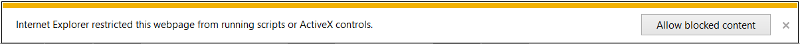  
  
 **Security Warning in Internet Explorer**  
  
 Once the locator is loaded, if you do a search for Seattle, or any of the other cities in which we have data for in the data source, you will see a list of results load along with pushpins on the map. If you click on a pushpin, an infobox will appear with addition details for the location.  
  
 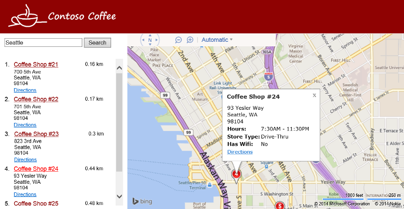  
  
 **The Finished Store Locator**  
  
 If you click the **Directions** button for one of the locations, it will open a new browser window to the Bing Maps consumer site with the directions functionality turned on and the destination field populated like this.  
  
 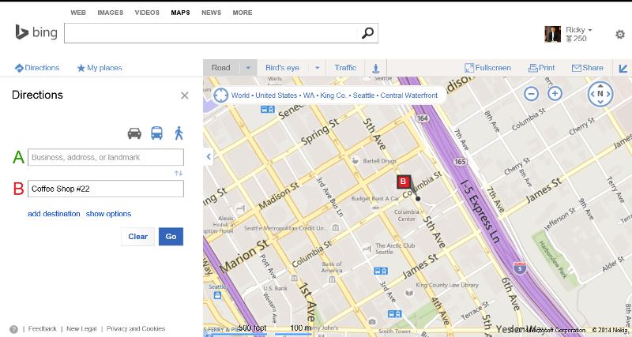  
  
 **Directions on the Bing Maps Consumer Site**  
  
## Deploying as an Azure Website  
 You now have a fully functional store locator that works in your local browser. Now you will likely need to make this available to others. Windows Azure, Microsoft's Cloud platform, provides users with the ability to build, deploy, and scale enterprise-grade web sites in seconds using Azure Websites.  
  
 The benefit of deploying your website as an Azure website is that it is easy to scale the infrastructure behind it as the number of users grows accessing it increases. This helps keep the cost of hosting your website to a minimum.  
  
 If you don't have an Azure account already you can create a free trial account at [http://azure.com](http://azure.com). Currently under the Azure Websites [pricing details page](http://azure.microsoft.com/en-us/pricing/details/websites/), you can create up to 10 websites free, with 1GB of storage and 165MB of outbound bandwidth per day. The store locator we built in this topic post is about 40KB in size, which means that it is definitely within the storage limits and that you could potentially have over 4,000 users per day before the bandwidth and still be within the free limits.  
  
### Deploying using Visual Studio  
 If you are using Visual Studio, you can easily deploy your store locator as an Azure Website. To get started, right-click on the SimpleStoreLocator project in and press the **Publish** button that appears in the context menu.  
  
 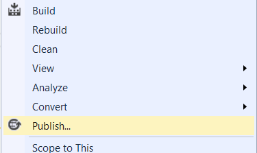  
  
 **Publish Button in Visual Studio**  
  
 A window will appear that will ask you to select a publish target. Select **Windows Azure Web Sites**.  
  
 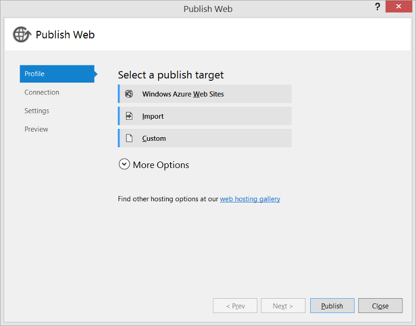  
  
 **Publishing Window in Visual Studio**  
  
 When you do this you will be prompted to sign into your Microsoft account and have the option to either select an existing Azure website or create a new one. Press the **New** button.  
  
 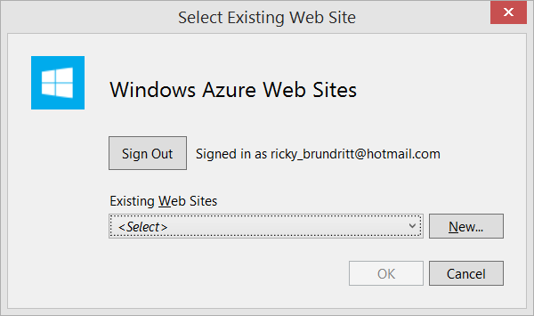  
  
 **Sign In and Existing Web Site Selection Window**  
  
 A window will appear with a form to fill out to create your Azure Website.  
  
 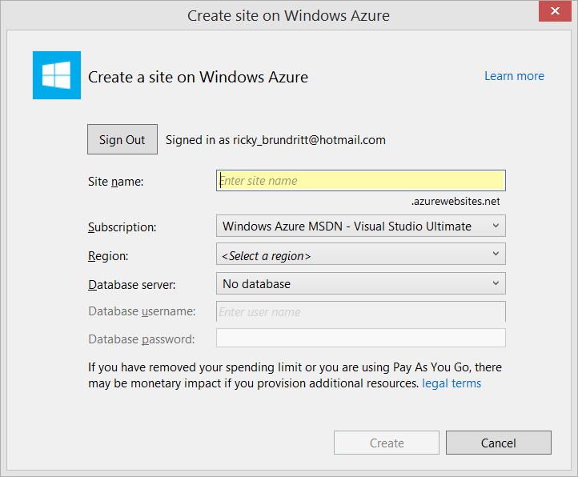  
  
 **Form to Create an Azure Website**  
  
 Here are some details about each field in the form and how to best fill them in.  
  
-   **Site Name**: This is the domain name for your website. The name should be limited to letters and numbers and should not include any spaces or special characters. The name has to be unique across all Azure accounts. Note that if you use a generic name like StoreLocator that it's possible that the name is already in use. Try to use your company name as part of the site name, for example ContosoCoffeeLocator. After you enter a name, you will see an icon to the right of the textbox that indicates if the name is available or not. If the textbox stays yellow, then you likely have invalid characters in the name.  
  
-   **Subscription**: By now, you should have already signed up for a free trial for Azure, if you do not already have an Azure account. Select the subscription you want this website to belong.  
  
-   **Region**: Windows Azure is a cloud platform and that means that it can host your web site across multiple data centers around the world to ensure that regardless of where your users are they are able to access your website quickly. Since this is a simple website, we will only be deploying to a single region. Select the region that is most likely to contain the majority of your end-users.  
  
-   **Database server, username & password**: Since all of our data for this application is hosted in the Bing Spatial Data Services, there is no need for a database at this time. Simply leave the **Database server** set to "No database".  
  
 Once all the required fields are completed, press the **Create** button. This will create a new Azure Website for you and will then show a window that contains details required by Visual Studio to connect to the website. You should not need to do anything other than press the **Publish** button.  
  
 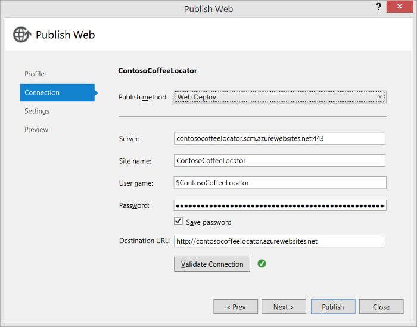  
  
 **Azure Website Connection Details Window**  
  
 This will then publish your store locator as an Azure Website. In Visual Studio, you should see the output window appear with details informing you if the publishing was successful or not. You will also see the URL to your newly created Azure Website. To view your store locator open Internet Explorer and enter in the URL to the store locator page. This should look something like this:  
  
 **http://[YOUR_SITE_NAME].azurewebsites.net/Locator.html**  
  
 When you make updates to your store locator and republish it through Visual Studio, you will find that it will remember all the settings and overwrite the previously deployed website with the new one.  
  
### Deploying a Folder Based Application  
 To deploy the store locator as an Azure website without using Visual Studio, you will need to use FTP to get your files to the server. To get started, open a web browser and go to [http://azure.com](http://azure.com) and select the **Portal** link at the top of the page. If you haven't already signed into your account, you will likely be prompted to. After the Azure Management portal opens, click the **Websites** button on the left side panel.  
  
 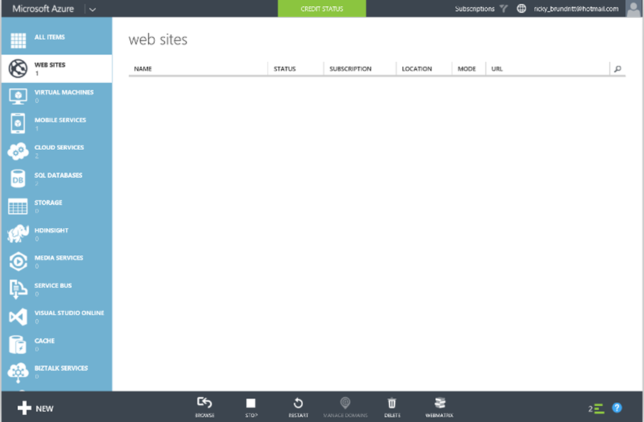  
  
 **Windows Azure Management Portal**  
  
 Click on the **NEW** button in the bottom left corner of the page. In the panel that appears, select the following options: **COMPUTE**, **WEB SITE**, and **QUICK CREATE**.  
  
 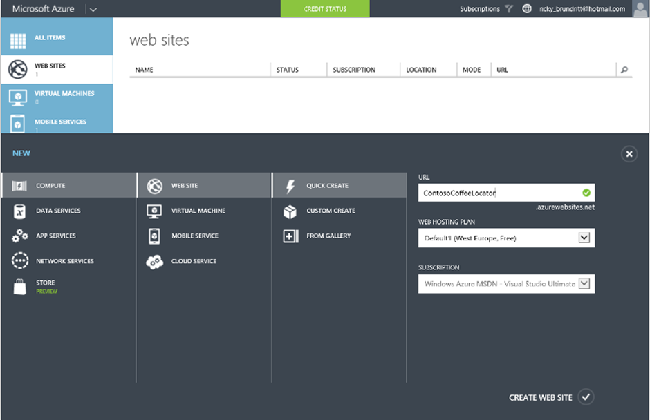  
  
 **Azure Website Creation Form**  
  
 You will see a form appear that require you to enter some information. Here are some details about each field in the form and how to best fill them in.  
  
-   **URL**: The domain name for your website. The name should be limited to letters and numbers and should not include any spaces or special characters. The name has to be unique across all Azure accounts. Note that if you use a generic name like StoreLocator that it's possible that the name is already in use. Try to use your company name as part of the site name, for example ContosoCoffeeLocator. After you enter a name, you will see an icon to the right of the textbox that indicates if the name is available or not.  
  
-   **Web Hosting Plan**: Select the default free option.  
  
-   **Subscription**: Select the Azure subscription you want this website to use.  
  
 After the form is filled in, press the **Create Web Site** button. When this is complete, Azure will create your website and will add it to the list of Web Sites.  
  
 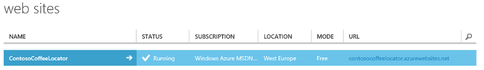  
  
 **List of Created Azure Websites**  
  
 Click on the name of your Azure Website. On the screen that opens, press the **Dashboard** button. On the right side, under the **quick glance** section, select the **Set up deployment credentials** link.  
  
 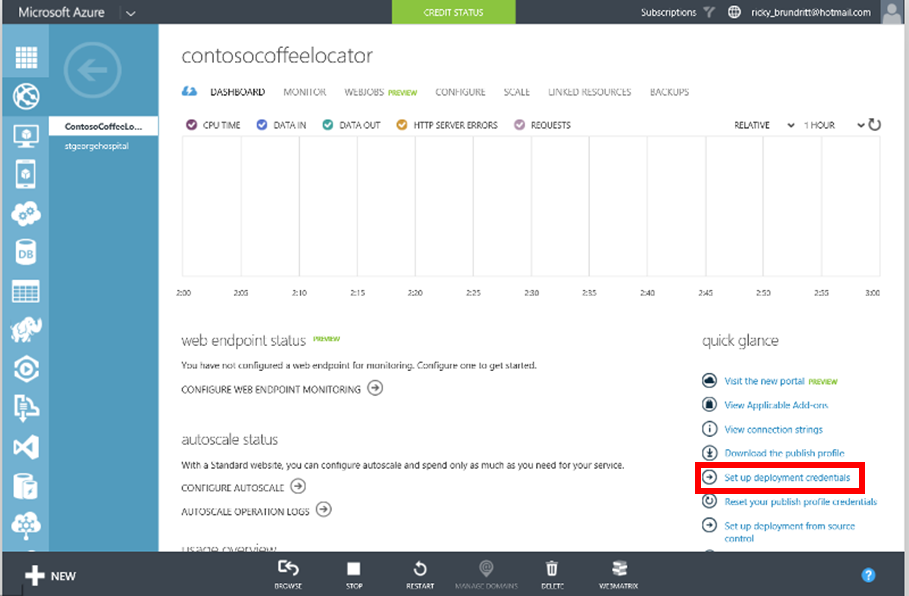  
  
 **Azure Website Dashboard**  
  
 This will allow you to specify the credentials to use to access this Azure Website using FTP. Enter a user name and create a password. Remember this information as you will need it later.  
  
 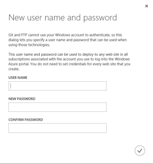  
  
 **Deployment Credentials Form**  
  
 Once this is complete and you are back to the dashboard, scroll down the page until you get to the **usage overview** section. To the right of this you will see two importance pieces of information; **FTP Host Name**, and **Deployment / FTP User**. You will need this information in the next step.  
  
 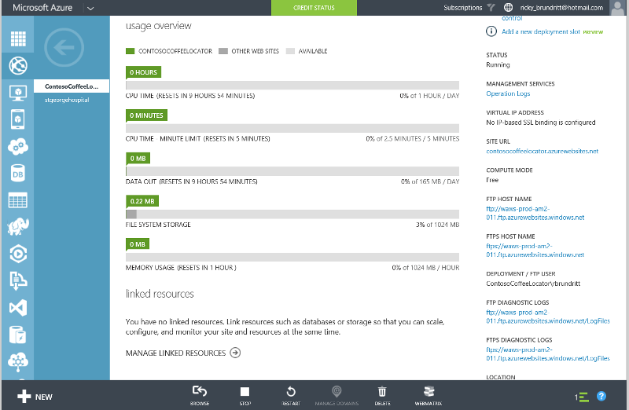  
  
 **Dashboard Showing FTP Settings**  
  
 We now have all the information we need to FTP the store locator files to the Azure Website. If you do not have an FTP app already, consider [FileZilla](https://filezilla-project.org/), which is free. Once you have an FTP app installed on your computer, open it up. If you are using FileZilla, here are the steps to connect it to your Azure Website. First, select **File**, **Site Manager**. This will open up a window where we can provide all the FTP connection information. Press the **New Site** button and give it a name you can remember such as ContosoCoffeeWebsite. You will see a form to enter the connection settings. You will need to set the following fields:  
  
-   **Host**: Set this to the FTP HOST Name URL.  
  
-   **Logon Type**: Set this to Normal.  
  
-   **User Name**: Set this to the Deployment / FTP User name.  
  
-   **Password**: Set this to the password you created earlier.  
  
 When this is done press the **Connect** button.  
  
 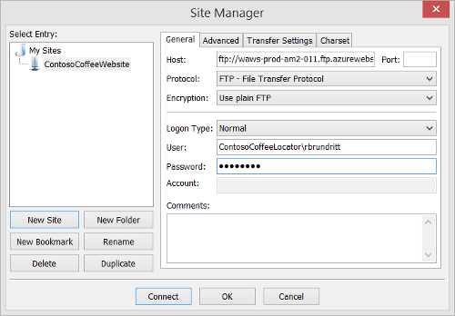  
  
 **FileZilla Site Manager Connection Settings**  
  
 In the future, you will be able to connect to your Azure Website by pressing the arrow point down in the top right corner of the FileZilla window.  
  
 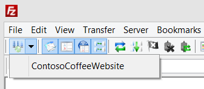  
  
 **Stored FTP Connection Settings**  
  
 Once connected, you will see some folders appear under the remote sites section of the window. Click on the site folder, then on the wwwroot folder. Under the local site section, navigate to where your store locator files are located. Next, select the Locator.html and the css, js, images folders from the local site, gthen drag and drop them into the wwroot folder on the remote site.  
  
 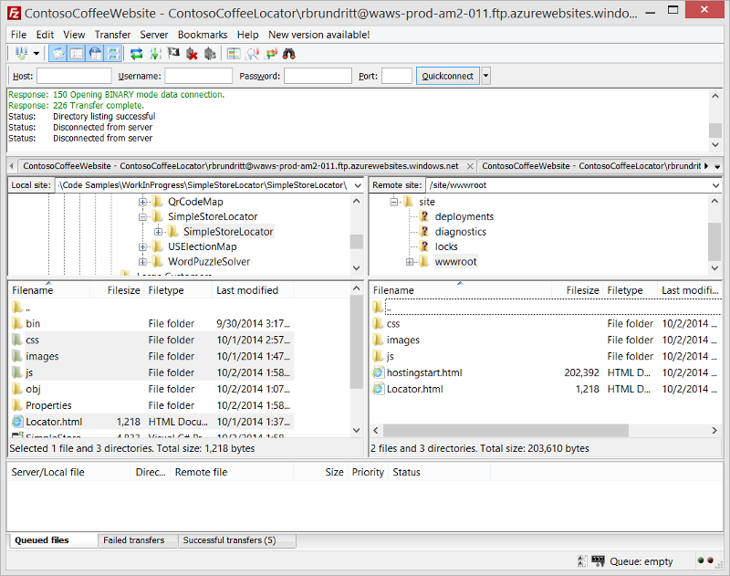  
  
 **Copying Local Files to Azure Website Using FileZilla**  
  
 You store locator is now deployed. To view your store locator, open Internet Explorer and enter in the URL to the store locator page. This should look something like this:  
  
 **http://[YOUR_SITE_NAME].azurewebsites.net/Locator.html**  
  
## Bing Places for Businesses  
 Bing Places for Business is a free service that allows you to add or claim your business listing on Bing and can be found by millions of Bing users searching online. Claiming your listing allows you to take control of your business information online and enrich it with content like photos, cuisine and menu URLs, phone numbers, and other relevant information. This information can help Bing users to learn more about your products and services as well as how to contact you if they desire to initiate a transaction with your business. You can claim or add your business at [http://bing.com/places](http://bing.com/places). By doing so your business listing will show up in Bing Search and other Bing powered services such as Cortana.  
  
 This is a great way to help potential customers find your business and should be just as important, if not more, as having a store locator. Here is a short video overview of Bing Places: [Bing Places for Businesses](https://www.youtube.com/watch?v=oWZXLRPjNmU&feature=youtube_gdata_player)  
  
## Advance Feature Ideas  
 In this topic, we have seen how easy it is to create a simple store locator. This may be all the functionality that you need. However, here are some additional, more advance features you may be interested in adding to your store locator to create a more custom user experience.  
  
-   Add an **Auto Complete** search box:  
  
    -   [How to Create a Customer Ranked Auto Suggest with Bing Maps and Azure Mobile Services](https://microsoft-my.sharepoint.com/personal/richbrun_microsoft_com/Documents/Shared%20with%20Everyone/Bing%20Blog%20Posts/•%09http:/blogs.bing.com/maps/2014/03/31/how-to-create-a-customer-ranked-auto-suggest-with-bing-maps-and-azure-mobile-services)  
  
    -   [Auto Complete powered by the Bing Spatial Data Services](http://blogs.bing.com/maps/2014/10/09/how-to-add-custom-auto-complete-functionality-to-your-map-app/)  
  
-   Add [pushpin clustering](https://bingmapsv7modules.codeplex.com/wikipage?title=Client%20Side%20Clustering) if you want to view a large number of locations on the map.  
  
-   [Sort results by driving distance](https://microsoft-my.sharepoint.com/personal/richbrun_microsoft_com/Documents/Shared%20with%20Everyone/Bing%20Blog%20Posts/•%09http:/blogs.bing.com/maps/2011/03/18/dev-tip-of-the-week-how-to-search-by-driving-time-with-ajax-v7-rest-and-spatial-data-services).  
  
-   Have directions integrated within your application using the [Directions Module](http://msdn.microsoft.com/en-us/library/hh312802.aspx).  
  
-   [Animate the pushpins](http://blogs.bing.com/maps/2014/08/07/bring-your-maps-to-life-creating-animations-with-bing-maps-javascript/) so that they drop bounce when loaded onto the map.  
  
-   Add [support for multiple languages](http://msdn.microsoft.com/en-us/library/gg427600.aspx).  
  
-   Create a [cross platform app using PhoneGap](http://blogs.bing.com/maps/2013/06/28/cross-platform-development-with-bing-maps-and-phonegap/).  
  
-   [Create custom infoboxes](http://blogs.bing.com/maps/2011/06/07/dev-tip-of-the-week-modular-plug-in-for-customizable-infobox-control/).  
  
-   iFrame in a [Photosynth](https://photosynth.net/preview) of your locations.  
  
-   Provide an alternate method for searching by using drop downs which contain the list of cities, states, or countries in which you have data.  
  
-   Allow the user to [find locations along route](http://msdn.microsoft.com/en-us/library/hh771572.aspx).  
  
-   Allow your users to [draw out an area on a map](http://bingmapsv7modules.codeplex.com/wikipage?title=Shape%20Toolbox%20Module) to search for locations.  
  
-   Add the ability to [specify filters](http://msdn.microsoft.com/en-us/library/gg585129.aspx) (i.e. only return locations that have WiFi).  
  
-   Connect your store locator to a database:  
  
    -   [How to Create a Spatial Web Service that connects a Database to Bing Maps using EF5](http://blogs.bing.com/maps/2013/07/31/how-to-create-a-spatial-web-service-that-connects-a-database-to-bing-maps-using-ef5/)  
  
    -   [Advance Spatial Queries using Entity Framework 5](http://blogs.bing.com/maps/2013/08/05/advance-spatial-queries-using-entity-framework-5/)  
  
-   Create an [augmented reality app](http://blogs.bing.com/maps/2013/06/24/augmented-reality-with-bing-maps-in-a-windows-store-app/) to help users find your locations in an interesting way.  
  
-   [Get the user](http://msdn.microsoft.com/en-us/library/hh125833.aspx) to perform an initial search around where they are. Note that this displays a message to the user asking them to share their location that may be viewed as inappropriate for some users.  
  
-   Add a button to each location that provides an email address. You could take this a step further and embed some HTML that can be [understood by Cortana](http://www.bing.com/dev/en-us/contextual-awareness).  
  
-   Add support to specify an initial search value using a query string. This will allow users to bookmark and share searches. This will also provide an easy method for you to pass searches to this page from another page.  
  
 As mentioned at the beginning of this topic, the full source code can be found in the MSDN Code Samples [here](http://code.msdn.microsoft.com/Creating-a-Store-Locator-b64c750c). You can also find many other interesting code samples around Bing Maps in the MSDN Code Samples Gallery [here](http://code.msdn.microsoft.com/site/search?query=&f%5B0%5D.Value=&f%5B0%5D.Type=SearchText&f%5B1%5D.Value=Bing%20Maps&f%5B1%5D.Type=Technology&ac=4).