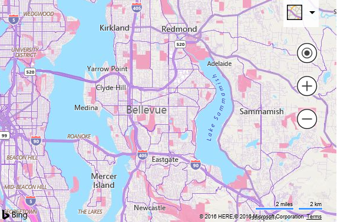
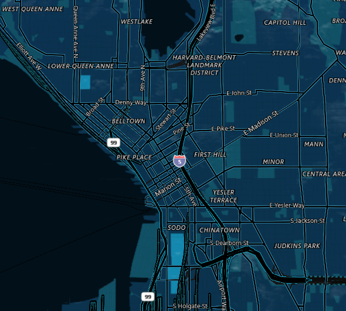
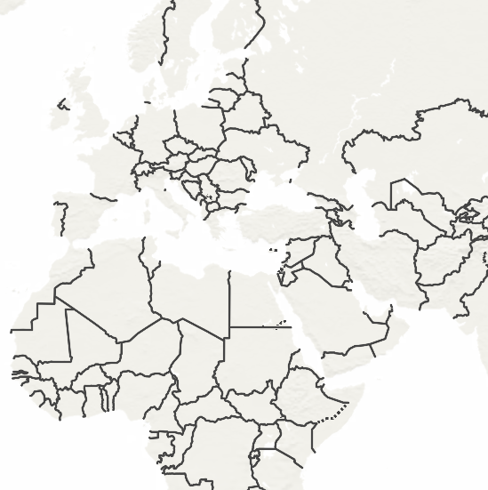
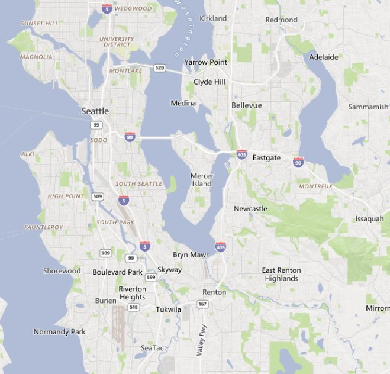

# Custom Map Styles in Bing Maps

[!INCLUDE [bing-maps-enterprise-service-retirement](../includes/bing-maps-enterprise-service-retirement.md)]

Depending on which API or service you are using there are two different ways to specify a custom style in Bing Maps. The Bing Maps V8 web and Windows 10 UWP controls use a JSON style object, while the Bing Maps REST services and map tiles use a formatted string.

The JSON style schema is very comprehensive. The Windows 10 UWP map control makes full use of the schema while the Bing Maps V8 Web control and REST services support a subset of the schema. A JSON style created for the Windows 10 UWP map control will work with the V8 Web Control and vice-versa. Any unsupported style settings will simply be ignored.

This documentation will focus on custom map styles in Bing Maps V8 Web Control and the Bing Maps REST services. Documentation on using custom map styles in the Windows 10 UWP control can be found [here](/uwp/api/windows.ui.xaml.controls.maps.mapstylesheet).

## Custom Map Styles in the Bing Maps V8 Web Control

The Bing Maps V8 control has a new map option called `customMapStyle` which can be set when loading the map. This property expects a JSON map **ICustomMapStyle** object. Here is an example of how to add a custom map style to Bing Maps V8.

```HTML
<!DOCTYPE html>
<html>
<head>
    <title></title>
    <meta charset="utf-8" />
    <script type='text/javascript'>
        var map;

        var myStyle = {
            "elements": {
                "water": { "fillColor": "#a1e0ff" },
                "waterPoint": { "iconColor": "#a1e0ff" },
                "transportation": { "strokeColor": "#aa6de0" },
                "road": { "fillColor": "#b892db" },
                "railway": { "strokeColor": "#a495b2" },
                "structure": { "fillColor": "#ffffff" },
                "runway": { "fillColor": "#ff7fed" },
                "area": { "fillColor": "#f39ebd" },
                "political": { "borderStrokeColor": "#fe6850", "borderOutlineColor": "#55ffff" },
                "point": { "iconColor": "#ffffff", "fillColor": "#FF6FA0", "strokeColor": "#DB4680" },
                "transit": { "fillColor": "#AA6DE0" }
            },
            "version": "1.0" 
        };

        function GetMap()
        {
            map = new Microsoft.Maps.Map('#myMap', {
                credentials: 'Your Bing Maps Key',
                customMapStyle: myStyle
            });
        }
    </script>
    <script type='text/javascript' src='http://www.bing.com/api/maps/mapcontrol?callback=GetMap' async defer></script>
</head>
<body>
    <div id="myMap"></div>
</body>
</html>
```

Running this code will produce a map that looks like this:



> **Tip:** TypeScript definitions for the Bing Maps V8 Web Control do include definitions for custom style schema. You can access the Bing Maps TypeScript definitions [here](https://github.com/Microsoft/Bing-Maps-V8-TypeScript-Definitions).

## Custom Map Styles in the REST and Tile Services

Custom map styles can be used with the Bing Maps REST imagery service and when [directly accessing Bing Maps tiles in a supported manner](../rest-services/directly-accessing-the-bing-maps-tiles.md). To add a custom map style, a formatted string version of the style can be added as a URL parameter to the image/tile request. The URL parameter that can be added to the request is `&style=` or `&st=`.

The style string has the following format:

> \[elementName\]|\[styleParam1\]:\[value\];\[styleParam2\]:\[value\];

The above format is for a single element in the custom map style. You can combine multiple elements and the settings value by joining them with an underscore (\_). The element name can either be the full element name (i.e. road) or the short form version (i.e. rd).

For example, take the following JSON style which colors water areas red and their labels green, makes roads blue, and sets the global land color to white:

```json
{
    "elements": {
        "water": {
            "fillColor": "#FF0000",
            "labelColor": "#00FF00"
        },
        "road": { "fillColor": "#0000FF" }
    },
    "settings": { "landColor": "#FFFFFF" },
    "version": "1.0"
}
```

The string formatted version of this style looks like this (long form):

```url
water|fillColor:FF0000;labelColor:00FF00_road|fillColor:0000FF_global|landColor:FFFFFF 
```

Here is the same style using the short form version:

```url
wt|fc:FF0000;lbc:00FF00_rd|fc:0000FF_g|landColor:FFFFFF
```

This can then be appended to a REST Static Image request or a tile URL. For example:

```url
http://dev.virtualearth.net/REST/V1/Imagery/Map/Road/Bellevue%20Washington?&key=[YOUR_BING_MAPS_KEY]&st=wt|fc:FF0000;lbc:00FF00_rd|fc:0000FF_g|landColor:FFFFFF
```

Here is the image this request would return:


If the style is too long for a URL, when using the REST imagery service, the style can be passed in using a POST request. The POST data object format is: `style=[Your custom style]`

## Style Objects

A map style sheet consists primarily of [entries](..\styling\map-style-sheet-entries.md) and [properties](..\styling\map-style-sheet-entry-properties.md) on those entries that you can override to customize the appearance.

Map style sheets can be created interactively using the [Map Style Sheet Editor application](https://www.microsoft.com/store/productId/9NBHTCJT72FT).

## Known Limitation

The following are some known limitations of custom map styles.

-   Custom styles are not supported for all country/region maps. Custom maps styles require the use of vector map data. Some countries/regions have strict regulations around vector map data which prevents the Bing Maps team from using it to create custom map styles on the fly. This effects China, South Korea, and Japan currently. If you zoom into one of these countries/regions, you will see the default map tile style appear for these countries/regions while surrounding areas will use the custom map style.

**Bing Maps V8**

-   If labels are styled, the map will go into `liteMode` as vector label styling is not currently supported.

**REST/Tile Services**

-   When using formatted string styles, do not end the style with a semi-colon (;).

-   When an invalid style is passed to the REST service, a blue image is returned.

## Custom Map Style Samples

Here are some sample custom map styles.

### Midnight Commander Style



```json
{
    "version": "1.0",
    "settings": {
        "landColor": "#0B334D"
    },
    "elements": {
        "mapElement": {
            "labelColor": "#FFFFFF",
            "labelOutlineColor": "#000000"
        },
        "political": {
            "borderStrokeColor": "#144B53",
            "borderOutlineColor": "#00000000"
        },
        "point": {
            "iconColor": "#0C4152",
            "fillColor": "#000000",
            "strokeColor": "#0C4152"
        },
        "transportation": {
            "strokeColor": "#000000",
            "fillColor": "#000000"
        },
        "highway": {
            "strokeColor": "#158399",
            "fillColor": "#000000"
        },
        "controlledAccessHighway": {
            "strokeColor": "#158399",
            "fillColor": "#000000"
        },
        "arterialRoad": {
            "strokeColor": "#157399",
            "fillColor": "#000000"
        },
        "majorRoad": {
            "strokeColor": "#157399",
            "fillColor": "#000000"
        },
        "railway": {
            "strokeColor": "#146474",
            "fillColor": "#000000"
        },
        "structure": {
            "fillColor": "#115166"
        },
        "water": {
            "fillColor": "#021019"
        },
        "area": {
            "fillColor": "#115166"
        }
    }
}
```

**REST Style**

```url
me|lbc:ffffff;loc:000000_pl|bsc:144b53;boc:00000000_pt|ic:0c4152;fc:000000;sc:0c4152_trs|sc:000000;fc:000000_hg|sc:158399;fc:000000_cah|sc:158399;fc:000000_ard|sc:157399;fc:000000_mr|sc:157399;fc:000000_rl|sc:146474;fc:000000_str|fc:115166_wt|fc:021019_ar|fc:115166_g|lc:0b334d
```

### Countries/Regions Only Style



```json
{
    "version": "1.0",
    "elements": {
        "mapElement": {
            "labelVisible": false
        },
        "area": {
            "visible": false
        },
        "transportation": {
            "visible": false
        },
        "countryRegion": {
            "borderStrokeColor": "#444444",
            "borderOutlineColor": "#00000000",
            "fillColor": "#888888",
            "visible": true
        },
        "adminDistrict": {
            "borderVisible": false
        },
        "water": {
            "fillColor": "#FFFFFF"
        },
        "point": {
            "visible": false
        }
    }
}
```

**REST Style**

```url
me|lv:0_ar|v:0_trs|v:0_cr|bsc:444444;boc:00000000;fc:888888;v:1_ad|bv:0_wt|fc:ffffff_pt|v:0
```

### Faded Map Style



```json
{
    "version": "1.0",
    "settings": {
        "landColor": "#e7e6e5",
        "shadedReliefVisible": false
    },
    "elements": {
        "vegetation": {
            "fillColor": "#c5dea2"
        },
        "naturalPoint": {
            "visible": false,
            "labelVisible": false
        },
        "transportation": {
            "labelOutlineColor": "#ffffff",
            "fillColor": "#ffffff",
            "strokeColor": "#d7d6d5"
        },
        "water": {
            "fillColor": "#b1bdd6",
            "labelColor": "#ffffff",
            "labelOutlineColor": "#9aa9ca"
        },
        "structure": {
            "fillColor": "#d7d6d5"
        },
        "indigenousPeoplesReserve": {
            "visible": false
        },
        "military": {
            "visible": false
        }
    }
}
```

**REST Style**

```url
vg|fc:c5dea2_np|v:0;lv:0_trs|loc:ffffff;fc:ffffff;sc:d7d6d5_wt|fc:b1bdd6;lbc:ffffff;loc:9aa9ca_str|fc:d7d6d5_ipr|v:0_ima|v:0_g|lc:e7e6e5;srv:0
```

## Related Resources
* [Load Map with Custom Style Sample](https://samples.bingmapsportal.com/?search=load%20map%20with%20Custom%20Style)
* [Simple Style Editor](https://samples.bingmapsportal.com/?search=Simple%20Style%20Editor)
