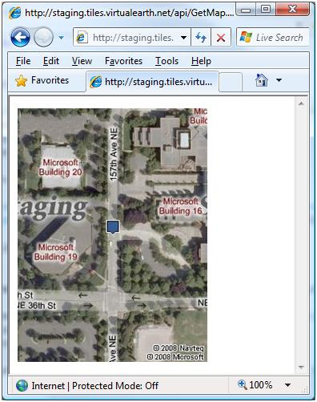

# Developing a Mobile Application Using Bing Maps SOAP Services
The new set of [!INCLUDE[vews_product_name](../articles/includes/vews-product-name-md.md)] gives the user the ability to access the many tools of [!INCLUDE[ve_product_name](../articles/includes/ve-product-name-md.md)] from alternate applications such as desktops, servers and mobile devices. Additionally, the [!INCLUDE[vews_product_name](../articles/includes/vews-product-name-md.md)] provide a simple mechanism for mobile applications to geocode locations, reverse geocode, get maps and generate routes. This makes integration with Windows Mobile devices much easier. This article describes how to build and test a Windows Mobile enabled web application that leverages [!INCLUDE[vews_product_name](../articles/includes/vews-product-name-md.md)].  
  
## Overview  
 The constraints of mobile device applications are very different than the traditional web or desktop applications. Unlike a desktop or web application, the screen real estate is very compact and the controls are limited in functionality. These constraints force you to rethink your user experience. Simply building a form with a bunch of buttons isn’t very useful on most mobile devices. In addition, the occasionally connected nature of the device is problematic for any application that relies on web connectivity. Because you can’t guarantee whether the device will have or maintain a connection, the standard practice is to minimize the amount of network traffic expected. Similarly, network connections to mobile devices (even 3G) are slower and more bandwidth constrained than normal broadband. This puts an even larger emphasis on reducing network traffic.  
  
 Given these constraints, the first question about architecture involves how the application will be deployed and used. If you are building a consumer application for individual users, you want the entire application contained on the mobile device. However, if you are building for an enterprise, you might consider a three tier application where you can control the security of your credentials and your bandwidth on a server, and minimize the footprint of the mobile application. If you take the three tier approach, you also have to consider what the middle tier will be. You can use some sort of service (for example, build a WCF layer that encapsulates [!INCLUDE[ve_product_name](../articles/includes/ve-product-name-md.md)]) or build a mobile enabled web application. The choice of architecture depends heavily on how you intend to use the application and the constraints of your target devices.  
  
### Self Contained Application  
 The first architecture approach consists of accessing the [!INCLUDE[vews_product_name](../articles/includes/vews-product-name-md.md)] directly from a Windows Mobile application.  
  
   
  
 This is the least complicated solution, however there are many things to consider before going this route. Accessing the [!INCLUDE[vews_product_name](../articles/includes/vews-product-name-md.md)] directly requires the mobile device to process all the data that is returned from the web services, which in most cases results in slow performance. Another major consideration is that mobile networks are typically more expensive and slower than a standard internet connection. By accessing the [!INCLUDE[vews_product_name](../articles/includes/vews-product-name-md.md)] directly, all responses to service requests contain the full service response information. In most cases this is more information than you require. One final shortcoming is that by accessing the [!INCLUDE[vews_product_name](../articles/includes/vews-product-name-md.md)] directly, your [!INCLUDE[ve_product_name](../articles/includes/ve-product-name-md.md)] account credentials would be embedded into the mobile application that you would be distributing.  
  
### Multi-tier Application  
 The multi-tier solution consists of having a mobile device connect to a web service which connects to the [!INCLUDE[vews_product_name](../articles/includes/vews-product-name-md.md)] and processes the requests.  
  
   
  
 This method is a bit more complicated and requires you to have a server to host your web service. However, there are several benefits of this method. By creating a web service to access the [!INCLUDE[vews_product_name](../articles/includes/vews-product-name-md.md)], you can process the returned results from [!INCLUDE[ve_product_name](../articles/includes/ve-product-name-md.md)] and only pass the minimal information required to the mobile device. This significantly cuts down on the total amount of data that is transferred to the mobile device, which reduces the overall end user cost of using your application, increasing the performance. Similarly, you can create a temporary cache which can easily handle the case of the mobile device losing connection or having a weak signal.  
  
 By creating a web service your [!INCLUDE[ve_product_name](../articles/includes/ve-product-name-md.md)] credentials reside on your hosted server and not in the client’s application, thus creating a greater level of security. However, you do add complexity in that you have to develop, package, test and deploy a mobile application.  
  
### Multi-tier Web Application  
 The third architecture follows the same principles and gains many of the advantages of building a hosted Web service. However, building a mobile web application offers several other advantages, specifically:  
  
-   You can test the application without using a mobile device or emulator.  
  
-   You do not have to deploy anything to the mobile devices.  
  
-   Almost all mobile devices have browser capability.  
  
-   ASP.NET will automatically render the appropriate markup language for the device.  
  
 With the advances in mobile devices and the .NET Framework, you don’t even have to build a special mobile web application. As long as your web application uses standard components and avoids JavaScript, most mobile browsers will render it correctly.  
  
## The Application  
 This article focuses on implementing the third solution as it offers more benefits and is easier to implement than either of the other solutions. However, most of the code is easily convertible into a self-contained application or a hosted set of services if you choose to follow either of those architectures instead.  
  
 Because the sample only requires a browser on a mobile device, the code is similar to other [!INCLUDE[vews_product_name](../articles/includes/vews-product-name-md.md)] samples outlined in the following articles:  
  
-   [Developing a .NET Application Using Bing Maps SOAP Services](../articles/developing-a-net-application-using-bing-maps-soap-services.md)  
  
-   [Developing a Silverlight Application Using Bing Maps SOAP Services](../articles/developing-a-silverlight-application-using-bing-maps-soap-services.md)  
  
 Rather than demonstrate every [!INCLUDE[vews_product_name](../articles/includes/vews-product-name-md.md)] method, the application developed in this article focuses on solving the most common mobile device user scenario: providing a simple mechanism to retrieve a map showing the user’s current location, or the location of any address.  
  
## Setup  
 The examples in this article require a single Web Application project. However, you will also want to set up an emulator to test the application. The emulator portion is covered in the second half of this article.  
  
### Prerequisites  
 The following are required to perform the steps in this article:  
  
1.  A [!INCLUDE[ve_platform_name](../articles/includes/ve-platform-name-md.md)] key. You can sign up for a free [!INCLUDE[ve_platform_name](../articles/includes/ve-platform-name-md.md)] Developer Account and obtain [!INCLUDE[ve_platform_name](../articles/includes/ve-platform-name-md.md)] keys at the [Bing Maps Account Center](https://www.bingmapsportal.com) site. For more information, see [Accessing the Bing Maps SOAP Services](../Topic/Accessing%20the%20Bing%20Maps%20SOAP%20Services.md).  
  
2.  [Visual Studio](http://www.microsoft.com/visualstudio/en-us/default.mspx)  
  
    > [!NOTE]
    >  If you wish to use Visual Studio 2005, you will have to install and configure a device emulator and Microsoft ActiveSync.  
  
3.  [Windows Mobile Device Center](http://www.microsoft.com/windowsmobile/en-us/downloads/microsoft/device-center-download.mspx)  
  
4.  Internet Information Services (IIS) and ASP.NET under IIS must be installed on your computer. For information on how to install ISS, see [How to: Enable Internet Information Services (IIS)](http://msdn.microsoft.com/en-us/library/ms181052\(VS.80\).aspx).  
  
 The code in this article was created on a Windows Vista machine, using Visual Studio 2008 Professional. There may be slight variations for other operating systems and development environments.  
  
### Creating the Website Project  
 To get started:  
  
1.  Open Visual Studio 2008.  
  
2.  From the main menu select **File**, and then **New Web Site**.  
  
3.  In the **New Web Site** dialog, select the **ASP.NET Web Site** template.  
  
4.  Change the name of the project to *VEMobile* as shown below.  
  
       
  
5.  Click **OK** to create the Web site project.  
  
 Your project is created with a single Default.aspx page. You will use this page to allow the user to submit an address.  
  
## Creating the Web Application  
 The web application encapsulates all of the calls to the [!INCLUDE[vews_product_name](../articles/includes/vews-product-name-md.md)]. Each exposed web page uses a compact layout based on the most commonly used mobile friendly controls. Using this approach, you can tune the server side component to cache and filter any of the information necessary to make the web application as efficient as possible for mobile devices.  
  
### Obtaining a Bing Maps Key  
 To use the [!INCLUDE[ve_product_name](../articles/includes/ve-product-name-md.md)] web services, you will need one or more [!INCLUDE[ve_platform_name](../articles/includes/ve-platform-name-md.md)] keys. You can sign up for a free [!INCLUDE[ve_platform_name](../articles/includes/ve-platform-name-md.md)] Developer Account and obtain [!INCLUDE[ve_platform_name](../articles/includes/ve-platform-name-md.md)] keys at the [Bing Maps Account Center](https://www.bingmapsportal.com) site. For more information, see [Accessing the Bing Maps Web Services](http://msdn.microsoft.com/en-us/library/cc980855.aspx).  
  
### Referencing the [!INCLUDE[vews_product_name](../articles/includes/vews-product-name-md.md)]  
 To use the [!INCLUDE[vews_product_name](../articles/includes/vews-product-name-md.md)] web services, you need to add service references.  
  
 You will add four services. To add each service:  
  
1.  Right click on the References folder in the VEMobile project and select **Add Service Reference**.  
  
2.  Copy the service URL from the following table into the **Address** text box and then press the **Go** button.  
  
    |Namespace|URL|  
    |---------------|---------|  
    |GeocodeService|[http://dev.virtualearth.net/webservices/v1/geocodeservice/geocodeservice.svc?wsdl](http://dev.virtualearth.net/webservices/v1/geocodeservice/geocodeservice.svc?wsdl)|  
    |SearchService|[http://dev.virtualearth.net/webservices/v1/searchservice/searchservice.svc?wsdl](http://dev.virtualearth.net/webservices/v1/searchservice/searchservice.svc?wsdl)|  
    |ImageryService|[http://dev.virtualearth.net/webservices/v1/imageryservice/imageryservice.svc?wsdl](http://dev.virtualearth.net/webservices/v1/imageryservice/imageryservice.svc?wsdl)|  
    |RouteService|[http://dev.virtualearth.net/webservices/v1/routeservice/routeservice.svc?wsdl](http://dev.virtualearth.net/webservices/v1/routeservice/routeservice.svc?wsdl)|  
  
3.  Enter the corresponding Namespace name from the table in the **Namespace** field and then press the **OK** button.  
  
4.  Repeat steps 1-3 for each of the services listed in the table.  
  
5.  You now have to reference these services in the various web pages you create.  
  
6.  Add the following code to the top of the Default.aspx.cs file:  
  
    ```  
    using GeocodeService;  
    using SearchService;  
    using ImageryService;  
    using RouteService;  
    ```  
  
 The default response size for these services is 65536 bytes. This may not be enough large enough for search service results. If the message size is too small for the data, you will see error messages rather than receiving results. If you wish to increase the response message size:  
  
1.  Open web.config.  
  
2.  Look for a `<binding>` tag where the name attribute is `BasicHttpBinding_ISearchService`.  
  
3.  Change the value of the `maxBufferSize` and `maxRecievedMessageSize` attributes to 500000.  
  
### Internal Methods  
 To make your code more efficient, create some methods that are commonly used in your web project. The first method geocodes an address and the second method retrieves a map URI. These methods will be added to the Default.aspx.cs file.  
  
#### Geocode an Address  
 The method that geocodes an address takes an address string and returns a Location object. If no results are found, `null` is returned. You will also add a confidence filter so that only results with a high confidence are returned.  
  
 To create the GeocodeAddress method:  
  
1.  Open Default.aspx.cs.  
  
2.  Copy the following method into the file and replace *BingMapsKey* with your Bing Maps key:  
  
    ```  
    private GeocodeService.Location GeocodeAddress(string address)  
    {  
        GeocodeRequest geocodeRequest = new GeocodeRequest();  
  
        // Set the credentials using a valid Bing Maps Key  
        geocodeRequest.Credentials = new GeocodeService.Credentials();  
        geocodeRequest.Credentials.ApplicationId = BingMapsKey;  
  
        // Set the full address query  
        geocodeRequest.Query = address;  
  
        // Set the options to only return high confidence results   
        ConfidenceFilter[] filters = new ConfidenceFilter[1];  
        filters[0] = new ConfidenceFilter();  
        filters[0].MinimumConfidence = GeocodeService.Confidence.High;  
  
        GeocodeOptions geocodeOptions = new GeocodeOptions();  
        geocodeOptions.Filters = filters;  
  
        geocodeRequest.Options = geocodeOptions;  
  
        // Make the geocode request  
        GeocodeServiceClient geocodeService = new GeocodeServiceClient("BasicHttpBinding_IGeocodeService");  
  
        GeocodeResponse geocodeResponse = geocodeService.Geocode(geocodeRequest);  
  
        if (geocodeResponse.Results.Length > 0)  
            if (geocodeResponse.Results[0].Locations.Length > 0)  
                return geocodeResponse.Results[0].Locations[0];  
  
        return null;  
    }  
    ```  
  
#### Return a Map  
 The second method returns a map URI. This method takes latitude and longitude coordinates, a zoom level, and the width and height of the image to be returned. This method also places a pushpin on the latitude, longitude coordinate that is specified. And to make this method more dynamic, it takes a map style in the form of a string, which specifies the type of map to return. The map styles that can be used are “Road”, “Aerial”, and “Hybrid”.  
  
 To create the GetMapUri method:  
  
1.  Open Default.aspx.cs.  
  
2.  Copy the following method into the file replacing *BingMapsKey* with your Bing Maps Key:  
  
    ```  
    private string GetMapUri(double latitude, double longitude, int zoom, string mapStyle, int width, int height)  
    {  
        ImageryService.Pushpin[] pins = new ImageryService.Pushpin[1];  
        ImageryService.Pushpin pushpin = new ImageryService.Pushpin();  
        pushpin.Location = new ImageryService.Location();  
        pushpin.Location.Latitude = latitude;  
        pushpin.Location.Longitude = longitude;  
        pushpin.IconStyle = "2";  
  
        pins[0] = pushpin;  
  
        MapUriRequest mapUriRequest = new MapUriRequest();  
  
        // Set credentials using a valid Bing Maps Key  
        mapUriRequest.Credentials = new ImageryService.Credentials();  
        mapUriRequest.Credentials.ApplicationId = BingMapsKey;  
  
        // Set the location of the requested image  
        mapUriRequest.Pushpins = pins;  
  
        // Set the map style and zoom level  
        MapUriOptions mapUriOptions = new MapUriOptions();  
  
        switch (mapStyle.ToUpper())  
        {  
            case "HYBRID":  
                mapUriOptions.Style = ImageryService.MapStyle.AerialWithLabels;  
                break;  
            case "ROAD":  
                mapUriOptions.Style = ImageryService.MapStyle.Road;  
                break;  
            case "AERIAL":  
                mapUriOptions.Style = ImageryService.MapStyle.Aerial;  
                break;  
            default:  
                mapUriOptions.Style = ImageryService.MapStyle.Road;  
                break;  
        }  
  
        mapUriOptions.ZoomLevel = zoom;  
  
        // Set the size of the requested image to match the size of the image control  
        mapUriOptions.ImageSize = new ImageryService.SizeOfint();  
        mapUriOptions.ImageSize.Height = height;  
        mapUriOptions.ImageSize.Width = width;  
  
        mapUriRequest.Options = mapUriOptions;  
  
        ImageryServiceClient imageryService = new ImageryServiceClient("BasicHttpBinding_IImageryService");  
        MapUriResponse mapUriResponse = imageryService.GetMapUri(mapUriRequest);  
  
        return mapUriResponse.Uri;  
    }  
    ```  
  
### Public Web Methods  
 The web application consists of a form that allows the user to enter a street address and request a map. The application then displays the map with a pushpin at the requested location.  
  
#### Creating the Method  
 In order for your default page to be able to return a map URI of an address you need to do the following:  
  
-   Geocode the address.  
  
-   Request a map URI for the geocoded location.  
  
 Since this method generates a map, you need to get a zoom level, a map style, and the dimensions of the map image that will be returned.  
  
 To create the MapAddress method:  
  
1.  Open Default.aspx.cs.  
  
2.  Copy the following method into the file:  
  
    ```  
    private string MapAddress(string address, int zoom, string mapStyle, int width, int height)  
    {  
        GeocodeService.Location latlong = GeocodeAddress(address);  
        double latitude = latlong.Latitude;  
        double longitude = latlong.Longitude;  
  
        return GetMapUri(latitude, longitude, zoom, mapStyle, width, height);  
    }  
    ```  
  
#### Creating the Form  
 The next step is to create the form which allows the user to enter the address. This example assumes a screen resolution of 240x320, as it is one of the most popular resolutions. Therefore, all controls and result information must fit in a portrait area no more than 240 pixels wide and 320 pixels high.  
  
 The Default.aspx page already contains a form element. To put content in the form, open the Default.aspx file in Source view and copy the following code into the `<div>` tag of the form  
  
```  
<asp:Label runat="server" Text="Enter Address"></asp:Label>:  
  <br />  
  <br />  
<asp:TextBox runat="server" ID="TextAddress" Width="240"></asp:TextBox>  
  <br />  
  <br />  
<asp:LinkButton runat="server" Text="Find Location" ID="LinkSearch"></asp:LinkButton>  
  
```  
  
 When you have added this content to the form, it should look similar to this in Design view:  
  
   
  
#### Wiring the Controls  
 The last step is to wire up the link button to execute the methods required to generate the image.  
  
1.  In Design view, double click on the link button to open up the LinkSearch_Click method.  
  
2.  Add the following code to the method:  
  
```  
protected void LinkSearch_Click(object sender, EventArgs e)  
{  
  String result = MapAddress(TextAddress.Text, 17, "HYBRID", 240, 320);  
  Response.Redirect(result);  
}  
```  
  
 Note that the map zoom (level 17), style and size are all specified in this method. If you wish to change any of these parameters, you can add more controls to the form or set different default settings here.  
  
### Testing the Application  
 You can test the application in the web host built into Visual Studio:  
  
1.  Save your project.  
  
2.  Press F5 to start the application. You should see the simple form:  
  
       
  
3.  Enter *1 Microsoft Way, Redmond, WA* into the address field and click the **Find Location** link. The results should appear similar to the following:  
  
       
  
### Configuring and Deploying the Website  
 Although you have built and tested the website on a local server, you should also test it on an emulator. However, the local host inside Visual Studio does not allow connections from outside devices. Therefore, you have to deploy your website to an IIS server in order to connect from a mobile device or emulator.  
  
 To deploy your application:  
  
1.  Right click on the solution in the solution explorer and select **Publish Web Site**.  
  
2.  In the Publish Web Site wizard, choose a path for your final compiled site. This example uses C:\VEMobile.  
  
       
  
3.  Click **OK**.  
  
4.  Start IIS Manager.  
  
5.  Add a New Virtual Directory with the Alias set to VEMobile and the path pointing to your export path from Visual Studio that you entered in step 2..  
  
       
  
6.  Press **OK**.  
  
7.  Right click on your new Virtual Directory and select **Convert to Application**.  
  
       
  
8.  Press **OK**.  
  
9. Double-click the Authentication link in the IIS section.  
  
       
  
10. Verify that **Anonymous Authentication** is **enabled**.  
  
       
  
11. Test the application by opening up an Internet Explorer browser and navigating to http://localhost/vemobile/default.aspx.  
  
### Testing the Application on an Emulator  
 Once your website is properly hosted, the next task is to set up your emulator and connect to the site.  
  
#### Connect and Dock your Emulator  
 To set up your emulator:  
  
1.  Select **Tools** on the main menu of Visual Studio.  
  
2.  Select **Device Emulator Manager**.  
  
3.  Scroll down until you see the emulator you are using.  
  
4.  Right click on your emulator.  
  
5.  Select **Connect**. This opens an emulator window.  
  
       
  
6.  In the Device Emulator Manager, right click on your emulator.  
  
7.  Select **Cradle**.  
  
       
  
 Visual Studio is now able to sync with the Windows mobile device emulator.  
  
#### Configuring Emulator Connections  
 In order for your emulator to connect to the Web, you have to use Windows Mobile Device Center (or ActiveSync if you are on Windows XP) to configure the connection mode.  
  
1.  Start the Windows Mobile Device Center from your control panel.  
  
2.  If your emulator is connected and cradled, you should see options for setting up your device:  
  
       
  
3.  Click **Connect** without setting up your device.  
  
4.  Click on **Mobile Device Settings** and then **Connection Settings**.  
  
5.  Make sure the following settings are configured:  
  
    -   **Allow USB connections** should be checked  
  
    -   **Allow connections to one of the following**: should be checked and set to **DMA**.  
  
    -   **Allow data connections on device when connected to PC** should be checked.  
  
       
  
6.  Click **OK** and then close Windows Mobile Device Center.  
  
7.  Test the device by using the built in Internet Explorer application to connect to a public site (for example, [!INCLUDE[winlive_name](../articles/includes/winlive-name-md.md)]).  
  
       
  
#### Testing the Application  
 Test your application in your mobile device emulator by opening up the browser and pointing to your local installation of the VEMobile web application.  
  
1.  From the home menu, select **Start** and then **Internet Explorer**.  
  
2.  Click on the **Menu** button and then select **Address Bar**.  
  
3.  Type in http://\<your computer IP address>/vemobile. Unfortunately, you cannot simply point to localhost as that resolves to your mobile emulator rather than your local machine.  
  
       
  
4.  Press Go.  
  
5.  After the page loads, type a location into the address field of your mobile web page.  
  
       
  
6.  Click on the **Find Location** link.  
  
7.  You may see a security alert asking if you want to allow a post to the web.  Click **Yes**.  
  
8.  Your results should appear similar to the following figure:  
  
       
  
## Conclusion  
 The combination of [!INCLUDE[ve_product_name](../articles/includes/ve-product-name-md.md)] with Windows Mobile offers the ability to not only search for points of interest and get directions between points but also the ability to display high quality maps. If you were to expand upon this code in the article you could easily reference your own geospatial data and give the user the ability to search for, map, and get directions to your locations.  
  
 This article was written by Richard Brundritt and Robert McGovern. Both Richard and Rob work for Infusion Development.  
  
## See Also  
 [Bing Maps Web Services SDK](http://msdn.microsoft.com/en-us/library/cc980922.aspx)