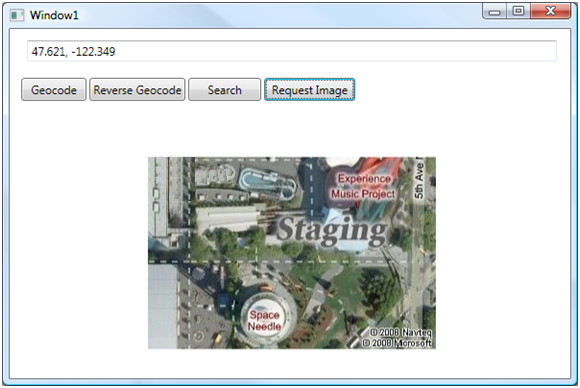

# Developing a .NET Application Using Bing Maps SOAP Services
The [!INCLUDE[vemc_product_name](../articles/includes/vemc-product-name-md.md)] provides an ideal AJAX enabled component for developing web applications.  However, if your business requirements indicate that you need to build a desktop application, you can use the new [!INCLUDE[vews_product_name](../articles/includes/vews-product-name-md.md)]. This article demonstrates using the Geocode, Imagery, Route, and Search services of the [!INCLUDE[vews_product_name](../articles/includes/vews-product-name-md.md)] in a desktop application, using Windows Presentation Foundation (WPF) and C#.  
  
## Requirements  
 The application described in this article is a simple C# Windows Presentation Framework (WPF) application.  
  
 In order to build the code in this article, you need the following:  
  
-   [Microsoft Visual Studio 2008](http://msdn.microsoft.com/en-us/vs2008/products/cc268305.aspx)  
  
-   [!INCLUDE[ve_platform_name](../articles/includes/ve-platform-name-md.md)] Developer Account credentials. You can sign up for a free developer account at the [Bing Maps Account Center](https://www.bingmapsportal.com).  
  
-   .NET 3.0 framework  
  
 Because this application leverages WPF instead of classic Windows Forms components, you may wish to review WPF programming on MSDN [here](http://msdn.microsoft.com/en-us/library/ms752299.aspx). However, you do not need to be a WPF expert to continue.  
  
## Creating the Project  
 The base project is a standard C# Windows Presentation Framework application:  
  
1.  Open Visual Studio  
  
2.  Select **New** and then **Project**.  
  
3.  In the New Project window, select **Windows** and then the WPF Application template.  
  
4.  Name your project `BingMapsSample` and then click **OK**.  
  
 By default, a Window1.xaml file (the display page) and a Window1.xaml.cs file (the code-behind page) are created.  
  
## Creating a Bing Maps Key  
 The [!INCLUDE[vews_product_name](../articles/includes/vews-product-name-md.md)] require that you have a Bing maps key to make requests. You can create a key when you sign into your account at [Bing Maps Account Center](https://www.bingmapsportal.com). For more information about creating a key, see [Accessing the Bing Maps SOAP Services](../Topic/Accessing%20the%20Bing%20Maps%20SOAP%20Services.md)  
  
## Creating GUI Components  
 The samples in this article use the WPF [TextBox](http://msdn.microsoft.com/en-us/library/ms743481.aspx), [Label](http://msdn.microsoft.com/en-us/library/ms743463.aspx), [Image](http://msdn.microsoft.com/en-us/library/ms746717.aspx) and [Button](http://msdn.microsoft.com/en-us/library/ms752065.aspx) controls. To set up the TextBox, Label and Image controls:  
  
1.  Expand Window1 so that it is 600 pixels wide and 700 pixels tall.  
  
2.  Add a TextBox control to the top of your window.  
  
3.  Name the text box “textInput”.  
  
4.  Leave space for a row of buttons and then add a Label control to your window that covers the remaining area of the window.  
  
5.  Name the Label control “labelResults”.  
  
6.  Create an Image control.  
  
7.  Name the Image control “imageResults”.  
  
8.  Make the Image control the same size as the label and place it in the same location as the label so that they cover the same area.  
  
9. Change the Visibility property on the Image control to “Hidden”.  
  
10. Change the Stretch property on the Image control to “None”.  
  
11. Your window should look similar to Figure 2. Note that the Image control is not visible and is only used for the imagery service examples. The Label control is used for all other examples.  
  
   
  
## Referencing the [!INCLUDE[vews_product_name](../articles/includes/vews-product-name-md.md)]  
 The last part of the setup process involves creating proxy classes that reference the [!INCLUDE[vews_product_name](../articles/includes/vews-product-name-md.md)]. To do this you need to set up service references which provide the geocoding, mapping and search features. These are added as Windows Communication Foundation (WCF) services and Visual Studio builds proxy files for the project.  
  
 You need to add four services. For each service:  
  
1.  Right click on the **Service References** folder in the BingMapsSample project and select **Add Service Reference**.  
  
2.  Copy the URL from the following table into the **Address** field and then click **Go**.  
  
    |Namespace|Address|  
    |---------------|-------------|  
    |GeocodeService|[http://dev.virtualearth.net/webservices/v1/geocodeservice/geocodeservice.svc?wsdl](http://dev.virtualearth.net/webservices/v1/geocodeservice/geocodeservice.svc?wsdl)|  
    |SearchService|[http://dev.virtualearth.net/webservices/v1/searchservice/searchservice.svc?wsdl](http://dev.virtualearth.net/webservices/v1/searchservice/searchservice.svc?wsdl)|  
    |ImageryService|[http://dev.virtualearth.net/webservices/v1/imageryservice/imageryservice.svc?wsdl](http://dev.virtualearth.net/webservices/v1/imageryservice/imageryservice.svc?wsdl)|  
    |RouteService|[http://dev.virtualearth.net/webservices/v1/routeservice/routeservice.svc?wsdl](http://dev.virtualearth.net/webservices/v1/routeservice/routeservice.svc?wsdl)|  
  
3.  Enter the corresponding service name in the **Namespace** field and then click **OK**.  
  
4.  Repeat steps 1-3 for each of the services listed in the table.  
  
5.  Add the following code to the top of the Window1.xaml.cs file to reference the services:  
  
```  
using BingMapsSample.GeocodeService;  
using BingMapsSample.SearchService;  
using BingMapsSample.ImageryService;  
using BingMapsSample.RouteService;  
```  
  
## Basic Architecture  
 In the remainder of the article, you will build buttons to make requests to each service. The basic process is:  
  
1.  Write a method to perform the desired operation (e.g. geocode an address) and display the result in the results label.  
  
2.  Add a button to Window1.xaml.cs.  
  
3.  Modify the button’s event handler so that it executes the method you created in the first step.  
  
## The Geocode Service  
 The Geocode Service offers methods to geocode addresses and reverse geocode locations. The examples below demonstrate how to operate on the value in a text box and display the geocoding results in a label.  
  
### Geocode  
 The `Geocode` method requires the creation of a `GeocodeRequest` object. The object contains your credentials, the address to geocode, and a variety of options on how to geocode.  
  
#### Creating the Method  
 In this example, you use a simple set of options to geocode an unparsed address. The “High Confidence” filter limits the result sets to the best match. Other filters return more results or filter on additional criteria.  
  
 To create the method:  
  
1.  Open Window1.xaml.cs  
  
2.  Create a new method called GeocodeAddress.  
  
3.  Copy the following code into your method and set the string variable key your Bing Maps key value:  
  
```  
private String GeocodeAddress(string address)  
{  
    string results = "";  
    string key = "insert your Bing Maps key here";  
    GeocodeRequest geocodeRequest = new GeocodeRequest();  
  
    // Set the credentials using a valid Bing Maps key  
    geocodeRequest.Credentials = new GeocodeService.Credentials();  
    geocodeRequest.Credentials.ApplicationId = key;  
  
    // Set the full address query  
    geocodeRequest.Query = address;  
  
    // Set the options to only return high confidence results   
    ConfidenceFilter[] filters = new ConfidenceFilter[1];  
    filters[0] = new ConfidenceFilter();  
    filters[0].MinimumConfidence = GeocodeService.Confidence.High;  
  
    // Add the filters to the options  
    GeocodeOptions geocodeOptions = new GeocodeOptions();  
    geocodeOptions.Filters = filters;  
    geocodeRequest.Options = geocodeOptions;  
  
    // Make the geocode request  
    GeocodeServiceClient geocodeService = new GeocodeServiceClient();  
    GeocodeResponse geocodeResponse = geocodeService.Geocode(geocodeRequest);  
  
    if (geocodeResponse.Results.Length > 0)  
        results = String.Format("Latitude: {0}\nLongitude: {1}",   
          geocodeResponse.Results[0].Locations[0].Latitude,   
          geocodeResponse.Results[0].Locations[0].Longitude);  
    else  
        results = "No Results Found";  
  
    return results;  
}  
```  
  
#### Create the Button and Handler  
 Now that you have a method to geocode a string address, you need a way for the user to execute this method:  
  
1.  Add a button to Window1.xaml.cs. Put the button under the text box and above the label.  
  
2.  Change the content property of the button to “Geocode”.  
  
3.  Name the button “Geocode”.  
  
4.  Double click on the button to open up Window1.xaml.cs and create the Geocode_Click handler.  
  
5.  Copy the following code into Geocode_Click():  
  
```  
private void Geocode_Click(object sender, RoutedEventArgs e)  
{  
  labelResults.Content = GeocodeAddress(textInput.Text);  
}  
```  
  
#### Test the Method  
 To test the Geocode function:  
  
1.  Press F5 to start the application.  
  
2.  Type “1 Microsoft Way, Redmond, WA” into the input textbox.  
  
3.  Press the “Geocode” button.  
  
4.  You should see the following:  
  
   
  
### Reverse Geocode  
 The reverse geocode function is similar to the geocode function. In this example, assume that the user enters a comma separated latitude-longitude pair into the text box.  
  
#### Creating the Method  
 To create the method:  
  
1.  Open Window1.xaml.cs.  
  
2.  Create a new method called ReverseGeocodePoint.  
  
3.  Copy the following code into your method:  
  
```  
private string ReverseGeocodePoint(string locationString)  
{  
    string results = "";   
    string key = "insert your Bing Maps key here";  
        ReverseGeocodeRequest reverseGeocodeRequest = new ReverseGeocodeRequest();  
  
    // Set the credentials using a valid Bing Maps key  
    reverseGeocodeRequest.Credentials = new GeocodeService.Credentials();  
    reverseGeocodeRequest.Credentials.ApplicationId = key;  
  
    // Set the point to use to find a matching address  
    GeocodeService.Location point = new GeocodeService.Location();  
    string[] digits = locationString.Split(',');  
  
    point.Latitude = double.Parse(digits[0].Trim());  
    point.Longitude = double.Parse(digits[1].Trim());  
  
    reverseGeocodeRequest.Location = point;  
  
    // Make the reverse geocode request  
    GeocodeServiceClient geocodeService = new GeocodeServiceClient();  
    GeocodeResponse geocodeResponse = geocodeService.ReverseGeocode(reverseGeocodeRequest);  
  
    if (geocodeResponse.Results.Length > 0)  
        results = geocodeResponse.Results[0].DisplayName;  
    else  
        results = "No Results found";  
  
    return results;  
}  
```  
  
#### Create the Button and Handler  
 Now that you have a method to reverse geocode a point, you need a way for the user to execute this method:  
  
1.  Add a button to Window1.xaml.cs. Put the button next to the Geocode button.  
  
2.  Change the content property of the button to “Reverse Geocode”.  
  
3.  Name the button “ReverseGeocode”.  
  
4.  Double click on the button to open up Window1.xaml.cs and create the ReverseGeocode_Click handler.  
  
5.  Copy the following code into ReverseGeocode_Click():  
  
```  
private void ReverseGeocode_Click(object sender, RoutedEventArgs e)  
{  
  labelResults.Content = ReverseGeocodePoint(textInput.Text);  
}  
```  
  
#### Testing Reverse Geocoding  
 To test the Reverse Geocode function:  
  
1.  Press F5 to start the application.  
  
2.  Enter “47.608, -122.337” into the input textbox.  
  
    > [!NOTE]
    >  The ReverseGeocode method is sensitive to extra punctuation like extra commas or white space. To improve the code, add validation logic or create a multiple text boxes to contain the values.  
  
3.  Press the “Reverse Geocode” button.  
  
4.  You should see the following:  
  
   
  
## The Search Service  
  
### Search  
 The Search Service provides a single method that is very similar to the "what/where" component of the [!INCLUDE[vemc_product_name](../articles/includes/vemc-product-name-md.md)]. As with the Geocode Service, you need to create a request object that identifies your search terms and provides parameters for limiting the search. In this example, you will search for a keyword ("what") and a location ("where"). The user will enter the “what” and “where” values into the text box, separating the two pieces with a semi-colon. The results will be formatted as a list and displayed in the Label control.  
  
#### Creating the Method  
 To create the method for searching:  
  
1.  Open Window1.xaml.cs.  
  
2.  Create a new method called SearchKeywordLocation.  
  
3.  Copy the following code into your method:  
  
```  
private string SearchKeywordLocation(string keywordLocation)  
{  
    String results = "";  
    String key = "insert your Bing Maps key here";  
    SearchRequest searchRequest = new SearchRequest();  
  
    // Set the credentials using a valid Bing Maps key  
    searchRequest.Credentials = new SearchService.Credentials();  
    searchRequest.Credentials.ApplicationId = key;  
  
    //Create the search query  
    StructuredSearchQuery ssQuery = new StructuredSearchQuery();  
    string[] parts = keywordLocation.Split(';');  
    ssQuery.Keyword = parts[0];  
    ssQuery.Location = parts[1];  
    searchRequest.StructuredQuery = ssQuery;  
  
    //Define options on the search  
    searchRequest.SearchOptions = new SearchOptions();  
    searchRequest.SearchOptions.Filters =   
        new FilterExpression() { PropertyId = 3,   
            CompareOperator = CompareOperator.GreaterThanOrEquals, FilterValue = 8.16 };  
  
    //Make the search request   
    SearchServiceClient searchService = new SearchServiceClient();  
    SearchResponse searchResponse = searchService.Search(searchRequest);  
  
    //Parse and format results  
    if (searchResponse.ResultSets[0].Results.Length > 0)  
    {  
        StringBuilder resultList = new StringBuilder("");  
        for (int i = 0; i < searchResponse.ResultSets[0].Results.Length; i++)  
        {  
            resultList.Append(String.Format("{0}. {1}\n", i+1,   
                searchResponse.ResultSets[0].Results[i].Name));                      
        }  
  
        results = resultList.ToString();  
    }  
    else  
        results = "No results found";  
  
    return results;  
}  
```  
  
#### Create the Button and Handler  
 Now that you have a method to search for locations, you need a way for the user to execute this method:  
  
1.  Add a button to Window1.xaml.cs. Put the button next to the Reverse Geocode button.  
  
2.  Change the content property of the button to “Search”.  
  
3.  Name the button “Search”.  
  
4.  Double click on the button to open up Window1.xaml.cs and create the Search_Click handler.  
  
5.  Copy the following code into Search_Click():  
  
```  
private void Search_Click(object sender, RoutedEventArgs e)  
{  
  labelResults.Content = SearchKeywordLocation(textInput.Text);  
}  
```  
  
#### Testing Search  
 To test the Search function:  
  
1.  Press F5 to start the application.  
  
2.  Enter “sushi; Arvada, CO” into the input textbox. Note that any words added before the semi-colon count as search terms, and any words after the semi-colon are treated as an address.  In this example, the search looks for sushi restaurants near Arvada, Colorado, USA.  
  
3.  Press the “Search” button.  
  
4.  You should see the following:  
  
   
  
## The Imagery Service  
 The imagery service provides two methods. The first method allows you to retrieve map images in any of the standard [!INCLUDE[ve_product_name](../articles/includes/ve-product-name-md.md)] styles. The second method allows you to retrieve metadata related to a specific image.  
  
### Retrieving an Image  
 The Imagery service accepts a `MapUriRequest` object which defines the location, style, zoom level and image size.  Using the various options on the `MapUriOptions`, you can request any image available through [!INCLUDE[ve_product_name](../articles/includes/ve-product-name-md.md)].  
  
#### Creating the Method  
 To create the method for requesting an image:  
  
1.  Open Window1.xaml.cs.  
  
2.  Create a new method called GetImagery.  
  
3.  Copy the following code into your method:  
  
```  
private string GetImagery(string locationString)  
{    
     string key = "insert your Bing Maps key here";  
     MapUriRequest mapUriRequest = new MapUriRequest();  
  
    // Set credentials using a valid Bing Maps key  
    mapUriRequest.Credentials = new ImageryService.Credentials();  
    mapUriRequest.Credentials.ApplicationId = key;  
  
    // Set the location of the requested image  
    mapUriRequest.Center = new ImageryService.Location();  
    string[] digits = locationString.Split(',');  
    mapUriRequest.Center.Latitude = double.Parse(digits[0].Trim());  
    mapUriRequest.Center.Longitude = double.Parse(digits[1].Trim());  
  
    // Set the map style and zoom level  
    MapUriOptions mapUriOptions = new MapUriOptions();  
    mapUriOptions.Style = MapStyle.AerialWithLabels;  
    mapUriOptions.ZoomLevel = 17;  
  
    // Set the size of the requested image in pixels  
    mapUriOptions.ImageSize = new ImageryService.SizeOfint();  
    mapUriOptions.ImageSize.Height = 200;  
    mapUriOptions.ImageSize.Width = 300;  
  
    mapUriRequest.Options = mapUriOptions;  
  
    //Make the request and return the URI  
    ImageryServiceClient imageryService = new ImageryServiceClient();  
    MapUriResponse mapUriResponse = imageryService.GetMapUri(mapUriRequest);  
    return mapUriResponse.Uri;  
}  
```  
  
#### Create the Button and Handler  
 The handler for requesting an image is slightly more complicated than previous handlers because you have to display the image in the imageResults control rather than just displaying text in the Label control.  
  
1.  Add a button to Window1.xaml.cs. Put the button next to the Search button.  
  
2.  Change the content property of the button to “Request Image”.  
  
3.  Name the button “RequestImage”.  
  
4.  Double click on the button to open up Window1.xaml.cs and create the RequestImage_Click handler.  
  
5.  Copy the following code into RequestImage_Click():  
  
```  
private void RequestImage_Click(object sender, RoutedEventArgs e)  
{  
    // Make label hidden and image visible  
    labelResults.Visibility = Visibility.Hidden;  
    imageResults.Visibility = Visibility.Visible;  
  
    //Get URI and set image  
    String imageURI = GetImagery(textInput.Text);  
    imageResults.Source = new BitmapImage(new Uri(imageURI));  
}  
```  
  
#### Testing Imagery Retrieval  
 To test the Get Image function:  
  
1.  Press F5 to start the application.  
  
2.  Enter “47.621, -122.349” into the text box.  
  
3.  Press the “Request Image” button.  
  
4.  You should see an image of the Space Needle and Experience Music Project:  
  
   
  
### Retrieving Imagery Metadata  
 Each image tile is tagged with a variety of metadata, including the vintage (when the image was acquired), the data provider and the zoom range supported by the image.  If you need access to this information, you can use the Imagery Service to make the request using a similar request object as demonstrated with the Request Image button. Note that not all metadata will be available for every image, so you should check the results before attempting to display all of the metadata fields.  
  
#### Creating the Method  
 To create the method for metadata:  
  
1.  Open Window1.xaml.cs.  
  
2.  Create a new method called RequestImageMetadata.  
  
3.  Copy the following code into your method:  
  
```  
private string RequestImageMetadata(string locationString)  
{  
    string results = "";  
    string key = "insert your Bing Maps key here";  
  
    ImageryMetadataRequest metadataRequest = new ImageryMetadataRequest();  
  
    // Set credentials using a valid Bing Maps key  
    metadataRequest.Credentials = new ImageryService.Credentials();  
    metadataRequest.Credentials.ApplicationId =key;  
  
    // Set the imagery metadata request options  
    ImageryService.Location centerLocation = new ImageryService.Location();  
    string[] digits = locationString.Split(',');  
    centerLocation.Latitude = double.Parse(digits[0].Trim());  
    centerLocation.Longitude = double.Parse(digits[1].Trim());  
  
    metadataRequest.Options = new ImageryMetadataOptions();  
    metadataRequest.Options.Location = centerLocation;  
    metadataRequest.Options.ZoomLevel = 10;  
    metadataRequest.Style = MapStyle.AerialWithLabels;  
  
    // Make the imagery metadata request   
    ImageryServiceClient imageryService = new ImageryServiceClient();  
    ImageryMetadataResponse metadataResponse =   
      imageryService.GetImageryMetadata(metadataRequest);  
  
    ImageryMetadataResult result = metadataResponse.Results[0];  
    if (metadataResponse.Results.Length > 0)  
        results = String.Format("Uri: {0}\nVintage: {1} to {2}\nZoom Levels: {3} to {4}",  
            result.ImageUri,   
            result.Vintage.From.ToString(),  
            result.Vintage.To.ToString(),  
            result.ZoomRange.From.ToString(),  
            result.ZoomRange.To.ToString());  
    else  
        results = "Metadata is not available";  
    return results;  
}  
```  
  
#### Create the Button and Handler  
 The handler that gets image metadata is similar to the other text based result handlers.  
  
1.  Add a button to Window1.xaml.cs. Put the button next to the Request Image button.  
  
2.  Change the content property of the button to “Request Metadata”.  
  
3.  Name the button “RequestMetadata”.  
  
4.  Double click on the button to open up Window1.xaml.cs and create the RequestMetadata_Click handler.  
  
 5.  Copy the following code into RequestMetadata _Click():  
  
```  
private void RequestMetadata_Click(object sender, RoutedEventArgs e)  
{  
    labelResults.Content = RequestImageMetadata(textInput.Text);   
}  
```  
  
#### Testing Imagery Metadata  
 To test the metadata function:  
  
1.  Press F5 to start the application.  
  
2.  Enter “47.608, -122.337” into the text box.  
  
3.  Press the “Request Metadata” button.  
  
4.  You should see the following data:  
  
   
  
## The Route Service  
 The Route Service provides methods for calculating a route between points, and calculating directions to a point of interest from each of the cardinal directions.  
  
### Calculate Route  
 The Route Service can calculate a route between waypoints. As with the other services, you need to start by creating a request object. A `RouteRequest` object includes the array of waypoints to route between and options on how to calculate the route. The result object contains a set of step by step instructions.  
  
#### Creating the Method  
 The CalculateRoute method returns a fairly complex object. The response contains an array of `RouteLeg` objects representing each leg, where a leg is the path between two waypoints. Each leg contains an array of `ItineraryItem` objects which contain the actual instructions, plus other data such as the direction and nature of the instruction.  
  
 The text field of each instruction contains special XML-style markup surrounding key words such as instruction (turn, stop, merge) and road names. Although you may want to use this markup for highlighting the text, in this example you will use regular expressions to strip out the markup.  
  
 To create the method for generating a route:  
  
1.  Open Window1.xaml.cs  
  
2.  Add the following to the top of window1.xaml.cs:  
  
    ```  
    using System.Text.RegularExpressions;  
  
    ```  
  
3.  Create a new method called CreateRoute.  
  
4.  Copy the following code into your method:  
  
```  
private string CreateRoute(string waypointString)  
{  
    string results = "";  
    string key = "insert your Bing Maps key here";  
    RouteRequest routeRequest = new RouteRequest();  
  
    // Set the credentials using a valid Bing Maps key  
    routeRequest.Credentials = new RoutingService.Credentials();  
    routeRequest.Credentials.ApplicationId = key;  
  
    //Parse user data to create array of waypoints  
    string[] points = waypointString.Split(';');  
    Waypoint[] waypoints = new Waypoint[points.Length];  
  
    int pointIndex = -1;  
    foreach (string point in points)  
    {  
        pointIndex++;  
        waypoints[pointIndex] = new Waypoint();  
        string[] digits = point.Split(',');        waypoints[pointIndex].Location = new RouteService.Location();  
        waypoints[pointIndex].Location.Latitude = double.Parse(digits[0].Trim());  
        waypoints[pointIndex].Location.Longitude = double.Parse(digits[1].Trim());  
  
        if (pointIndex==0)   
            waypoints[pointIndex].Description = "Start";  
        else if (pointIndex==points.Length)  
            waypoints[pointIndex].Description = "End";  
        else   
            waypoints[pointIndex].Description = string.Format("Stop #{0}", pointIndex);  
    }  
  
    routeRequest.Waypoints = waypoints;  
  
    // Make the calculate route request  
    RouteServiceClient routeService = new RouteServiceClient();  
    RouteResponse routeResponse = routeService.CalculateRoute(routeRequest);  
  
    // Iterate through each itinerary item to get the route directions  
    StringBuilder directions = new StringBuilder("");  
  
    if (routeResponse.Result.Legs.Length > 0)  
    {  
        int instructionCount = 0;   
        int legCount = 0;  
  
        foreach (RouteLeg leg in routeResponse.Result.Legs)  
        {  
            legCount++;  
            directions.Append(string.Format("Leg #{0}\n", legCount));  
  
            foreach (ItineraryItem item in leg.Itinerary)  
            {  
                instructionCount++;  
                directions.Append(string.Format("{0}. {1}\n",   
                    instructionCount, item.Text));  
            }  
        }  
        //Remove all Bing Maps tags around keywords.    
        //If you wanted to format the results, you could use the tags  
        Regex regex = new Regex("<[/a-zA-Z:]*>",   
          RegexOptions.IgnoreCase | RegexOptions.Multiline);  
        results = regex.Replace(directions.ToString(), string.Empty);  
    }  
    else  
        results = "No Route found";  
  
    return results;  
}  
```  
  
#### Create the Button and Handler  
 The handler for Calculate Route is similar to the other text based result handlers.  
  
1.  Add a button to Window1.xaml.cs. Put the button next to the Request Metadata button.  
  
2.  Change the content property of the button to “Route”.  
  
3.  Name the button “Route”.  
  
4.  Double click on the button to open up Window1.xaml.cs and create the Route_Click handler.  
  
5.  Copy the following code into Route_Click():  
  
```  
private void Route_Click(object sender, RoutedEventArgs e)  
{  
    labelResults.Content = CreateRoute(textInput.Text);   
}  
```  
  
#### Testing Route  
 To test the Route function:  
  
1.  Press F5 to start the application.  
  
2.  Enter “43.89, -79.23; 43.89, -79.13; 43.89, -79.03” into the text box.  This sequence of points represents three locations in the Toronto area.  You can enter in any sequence of waypoints by providing semi-colon separated latitude/longitude pairs.  
  
3.  Press the “Route” button.  
  
4.  You should see the following directions:  
  
   
  
### Routing From Major Roads  
 In some cases, you may prefer generating a route from a major intersection to a target destination, rather than generating a true point to point route. For example, most major landmark websites show directions “coming from the North” or “coming from the West”. You can generate this style of instruction with the [!INCLUDE[ve_product_name](../articles/includes/ve-product-name-md.md)]`CalculateRoutesFromMajorRoads` method.  
  
#### Creating the Method  
 The major routes method returns another complex result object. The StartingPoints array contains the starting points for major routes. This array typically contains from zero to four points on major nearby roads. In addition, you may request that the method also return the calculated routes from these waypoints to the destination location. The following sample method takes advantage of both pieces of information to display the routes.  Once again, you will need to use Regular Expressions to strip out the [!INCLUDE[ve_product_name](../articles/includes/ve-product-name-md.md)] markup tags on the final instructions.  
  
 To create the method for getting nearby routes:  
  
1.  Open Window1.xaml.cs  
  
2.  Create a new method called CreateMajorRoutes.  
  
3.  Copy the following code into your method:  
  
```  
private string CreateMajorRoutes(string locationString)  
{  
    string results = "";  
    MajorRoutesRequest majorRoutesRequest = new MajorRoutesRequest();  
  
    // Set the credentials using a valid Bing Maps key  
    majorRoutesRequest.Credentials = new RouteService.Credentials();  
    majorRoutesRequest.Credentials.ApplicationId = key;  
  
    // Set the destination of the routes from major roads  
    Waypoint endPoint = new Waypoint();  
    endPoint.Location = new RouteService.Location();  
    string[] digits = locationString.Split(',');  
    endPoint.Location.Latitude = double.Parse(digits[0].Trim());  
    endPoint.Location.Longitude = double.Parse(digits[1].Trim());  
    endPoint.Description = "Location";  
  
    // Set the option to return full routes with directions  
    MajorRoutesOptions options = new MajorRoutesOptions();  
    options.ReturnRoutes = true;  
  
    majorRoutesRequest.Destination = endPoint;  
    majorRoutesRequest.Options = options;  
  
    // Make the route-from-major-roads request  
    RouteServiceClient routeService = new RouteServiceClient();  
  
    // The result is an MajorRoutesResponse Object  
    MajorRoutesResponse majorRoutesResponse = routeService.CalculateRoutesFromMajorRoads(majorRoutesRequest);  
  
    Regex regex = new Regex("<[/a-zA-Z:]*>",   
      RegexOptions.IgnoreCase | RegexOptions.Multiline);  
  
    if (majorRoutesResponse.StartingPoints.Length > 0)  
    {  
        StringBuilder directions = new StringBuilder();  
  
        for (int i = 0; i < majorRoutesResponse.StartingPoints.Length; i++)  
        {  
            directions.Append(String.Format("Coming from {1}\n", i+1,   
                majorRoutesResponse.StartingPoints[i].Description));  
  
            for (int j = 0;   
              j < majorRoutesResponse.Routes[i].Legs[0].Itinerary.Length; j++)  
            {  
                //Strip tags  
                string step = regex.Replace(  
                  majorRoutesResponse.Routes[i].Legs[0].Itinerary[j].Text, string.Empty);  
                directions.Append(String.Format("     {0}. {1}\n", j + 1, step));  
            }  
        }  
  
        results = directions.ToString();  
    }  
    else  
        results = "No Routes found";  
  
    return results;  
}  
```  
  
#### Create the Button and Handler  
 The handler for Major Routes is similar to the other text based result handlers.  
  
1.  Add a button to Window1.xaml.cs. Put the button under the Geocode button.  
  
2.  Change the content property of the button to “Major Routes”.  
  
3.  Name the button “MajorRoutes”.  
  
4.  Double click on the button to open up Window1.xaml.cs and create the MajorRoutes_Click handler.  
  
5.  Copy the following code into MajorRoutes_Click():  
  
```  
private void MajorRoutes_Click(object sender, RoutedEventArgs e)  
{  
    labelResults.Content = CreateMajorRoutes(textInput.Text);   
}  
```  
  
#### Testing Major Routes  
 To test the major routes function:  
  
1.  Press F5 to start the application.  
  
2.  Enter “32.09, -97.04” to find the major routes to the Dallas Fort Worth airport.  
  
3.  Press the “Major Routes” button.  
  
4.  You should see the following directions:  
  
   
  
 Notice that, in the case of the DFW airport, you can only approach from three directions, all of which eventually lead you to Cornelius Rd.  
  
## Conclusion  
 By leveraging the techniques illustrated in this article, you can take advantage of the [!INCLUDE[vews_product_name](../articles/includes/vews-product-name-md.md)] from any desktop application. As a next step, consider combining the individual examples here into more user friendly solutions. For example, you could build a search application that offers a “major routes” link for each returned result.  
  
 Although the examples in this article were focused on a WPF GUI experience, you could just as easily use the various services from an automated service, console application or traditional Windows Forms application. Similarly, you can leverage the same techniques from an ASP.NET application should you find a need to access [!INCLUDE[ve_product_name](../articles/includes/ve-product-name-md.md)] without the [!INCLUDE[vemc_product_name](../articles/includes/vemc-product-name-md.md)].  
  
 This article was written by Richard Brundritt and Robert McGovern. Both Richard and Rob work for Infusion Development.  
  
## See Also  
 [Bing Maps Web Services SDK, Version 1.0](http://msdn.microsoft.com/en-us/library/cc980922.aspx)