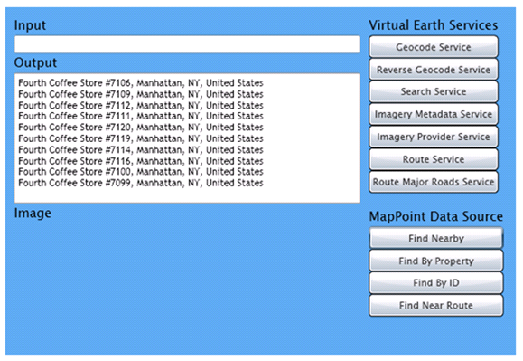

# Developing a Silverlight Application Using Bing Maps SOAP Services
Both Silverlight and [!INCLUDE[ve_product_name](../articles/includes/ve-product-name-md.md)] offer tremendous potential for creating rich and flexible web based user interfaces. The new [!INCLUDE[vews_product_name](../articles/includes/vews-product-name-md.md)] gives the user the ability to access the many tools of [!INCLUDE[ve_product_name](../articles/includes/ve-product-name-md.md)] from server side applications. This, in turn, makes integration with Silverlight much easier than before. With a few lines of code, you can geocode, reverse geocode, get maps and generate routes directly in Silverlight without having to work through the [!INCLUDE[ve_product_name](../articles/includes/ve-product-name-md.md)] JavaScript control. This article demonstrates how to build a Silverlight application that leverages the [!INCLUDE[vews_product_name](../articles/includes/vews-product-name-md.md)] and the legacy [!INCLUDE[mws_product_name](../articles/includes/mws-product-name-md.md)] custom point of interest data sets  
  
> [!NOTE]
>  This article does not use the Bing Maps Silverlight control. For an example of how to use the Silverlight control with the [!INCLUDE[vews_product_name](../articles/includes/vews-product-name-md.md)], see [Calculating a Route Using Bing Maps SOAP Services](http://msdn.microsoft.com/en-us/35919d71-7b7e-4877-888a-a92a1bc24243) in the [Silverlight Control SDK](http://msdn.microsoft.com/en-us/library/ee681884.aspx).  
  
## Requirements  
 To use the [!INCLUDE[vews_product_name](../articles/includes/vews-product-name-md.md)], you will need a [!INCLUDE[ve_platform_name](../articles/includes/ve-platform-name-md.md)] key. You can sign up for a [!INCLUDE[ve_platform_name](../articles/includes/ve-platform-name-md.md)] Developer Account and obtain [!INCLUDE[ve_platform_name](../articles/includes/ve-platform-name-md.md)] keys at the [Bing Maps Account Center](https://www.bingmapsportal.com) site. For more information, see [Accessing the Bing Maps Web Services](http://msdn.microsoft.com/en-us/library/cc980855.aspx).  
  
 To access the legacy [!INCLUDE[mws_product_name](../articles/includes/mws-product-name-md.md)] custom point of interest data sets, you will need to log in to the [Customer Services site](https://mappoint-css.live.com/cscv3) to obtain a [!INCLUDE[mws_product_name](../articles/includes/mws-product-name-md.md)] Account ID and Password. For more information about the [!INCLUDE[mws_product_name](../articles/includes/mws-product-name-md.md)], see [MapPoint Web Service SDK](http://msdn.microsoft.com/en-us/library/dd877971.aspx).  
  
 This article uses the following tools to develop the application:  
  
-   [Microsoft Visual Studio 2008](http://msdn.microsoft.com/en-us/vs2008/products/cc268305.aspx)  
  
-   [Microsoft Silverlight Tools for Visual Studio 2008](http://www.microsoft.com/downloads/details.aspx?familyid=9442B0F2-7465-417A-88F3-5E7B5409E9DD&displaylang=en)  
  
-   [Microsoft Expression Blend](http://www.microsoft.com/expression/)  
  
> [!NOTE]
>  The Silverlight Tools component automatically installs Silverlight if it is not already installed. Also note that you may encounter compatibility issues if you have an older version of Silverlight installed. Microsoft recommends that you uninstall any Silverlight runtime version or older version of the toolkit or Silverlight SDK before installing Silverlight Tools.  
  
 If you are new to Silverlight, or if you are having difficulty setting up your environment, see [Get Started with Silverlight](http://silverlight.net/GetStarted/).  
  
## Creating the Project  
 Using the Silverlight Application template from Visual Studio 2008 and the Silverlight Tools, follow the steps below to create your project.  
  
1.  Open Visual Studio 2008, select **File** and then select **New Project**. If you have successfully installed the Microsoft Silverlight Tools for Visual Studio 2008 you should see a Silverlight tab under each language in the Project type panel. Select the **Silverlight** option for **Visual C#**.  
  
2.  Select  **Silverlight Application** from the available templates, name the project *BingMapsSilverlightApp*, and then click **OK**.  
  
3.  When asked, be sure the **Host the Silverlight in a new Web site** option is checked and the **ASP .NET Web Application Project** type is selected.  
  
    > [!NOTE]
    >  Because of URL access restrictions in Silverlight, your Web page must be hosted using the HTTP scheme for it to access [!INCLUDE[ve_product_name](../articles/includes/ve-product-name-md.md)] map tiles.  For more information about Silverlight URL access restrictions, see [http://msdn.microsoft.com/en-us/library/cc189008(VS.95).aspx](http://msdn.microsoft.com/en-us/library/cc189008\(VS.95\).aspx).  
  
## Referencing the [!INCLUDE[vews_product_name](../articles/includes/vews-product-name-md.md)]  
 To use a [!INCLUDE[vews_product_name](../articles/includes/vews-product-name-md.md)], you must add a service reference. The examples in this article use the Bing Maps Geocode, Search, Imagery and Route web services.  
  
 To add the service references to your project, repeat the following steps for each row in the table below:  
  
1.  Right click **BingMapsSilverlightApp** in Solution Explorer and select **Add Service Reference**.  
  
2.  Enter a URL from the table into the **Address** field and click **Go**.  
  
     When the service appears in the **Services** pane, type the corresponding Namespace table value into the **Namespace** field and then click **OK**.  
  
    |Namespace|URL|  
    |---------------|---------|  
    |GeocodeService|[http://dev.virtualearth.net/webservices/v1/geocodeservice/geocodeservice.svc?wsdl](http://dev.virtualearth.net/webservices/v1/geocodeservice/geocodeservice.svc?wsdl)|  
    |SearchService|[http://dev.virtualearth.net/webservices/v1/searchservice/searchservice.svc?wsdl](http://dev.virtualearth.net/webservices/v1/searchservice/searchservice.svc?wsdl)|  
    |ImageryService|[http://dev.virtualearth.net/webservices/v1/imageryservice/imageryservice.svc?wsdl](http://dev.virtualearth.net/webservices/v1/imageryservice/imageryservice.svc?wsdl)|  
    |RouteService|[http://dev.virtualearth.net/webservices/v1/routeservice/routeservice.svc?wsdl](http://dev.virtualearth.net/webservices/v1/routeservice/routeservice.svc?wsdl)|  
  
 After you have added these services,add the following code to the top of the MainPage.xaml.cs file:  
  
```  
using BingMapsSilverlightApp.GeocodeService;  
using BingMapsSilverlightApp.SearchService;  
using BingMapsSilverlightApp.ImageryService;  
using BingMapsSilverlightApp.RouteService;  
```  
  
 As you added the services, you may have noticed a custom tool warning message about being unable to load one or more of the requested types. By default Visual Studio sets the collection type of service as a **System.Collections.ObjectModel.ObservableCollection** class. However, if we try to pass an array through this service an error will occur. To change this collection type do the following for each service reference  
  
 1.  Right click on the service reference (e.g., GeocodeService) in Solution Explorer and select **Configure Service Reference**.  
  
 2.  In the window that opens, select the collection type from the drop down. For this article use the **System.Array** collection type. Once you have changed the collection type, press the **OK** button.  
  
## Page Layout  
 The main page has two textboxes, an image, seven buttons for the [!INCLUDE[vews_product_name](../articles/includes/vews-product-name-md.md)], and four buttons for the four [!INCLUDE[mappoint_product_name](../articles/includes/mappoint-product-name-md.md)] find buttons which are going to access data sources on the Customer Services Site. Using Silverlight with Expression Blend, it is easy to create appealing controls. The simple page will look like this:  
  
   
  
 The following is the XAML code used to create this layout. Open MainPage.xaml and insert the following XAML code within the `<UserControl>` tags.  
  
```  
<Canvas x:Name="LayoutRoot" Background="White">  
    <Canvas Background="#FF5CA9ED" Width="590" Height="400" Canvas.Left="200" Canvas.Top="50">  
        <Canvas Background="#FF5CA9ED" Canvas.Left="10" Canvas.Top="10">  
            <StackPanel x:Name="TextBoxes" Orientation="Vertical">  
                <TextBlock Text="Input"/>  
                <TextBox x:Name="InputText" Width="400"/>  
                <TextBlock Text="Output"/>  
                <TextBox x:Name="OutPutText" Width="400" Height="150" AcceptsReturn="True" TextWrapping="Wrap"  ScrollViewer.VerticalScrollBarVisibility="Auto"/>  
                <TextBlock Text="Image"/>  
                <Image x:Name="BingMapsImage" Height="200" Width="400" />  
            </StackPanel>  
            </Canvas>  
            <Canvas Background="#FF5CA9ED" Canvas.Left="420" Canvas.Top="10">  
            <StackPanel x:Name="Buttons" Orientation="Vertical">  
                <TextBlock Text="Web Services"/>  
                <Button Content="Geocode Service" Click="Geocode_Btn"/>  
                <Button Content="Reverse Geocode Service" Click="ReverseGeocode_Btn"/>  
                <Button Content="Search Service" Click="Search_Btn"/>  
                <Button Content="Imagery Metadata Service" Click="ImageryMetadate_Btn"/>  
                <Button Content="Imagery Provider Service" Click="Imagery_Btn"/>  
                <Button Content="Route Service" Click="Route_Btn"/>  
                <Button Content="Route Major Roads Service" Click="MajorRoadRoute_Btn"/>  
            </StackPanel>  
          </Canvas>  
        <Canvas Background="#FF5CA9ED" Canvas.Left="420" Canvas.Top="230">  
            <StackPanel x:Name="MWSButtons" Orientation="Vertical">  
                <TextBlock Text="MapPoint Data Source"/>  
                <Button Content="Find Nearby" Click="MWSFindNearby_Btn"/>  
                <Button Content="Find By Property" Click="MWSFindByProperty_Btn"/>  
                <Button Content="Find By ID" Click="MWSFindByID_Btn"/>  
                <Button Content="Find Near Route" Click="MWSFindNearRoute_Btn"/>     
           </StackPanel>  
        </Canvas>  
    </Canvas>  
</Canvas>  
  
```  
  
 To set up the stubs for the handlers:  
  
 1.   Find each button in the XAML.  
  
 2.   Right click on the text in the Click attribute (e.g. Geocode_Btn) and select **Navigate to Event Handler**. This will open up the code-behind file and automatically create the stub for the event handler.  
  
 3.   Repeat for each button (there are 11 buttons).  
  
 4.   If you skip this step, then you will encounter errors with the InitializeComponent method when you try to run your application.  
  
## Basic Pattern  
 In all cases, the basic pattern for wiring up buttons is the same:  
  
 1.   Create a button handler. This method is executed whenever a user clicks on the button.  
  
 2.   Add processing code to the handler. The handlers create request objects for each method. Some handlers use the text box and others have hard coded values.  
  
 3.   Execute an asynchronous web service call. The handler passes the request object to a web service method.  As part of the request, the handler indicates a callback method that executes when the web service returns a response.  
  
 4.   Write a web service callback. The callback method parses the results of the web service call and displays the results on the Silverlight panel.  
  
 5.   Test the method. Most methods are tested with fixed parameters by pressing the buttons. A few methods require user input in the textbox.  
  
## Geocoding  
 For the geocoding service, take in an address from the input textbox and display the corresponding coordinates in the output text box. All the code for this method is contained in the handler for the Geocode Service button.  
  
 1.   In MainPage.xaml, right click on Geocode_Btn and select **Navigate to Event Handler**. This opens MainPage.xaml.c to the method called Geocode_Btn.  
  
 2.   Create a GeocodeRequest object to pass into this method. Also, set the credentials and add the query to the GeocodeRequest. This can be done by adding the following code to the Geocode_Btn method and replacing *BingMapsKey* with your Bing Maps key:  
  
```  
GeocodeRequest geocodeRequest = new GeocodeRequest();  
  
// Set the credentials using a valid Bing Maps key  
geocodeRequest.Credentials = new GeocodeService.Credentials();  
geocodeRequest.Credentials.ApplicationId = BingMapsKey;  
  
// Set the full address query  
geocodeRequest.Query = InputText.Text;  
```  
  
 3.   Next add a confidence filter to ensure that only results that have a high confidence are returned. The following code can be used to create a confidence filter and add it to the GeocodeRequest:  
  
```  
// Set the options to only return high confidence results   
FilterBase[] filters = new FilterBase[1];  
filters[0] = new ConfidenceFilter() { MinimumConfidence = Confidence.High };  
  
GeocodeOptions geocodeOptions = new GeocodeOptions();  
geocodeOptions.Filters = new ObservableCollection<FilterBase>(filters);   
geocodeRequest.Options = geocodeOptions;  
```  
  
 4.   Now that the GeocodeRequest has been created, send this request to the GeocodeServiceClient. In Silverlight you need to create an event handler that will get fired in response to the request. This is similar to a callback. Once the event handler is created, make an asynchronous call to the Geocode Service. This can be done with the following code:  
  
```  
// Make the geocode request  
if (InputText.Text!="")  
{  
GeocodeServiceClient geocodeService = new GeocodeServiceClient("BasicHttpBinding_IGeocodeService");  
geocodeService.GeocodeCompleted += new EventHandler<GeocodeCompletedEventArgs>(geocodeService_GeocodeCompleted);  
geocodeService.GeocodeAsync(geocodeRequest);  
}  
else  
OutPutText.Text = "Please enter a valid Address";  
```  
  
 5.   Next create a geocodeService_GeocodeCompleted method that fires when the Geocode Service responds. A GeocodeResponse object is returned by the web service method. Extract the first result from this method and display its coordinates. To do this, add the following method to MainPage.xaml.cs. Make sure you add this method outside the GeocodeBtn event handler.  
  
```  
void geocodeService_GeocodeCompleted(object sender, GeocodeCompletedEventArgs e)  
{  
// The result is a GeocodeResponse object  
GeocodeResponse geocodeResponse = e.Result;  
  
if (geocodeResponse.Results.Length> 0)  
        OutPutText.Text = geocodeResponse.Results[0].Locations[0].Latitude + ","   
          + geocodeResponse.Results[0].Locations[0].Longitude;  
        else  
               OutPutText.Text = "No Results found";  
}  
```  
  
 6.   Finally, run the project.  
  
-   Press F5 to start the application.  
  
-   Enter “1 Microsoft Way, Redmond, WA” into the input textbox.  
  
-   Press the “Geocode Service” button to see the following:  
  
   
  
## Reverse Geocoding  
 To setup the functionality for the Reverse Geocode Service button, create a ReverseGeocodeRequest object, then pass the coordinates of a location to the request. Next, create an event handler and asynchronous calls that use the Geocode Service. This code is very similar to the Geocode button code above:  
  
 1.   In MainPage.xaml, right click on ReverseGeocode_Btn and select **Navigate to Event Handler**. This opens up MainPage.xaml.cs and moves to the method called ReverseGeocode_Btn.  
  
 2.   Add the following code to the ReverseGeocode_Btn method replacing *BingMapsKey* with your Bing Maps Key:  
  
```  
private void ReverseGeocode_Btn(object sender, RoutedEventArgs e)  
{  
ReverseGeocodeRequest reverseGeocodeRequest = new ReverseGeocodeRequest();  
  
// Set the credentials using a valid Bing Maps key  
reverseGeocodeRequest.Credentials = new GeocodeService.Credentials();  
reverseGeocodeRequest.Credentials.ApplicationId = BingMapsKey;  
  
// Set the point to use to find a matching address  
GeocodeService.Location point = new GeocodeService.Location();  
point.Latitude = 47.6412;  
point.Longitude = -122.130609;  
  
reverseGeocodeRequest.Location = point;  
  
// Make the reverse geocode request  
GeocodeServiceClient geocodeService = new GeocodeServiceClient("BasicHttpBinding_IGeocodeService");  
geocodeService.ReverseGeocodeCompleted += new EventHandler<ReverseGeocodeCompletedEventArgs>(geocodeService_ReverseGeocodeCompleted);  
geocodeService.ReverseGeocodeAsync(reverseGeocodeRequest);  
}  
```  
  
 3.   Now, create an event handler for this Web Service call.  The following method will display the display name of the first result in the GeocodeResponse object:  
  
```  
void geocodeService_ReverseGeocodeCompleted(object sender, ReverseGeocodeCompletedEventArgs e)  
{  
       // The result is a GeocodeResponse object  
       GeocodeResponse geocodeResponse = e.Result;  
  
       if (geocodeResponse.Results.Length> 0)  
    OutPutText.Text = geocodeResponse.Results[0].DisplayName;  
else  
    OutPutText.Text = "No Results found";  
}  
```  
  
 4.   This method only reverse geocodes the location embedded into the ReverseGeocode_Btn method. Therefore to run:  
  
-   Press F5 to start the application.  
  
-   Press the “Reverse Geocode Service” button to see the following:  
  
   
  
## Search  
 The Search Service gives you the ability to perform a search for a query. To use this service, first create a SearchRequest object and then define a query. You can also specify additional options. In this example, a filter is used to increase the relevance of the returned results. Once this is done use the SearchServiceClient to make the request.  
  
 1.   In MainPage.xaml, right click on Search_Btn and select **Navigate to Event Handler**. This opens MainPage.xaml.cs to the method called Search_Btn.  
  
 2.   Add the following code to the Search_Btn method and replace *BingMapsKey* with your Bing Maps Key:  
  
```  
private void Search_Btn(object sender, RoutedEventArgs e)  
{  
    SearchRequest searchRequest = new SearchRequest();  
  
    // Set the credentials using a valid Bing Maps key  
    searchRequest.Credentials = new SearchService.Credentials();  
    searchRequest.Credentials.ApplicationId = BingMapsKey;  
  
    //searchRequest.Query = "restaurant in Seattle, WA";  
    StructuredSearchQuery ssQuery = new StructuredSearchQuery();  
    ssQuery.Keyword = "restaurant";  
    ssQuery.Location = "Seattle";  
    searchRequest.StructuredQuery = ssQuery;  
    searchRequest.SearchOptions = new SearchOptions();  
    searchRequest.SearchOptions.Count = 9;  
    searchRequest.SearchOptions.Filters = new FilterExpression()   
    { PropertyId = 3, CompareOperator = CompareOperator.GreaterThanOrEquals, FilterValue = 8.16 };  
  
    //Make the search request   
    SearchServiceClient searchService = new SearchServiceClient("BasicHttpBinding_ISearchService");  
    searchService.SearchCompleted += new EventHandler<SearchCompletedEventArgs>(searchService_SearchCompleted);  
    searchService.SearchAsync(searchRequest);  
}   
```  
  
 3.   The web service method returns a SearchResponse object to the specified handler. Iterate through the results and pass the Name property of the results to the output textbox. You can use the following event handler to do this.  
  
```  
void searchService_SearchCompleted(object sender, SearchCompletedEventArgs e)  
{  
// The result is a SearchResponse Object  
SearchResponse searchResponse = e.Result;  
  
if (searchResponse.ResultSets[0].Results.Length > 0)  
{  
  string resultList = "";  
           for (int i = 0; i < searchResponse.ResultSets[0].Results.Length; i++)  
           {  
             resultList += searchResponse.ResultSets[0].Results[i].Name + "\n";  
           }  
  
           OutPutText.Text = resultList;  
        }  
        else  
           OutPutText.Text = "No results found";  
}  
```  
  
 4.   The Search button, like Reverse Geocode, only executes the query defined in the method. In this case, Search is hardcoded to look for restaurants near Seattle.  
  
-   Press F5 to start the application.  
  
-   Press the Search button and you should see content similar to the following:  
  
   
  
 You can easily modify this function to accommodate a more traditional what/where style approach you may be familiar with from the [!INCLUDE[ve_product_name](../articles/includes/ve-product-name-md.md)] control.  Simply add another input box, change the labels, and modify the Search_Btn method to use the text from your what/where boxes rather than the hardcoded values of Restaurant and Seattle.  
  
## Imagery  
 There are two main functions of the Imagery Service. The first function is to retrieve metadata information, which may include items such as creation date or image source. The second function is to retrieve map images.  
  
### Imagery Metadata  
 In order to retrieve metadata you need to create an ImageryMetadataRequest, then specify a location, zoom level and the map style of the map image for which metadata is wanted. Then use the ImageryServiceClient to make the request. As with the other services an event handler needs to be created and an asynchronous call made.  
  
 1.   In MainPage.xaml, right click on ImageryMetadata_Btn and select **Navigate to Event Handler**. This opens MainPage.xaml.cs to the method called ImageryMetadata_Btn.  
  
 2.   Add the following code to the ImageryMetadata _Btn method and replace *BingMapsKey* with your Bing Maps Key:  
  
```  
private void ImageryMetadate_Btn(object sender, RoutedEventArgs e)  
{  
ImageryMetadataRequest metadataRequest = new ImageryMetadataRequest();  
  
// Set credentials using a valid Bing Maps key  
metadataRequest.Credentials = new ImageryService.Credentials();  
metadataRequest.Credentials.ApplicationId = BingMapsKey;  
  
// Set the imagery metadata request options  
ImageryService.Location centerLocation = new ImageryService.Location();  
centerLocation.Latitude = 47.65;  
centerLocation.Longitude = -122.24;  
  
metadataRequest.Options = new ImageryMetadataOptions();  
metadataRequest.Options.Location = centerLocation;  
metadataRequest.Options.ZoomLevel = 10;  
  
metadataRequest.Style = MapStyle.AerialWithLabels;  
  
// Make the imagery metadata request   
ImageryServiceClient imageryService = new ImageryServiceClient("BasicHttpBinding_IImageryService");  
imageryService.GetImageryMetadataCompleted += new EventHandler<GetImageryMetadataCompletedEventArgs>(imageryService_GetImageryMetadataCompleted);  
imageryService.GetImageryMetadataAsync(metadataRequest);  
}  
```  
  
 3.   The asynchronous call returns an ImageryMetadataResponse object to the designated handler. Take this response and display the data range of when the image was created. The following event handler code does this.  
  
```  
void imageryService_GetImageryMetadataCompleted(object sender, GetImageryMetadataCompletedEventArgs e)  
{  
// The result is an ImageryMetadataResponse Object  
ImageryMetadataResponse metadataResponse = e.Result;  
  
if (metadataResponse.Results.Length> 0)  
          OutPutText.Text = "The image requested was created between " +   
            metadataResponse.Results[0].Vintage.From.ToString() + " and " +   
            metadataResponse.Results[0].Vintage.To.ToString();  
else  
    OutPutText.Text = "Metadata is not available";  
}  
```  
  
 4.   Once again, our metadata request is hard coded to a specific latitude and longitude, so to run:  
  
-   Press F5 to start the application.  
  
-   Press the Imagery Metadata Service button and you should see the following:  
  
   
  
### Map Images  
 Next add functionality for the Imagery Provider Service button. To retrieve an image create a MapUriRequest object, then specify a center point, zoom level, map style, and image size. Then you can use the ImageryServiceClient to make a request for an image URI.  
  
 1.   In MainPage.xaml, right click on Imagery_Btn and select **Navigate to Event Handler**. This opens MainPage.xaml.cs to the method called Imagery_Btn.  
  
 2.   Add the following code to the Imagery_Btn method and replace *BingMapsKey* with your Bing Maps Key:  
  
```  
private void Imagery_Btn(object sender, RoutedEventArgs e)  
{  
MapUriRequest mapUriRequest = new MapUriRequest();  
  
// Set credentials using a valid Bing Maps key  
mapUriRequest.Credentials = new ImageryService.Credentials();  
mapUriRequest.Credentials.ApplicationId = BingMapsKey;  
  
// Set the location of the requested image  
mapUriRequest.Center = new ImageryService.Location();  
mapUriRequest.Center.Latitude = 47.62048;  
mapUriRequest.Center.Longitude = -122.3493;  
  
// Set the map style and zoom level  
MapUriOptions mapUriOptions = new MapUriOptions();  
mapUriOptions.Style = MapStyle.AerialWithLabels;  
mapUriOptions.ZoomLevel = 17;  
  
// Set the size of the requested image to match the size of the image control  
mapUriOptions.ImageSize = new ImageryService.SizeOfint();  
mapUriOptions.ImageSize.Height = 150;  
mapUriOptions.ImageSize.Width = 150;  
  
mapUriRequest.Options = mapUriOptions;  
  
ImageryServiceClient imageryService = new ImageryServiceClient("BasicHttpBinding_IImageryService");  
imageryService.GetMapUriCompleted += new EventHandler<GetMapUriCompletedEventArgs>(imageryService_GetMapUriCompleted);  
imageryService.GetMapUriAsync(mapUriRequest);  
}  
```  
  
 3.   The return response is a MapUriResponse object. This response has a URI for the image that was requested. If you want to display the image in the BingMapsImage that was created in the MainPage.xaml, reference the BitmapImage class. You can do this by adding the following reference to the top of the MainPage.xaml.cs file.  
  
```  
using System.Windows.Media.Imaging;  
```  
  
 4.   The following event handler handles the response from the Imagery Service. It takes the map URI and creates an image source that can then be loaded into the BingMapsImage of MainPage.xaml.  
  
```  
void imageryService_GetMapUriCompleted(object sender, GetMapUriCompletedEventArgs e)  
{  
         // The result is an MapUriResponse Object  
        MapUriResponse mapUriResponse = e.Result;  
BitmapImage bmpImg = new BitmapImage(new Uri(mapUriResponse.Uri));  
  
BingMapsImage.Source = bmpImg;  
}  
```  
  
 5.   Since the request is hard coded to a view of the Space Needle in Seattle, run the code:  
  
-   Press F5 to start the application.  
  
-   Press the Imagery Provider Service button and you should see the following:  
  
   
  
## Routing  
 The Route Service has two main features, to calculate a route and to calculate directions to a location from major roads that are nearby.  
  
### Calculating a Route  
 Start by adding the functionality for the Route Service button. To get a route you have to create a RouteRequest object and specify a set of waypoints that you want to route between. Then use the RouteServiceClient to make the request.  
  
 1.   In MainPage.xaml, right click on Route_Btn and select **Navigate to Event Handler**.  This opens MainPage.xaml.cs and navigates to the method called Route_Btn.  
  
 2.   Add the following code to the Route_Btn method and replace *BingMapsKey* with your Bing Maps Key:  
  
```  
private void Route_Btn(object sender, RoutedEventArgs e)  
{  
RouteRequest routeRequest = new RouteRequest();  
  
// Set the credentials using a valid Bing Maps key  
routeRequest.Credentials = new RouteService.Credentials();  
routeRequest.Credentials.ApplicationId = BingMapsKey;  
  
// Set the start, stop, and end points  
Waypoint[] waypoints = new Waypoint[3];  
waypoints[0] = new Waypoint();  
waypoints[0].Description = "Start";  
waypoints[0].Location = new RouteService.Location();  
waypoints[0].Location.Latitude = 43.89;  
waypoints[0].Location.Longitude = -79.23;  
waypoints[1] = new Waypoint();  
waypoints[1].Description = "Stop";  
waypoints[1].Location = new RouteService.Location();  
waypoints[1].Location.Latitude = 43.89;  
waypoints[1].Location.Longitude = -79.13;  
waypoints[2] = new Waypoint();  
waypoints[2].Description = "End";  
waypoints[2].Location = new RouteService.Location();  
waypoints[2].Location.Latitude = 43.89;  
waypoints[2].Location.Longitude = -79.03;  
  
routeRequest.Waypoints = waypoints;  
  
// Make the calculate route request  
RouteServiceClient routeService = new RouteServiceClient("BasicHttpBinding_IRouteService");  
routeService.CalculateRouteCompleted += new EventHandler<CalculateRouteCompletedEventArgs>(routeService_CalculateRouteCompleted);  
routeService.CalculateRouteAsync(routeRequest);  
}  
```  
  
 3.   A RouteResponse object is returned by the web service. Iterate through each leg and the itinerary of each leg to get the complete directions. The following event handler takes care of this.  
  
```  
void routeService_CalculateRouteCompleted(object sender, CalculateRouteCompletedEventArgs e)  
{  
// The result is an RouteResponse Object  
RouteResponse routeResponse = e.Result;  
  
// Iterate through each itinerary item to get the route directions  
RouteLeg leg;  
string directions = "";  
  
if (routeResponse.Result.Legs.Length > 0)  
{  
    for (int k = 0; k < routeResponse.Result.Legs.Length; k++)  
    {  
        leg = routeResponse.Result.Legs[k];  
  
        for (int i = 0; i < leg.Itinerary.Length; i++)  
        {  
             directions += leg.Itinerary[i].Text + "\n";  
        }  
    }  
  
    OutPutText.Text = directions;  
}  
else  
    OutPutText.Text = "No Route found";  
}  
```  
  
 4.   The request is hard coded to find a Route through Toronto with one way point.  
  
-   Press F5 to start the application.  
  
-   Press the Route Service button and you should see the following:  
  
   
  
### Routing From Nearby Major Roads  
 The CalculateRoutesFromMajorRoads method attempts to find nearby major roads and road intersections based on the target location.  For instance, if you are headed to Dallas Fort Worth airport, you may want to know which major roads and freeways run nearby, and then start your driving directions from one of those major roads.  
  
 To implement the functionality for the Route Major Roads Service button create a MajorRouteRequest object, then specify a waypoint to route to. Then you can use the RouteServiceClient to make the request.  
  
 1.   In MainPage.xaml, right click on MajorRoadRoute_Btn and select **Navigate to Event Handler**.  This opens MainPage.xaml.cs and navigates to the method called MajorRoadRoute _Btn.  
  
 2.   Add the following code to the MajorRoadRoute_Btn method and replace *BingMapsKey* with your Bing Maps Key:  
  
```  
private void MajorRoadRoute_Btn(object sender, RoutedEventArgs e)  
{  
MajorRoutesRequest majorRoutesRequest = new MajorRoutesRequest();  
  
// Set the credentials using a valid Bing Maps key  
majorRoutesRequest.Credentials = new RouteService.Credentials();  
majorRoutesRequest.Credentials.ApplicationId = BingMapsKey;  
  
// Set the destination of the routes from major roads  
Waypoint endPoint = new Waypoint();  
endPoint.Location = new RouteService.Location();  
endPoint.Location.Latitude = 32.9;  
endPoint.Location.Longitude = -97.04;  
endPoint.Description = "DFW Airport";  
  
       // Set the option to return full routes with directions  
       MajorRoutesOptions options = new MajorRoutesOptions();  
       options.ReturnRoutes = true;  
       majorRoutesRequest.Destination = endPoint;  
       majorRoutesRequest.Options = options;  
  
// Make the route-from-major-roads request  
RouteServiceClient routeService = new RouteServiceClient("BasicHttpBinding_IRouteService");  
routeService.CalculateRoutesFromMajorRoadsCompleted += new EventHandler<CalculateRoutesFromMajorRoadsCompletedEventArgs>(routeService_CalculateRoutesFromMajorRoadsCompleted);  
routeService.CalculateRoutesFromMajorRoadsAsync(majorRoutesRequest);  
}  
```  
  
 3.   A MajorRouteResponse object is returned by the service to the designated handler. Iterate through the starting points and display the description of each starting point. The following event handler does this.  
  
```  
void routeService_CalculateRoutesFromMajorRoadsCompleted(object sender, CalculateRoutesFromMajorRoadsCompletedEventArgs e)  
{  
// The result is an MajorRoutesResponse Object  
MajorRoutesResponse majorRoutesResponse = e.Result;  
  
if(majorRoutesResponse.StartingPoints.Length>0)  
{  
    OutPutText.Text = "";  
  
     for(int i=0;i<majorRoutesResponse.StartingPoints.Length;i++)  
            {  
               OutPutText.Text += majorRoutesResponse.StartingPoints[i].Description+"\n";  
            }  
        }  
        else  
             OutPutText.Text = "No Routes found";  
}  
```  
  
 4.   The request is hard coded to find a Route through Seattle with one way point, using major roads where possible.  
  
-   Press F5 to start the application.  
  
-   Press the Route Major Roads Service button and you should see the following:  
  
   
  
 The results show you the nearest major roads in the cardinal directions.  That is, if you are coming into DFW airport from the North, you would use President George Bush Turnpike. If you set ReturnRoutes to true on the MajorRoutesOptions in your initial request, you can access the turn by turn instructions through the MajorRoutesResponse.Routes array.  
  
## [!INCLUDE[mws_product_name](../articles/includes/mws-product-name-md.md)] Data Sources  
 [!INCLUDE[ve_product_name](../articles/includes/ve-product-name-md.md)] customers who leverage custom points of interest databases are already familiar with the [Bing Maps Customer Services site](https://mappoint-css.live.com/cscv3). This site lets you upload your private collection of points of interest (POI) and then access these points through [MapPoint Web Service (MWS)](http://msdn.microsoft.com/en-us/library/bb507684.aspx) calls. Although the new [!INCLUDE[vews_product_name](../articles/includes/vews-product-name-md.md)] do not yet have methods for accessing these data stores, you can still use the same pattern shown previously to access this data through Silverlight. In fact, you can extend the general pattern to access data from any web service enabled data source. The following examples require that you obtain a MapPoint Web Service Account ID and Password from the [Customer Service site](https://mappoint-css.live.com/cscv3).  
  
 In this example, assume that your company is currently using [!INCLUDE[vews_product_abbr](../articles/includes/vews-product-abbr-md.md)] POI data, but are considering moving to an in-house solution. In order to minimize the impact of the eventual change, make a web service layer that encapsulates MWS. When it comes time to switch over to the new system, you only need to redesign the back end of the web service. Your Silverlight application can continue to make the same calls and receive the same results.  
  
 Therefore, take the following steps:  
  
 1.   Create a Web Service Interface that defines the methods our Silverlight application will call.  
  
 2.   Implement a version of the web service that calls [!INCLUDE[mws_product_name](../articles/includes/mws-product-name-md.md)] methods.  
  
 3.   Connect to our custom Web Service Interface from the Silverlight application.  
  
 If you were to stop using the [!INCLUDE[ve_platform_css](../articles/includes/ve-platform-css-md.md)] data stores, you could redo step 2 without having to redo steps 1 or 3.  
  
### Creating the Web Service  
 For simplicity, in this article you will merge steps 1 and 2 above. However, ideally you would take the [!INCLUDE[vews_product_abbr](../articles/includes/vews-product-abbr-md.md)] code and put it into a separate class to preserve the encapsulation and make it easier to switch implementations later.  
  
 1.   To create a new web service, right click on BingMapsSilverlightApp.Web and select **Add New Item**.  
  
 2.   Select the WCF Service template and call it MWSWCFService.svc. This should create three files: MWSWCFService.svc in the project root, and MWSWCFService.cs and IMWSWCFService.cs in the App_Code folder.  
  
 3.   Now reference the [!INCLUDE[mws_product_name](../articles/includes/mws-product-name-md.md)]. To do this, right click on BingMapsSilverlightApp.Web and select **Add Web Reference**.  
  
 4.   Set the URL as [http://staging.mappoint.net/standard-30/mappoint.wsdl](http://staging.mappoint.net/standard-30/mappoint.wsdl) and call the web reference MWSStaging.  
  
 5.   Finally, use this namespace in both the MWSWCFService.cs and IMWSWCFService.cs files by adding the following to the top of the files:  
  
```  
using MWSStaging;  
```  
  
 6.   Make the credentials globally available to the service by adding the following code to the MWSWCFService.cs file.  
  
```  
  
//Use the AccountID found on the Manage Account page of the Customer Services site.  
private string username = "BingMapsAccountID";  
//Use the Password that you set on the Manage Password page of the Customer Services site.  
private string password = "BingMapsPassword";  
```  
  
> [!CAUTION]
>  The username and password should be put into a secure configuration file as described [here](http://msdn.microsoft.com/en-us/library/53tyfkaw.aspx).  
  
 7.   Now create the web methods.  
  
 Start by creating a web method called FindNearby. This method takes a latitude and longitude of type double and returns a FindResults object. This web method references the MapPoint.FourthCoffeeSample data source, and uses a search radius of 25 kilometers. Because you are working with a WCF service define an Operation Contract in the IMWSWCFService.cs file:  
  
```  
[OperationContract]  
FindResults FindNearby(double latitude, double longitude);  
```  
  
 Then add the web method to the MWSWCFService.cs file. The code will look like this:  
  
```  
public FindResults FindNearby(double latitude, double longitude)  
{  
    FindServiceSoap findService = new FindServiceSoap();  
    findService.Credentials = new System.Net.NetworkCredential(username, password);  
  
    FindNearbySpecification findNearbySpec = new FindNearbySpecification();  
    findNearbySpec.DataSourceName = "MapPoint.FourthCoffeeSample";  
    findNearbySpec.Distance = 25;  
    findNearbySpec.LatLong = new LatLong();  
    findNearbySpec.LatLong.Latitude = latitude;  
    findNearbySpec.LatLong.Longitude = longitude;  
    findNearbySpec.Filter = new FindFilter();  
    findNearbySpec.Filter.EntityTypeName = "FourthCoffeeShops";  
    findNearbySpec.Options = new FindOptions();  
    findNearbySpec.Options.Range = new FindRange();  
    findNearbySpec.Options.Range.StartIndex = 0;  
    findNearbySpec.Options.Range.Count = 10;  
  
    FindResults foundResults = findService.FindNearby(findNearbySpec);  
    return foundResults;  
}  
```  
  
 The FindByProperty web method takes in a string that represents the find expression and a string array of the parameters for the expression. This web method returns a FindResults object. Define the Operation Contract for this web method in the IMWSWCFService.cs file using the following code:  
  
```  
[OperationContract]  
FindResults FindByProperty(string findExpression, string[] parameters);  
```  
  
 The following code can be used to create the web method in the MWSWCFService.cs file.  
  
```  
public FindResults FindByProperty(string findExpression, string[] parameters)  
{  
    FindServiceSoap findService = new FindServiceSoap();  
    findService.Credentials = new System.Net.NetworkCredential(username, password);  
  
    FindByPropertySpecification findByPropSpec = new FindByPropertySpecification();  
    findByPropSpec.DataSourceName = "MapPoint.FourthCoffeeSample";  
    findByPropSpec.Filter = new FindFilter();  
    findByPropSpec.Filter.EntityTypeName = "FourthCoffeeShops";  
  
    findByPropSpec.Filter.Expression = new FilterExpression();  
    findByPropSpec.Filter.Expression.Text = findExpression;  
    findByPropSpec.Filter.Expression.Parameters = parameters;  
    findByPropSpec.Options = new FindOptions();  
    findByPropSpec.Options.Range = new FindRange();  
    findByPropSpec.Options.Range.StartIndex = 0;  
    findByPropSpec.Options.Range.Count = 10;  
  
    FindResults foundResults = findService.FindByProperty(findByPropSpec);  
    return foundResults;  
}  
```  
  
 The FindByID web method takes an array of entity IDs and returns a FindResults object. Define the Operation Contract for this web method in the IMWSWCFService.cs file using the following code:  
  
```  
[OperationContract]  
FindResults FindByID(int[] IDs);  
```  
  
 The following code uses the [!INCLUDE[mappoint_product_name](../articles/includes/mappoint-product-name-md.md)] FindByID method to query the FourthCoffeeShop data source and can be added to the MWSWCFService.cs file.  
  
```  
public FindResults FindByID(int[] IDs)  
{  
    FindServiceSoap findService = new FindServiceSoap();  
    findService.Credentials = new System.Net.NetworkCredential(username, password);  
  
    FindByIDSpecification findByIDSpec = new FindByIDSpecification();  
    findByIDSpec.DataSourceName = "MapPoint.FourthCoffeeSample";  
    findByIDSpec.Filter = new FindFilter();  
    findByIDSpec.Filter.EntityTypeName = "FourthCoffeeShops";  
    findByIDSpec.EntityIDs = IDs;  
    findByIDSpec.Options = new FindOptions();  
    findByIDSpec.Options.Range = new FindRange();  
    findByIDSpec.Options.Range.StartIndex = 0;  
    findByIDSpec.Options.Range.Count = 10;  
  
    FindResults foundResults = findService.FindByID(findByIDSpec);  
    return foundResults;  
}  
```  
  
 The FindNearRoute web method takes an array of LatLong objects and returns a FindResults object. Define the Operation Contract for this web method in the IMWSWCFService.cs file using the following code:  
  
```  
[OperationContract]  
FindResults FindNearRoute(LatLong[] wayPoints);  
```  
  
 The following code uses the [!INCLUDE[mws_product_name](../articles/includes/mws-product-name-md.md)] to perform a near route search at a distance of 5 kilometers from the route and can be added to the MWSWCFService.cs file.  
  
```  
public FindResults FindNearRoute(LatLong[] wayPoints)  
{  
    FindServiceSoap findService = new FindServiceSoap();  
    RouteServiceSoap routeService = new RouteServiceSoap();  
    findService.Credentials = new System.Net.NetworkCredential(username, password);  
    routeService.Credentials = new System.Net.NetworkCredential(username, password);  
  
    Route route = routeService.CalculateSimpleRoute(wayPoints, "MapPoint.NA", SegmentPreference.Quickest);  
  
    FindNearRouteSpecification findRouteSpec = new FindNearRouteSpecification();  
    findRouteSpec.DataSourceName = "MapPoint.FourthCoffeeSample";  
    findRouteSpec.Filter = new FindFilter();  
    findRouteSpec.Filter.EntityTypeName = "FourthCoffeeShops";  
    findRouteSpec.Distance = 5;  
    findRouteSpec.Route = route;  
    findRouteSpec.Options = new FindOptions();  
    findRouteSpec.Options.Range = new FindRange();  
    findRouteSpec.Options.Range.StartIndex = 0;  
    findRouteSpec.Options.Range.Count = 10;  
  
    FindResults foundResults = findService.FindNearRoute(findRouteSpec);  
    return foundResults;  
}  
```  
  
 To make the service available to the Silverlight project, modify the web.config file in the BingMapsSilverlightApp.Web so that the MWSWCFService uses basicHttpBinding instead of the default wsHttpBinding. The modified code block in the web.config file looks like this:  
  
```  
<services>  
 <service behaviorConfiguration="MWSWCFServiceBehavior" name="MWSWCFService">  
  <endpoint address="" binding="basicHttpBinding" contract="IMWSWCFService">  
   <identity>  
    <dns value="localhost" />  
   </identity>  
  </endpoint>  
  <endpoint address="mex" binding="mexHttpBinding" contract="IMetadataExchange" />  
 </service>  
</services>  
```  
  
 If you want to make your web service available to Silverlight applications across domain boundaries you will need to create a clientaccesspolicy.xml file. This file should contain the following code:  
  
```  
<?xml version="1.0" encoding="utf-8"?>  
<access-policy>  
  <cross-domain-access>  
    <policy>  
      <allow-from http-request-headers="*">  
        <domain uri="*"/>  
      </allow-from>  
      <grant-to>  
        <resource path="/" include-subpaths="true"/>  
      </grant-to>  
    </policy>  
  </cross-domain-access>  
</access-policy>  
```  
  
 To implement this policy, save the clientaccesspolicy.xml file to the root of the domain where your service is hosted. For example, if your domain is http://yourdomain.com then the file must be located at http://yourdomain.com/clientaccesspolicy.xml. Additional information on making services available across domain boundaries can be found [here](http://msdn.microsoft.com/en-us/library/cc197955\(VS.95\).aspx).  
  
### Referencing the Web Service in Silverlight  
 Now that you have completed steps 1 and 2, you have a working web service layer that encapsulates the calls to the [!INCLUDE[mws_product_name](../articles/includes/mws-product-name-md.md)]. The next step is to reference the new web service layer from the Silverlight application. You need to wire up the four [!INCLUDE[mws_product_name](../articles/includes/mws-product-name-md.md)] buttons to the four web methods just created.  The process is nearly identical to what you've been following to connect to [!INCLUDE[vews_product_name](../articles/includes/vews-product-name-md.md)] calls. First, add a service reference to the MWSWCFService that you created:  
  
 1.   Right click on the Service References folder in BingMapsSilverlightApp and select **Add Service Reference**.  
  
 2.   Click **Discover**.  
  
 3.   Select the MWSWCFService.svc web service.  
  
 4.   Set the namespace to MWSWCFService, and then press the **OK** button.  
  
 5.   Right click on the MWSWCFService service and select **Configure Service Reference**.  
  
 6.   Set the Collection type to **System.Array**.  
  
 7.   Press the **OK** button.  
  
 All of the web methods in the MWSWCFService return a FindResults object. To make things easier, create a simple method that takes in a FindResults object and outputs the DisplayName property of all the found results in the output textbox.  
  
 8.   Add the following method to MainPage.xaml.cs:  
  
```  
private void DisplayFindResults(MWSWCFService.FindResults foundResults)  
{  
    if (foundResults.NumberFound > 0)  
    {  
        OutPutText.Text = "";  
        for (int i = 0; i < foundResults.Results.Length; i++)  
        {  
            OutPutText.Text += foundResults.Results[i].FoundLocation.Entity.DisplayName + "\n";  
        }  
    }  
    else  
        OutPutText.Text = "No Results Found";  
}  
```  
  
 You could have all of the method calls point to this method directly as the web service callback. However, in this example, leave the callbacks as separate methods to allow for future changes in how each method displays its results.  
  
 Now add the functionality to the [!INCLUDE[mappoint_product_name](../articles/includes/mappoint-product-name-md.md)] buttons that you created in the MainPage.xaml file.  
  
#### Find Nearby  
 For the MWSFindNearby button you want to pass two numbers, latitude and a longitude, into the web service method. Similar to how methods are referenced in the [!INCLUDE[vews_product_name](../articles/includes/vews-product-name-md.md)] you have to create a completed event handler for the method calls and then make an asynchronous call to the web method.  
  
 1.   In MainPage.xaml, right click on MWSFindNearby_Btn and select **Navigate to Event Handler**.  This opens MainPage.xaml.cs and navigates to a method called MWSFindNearby_Btn.  
  
 2.   Add the following code to the MWSFindNearby_Btn method:  
  
```  
private void MWSFindNearby_Btn(object sender, RoutedEventArgs e)  
{  
    MWSWCFService.MWSWCFServiceClient mwsService = new BingMapsSilverlightApp.MWSWCFService.MWSWCFServiceClient();  
    mwsService.FindNearbyCompleted += new EventHandler<BingMapsSilverlightApp.MWSWCFService.FindNearbyCompletedEventArgs>(mwsService_FindNearbyCompleted);  
    mwsService.FindNearbyAsync(40.7, -74);  
}  
```  
  
 3.   The following code handles the response of the FindNearby method:  
  
```  
void mwsService_FindNearbyCompleted(object sender, BingMapsSilverlightApp. MWSWCFService.FindNearbyCompletedEventArgs e)  
{  
    MWSWCFService.FindResults results = e.Result;  
    DisplayFindResults(results);  
}  
```  
  
 4.   The request is hard coded to find all Fourth Coffee Stores (a standard Microsoft sample data set) near New York City. To run the code:  
  
-   Press F5 to start the application.  
  
-   Press the Find Nearby button and you should see the following:  
  
   
  
#### Find By Property  
 Each entry in the points of interest database has certain fixed and possibly additional custom properties.  In this example, search for stores that are located in the Subdivision (State) of NY.  
  
 The MWSFindByProperty button handler needs to pass a string that represents a find expression and an array of parameters that correspond to the values in the expression. Pass “Subdivision = {0}” as an expression and “NY” as the parameter.  
  
 1.   In MainPage.xaml, right click on MWSFindByProperty_Btn and select **Navigate to Event Handler**. This opens MainPage.xaml.cs and navigates to a method called MWSFindByProperty_Btn.  
  
 2.   Add the following code to the MWSFindByProperty_Btn method:  
  
```  
private void MWSFindByProperty_Btn(object sender, RoutedEventArgs e)  
{  
    MWSWCFService.MWSWCFServiceClient mwsService = new BingMapsSilverlightApp.MWSWCFService.MWSWCFServiceClient();  
  
    string findExpression = "Subdivision = {0}";  
    string[] parameter = new string[1];  
    parameter[0] = "NY";  
  
    mwsService.FindByPropertyCompleted += new EventHandler<BingMapsSilverlightApp. MWSWCFService.FindByPropertyCompletedEventArgs>(mwsService_FindByPropertyCompleted);  
    mwsService.FindByPropertyAsync(findExpression, parameter);  
}  
```  
  
 3.   Next, you need the handler to respond to the web service call:  
  
```  
void mwsService_FindByPropertyCompleted(object sender, BingMapsSilverlightApp. MWSWCFService.FindByPropertyCompletedEventArgs e)  
{  
    MWSWCFService.FindResults results = e.Result;  
    DisplayFindResults(results);  
}  
```  
  
 4.   The request is hard coded to find all Fourth Coffee Stores in the state of New York. To run the code:  
  
-   Press F5 to start the application.  
  
-   Press the Find By Property button and you should see the following:  
  
   
  
#### Find By ID  
 Each entry in a custom point of interest data source has a unique identifying number, or ID. Use the FindByID method to search for a collection of stores by their ID numbers. The MWSFindByID button handler will pass an array of integers that represent entity IDs.  
  
 1.   In MainPage.xaml, right click on MWSFindByID_Btn and select **Navigate to Event Handler**. This opens MainPage.xaml.cs and navigates to a method called MWSFindByID _Btn.  
  
 2.   Add the following code to the MWSFindByID _Btn method:  
  
```  
private void MWSFindByID_Btn(object sender, RoutedEventArgs e)  
{  
    MWSWCFService.MWSWCFServiceClient mwsService = new BingMapsSilverlightApp.MWSWCFService.MWSWCFServiceClient();  
    int[] ids = new int[3];  
    ids[0] = -11777;  
    ids[1] = -11781;  
    ids[2] = -11789;  
  
    mwsService.FindByIDCompleted += new EventHandler<BingMapsSilverlightApp. MWSWCFService.FindByIDCompletedEventArgs>(mwsService_FindByIDCompleted);  
    mwsService.FindByIDAsync(ids);  
}  
```  
  
 3.   Next, you need the standard handler to respond to the returned object:  
  
```  
void mwsService_FindByIDCompleted(object sender, BingMapsSilverlightApp. MWSWCFService.FindByIDCompletedEventArgs e)  
{  
    MWSWCFService.FindResults results = e.Result;  
    DisplayFindResults(results);  
}  
```  
  
 4.   The request is hard coded to find three specific Fourth Coffee Stores, based on their ID values. To run the code:  
  
-   Press F5 to start the application.  
  
-   Press the Find By ID button and you should see the following:  
  
   
  
#### Find Near Route  
 The last [!INCLUDE[vews_product_abbr](../articles/includes/vews-product-abbr-md.md)] method finds custom points of interest near a route.  In order to execute this method, set up a route based on an array of locations.  The MWSFindNearRoute button handler passes an array of LatLong objects. These LatLong objects represent the waypoints of a route.  
  
 1.   In MainPage.xaml, right click on MWSFindNearRoute_Btn and select **Navigate to Event Handler**. This opens MainPage.xaml.cs and navigates to a method called MWSFindNearRoute _Btn.  
  
 2.   Add the following code to the MWSFindNearRoute _Btn method:  
  
```  
private void MWSFindNearRoute_Btn(object sender, RoutedEventArgs e)  
{  
    MWSWCFService.MWSWCFServiceClient mwsService = new BingMapsSilverlightApp.MWSWCFService.MWSWCFServiceClient();  
  
    MWSWCFService.LatLong[] wayPoints = new MWSWCFService.LatLong[3];  
    wayPoints[0] = new MWSWCFService.LatLong();  
    wayPoints[0].latitudeField = 43.89;  
    wayPoints[0].longitudeField = -79.23;  
    wayPoints[1] = new MWSWCFService.LatLong();  
    wayPoints[1].latitudeField = 43.89;  
    wayPoints[1].longitudeField = -79.13;  
    wayPoints[2] = new MWSWCFService.LatLong();  
    wayPoints[2].latitudeField = 43.89;  
    wayPoints[2].longitudeField = -79.03;  
  
    mwsService.FindNearRouteCompleted+=new EventHandler<BingMapsSilverlightApp. MWSWCFService.FindNearRouteCompletedEventArgs>(mwsService_FindNearRouteCompleted);  
    mwsService.FindNearRouteAsync(wayPoints);  
}  
```  
  
 3.   Finally, here is the last of the callbacks.  
  
```  
void mwsService_FindNearRouteCompleted(object sender, BingMapsSilverlightApp. MWSWCFService.FindNearRouteCompletedEventArgs e)  
{  
    MWSWCFService.FindResults results = e.Result;  
    DisplayFindResults(results);  
}  
```  
  
 4.   The request is hard coded to find Fourth Coffee Stores near a route that wanders through the suburbs of Toronto Ontario. To run the code:  
  
-   Press F5 to start the application.  
  
-   Press the Find Near Route button and you should see the following:  
  
   
  
## Conclusion  
 The combination of Silverlight and Web Services offers tremendous opportunities for developing highly responsive web based user interfaces. Using the [!INCLUDE[vews_product_name](../articles/includes/vews-product-name-md.md)] you can now leverage many of the features and methods of the [!INCLUDE[ve_product_name](../articles/includes/ve-product-name-md.md)] JavaScript control from Silverlight. This integration means that you can now combine the rich graphics and video features of Silverlight with embedded support for geocoding, imagery and routing.  
  
 This article was written by Richard Brundritt and Robert McGovern. Both Richard and Rob work for Infusion Development.  
  
## See Also  
 [Bing Maps Web Services SDK, Version 1.0](http://msdn.microsoft.com/en-us/library/cc980922.aspx)   
 [Bing Maps Silverlight Control SDK](http://msdn.microsoft.com/en-us/library/ee681884.aspx)