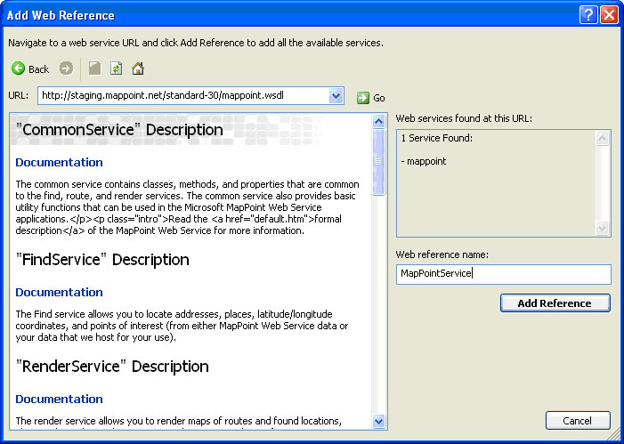
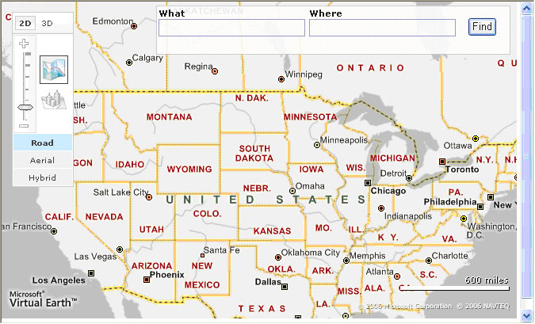
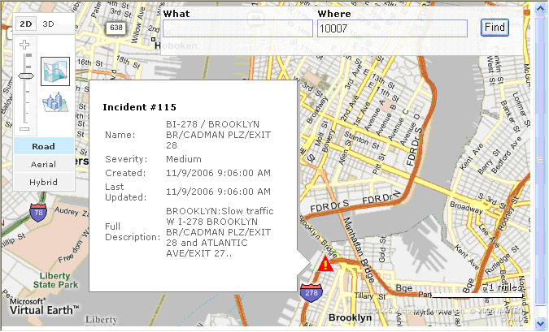

# Displaying MapPoint Web Service Traffic in Bing Maps
> [!CAUTION]
>  The content in this article may still be applicable to the current version of the [!INCLUDE[vemc_product_name](../articles/includes/vemc-product-name-md.md)], but it uses a previous version of the [!INCLUDE[vemc_product_name](../articles/includes/vemc-product-name-md.md)] which is no longer supported. More information about the current version of the [!INCLUDE[ve_product_name](../articles/includes/ve-product-name-md.md)] is found in the [Bing Map Control SDK](http://msdn.microsoft.com/en-us/library/bb429619.aspx).  
  
 In this article, we will look at how you can leverage the traffic information available from your [!INCLUDE[mws_product_name](../articles/includes/mws-product-name-md.md)] account to create a [!INCLUDE[ve_product_name](../articles/includes/ve-product-name-md.md)] page that displays real time traffic information for the United States.  
  
 If you are familiar with [!INCLUDE[mws_product_name](../articles/includes/mws-product-name-md.md)], you should know that one of the available data sources contains regularly updated traffic information for many regions of the United States.  Using a simple ASP.NET `HttpHandler`, and a [!INCLUDE[mws_product_name](../articles/includes/mws-product-name-md.md)] ([!INCLUDE[mws_product_abbr](../articles/includes/mws-product-abbr-md.md)]) client class, we can create an AJAX backend that will send pushpins to our [!INCLUDE[ve_product_name](../articles/includes/ve-product-name-md.md)] ([!INCLUDE[ve_product_abbr](../articles/includes/ve-product-abbr-md.md)]) map.  Each Pushpin will represent a traffic incident.  
  
 The full code is provided at the end of this article in the Final Code section.  
  
## Getting Started  
 Before you can use [!INCLUDE[mws_product_name](../articles/includes/mws-product-name-md.md)], you need to have an active account. You can request a developer account [here](https://mappoint-css.live.com/mwssignup).  
  
### The Plan  
 In order to make our application work, we will need to develop three related components:  
  
-   A "back end" class that can extract traffic information form MWS  
  
-   A "middle tier" ASP.NET `HttpHandler` that will act as an AJAX portal connecting our [!INCLUDE[ve_product_abbr](../articles/includes/ve-product-abbr-md.md)] class and our [!INCLUDE[ve_product_abbr](../articles/includes/ve-product-abbr-md.md)] map.  
  
-   A "front end" [!INCLUDE[ve_product_name](../articles/includes/ve-product-name-md.md)] map that will request traffic information whenever the user changes the map view with a pan or a zoom.  
  
 The basic sequence of events will be:  
  
1.  The user pans or zooms the [!INCLUDE[ve_product_name](../articles/includes/ve-product-name-md.md)] map on the front end  
  
2.  The `VEMap` control fires an "onchangeview" event.  
  
3.  The callback method for the "onchangeview" event issues an HTTP request to the `HttpHandler` page.  
  
4.  The handler page delegates the request to the [!INCLUDE[ve_product_abbr](../articles/includes/ve-product-abbr-md.md)] Traffic class.  
  
5.  The Traffic class issues a SOAP request to [!INCLUDE[mws_product_name](../articles/includes/mws-product-name-md.md)]  
  
6.  [!INCLUDE[mws_product_name](../articles/includes/mws-product-name-md.md)] returns a SOAP response to the class.  
  
7.  The class generates a text response consisting of "AddPushpin" JavaScript commands for each traffic incident.  
  
8.  The handler returns the response back to the primary page.  
  
9. The primary page executes the JavaScript commands to add the pushpins  
  
10. The user sees the new view with appropriate pushpins.  
  
 Although the process seems complicated at first, the user will actually never know about how many extra calls are being made on the back end.  
  
### The Front End Map (Default.aspx)  
 We can start with our default map and traffic page (default.aspx).  This ASP.NET page consists of some basic HTML and a set of JavaScript methods we will need to make the appropriate back end connections.  
  
### The HTML  
 We start with our basic default.aspx page from a new ASP.NET application.  The body of the page is very simple and consists of a single \<div> tag for holding our map:  
  
```  
<body onload="OnPageLoad('myMap')">  
    <form id="form1" runat="server">  
        <div id="myMap" style="position:relative;width:650px;height:400px;"></div>  
    </form>  
</body>  
```  
  
 *Listing 1 The body of Default.aspx*  
  
### JavaScript (Part 1) - The Basics  
 Next, we need to add a reference to the [!INCLUDE[ve_product_abbr](../articles/includes/ve-product-abbr-md.md)] controls:  
  
```  
<script src="http://dev.virtualearth.net/mapcontrol/v4/mapcontrol.js"></script>  
```  
  
 *Listing 2 Referencing the [!INCLUDE[ve_product_abbr](../articles/includes/ve-product-abbr-md.md)] Controls*  
  
 We also need an `OnPageLoad` method to draw our map:  
  
```  
<script>  
  var map;  
  
  function OnPageLoad(element)  
  {  
    map = new VEMap(element);  
    map.LoadMap();  
    map.ShowFindControl();  
    map.AttachEvent('onchangeview', GetTraffic);  
  }  
  //We'll add more here later  
</script>  
```  
  
 *Listing 3 Drawing the Map*  
  
 Our page load method creates a `VEMap` control, loads the default view (the United States), shows the What/Where Find control, and attaches the `GetTraffic` method to the `onchangeview` event.  As soon as we create a `GetTraffic` method, we can run our application and see a fully functional [!INCLUDE[vemc_product_name](../articles/includes/vemc-product-name-md.md)] in action.  
  
### JavaScript (Part 2) - AJAX  
 The next step is to add the rest of our JavaScript so that we can perform steps 3 through 9 of our sequence of events.  In order to make this all work, we will need:  
  
-   A set of methods for making an HTTP request and receiving the result  
  
-   A `GetTraffic` method which will make our traffic request to the `HttpHandler`.  
  
-   An `AddPushpin` method so that our page can add each pushpin.  
  
 We will start with the HTTP request code.  
  
### Making an HTTP Request  
 If you have worked with [!INCLUDE[ve_product_name](../articles/includes/ve-product-name-md.md)], you may be familiar with the following code for initializing an XML HTTP object. Add this code to Listing 3:  
  
```  
var xmlhttp=false;  
function InitXmlHttp() {  
  // Attempt to initialize xmlhttp object  
  try  
  {  
    xmlhttp = new ActiveXObject("Msxml2.XMLHTTP");  
  }  
  catch (e)  
  {  
    // Try to use different activex object  
    try  
    {  
      xmlhttp = new ActiveXObject("Microsoft.XMLHTTP");  
    }  
    catch (E)  
    {  
      xmlhttp = false;  
    }  
  }  
  // If not initialized, create XMLHttpRequest object  
  if (!xmlhttp && typeof XMLHttpRequest!='undefined')  
  {  
    xmlhttp = new XMLHttpRequest();  
  }  
  
  // Define function call for when Request obj state has changed  
  xmlhttp.onreadystatechange=SearchHandler;  
}  
  
function SearchHandler()  
{  
  if (xmlhttp.readyState==4)  
  {  
    eval(xmlhttp.responseText);  
  }  
}  
```  
  
 *Listing 4 JavaScript necessary to make an AJAX call*  
  
 Now we can make an HTTP call by using initializing the `xmlhttp` object, and then using the `open()` and `send()` methods.  When the call is returned, it will automatically be processed by `SearchHandler()`.  
  
### The GetTraffic Method  
 If you recall, our map will call `GetTraffic` any time the view is changed.  That means we want our `GetTraffic` method to clear any existing pushpins and then request a new set based on the new view.  The method looks like this:  
  
```  
function GetTraffic(e)  
{             
    map.DeleteAllPushpins();  
    InitXmlHttp();  
  
    var msg = "TrafficHandler.ashx?Lat="  
     +e.view.latlong.latitude  
     +"&Lng="+e.view.latlong.longitude;  
  
    xmlhttp.open("GET", msg, true);  
    xmlhttp.send(null);  
}  
```  
  
 *Listing 5 The GetTraffic Method*  
  
 We make a request to `TrafficHandler`, passing in the latitude and longitude of the current center of the map.  
  
### The AddPin method  
 Our handler page is going to return a string representing a set of JavaScript calls.  Although we could have the handler send back a set of `map.AddPushpin()` calls, that creates too big of a dependency between our front and back end.  Instead, we are going to have our back end call a JavaScript method called `AddPin()`:  
  
```  
function AddPin(ID, lat, lng, title, description)  
{  
  try {map.DeletePushpin(ID);}  
  catch (err) {}  
  
  try {  
    map.AddPushpin(new VEPushpin(ID, new VELatLong(lat, lng), 'images/traffic.gif',  
                   title, description));  
  } catch (err)  
  {  
   alert(err);  
  }  
}  
```  
  
 *Listing 6 The AddPin callback method*  
  
 Every time our handler identifies a new traffic incident, it will pass a string back to Default.aspx that calls `AddPin()`.  The `AddPin()` method will attempt to add a new pushpin with the given parameters, including our custom icon:  
  
   
  
### The Middle Tier (Traffic Handler)  
 Now that our main page is finished, we need to create the middle tier.  Our handler has two functions:  
  
-   Validate the request  
  
-   Call the [!INCLUDE[mws_product_abbr](../articles/includes/mws-product-abbr-md.md)] traffic class and pass the response back to the original caller.  
  
 In order to build the middle tier, we start with a new Generic Handler named `TrafficHandler`:  
  
```  
<%@ WebHandler Language="C#" Class="TrafficHandler" %>  
  
using System;  
using System.Web;  
  
public class TrafficHandler : IHttpHandler {  
  
  public void ProcessRequest (HttpContext context) {  
  //We add our code here  
  }  
  
  public bool IsReusable {  
    get {  
      return false;  
    }  
  }  
  
}  
```  
  
 *Listing 7 The Basic Handler (TrafficHandler.aspx)*  
  
 Once we have our basic handler, we need to modify the `ProcessRequest` method to meet our needs.  Insert the following code to check the parameters, create our traffic generator class, get traffic information, and write it back to the requesting page:  
  
```  
context.Response.ContentType = "text/plain";  
TrafficGenerator tg = new TrafficGenerator();  
  
if (context.Request.QueryString != null  
    && context.Request.QueryString["Lat"] != null  
    && context.Request.QueryString["Lng"] != null)  
{  
  double lat = Double.Parse(context.Request.QueryString["Lat"]);  
  double lng = Double.Parse(context.Request.QueryString["Lng"]);  
  context.Response.Write(tg.GetIncidents(lat, lng));   
}  
```  
  
 *Listing 8 Add this to ProcessRequest()*  
  
 Note that we check to make sure that the `Lat` and `Lng` query string parameters are present (matching the code in Listing 5), and then call a method on `TrafficGenerator`.  We write the response back out to the `context.Response` object.  
  
### The Back End (Calling MWS)  
 Our back end class needs to have a single public method (`GetIncidents()`) which returns a string consisting of a semi-colon separated sequence of calls to `AddPin()` (Listing 6).  In order to make this work, we need to:  
  
1.  Create a web reference to [!INCLUDE[mws_product_name](../articles/includes/mws-product-name-md.md)]  
  
2.  Create an instance of the [!INCLUDE[mws_product_abbr](../articles/includes/mws-product-abbr-md.md)] Find proxy  
  
3.  Issue a call to Find, asking for traffic incidents within 20 miles of the center point  
  
4.  Parse the results  
  
### Create a Reference to [!INCLUDE[ve_product_abbr](../articles/includes/ve-product-abbr-md.md)]  
 The first thing we need is to add a Web Reference to our ASP.NET project.  In Visual Studio, choose Website->Add Web Reference… from the menu.  In the wizard, enter the [!INCLUDE[ve_product_abbr](../articles/includes/ve-product-abbr-md.md)] staging URL: [http://staging.mappoint.net/standard-30/mappoint.wsdl](http://staging.mappoint.net/standard-30/mappoint.wsdl).  Change the service name to MapPointService, and you should have a screen that looks like this:  
  
   
  
 Figure 1 *Adding the Web Reference*  
  
 As soon as you click the Add Reference button, you will have access to the [!INCLUDE[mws_product_abbr](../articles/includes/mws-product-abbr-md.md)] proxy classes.  
  
### Execute a Traffic Request  
 We'll create a separate C# class to perform all of our [!INCLUDE[mws_product_abbr](../articles/includes/mws-product-abbr-md.md)] work.  We will need three methods:  
  
1.  A constructor to instantiate the [!INCLUDE[mws_product_abbr](../articles/includes/mws-product-abbr-md.md)] proxy classes  
  
2.  A public `GetIncidents()` method to perform the bulk of the work  
  
3.  A private `BuildPin()` method to help us parse out the results.  
  
### The Constructor  
 Our basic class and constructor looks like this:  
  
```  
using System;  
using System.Security.Authentication;  
using System.Collections.Generic;  
using MapPointService;  
using System.Text;  
  
public class TrafficGenerator  
{  
  private MapPointService.FindServiceSoap findService = null;  
  private const String MPUser = "Your User Name Here";  
  private const String MPPass = "Your Password Here";  
  
  public TrafficGenerator()  
  {  
    if (findService == null)  
    {  
      findService = new MapPointService.FindServiceSoap();  
    }  
    findService.Credentials = new System.Net.NetworkCredential(MPUser, MPPass);  
    findService.PreAuthenticate= true;  
  }  
}  
```  
  
 *Listing 9 The TrafficGenerator Class*  
  
 We start by declaring some internal constants for our user name and password (change these to your own values).  We also need a member variable for our Find Service.  
  
 Next, in the constructor, we create an instance of the [!INCLUDE[mws_product_abbr](../articles/includes/mws-product-abbr-md.md)] Find Service.  We also assign our username and password as credentials, and turn on pre-authentication to help speed up repeated requests to the service.  
  
### The GetIncidents Method  
 Our real work is done in the `GetIncidents()` method.  We receive a latitude and longitude representing the center of a map view, and we want all traffic incidents within 20 miles of that location.  If you aren't familiar with MWS, in order to find traffic incidents we need to:  
  
1.  Create a `FindNearbySpecification` object  
  
2.  Select the Traffic data source (MapPointTravel.TrafficIncidents)  
  
3.  Set the latitude and longitude  
  
4.  Filter the results to only show "TrafficIncidents" instead of traffic polygons.  
  
5.  Execute a `FindNearby()` call using our specification.  
  
6.  Parse the results.  
  
 Our method looks like this:  
  
```  
public String GetIncidents(double latitude, double longitude)  
{  
  StringBuilder incidents = new StringBuilder();  
  long pinID = 0;  
  
  //create the specification  
  try   
  {  
    FindNearbySpecification findNearbySpec = new FindNearbySpecification();  
    findNearbySpec.DataSourceName = "MapPointTravel.TrafficIncidents";  
    findNearbySpec.Distance = 20;  
    findNearbySpec.LatLong = new MapPointService.LatLong();  
    findNearbySpec.LatLong.Latitude = latitude;  
    findNearbySpec.LatLong.Longitude = longitude;  
    findNearbySpec.Filter = new MapPointService.FindFilter();  
    findNearbySpec.Filter.EntityTypeName = "TrafficIncident";  
  
    //make the request  
    FindResults foundResults = findService.FindNearby(findNearbySpec);  
  
    //parse the results  
    foreach (FindResult fr in foundResults.Results)  
    {  
      incidents.Append(BuildPin(fr.FoundLocation, pinID));  
      pinID++;  
    }  
  }  
  //Handle errors  
  catch (Exception e)  
  {  
    incidents.Append("Alert('Error: ");  
    incidents.Append(e.ToString());  
    incidents.Append("');");  
  }  
  return incidents.ToString();  
}  
```  
  
 *Listing 10 The GetIncidents Method*  
  
 Inside the `foreach` loop, we process each result using the private `BuildPin()` method.  
  
### The BuildPin Method  
 Our `BuildPin()` method processes each of the returned [!INCLUDE[mws_product_abbr](../articles/includes/mws-product-abbr-md.md)] result objects and generates a string calling the `AddPin()` method.  The most challenging part of this method is extracting the interesting properties out of the `Location` object.  Unfortunately, the [!INCLUDE[mws_product_abbr](../articles/includes/mws-product-abbr-md.md)]`Location` object's properties array is numerically index.  Therefore we convert it to a `Dictionary` object so that we can pull out values by name.  
  
```  
private String BuildPin(Location incident, long pinID)  
{  
  //convert properties to a dictionary  
  Dictionary<String, String> props = new Dictionary<String, String>();  
  foreach (MapPointService.EntityPropertyValue prop in incident.Entity.Properties)  
  {  
    props.Add(prop.Name, System.Convert.ToString(prop.Value));  
  }  
  
  //build the description element  
  System.Text.StringBuilder sb = new System.Text.StringBuilder();  
  sb.Append("'<table class=\"incident\">");  
  sb.Append("<tr><td>Name:</td><td>B{0}</td></tr>");  
  sb.Append("<tr><td>Severity:</td><td>{1}</td></tr>");  
  sb.Append("<tr><td>Created:</td><td>{2}</td></tr>");  
  sb.Append("<tr><td>Last Updated:</td><td>{3}</td></tr>");  
  sb.Append("<tr><td>Full Description:</td><td>{6}</td></tr>");  
  sb.Append("</table>'");  
  
  //Build the method call using String.Format()  
  Object[] pinParams = new Object[5];  
  pinParams[0] = pinID;  
  pinParams[1] = incident.LatLong.Latitude;  
  pinParams[2] = incident.LatLong.Longitude;  
  pinParams[3] = String.Format("'Incident #{0}'", props["StandardMessage"]);  
  pinParams[4] = String.Format(sb.ToString(),  
  new Object[] {props["Name"],   
                props["Severity"],   
                props["Created"],   
                props["LastUpdated"],   
                props["FullDescription"]});  
         return String.Format("AddPin('Traffic{0}',{1},{2},{3},{4});", pinParams);  
     }  
```  
  
 *Listing 11 The Build Pin Method*  
  
 In this method we take advantage of .NET 2.0 generics and the `String.Format()` method.  
  
### Trying the Application  
 If you put it all together, and load the default.aspx page, you should see something similar to the following:  
  
   
  
 Figure 2 *The Default Page*  
  
 If you zoom in on almost any major metropolitan area, you should see traffic icons.  For instance, if you type 10007 (the zip code for downtown Manhattan) into the Where box, and click on Find, you might see something similar to this:  
  
   
  
 Figure 3 *MWS Traffic In Action*  
  
### Conclusion  
 Once you have the basic process in place for making AJAX calls, you can easily link to other data sources.  For instance, you could generate pushpins from an internal database or business process.  You could also improve this application by changing the style of the pushpin table, caching the data points, or accessing the [!INCLUDE[mws_product_abbr](../articles/includes/mws-product-abbr-md.md)] traffic data source to display the polygons of covered areas.  
  
 This article was written by [Robert McGovern MVP (Bing Maps/MapPoint)](https://mvp.support.microsoft.com/profile=A9159573-40DB-4BD1-A079-D57C675E1766) from [Infusion Development](http://www.infusiondev.com/technology/Microsoft/MapPoint.htm).  
  
### Final Code  
 The following code should give you everything you need to rebuild this application, provided that you have an [!INCLUDE[mws_product_abbr](../articles/includes/mws-product-abbr-md.md)] account, and that you have created your Web Reference properly.  
  
### Default.aspx  
  
```  
<%@ Page Language="C#" AutoEventWireup="true"  CodeFile="Default.aspx.cs" Inherits="_Default" %>  
<!DOCTYPE html PUBLIC "-//W3C//DTD XHTML 1.0 Transitional//EN" "http://www.w3.org/TR/xhtml1/DTD/xhtml1-transitional.dtd">  
  
<html >  
<head runat="server">  
    <title>Traffic with VE and MWS</title>  
    <script src="http://dev.virtualearth.net/mapcontrol/v4/mapcontrol.js"></script>  
    <script>  
        var map;  
  
        function OnPageLoad(element)  
        {  
            map = new VEMap(element);  
            map.LoadMap();  
            map.ShowFindControl();  
            map.AttachEvent('onchangeview', GetTraffic);  
        }  
  
        function AddPin(ID, lat, lng, title, description)  
        {  
            try {map.DeletePushpin(ID);}  
            catch (err) {}  
  
            try {  
                map.AddPushpin(new VEPushpin(ID, new VELatLong(lat, lng),   
                   'images/traffic.gif', title, description));  
            } catch (err)  
            {  
               alert(err);  
            }  
        }  
  
        function GetTraffic(e)  
        {             
            InitXmlHttp();  
            var msg = "TrafficHandler.ashx?Lat="  
                       +e.view.latlong.latitude  
                       +"&Lng="+e.view.latlong.longitude;  
            xmlhttp.open("GET",msg,true);  
            xmlhttp.send(null);  
        }  
  
        var xmlhttp=false;  
        function InitXmlHttp() {  
          // Attempt to initialize xmlhttp object  
          try  
          {  
                xmlhttp = new ActiveXObject("Msxml2.XMLHTTP");  
          }  
          catch (e)  
          {  
                // Try to use different activex object  
                try  
                {  
                      xmlhttp = new ActiveXObject("Microsoft.XMLHTTP");  
                }  
                catch (E)  
                {  
                      xmlhttp = false;  
                }  
          }  
          // If not initialized, create XMLHttpRequest object  
          if (!xmlhttp && typeof XMLHttpRequest!='undefined')  
          {  
                xmlhttp = new XMLHttpRequest();  
          }  
  
          // Define function call for when Request obj state has changed  
          xmlhttp.onreadystatechange=searchHandler;  
        }  
  
        function searchHandler()  
        {  
          if (xmlhttp.readyState==4)  
          {  
            eval(xmlhttp.responseText);  
          }  
        }     
    </script>   
  
</head>  
<body onload="OnPageLoad('myMap')">  
    <form id="form1" runat="server">  
        <div id="myMap" style="position:relative;width:650px;height:400px;"></div>  
    </form>  
</body>  
</html>  
```  
  
 *Listing 12 Final Code for Default.aspx*  
  
### TrafficHandler.ashx  
  
```  
<%@ WebHandler Language="C#" Class="TrafficHandler" %>  
  
using System;  
using System.Web;  
  
public class TrafficHandler : IHttpHandler {  
  
    public void ProcessRequest (HttpContext context) {  
        context.Response.ContentType = "text/plain";  
        TrafficGenerator tg = new TrafficGenerator();  
  
        if (context.Request.QueryString != null  
            && context.Request.QueryString["lat"] != null  
            && context.Request.QueryString["lng"] != null)  
        {  
  
            double lat = Double.Parse(context.Request.QueryString["Lat"]);  
            double lng = Double.Parse(context.Request.QueryString["Lng"]);  
            context.Response.Write(tg.GetIncidents(lat, lng));              
        }  
    }  
    public bool IsReusable {  
        get {  
            return false;  
        }  
    }  
}  
```  
  
 *Listing 13 Final Code for TrafficHandler.ashx*  
  
### TrafficGenerator.cs  
  
```  
using System;  
using System.Security.Authentication;  
using System.Collections.Generic;  
using MapPointService;  
using System.Text;  
  
public class TrafficGenerator  
{  
    private MapPointService.FindServiceSoap findService = null;  
  
    private const String MPUser = "YOUR USER NAME";  
    private const String MPPass = "YOUR PASSWORD";  
  
    public TrafficGenerator()  
    {  
        if (findService == null)  
        {  
            findService = new MapPointService.FindServiceSoap();  
        }  
        findService.Credentials = new System.Net.NetworkCredential(MPUser, MPPass);  
        findService.PreAuthenticate= true;  
    }  
  
    public String GetIncidents(double latitude, double longitude)  
    {  
        StringBuilder incidents = new StringBuilder();  
        long pinID = 0;  
        try   
        {  
            FindNearbySpecification findNearbySpec = new FindNearbySpecification();  
            findNearbySpec.DataSourceName = "MapPointTravel.TrafficIncidents";  
            findNearbySpec.Distance = 20;  
            findNearbySpec.LatLong = new MapPointService.LatLong();  
            findNearbySpec.LatLong.Latitude = latitude;  
            findNearbySpec.LatLong.Longitude = longitude;  
            findNearbySpec.Filter = new MapPointService.FindFilter();  
            findNearbySpec.Filter.EntityTypeName = "TrafficIncident";  
            FindResults foundResults = findService.FindNearby(findNearbySpec);  
            foreach (FindResult fr in foundResults.Results)  
            {  
                incidents.Append(BuildPin(fr.FoundLocation, pinID));  
                pinID++;  
            }  
        }  
        catch (Exception e)  
        {  
            incidents.Append("Alert('Error: ");  
            incidents.Append(e.ToString());  
            incidents.Append("');");  
        }  
        return incidents.ToString();  
    }  
     private String BuildPin(Location incident, long pinID)  
     {  
         Dictionary<String, String> props = new Dictionary<String, String>();  
         foreach (MapPointService.EntityPropertyValue prop in incident.Entity.Properties)  
         {  
             props.Add(prop.Name, System.Convert.ToString(prop.Value));  
         }  
         System.Text.StringBuilder sb = new System.Text.StringBuilder();  
         sb.Append("'<table class=\"incident\">");  
         sb.Append("<tr><td>Name:</td><td>B{0}</td></tr>");  
         sb.Append("<tr><td>Severity:</td><td>{1}</td></tr>");  
         sb.Append("<tr><td>Created:</td><td>{2}</td></tr>");  
         sb.Append("<tr><td>Last Updated:</td><td>{3}</td></tr>");  
         sb.Append("<tr><td>Full Description:</td><td>{4}</td></tr>");  
         sb.Append("</table>'");  
  
         Object[] pinParams = new Object[5];  
         pinParams[0] = pinID;  
         pinParams[1] = incident.LatLong.Latitude;  
         pinParams[2] = incident.LatLong.Longitude;  
         pinParams[3] = String.Format("'Incident #{0}'", props["StandardMessage"]);  
         pinParams[4] = String.Format(sb.ToString(),  
            new Object[] {props["Name"], props["Severity"],   
                props["Created"], props["LastUpdated"],   
                props["FullDescription"]});  
         return String.Format("AddPin('Traffic{0}',{1},{2},{3},{4});", pinParams);      
     }  
}  
```  
  
 *Listing 14 Final Code for TrafficGenerator.cs*