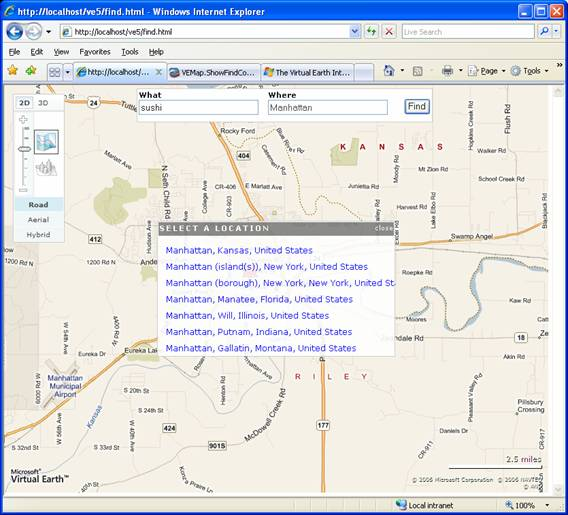
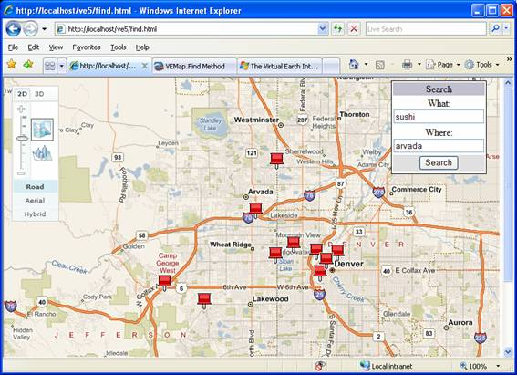
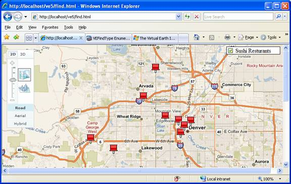

# Finding Information
Accessing the [!INCLUDE[ve_product_name](../articles/includes/ve-product-name-md.md)] maps is only half of the story. The other half is finding the correct location or locations of points of interest. With the [!INCLUDE[vemc_product_name](../articles/includes/vemc-product-name-md.md)] SDK you have several choices for finding relevant information and displaying it on the map. In this article, we will focus on the **Find** Control and the **Find** method.  
  
## Creating a Basic [!INCLUDE[ve_product_name](../articles/includes/ve-product-name-md.md)] Map  
 Before we start working with the **Find** method, let's start with a basic [!INCLUDE[ve_product_name](../articles/includes/ve-product-name-md.md)] map.  
  
```  
<!DOCTYPE html PUBLIC "-//W3C//DTD XHTML 1.0 Transitional//EN" "http://www.w3.org/TR/xhtml1/DTD/xhtml1-transitional.dtd">  
<html>  
   <head>  
      <meta http-equiv="Content-Type" content="text/html; charset=utf-8">  
      <script type="text/javascript" src="http://ecn.dev.virtualearth.net/mapcontrol/mapcontrol.ashx?v=6.3"></script>  
      <script type="text/javascript">  
         var map;  
  
         function OnPageLoad()  
         {  
            map = new VEMap('myMap');  
            map.LoadMap();  
         }  
      </script>  
   </head>  
   <body style="position:absolute;width:100%;height:100%"   
         onload="OnPageLoad();">  
      <div id="myMap"  
          style="position:relative;width:800px;height:600px;"></div>  
   </body>  
</html>  
```  
  
 **Listing 1: A basic page**  
  
 If you load this page in a browser, you should see a map of the United States with the basic [!INCLUDE[ve_product_name](../articles/includes/ve-product-name-md.md)] navigation dashboard.  
  
## Adding a Find Control to a Map  
 The fastest and easiest way to allow users to find business or addresses is to add a **Find** Control to a map. Add the following line to  after the call to **LoadMap** loads the page.  
  
```  
map.ShowFindControl();  
```  
  
 **Listing 2: Enabling the Find control**  
  
 You should see the classic "What/Where" box in the upper right corner of your map. Type in a category of business or a location, or both, and the results appear on the map, as in **Figure 1**.  
  
   
  
 **Figure 1: Finding information with the Find control**  
  
 As you move the map around, the search automatically refreshes itself for the given area. Behind the scenes, the VEMap control is using AJAX to repeatedly call the Microsoft servers and performing a search against the very large yellow pages directory hosted with the [!INCLUDE[ve_product_name](../articles/includes/ve-product-name-md.md)] maps.  
  
 Although the built in **Find** Control is easy to use and powerful, there are some limitations. Most notably, the control itself is visually uninspiring and difficult to change. Also, if a user enters an ambiguous location, they see a disambiguation dialogue window similar to the following.  
  
   
  
 **Figure 2: A disambiguation dialog**  
  
 Although you can turn the disambiguation off, forcing [!INCLUDE[ve_product_name](../articles/includes/ve-product-name-md.md)] to always pick what it considers to be the best match, users may see unexpected results. For example, unless the user is from Kansas or is a fan of Kansas State University, they are more likely to expect a search for **Manhattan** to return a result in New York City (the 2nd and 3rd closest choices).  
  
 To disable this disambiguation dialog window, add the following line of code.  
  
```  
map.ShowDisambiguationDialog(false);  
```  
  
 **Listing 3: Turning off automatic disambiguation**  
  
 Although this does fix the disambiguation issue, you are still left with a **Find** Control that you can't easily change. That's where the **Find** method comes in.  
  
## Using the Find Method  
 Behind the scenes, the **Find** Control is using the **VEMap.Find** method. This method accepts a variety of parameters including the `what` and `where` properties similar to the fields in the **Find** Control. In the simplest case, all you need pass into the method is a value for `what`. The map automatically adds a pushpin to the discovered location.  
  
 For example, to replicate the results shown in Figure 1, replace the call to **ShowFindControl** with call to **Find**, as follows.  
  
```  
map.Find("sushi", "arvada, colorado, united states");  
```  
  
 **Listing 4: An example of the Find method**  
  
 As we said previously, the **Find** Control uses the **VEMap.Find** method. Let's create a basic **Find** control that has two text input areas for `what` and `where`. This control is not integrated into the map control.  
  
1.  Create a two text fields in the BODY section similar to the following, just before the DIV tag for the map.  
  
    ```  
    <div id="findControl">  
       <table>  
          <tr>  
             <td><b>What</b></td>  
             <td><b>Where</b></td>  
             <td>&nbsp;</td>  
          </tr>  
          <tr>  
             <td><input id="txtWhat" type="text" value="sushi"  
                        name="txtWhat" /></td>  
             <td><input id="txtWhere" type="text" value="arvada"  
                        name="txtWhere" /></td>  
             <td><input id="findit" type="button" value="Find It!"  
                        name="find" onclick="DoFind();"/></td>  
          </tr>  
       </table>  
    </div>  
    ```  
  
2.  Link the **Find** button in your control to a method call similar to the following.  
  
    ```  
    function DoFind()  
    {  
      var what = document.getElementById('txtWhat').value;  
      var where = document.getElementById('txtWhere').value;  
      map.Find(what, where);  
    }  
    ```  
  
 **Listing 5: Using the Find method**  
  
 An example may look like the following.  
  
   
  
 **Figure 3: Setting Find parameters**  
  
### Customizing Find Results  
 One way to customize the results of a find search is to capture the resulting pushpins in a `VEShapeLayer`. If your results are stored in a layer, you can easily turn the search results on or off by using the layer's Show or Hide methods. If we start once again with  and do the following, we can see the effects of using a layer.  
  
1.  Add a global variable to hold the shape layer. Put this code at the beginning of the script section:  
  
    ```  
    var sushi = new VEShapeLayer();  
    ```  
  
     **Listing 6 A VEShapeLayer place holder**  
  
2.  Add code to perform the find and load the results into the shape layer. Put the following code in the **OnPageLoad** function after **LoadMap**.  
  
    ```  
    sushi.SetTitle("Sushi");  
    map.Find("sushi", "arvada", VEFindType.Businesses, sushi);  
    map.AddShapeLayer(sushi);  
    ```  
  
     **Listing 7: Storing results in a shape layer**  
  
3.  In the body section, add some HTML to create a checkbox for the resulting layer. Note that because our layer is a global variable we can toggle its state inline with the checkbox definition rather than using additional JavaScript functions.  
  
    ```  
    <div id="Toggles">  
      <input type="checkbox" name="sushi" value="sushi"   
         onclick="this.checked ? sushi.Show() : sushi.Hide();" checked>  
        Sushi Resturants<br>  
    </div>  
    ```  
  
     **Listing 8: Adding the Checkbox**  
  
4.  Add the following code to the **OnPageLoad** function to register the checkbox with the map and place it appropriately.  
  
    ```  
    map.AddControl(toggles);  
    toggles.style.left = '625px';  
    toggles.style.top = '5px';  
    ```  
  
     **Listing 9: Adding the Control**  
  
 At this point, you should see the map pre-loaded with results. If you toggle the checkbox, all of the search results should instantly disappear:  
  
   
  
 **Figure 4: A customized Find with the results in a shape layer**  
  
### Disambiguation Again  
 If you've run the code described in the preceding sections, you may notice the pesky disambiguation box appearing. We can turn off disambiguation by changing the **Find** call in :  
  
```  
map.Find("sushi", "arvada", VEFindType.Businesses, sushi, null, null, null, null, false);  
```  
  
 **Listing 11: Disabling disambiguation**  
  
 Naturally, this will work well for Arvada, as the default result is near Denver, where you can find Sushi. Arvada, Wyoming sadly has no sushi. However, we can always access Arvada Wyoming by changing the `where` field and providing a more specific address such as "Arvada, WY".  
  
 Unfortunately, you can't do much more with the basic **Find** method without resorting to callbacks and more custom code.  
  
## Working with Callbacks  
 The next step with **Find** is to capture the results and process them yourself before displaying them to the user. You might, for example, want to use find to:  
  
-   Display different pushpins for each search the way that *maps.live.com* does.  
  
-   Display search results in a list rather than as pushpins  
  
-   Automatically move the map to the result of the search  
  
-   Filter search results based on external criteria  
  
 All of these are possible using callbacks. Note that the **Find** method is asynchronous. As soon as you send the command, your code is free to continue. Once Microsoft has processed the results, either the map (as in previous examples) or your callback method will receive a message containing the results. If the map receives the message directly, it will automatically create pushpins for each result point and display them on the map. On the other hand, if you use a callback, you are free to do whatever you wish with the results.  
  
 As a general rule, you must perform two tasks to use a callback:  
  
1.  Set up a callback method. Your method should accept four parameters: the shape layer (if you used one), the list of search results, the list of place results (for disambiguation), and a Boolean indicating whether or not more results are available.  
  
    ```  
    function Callback(shape, results, places, hasmore)  
    {  
      //do something with returned information  
    }  
    ```  
  
     **Listing 12: Callback skeleton**  
  
2.  Use a **Find** call that references the callback. The **Find** method has many parameters that affect the search. Since the last parameter defines the callback, you may have to carefully check to see if the default values are what you want for all of the intermediate parameters. If so, you can use nulls for everything except either the first parameter (`what`) or the second parameter (`where`):  
  
    ```  
    //Find call. Parameter defaults are in brackets  
    map.Find(what, where, type [VEFindType.Business], layer [base map], startIndex [0], numberOfResults [10], showResults[true], createResults [true], useDefaultDisambiguation [true], setBestMapView [true], callback)  
    ```  
  
     **Listing 13: Find with a callback**  
  
 As you can see, there are many options for **Find** commands when you are using a callback:  
  
-   `type` – At the moment, the only supported find type is **VEFindType.Business**. Until the method supports more types, you can leave this field as `null` which indicates "search all types". As Microsoft adds more search types (e.g. School, Park, etc) then the type field should let you select which category of result you wish to search.  
  
-   `startIndex` & `numberOfResults` – In some cases, you may get many results back for a query. These two parameters let you tune which results are returned and how many results are returned. You will most likely use these parameters to set up paging in your result display. If you are using these parameters, you should check the fourth parameter of your callback to find out whether more results are available or not.  
  
-   `showResults` – This flag indicates whether pushpins will be displayed for the result set. If you want to create your own pushpins, use a list instead of pushpins, or link your search result display to another user control (as in Figure 4), you may want to set this to `false`.  
  
-   `createResults` – This flag is similar to `showResults` except that this one determines whether pushpin shapes are created at all. If you set this to false, then you will receive information about your search results, but the pushpin objects won't automatically be created. You will want to set this parameter to `false` if you want to use custom pushpins, put your results in a list, or simply use the results programmatically in another fashion. Although leaving this parameter as `true` causes no harm, it will use additional bandwidth and client-side memory. It may also make your search results return a little slower.  
  
-   `useDefaultDisambiguation` – This parameter was mentioned previously. If you set it to `true`, your user must select a valid choice from the default disambiguation box before your callback is fired. If you set this parameter to `false`, the [!INCLUDE[vemc_product_name](../articles/includes/vemc-product-name-md.md)] API will return results based on the first possible choice. However, all of the possible `where` values are stored in the 3rd parameter of your callback. Therefore your first check in the callback should be to determine whether or not the search was unique. If not, you can display a custom list of "disambiguation" choices.  
  
-   `setBestMapView` – If you plan on displaying the default pushpins, you most likely want to leave this parameter as `true` as it will force the map to re-center and zoom to the "best fit" view for the results. If you aren't displaying the results as pushpins, or want to perform your own view manipulations, set this parameter to `false`.  
  
### Callback Results  
 The two most important parameters in your callback are the list of results and the list of places. You will have a list of results if:  
  
-   You specify something in the `where` parameter AND  
  
-   There are matching results within the search area  
  
 The results object is actually an array of **VEFindResult** objects, which has properties including:  
  
-   **Shape** – If you set `CreateResults` to true, then this property holds a reference to the pushpin object automatically created for this result.  
  
-   **Name** – The name of the result location as stored in the [!INCLUDE[ve_product_name](../articles/includes/ve-product-name-md.md)] yellow pages data source.  
  
-   **findType** – The type of result. At present, the value will always be **VEFindType.Business**, although this will change as Microsoft releases new categories of searchable objects.  
  
-   **IsSponsored** – Microsoft is evaluating a mechanism for companies to provide paid sponsorship in the search database. That is, the customer can provide their own data source of public points of interest. This field is a boolean indicating whether the result was part of a paid sponsorship data set.  
  
-   **Phone** – Where possible, Microsoft includes the currently published phone number for the business.  
  
 As you can see, the results array is focused on what rather than where. If you are looking for geo-coding (translating an address into a latitude and longitude), then you want the places array instead.  
  
 You will have a list of places if:  
  
-   You entered anything in the `where` parameter of the **Find** method call AND  
  
-   Any matches were possible. Matches start at the "best resolution" and work outwards. However, it is definitely possible to enter an un-parseable address string, or a string which cannot be matched to any known area. In that case, the places array will be null.  
  
 The places variable holds an array of **VEPlace** objects. Each **VEPlace** contains two properties:  
  
-   **Name** – The unambiguous name of the place. This is a string containing the fully qualified location. For example, if you searched for a specific street address, this field would contain something like: "number street, city, state, zip code, country"  
  
-   **LatLong** – This property holds a **VELatLong** object containing the exact location of the found place. You can use this value to create your own pushpins or other shapes.  
  
## Conclusion  
 Using the **Find** Control gives you tremendous power to allow your users to find points of interest. By using the **Find** method, you can refine this power and build additional features into your website.