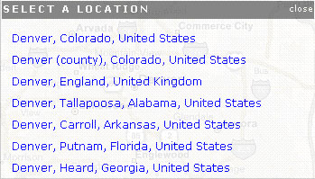
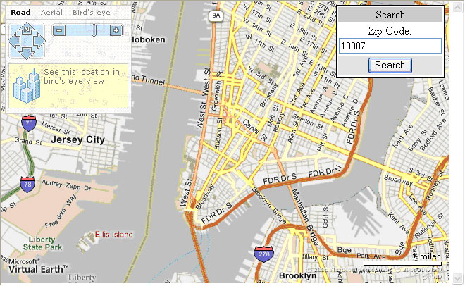
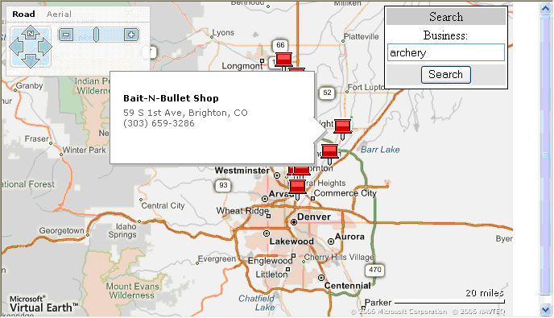
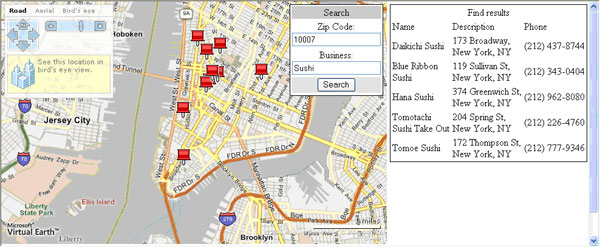

# Finding Things with Bing Maps
> [!CAUTION]
>  The content in this article may still be applicable to the current version of the [!INCLUDE[vemc_product_name](../articles/includes/vemc-product-name-md.md)], but it uses a previous version of the [!INCLUDE[vemc_product_name](../articles/includes/vemc-product-name-md.md)] which is no longer supported. More information about the current version of the [!INCLUDE[vemc_product_name](../articles/includes/vemc-product-name-md.md)] is found in the [Bing Map Control SDK](http://msdn.microsoft.com/en-us/library/bb429619.aspx).  
  
 Map based searching requires both a map, and the ability to search for relevant locations.  Fortunately, the [!INCLUDE[vemc_product_name](../articles/includes/vemc-product-name-md.md)] provides us with both necessary pieces.  The best part is that we can build a map based search system using nothing more than HTML, JavaScript, and a little bit of CSS.  
  
 The `VEMap` control not only displays our map, it also offers four distinct methods for performing a search:  
  
-   The What/Where control available on [local.live.com](http://local.live.com/) is also available in the basic `VEMap` control.  We can turn on this control with one additional line of JavaScript code.  
  
-   The `FindLocation()` method performs a search for a location.  If a location match is found, the map will automatically re-center on the location and zoom in to an appropriate level.  
  
-   The `FindNearby()` method performs a "what" search to find businesses that are located near the current center of the map.  This search uses the same yellow pages database as [local.live.com](http://local.live.com/).  
  
-   The `Find()` method gives you the most control over your search, as you can specify both what and where.  You can also receive the results of the search in a JavaScript callback function.  
  
 By choosing the appropriate Find method, you can build a full featured map based search application.  
  
## Getting Started  
 Before we play with the various options for finding locations, let's start with a basic [!INCLUDE[ve_product_name](../articles/includes/ve-product-name-md.md)] map:  
  
```  
<html>  
<head>  
<script src="http://dev.virtualearth.net/mapcontrol/v4/mapcontrol.js"></script>  
<script>  
  var map;  
  function OnPageLoad()  
  {  
    map = new VEMap('myMap');  
    map.LoadMap();  
  }  
</script>  
<body onload="OnPageLoad();">  
    <div id="myMap" style="position:relative;width:600px;height:400px;"></div>  
</body>  
</html>  
```  
  
 *Listing 1 Basic Page (Find.html)*  
  
 If you load this page in a browser, you should see a map of the United States with the basic [!INCLUDE[ve_product_name](../articles/includes/ve-product-name-md.md)] navigation dashboard.  
  
### The What/Where Control  
 The easiest way to leverage find functionality is to simply turn on the what/where control.  Add the following line of code to the end of your `OnPageLoad()` method:  
  
```  
map.ShowFindControl();  
```  
  
 *Listing 2  Turning on the Find Control*  
  
 If you load the revised page in the browser, you should see the What/Where control in the upper right corner:  
  
   
  
 Figure 1 *The What Where Control*  
  
 If you type an address into the "where" box (e.g. Denver) and click "Find", the map will automatically re-center on your location.  If [!INCLUDE[ve_product_name](../articles/includes/ve-product-name-md.md)] can not find an exact match, you will see the disambiguation popup:  
  
   
  
 Figure 2 *Disambiguation Dialog*  
  
 Simply click on the location you want, and the map will re-center, and zoom down to an appropriate level:  
  
   
  
 Figure 3 *Re-centered map*  
  
 If our users entered information into the What box, we'd see a set of pushpins that match the yellow pages search for the entered information.  For example, we could look for "coffee" in "Vail, Colorado":  
  
   
  
 Figure 4 *What and Where*  
  
 Of course, there are some drawbacks to the What/Where control.  First, the control is rather wide.  Our map would have to be at least 635 pixels wide to display the full control on the map.  We can adjust the style by finding the relevant CSS entries, but that functionality is neither easily exposed, nor directly supported.  A second problem is that the search is rather coarsely defined.  That is, the user can enter an address in any format and [!INCLUDE[ve_product_name](../articles/includes/ve-product-name-md.md)] will make its best guess.  We can overcome both of these limitations by building our own find control.  
  
### The FindLocation Method  
 The `FindLocation()` method is very simple and easy to use.  All we need to do is pass in a string containing our address.  In this example, we want to force our users to enter a zip code.  Therefore, we're going to create a panel containing a text box, and a find button.  We will also link the find button to our `FindLocation` method.  
  
 First, we need some more HTML.  Add the following div to the body of your html file:  
  
```  
<div id="SearchPanel" >  
  <table border=0>  
  <tr><td bgcolor='#C0C0CF'><p align='center'>Search</p></td></tr>  
  <tr><td><p align='center'>  
    Zip Code:  
    <INPUT id="txtZip" type="text" value="" name="txtZip">  
  </td></tr>  
  <tr><td bgcolor='#E0E0E0'><p align='center'>  
    <input type="button" value="Search" onclick="DoFind();" id="Search" name="Search" />  
  </td></tr>  
  <table>  
</div>  
```  
  
 *Listing 3 Adding the panel*  
  
 Next, we need to add some style information to make our search control look better.  Add the following script block to the head of your page:  
  
```  
style type="text/css" media="screen">  
  #SearchPanel  
  {  
    width: 150px;  
    border-style: solid;  
    border-width: 1px;  
    border-color: lightgray;  
    background: white;  
  }  
</style>  
```  
  
 *Listing 4 Styling the Find Box*  
  
 Next, we need to attach our find panel to the map and position it where we want it.  Replace your `OnPageLoad()` method with the following:  
  
```  
function OnPageLoad()  
{  
  map = new VEMap('myMap');  
  map.LoadMap();  
  
  var search = document.getElementById('SearchPanel');  
  map.AddControl(search);  
  search.style.left = "475px";  
  search.style.top = "5px";  
}  
```  
  
 *Listing 5 Attaching the Search Panel*  
  
 Finally, we need to build our `DoFind()` method.  Add the following to your script block:  
  
```  
function DoFind()  
{  
  map.FindLocation(document.getElementById('txtZip').value);  
}  
```  
  
 *Listing 6 Implementing FindLocation*  
  
 If we load up our application now, we should have our own custom find box in the upper right corner.  Enter in your favorite zip code, click the find button and see what happens:  
  
   
  
 Figure 5 *FindLocation In Action*  
  
 We could add validation to ensure the users entered a valid zip code, but I'll leave that as an exercise for the reader.  
  
### The FindNearby Method  
 The next task on our list is to implement our own "what" search.  To implement "what", we need to replace the html in our search panel:  
  
```  
<div id="SearchPanel" >  
  <table border=0>  
  <tr><td bgcolor='#C0C0CF'><p align='center'>Search</p></td></tr>  
  <tr><td><p align='center'>  
      Business:  
      <INPUT id="txtBiz" type="text" value="" name="txtBiz">  
  </td></tr>  
  <tr><td bgcolor='#E0E0E0'><p align='center'>  
    <input type="button" value="Search" onclick="DoFind();" id="Search" name="Search" />  
  </td></tr>  
  <table>  
</div>  
```  
  
 *Listing 7 The What text box*  
  
 We also need to change our `DoFind()` method:  
  
```  
function DoFind()  
{  map.FindNearby(document.getElementById('txtBiz').value);  
}  
```  
  
 *Listing 8  Using FindNearby*  
  
 Notice that the `FindNearby()` method looks almost identical to the `FindLocation()` method.  
  
 If we load our page in a browser now, we can do a "what" search for a business:  
  
   
  
 Figure 6 *The FindNearby method*  
  
 You may need to zoom into an area of interest before running your search.  The default map view will show the whole United States, and perform searches near the center point of the map.  
  
### The Full Power of Find  
 The last choice for performing searches gives you the greatest control over both the search process and the results.  We are going to start by simply combining our `FindLocation` and `FindNearby` searches into a single search method.  
  
 First, add both the Business and Zip text boxes to your html:  
  
```  
<div id="SearchPanel" >  
  <table border=0>  
  <tr><td bgcolor='#C0C0CF'><p align='center'>Search</p></td></tr>  
  <tr><td><p align='center'>  
    Zip Code:  
    <INPUT id="txtZip" type="text" value="" name="txtZip">  
  </td></tr>  
  <tr><td><p align='center'>  
      Business:  
      <INPUT id="txtBiz" type="text" value="" name="txtBiz">  
  </td></tr>  
  <tr><td bgcolor='#E0E0E0'><p align='center'>  
    <input type="button" value="Search" onclick="DoFind();" id="Search" name="Search" />  
  </td></tr>  
  <table>  
</div>  
```  
  
 *Listing 9 The Full Search Panel*  
  
 Next, we need to replace our `DoFind()` method one more time:  
  
```  
function DoFind()  
{  
  var where = document.getElementById('txtZip').value;  
  var what = document.getElementById('txtBiz').value;  
  
  map.Find(what, where, 1);  
}  
```  
  
 *Listing 10 The Find method with what and where*  
  
 Now, if we load our web page, we should see both the what and where text boxes.  
  
   
  
 Figure 7 *Searching using Find*  
  
 Our application is now fully equivalent to the initial version that used the built in what/where control.  
  
### Working with the Results  
 Rather than automatically display the results, we may want to perform some additional filtering or processing.  We may even want to display the results in a new panel.  Fortunately, the `Find()` method, unlike all of our other choices, allows us to define a JavaScript callback function.  The callback method will be activated when find completes, giving us access to the results.  
  
 Depending on how we call `Find()`, we may receive two different types of results:  
  
-   If the Find method returns a "where", we will receive a `VESearchResult` object.  Each object contains an ID value and a latitude/longitude pair.  
  
-   If the Find method returns a "what", we will receive a `VEFindResult` object.  Each object contains a number of properties including Name, Description, Phone, and a latitude/longitude pair.  
  
 Since we can't be sure which type of result will come back, we need to differentiate result types.  A `VESearchResult` will always have a non null `ID` field, whereas a `VEFindResult` will always have a non null name field.  
  
### Setting up the Results View  
 We want to display our results in a table to the far right of our map.  We need to add some html and css to define the table. Start by adding the following \<div> tag to the body of your page:  
  
```  
<div id="SearchResults" ></div>  
```  
  
 *Listing 11 The SearchResults Div*  
  
 Next, add some CSS to define the div.  Add this new style to your style section:  
  
```  
#SearchResults  
{  
  display: none;  
  width: 325px;  
  border-style: solid;  
  border-width: 1px;  
  border-color: lightgray;  
  background: white;  
}  
```  
  
 *Listing 12 CSS for the Search Results*  
  
 Finally, we want to attach the div as a control to our map object.  We go back to our `OnPageLoad()` function and add some new code at the end of the function:  
  
```  
var results = document.getElementById('SearchResults');  
map.AddControl(results);  
results.style.left = "640px";  
results.style.top = "5px";  
map.ShowDisambiguationDialog(false);  
```  
  
 *Listing 13 Setting up the Search Results view*  
  
 Note that, like with our What/Where panel, we have to set the position after adding the control to the map.  We also are turning off the automatic disambiguation feature.  If we omitted this last line, we wouldn't be able to use our results because the user would be forced to decide on a location *after* the callback is made.  When we turn off disambiguation, we tell the map to automatically choose the first location returned.  
  
### Modifying the DoFind Method  
 Next, we have to add an extra parameter to our `Find()` call.  The extra parameter identifies the JavaScript callback method:  
  
```  
function DoFind()  
{  
  var where = document.getElementById('txtZip').value;  
  var what = document.getElementById('txtBiz').value;  
  map.Find(what, where, 1, ProcessResults);  
}  
```  
  
 *Listing 14 DoFind*  
  
### The ProcessResults Method  
 Last, we need to set up our `ProcessResults()` method.  We want to create a table and place it into the SearchResults \<div>.  
  
```  
function ProcessResults(findResults)  
{  
  var results ="<table><tr><td colspan=3 align='center'>Find results</td></tr>";  
  results += "<tr><td>Name</td><td>Description</td><td style='width: 100px;'>Phone</td></tr>";  
  
  var numresults = 5;  
  numresults = Math.min(numresults, findResults.length);  
  
  for (r=0; r<numresults; r++)  
  {  
     results += "<tr><td>";  
     if (findResults[r].Name!=null) //VEFindResult objects  
     {  
  
      results += findResults[r].Name + "</td><td>";  
      results += findResults[r].Description + "</td><td style='width: 100px;'>";  
      results += findResults[r].Phone;  
     }  
     else  
     {  
     results += "Unknown</td><td>N/A";  
     }  
     results += "</td></tr>";  
  }  
  results += "</table>";  
  
  var resultPane = document.getElementById('SearchResults');  
  resultPane.style.display = 'block';  
  resultPane.innerHTML = results;  
}  
```  
  
 *Listing 15 The ProcessResults method*  
  
 If we load up our page now, we should be able to enter in a zip code and a business and see our results:  
  
   
  
 Figure 8 *The Final View*  
  
 Although our basic application works, we can always add more features.  For example, we can add validation to ensure that the user only enters a zip code.  We could also make our table display more or fewer results, or even allow the user to page to the next set of results.  
  
### Conclusion  
 The variety of search choices built into the `VEMap` control give you great flexibility in designing map based searches.  Whether you want a simple search, or complex control over user entry, all you need is JavaScript, CSS, HTML and the [!INCLUDE[vemc_product_name](../articles/includes/vemc-product-name-md.md)] SDK.  
  
 This article was written by [Robert McGovern MVP (Bing Maps/MapPoint)](https://mvp.support.microsoft.com/profile=A9159573-40DB-4BD1-A079-D57C675E1766) from [Infusion Development](http://www.infusiondev.com/technology/Microsoft/MapPoint.htm).