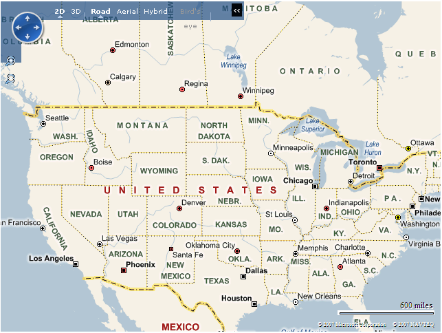
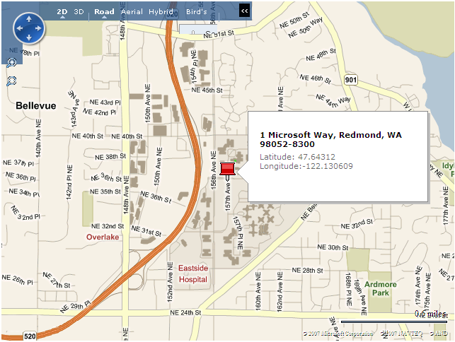
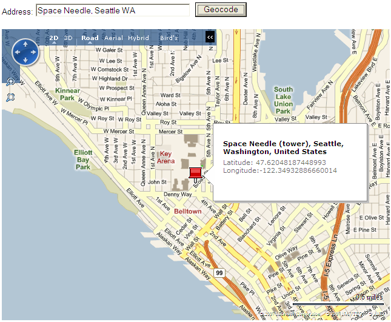
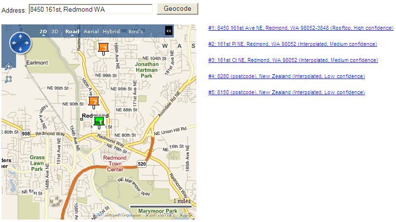
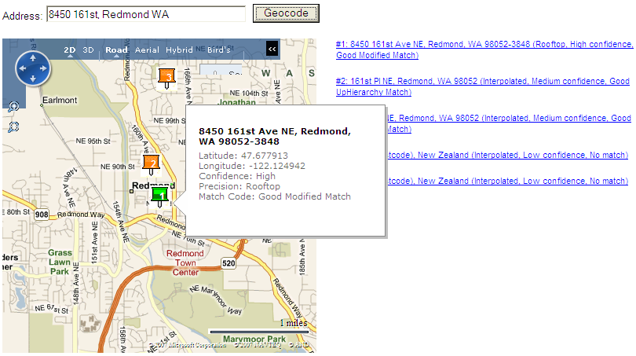

# Getting a Precise Location in Bing Maps
Before this release, the [!INCLUDE[ve_product_name](../articles/includes/ve-product-name-md.md)] geocoding engine used a common and simple interpolation scheme. In essence, if the geocoding engine knew that the 1300 block of Main Street started at position (X1,Y1) and ended at (X2,Y2), then 1325 Main Street must be 1/4 of the way between those two points. While useful, that technique can often return results that are imprecise, particularly in areas where homes are not evenly spaced.  
  
 Developers who wanted more precise geocoding had an option, which is to use the [!INCLUDE[mws_product_name](../articles/includes/mws-product-name-md.md)] (MWS) to get the precise location of a street address, as described in the [Precise Geocoding with MapPoint Web Service and Bing Maps](../articles/precise-geocoding-with-mappoint-web-service-and-bing-maps.md) article.  
  
 This release of the [!INCLUDE[vemc_product_name](../articles/includes/vemc-product-name-md.md)] has a number of upgrades, including improved geocoding for the UK and Canada, improved address parsing, and a unified geocoding layer built into the [!INCLUDE[ve_product_name](../articles/includes/ve-product-name-md.md)] backend architecture that allows multiple address parsers and geocoding engines to be leveraged in order to return the most accurate information available, all through a call to the **VEMap.Find** method. This article looks at the new functionality available to developers in [!INCLUDE[ve_product_abbr](../articles/includes/ve-product-abbr-md.md)] 6.3 by developing a sample application that explores the geocoding functionality.  
  
## Displaying a Map  
 Geocoding functionality is exposed through the **Find** method of the **VEMap** class, so we’ll start by creating a map. The following code is boilerplate HTML and JavaScript to load a map. Save this code as *GeoCodeTest.htm*, we’ll be adding to it as we go along.  
  
```  
<html >  
   <head>  
      <meta http-equiv="Content-Type" content="text/html; charset=utf-8">  
      <title>Geocoding in Bing Maps</title>  
      <script type="text/javascript" src="http://ecn.dev.virtualearth.net/mapcontrol/mapcontrol.ashx?v=6.3"></script>  
  
      <script type="text/javascript">  
         var myMap = null;  
  
         function LoadMap()  
         {  
            myMap = new VEMap("mapDiv");  
            myMap.LoadMap();  
         }  
  
         function UnloadMap()  
         {  
            if (myMap != null) {  
               myMap.Dispose();  
            }  
         }  
      </script>  
   </head>  
   <body onload="LoadMap()" onunload="UnloadMap()">  
      <div style="position:relative;width:640px;height:480px;" id="mapDiv" />  
   </body>  
</html>  
```  
  
 If you open this file in your browser, you should see something like the following.  
  
   
  
## Finding the Address  
 The first step is to define the parameters necessary for the **VEMap.Find** method. With 11 different arguments, including an optional callback, and a couple of different modes of use, it is easily the most complicated function in the [!INCLUDE[vemc_product_name](../articles/includes/vemc-product-name-md.md)] API As such, it’s worth taking a couple minutes to take a close look.  
  
 The function signature follows and a description of the various arguments follows, particularly as pertains to geocoding.  
  
```  
VEMap.Find(what, where, findType, shapeLayer, startIndex, numberOfResults, showResults, createResults, useDefaultDisambiguation, setBestMapView, callback);  
```  
  
|Parameter|Description|  
|---------------|-----------------|  
|*what*|A string containing the name of the business or entity for which the search is conducted. Either this parameter or the *where* parameter must be supplied. Since we are looking for an address, we set this parameter to **null**.|  
|*where*|A string containing the address for which the search is conducted.|  
|*findType*|The only currently supported value is **VEFindType.Businesses**. Since this parameter is optional, we set this parameter to **null**.|  
|*shapeLayer*|A reference to a **VEShapeLayer** object for a *what* search. Since this parameter is optional, we set this parameter to **null**.|  
|*startIndex*|An optional parameter only used for a *what* search. We set this parameter to **null**.|  
|*numberOfResults*|An optional parameter only used for a *what* search. We set this parameter to **null**.|  
|*showResults*|A Boolean value that specifies whether the results are shown on the map. Since *where* search results are shown automatically only under specific circumstances, so we specify **false** here and handle the display manually through the callback function.|  
|*createResults*|A Boolean value that specifies whether pushpins are created. Since *where* search results are not created anyway, we will specify **false** here and create the pushpins through the callback function.|  
|*useDefaultDisambiguation*|A Boolean value that specifies whether to display a disambiguation dialog box if there is ambiguity in the city, state, or country. If this parameter is **false** the IP address of the user is used to help disambiguate the address. We set this parameter to **false**.|  
|*setBestMapView*|A Boolean value that specifies whether to re-centered the map and zoom to the best view of the results of the geocode.  We set this paramter to **true**.|  
|*callback*|A string containing the name of the function that is called when the search is complete. We set this paramter to **GeocodeCallback**.|  
  
 The following example shows the resulting **Find** call in our **StartGeocoding** function.  
  
```  
function StartGeocoding( address )  
{  
   myMap.Find(null,    // what  
              address, // where  
              null,    // VEFindType (always VEFindType.Businesses)  
              null,    // VEShapeLayer (base by default)  
              null,    // start index for results (0 by default)  
              null,    // max number of results (default is 10)  
              null,    // show results? (default is true)  
              null,    // create pushpin for what results? (ignored since what is null)  
              null,    // use default disambiguation? (default is true)  
              null,    // set best map view? (default is true)  
              GeocodeCallback);  // call back function  
}  
```  
  
## Handling the Results  
 When the **Find** method has finished its request, it does not report the results through a return value. Instead, it invokes the callback function you have specified. That function has the following signature:  
  
```  
Callback(shapeLayer, findResults, places, moreResults, errorMsg);  
```  
  
 Just like with the **Find** method, these parameters have specific semantics when it comes to geocoding, so let’s look a little more closely at them.  
  
|Parameter|Description|  
|---------------|-----------------|  
|*shapeLayer*|A reference to the same **VEShapeLayer** object as specified in the **Find** call. Since that parameter was **null**, this parameter should also be **null**, so we ignore it.|  
|*findResults*|This parameter should be **null** since we set the corresponding paramter to **null** in the **Find** call, so we ignore it.|  
|*places*|An array of **VEPlace** objects representing the geocoding results, and ordered so that the best match comes first. If there are no matches, this parameter is **null**.|  
|*moreResults*|This parameter should be **null** since we set the corresponding paramter to **null** in the **Find** call, so we ignore it.|  
|*errorMsg*|A string containing any error information from executing the geocoding request. It should be **null**.|  
  
 As you can see we ignore all but the third and fifth parameters, *places* and *errorMsg*, respectively.  
  
```  
function GeocodeCallback (shapeLayer, findResults, places, moreResults, errorMsg)  
{  
   // if there are no results, display any error message and return  
   if(places == null)  
   {  
      alert( (errorMsg == null) ? "There were no results" : errorMsg );  
      return;  
   }  
  
   var bestPlace = places[0];  
  
   // Add pushpin to the *best* place  
   var location = bestPlace.LatLong;  
  
   var newShape = new VEShape(VEShapeType.Pushpin, location);  
  
   var desc = "Latitude: " + location.Latitude + "<br>Longitude:" + location.Longitude;  
   newShape.SetDescription(desc);  
   newShape.SetTitle(bestPlace.Name);  
   myMap.AddShape(newShape);  
}  
```  
  
## Testing the Code  
 We can perform a simple test by adding a call to the **StartGeocoding** function in the **LoadMap** function, which is the function that is called as soon as the body of the HTML page is loaded, as follows.  
  
```  
function LoadMap()  
{  
   myMap = new VEMap("mapDiv");  
   myMap.LoadMap();  
  
   StartGeocoding("1 Microsoft Way, Redmond WA");  
}  
```  
  
 Here is the resulting map.  
  
   
  
 Notice how the address displayed in the screen shot has more information (the zip code) than we provided in the code sample. That is because the geocoding engine works to rationalize and fill out the address as part of the process, and it gets returned to you as part of the results. As we shall see shortly, the engine might return multiple possible results, in which case it is useful to know what the rationalized addresses for those different results might be.  
  
## Making our Code Interactive  
 It is not too useful to have the address hardcoded, so before going much further, let’s add the functionality necessary to input an address. First we add a text box in which we can input the address into and add a button to start the geocoding.  Change the body section of your HTML to look like the following.  
  
```  
<body onload="LoadMap()" onunload="UnloadMap()">  
   <div style="font-family:Arial; font-size:10pt">  
      Address:   
      <input id="txtWhere" type="text" style="width:255px" />&nbsp;  
      <input type="button" value="Geocode" onclick="onGeocodeClick()" />  
   </div><br />  
  
   <div style="position:relative;width:640px;height:480px;" id="mapDiv"></div>  
</body>  
```  
  
 The button to start the geocoding invokes the **onGeocodeClick** function, so add that function, as follows.  
  
```  
function onGeocodeClick()  
{  
   myMap.Clear();  
   address = document.getElementById("txtWhere").value;  
   StartGeocoding(address);  
}  
```  
  
 Since we no longer need the hardcoded address test in **loadMap**, remove it, as follows.  
  
```  
function LoadMap()  
{  
   myMap = new VEMap("mapDiv");  
   myMap.LoadMap();  
}  
```  
  
 Now you can load your page, input an address and see the result on the map.  Notice how [!INCLUDE[ve_product_name](../articles/includes/ve-product-name-md.md)] geocoding can handle a lot more than just simple addresses, as shown in the following map.  
  
   
  
## Digging Deeper Into the Results  
 So far we only display the first, and hopefully the best, match for the address, but a **Find** call often returns more than one result. Sometimes those results vary based on the sort of interpolation used (rooftop versus standard), or they can vary based on different interpretations of the address that is supplied, or they could be results from different geocoding engines. Now that we have seen the basic process of geocoding, it is interesting to dig a little deeper into the results we get back.  
  
 We start by adding a bit of HTML to our sample application that will give us a place to show the different results. Change the body tag to look like the following.  
  
```  
<body onload="LoadMap()" onunload="UnloadMap()">  
   <div style="font-family:Arial; font-size:10pt">  
      Address:   
      <input id="txtWhere" type="text" style="width:255px" />&nbsp;  
      <input type="button" value="Geocode" onclick="onGeocodeClick()" />  
   </div><br />  
  
   <div style="position:relative;width:400px;height:400px;" id="mapDiv"></div>  
  
   <div id="resultsDiv" style="font-family:Arial;font-size:8pt;position:relative; top:-400px;left:425px;width:400px"></div>  
</body>  
```  
  
 Next, add some string constants we will use to describe the quality of the geocode results.  
  
```  
var confidenceStrings = [ "High", "Medium", "Low" ];  
var precisionStrings = [ "Interpolated", "Rooftop" ];  
```  
  
 And the references for different icons for various quality of geocodes, as follows.  
  
```  
var pushpinUrls = ["pushpinGreen.gif", "pushpinOrange.gif", "pushpinRed.gif"];  
```  
  
 Here are these pushpins.  
  
   
  
   
  
   
  
 Add some CSS to help manage putting text on top of the icons.  
  
```  
<style type="text/css">  
   .pinText  
   {   
      position:relative;   
      top:-25px;   
      left:2px;  
      width:30px;  
      color:#ffffff;   
      text-align:center;   
      font: bold 12px Arial;   
   }  
</style>  
```  
  
 The **VEPlace** class includes a lot of information, including **Precision** (rooftop or interpolated) and **Confidence** (High, Medium or Low). Update the **GeocodeCallback** function to output the results into the **resultsDiv** and add confidence and precision information for each pushpin, as follows.  
  
```  
function GeocodeCallback(shapeLayer, findResults, places, moreResults, errorMsg)  
{  
   var resHtml = "";  
  
   // if there are no results, display the error message and return  
   if (places == null)  
   {  
      alert( (errorMsg == null) ? "There were no results" : errorMsg );  
      return;  
   }  
  
   // Create an entry for each VEPlace in the result set  
   for (var p = 0; p < places.length; p++)  
   {  
      // Gather some info up front  
      var place = places[p];  
      var location = place.LatLong;  
      var confString = confidenceStrings[place.MatchConfidence];  
      var precString = precisionStrings[place.Precision];  
  
      // create the info box description  
      var desc = "Latitude: " + location.Latitude + "<br/>" +  
                 "Longitude: " + location.Longitude;  
      desc = desc + "<br>Confidence: " + confString;  
      desc = desc + "<br>Precision: " + precString;  
  
      // Create a pin at that location, list the latitude & longitude  
      var pin = new VEShape(VEShapeType.Pushpin, location);  
      pin.SetCustomIcon("<span class='pinText'>" +   
                        (p+1) +   
                        "</span>");  
      pin.SetTitle(place.Name);  
      pin.SetDescription(desc);  
      myMap.AddShape(pin);  
  
      // Add the information to the resultsDiv html, including a link   
      // that recenters the map over the pin  
      resHtml = resHtml +   
                "<p><a href='javascript:myMap.SetCenter(new VELatLong(" +  
                location.Latitude +  
                "," +  
                location.Longitude +  
                "));'>";  
      resHtml = resHtml +   
                "#" + (p+1) +  
                ": " + place.Name +  
                " (" + precString +  
                ", " +   
                confString +  
                " confidence)</a></p>";  
   }  
  
   // set the resultsDev html when we're done.  
   document.getElementById("resultsDiv").innerHTML = resHtml;  
}  
```  
  
 The **VEPlace** object also includes match type information and we will get to that next. For now, you can use this code to test the geocoding results for address. You will see how there are a number of different results that come back from a query, especially an ambiguous one. You even get some you might not expect, as shown in the following map result.  
  
   
  
## Additional Geocoding Information  
 The **VEPlace** object's **MatchCode** property includes information about the type of geocoding match that is available. It can also provide an insight into how the geocoding result was found.  
  
 The MatchCode property consists of bitmap values.  
  
|MatchCode Property Value|Description|  
|------------------------------|-----------------|  
|None|No match was found|  
|Good|A good match was found|  
|Ambiguous|The match was ambiguous|  
|UpHierarchy|A match was found by a broader search|  
|Modified|A match was found, but to a modified place|  
  
 If a match is found, any of the three latter values can be set in the **MatchCode** property. To interpret the match information, add the following function to the sample.  
  
```  
function MatchCode(code)  
{  
   if(code == VEMatchCode.None) {  
      return "No match";  
   }  
  
   var codeDesc = "";  
  
   if(code & VEMatchCode.Good > 0) {  
     codeDesc += "Good ";  
   }  
  
   if(code & VEMatchCode.Ambiguous > 0) {  
     codeDesc += "Ambiguous ";  
   }  
  
   if(code & VEMatchCode.UpHierarchy > 0) {  
     codeDesc += "UpHierarchy ";  
   }  
  
   if(code & VEMatchCode.Modified > 0) {  
     codeDesc += "Modified ";  
   }  
  
   return(codeDesc + "Match");  
}  
```  
  
 Update the **GeocodeCallback** function to include that information.  
  
```  
// create the info box description  
var latitude = location.Latitude;  
var longitude = location.Longitude;  
var mcVal = MatchCode(place.MatchCode);  
  
var desc = "Latitude: " + latitude + "<br>" +  
           "Longitude: " + longitude;  
desc = desc + "<br>Confidence: " + confString;  
desc = desc + "<br>Precision: " +precString;  
desc = desc + "<br>Match Code: " + mcVal;  
```  
  
 Also add this information to the **resultDiv** along the side.  
  
```  
resHtml = resHtml +   
          "<p><a href='javascript:myMap.SetCenter(new VELatLong(" +  
          latitude +  
          "," +  
          longitude +  
          "));'>";  
resHtml = resHtml +   
          "#" +  
          (p+1) +  
          ": " +  
          place.Name +  
          "<br>&nbsp;(" +  
          precString +  
          ", " +  
          confString +  
          " confidence, " +  
          mcVal +  
          ")</a></p>";  
```  
  
 You should get results similar to the following.  
  
   
  
 In the example above, you can see some keywords that will help provide context into how the geocode was found.  
  
 *Modified* refers to a match that was found by making educated changes to the input address. In our example, we only provided **8450 161st, Redmond, WA** and it changed that to **8450 161st Avenue NE**.  
  
 *Uphierarchy* refers to a match that was found by searching on less data Again, in our example, we started with **8450 161st, Redmond, WA** and it attempted a match on **161st Place NE**, specifying just the street and not the specific address.  
  
## Comparing [!INCLUDE[ve_product_name](../articles/includes/ve-product-name-md.md)] Results with [!INCLUDE[vews_product_abbr](../articles/includes/vews-product-abbr-md.md)] Results  
 If you search for the two addresses in the [Precise Geocoding with MapPoint Web Service and Bing Maps](../articles/precise-geocoding-with-mappoint-web-service-and-bing-maps.md) article (10880 Wilshire Blvd Ste 1101, Los Angeles, CA 90024-4112 and 1300 Saratoga Ave Unit 701, Ventura, CA 93003-6407), you get essentially the same results, with much less work.  
  
## Conclusion  
 The [!INCLUDE[mws_product_name](../articles/includes/mws-product-name-md.md)] has access to a powerful geocoding infrastructure that makes available a level of precision previously only available from the [!INCLUDE[vemc_product_name](../articles/includes/vemc-product-name-md.md)] using behind-the-scenes requests. [!INCLUDE[vemc_product_name](../articles/includes/vemc-product-name-md.md)] now exposes this information through the **Find** method, which invokes a callback function and returns an array of **VEPlace** objects, which include:  
  
-   A complete address  
  
-   Latitude and Longitude  
  
-   A measure of confidence  
  
-   The type of match (rooftop or interpolated)  
  
-   Information about how the match was reached, such as by modifiying the address  
  
 In addition, there can be multiple locations for each match result. These were not covered in this article, but they can be useful for comparing the difference between rooftop and interpolated results.  
  
 This article was written by Jeff House. Jeff is a software architect at Advaiya.  
  
## Complete Code Listing  
 Here is the complete code listing.  
  
```  
<html >  
   <head>  
      <meta http-equiv="Content-Type" content="text/html; charset=utf-8">  
      <title>Geocoding in Bing Maps</title>  
      <script type="text/javascript" src="http://ecn.dev.virtualearth.net/mapcontrol/mapcontrol.ashx?v=6.3"></script>  
  
      <script type="text/javascript">  
         var myMap = null;  
  
         var confidenceStrings = ["High", "Medium", "Low"];  
         var precisionStrings  = ["Interpolated", "Rooftop"];  
  
         var pushpinUrls       = ["pushpinGreen.gif", "pushpinOrange.gif", "pushpinRed.gif"];  
  
         function LoadMap()  
         {  
            myMap = new VEMap("mapDiv");  
            myMap.LoadMap();  
         }  
  
         function UnloadMap()  
         {  
            if (myMap != null) {  
               myMap.Dispose();  
            }  
         }  
  
         function StartGeocoding(address)  
         {  
            myMap.Find(null,         // what  
                  address,           // where  
                  null,              // VEFindType (always VEFindType.Businesses)  
                  null,              // VEShapeLayer (base by default)  
                  null,              // start index for results (0 by default)  
                  null,              // max number of results (default is 10)  
                  null,              // show results? (default is true)  
                  null,              // create pushpin for what results? (ignored since what is null)  
                  null,              // use default disambiguation? (default is true)  
                  null,              // set best map view? (default is true)  
                  GeocodeCallback);  // call back function  
         }  
  
         function GeocodeCallback(shapeLayer, findResults, places, moreResults, errorMsg)  
         {  
            var resHtml = "";  
  
            // if there are no results, display the error message and return  
            if (places == null)  
            {  
               alert( (errorMsg == null) ? "There were no results" : errorMsg );  
               return;  
            }  
  
            // Create an entry for each VEPlace in the result set  
            for (var p = 0; p < places.length; p++)  
            {  
               // Gather some info up front  
               var place = places[p];  
               var location = place.LatLong;  
               var confString = confidenceStrings[place.MatchConfidence];  
               var precString = precisionStrings[place.Precision];  
               var mcVal = MatchCode(place.MatchCode);  
               var latitude = location.Latitude;  
               var longitude = location.Longitude;  
  
               // create the info box description  
               var desc = "Latitude: " + latitude + "<br/>" +  
                          "Longitude: " + longitude;  
               desc = desc + "<br>Confidence: " + confString;  
               desc = desc + "<br>Precision: " + precString;  
               desc = desc + "<br>Match Code: " + mcVal;  
  
               // Create a pin at that location, list the latitude & longitude  
               var pin = new VEShape(VEShapeType.Pushpin, location);  
               pin.SetCustomIcon("<span class='pinText'>" +   
                                 (p+1) +   
                                 "</span>");  
               pin.SetTitle(place.Name);  
               pin.SetDescription(desc);  
               myMap.AddShape(pin);  
  
               // Add the information to the resultsDiv html, including a link   
               // that recenters the map over the pin  
               resHtml = resHtml +   
                         "<p><a href='javascript:myMap.SetCenter(new VELatLong(" +  
                         latitude +  
                         "," +  
                         longitude +  
                         "));'>";  
               resHtml = resHtml +   
                         "#" + (p+1) +  
                         ": " + place.Name +  
                         " (" + precString +  
                         ", " +  
                         confString +  
                         " confidence, " +  
                         mcVal +  
                         ")</a></p>";  
            }  
  
            // set the resultsDev html when we're done.  
            document.getElementById("resultsDiv").innerHTML = resHtml;  
         }  
  
         function MatchCode(code)  
         {  
            if(code == VEMatchCode.None) {  
               return "No match";  
            }  
  
            var codeDesc = "";     
            var cVal;  
  
            cVal = code & VEMatchCode.Good;  
            if(cVal > 0) {  
              codeDesc += "Good ";  
            }  
  
            cVal = code & VEMatchCode.Ambiguous;  
            if(cVal > 0) {  
              codeDesc += "Ambiguous ";  
            }  
  
            cVal = code & VEMatchCode.UpHierarchy;  
            if(cVal > 0) {  
              codeDesc += "UpHierarchy ";  
            }  
  
            cVal = code & VEMatchCode.Modified;  
            if(cVal > 0) {  
              codeDesc += "Modified ";  
            }  
  
            return(codeDesc + "Match");  
         }  
  
         function onGeocodeClick()  
         {  
            myMap.Clear();  
            address = document.getElementById("txtWhere").value;  
            StartGeocoding(address);  
         }  
      </script>  
      <style type="text/css">  
         .pinText  
         {   
            position:relative;   
            top:-25px;   
            left:2px;  
            width:30px;  
            color:#ffffff;   
            text-align:center;   
           font: bold 12px Arial;   
         }  
      </style>  
   </head>  
   <body onload="LoadMap()" onunload="UnloadMap()">  
      <div style="font-family:Arial; font-size:10pt">  
         Address:   
         <input id="txtWhere" type="text" style="width:255px" />&nbsp;  
         <input type="button" value="Geocode" onclick="onGeocodeClick()" />  
      </div><br />  
  
      <div style="position:relative;width:400px;height:400px;" id="mapDiv"></div>  
  
      <div id="resultsDiv" style="font-family:Arial;font-size:8pt;position:relative; top:-400px;left:425px;width:400px"></div>  
   </body>  
</html>  
```