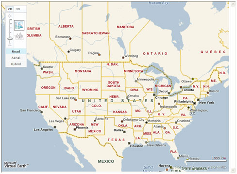
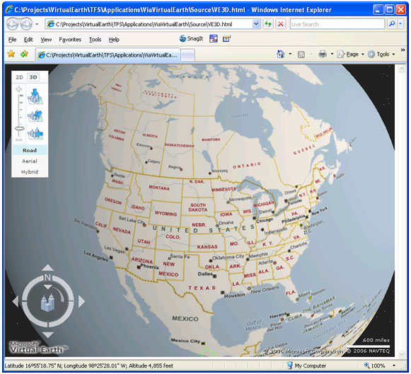
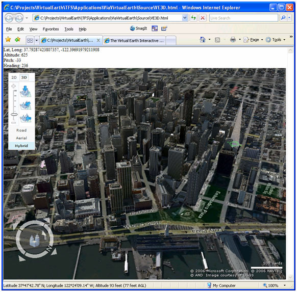
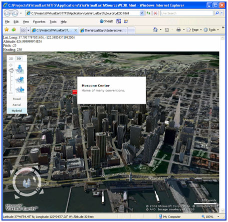
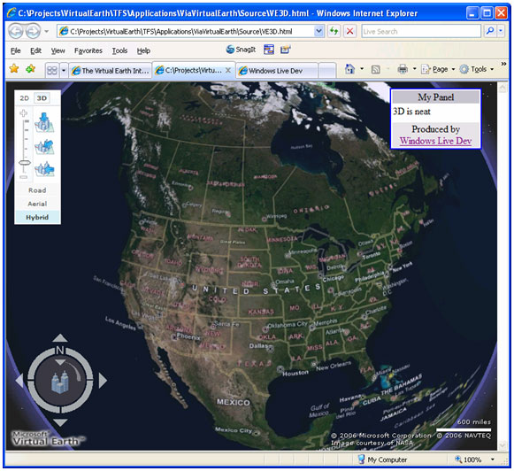

# Getting Started With Bing Maps 3D
> [!CAUTION]
>  The content in this article may still be applicablfe to the current version of the [!INCLUDE[vemc_product_name](../articles/includes/vemc-product-name-md.md)], but it uses a previous version of the [!INCLUDE[vemc_product_name](../articles/includes/vemc-product-name-md.md)] which is no longer supported. More information about the current version of the [!INCLUDE[vemc_product_name](../articles/includes/vemc-product-name-md.md)] is found in the [Bing Map Control SDK](http://msdn.microsoft.com/en-us/library/bb429619.aspx).  
  
 With Microsoft’s release of 3D imagery for [!INCLUDE[ve_product_name](../articles/includes/ve-product-name-md.md)], you have a whole new world to explore as a developer.  In this article, we will examine the basics of how to get started with 3D and how to leverage some of its amazing capabilities.  
  
 Before you continue with this article, you should be familiar with the basics of [!INCLUDE[ve_product_name](../articles/includes/ve-product-name-md.md)] in 2D.  You can read more in [Getting Started with V4 of the API (Part 1)](../articles/getting-started-with-v4-of-the-api-part-1.md) and [Getting Started with V4 of the API (Part 2)](../articles/getting-started-with-v4-of-the-api-part-2.md).  
  
## From 2D to 3D  
 The [!INCLUDE[ve3d_product_name](../articles/includes/ve3d-product-name-md.md)] control is an ActiveX plugin that you must download into your Internet Explorer browser.  Start with your basic [!INCLUDE[ve_product_name](../articles/includes/ve-product-name-md.md)] map page:  
  
```  
<html>  
  <head>  
    <script src="http://dev.virtualearth.net/mapcontrol/v4/mapcontrol.js"></script>  
    <script type='text/javascript'>  
      var map = null;  
  
      function setup()  
      {  
        map = new VEMap('mymap');  
        map.LoadMap();  
     }  
  
    </script>  
  </head>  
  <body onload="setup();">  
    <div id="mymap" style="position:absolute;width:800px;height:600px;"></div>  
  </body>  
</html>  
```  
  
 *Listing 1 A basic [!INCLUDE[ve_product_abbr](../articles/includes/ve-product-abbr-md.md)] Map Page (VE3D.html)*  
  
 If you load this page into Internet Explorer, you will see a basic [!INCLUDE[ve_product_name](../articles/includes/ve-product-name-md.md)] map:  
  
   
  
 Figure 1 *The Basic 2D Map*  
  
 Click on the 3D link in the navigation control to switch to 3D mode.  If you haven’t used 3D mode before, you will be asked to download and install a control from Microsoft.  The process for downloading the control is as follows, but may vary depending on your security settings:  
  
1.  Click on the 3D link in the navigation control  
  
2.  Verify that your system meets the performance requirements, and then click Install on the “Install [!INCLUDE[ve3d_product_name](../articles/includes/ve3d-product-name-md.md)] (Beta)” popup window.  
  
3.  Choose “Run” on the File Download – Security Warning popup.  
  
4.  Choose “Run” on the Internet Explorer – Security Warning popup.  
  
5.  Read and accept the End User License Agreement  
  
6.  Click Run on the File Download – Security Warning popup for the VE3DInstaller.  
  
7.  Click Run on the Internet Explorer – Security Warning popup for [!INCLUDE[ve3d_product_name](../articles/includes/ve3d-product-name-md.md)].  
  
8.  In the [!INCLUDE[ve3d_product_name](../articles/includes/ve3d-product-name-md.md)] (Beta) setup wizard, click Next  
  
9. Choose whether you want to add shortcuts or change your home page or search service, and then click next.  
  
10. Click Close to finish the installation.  
  
 Once you have 3D installed, your basic map will look very different.  
  
   
  
 Figure 2 *The Basic Map in 3D*  
  
 Note that by switching to 3D mode, you automatically display several new controls.  For example, the navigation control now contains preset links to three different view points (top down, oblique, and horizon).  Also, you have a new navigation control in the lower left corner which allows you to control the 3D navigation.  Finally, the status text at the bottom of your browser now displays the latitude, longitude, altitude of the area of the map under the cursor, and current status of loading the view.  
  
### Programmatically Switching to 3D  
 You can switch between 2D and 3D modes using some new JavaScript commands on the `VEMap` control.  
  
```  
map.SetMapMode(VEMapMode.Mode3D);  
```  
  
 *Listing 2 Switch from 2D to 3D*  
  
 If your user has the 3D control loaded, the view switch occurs automatically.  If they have not loaded the control, they will be prompted to do so.  If your user is using a non-supported browser, then the view switch will automatically be aborted.  
  
 You can switch back to 2D mode by using the other value in the `VEMapMode` enumeration:  
  
```  
map.SetMapMode(VEMapMode.Mode2D);  
```  
  
 *Listing 3 Switching back to 2D*  
  
### Map Mode Events  
 As part of the process of switching view modes, you also have access to two events.  The first event, `oninitmode`, fires after the mode has been reset to either 2D or 3D.  You can use a callback on this method to change your control display for the different modes.  
  
```  
function setup()  
{  
  map = new VEMap('mymap');  
  map.LoadMap();  
  map.AttachEvent('oninitmode', doModeChange);  
}  
  
function doModeChange()  
{  
  var mode = map.GetMapMode();  
  if (mode==VEMapMode.Mode2D) mode='2D Mode';  
  else if (mode==VEMapMode.Mode3D) mode='3D Mode';  
  alert('You are now in ' + mode +'.');  
}  
```  
  
 *Listing 4 A mode change callback*  
  
 The second event, `onmodenotavailable`, fires only when a mode change is impossible.  This event is triggered when the browser won't support 3D mode, or the user cancels installation of the 3D control.  
  
### Navigation in 3D  
 As you might imagine, controlling the view in 3D mode is slightly more complicated than 2D mode.  Not only do you have to provide latitude, longitude, and style, you also have to provide the altitude, pitch and viewing direction.  All of these values are set in a `VEMapViewSpecification` object.  Once you have your view specification, you pass it into the map using the `SetMapView()` method.  
  
### Finding Altitude, Pitch and Heading  
 The first question is to figure out what sort of value you need to pass in for altitude heading and pitch.  Fortunately, you can extract these values from your map object.  Using the following code, you can find the latitude, longitude, altitude, pitch and heading for any 3D view:  
  
```  
<html>  
  <head>  
    <script src="http://dev.virtualearth.net/mapcontrol/v4/mapcontrol.js"></script>  
    <script type='text/javascript'>  
      var map = null;  
  
      function setup()  
      {  
        map = new VEMap('mymap');  
        map.LoadMap();  
        map.SetMapMode(VEMapMode.Mode3D);  
        map.AttachEvent("onchangeview", SetInfoBlock);  
      }  
      function SetInfoBlock(e)  
      {  
        var info = "Lat, Long: " + map.GetCenter()  
        + "<br>Altitude: " + map.GetAltitude()  
        + "<br>Pitch: " + map.GetPitch()  
        + "<br>Heading: " + map.GetHeading();  
        document.getElementById("info").innerHTML = info;  
  }  
  
    </script>  
  </head>  
  <body onload="setup();">  
      <div id="info" style="position:relative;height:50px;font-size:10pt"></div>  
    <div id="mymap" style="position:absolute;width:800px;height:600px;"></div>  
  </body>  
</html>  
```  
  
 *Listing 5 VE3D Displaying View Specification*  
  
 Once we load up the page and find a nice view, we should see our view specification values above the map:  
  
   
  
 Figure 3 *Viewing The Specification*  
  
 Altitude is roughly the altitude of the camera in meters.  The value is always set and retrieved in meters, so you would have to convert to feet by multiplying times 3.2808399.  
  
 The pitch is the angle of the camera view with respect to the current earth surface.  If you imagine a straight line from the camera projecting into the map, the angle between that line and the "drop shadow" version of that line is the pitch.  However, Pitch is measured from 0 (horizon view) to -90 degrees (straight down top view).  Most of the time, you will want a pitch of between 30 and 45 degrees for the best looking views.  Anything less than about 20 degrees creates a degree of visual distortion that many people find disorienting.  Anything over 60 degrees and you are basically looking at a 2D view.  
  
 Heading is simply the current compass heading of the view.  A value of 0 is true north, 90 is due east, 180 is due south, and 270 is due west.  In Figure 3, the heading is 236 degrees, which means the camera is looking roughly southwest (or, if you are familiar with the area, pretend you are standing in the parking lot of the Lawrence Hall of Science on the UC Berkeley campus, looking into downtown San Francisco on a clear day with a nice telescope).  
  
### Setting the View Programmatically  
 Now that we can find the altitude, pitch and heading information, the next step is to set our view programmatically.  If we add the following lines of code to the end of the `setup()` function in Listing 5, we can automatically zoom to the view in Figure 3:  
  
```  
map.SetMapStyle(VEMapStyle.Hybrid);  
map.SetMapView(new VEMapViewSpecification(new VELatLong(37.7931, -122.3965),   
  null, 625, -25, 236);  
```  
  
 *Listing 6 Setting the View*  
  
 Note that we have to make one call to switch the style to hybrid view, and a separate call to set the view.  
  
### Pushpins, Polygons and Polylines  
 Adding and removing pushpins, polygons and polylines works the same in 3D as in 2D.  However, the display is a little different because of the 3D surface mapping and new view options.  In other words, you can add pushpins, polygons and polylines as normal, but they may not look quite like you expect.  
  
### Pushpins  
 A pushpin on a 3D map is drawn as a 2D icon at the altitude of whatever is at the current latitude and longitude.  For example, if you put a pushpin on the site of the Moscone convention center, it appears behind all of the sky scrapers in down town San Francisco.  
  
```  
map.AddPushpin(new VEPushpin(1, new VELatLong(37.783774022456946, -122.40464687347415),  
  null, "Moscone Center", "Home of many conventions."));  
```  
  
 *Listing 7 Adding a pushpin*  
  
 As you move the view around, the pushpin is always drawn as a two dimensional icon facing the camera.  In other words, the pushpin will always display as a flat 2D object, regardless of how the pitch or heading are set.  
  
   
  
 Figure 4 *A pushpin in 3D*  
  
 Depending on how you rotate the view, the pushpin may disappear behind buildings.  In some cases, a pushpin may appear to be partially embedded inside a building.  
  
### Polygons and Polylines  
 Polygons and polylines are affected by the 3D surface of the underlying map, as well as the view.  As you change your pitch angle, a polygon will skew to match the projection of the camera view.  For instance, if you draw a square, it will only look like a square if you are using a pitch of -90 (straight down).  As you move to a pitch of 0 (horizon), the square will start to "squish" into a rectangle, and then eventually a single line.  
  
 Additionally, if your square is drawn over a mountain range, the edges will not appear flat because of the underlying surface texture.  In 3D mode, you are not drawing a polygon on a flat map.  Instead, you are drawing on the underlying terrain.  
  
 The "worst case scenario" for visual representation of a simple polygon is therefore a low angle oblique view of a regular polygon drawn on rugged terrain:  
  
   
  
 Figure 5 *A Rectangle On Mountains at a Low Pitch*  
  
 Note that the rectangle appears as more of a trapezoid because of the pitch and the curvature of the earth.  Also, the ripple in the lines is because of the elevation change.  For example, the middle of the right hand border cuts across several 14,000 foot peaks, while the lower right corner is the San Louis valley, which is roughly 7000 feet.  Naturally, the distortion due to elevation becomes more noticeable the closer you zoom in, and the lower your pitch.  
  
### Adding Controls in 3D  
 The [!INCLUDE[ve3d_product_name](../articles/includes/ve3d-product-name-md.md)] map control is an ActiveX control.  Unfortunately, that means that Internet Explorer draws the map over the top of any HTML controls drawn on the page.  In practical terms, this means that the normal mechanisms you used to overlay controls on a 2D map do not work the same way for a 3D map.  Fortunately, you can use the simple work around of encapsulating your controls in an \<iframe> shim.  Since Internet Explorer treats an \<iframe> as a separate window, your controls will be drawn over the top of your 3D map.  
  
### The iFrame Wrapper  
 The easiest way to encapsulate your objects in an iFrame is to use a JavaScript method that creates the frame and inserts it into your object model:  
  
```  
function addShim(el)  
{  
  var shim = document.createElement("iframe");  
  shim.id = "myShim";  
  shim.frameBorder = "0";  
  shim.style.position = "absolute";  
  shim.style.zIndex = "1";  
  shim.style.top  = el.offsetTop;  
  shim.style.left = el.offsetLeft;  
  shim.width  = el.offsetWidth;  
  shim.height = el.offsetHeight;  
  el.shimElement = shim;  
  el.parentNode.insertBefore(shim, el);  
}  
```  
  
 *Listing 8 AddShim method*  
  
 You can use this method as follows:  
  
```  
function AddMyControl()  
{  
  var panelHead = "<table border=0 width='100%'>" +  
        "<tr><td bgcolor='#C0C0CF'><p align='center'>My Panel</p></td></tr>"  
  var panelFoot = "<tr><td bgcolor='#E0E0E0'><p align='center'>Produced by <br>" +  
        "<a href='http://dev.live.com/virtualearth/articles.aspx?app=virtual_earth'>  
         Windows Live Dev</a>"+  
        "</td></tr>" +  
        "</table>";  
  var panelEmptyContent = "<tr><td>3D is neat</td></tr>" +  
        "<tr><td> </td></tr>" +  
        "<tr><td> </td></tr>";  
  
  var panel = document.createElement("div");  
  
  panel.id = "myControl";  
  panel.style.top = "10px";  
  panel.style.left = "625px";  
  panel.style.width = "150px";  
  panel.style.border = "2px solid blue";  
  panel.style.background = "White";  
  panel.innerHTML = panelHead + panelEmptyContent + panelFoot;  
  map.AddControl(panel);  
  addShim(panel);  
}  
```  
  
 *Listing 9 Adding a Control*  
  
 Note that we insert the iFrame after adding our base control to the map.  If we add the iFrame first, the panel is actually drawn behind the control.  
  
   
  
 Figure 6 *Custom control on 3D*  
  
### Conclusion  
 Mastering the 3D map control gives you a whole new range of options for your [!INCLUDE[ve_product_name](../articles/includes/ve-product-name-md.md)] mashups and applications.  Whether you simply want to switch to 3D from 2D, or use 3D to create new visualizations of your data, you can leverage the basic methods described in this article.  
  
 This article was written by [Robert McGovern MVP (Bing Maps/MapPoint)](https://mvp.support.microsoft.com/profile=A9159573-40DB-4BD1-A079-D57C675E1766) from [Infusion Development](http://www.infusiondev.com/technology/Microsoft/MapPoint.htm).