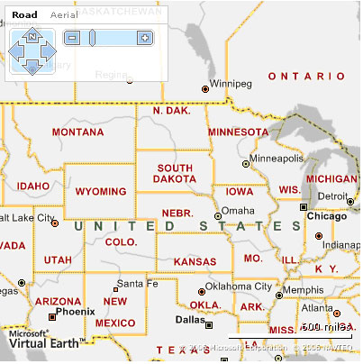
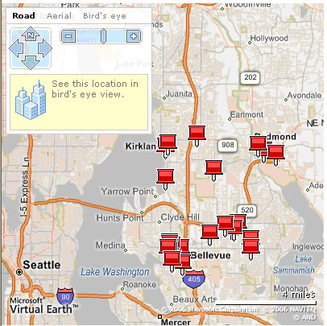
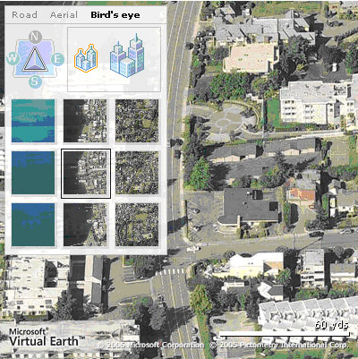
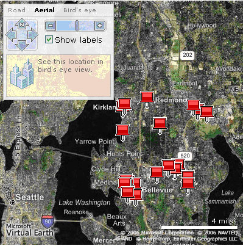

# Getting Started with Bing Maps in Java
> [!CAUTION]
>  The content in this article may still be applicable to the current version of the [!INCLUDE[vemc_product_name](../articles/includes/vemc-product-name-md.md)], but it uses a previous version of the [!INCLUDE[vemc_product_name](../articles/includes/vemc-product-name-md.md)] which is no longer supported. More information about the current version of the [!INCLUDE[vemc_product_name](../articles/includes/vemc-product-name-md.md)] is found in the [Bing Map Control SDK](http://msdn.microsoft.com/en-us/library/bb429619.aspx).  
  
 Microsoft's [!INCLUDE[ve_platform_name](../articles/includes/ve-platform-name-md.md)] provides unique and extensive mapping features for visualizing location and location based information.  The [!INCLUDE[vemc_product_name](../articles/includes/vemc-product-name-md.md)] API consists of a set AJAX based components for gathering information from a user and seamlessly displaying maps, locations and driving directions.  The [!INCLUDE[mws_product_name](../articles/includes/mws-product-name-md.md)] compliments [!INCLUDE[ve_product_name](../articles/includes/ve-product-name-md.md)] by providing additional functions for performing proximity searches.  In this article, you will learn how to use [!INCLUDE[ve_product_name](../articles/includes/ve-product-name-md.md)] ([!INCLUDE[ve_product_abbr](../articles/includes/ve-product-abbr-md.md)]) and the [!INCLUDE[mws_product_name](../articles/includes/mws-product-name-md.md)] ([!INCLUDE[mws_product_abbr](../articles/includes/mws-product-abbr-md.md)]) to create a simple JSP web application that allows users to find store locations on a map.  
  
## Requirements  
 Before you can run the code described in this article, you must install and configure the following applications:  
  
-   [Java 1.4](http://java.sun.com/j2se/1.4.2/datasheet.1_4.html) or higher  
  
-   [Apache Tomcat 5.5](http://tomcat.apache.org/)  
  
-   [Jakarta Commons HttpClient 3.0](http://jakarta.apache.org/commons/httpclient/)  
  
-   [Axis 1.3](http://ws.apache.org/axis/)  
  
 You will need to follow the basic setup and installation instructions for each of the required systems, as installation will not be discussed in this article.  
  
### Introduction  
 In early fall of 2005, Microsoft released the [!INCLUDE[ve_product_name](../articles/includes/ve-product-name-md.md)] platform.  [!INCLUDE[ve_product_name](../articles/includes/ve-product-name-md.md)] changes the way users interact with map applications by providing real time rendering and display.  By leveraging Asynchronous Java and XML (AJAX), [!INCLUDE[ve_product_abbr](../articles/includes/ve-product-abbr-md.md)] pre-renders map tiles and retrieves locations in real-time, allowing users to smoothly drag and drop maps, change map types and zoom without any significant server delay or page refreshes.  
  
 Working with satellite and aerial imagery providers, [!INCLUDE[ve_product_abbr](../articles/includes/ve-product-abbr-md.md)] also ushers in two new ways to display a map:  aerial and oblique imagery.  Both types of imagery create an advanced user experience with high-resolution images of actual buildings, either using a top down aerial image (satellite or airplane imagery) or a 45 degree view from 50 or 100 yards away (oblique imagery).  
  
 The [!INCLUDE[ve_product_name](../articles/includes/ve-product-name-md.md)] platform complements Microsoft's established [!INCLUDE[mws_product_name](../articles/includes/mws-product-name-md.md)] by providing advanced user interface options.  The [!INCLUDE[mws_product_name](../articles/includes/mws-product-name-md.md)] still provides classic SOAP enabled web service functions for mapping, routing, and searching.  
  
 In this article, we will use the [!INCLUDE[ve_product_abbr](../articles/includes/ve-product-abbr-md.md)] and the [!INCLUDE[mws_product_abbr](../articles/includes/mws-product-abbr-md.md)] platforms to create a store locator using Java and JSP technologies.  
  
### AJAX  
 Almost all business web applications require a communication channel with server side code.  Historically, Web applications brokered the communication channel through "GET" and "POST" HTTP communication.  Using a postback request to the server, a Web application would send a "GET" or "POST" request and wait for a response.  A postback is what occurs when a form gets submitted to the server by an event that is triggered on the screen, such as a button click.  A user might see their Web browser flash to a white screen or loading page while waiting for the Web server to respond and the Web application to process the response.  User's wait times would vary, but the experience never changed:  
  
1.  A user performs some action (e.g. submit a form)  
  
2.  The action triggers a postback to the server.  
  
3.  The server generates an updated version of the original web page, causing a delay that might be short or long.  
  
4.  The user sees the updated web page.  
  
 The postback mechanism forced web applications to offer a different experience than traditional desktop applications that are "continuously responsive".  To overcome this limitation, many web developers have turned to a new combination of older technologies.  
  
 AJAX combines JavaScript, HTML, CSS, and XML to allow Web applications to communicate with server side code without executing a postback.  With AJAX, the client side code communicates with the server side code asynchronously using the XMLHTTPRequest JavaScript object.  The XMLHTTPRequest object allows developers to transmit highly focused requests (rather than a full page) and receive fragments of data in return.  Leveraging the JavaScript Document Object Model (DOM), the page can perform a partial refresh and only change the relevant portions.  
  
 Since an AJAX enabled web application no longer needs to transmit or receive the entire page in a postback, the server only needs to process a small request and return a small result set.  This results in much faster request-response roundtrips and makes the web application more fluid.  Please see [Microsoft’s ASP.NET Spiced](http://msdn.microsoft.com/library/default.asp?url=/library/en-us/dnaspp/html/ASPNetSpicedAjax.asp) or [IBM’s Introduction to AJAX](http://www-128.ibm.com/developerworks/web/library/wa-ajaxintro1.html) for more information regarding AJAX and its usage.  
  
### [!INCLUDE[ve_product_name](../articles/includes/ve-product-name-md.md)]  
 The [!INCLUDE[ve_platform_name](../articles/includes/ve-platform-name-md.md)] combines satellite and aerial imagery with AJAX technology to create a unique mapping experience for customers. [!INCLUDE[ve_product_abbr](../articles/includes/ve-product-abbr-md.md)] allows you to create mapping solutions that:  
  
-   Display high resolution satellite images, including oblique ("Bird's Eye") imagery.  
  
-   Pan and zoom the map in real time, without causing the user to experience a postback or page refresh.  
  
-   Use Microsoft's Yellow Pages search feature to find nearby businesses, attractions, and landmarks.  
  
-   Display satellite based driving directions.  
  
-   Integrate with GeoRSS feeds to display blog information tied to geographic points.  
  
 The [!INCLUDE[ve_product_abbr](../articles/includes/ve-product-abbr-md.md)] API consists of the JavaScript map control and local search services.  A [!INCLUDE[mws_product_name](../articles/includes/mws-product-name-md.md)] contract is required in order to access the [!INCLUDE[ve_product_abbr](../articles/includes/ve-product-abbr-md.md)] API, which is described below in Set Up an [!INCLUDE[mws_product_abbr](../articles/includes/mws-product-abbr-md.md)] Development Account.  The most basic map view is a map of the United States with a navigation control on the top that allows you to pan and zoom.  
  
 Although [!INCLUDE[ve_product_abbr](../articles/includes/ve-product-abbr-md.md)] provides many overlapping features with the traditional MWS, [!INCLUDE[ve_product_abbr](../articles/includes/ve-product-abbr-md.md)] does not replace MWS.  Instead, [!INCLUDE[ve_product_abbr](../articles/includes/ve-product-abbr-md.md)] relies on [!INCLUDE[mws_product_abbr](../articles/includes/mws-product-abbr-md.md)] to connect with your custom Points of Interest (POI) data source.  Please see [Using MapPoint Web Service in a Web Application](http://go.mappoint.net/mappointmpac/default.aspx?main=article.aspx&id=J10006) for more information on MWS.  
  
### Building a [!INCLUDE[ve_product_abbr](../articles/includes/ve-product-abbr-md.md)] Store Locator  
 As mentioned in the Introduction, the [!INCLUDE[ve_product_name](../articles/includes/ve-product-name-md.md)] and [!INCLUDE[mws_product_name](../articles/includes/mws-product-name-md.md)] platforms allow you to create mapping applications using high resolution satellite imagery, AJAX, and SOAP technology.  Since both AJAX and SOAP are language neutral platforms, you can create your application using any technology that supports AJAX communication and SOAP based web services.  In the case of this article, we will create a [!INCLUDE[ve_product_abbr](../articles/includes/ve-product-abbr-md.md)] store locator using Java and JSP.  The locator will leverage Microsoft's Fourth Coffee Shop sample data source.  This sample data source contains addresses for a large number of geographically distributed coffee shops belonging to a fictitious company.  
  
### Workflow  
 The [!INCLUDE[ve_product_abbr](../articles/includes/ve-product-abbr-md.md)] store locator's workflow can be described in two different perspectives as illustrated by Figure 1: the user and the code.  
  
   
  
 Figure 1 - *VE Application Workflow*  
  
 The user will:  
  
1.  Load the application onto the screen which will display a map of the US and an address form.  
  
2.  Enter an address.  
  
3.  Click on Submit.  
  
4.  View the pushpins that appear on the map for the nearby Fourth Coffee store locations.  
  
 As the user is interacting with the system, the code will:  
  
1.  Initialize VEMap object and load map onto the page.  The map control is a JavaScript object that will contain the map image.  
  
2.  Address entered is used to find a list of nearby locations to display to the user  
  
3.  Application processes address and uses AJAX to communicate asynchronously to VE. [!INCLUDE[mws_product_abbr](../articles/includes/mws-product-abbr-md.md)] executes the geocoding for the user's address and executes the FindNearby method to return the nearest locations to the user's address.  
  
4.  VE parses the results from [!INCLUDE[mws_product_abbr](../articles/includes/mws-product-abbr-md.md)] and creates a map to display the locations.  Using AJAX, [!INCLUDE[ve_product_abbr](../articles/includes/ve-product-abbr-md.md)] updates the map based on the returned, and places pushpins on the map to identify each location, without posting back the application.  
  
### File Layout  
 In order to build the [!INCLUDE[ve_product_abbr](../articles/includes/ve-product-abbr-md.md)] Store locator, you need to create 4 files:  
  
1.  **index.jsp** – Index.jsp will provide the user with a start page to enter their address.  This page will also display the [!INCLUDE[ve_product_abbr](../articles/includes/ve-product-abbr-md.md)] map and all the results for the application.  
  
2.  **mappoint.properties** – The mappoint.properties file will store the credentials the application uses to connect with [!INCLUDE[mappoint_product_name](../articles/includes/mappoint-product-name-md.md)]data sources.  
  
3.  **FindAddress.java** – The `FindAddress` class will invoke [!INCLUDE[mws_product_abbr](../articles/includes/mws-product-abbr-md.md)] to geocode the address a user specifies, find nearby Fourth Coffee Shop locations, and generate the data [!INCLUDE[ve_product_abbr](../articles/includes/ve-product-abbr-md.md)] uses to display the locations on the map.  
  
4.  **ConfigSingleton.java** – ConfigSingleton.java stores a single instance of the [!INCLUDE[mappoint_product_name](../articles/includes/mappoint-product-name-md.md)] credentials from mappoint.properties.  
  
### Building the UI  
 The first step in building the UI is to create the index.jsp page.  Using your favorite Java IDE or text editor, create a new JSP page called index.jsp.  This page will contain the majority of the code you need to create, manage, and manipulate the [!INCLUDE[ve_product_abbr](../articles/includes/ve-product-abbr-md.md)] map.  A new JSP page should look like Listing 1:  
  
```  
<%@page contentType="text/html"%>  
<%@page pageEncoding="UTF-8"%>  
<html>  
    <head>  
        <meta http-equiv="Content-Type" content="text/html; charset=UTF-8">  
        <title>JSP Page</title>  
    </head>  
    <body>  
    <h1>Locator Home Page</h1>      
    </body>  
</html>  
```  
  
 *Listing 1 - Basic JSP page*  
  
### Add the [!INCLUDE[ve_product_abbr](../articles/includes/ve-product-abbr-md.md)] Map Control  
 The [!INCLUDE[ve_product_abbr](../articles/includes/ve-product-abbr-md.md)] Map control displays a [!INCLUDE[ve_product_abbr](../articles/includes/ve-product-abbr-md.md)] map on a Web page using a `DIV` tag.  The `VEMap` control facilitates all future interaction between the client and server with the [!INCLUDE[ve_product_abbr](../articles/includes/ve-product-abbr-md.md)] map.  To add the `VEMap` control to index.jsp, follow the steps below:  
  
1.  Open index.jsp and change the meta element to use UTF-8 encoding.  
  
2.  Insert a script reference to the [!INCLUDE[ve_product_abbr](../articles/includes/ve-product-abbr-md.md)] map control ([http://dev.virtualearth.net/mapcontrol/v4/mapcontrol.js](http://dev.virtualearth.net/mapcontrol/v4/mapcontrol.js)) in the header section. The mapcontrol.js file downloads the required [!INCLUDE[ve_product_abbr](../articles/includes/ve-product-abbr-md.md)] map interaction files the application requires.  
  
3.  Create a new script block and instantiate the `VEMap` object.  
  
4.  Execute the `LoadMap()` function to download the [!INCLUDE[ve_product_abbr](../articles/includes/ve-product-abbr-md.md)] map to the client.  
  
5.  In the body, create a `DIV` element to contain the map.  Use the `height` and `width` attributes of the `DIV` tag to define the map's size.  Alternatively, you can leave the `width` and `height` values blank and use the default width of 600px and the default height of 400px.  To set the position of the map, define the `position`, `top`, and `left` attributes.  
  
 Listing 2 displays the code to instantiate a [!INCLUDE[ve_product_abbr](../articles/includes/ve-product-abbr-md.md)] map:  
  
```  
<html>  
  <head>  
        <meta http-equiv="Content-Type" content="text/html; charset=UTF-8">  
        <script src="http://dev.virtualearth.net/mapcontrol/v4/mapcontrol.js"></script>  
        <script>  
            var map = null;             
            function GetMap()  
            {  
                map = new VEMap("myMap");  
                map.LoadMap();  
            }  
  
        </script>  
    </head>  
    <body onload="GetMap();">  
      <div id="myMap" style="position:absolute; width:400px; height:400px;" ></div>  
    </body>  
</html>  
```  
  
 *Listing 2 - Loading the map*  
  
 Once you have made these changes, save the page and create a web application around it.  
  
 If you load your web application in a server, and then access index.jsp from a Web browser, you will see a screen similar to Figure 2:  
  
   
  
 Figure 2 - *Map of the US*  
  
 The `VEMap` includes several built in features without requiring any code modifications.  These features include:  
  
-   A navigation tool that provides users with the ability to zoom and pan.  
  
-   The ability to switch views from road to aerial to oblique.  
  
-   The ability to pan and zoom the map using your mouse.  
  
 By default, [!INCLUDE[ve_product_abbr](../articles/includes/ve-product-abbr-md.md)] loads the map using the road imagery style and displays a country sized view of the US.  You can customize the [!INCLUDE[ve_product_abbr](../articles/includes/ve-product-abbr-md.md)] Map on initial load to display a certain location, map style and zoom level by overloading the `LoadMap()` function.  Please see the SDk description of the [VEMap.LoadMap Method](http://msdn2.microsoft.com/en-us/library/aa973099.aspx) for more details on how to overload the `LoadMap()` function.  
  
 With a base [!INCLUDE[ve_product_abbr](../articles/includes/ve-product-abbr-md.md)] map on the screen, you need to create a form that allows users to interact with the application.  
  
### Sending Requests to [!INCLUDE[ve_product_abbr](../articles/includes/ve-product-abbr-md.md)] and [!INCLUDE[mws_product_abbr](../articles/includes/mws-product-abbr-md.md)]  
 With the map on the screen, to the next step is to give the user a place to enter his or her address.  After a user enters his/her address in the form, [!INCLUDE[ve_product_abbr](../articles/includes/ve-product-abbr-md.md)] will re-center and zoom the map to the user's address.  In order to facilitate this, you need to add address, city, state, and zip textboxes and a submit button to index.jsp.  
  
 Listing 3 displays the form code you need to add to index.jsp inside the body section before the DIV tag for the map control.  
  
```  
<form id="myForm" >  
    <input type="text" id="address" size="50" value="1 Microsoft Way">   
    <input type="text" id="city" size="50" value="Redmond">   
    <input type="text" id="state" size="50" value="WA">   
    <input type="text" id="zip" size="50" value="98052">   
    <input type="button" id="btnSubmit" value="Submit" onclick="FindAddress()">  
</form>  
```  
  
 *Listing 3 - Adding the form*  
  
 As you probably noticed, the submit button calls an undefined JavaScript function, `FindAddress()`.  This function is actually part of the [!INCLUDE[ve_product_abbr](../articles/includes/ve-product-abbr-md.md)] JavaScript package you have already referenced to access the `VEMap` control.  
  
 There are four steps involved in the interaction of the `index.jsp` form with VE. They are as follows:  
  
1.  The `XMLHTTPRequest` object is created to use in `FindAddress()`.  
  
2.  The `FindAddress()` function sends a request to [!INCLUDE[ve_product_abbr](../articles/includes/ve-product-abbr-md.md)] using `XMLHTTPRequest` object.  
  
3.  The server processes the request.  
  
4.  The server calls the `searchHandler()` callback function through the `xmlhttp.onreadystatechange` property.  
  
5.  The `searchHandler()` function performs page updates.  
  
### Creating XMLHTTPRequest object  
 In order for `FindAddress()` to communicate with the server, the method needs to instantiate and use the `XMLHTTPRequest` object.  The `XMLHTTPRequest` object opens an independent connection channel between the client and the server.  Using this channel, the client can communicate to the server without executing any postbacks.  Listing 4 shows the code you need to instantiate the `XMLHTTPRequest` object:  
  
```  
var servletName = "FindAddress";  
var xmlhttp = false;  
function InitXmlHttp() {  
    //Attempt to initialize xmlhttp object  
   Try  
    {  
        xmlhttp = new ActiveXObject("Msxml2.XMLHTTP");  
     }  
        catch (e)  
    {  
// Try to use different activex object  
    Try  
         {  
             xmlhttp = new ActiveXObject("Microsoft.XMLHTTP");  
         }  
         catch (E)  
         {  
              xmlhttp = false;  
         }  
    }  
  
    // If not initialized, create XMLHttpRequest object  
    if (!xmlhttp && typeof XMLHttpRequest!='undefined')  
    {       
        xmlhttp = new XMLHttpRequest();  
    }  
    // Define the function for the server to run upon completion of the request  
    xmlhttp.onreadystatechange=searchHandler;  
}  
```  
  
 *Listing 4 - Initializing XMLHTTP object*  
  
 For Internet Explorer browsers, the `xmlhttp` variable is created using an MSXML parser to handle XML HTTP requests.  There are two versions of the MSXML parser depending on the version of JavaScript in your Internet Explorer browser:  `ActiveXObject Msxml2.XMLHTTP` and `Microsoft.XMLHTTP`.  Your code must be able to handle both.  Other browsers, such as FireFox, have a direct `XMLHTTPRequest` object that you can use to broker the request and the response from the server.  
  
### Calling FindAddress Function  
 Since you stored the initialization of the `xmlhttp` object in the `InitXmlHttp` function, you can now create the `FindAddress()` function and initialize the `xmlhttp` object.  
  
 Listing 5 shows the code you need to process the form post from the user:  
  
```  
function FindAddress()  
{  
    InitXmlHttp();  
    xmlhttp.onreadystatechange=searchHandler;  
    xmlhttp.open("GET", "" + servletName + "?address="   
      + myForm.address.value + "&city=" + document.getElementById("city").value   
      + "&state=" + document.getElementById("state").value + "&zip="   
      + document.getElementById("zip").value, true );  
    xmlhttp.send(null);  
}  
```  
  
 *Listing 5 - Creating AJAX call*  
  
 Inside `FindAddress()`, you first need to initialize the `XMLHTTPRequest` using the function `InitXmlHttp()`.  After you initialize the `XMLHTTPRequest` object, you can open the connection to the server and pass the values from the form to the server using `xmlhttp.open()`. The parameters passed into `xmlhttp.open()` are described as follows:  
  
1.  Method of connection (GET)  
  
2.  URL to connect to (servlet name and form parameters to pass to server)  
  
3.  Boolean value to request an asynchronous connection (true)  
  
### Calling SearchHandler function  
 Once the server has completed processing your request, it calls the `searchHandler` function defined in `onreadystatechange` property of the `XMLHTTPRequest` object.  The `searchHandler` function is what processes and executes the JavaScript response from the server by:  
  
1.  Verifying that all operations have been completed by checking the `readyState` property of the `XMLHTTPRequest` object  
  
2.  Calling the `eval()` JavaScript function to process the returned JavaScript  
  
 The `readyState` property of the `XMLHTTPRequest` has 5 types of responses it can send to clients:  
  
-   0 – Uninitialized (`xmlhttp.open()` has not been called yet)  
  
-   1 – Loading (`xmlhttp.send()` has not been called yet)  
  
-   2 – Loaded (`xmlhttp.send()` has been called, headers and status are available)  
  
-   3 – Interactive (downloading, `xmlhttp.responseText` holds the partial data)  
  
-   4 - Completed (completed all operations)  
  
 If the response is 4, you can use JavaScript's `eval()` function to process the response which is returned in the `xmlhttp.responseText` property.  The `eval()` function executes the JavaScript code you created in the servlet, thus processing the `_ApplyResults` method to update the [!INCLUDE[ve_product_abbr](../articles/includes/ve-product-abbr-md.md)] Map Control.  Listing 6 completes the JavaScript code you need to process the response.  
  
```  
function searchHandler()  
{  
    if (xmlhttp.readyState==4)  
    {  
        Try  
        {  
            eval( xmlhttp.responseText );                      
        }  
        catch (E)  
        {  
            map.ShowMessage( "An internal error occured" );  
        }  
    }  
}  
```  
  
 *Listing 6 - Adding searchHandler function*  
  
 As the `eval()` function processes the JavaScript, the [!INCLUDE[ve_product_abbr](../articles/includes/ve-product-abbr-md.md)] methods you created within the servlet automatically update the map to display a pushpin for each `VE_SearchResult` object you specified.  Since JavaScript evaluates the code asynchronously, the [!INCLUDE[ve_product_abbr](../articles/includes/ve-product-abbr-md.md)] Map Control updates the Web page in real time, without a postback.  
  
 Now that we have completed the code for `index.jsp`, we now can focus on building the server side code that will process the AJAX request.  
  
### Processing the Request  
 In order to process VE's request, you need to create the `FindAddress.java` servlet.  As mentioned in the File Layout section of this article, `FindAddress.java` builds the data required to send a request to [!INCLUDE[ve_product_abbr](../articles/includes/ve-product-abbr-md.md)] using the `FindAddress` and `FindNearby`[!INCLUDE[mws_product_abbr](../articles/includes/mws-product-abbr-md.md)] API calls.  
  
 There are a few different steps involved in generating the data for the [!INCLUDE[ve_product_abbr](../articles/includes/ve-product-abbr-md.md)] request.  This involves:  
  
1.  Creating the [!INCLUDE[mws_product_abbr](../articles/includes/mws-product-abbr-md.md)] proxy code in a jar  
  
2.  Set up an [!INCLUDE[mws_product_abbr](../articles/includes/mws-product-abbr-md.md)] development account  
  
3.  Creating a properties file and class  
  
4.  Building the servlet  
  
### Create [!INCLUDE[mws_product_abbr](../articles/includes/mws-product-abbr-md.md)] Proxy code in a Jar  
 Prior to creating the servlet, you need to create [!INCLUDE[mws_product_abbr](../articles/includes/mws-product-abbr-md.md)] proxy libraries and add them to your classpath.  The WSDL2Java application allows you to do this from existing WSDL documents, in our case, the [!INCLUDE[mws_product_name](../articles/includes/mws-product-name-md.md)] WSDL.  You can use the wsdl2java program that is part of Axis to build the proxies.  
  
 To create the [!INCLUDE[mws_product_abbr](../articles/includes/mws-product-abbr-md.md)] libraries, execute Listing 7 in a command prompt. This will create jar files in the directory specified (src.dir):  
  
```  
java -jar axis.jar org.apache.axis.wsdl.WSDL2Java --verbose --server-side --skeletonDeploy true -o {src.dir}   
http://service.mappoint.net/standard-30/mappoint.wsdl  
```  
  
 *Listing 7 - Configuring the classpath*  
  
 The command above will create client side Java code needed to invoke the web services.  Once the jar files have been created, you need to include them into your project. Add them as libraries into your project.  
  
### Set Up an [!INCLUDE[mws_product_abbr](../articles/includes/mws-product-abbr-md.md)] Development Account  
 In order to establish a connection to the data sources on [!INCLUDE[mappoint_product_name](../articles/includes/mappoint-product-name-md.md)], you have to have an [MWS Developer Account](https://mappoint-css.partners.extranet.microsoft.com/MwsSignup/Eval2.aspx).  You can access [!INCLUDE[mappoint_product_name](../articles/includes/mappoint-product-name-md.md)] APIs along with a staging environment to build your application on with the username and password that is given to you in this account.  If you do not have an [!INCLUDE[mws_product_abbr](../articles/includes/mws-product-abbr-md.md)] account, you will need to create one and verify it before you can run any [!INCLUDE[mws_product_abbr](../articles/includes/mws-product-abbr-md.md)] web service code.  
  
### Create a Properties File and Class  
 With your classpath established, you will create a properties file to hold your [!INCLUDE[mws_product_abbr](../articles/includes/mws-product-abbr-md.md)] credentials that you created in the previous section.  Open `mappoint.properties`, add the lines in Listing 8 to the file and replace \<your [!INCLUDE[mappoint_product_name](../articles/includes/mappoint-product-name-md.md)] username> and \<your [!INCLUDE[mappoint_product_name](../articles/includes/mappoint-product-name-md.md)] password> with your credentials:  
  
```  
username=<your MapPoint username>  
password=<your MapPoint password>  
```  
  
 *Listing 8 - Creating [!INCLUDE[mappoint_product_name](../articles/includes/mappoint-product-name-md.md)] credentials file*  
  
 After creating the properties file, you will create the properties class called `ConfigSingleton.java`.  `ConfigSingleton.java` loads the properties file into an object that the `FindAddress.java` servlet can interact with.  To create the `ConfigSingleton.java` file, you need to:  
  
1.  Create a java class called `ConfigSingleton.java`.  
  
2.  Add the method `loadProperties()` to load the `mappoint.properties` values into the `storedProperties` variable.  
  
3.  Add the method `getProperties()` to allow the servlet to find each properties value.  
  
 Listing 9 displays the code in `ConfigSingleton.java` to access and retrieve the data in the properties file  
  
```  
public void loadProperties( String fileName ) throws Throwable {  
    if( this.storedPropeties != null) {  
        throw new Exception("Already configured!");  
    }     
    Properties properties = new Properties();  
    InputStream io = null;  
    try {  
         io = new FileInputStream( fileName );  
    } catch( java.io.FileNotFoundException ne ) {  
        //If we don't have any properties, let's check if we can get the file from the classpath.  
        io = this.getClass().getClassLoader().getResourceAsStream( fileName );  
    }  
    properties.load( io );  
    this.storedPropeties = properties;  
}  
  
public Properties getProperties() throws Exception  
{  
    if( this.storedPropeties == null ){  
        throw new Exception("Unconfigured!");  
    }  
    return this.storedPropeties;  
}  
```  
  
 *Listing 9 - ConfigSingleton.java*  
  
 With the configuration code complete, you will create the `FindAddress.java` servlet to process the AJAX request from your store locator.  
  
### Building the Servlet  
 The servlet is what talks to [!INCLUDE[mws_product_abbr](../articles/includes/mws-product-abbr-md.md)] to generate the JavaScript necessary to send to VE. This JavaScript will carry the geocoded locations we retrieved from our `FindAddress` and `FindNearby`[!INCLUDE[mws_product_abbr](../articles/includes/mws-product-abbr-md.md)] API calls.  To build the servlet, you need to:  
  
1.  Include [!INCLUDE[mappoint_product_name](../articles/includes/mappoint-product-name-md.md)] import statements.  
  
2.  Declare variables to use in servlet.  
  
3.  Create the `FindServiceSoap` object to set the [!INCLUDE[mappoint_product_name](../articles/includes/mappoint-product-name-md.md)] credentials.  
  
4.  Create the `ProcessRequest` method to invoke [!INCLUDE[mws_product_abbr](../articles/includes/mws-product-abbr-md.md)] and generate the JavaScript proxy.  
  
### [!INCLUDE[mappoint_product_name](../articles/includes/mappoint-product-name-md.md)] Import Statements  
 In your Java IDE, create a new servlet called `FindAddress.java` and add several [!INCLUDE[mappoint_product_name](../articles/includes/mappoint-product-name-md.md)] specific import statements.  The servlet uses the [!INCLUDE[mws_product_name](../articles/includes/mws-product-name-md.md)] references to call the appropriate methods from [!INCLUDE[mappoint_product_name](../articles/includes/mappoint-product-name-md.md)] to retrieve the location details.  Listing 10 lists the packages the servlet needs to import:  
  
```  
import net.mappoint.s.mappoint_30.Address;  
import net.mappoint.s.mappoint_30.FindResult;  
import net.mappoint.s.mappoint_30.FindResults;  
import net.mappoint.s.mappoint_30.FindFilter;  
import net.mappoint.s.mappoint_30.FindServiceLocator;  
import net.mappoint.s.mappoint_30.FindServiceSoap;  
import net.mappoint.s.mappoint_30.FindServiceSoapStub;  
import net.mappoint.s.mappoint_30.FindAddressSpecification;  
import net.mappoint.s.mappoint_30.FindNearbySpecification;  
import net.mappoint.s.mappoint_30.LatLong;  
```  
  
 *Listing 10 - Including [!INCLUDE[mappoint_product_name](../articles/includes/mappoint-product-name-md.md)] references*  
  
 After declaring the import statements, you need to create an instance of the `FindServiceSoap` object to communicate with MWS's `FindSerivceSoap`.  
  
### Declarations  
 In order for client to read the search results returned from MWS, the results have to be formatted in a way the client will understand.  You will create two string constants that will be used to return back to the client to process in the general declarations section in your `FindAddress` class.  The two strings are called `NewVESearchResult` and `ApplyResults` as shown in Listing 11 and contain placeholders which will be populated after the location results are returned.  You will use these methods in the servlet to generate the proxy.  
  
```  
//Generate a new VE search result placeholder  
    public static final String NewVESearchResult =   
    "new VE_SearchResultExt( \"%1$s\", \"%2$s\", \"%3$s\", \"%4$s\", \"%5$s\", \"%6$s\", %7$s, %8$s, %9$s )";  
  
//Applying results to a VE control  
public static final String ApplyResults = "map._sm._ApplyResults(%2$s,%3$s,%4$s,%5$s,\"%6$s\");";  
```  
  
 *Listing 11 - Creating the string placeholders*  
  
 In order for the servlet to retrieve the property values stored in the `mappoint.properties` file that you created in Create a Properties File and Class, you will create a string that will hold the property name in your general declarations section of the `FindAddress` class as shown in Listing 12.  
  
```  
//Used to store the name of the properties in the mappoint.properties file  
public static String USERNAME = "username";  
public static String PASSWORD= "password";  
```  
  
 *Listing 12 - Declaring username and password variables*  
  
### Creating the FindServiceSoap object  
 In order for `FindServiceSoap` to communicate with MWS, you need to set the connection parameters using the credentials from the [!INCLUDE[mws_product_abbr](../articles/includes/mws-product-abbr-md.md)] developer account created above.  To instantiate the object with connection parameters, you will:  
  
1.  Create a new method called `CreateFindService()` with a `FindServiceSoap` return type that takes in a `Properties` variable of type `Properties` to set the username and password properties of `FindServiceSoap`  
  
2.  Create an instance of the `FindServiceSoap` class inside `CreateFindService()`  
  
3.  Set the username and password information from the properties variable passed into the method.  
  
4.  Return the object to the calling method after creating the `FindServiceSoap` object.  
  
 Please see [Interface FindServiceSoap](http://go.mappoint.net/mappointmpac/default.aspx?main=article.aspx&id=J20085) for more information on the `FindServiceSoap` Interface.  
  
 Listing 13 displays the code to create the `FindServiceSoap` object:  
  
```  
private FindServiceSoap findService = null;  
// Creates instance of FindServiceSoap and sets the username and password properties  
public FindServiceSoap CreateFindService(Properties properties) throws Throwable   
{  
    if( properties == null){  
        throw new Exception("properties is null");  
    }  
    if( this.findService == null ) {  
        FindServiceSoap findService = new FindServiceLocator().getFindServiceSoap();  
        ((FindServiceSoapStub)findService).setUsername(properties.getProperty(USERNAME));  
        ((FindServiceSoapStub)findService).setPassword(properties.getProperty(PASSWORD));  
        this.findService = findService;  
    }  
        return this.findService;  
}  
```  
  
 *Listing 13 - Creating the FindServiceSoap object*  
  
 The `FindServiceLocator` and the `FindServiceSoapStub` classes were created by the WSDL and are used to connect with [!INCLUDE[mws_product_abbr](../articles/includes/mws-product-abbr-md.md)] to access properties and methods of the Location Service.  After creating the `CreateFindService()` method, you will call this method from the `processRequest()` method.  
  
### Creating the ProcessRequest method  
 In the `processRequest()` method, you will call the [!INCLUDE[mws_product_name](../articles/includes/mws-product-name-md.md)] and build the JavaScript string to send to VE. To do this, your `ProcessRequest` method will have to:  
  
1.  Initialize the `FindServiceSoap` object.  
  
2.  Process the request from the client.  
  
3.  Call [!INCLUDE[mws_product_abbr](../articles/includes/mws-product-abbr-md.md)] to find the user's location.  
  
4.  Use the geocode (latitude and longitude coordinates) returned to find the nearby coffee store locations.  
  
5.  Generate the JavaScript to display on the UI from the results returned from the nearby search.  
  
6.  Send the generated JavaScript back to the client to process with VE.  
  
### Initializing the FindServiceSoap object  
 The `FindServiceSoap` object needs to carry the username and password to be sent to MWS. You will create an instance of the `FindServiceSoap` called `findService` and set the connection information by calling the `CreateFindService()` of the `FindAddress` class  
  
 Listing 14 displays the code at the beginning of the `processRequest()` to initialize the `FindService`:  
  
```  
AuthenticationManager.setup();  
  
// Create a variable to hold the properties file name  
String config = "mappoint.properties";  
  
// Create properties object to hold the connection parameters  
Properties properties = null;  
  
// Retrieve the connection parameters (username, password)   
ConfigSingleton cs = ConfigSingleton.getConfigSingleton();  
try {  
    properties = cs.getProperties();  
} catch (Throwable ex) {  
    try {  
        cs.loadProperties(config);  
        properties = cs.getProperties();  
    } catch (Throwable ex2) {  
        ex2.printStackTrace();  
    }   
}  
FindAddress findAdd = new FindAddress();  
  
// Calls CreateFindService to set the connection info  
FindServiceSoap findService = null;  
try {  
    findService = findAdd.CreateFindService(properties);  
} catch (Throwable ex) {  
     ex.printStackTrace();  
}  
```  
  
 *Listing 14 - Creating instance of properties object*  
  
### Processing Information from the Client  
 After establishing the `FindServiceSoap` object, you will process the address information from the form using the `Address` class.  The `Address` object is part of the [!INCLUDE[mappoint_product_name](../articles/includes/mappoint-product-name-md.md)] Common Service that contains methods that are common to all three [!INCLUDE[mws_product_name](../articles/includes/mws-product-name-md.md)] (Find, Route, Render). It contains the various components of an address (address line, city, state, zip)  
  
 Using the `request` object, set the form values into the appropriate properties of the `Address` object after you initialize the `FindServiceSoap` object, as shown in Listing 15:  
  
```  
String findAddress = request.getParameter("address");  
String findCity = request.getParameter("city");  
String findState = request.getParameter("state");  
String findZip = request.getParameter("zip");  
  
// Create an address object to hold the address information  
Address myAddress = new Address();  
myAddress.setAddressLine( findAddress );  
myAddress.setPrimaryCity( findCity );  
myAddress.setSubdivision( findState );  
myAddress.setPostalCode( findZip );  
```  
  
 *Listing 15 - Retrieving and setting the Address parameters*  
  
 With the `Address` object created, you will now create the `FindAddressSpecification` object. The `FindAddressSpecification` object specifies the information FindServiceSoap requires to find a user's location.  Within the `FindAddressSpecfication`, you need to pass in the `Address` object and the data source.  [!INCLUDE[mappoint_product_name](../articles/includes/mappoint-product-name-md.md)] uses data sources to perform all mapping functionality, and have a unique data source for different regions around the world.  For instance, in the case of your application, you will set the data source to `MapPoint.NA`.  Please see [Class FindAddressSpecification](http://go.mappoint.net/mappointmpac/default.aspx?main=article.aspx&id=J20062) for more information about data sources.  
  
### Call [!INCLUDE[mws_product_abbr](../articles/includes/mws-product-abbr-md.md)] to Find Location Specified  
 After building the `FindAddressSpecification`, you will call the `findAddress` method of `FindServiceSoap` to find the user's location after you process the information from the client, as shown in Listing 16. The `findAddress` method makes the SOAP call to MWS.  
  
```  
FindAddressSpecification spec = new FindAddressSpecification();  
// Set the data source to point to North America  
spec.setDataSourceName("MapPoint.NA");  
//add the Address object to the setInputAddress property of the specification object  
spec.setInputAddress( myAddress );  
  
FindResults results = null;  
try {  
    results = findService.findAddress(spec);  
}  
catch (Exception ex)  
 {  
     throw new ServletException("Call to MWS failed for FINDADDRESS!", ex);  
 }  
```  
  
 *Listing 16 - Creating and setting the specification object*  
  
### Call [!INCLUDE[mws_product_abbr](../articles/includes/mws-product-abbr-md.md)] to Find Nearby Store Locations  
 After calling the `findAddress()` method, you need to process the [!INCLUDE[mws_product_abbr](../articles/includes/mws-product-abbr-md.md)] response so that we can find the locations of the Fourth Coffee stores nearby.  When processing the response, you need to:  
  
1.  Verify [!INCLUDE[mws_product_abbr](../articles/includes/mws-product-abbr-md.md)] found a location.  
  
2.  Parse the found location to retrieve the latitude and longitude.  
  
3.  Perform a `FindNearby` search using the resulting latitude and longitude.  
  
 Much like the `FindAddress` method, `FindNearby` requires a `FindNearbySpecification` object.  The `FindNearbySpecification` object holds the details of the search criteria, including:  
  
-   The latitude and longitude of the location to search against (from `FindAddress`)  
  
-   The entity name within the data source to search against(FourthCoffeeShops)  
  
-   The data source to search within (`MapPoint.FourthCoffeeSample`)  
  
-   The radius to search within (10km)  
  
 For more information on the `FindNearbySpecification`, please see [Class FindNearbySpecification](http://go.mappoint.net/mappointmpac/default.aspx?main=article.aspx&id=J20072) After setting the `FindNearbySpecification`, you will execute the `FindNearby()` method to retrieve the Fourth Coffee Shop locations within 10 km of the user's address. [!INCLUDE[mws_product_abbr](../articles/includes/mws-product-abbr-md.md)] returns the results in a `FindResults` object as shown Listing 17.  The `FindResults` object is a collection of `FindResult` objects.  
  
```  
if (results != null)  
  {  
       FindResult[] findResultAdd = results.getResults();  
  
       Double SearchLatitude=null;  
       Double SearchLongitude=null;   
  
       SearchLatitude = findResultAdd[0].getFoundLocation().getLatLong().getLatitude();  
       SearchLongitude = findResultAdd[0].getFoundLocation().getLatLong().getLongitude();  
       FindNearbySpecification specFN = new FindNearbySpecification();  
  
       FindFilter filter = new FindFilter();  
       filter.setEntityTypeName("FourthCoffeeShops");  
  
       LatLong latlong = new LatLong();  
       latlong.setLatitude(SearchLatitude);  
       latlong.setLongitude(SearchLongitude);  
  
       specFN.setDataSourceName("MapPoint.FourthCoffeeSample");  
       specFN.setDistance (10);  
       specFN.setLatLong(latlong);  
       specFN.setFilter( filter );  
       FindResults resultsFN = null;  
       Try  
       {  
         resultsFN = findService.findNearby(specFN);  
       }  
       catch (Exception ex)  
       {  
         throw new ServletException("Call to MWS failed for FINDNEARBY!", ex);  
       }  
       // If resultsFN returns with results, you will now create the Javascript proxy that will be  
       executed by AJAX within the same IF code block  
  
```  
  
 *Listing 17 - Parsing the results*  
  
### Generate the Javascript Proxy  
 After receiving the results, you need to pass the results back to the client to display using the `VE_SearchManager`.  The `VE_SearchManager` manages a set of `VE_SearchResult` objects, which [!INCLUDE[ve_product_abbr](../articles/includes/ve-product-abbr-md.md)] can display on the map.  To parse the `FindNearby` results, you will:  
  
1.  Iterate over the `FindNearby` results and create a new `VE_SearchResult` object for each result.  
  
2.  Add the `VE_SearchResult` object to a JavaScript compatible string.  
  
3.  Return the formatted JavaScript string to the client to send to VE.  
  
 Listing 18 shows how to take the id, name, description, latitude and longitude of each location and format the values into a JavaScript string that the client can understand.  
  
```  
if (resultsFN != null)  
{  
    String SearchID="";  
    String SearchName= "";  
    String SearchDescription= "";  
  
    // Create VE_SearchResults stringbuilder  
    StringBuilder searchResults = new StringBuilder();  
  
    FindResult[] findResults = resultsFN.getResults();  
  
    // Start array declartion  
    searchResults.append("[");  
  
    if (findResults.length != 0)  
    {  
    // Parse through the results returned and retrieve the relevant search properties  
    for (int i = 0; i < findResults.length; i++)  
    {  
        SearchID = String.valueOf(findResults[i].getFoundLocation().getEntity().getID());  
        SearchName = findResults[i].getFoundLocation().getEntity().getDisplayName();  
        SearchDescription =   
          findResults[i].getFoundLocation().getAddress().getFormattedAddress();  
        SearchLatitude = findResults[i].getFoundLocation().getLatLong().getLatitude();  
        SearchLongitude = findResults[i].getFoundLocation().getLatLong().getLongitude();  
  
        // Put comma to separate each VE_SearchResult, if not first item in the array  
        if (i != 0)   
        {  
            searchResults.append(", ");  
        }  
        // Append parameters to the Virutal Earth Search Manager command  
        MessageFormat formatter = new MessageFormat(  
            "new VE_SearchResult(\"{0}\",\"{1}\",\"{2}\",\"\",\"\",\"adr\",{3},{4})");  
            Object[] params = new Object[]{  
                SearchID, SearchName, SearchDescription,   
                SearchLatitude, SearchLongitude};  
                searchResults.append( formatter.format(params) );  
        }  
        // End array declaration  
        searchResults.append("]");  
     }  
```  
  
 *Listing 18 - Creating the [!INCLUDE[ve_product_abbr](../articles/includes/ve-product-abbr-md.md)] Search Result string*  
  
 After creating the JavaScript string, you can create a new string to send the JavaScript to VE.  
  
### Sending JavaScript String back to Client to send to VE  
 To embed the `searchResult` string within your Map Control, you will call the `<mapcontrol>._sm._ApplyResults` method from VE, where `<mapcontrol>` is the name of your [!INCLUDE[ve_product_abbr](../articles/includes/ve-product-abbr-md.md)] Map Control and `sm` is the Search Manager object of the map control.  When calling the `_ApplyResults` method, you must pass the method:  
  
-   The start index (0) of the array of `searchResults` strings  
  
-   The `searchResults` string to pass to [!INCLUDE[ve_product_abbr](../articles/includes/ve-product-abbr-md.md)] ({1})  
  
-   An array of Yellow Page ads to display ([]). For this application, you pass in an empty array because there are no ads to display.  
  
-   A Boolean value representing whether the application has more results than what you are returning to [!INCLUDE[ve_product_abbr](../articles/includes/ve-product-abbr-md.md)] (true)  
  
 When the client executes the `_ApplyResults` method via AJAX, the client updates the map with the appropriate pushpins for each returned result in the `FindNearby` search.  
  
 Listing 19 displays the code to return the JavaScript string back to the client.  
  
```  
StringBuilder applyResults = new StringBuilder();  
MessageFormat formatter = new MessageFormat("{0}._sm._ApplyResults(0,{1},[],true)");  
Object params = new Object[]{"map", searchResults.toString() };  
applyResults.append( formatter.format( params ) );  
  
out.print(applyResults);  
```  
  
 *Listing 19 - Generating the Apply Results string*  
  
 With the servlet code complete, you can now run the application.  
  
### Running the Application  
 When a user first opens the web page, the user will see the address fields along with the map as in Figure 2 above. In order to run the application:  
  
1.  The user will enter the address for where he/she wants to find locations nearby for the Fourth Coffee Stores.  
  
2.  When the user clicks on Submit, the user should see pushpins automatically appear on the screen without seeing the page refresh itself.  
  
 Figure 3 displays the ending map with pushpins generated from VE:  
  
   
  
 Figure 3 - *Map with pushpins*  
  
 Figure 4 displays the map using bird’s eye view:  
  
   
  
 Figure 4 - *Bird's eye view*  
  
 Figure 5 displays the map using aerial view:  
  
   
  
 Figure 5 - *Aerial View*  
  
### Summary  
 [!INCLUDE[ve_product_name](../articles/includes/ve-product-name-md.md)] provides a new and improved way of viewing maps using aerial and oblique imagery.  This gives the user a whole new way to interact with the application. [!INCLUDE[ve_product_abbr](../articles/includes/ve-product-abbr-md.md)] uses AJAX to asynchronously update the page without interrupting the user.  This article demonstrated how to create a map with pushpins, consume [!INCLUDE[mws_product_name](../articles/includes/mws-product-name-md.md)] and utilize AJAX to send and receive requests from VE.  
  
 You can also add more functionality onto the map such as including driving directions, routing information and customizing your pushpins.  
  
 References:  
  
1.  [!INCLUDE[mappoint_product_name](../articles/includes/mappoint-product-name-md.md)] SDK: [http://msdn.microsoft.com/library/default.asp?url=/library/en-us/mappointsdk/html/getassist.asp](http://msdn.microsoft.com/library/default.asp?url=/library/en-us/mappointsdk/html/getassist.asp)  
  
2.  [!INCLUDE[vemc_product_name](../articles/includes/vemc-product-name-md.md)] SDK: [http://www.microsoft.com/maps/isdk/ajax](http://www.microsoft.com/maps/isdk/ajax)  
  
 This article was written by Eileen Chang and [Robert McGovern MVP (Bing Maps/MapPoint)](https://mvp.support.microsoft.com/profile=A9159573-40DB-4BD1-A079-D57C675E1766) from [Infusion Development](http://www.infusiondev.com/technology/Microsoft/MapPoint.htm).