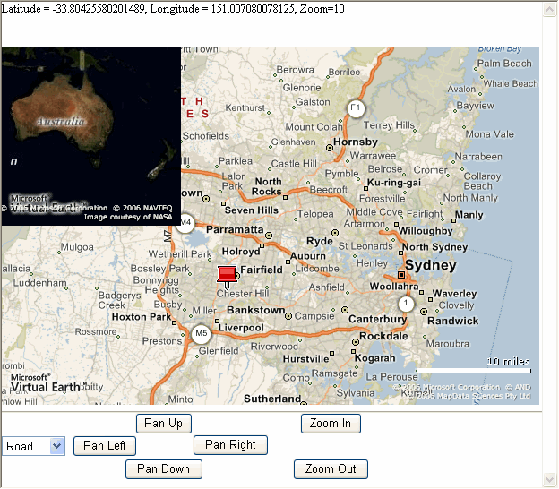
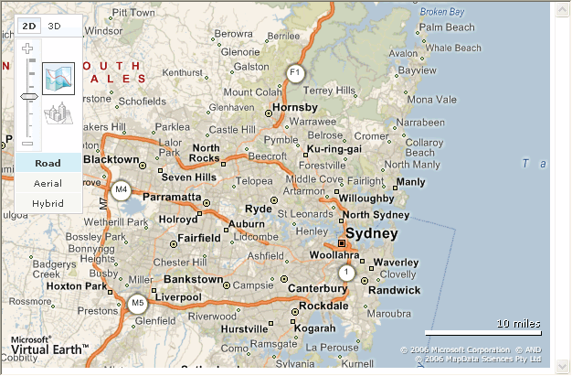
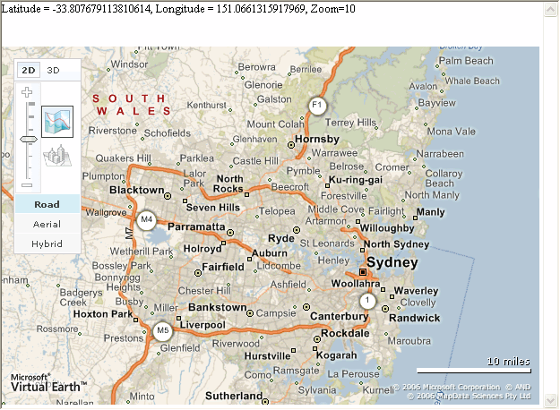
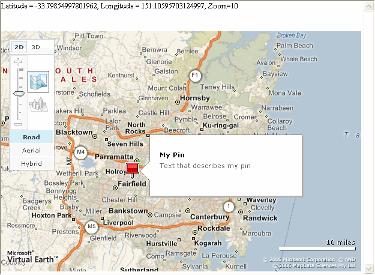

# Getting Started with V4 of the API (Part 1)
> [!CAUTION]
>  The content in this article may still be applicable to the current version of the [!INCLUDE[vemc_product_name](../articles/includes/vemc-product-name-md.md)], but it uses a previous version of the [!INCLUDE[vemc_product_name](../articles/includes/vemc-product-name-md.md)] which is no longer supported. More information about the current version of the [!INCLUDE[vemc_product_name](../articles/includes/vemc-product-name-md.md)] is found in the [Bing Map Control SDK](http://msdn.microsoft.com/en-us/library/bb429619.aspx).  
  
 This article will help you understand how to get started using version 4.0 of the [!INCLUDE[vemc_product_name](../articles/includes/vemc-product-name-md.md)]. The map control used in [!INCLUDE[ve_product_name](../articles/includes/ve-product-name-md.md)] is a JavaScript control, this can be used to present a great user experience for online map content.  
  
 By the end of this article you will have created a web page that displays a map control and allows for some user input as shown in figure 1. Your finished page will contain just a small subset of the functionality provided by the [!INCLUDE[vemc_product_name](../articles/includes/vemc-product-name-md.md)]. For additional code examples covering the features discussed in this article as well as many others, see the [!INCLUDE[ve_product_name](../articles/includes/ve-product-name-md.md)][Interactive SDK](http://www.microsoft.com/maps/isdk/ajax).  
  
   
  
 Figure 1 *The Getting Started Sample Application*  
  
## Using the MapControl  
 The [!INCLUDE[vemc_product_name](../articles/includes/vemc-product-name-md.md)] script can be found at: [http://dev.virtualearth.net/mapcontrol/v4/MapControl.js](http://dev.virtualearth.net/mapcontrol/v4/MapControl.js)  
  
 You should link directly to this on your site to ensure that you always use the most recent version of the control.  
  
 Unlike previous versions of the map control, this script contains everything you are likely to need for this article. You do not have to include an external link to a CSS file.  
  
### Creating a Map instance  
 To create a new instance of a [!INCLUDE[vemc_product_name](../articles/includes/vemc-product-name-md.md)] you will need to write a small method in JavaScript on your page. The method will create an instance of the `VEMap`, position it on the page, and set up the initial content of the control.  
  
 The `VEMap` object constructor has the following prototype:  
  
```  
VEMap(control_id);  
```  
  
 *Listing 1 The Map Control Constructor*  
  
 The `control_id` is the name of the HTML object that contains your map. Generally, you will want to put your map inside an HTML \<div> element, for example:  
  
```  
<div id='myMap' style="position:relative; width:400px; height:400px;"></div>  
```  
  
 *Listing 2 The HTML container*  
  
 Once you have created an instance of the `VEMap` you need to call the `LoadMap()` method to display the map in the HTML control specified. The `LoadMap()` method is a JavaScript method built into the `VEMap` control.  
  
 The `LoadMap()` method can be called with no parameters, in which case you will get a map that shows the USA zoomed out to show most of the North American states (zoom level 4) and displayed using the road style. You can also pass in several parameters to customize the starting map:  
  
```  
VEMap.LoadMap(VELatLong, zoom, style, fixed);  
```  
  
 *Listing 3 Full LoadMap function*  
  
 The parameters are:  
  
-   `VELatLong`  - An object that represents the center of the map. This object is defined in MapControl.js and is simply a pair of values indicating latitude and longitude. You can create one with a command similar to the following:  
  
```  
var latlong = new VELatLong(43.64887, -79.385362);  
```  
  
-   `zoom`  -The zoom level to display. Valid values range from 1 (large area) through 19 (fine detail). The default value is 4 which covers an area roughly equivalent to the United States of America.  
  
-   `style`  - The map style. Note that not all styles are available in all areas or at all zoom levels. If a map style is not available, the map will load with the default road style. If a zoom level is unavailable, or inappropriate, then the map will load with the nearest valid value. Valid style values are:  
  
    -   'a' for aerial  
  
    -   'h' for hybrid  
  
    -   'o' for oblique (bird's eye)  
  
    -   'r' for road (default)  
  
-   `fixed`  - A Boolean value that specifies whether or not the map view is displayed as a fixed map that the user cannot change. If this value is set to `false`, you automatically see the pan, zoom, and style navigation controls on the map, and the user can also drag, drop, and use the mouse scroll wheel to navigate. If you set `fixed` to `true`, the map navigation control will not be displayed, and the user will not be able to manipulate the map through the standard controls.  
  
 The advantage of this approach (over earlier versions of the map control) will be seen later in the article when you add a second map to the same page.  
  
### An Example (Map of Sydney)  
 A simple web page with a [!INCLUDE[vemc_product_name](../articles/includes/vemc-product-name-md.md)] can then be created as shown in Listing 4.  
  
```  
<html>  
  <head>  
    <title>My Bing Map</title>  
    <meta http-equiv="Content-Type" content="text/html; charset=utf-8">  
    <script   
        src="http://dev.virtualearth.net/mapcontrol/v4/mapcontrol.js">  
    </script>  
    <script>  
      var map = null;  
      function OnPageLoad()  
      {  
        map = new VEMap('myMap');  
        map.LoadMap(new VELatLong(-33.7939, 151.1093), 10, 'r', false);  
        //add attach event calls from later listings here  
      }  
    </script>  
  </head>  
  <body onload="OnPageLoad();">  
    <div id='myMap' style=" position:relative;width:600px; height:400px;"></div>  
  </body>  
</html>  
```  
  
 *Listing 4 A Simple Map of Sydney*  
  
 This should allow you to create a page that looks similar to that shown in Figure 2 below. The control provides a number of features for free. You should be able to:  
  
-   Move the map around by dragging it  
  
-   Zoom in and out with the mouse wheel  
  
-   Zoom in by double clicking on a location  
  
-   Change the map style from road to aerial using the dashboard  
  
-   Move around the map using the compass control on the dashboard  
  
-   Zoom in and out of the map using the dashboard  
  
   
  
 Figure 2 *The Map of Sydney*  
  
### Receiving Events from the Map Control  
 When the map displayed on the control is manipulated (zoomed, moved, etc.) by the user the map control raises events that provide information about the map currently displayed in the control. Note that the event names are case sensitive.  
  
 In order to attach a callback to an event, you need to execute one line of code after you have initialized your map control:  
  
```  
map.AttachEvent("onchangeview", callback_function_name);  
```  
  
 *Listing 5 Attaching an event*  
  
 Your callback function needs to accept a single parameter:  
  
```  
myCallbackFunction(e)  
{  
  //do stuff here  
}  
```  
  
 *Listing 6 The Callback Method*  
  
 The parameter contains a View object which has some very useful properties:  
  
|||  
|-|-|  
|latlong|The latitude and longitude at the center of the map.|  
|LatLong|The latitude and longitude of the point on the map where the user clicked the mouse.|  
|mapStyle|The current map style as a string. Valid string results are a, r, h, and o.|  
|sceneID|If the map style is set to bird's eye (oblique), the unique identifier of the current bird's eye scene.|  
|sceneOrientation|If the map style is set to bird's eye (oblique), the orientation of the current bird's eye scene.|  
|zoomLevel|The current zoom level of the map.|  
  
 *Table 1 Callback object from an event*  
  
### Types of Events  
 The events you can receive from the control are:  
  
|||  
|-|-|  
|**Event**|**Definition**|  
|`onchangemapstyle`|Occurs when the map style changes.|  
|`onchangeview`|Occurs whenever the map view changes.|  
|`onclick`|Occurs when the user clicks on the map.|  
|`oncontextmenu`|Occurs when the user right clicks on the map.|  
|`onendcontinuouspan`|Occurs when a continuous pan of the map ends.|  
|`onendzoom`|Occurs when the map zoom ends.|  
|`onerror`|Occurs when there is a map control error.|  
|`oninitmode`|Occurs when a user changes between 2D and 3D mode.|  
|`onmodenotavailable`|Occurs if the 3D mode is not available or not installed.|  
|`onmousedown`|Occurs when the user initiates a mouse click on the map.|  
|`onmouseup`|Occurs when the user releases a mouse click on the map.|  
|`onobliquechange`|Occurs only when the Bird's Eye image scene ID is changed. This event only fires if the map is currently displaying a Bird's Eye image and that image is changed.|  
|`onobliqueenter`|Occurs when switching to bird's eye imagery from another map style.|  
|`onobliqueleave`|Occurs when switching from bird's eye imagery to another map style.|  
|`onresize`|Occurs when the map is resized.|  
|`onstartcontinuouspan`|Occurs when a continuous pan of the map begins.|  
|`onstartzoom`|Occurs when the map zoom begins.|  
  
 *Table 2 Map Related Events*  
  
### The view Parameter  
 Every event callback receives a single object as a parameter. In most cases, the event parameter contains a view member that represents the current map view. The map view contains a number of properties that are very useful:  
  
|||  
|-|-|  
|**Property**|**Definition**|  
|`mapStyle`|The map style of the current map view.|  
|`zoomLevel`|The zoom level of the current map view.|  
|`center`|The center point (pixel) of the current map view.|  
|`latlong`|The center point (VELatLong) of the current map view.|  
|`pixelRect`|The bounding rectangle (pixel) of the current map view.|  
|`latlongRect`|The bounding rectangle (latitude and longitude) of the current map view.|  
|`sceneId`|The ID of the oblique scene in the current map view. Returns null if MapStyle is not 'o'.|  
|`sceneOrientation`|The orientation of the oblique scene in the current map view (North, South, East, West). Returns null if MapStyle is not 'o'.|  
  
 *Table 3 MapView Properties*  
  
 Several events have additional properties, and some events return a different object. For example, the onerror event returns a `VEException` object, which contains a source, name and message.  
  
### An Exception - onLoadMap  
 In addition to the normal events described above, you have access to one more event callback. The `VEMap` control has an `onLoadMap` property that maps to an event trigged by a successful call to `LoadMap()`. Unlike the rest of the events, the callback function does not contain an argument. In other words, you can only use this event to receive notification that a map has loaded. You can not access any of the details about the map.  
  
 To use the `onLoadMap` callback, you need to create a callback function and assign it to the `onLoadMap` property of the `VEMap` control:  
  
```  
map = new VEMap('myMap');  
map.onLoadMap = function(){ alert('The map has loaded.') };  
map.LoadMap(new VELatLong(47.22, -122.44), 12, 'r', false);  
```  
  
 *Listing 7 Using the onLoadMap callback.*  
  
 Note that unlike the other events, you should assign your `onLoadMap` event before loading a map. You can assign it afterward, but you won't see the event from your first load map call.  
  
### Panning Events Example  
 The first events we will examine are the panning events. These are raised each time the map starts or stops panning, or scrolling. As you might expect, the `onstartcontinouspan` event is raised when the map starts scrolling and the `onendcontinouspan` event is raised when the map control finishes scrolling the map.  
  
 Whenever a user pans or zooms on the map, we want to display the new latitude, longitude and zoom level. In order to make our code work, we need to add a callback function and a pair of event handlers to our example from Listing 4.  
  
 First, we need to add a new \<div> tag to our HTML body.  
  
```  
<div id="info" style="position:relative;height:50px;font-size:10pt"></div>  
```  
  
 *Listing 8 The Info div tag*  
  
 Put this tag before the \<div> holding your map.  
  
 Next, we need to create our callback method. The callback method will take advantage of the properties of the view object to change the text of the info `div` tag. Put the code from Listing 9 in the same script block as the `OnPageLoad()` method in Listing 4.  
  
```  
function SetInfoBlock(e)  
{  
  document.getElementById("info").innerHTML =  
    'Latitude = ' + e.view.latlong.latitude  
    + ', Longitude = ' + e.view.latlong.longitude  
    + ', Zoom=' + e.view.zoomLevel;  
}  
```  
  
 *Listing 9 The SetInfoBlock callback method*  
  
 Next, we need to attach the callback method to the events for panning and zooming the map.  
  
 Add the two lines of code from Listing 10 to the `OnPageLoad()` method from Listing 4. These lines should go after the `VEMap` control is initialized and you have called the `LoadMap()` method. You can only attach events after the map is loaded. If you try to attach events before calling the `LoadMap()` method, you will see JavaScript errors about the controls not being initialized.  
  
```  
function OnPageLoad()  
{  
  map = new VEMap('myMap');  
  map.LoadMap(new VELatLong(-33.7939, 151.1093), 10, 'r', false);  
  map.AttachEvent("onendcontinuouspan", SetInfoBlock);  
  map.AttachEvent("onendzoom", SetInfoBlock);  
}  
```  
  
 *Listing 10 Attaching to the events*  
  
 Note that we can use the same callback method (`setInfoBlock()`) for both events since we want both events to perform the same action. We could just as easily assign the events to different functions, or even add multiple functions as event handlers.  
  
 The page should now appear as shown in Figure 3 when we either pan or zoom on the map.  
  
   
  
 Figure 3 *Sydney with Pan Event Handlers and Info Block*  
  
### Adding a Pushpin to the Map  
 The ability to add pins to the map allows us to indicate particular locations on the map control. Pins work by overlaying information on the map control. The prototype of the `AddPushpin` method looks like this:  
  
```  
VEMap.AddPushpin(pin)  
```  
  
 *Listing 11 The AddPushpin method*  
  
 The pin parameter is actually a `VEPushpin` object, which lets you describe the pushpin you want to add to the map. The constructor for the Pushpin has the following signature:  
  
```  
VEPushpin(id, location, icon_url, title, details, iconStyle, titleStyle, detailsStyle);  
```  
  
 *Listing 12 Constructing a PushPin*  
  
 The parameters are as follows:  
  
|||  
|-|-|  
|**Parameter**|**Description**|  
|id|The ID of the pushpin that will be added the map. This id must be unique for each pushpin on a map control.|  
|location|The location of the pushpin, specified as a VELatLong object.|  
|icon_url|The URL that points to the file you want to use as an icon.|  
|title|The string to display in the Title field of the pushpin popup.|  
|details|The string to display in the Details field of the pushpin popup.|  
|iconStyle|A cascading style sheet (CSS) class name that defines the look of the icon.|  
|titleStyle|A cascading style sheet (CSS) class name that defines the look of the title field of the popup.|  
|detailsStyle|A cascading style sheet (CSS) class name that defines the look of the description field of the popup.|  
  
 *Table 4 PushPin Constructor Arguments*  
  
 NOTE: The first two parameters are the only ones that are required. The rest of the parameters are optional.  
  
### Example - Adding a PushPin  
 We can add a function to our map example so that a pushpin is added whenever a user clicks on the map. In order to make this work, we need to create a function for adding the pushpin, and attach an "onclick" event to our map object. First, let's create a function to erase any old pushpins and add a new one wherever the user just clicked. Add the code in Listing 13 to our script block:  
  
```  
function MouseClick(e)  
{  
  map.DeleteAllPushpins();  
  var pin = new VEPushpin(1,  
    new VELatLong(e.view.LatLong.Latitude, e.view.LatLong.Longitude),  
    null,  
    'My Pin',  
    'Text that describes my pin'  
  );  
  map.AddPushpin(pin);  
}  
```  
  
 *Listing 13 Creating a PushPin*  
  
 Note that we are always going to use the same PinID (1). If we wanted to add more than one pin, we would increment this number. We are also going to use the default pin icon since we passed in `null` instead of the `URL` to a gif image.  
  
 Next, we need to attach our click event to the updated `OnPageLoad()` method from Listing 10:  
  
```  
map.AttachEvent("onclick", MouseClick);  
```  
  
 *Listing 14 Adding the MouseClick event*  
  
 Viewing this page in a browser will now allow push pins to be added by clicking on the map. There are a couple of issues with this:  
  
-   Each time the map is dragged another push pin gets added.  
  
-   Double clicking on the map to zoom in no longer works, because a pin is added first that receives the double click event.  
  
 A solution would be to add pushpins using a different event, or an external button.  
  
 For now let's stick with our current method. Notice that we can only have one pushpin since we are calling `DeleteAllPushpins` before each call.  
  
 To remove a specific pin use the `DeletePushpin` function.  
  
```  
DeletePushpin(id);  
```  
  
 *Listing 15 Deleting a single pin.*  
  
 This function takes a single parameter which identifies the pin to remove. Deleting a pushpin that does not exist will throw an exception.  
  
 We should now have a page that will contain a single push pin indicating the last place on the map that was clicked, Figure 4.  
  
   
  
 Figure 4 *Map with PushPin Functionality Added*  
  
### Controlling the Map Programmatically  
 In some applications, you may find that the built in pan and zoom control is insufficient for your needs, or simply just doesn't look like the rest of your website. In this final section of this article you will learn how to add buttons to the web page that can control the contents of the map control. The pan and zoom methods are, fortunately, very easy to understand and leverage. Similarly, you can change the map style using another very simple call. Finally, turning off the built in control is also as simple as making one more call on the `VEMap` control.  
  
### Hiding the Control Dashboard  
 The first thing we want to do is hide the built in navigation control. Although we can hide it by passing in true to the `fixed` parameter of the `OnLoad` method, we actually want to allow our users to pan and zoom using the regular mouse motions. Instead, we can call toggle the navigation control by using the `ShowDashboard` and `HideDashboard` methods:  
  
```  
map.HideDashboard();  
```  
  
 *Listing 16 Hide the Navigation Dashboard*  
  
 To show the dashboard again, simply call `ShowDashboard()`:  
  
```  
map.ShowDashboard();  
```  
  
 *Listing 17 Show Dashboard*  
  
### Changing the Map Style  
 In the first version of the [!INCLUDE[vemc_product_name](../articles/includes/vemc-product-name-md.md)] you had to add code to change the map style between aerial, road, and hybrid. With the current `VEMap` control, you automatically get the navigation control that encapsulates all of the style-switching functionality.  
  
 However, if you decide you want to switch the map style yourself through code, you can use the `VEMap` control's `SetMapStyle` function. The available map styles are:  
  
-   aerial: an aerial satellite image of the map display  
  
-   road: a street map of the area in the control  
  
-   hybrid: a combination of aerial and vector (the streets are overlaid on the aerial image)  
  
-   oblique: oblique or birds eye imagery  
  
 Note that not all styles are available in all areas and zoom levels. If you try to switch to an unavailable map style, the control will automatically switch back to the road view (the default).  
  
 Once the map control is displayed it is possible to change the map style by using the `SetMapStyle` function on the Map Control:  
  
```  
SetMapStyle(mapStyle)  
```  
  
 *Listing 18 Setting a Map Style*  
  
 The function takes one parameter to indicate the style. Similarly to setting the initial style, the parameter’s value should be the first single character of the style you want to use: a, r, h, or o. Alternatively, and preferably, you can use the `VEMapStyle` enumeration:  
  
```  
VEMapStyle {Road, Aerial, Hybrid, Oblique }  
```  
  
 *Listing 19 The VEMapStyle enumeration*  
  
 For example, to set your map to the Aerial view, use:  
  
```  
map.SetMapStyle(VEMapStyle.Aerial);  
```  
  
 *Listing 20 Setting the view*  
  
 Remember that you can only call this method after the map has been loaded with a `LoadMap()` call. If you try to use the method before a map is loaded, you will encounter JavaScript errors.  
  
### Example  
 With a little bit of JavaScript and HTML, we can create a drop down list that will allow our users to select a map style. First, we need a drop down list in our \<body> to allow us to select a style.  
  
```  
<div id="CustomNavControl" style="position:relative;height:50px;font-size:10pt">  
  <form>  
    <select onchange="ChangeStyle();" id="styleMenu">  
     <option value="r">Road</option>  
     <option value="a">Aerial</option>  
     <option value="h">Hybrid</option>  
     <option value="o">Birds Eye</option>  
    </select>  
  </form>  
</div>  
```  
  
 *Listing 21 A style selector*  
  
 Note that whenever a user selects a style, the page will call the ChangeStyle JavaScript method. Our JavaScript method needs to set the style:  
  
```  
function ChangeStyle()  
{  
  var style = document.getElementById('styleMenu').getAttribute('value');  
  if (style != 'o' || map.IsBirdseyeAvailable())  
  {  
    map.SetMapStyle(style);  
  }  
  else  
  {  
    alert("Bird's Eye Imagery not available");  
  }  
}  
```  
  
 *Listing 22 Setting the Map Style*  
  
 Note for FireFox users: Due to differing document object models between IE and FireFox browsers, you will need to add the following line after the first `style` assignment in Listing 22 in order for it to work in FireFox:  
  
```  
if (style==null) style = document.getElementById('styleMenu').value;  
```  
  
 *Listing 23 A FireFox alternative*  
  
 If the user selects Birds Eye (Oblique) as the style, we want to make sure that the style is available using the `IsBirdseyeAvailable()` method. With some additional JavaScript, we could have a method that auto generates the style choices and omits the birds eye choice if it isn't available. We'd have to call this method after any pan or zoom events from the map.  
  
### Panning  
 As you might guess from the section on setting map style, creating buttons to pan the map is simply a matter of adding some HTML and some minimal JavaScript. Once again, we start with some HTML elements. This time, however, we want four buttons to allow our users to pan in each of the cardinal directions:  
  
```  
<input type="button" value="Pan Up" onclick="DoPanUp()" id="PanUpButton"  
  name="PanUpButton" style="position: absolute; left: 149px; top: 9px;"/>  
<input type="button" value="Pan Down" onclick="DoPanDown()" id="PanDownButton"  
   name="PanDownButton" style="position: absolute; left: 137px; top: 60px;"/>  
<input type="button" value="Pan Left" onclick="DoPanLeft()" id="PanLeftButton"  
  name="PanLeftButton" style="position: absolute; left: 79px; top: 34px;"/>  
<input type="button" value="Pan Right" onclick="DoPanRight()" id="PanRightButton"  
  name="PanRightButton" style="position: absolute; left: 213px; top: 33px;"/>  
```  
  
 *Listing 24 Adding Pan buttons*  
  
 You may need to adjust the positioning for your particular page layout.  
  
 Next, we need to create the JavaScript functions to actually pan the map control. We need to use the `VEMap.pan()` method, and pass in a horizontal and vertical offset. The offset values are in units of pixels. Therefore the actual pan distance is a function of the size, resolution and zoom level of your map. Normally panning about ¼ of the map size is appropriate. In our example, the map is 600 by 400 pixels, so a pan of 150 pixels left and right, and 100 pixels up and down is appropriate:  
  
```  
function DoPanUp() {map.Pan(0, -100);}  
function DoPanDown(){map.Pan(0, 100);}  
function DoPanLeft(){map.Pan(-150, 0);}  
function DoPanRight(){map.Pan(150, 0);}  
```  
  
 *Listing 25 Adding the Panning Javascript*  
  
 If you load this page in a browser and click the buttons you can see the map jump around. This is not a great user experience. It would be nicer to show the map scrolling smoothly in each of the directions. We can change this by leveraging the `panToLatLong()` method. This method, unlike a regular pan, takes a `VELatLong` parameter and performs a smooth pan of the map until it is centered on the new position.  
  
 In order to leverage `panToLatLong()` we have to figure out the center and edges of our map and calculate an appropriate new center point. The JavaScript is a little more complicated:  
  
```  
function SmoothPan(percentX, percentY)  
{  
  var oldCenter = map.GetCenter();  
  var topLeft = map.GetMapView().TopLeftLatLong;  
  var offsetY = percentY * 2 * Math.abs(topLeft.Latitude - oldCenter.Latitude);  
  var offsetX = percentX * 2 * Math.abs(topLeft.Longitude - oldCenter.Longitude);  
  
  var newLat = (oldCenter.Latitude + offsetY);  
  var newLong = (oldCenter.Longitude + offsetX);  
  if (newLat > 90) newLat = 90;  
  if (newLat < -90) newLat = -90;  
  if (newLong > 180) newLong = 180;  
  if (newLong < -180) newLong = -180;  
  
  var newCenter = new VELatLong(newLat, newLong);  
  map.PanToLatLong(newCenter);  
}  
```  
  
 *Listing 26 Smooth Panning*  
  
 Note that the `SmoothPan` function will stop panning if the latitude reaches +/- 90 degrees or longitude reaches +/- 180 degrees.  
  
 You can change your buttons to leverage the method by passing in percentages of map size rather than pixel values:  
  
```  
function DoPanUp() {SmoothPan(0, .25);}  
function DoPanDown(){SmoothPan(0, -.25);}  
function DoPanLeft(){SmoothPan(-.25, 0);}  
function DoPanRight(){SmoothPan(.25, 0);}  
```  
  
 *Listing 27 Using SmoothPan*  
  
### Zooming  
 Zooming is simply a result of calling the `VEmap.ZoomIn()` or `VEmap.ZoomOut()` functions. Therefore we need to add a zoom in button and a zoom out button and call the appropriate JavaScript.  
  
```  
<input type="button" value="Zoom In" onclick="DoZoomIn()" id="ZoomInButton"   
  name="ZoomInButton" style="position:absolute;left:333px;top:9px;"/>  
<input type="button" value="Zoom Out" onclick="DoZoomOut()" id="ZoomOutButton"   
  name="ZoomOutButton" style="position:absolute;left:325;top:60px;"/>  
```  
  
 *Listing 28 The Zoom Buttons*  
  
 Once again, adjust the positioning to suit your particular tastes.  
  
 Our buttons call `DoZoomIn()` and `DoZoomOut()`, so we need to add the JavaScript. Each zoom call will simply increase or decrease the zoom level by 1.  
  
```  
function DoZoomIn() {map.ZoomIn();}  
function DoZoomOut() {map.ZoomOut();}  
```  
  
 *Listing 29 Zooming Functions*  
  
 If we wanted to directly zoom to a particular level, or zoom by more than one level at a time, we'd have to use the `VEMap.setCenterAndZoom()` method which accepts a `VELatLong` object and a zoom level.  
  
```  
function bigZoomIn()  
{  
  var oldZoom = map.GetZoomLevel();  
  var oldCenter = map.GetCenter();  
  var newZoom = Math.min((oldZoom+5), 19));  
  map.SetCenterAndZoom(oldCenter, newZoom);  
}  
```  
  
 *Listing 30 Zooming in by 5 levels at a time*  
  
 Note that the highest detail has a zoom level of 19, and the lowest detail has a zoom level of 1.  
  
### Adding a second map control  
 Since we've removed the navigation widget and added our own controls below the map, we might want to use the upper left corner to give a "world view" inset map. To add the inset map, start by declaring a second global map element in the JavaScript:  
  
```  
var insetMap = null;  
```  
  
 *Listing 31 Global InsetMap variable.*  
  
 Then in the HTML body add a new div element to host the inset map:  
  
```  
<div id="inMap" style="position:absolute;top:50px;width:200px;height:200px;"></div>  
```  
  
 You can then instantiate and load the new `insetMap` object in the `OnPageLoad` method. This time, we want to specify the hybrid style and make sure that the fixed parameter is set to true:  
  
```  
insetMap = new VEMap('inMap');  
insetMap.LoadMap(new VELatLong(-33.7939, 151.1093), 2, 'h', true);  
```  
  
 *Listing 32 Adding The InsetMap*  
  
 Next, we want our inset map to re-center whenever the user pans or zooms on the map. Therefore, we want to modify our `SetInfoBlock()` method from Listing 9:  
  
```  
function SetInfoBlock(e)  
{  
  var lat = e.view.latlong.latitude;  
  var long = e.view.latlong.longitude;  
  
  document.getElementById("info").innerHTML =  
    'Latitude = ' + lat  
    + ', Longitude = '  + long  
    + ', Zoom=' + e.view.zoomLevel;  
    insetMap.PanToLatLong(new VELatLong(lat, long));  
}  
```  
  
 *Listing 33 Modified SetInfoBlock() Method*  
  
 Now our inset map will automatically re-center with our main map. Of course, unless you zoom out, you won't see much change because the inset map already shows the entire continent of Australia.  
  
### Conclusion  
 If you have followed along with this article you should now have a page that looks similar to the one shown in Figure 1. The complete code listing is provided in Listing 34 below. If you have used previous versions of the [!INCLUDE[vemc_product_name](../articles/includes/vemc-product-name-md.md)] you will notice that even less code is now needed to carry out the same tasks.  
  
 Using the [!INCLUDE[vemc_product_name](../articles/includes/vemc-product-name-md.md)] is relatively simple and it provides a very compelling user experience for mapping and location identification. Building on this basic set of features, you can create rich visual experiences for your users. In [Getting Started with V4 of the API (Part 2)](../articles/getting-started-with-v4-of-the-api-part-2.md), we will look at more advanced features including the Find control (What/Where).  
  
 This article is an update of an article originally contributed by [Dr Neil Roodyn](http://www.roodyn.com/). The update was performed by [Robert McGovern MVP (Bing Maps/MapPoint)](https://mvp.support.microsoft.com/profile=A9159573-40DB-4BD1-A079-D57C675E1766).  
  
```  
<html>  
<head>  
  <title>My Bing Map</title>  
  <meta http-equiv="Content-Type" content="text/html; charset=utf-8">  
    <script src="http://dev.virtualearth.net/mapcontrol/v4/mapcontrol.js"></script>  
    <script>  
    var map = null;  
    var insetMap = null;  
  
    function SetInfoBlock(e)  
    {  
      var lat = e.view.latlong.latitude;  
      var long = e.view.latlong.longitude;  
  
      document.getElementById("info").innerHTML =  
        'Latitude = ' + lat  
        + ', Longitude = '  + long  
        + ', Zoom=' + e.view.zoomLevel;  
      insetMap.PanToLatLong(new VELatLong(lat, long));  
    }  
  
    function MouseClick(e)  
    {  
      map.DeleteAllPushpins();  
      var pin = new VEPushpin(1,  
        new VELatLong(e.view.LatLong.Latitude, e.view.LatLong.Longitude),  
        null,  
        'My Pin',  
        'Text that describes my pin'  
      );  
      map.AddPushpin(pin);  
    }  
  
    function OnPageLoad()  
    {  
      map = new VEMap('myMap');  
      map.LoadMap(new VELatLong(-33.7939, 151.1093), 10, 'r', false);  
  
      insetMap = new VEMap('inMap');  
      insetMap.LoadMap(map.GetCenter(), 2, 'h', true);  
  
      map.AttachEvent("onendcontinuouspan", SetInfoBlock);  
      map.AttachEvent("onendzoom", SetInfoBlock);  
      map.AttachEvent("onclick", MouseClick);  
  
      map.HideDashboard();  
    }  
  
    function ChangeStyle()  
    {  
      var style = document.getElementById('styleMenu').getAttribute('value');  
      if (style != 'o' || map.IsBirdseyeAvailable())  
      {  
        map.SetMapStyle(style);  
      }  
      else  
      {  
        alert("Bird's Eye Imagery not available");  
      }  
    }  
  
    function SmoothPan(percentX, percentY)  
    {  
      var oldCenter = map.GetCenter();  
      var topLeft = map.GetMapView().TopLeftLatLong;  
      var offsetY = percentY * 2 * Math.abs(topLeft.Latitude - oldCenter.Latitude);  
      var offsetX = percentX * 2 * Math.abs(topLeft.Longitude - oldCenter.Longitude);  
  
      var newLat = (oldCenter.Latitude + offsetY) % 180;  
      var newLong = (oldCenter.Longitude + offsetX) % 180;  
  
      var newCenter = new VELatLong(newLat, newLong);  
      map.PanToLatLong(newCenter);  
    }  
      function DoPanUp() {SmoothPan(0, .25);}  
      function DoPanDown() {SmoothPan(0, -.25);}  
      function DoPanLeft() {SmoothPan(-.25, 0);}  
      function DoPanRight() {SmoothPan(.25, 0);}  
      function DoZoomIn() {map.ZoomIn();}  
      function DoZoomOut() {map.ZoomOut();}  
    </script>  
  </head>  
  <body onload="OnPageLoad();">  
    <div id="info" style="position:relative;height:50px;font-size:10pt"></div>  
    <div id="myMap" style="position:relative;width:600px;height:400px;"></div>  
    <div id="inMap" style="position:absolute;top:50px;width:200px;height:200px;"></div>  
  
    <div id="mapControl" style="position:relative;height:50px;font-size:10pt">  
      <hr>  
      <form>  
        <select onchange="ChangeStyle();" id="styleMenu">  
          <option value="r">Road</option>  
          <option value="a">Aerial</option>  
          <option value="h">Hybrid</option>  
          <option value="o">Oblique</option>  
        </select>  
        <input type="button" value="Pan Up" onclick="DoPanUp()" id="PanUpButton"   
          name="PanUpButton" style="position: absolute; left: 149px; top: 9px;"/>  
        <input type="button" value="Pan Down" onclick="DoPanDown()" id="PanDownButton"   
          name="PanDownButton" style="position: absolute; left: 137px; top: 60px;"/>  
        <input type="button" value="Pan Left" onclick="DoPanLeft()" id="PanLeftButton"   
          name="PanLeftButton" style="position: absolute; left: 79px; top: 34px;"/>  
        <input type="button" value="Pan Right" onclick="DoPanRight()" id="PanRightButton"   
          name="PanRightButton" style="position: absolute; left: 213px; top: 33px;"/>  
        <input type="button" value="Zoom In" onclick="DoZoomIn()" id="ZoomInButton"   
          name="ZoomInButton" style="position:absolute;left:333px;top:9px;"/>  
        <input type="button" value="Zoom Out" onclick="DoZoomOut()" id="ZoomOutButton"   
          name="ZoomOutButton" style="position:absolute;left:325;top:60px;"/>  
      </form>  
    </div>  
  </body>  
</html>  
```  
  
 *Listing 34 Complete Code Listing*