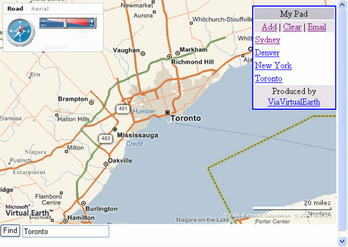
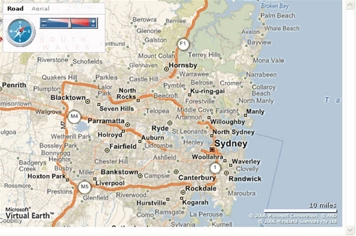
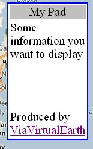

# Getting Started with V4 of the API (Part 2)
> [!CAUTION]
>  The content in this article may still be applicable to the current version of the [!INCLUDE[vemc_product_name](../articles/includes/vemc-product-name-md.md)], but it uses a previous version of the [!INCLUDE[vemc_product_name](../articles/includes/vemc-product-name-md.md)] which is no longer supported. More information about the current version of the [!INCLUDE[vemc_product_name](../articles/includes/vemc-product-name-md.md)] is found in the [Bing Map Control SDK](http://msdn.microsoft.com/en-us/library/bb429619.aspx).  
  
 In the first part of this article, [Getting Started with V4 of the API (Part 1)](../articles/getting-started-with-v4-of-the-api-part-1.md), you learned how to add and use version 4.0 of the [!INCLUDE[vemc_product_name](../articles/includes/vemc-product-name-md.md)] in your own web page. You also learned how to create your own controls for manipulating the map. In this article, you will learn how to modify the existing controls through CSS, add new controls to the map, and leverage the built in find functionality.  
  
 By the end of this article you will have extended on the concepts from part 1 to use new images for the compass and zoom bar controls and include a custom panel. The end result should appear as seen in Figure 1. Your completed page will contain just a small subset of the functionality provided by the [!INCLUDE[vemc_product_name](../articles/includes/vemc-product-name-md.md)]. For additional code examples covering the features discussed in this article as well as many others, see the [!INCLUDE[ve_product_name](../articles/includes/ve-product-name-md.md)][Interactive SDK](http://www.microsoft.com/maps/isdk/ajax).  
  
   
  
 Figure 1 *The Finished Product*  
  
## Getting Started  
 Before trying to follow along with the examples in this article, create a new HTML page that displays a basic [!INCLUDE[ve_product_abbr](../articles/includes/ve-product-abbr-md.md)] map.  
  
```  
<html>  
<head>  
  <title>My Bing Map</title>  
  <meta http-equiv="Content-Type" content="text/html; charset=utf-8">  
    <script src="http://dev.virtualearth.net/mapcontrol/v4/mapcontrol.js"></script>  
    <script>  
    var map = null;  
  
    function OnPageLoad()  
    {  
      map = new VEMap('myMap');  
      map.LoadMap(new VELatLong(-33.7939, 151.1093), 10, 'r', false);  
    }  
    </script>  
  
  </head>  
  <body onload="OnPageLoad();">  
    <div id="myMap" style="position:relative;width:600px;height:400px;"></div>  
  </body>  
</html>  
```  
  
 *Listing 1 A Starter Page*  
  
 This HTML page should display a map of Sydney, with the regular [!INCLUDE[ve_product_abbr](../articles/includes/ve-product-abbr-md.md)] control.  
  
 In part 1 you discovered that the script for the [!INCLUDE[vemc_product_name](../articles/includes/vemc-product-name-md.md)] can be found at [http://dev.virtualearth.net/mapcontrol/v4/mapcontrol.js](http://dev.virtualearth.net/mapcontrol/v4/mapcontrol.js). Note that the JavaScript file automatically incorporates all necessary CSS. You might recall that the "C" in CSS stands for cascading, which means you can locally override the look of any of these controls by adding your own styles after the JavaScript file has been loaded into your page.  
  
### Manipulating the CSS  
 The default `VEMap` control provides a clean and simple interface for manipulating map images. However, the color scheme and look may not be appropriate for your website. Fortunately, you can manipulate the underlying CSS to change the look and feel of the map and map control.  
  
### The Compass control  
 The first control you are going to modify is the compass control. The control provides a user friendly way to navigate around the map. The compass is represented by an image. When replacing the image, it is best to use a gif with transparency so that the compass does not cover any more of the map than is needed. You can create your own image or copy the image used with this example.  
  
 The compass is defined in the [!INCLUDE[ve_product_name](../articles/includes/ve-product-name-md.md)] style sheet as:  
  
```  
.Compass  
{  
  width:54px;  
  height:54px;  
  background:url(../../i/compass.gif);  
  margin:0;  
  cursor:pointer  
}  
```  
  
 *Listing 2 Original Compass CSS*  
  
 In order to use a different image for the compass you will need to add your own definition for the .Compass style.  
  
```  
<style type="text/css" media="screen">  
<!--  
.Compass   
{   
  width:54px;   
  height:54px;   
  background:url(Compass.gif);   
  margin:0px;   
  cursor:pointer;   
}  
-->  
</style>  
```  
  
 *Listing 3 Modified Compass*  
  
 Add this code to your basic file from Listing 1, after the script block but before the main HTML body.  
  
 You will also need an appropriate image. You can use the compass in Figure 2:  
  
   
  
 Figure 2 *Compass Image (Compass.gif)*  
  
 Put this image in the same folder as your HTML file.  
  
 The page should now display your compass image in the dashboard on the map, and the new compass should retain the same functionality as the original arrow image.  
  
### The Zoom control  
 The default zoom control provides a slick user interface for zooming in and out of the map. It also provides visual feedback as to the amount a map can be zoomed and where the current map is on that scale. However, we want to replace the default zoom control with a new blue and red slider that matches our corporate color scheme.  
  
 Our new control consists of graphical components, the bar and the slider. For this exercise we are using these images:  
  
   
  
 Figure 3 *The Zoom Bar (Bar.gif)*  
  
   
  
 Figure 4 *The Zoom Slider (Slider.gif)*  
  
 In the same way you defined a different image for the compass you will need to add your own definition for the `.ZoomBar` and `.ZoomBar_slider` styles.  
  
```  
<!--  
.ZoomBar   
{   
  position:relative;  
  background:url(Bar.gif);   
  width:103px; height:20px;   
  margin:2px; overflow:hidden;   
}  
.ZoomBar_slider   
{   
  position:absolute;   
  background:url(Slider.gif);   
  width:7px;   
  height:20px;   
  overflow:hidden;   
  display:block;   
}  
-->  
```  
  
 *Listing 4 Changing the Zoom Control*  
  
 At this stage you have a web page with a map and great looking controls for interacting with the map. The page should look something like that shown in Figure 5.  
  
   
  
 Figure 5 *Modified Navigation Controls*  
  
### Other [!INCLUDE[ve_product_name](../articles/includes/ve-product-name-md.md)] Styles  
 Unfortunately, the CSS styles are not currently documented for the [!INCLUDE[ve_product_abbr](../articles/includes/ve-product-abbr-md.md)] control, and the CSS link is now embedded in the single JavaScript reference. Therefore, if you want to explore the CSS for [!INCLUDE[ve_product_name](../articles/includes/ve-product-name-md.md)], or change the look of other controls, such as the What/Where pane, you will need to use a JavaScript browser control such as IEToolbar.  
  
### Adding Custom Controls  
 If you want to display more data on your map, or give your users more control, you may want to add additional controls to the map. For example, you may want to create a panel allowing your users to temporarily store locations of interest.  
  
 Adding a panel in [!INCLUDE[ve_product_name](../articles/includes/ve-product-name-md.md)] is fairly simple thanks to the `AddControl()` method. This method allows you to define an HTML control and place it on the map. However, simply adding a control is rarely enough. You also have to build the functionality to make the control useful. In this part of the article, we will look at creating a scratch pad for use on our mapping application.  
  
### Adding a Panel  
 We can create a new \<div> to hold our panel, and attach the panel as a map control in our `OnPageLoad()` method.  
  
```  
//Add this code to the end of the OnPageLoad() method, after the map has been loaded.    
var panel = document.createElement("div");   
panel.id = 'ContentPane';  
panel.style.top = "10px";   
panel.style.left = "450px";   
panel.style.width = "150px";  
panel.style.border = "2px solid blue";  
panel.style.background = "White";  
panel.innerHTML = "<table border=0 width='100%'>" +  
  "<tr><td bgcolor='#C0C0C0'><p align='center'>My Pad</td></tr>" +  
  "<tr><td>Some information you want to display</td></tr>" +  
  "<tr><td> </td></tr>" +  
  "<tr><td> </td></tr>" +  
  "<tr><td> </td></tr>" +  
  "<tr><td>Produced by " +  
  "<a href=http://viavirtualearth.com/>ViaVirtualEarth</a>" +  
  "</td></tr>" +  
  "</table>";  
map.AddControl(panel);  
```  
  
 *Listing 5 Creating a Panel*  
  
 If you view the page in your browser you will now see a Panel in the upper right corner of the map.  
  
   
  
 Figure 6 *The Panel*  
  
 As the control is standard HTML you can add links, customize the appearance and make it behave as you see fit. However, always keep in mind that you are balancing the value of your panel against the amount of the map you are covering: the larger your panel, the less map area available.  
  
### Expanding the Panel  
 In order to make the panel more useful, we're going to break up the HTML defining the panel into three sections, a header, a center pane, and a footer. We'll create JavaScript methods to return each section. This way, it will be much easier to modify just the section of the panel we are interested in. Add the following JavaScript functions:  
  
```  
function getPanelHeader()  
{  
  var panelHead = "<table border=0 width='100%'>" +  
    "<tr><td bgcolor='#C0C0CF'><p align='center'>My Pad</p></td></tr>" +  
    "<tr><td bgcolor='#E0E0E0'><p align='center'>" +  
    "<a href=\"javascript:AddPoint();\">Add</a> | " +  
    "<a href=\"javascript:ClearPanel();\">Clear</a> | " +  
    "<a href=\"javascript:EmailPanel();\">Email</a></p>" +  
    "</td></tr>";  
  return panelHead;  
}  
function getPanelFooter()  
{  
  var panelFoot = "<tr><td bgcolor='#E0E0E0'><p align='center'>Produced by " +  
    "<a href='http://viavirtualearth.com/'>ViaVirtualEarth</a>"+  
    "</td></tr>" +  
    "</table>";  
  return panelFoot;  
}  
function getPanelContent()  
{  
  var panelEmptyContent = "<tr><td>Empty panel</td></tr>" +  
    "<tr><td> </td></tr>" +  
    "<tr><td> </td></tr>";  
  return panelEmptyContent;  
}  
```  
  
 *Listing 6 Re-factoring the Panel Generation Code*  
  
 Replace the code in Listing 5 with the new approach:  
  
```  
var panel = document.createElement("div");  
panel.id = 'ContentPane';  
panel.style.top = "10px";  
panel.style.left = "450px";  
panel.style.width = "150px";  
panel.style.border = "2px solid blue";  
panel.style.background = "White";  
panel.innerHTML = getPanelHeader() + getPanelContent() + getPanelFooter();  
map.AddControl(panel);  
```  
  
 *Listing 7 The New Panel Approach*  
  
 Note that we've added some links at the top of the panel for adding points, clearing the panel, and emailing the contents. Our next task will be to write the code to execute the functions described in the panel. We'll actually use the middle panel to display the results when a user adds a new point.  
  
### The AddPoint Function  
 We'll start with the `AddPoint()` function, which will add an entry to the middle pane of our panel with a name and location. The name is arbitrary and the location is going to be the Latitude and Longitude of the center of the current map.  
  
 First, we need to define a data type to contain our name/location pairs. Add the following code to the beginning of your script block:  
  
```  
PanelPoint = function(n, pt)  
{  
  this.Name = n;  
  this.LatLong = pt;  
}  
  
//array of PanelPoint objects  
var panelPoints = new Array();  
```  
  
 *Listing 8 Creating our Name/Location pairs*  
  
 We will use the `panelPoints` array to hold all of the locations created by our users.  
  
 Next, we will write the `AddPoint()` function to take advantage of our array of `PanelPoint` objects. Our function will take an input string (the name) and the current center of the map and create a new `PanelPoint`. The method will also refresh our content panel with the new point.  
  
```  
function AddPoint(name)  
{  
  if (name==null) name = "Default";  
  var mapCenter = map.GetCenter();  
  var panelContent = "";  
  var newPoint = new PanelPoint(name, mapCenter);  
  
  panelPoints.push(newPoint);  
  var pts = panelPoints;  
  for(var i = 0; i < pts.length; i++)  
  {  
    var pt = panelPoints[i];  
    panelContent += "<tr><td>";  
    panelContent += "<a href='javascript:map.PanToLatLong(new VELatLong(";  
    panelContent += pt.LatLong.Latitude + "," + pt.LatLong.Longitude;  
    panelContent += "));'>" + pt.Name;   
    panelContent += "</a>";  
    panelContent += "</td></tr>";  
  }  
  
  var panel = document.getElementById('ContentPane');  
  panel.innerHTML = getPanelHeader() + panelContent + getPanelFooter();  
}  
```  
  
 *Listing 9 The AddPoint function*  
  
 You should now be able to add points to the Panel. Note that the name of the point will be named "default" since we haven't provided any other name value. We'll come back to this in the Finding Locations section of this article later on.  
  
### The Clear Panel Function  
 Now that we can add points, we'd also like to be able to clear our panel. Clearing the panel is very simple:  
  
```  
function ClearPanel()  
{  
  var panel = document.getElementById('ContentPane');  
  panel.innerHTML = getPanelHeader() + getPanelContent() + getPanelFooter();  
  panelPoints = new Array();  
}  
```  
  
 *Listing 10 Clearing the Panel*  
  
 Note that we not only need to clear our panel, but we also have to clear our point array.  
  
### The EmailPanel Function  
 The last function involved emailing our list of points out to another user. In order to build this function, we need to create an email body and then leverage the `mailto` URL link. Our email body will consist of a set of links to each of our locations using [!INCLUDE[winlive_local_name](../articles/includes/winlive-local-name-md.md)]. The links will display the name of the locations from the list.  
  
```  
function EmailPanel()  
{  
  var body = "http://ViaVirtualEarth.com/ \n\n";  
  var pts = panelPoints;  
  var zoom = 12;  //1-19, 12 is neighborhood level  
  var viewStyle = 'r'; //'r - road', 'a - aerial', 'h-hybid', 'o-Oblique'  
  
  for(var i = 0; i < pts.length; i++)  
  {  
    var pt = panelPoints[i];  
    body += pt.Name + "\n";  
    body += "http://local.live.com/default.aspx?v=2&cp=";  
    body += pt.LatLong.Latitude + "~" + pt.LatLong.Longitude;  
    body += "&style="+viewStyle;  
    body += "&lvl="+zoom;  
    body += "\n\n";  
  }  
  var url = 'mailto:?subject=My%20Virtual%20Earth%20Panel&body=' + escape(body);  
  window.open(url);  
}  
```  
  
 *Listing 11 Emailing the list*  
  
 Note that we can modify the URL that our email recipient gets by adjusting the zoom level and the map style.  
  
### Finding Locations  
 In terms of functionality, we'd really like our content panel to add points based on the results of a find search created by the user. Fortunately, with version 3 of the `VEMap` control, we can use either the built in What/Where control or one of the find methods. The only problem with the built in control is that it covers a portion of the map, and we would have to figure out additional CSS changes to make it appear the way we want it to. Instead, let's focus on using the direct find calls.  
  
 The [!INCLUDE[vemc_product_name](../articles/includes/vemc-product-name-md.md)] API now provides three different find methods:  
  
-   Find - Search for both locations (addresses) and categories of locations (business types, or business names).  
  
-   FindLocation - Search for a specific location.  
  
-   FindNearby - Find locations visible on the current map view, searching by category.  
  
 These methods return arrays of either `VESearchResult` (location/where), or `VEFindResult` (business/what) objects. You can tell the difference between the two objects because a `VESearchResult` object has a non null ID property, whereas a `VEFindResult` object has a non null `Name` property.  
  
 In order to use any of these functions, you need to provide your user with a place to enter a search term, call the correct method, and set up the appropriate JavaScript callback function.  
  
### Setting up the Search  
 At the end of the body section of the HTML page add an input and button control to allow the user to enter some text to search for and click the button to start the search.  
  
```  
<div id="find" style="position:relative;height:50px;font-size:10pt">  
  <input type="button" value="Find" onclick="DoFind()"   
    id="FindButton" name="FindButton" />  
  <input type="text" name="WhereText" size="20" id="WhereText" />  
</div>  
```  
  
 *Listing 12 Adding the Search Text Box*  
  
 To the script section of our page add a `DoFind` function.  
  
```  
function DoFind()  
{  
  var where = document.getElementById("WhereText").value;  
  map.FindLocation(where);  
}  
```  
  
 *Listing 13 Performing the find*  
  
 At this point, if you load your page in a browser, your find text box should automatically re-center the map on a found location. If you enter in a generic search term like "Rome" you will see an overlay panel asking you which location you are actually interested in. Once you select a location, the map should auto center on that location.  
  
### Accessing the Results  
 Next, we want to leverage the results of our Find method in order to create a new entry on our control panel. Unfortunately, the `FindLocation()` method does not let us access the results directly. We could work around the issue by taking advantage of the events we discussed in part 1 of this article. That is, we could:  
  
-   Create a global "finding" variable that is set to true in the method that makes the find call.  
  
-   Capture the "`onchangeview`" event, and check to see if the view change was from the find call (`finding` would be true).  
  
-   Add our point to our panel on any view change where `finding` was true.  
  
 On the other hand, we might consider using the `Find()` method, which accepts a JavaScript callback function.  
  
 Our first natural assumption would be that we could simply create a callback method and change the `DoFind()` method to call `Find()` instead of `FindLocation()`:  
  
```  
function DoFind()  
{  
  var where = document.getElementById("WhereText").value;  
  map.Find('',where,'1',onFindResults);  
}  
  
function onFindResults(findResults)  
{  
  var where = document.getElementById("WhereText").value;  
  AddPoint(where);  
}  
```  
  
 *Listing 14 Using Find instead of FindLocation*  
  
 The problem is that, if we load our page in a browser now, we get our callback, but we also get a list of address that might match what we are interested in. Our user has to click on one of the addresses, and then the map re-centers. Although that might seem ideal, the problem is that the callback to our `onFindResults()` method occurs before the user selects their chosen address.  
  
 Unfortunately, there isn't a way around this issue at present. However, we can use an undocumented call on the `VEMap` object to turn off the automatic disambiguation.  
  
```  
//add to OnLoad, after map is initialized and loaded  
map.ShowDisambiguationDialog(false);  
```  
  
 *Listing 15 Turning off automatic Disambiguation*  
  
 By setting the dialog to false, we are telling the [!INCLUDE[ve_product_abbr](../articles/includes/ve-product-abbr-md.md)] control to assume that the first entry in the list is the correct entry. Our map will now work as we expect.  
  
### Summary  
 After reading both parts of this article, you should be able to create your own [!INCLUDE[ve_product_name](../articles/includes/ve-product-name-md.md)] based applications using nothing more than HTML, CSS and JavaScript. Whether you create your own controls, or use CSS to modify the look of the built in controls, you can achieve a high degree of customization of the basic [!INCLUDE[ve_product_name](../articles/includes/ve-product-name-md.md)] map.  
  
 Once you have mastered the basics, you can start working with other advanced features including GeoRSS data feeds, polygons and poly-lines.  
  
 This article is an update of an article originally contributed by [Dr Neil Roodyn](http://www.roodyn.com/). The update was performed by [Robert McGovern MVP (Bing Maps/MapPoint)](https://mvp.support.microsoft.com/profile=A9159573-40DB-4BD1-A079-D57C675E1766).  
  
 The final listing for Part 2 is as follows:  
  
```  
<html>  
<head>  
  <title>My Bing Map</title>  
  <meta http-equiv="Content-Type" content="text/html; charset=utf-8">  
    <script src="http://dev.virtualearth.net/mapcontrol/v4/mapcontrol.js"></script>  
    <script>  
    PanelPoint = function(n, pt)  
    {  
      this.Name = n;  
      this.LatLong = pt;  
    }  
  
    //array of PanelPoint objects  
    var panelPoints = new Array();  
    var map = null;  
  
    function EmailPanel()  
    {  
      var body = "http://ViaVirtualEarth.com/ \n\n";  
      var pts = panelPoints;  
      var zoom = 12;  //1-19, 12 is neighborhood level  
      var viewStyle = 'r'; //'r - road', 'a - aerial', 'h-hybid', 'o-Oblique'  
  
      for(var i = 0; i < pts.length; i++)  
      {  
        var pt = panelPoints[i];  
        body += pt.Name + "\n";  
        body += "http://local.live.com/default.aspx?v=2&cp=";  
        body += pt.LatLong.Latitude + "~" + pt.LatLong.Longitude;  
        body += "&style="+viewStyle;  
      body += "&lvl="+zoom;  
        body += "\n\n";  
      }  
      var url = 'mailto:?subject=My%20Virtual%20Earth%20Panel&body=' + escape(body);  
      window.open(url);  
    }  
  
    function AddPoint(name)  
    {  
      if (name==null) name = "Default";  
      var mapCenter = map.GetCenter();  
      var panelContent = "";  
      var newPoint = new PanelPoint(name, mapCenter);  
  
      panelPoints.push(newPoint);  
      var pts = panelPoints;  
      for(var i = 0; i < pts.length; i++)  
      {  
      var pt = panelPoints[i];  
      panelContent += "<tr><td>";  
      panelContent += "<a href='javascript:map.PanToLatLong(new VELatLong(";  
      panelContent += pt.LatLong.Latitude + "," + pt.LatLong.Longitude;  
      panelContent += "));'>" + pt.Name;  
      panelContent += "</a>";  
      panelContent += "</td></tr>";  
      }  
      var panel = document.getElementById('ContentPane');  
      panel.innerHTML = getPanelHeader() + panelContent + getPanelFooter();  
    }  
  
    function ClearPanel()  
    {  
      var panel = document.getElementById('ContentPane');  
      panel.innerHTML = getPanelHeader() + getPanelContent() + getPanelFooter();  
      panelPoints = new Array();  
    }  
  
    function getPanelHeader()  
    {  
      var panelHead = "<table border=0 width='100%'>" +  
      "<tr><td bgcolor='#C0C0CF'><p align='center'>My Pad</p></td></tr>" +  
      "<tr><td bgcolor='#E0E0E0'><p align='center'>" +  
      "<a href=\"javascript:AddPoint();\">Add</a> | " +  
      "<a href=\"javascript:ClearPanel();\">Clear</a> | " +  
      "<a href=\"javascript:EmailPanel();\">Email</a></p>" +  
      "</td></tr>";  
      return panelHead;  
    }  
    function getPanelFooter()  
    {  
      var panelFoot = "<tr><td bgcolor='#E0E0E0'><p align='center'>Produced by " +  
      "<a href='http://viavirtualearth.com/'>ViaVirtualEarth</a>"+  
      "</td></tr>" +  
      "</table>";  
      return panelFoot;  
    }  
    function getPanelContent()  
    {  
      var panelEmptyContent = "<tr><td>Empty panel</td></tr>" +  
      "<tr><td> </td></tr>" +  
      "<tr><td> </td></tr>";  
      return panelEmptyContent;  
    }  
  
    function OnPageLoad()  
    {  
      map = new VEMap('myMap');  
      map.LoadMap(new VELatLong(-33.7939, 151.1093), 10, 'r', false);  
  
      map.ShowDisambiguationDialog(false);  
  
      var panel = document.createElement("div");  
      panel.id = 'ContentPane';  
      panel.style.top = "10px";  
      panel.style.left = "450px";  
      panel.style.width = "150px";  
      panel.style.border = "2px solid blue";  
      panel.style.background = "White";  
      panel.innerHTML = getPanelHeader() + getPanelContent() + getPanelFooter();  
      map.AddControl(panel);  
  
    }  
  
    function DoFind()  
    {  
      var where = document.getElementById("WhereText").value;  
      map.Find('',where,'1',onFindResults);  
    }  
  
    function onFindResults(findResults)  
    {  
      var where = document.getElementById("WhereText").value;  
      AddPoint(where);  
    }  
  
    </script>  
  <style type="text/css" media="screen">  
    <!--  
    .Compass   
    {   
      width:54px;   
      height:54px;   
      background:url(Compass.gif);   
      margin:0px;   
      cursor:pointer;   
    }  
    .ZoomBar   
    {   
      position:relative;  
      background:url(Bar.gif);   
      width:103px; height:20px;   
      margin:2px; overflow:hidden;   
    }  
    .ZoomBar_slider   
    {   
      position:absolute;   
      background:url(Slider.gif);   
      width:7px;     
      height:20px;   
      overflow:hidden;   
      display:block;   
    }  
    -->  
  </style>  
  
  </head>  
  <body onload="OnPageLoad();">  
    <div id="myMap" style="position:relative;width:600px;height:400px;"></div>  
    <div id="find" style="position:relative;height:50px;font-size:10pt">  
    <input type="button" value="Find" onclick="DoFind()" id="FindButton"  
      name="FindButton"  />  
    <input type="text" name="WhereText" size="20" id="WhereText" />  
  </div>  
  </body>  
</html>  
```  
  
 *Listing 16 Final Listing for getting Started Part 2*