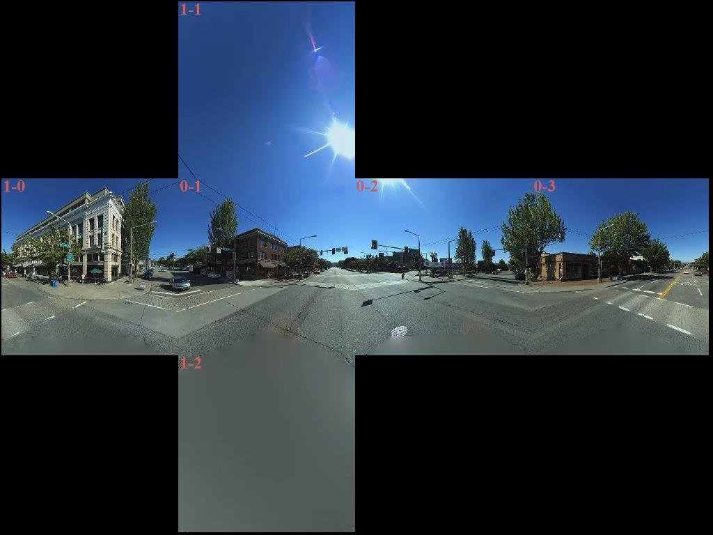
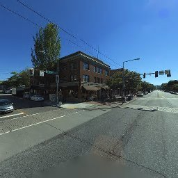

# Getting Streetside Tiles from Imagery Metadata

The Bing Maps REST Imagery API now supports the retrieval of Streetside images. In this article, we demonstrate how to to make an Imagery API Metadata URL request at a location on Earth and then use this request to [piece together the raw tiles to create a panorama](#panorama) of that location.

Using as our location a point in Ballard, Seattle (`47.668687,-122.384795`) we create a URL request for the Streetside metadata at that location using the [Imagery Metadata API](../rest-services/imagery/get-imagery-metadata.md).

### URL Request

```url
http://dev.virtualearth.net/REST/v1/Imagery/MetaData/Streetside/47.668687,-122.384795?key={BingMapsAPIKey}
```

### JSON Response

```json
{
  "authenticationResultCode": "ValidCredentials",
  "brandLogoUri": "http://dev.virtualearth.net/Branding/logo_powered_by.png",
  "copyright": "Copyright © 2018 Microsoft and its suppliers. All rights reserved. This API cannot be accessed and the content and any results may not be used, reproduced or transmitted in any manner without express written permission from Microsoft Corporation.",
  "resourceSets": [
    {
      "estimatedTotal": 1,
      "resources": [
        {
          "__type": "StreetsideMetadata:http://schemas.microsoft.com/search/local/ws/rest/v1",
          "imageHeight": 256,
          "imageUrl": "http://ecn.{subdomain}.tiles.virtualearth.net/tiles/hs0203232101212100{faceId}{tileId}?g=6617&key={BingMapsKey}",
          "imageUrlSubdomains": [
            "t0",
            "t1",
            "t2",
            "t3"
          ],
          "imageWidth": 256,
          "imageryProviders": null,
          "vintageEnd": "17 Jul 2014 GMT",
          "vintageStart": "17 Jul 2014 GMT",
          "zoomMax": 4,
          "zoomMin": 1,
          "he": 52.286,
          "lat": 47.668696,
          "lon": -122.384813,
          "pi": 0.638,
          "ro": -0.326
        }
      ]
    }
  ],
  "statusCode": 200,
  "statusDescription": "OK",
  "traceId": "3f6f6409f04d4e4b93dcdd50fee6b508|CO3124D6DA|7.7.0.0"
}
```
For more information about this resource, see the [Imagery Metadata](../rest-services/imagery/imagery-metadata.md).

<a name="panorama"></a>
## Piecing the Tiles Together

The above JSON response returned a URL in the `imageURL` field. 

```url
http://ecn.{subdomain}.tiles.virtualearth.net/tiles/hs0203232101212100{faceId}{tileId}?g=6617&key={BingMapsKey}
```
This field contains three placeholders: `subdomain`, `faceId`, and `tileId`. Here we have four options for `subdomain`, found in the `imageUrlSubdomains` of the JSON response. 

The `faceId` and `tileId` are integers which are used to label the available raw tiles for that location. 

In the below picture, each tile is labeled with its `faceId` and `tileId` in the format: `"{faceId}-{tileID}"`.



For example, to retieve the tile with `faceId = 0` and `tileId = 1` (letting `subdomain` be `t0`) we can use the following image URL:

```url
http://ecn.t0.tiles.virtualearth.net/tiles/hs020323210121210001?g=6617&key={BingMapsKey}
``` 

This URL request returns the following JPEG image:



## Code Sample

Below is a .NET Core 2.0 C# source code example for creating the above panorama by making multiple REST calls to the ImageUrl for each valid `faceId` and `tileId`.

This source is also available on [GitHub](https://github.com/v-chrfr/GridBuilder).

```Csharp
using System;
using System.Drawing;
using System.Drawing.Imaging;
using System.Net;
using System.IO;
using System.Diagnostics;

namespace GridBuilder
{
    public class MakeImageGrid
    {
        private const int bit_map_size = 256;
        private const string BingMapsKey = "API_KEY_HERE";
        private const string subdomain = "t0";
        private const string URL = "http://ecn.{0}.tiles.virtualearth.net/tiles/hs0203232101212100{1}{2}?g=6616&key={3}";

        private const int master_size_x = bit_map_size * 4;
        private const int master_size_y = bit_map_size * 3;

        public void Print_Grid(string save_file_name)
        {
            // see https://docs.microsoft.com/en-us/dotnet/api/system.drawing.bitmap
            Bitmap cube_image = new Bitmap(master_size_x, master_size_y);
            Bitmap tmp_image;

            for (int face_id = 0; face_id < 2; face_id++)
            {
                for (int tile_id = 0; tile_id < ((face_id == 0) ? 4 : 3); tile_id++)
                {
                    tmp_image = GetCubeSide(face_id, tile_id);
                    UpdateCube(ref cube_image, ref tmp_image, face_id, tile_id);
                }
            }

            cube_image.Save(save_file_name, ImageFormat.Jpeg);
        }

        private void UpdateCube(ref Bitmap cube_image, ref Bitmap tmp_image, int face_id, int tile_id)
        {
            int x = 0;
            int y = 0;
            int x_var;
            int y_var;
            Color color;

            int move_len = bit_map_size - 2;

            if (face_id == 0)
            {
                y = move_len;
                x = move_len * (tile_id);
            }
            else
            {
                switch(tile_id)
                {
                    case 1:
                        y = 0;
                        x = move_len;
                        break;
                    case 0:
                        y = move_len;
                        break;
                    case 2:
                        default:
                        x = move_len;
                        y = 2 * move_len;
                        break;
                }
            }
                
            for (int i = 2; i < bit_map_size; i++)
            {
                for (int j = 2; j < bit_map_size; j++)
                {
                    color = tmp_image.GetPixel(i, j);
                    x_var = x + i;
                    y_var =y + j;
                    cube_image.SetPixel(x_var, y_var, color);
                }
            }

            Graphics g = Graphics.FromImage(cube_image);
            using (Font font = new Font("Times New Roman", 24, FontStyle.Bold, GraphicsUnit.Pixel))
            {
                PointF p = new PointF(x, y);
                g.DrawString($"{face_id}-{tile_id}", font, Brushes.IndianRed, p);
                g.Flush();
            }
        }

        private Bitmap GetCubeSide(int face_id, int tile_id)
        {
            Bitmap bp;
            using (WebClient webClient = new WebClient())
            {
                Uri fin_url = new Uri(string.Format(URL, subdomain, face_id, tile_id, BingMapsKey));
                Console.WriteLine("http: {0}", fin_url);
                byte[] data = webClient.DownloadData(fin_url);
                using (var stream = new MemoryStream(data))
                {
                    bp = new Bitmap(stream);
                }
            }

            return bp;
        }
    }

    class Program
    {
        static void Main(string[] args)
        {
            var save_file = "test.jpeg";
            MakeImageGrid image = new MakeImageGrid();
            image.Print_Grid(save_file);
            Console.ReadKey();
        }
    }
}
```
  
