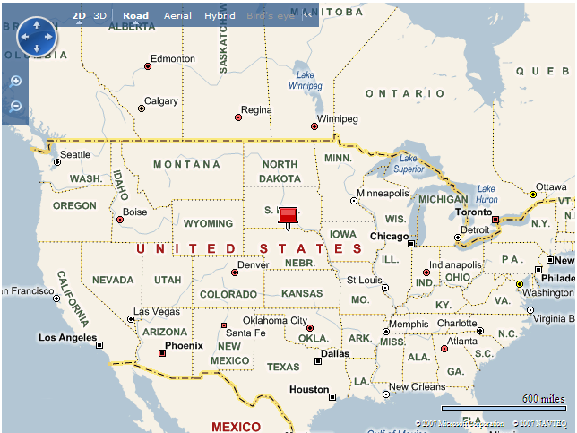
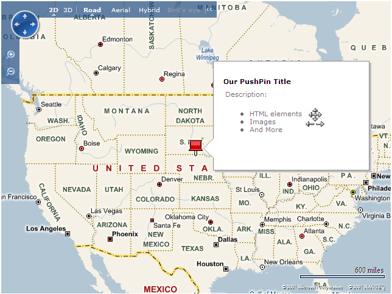
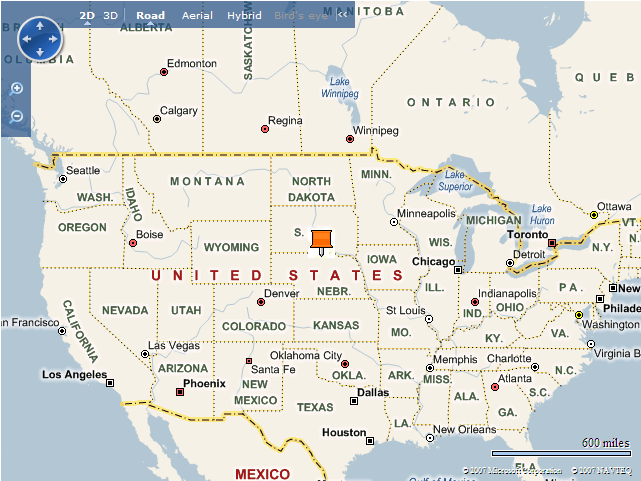
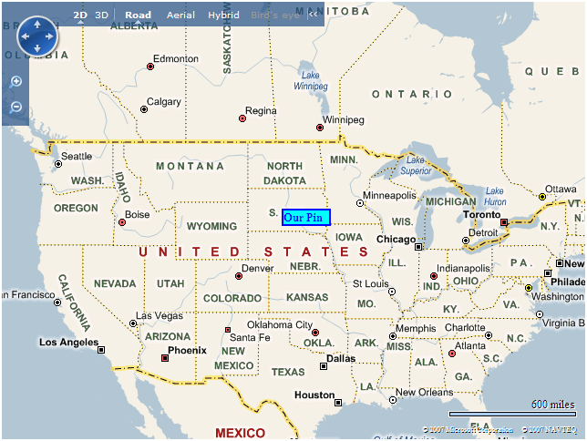
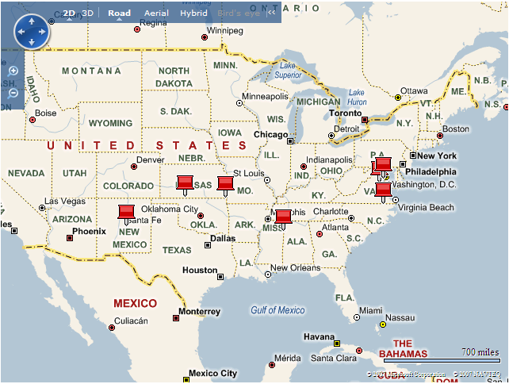
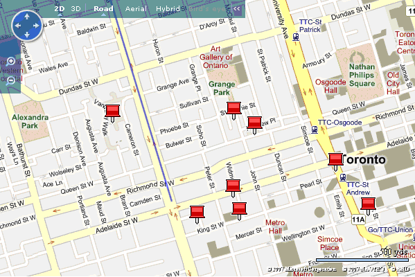

# Importing and Mapping Data
This article describes how to import shapes into a [!INCLUDE[ve_product_name](../articles/includes/ve-product-name-md.md)] map from three different types of resources: GeoRSS, [!INCLUDE[winlive_local_name](../articles/includes/winlive-local-name-md.md)], and KML. It also describes how to work with custom icons on a [!INCLUDE[ve_product_name](../articles/includes/ve-product-name-md.md)] map when importing data from one of these resource types.  
  
 The entire listing for the source file developed in this article is available in the ***Source Listing*** section.  
  
## Creating a Basic [!INCLUDE[ve_product_name](../articles/includes/ve-product-name-md.md)] Map  
 Create the file *Find.html* and add the code shown in *Listing 1* to that file.  
  
```  
<!DOCTYPE html PUBLIC "-//W3C//DTD XHTML 1.0 Transitional//EN" "http://www.w3.org/TR/xhtml1/DTD/xhtml1-transitional.dtd">  
<html>  
   <head>  
      <meta http-equiv="Content-Type" content="text/html; charset=utf-8" />  
      <title>Working with Shapes</title>  
  
      <script type="text/javascript" src="http://ecn.dev.virtualearth.net/mapcontrol/mapcontrol.ashx?v=6.3"></script>  
  
      <script type="text/javascript">  
         var map;  
  
         function OnPageLoad()  
         {  
            map = new VEMap('myMap');  
            map.LoadMap();  
         }  
      </script>  
   </head>  
   <body onload="OnPageLoad();">  
      <div id="myMap" style="position:relative;width:640px;height:480px;"></div>  
   </body>  
</html>  
```  
  
 *Listing 1*. Find.html  
  
 If you open this file in a Web browser, you should see something like the map shown in *Figure 1*.  
  
   
  
 *Figure 1*. A basic [!INCLUDE[ve_product_name](../articles/includes/ve-product-name-md.md)] map  
  
## Basic Shapes  
 Shapes can be added or deleted to any [!INCLUDE[ve_product_name](../articles/includes/ve-product-name-md.md)] map, and can have their display icons and pop-up information modified. There are three types of shapes in [!INCLUDE[ve_product_name](../articles/includes/ve-product-name-md.md)]: Pushpins (single points representing points-of-interest), Polyline (line segments), and Polygons (closed shapes representing regions).  
  
### Adding a Pushpin Shape to the Map  
 You can add a pushpin to a [!INCLUDE[ve_product_name](../articles/includes/ve-product-name-md.md)] map using the **VEShape** class. The **VEShape** constructor requires two parameters, a type and a location.  
  
 The first parameter is a **VEShapeType** object defining the type of shape. In our example we use a pushpin shape type, **VEShapeType.Pushpin**. The other shape types are polyline,  **VEShapeType.Polyline**, and polygon, **VEShapeType.Polygon**.  
  
 The second parameter is a **VELatLong** object defining the location. We use the center of the map in our example.  
  
 Add a pushpin to the center of the map by adding the code in *Listing 2* to the **OnPageLoad** method.  
  
```  
var pin = new VEShape(VEShapeType.Pushpin,map.GetCenter());  
map.AddShape(pin);  
```  
  
 *Listing 2*. Creating a pushpin  
  
 The map should then look like *Figure 2*.  
  
   
  
 *Figure 2*. The basic map with a pushpin in the center  
  
 **VEShape** class objects also have a number of properties that you can set to provide additional information to the map viewer, such as a title and description. These fields can include standard HTML code so we have some control over their appearance. For example, add the code in *Listing 3* to provide some additional information to the user when they hover over a pushpin.  
  
```  
pin.SetTitle("Our PushPin Title");  
pin.SetDescription("<table><tr><td>Description:<br/><ul><li>HTML elements</li> <li>" +   
                   "Images</li><li>And More</li></ul></td><td></td></tr></table>");  
```  
  
 *Listing 3*. Adding a title and description to a shape  
  
 The image file, *arrows.png*, is shown in *Figure 3*.  
  
   
  
 *Figure 3*. arrows.png  
  
 The resulting map should look like *Figure 4*.  
  
   
  
 *Figure 4*. The map with a shape containing a title and description  
  
## Custom Shape Icons  
 If you don’t want to use the standard [!INCLUDE[ve_product_name](../articles/includes/ve-product-name-md.md)] pushpin icon, you can add a custom icon in its place. This can be done by either using a custom image or by using custom HTML.  
  
 The custom image example uses the image in *Figure 5*.  
  
   
  
 *Figure 5*. The custom image  
  
 To create a pushpin using a custom image, add the code in *Listing 4*.  
  
```  
var icon = "";  
pin.SetCustomIcon(icon);  
```  
  
 *Listing 4*. Custom image as an icon  
  
 The resulting map should look like *Figure 6*.  
  
   
  
 *Figure 6*. Map with custom image icon  
  
 To create a pushpin using custom HTML, replace the **icon** declaration with the code in *Listing 5*.  
  
```  
var icon = "<div style='font-size:12px;font-weight:bold;border:solid 2px" +    
           "Black;background-color:Aqua;width:50px;'>Our Pin</div>";  
```  
  
 *Listing 5*. Custom HTML as an icon  
  
 The resulting map should look like *Figure 7*.  
  
   
  
 *Figure 7*. Map with custom HTML icon  
  
 You can even create an icon using a custom image and add a CSS style tag so that you can have some text appear on the image. Replace the **icon** declaration with the code in *Listing 6*.  
  
```  
var n = " 1";  
var icon = "<span class='pinText'>" + n + "</span>";  
```  
  
 *Listing 6*. Custom image with style  
  
 Then add the code in *Listing 7* to the HEAD section.  
  
```  
<style type="text/css">  
   .pinText  
   {   
      position:relative;   
      top:-25px;   
      left:2px;  
      width:30px;  
      color:#ffffff;   
      text-align:center;   
      font: bold 12px Arial;   
   }  
</style>  
```  
  
 *Listing 7*. The style declaration  
  
 The resulting map should look like *Figure 8*.  
  
   
  
 *Figure 8*. Custom image with style  
  
## Deleting Shapes  
 You can delete a single shape using the **VEMap.DeleteShape** method or all shapes with the **VEMap.DeleteAllShapes** method.  
  
## Working with Collections of Shapes  
 The [!INCLUDE[vemc_product_name](../articles/includes/vemc-product-name-md.md)] supports the following collections of shapes.  
  
-   Shape collections on [!INCLUDE[winlive_name](../articles/includes/winlive-name-md.md)]  
  
-   Shape references in GeoRSS files  
  
-   Shape references in KML files  
  
### Linking to a [!INCLUDE[winlive_name](../articles/includes/winlive-name-md.md)] Shape Collection  
 [!INCLUDE[winlive_local_name](../articles/includes/winlive-local-name-md.md)] gives registered users the ability to create and save collections. To create a collection, perform the following steps.  
  
1.  Go to [Windows Live Local](http://local.live.com/).  
  
2.  Sign in to your account, or create one if you don’t already have one.  
  
3.  Create a collection of shapes on your scratch pad.  
  
4.  Save the collection, providing a title and description. Make sure that you select the option to make the collection public.  
  
 Once you have your collection saved, select the **Share** option and then the **Copy to link to clipboard** option. The clipboard should then contain a link similar to *http://local.live.com/?v=2&cid=98C746DDDC3FE6CA!104*. This link goes to a short collection of US Civil War battlefields, and we will use it as sample data. If you open this link, you will go to [!INCLUDE[winlive_local_name](../articles/includes/winlive-local-name-md.md)], and see the collection.  
  
 The next step is to add a reference this collection.  
  
 The layer source is the collection ID from the [!INCLUDE[winlive_local_name](../articles/includes/winlive-local-name-md.md)] link. Note that you only need the part after the "cid=" parameter in the original URL.  
  
 Replace the **OnPageLoad** method with the contents of *Listing 8*.  
  
```  
function OnPageLoad()  
{  
   map = new VEMap('myMap');  
   map.LoadMap();  
  
   var layer = new VEShapeLayer();  
   var veLayerSpec = new VEShapeSourceSpecification(VEDataType.VECollection,"98C746DDDC3FE6CA!104", layer);  
   map.ImportShapeLayerData(veLayerSpec);  
}  
```  
  
 *Listing 8*. The OnPageLoad method with a reference to a [!INCLUDE[winlive_local_name](../articles/includes/winlive-local-name-md.md)] collection  
  
 If we load this page in a browser, we see that the map automatically displays the collection as a set of pushpins. It also centers the map to show all of the pushpins. The resulting map should look like *Figure 9*.  
  
   
  
 *Figure 9*. Map with [!INCLUDE[winlive_local_name](../articles/includes/winlive-local-name-md.md)] collection  
  
### Linking to a GeoRSS Feed  
 GeoRSS is an XML grammar for publishing events that are linked to a specific location. [!INCLUDE[ve_product_name](../articles/includes/ve-product-name-md.md)] supports both the W3C Basic Geo Vocabulary as well as those defined by GeoRSS. Both formats are versions of the basic RSS format, with an additional attribute for providing the latitude and longitude.  
  
 In this example, we are going to use a mock GeoRSS feed representing road hazards in the Toronto area. Our XML file for the feed, hazards.xml, is shown in *Listing 9*.  
  
```  
<?xml version="1.0" encoding="UTF-8"?>  
<rss version="2.0" xmlns:geo="http://www.w3.org/2003/01/geo/wgs84_pos#" xmlns:georss="http://www.georss.org/georss" xmlns:gml="http://www.opengis.net/gml" xmlns:mappoint="http://virtualearth.msn.com/apis/annotate#">  
   <channel>  
      <title>Reported Road Hazards</title>  
      <link/>  
      <description>Road hazards reported to the city</description>  
      <item>  
         <title>Traffic Light</title>  
         <description>Traffic light on north west corner out</description>  
         <geo:lat>43.64887</geo:lat>  
         <geo:long>-79.385362</geo:long>  
      </item>  
      <item>  
         <title>Traffic Signage</title>  
         <description>Stop sign missing</description>  
         <geo:lat>43.646870</geo:lat>  
         <geo:long>-79.383342</geo:long>  
      </item>  
      <item>  
         <title>Pothole</title>  
         <description>Large pothole on westbound lane</description>  
         <geo:lat>43.646511</geo:lat>  
         <geo:long>-79.393944</geo:long>  
      </item>  
      <item>  
         <title>Flooding</title>  
         <description>Flood drain blocked with branches on SW corner</description>  
         <geo:lat>43.646658</geo:lat>  
         <geo:long>-79.391345</geo:long>  
      </item>  
      <item>  
         <title>Traffic Signage</title>  
         <description>Street sign bent wrong way</description>  
         <geo:lat>43.647729</geo:lat>  
         <geo:long>-79.391741</geo:long>  
      </item>  
      <item>  
         <title>Pothole</title>  
         <description>Pothole forming in center of intersection</description>  
         <geo:lat>43.650537</geo:lat>  
         <geo:long>-79.390407</geo:long>  
      </item>  
      <item>  
         <title>Traffic Signage</title>  
         <description>Street sign upside down</description>  
         <geo:lat>43.651184</geo:lat>  
         <geo:long>-79.391702</geo:long>  
      </item>  
      <item>  
         <title>Pothole</title>  
         <description>Uneven road surface from sewer work</description>  
         <geo:lat>43.651090</geo:lat>  
         <geo:long>-79.399210</geo:long>  
      </item>  
      <item>  
         <title>Road closure</title>  
         <description>Road closed due to parade</description>  
         <georss:line>43.64706790907093 -79.39553260803223 43.66644233053208 -79.4036865234375</georss:line>  
      </item>  
   </channel>  
</rss>  
```  
  
 *Listing 9*. The hazards.xml file  
  
 Note that each item in the feed contains a title and a description. These fields are automatically map to the title and details fields for our pushpins.  
  
 After you create your file, you need to host it somewhere to ensure that your map can access it. The [!INCLUDE[vemc_product_name](../articles/includes/vemc-product-name-md.md)] requires that the GeoRSS file must be publicly accessible through either get or post. This is easily accomplished by saving the file locally and accessing it through the URL *http://localhost/hazards.xml*.  
  
 We can now create the shape layer containing the GeoRSS feed data. Replace the **VEShapeSourceSpecification** call with the contents of *Listing 10*.  
  
```  
var veLayerSpec = new VEShapeSourceSpecification(VEDataType.GeoRSS, "http://localhost/hazards/hazards.xml", layer);  
```  
  
 *Listing 10*. The reference to a GeoRSS feed  
  
 The resulting map should look like *Figure 10*.  
  
   
  
 *Figure 10*. Map with GeoRSS feed  
  
### Linking to a KML Feed  
 KML (Keyhole Markup Language) is another XML grammar, and is quite different from GeoRSS in that it was developed specifically for mapping (rather than being adapted as a flavor of generic RSS).  
  
 Adding a KML data feed to a shape layer is similar to adding a GeoRSS feed to a shape layer. Replace the **VEShapeSourceSpecification** call with the contents of *Listing 11*.  
  
```  
var veLayerSpec = new VEShapeSourceSpecification(VEDataType.ImportXML, "http://localhost/kml/lines.kml", layer);  
```  
  
 *Listing 11*. The reference to a KML feed  
  
## Adding Custom Icons to a Shape Layer  
 Adding custom icons to a shape layer can be done with any shape layer regardless of where the data came from: KML, GeoRSS, or a [!INCLUDE[winlive_name](../articles/includes/winlive-name-md.md)] collection. For example, *Listing 12* creates custom icons for the [!INCLUDE[winlive_local_name](../articles/includes/winlive-local-name-md.md)] collection we created earlier.  
  
```  
var veLayerSpec = new VEShapeSourceSpecification(VEDataType.VECollection, "98C746DDDC3FE6CA!104", layer);  
  
map.ImportShapeLayerData(veLayerSpec, function()  
{  
   var numShapes = layer.GetShapeCount();  
   var s, n, icon;  
  
   for(var i = 0; i < numShapes; ++i)  
   {  
      s = layer.GetShapeByIndex(i);  
  
      n = i + 1;  
      icon = "<span class='pinText'>" + " " + n + "</span>";  
      s.SetCustomIcon(icon);  
   }  
}, true);  
```  
  
 *Listing 12*. Creating custom icons for a [!INCLUDE[winlive_local_name](../articles/includes/winlive-local-name-md.md)] collection  
  
 The resulting map should look like *Figure 11*.  
  
   
  
 *Figure 11*. [!INCLUDE[winlive_local_name](../articles/includes/winlive-local-name-md.md)] collection with custom icons  
  
## Conclusion  
 Now that you know how to import different types of data feeds into a shape layer and set custom icons for each layer, you can create your own mapping application that displays useful information for your customers.  
  
 This article was written by Richard Brundritt. Richard is a software developer at Infusion Development.  
  
## Source Listing  
 This section contains a complete listing of the source file in this article, *Find.html*.  
  
 *Listing 13* contains the entire source for *Find.html*.  
  
```  
<!DOCTYPE html PUBLIC "-//W3C//DTD XHTML 1.0 Transitional//EN" "http://www.w3.org/TR/xhtml1/DTD/xhtml1-transitional.dtd">  
<html>  
   <head>  
      <meta http-equiv="Content-Type" content="text/html; charset=utf-8" />  
      <title>Working with Shapes</title>  
  
      <script type="text/javascript" src="http://ecn.dev.virtualearth.net/mapcontrol/mapcontrol.ashx?v=6.3"></script>  
  
      <script type="text/javascript">  
         var map;  
  
         function OnPageLoad()  
         {  
            map = new VEMap('myMap');  
            map.LoadMap();  
  
            var layer = new VEShapeLayer();  
  
            // Windows Live Local  
            var veLayerSpec = new VEShapeSourceSpecification(VEDataType.VECollection, "98C746DDDC3FE6CA!104", layer);  
  
            map.ImportShapeLayerData(veLayerSpec, function()  
            {  
               var numShapes = layer.GetShapeCount();  
               var s, n, icon;  
  
               for(var i = 0; i < numShapes; ++i)  
               {  
                  s = layer.GetShapeByIndex(i);  
  
                  n = i + 1;  
                  icon = "<span class='pinText'>" + " " + n + "</span>";  
                  s.SetCustomIcon(icon);  
               }  
            }, true);  
  
            // GeoRSS feed  
            // var veLayerSpec = new VEShapeSourceSpecification(VEDataType.GeoRSS, "http://localhost/hazards/hazards.xml", layer);  
  
            // KML feed  
            // var veLayerSpec = new VEShapeSourceSpecification(VEDataType.ImportXML, "http://localhost/kml/lines.kml", layer);  
  
            // map.ImportShapeLayerData(veLayerSpec);  
  
            // var pin = new VEShape(VEShapeType.Pushpin, map.GetCenter());  
  
            // pin.SetTitle("Our PushPin Title");  
            // pin.SetDescription("<table><tr><td>Description:<br/><ul><li>HTML elements</li> <li> " +   
            //                    "Images</li><li>And More</li></ul></td><td></td></tr></table>");  
  
            // Custom image icon  
            // var icon = "";  
  
            // Custom HTML icon  
            // var icon = "<div style='font-size:12px;font-weight:bold;border:solid 2px" +    
            //            "Black;background-color:Aqua;width:50px;'>Our Pin</div>";  
  
            // Custom image icon with style (note the space)  
            // var n = " 1";  
            // var icon = "<span class='pinText'>" + n + "</span>";  
  
            // pin.SetCustomIcon(icon);  
  
            // map.AddShape(pin);  
         }  
      </script>  
  
      <style type="text/css">  
         .pinText  
         {   
            position:relative;   
            top:-30px;   
            left:10px;  
            width:30px;  
            color:#ffffff;   
            text-align:center;   
            font: bold 12px Arial;   
         }  
      </style>  
  
   </head>  
   <body onload="OnPageLoad();">  
      <div id="myMap" style="position:relative;width:640px;height:480px;"></div>  
   </body>  
</html>  
```  
  
 *Listing 13*. Find.html