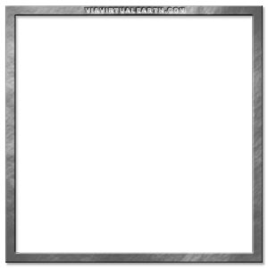
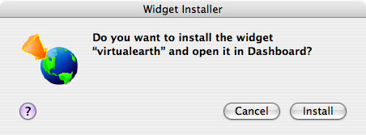

# Integrating Bing Maps into the OS X Dashboard
> [!CAUTION]
>  The content in this article may still be applicable to the current version of the [!INCLUDE[vemc_product_name](../articles/includes/vemc-product-name-md.md)], but it uses a previous version of the [!INCLUDE[vemc_product_name](../articles/includes/vemc-product-name-md.md)] which is no longer supported. More information about the current version of the [!INCLUDE[vemc_product_name](../articles/includes/vemc-product-name-md.md)] is found in the [Bing Map Control SDK](http://msdn.microsoft.com/en-us/library/bb429619.aspx).  
  
 Apple's flagship operating system is OS X Tiger, and it contains a nifty feature known as the Dashboard. This is old news to Mac aficionados, of course, but their Windows brethren can [read all about it here](http://www.apple.com/downloads/dashboard/?r=dbw).  
  
 I thought it would be neat to have a [!INCLUDE[vemc_product_name](../articles/includes/vemc-product-name-md.md)] accessible through the Dashboard, so I went ahead and implemented my own Dashboard Widget for the task. I had never written anything for the Dashboard before, and so was pleasantly surprised to see how easy it was to write one. This tutorial will take you through my Widget, step by step.  You can also download the complete widget [here](http://www.hagus.net/node/96).  
  
 Unfamiliar with the basics of the [!INCLUDE[ve_product_name](../articles/includes/ve-product-name-md.md)] controls? Visit [Getting Started with V4 of the API (Part 1)](../articles/getting-started-with-v4-of-the-api-part-1.md) and brush up first.  
  
## The Dashboard environment.  
 Apple has a [comprehensive section](http://developer.apple.com/macosx/dashboard.html) on their developer pages describing the Dashboard environment. But to summarize, the four basic components you need for a Widget are:  
  
1.  A HTML file that defines the user interface for the widget  
  
2.  A default background image in PNG format  
  
3.  An icon image to represent the widget in the Widget Bar  
  
4.  An XML formatted property list that contains various widget metadata  
  
 In our case we'll put all this into a directory called virtualearth.wdgt.  
  
### Designing out our Widget  
 I admit to being very much less than a genius when it comes to Photoshop. However, I can still knock up something that would make a graphic designer sigh painfully (as opposed to burst with gales of laugher). I thought maybe a beveled stone sort of look would be a suitably flagrant violation of Apple's user interface guidelines. This is named Default.png.  
  
   
  
 It's worth noting that the minimum dimensions of the [!INCLUDE[vemc_product_name](../articles/includes/vemc-product-name-md.md)] forced me to produce a widget this large; I would have preferred something slightly smaller.  
  
 I also pilfered the ViaVirtualEarth logo and turned it into a transparent png. This file is named Icon.png.  
  
   
  
 So now we just need to organize for our Map Control to be displayed inside this widget.  We start with a basic HTML page:  
  
### Writing our HTML page  
  
```  
<html>  
  <head>  
    <script src="http://dev.virtualearth.net/mapcontrol/v4/mapcontrol.js"></script>  
    <script type='text/javascript'>  
      function setup()  
      {  
        var map = null;  
        map = new VEMap('contents');  
        <!-- Change the lat and long if you want the map  
             view to default somewhere other than Cupertino -->  
        map.LoadMap(new VELatLong(37.3189139456153, -122.029211560580),  
          12, 'r', false);  
        var search = document.getElementById('SearchPanel');  
        map.AddControl(search);  
        search.style.left = "266px";  
        search.style.top = "31px";  
      }  
      function doFind()  
      {  
        map.Find(document.getElementById('txtWhat').value,   
                 document.getElementById('txtWhere').value);  
      }  
    </script>  
  </head>  
  <body onload="setup();">  
      
    <div id="contents"   
        style="position:absolute;width:400px;height:400px;"></div>  
    <div id="SearchPanel">  
      <table border=0>  
        <tr><td bgcolor='#C0C0CF'>  
          <p align='center'>Search</p></td></tr>  
        <tr><td><p align='center'>  
            What:  
            <INPUT id="txtWhat" type="text" value="" name="txtWhat">  
         </td></tr>  
         <tr><td><p align='center'>  
           Where:  
           <INPUT id="txtWhere" type="text" value="" name="txtWhere">  
         </td></tr>  
         <tr><td bgcolor='#E0E0E0'><p align='center'>  
          <input type="button" value="Search" onclick="doFind();"  
            id="Search" name="Search" />  
         </td></tr>  
       </table>  
    </div>  
  </body>  
</html>  
```  
  
 Let's examine this rather simple HTML block in more detail.  
  
 The first thing we do is include our reference to the [!INCLUDE[vemc_product_name](../articles/includes/vemc-product-name-md.md)] API.  The single script reference automatically includes all of the necessary controls and styles to display a map.  
  
 Next we have a small block of JavaScript that takes care of initializing our Map control. The most notable parameters are the two first floating point arguments, which specify the latitude and longitude for this map's starting coordinates. I chose Cupertino, just to be cute.  The next parameter is the zoom level (1 - world, 19 - street). The character parameter is the map style ('r' - road, 'h' - hybrid, 'a'- aerial, 'o' - Oblique/Birds Eye).  The last parameter indicates whether we want to lock the map.  Note that our map is automatically attached to the "contents" div tag in the body of the HTML page, and will take on the size of that tag. The next part of the load method attaches our what/where search box to the map and positions it.  The last part of the script block defines our search method.  
  
 In the body of the HTML, we start with a call to the previously defined `setup()` method after the page has loaded. The first tag inside the body is the "contents" div that will contain the map.  We will size this map through CSS.  The second tag is an image tag that is the same background image I designed earlier.  The third tag defines our what/where search block.  We can't use the default what/where find control because it is too big for our purposes.  
  
### Writing the stylesheet  
 Our layout magic happens (as it should) inside the stylesheet, which we can add to our HTML file in a style tag.  
  
```  
body  
{ margin: 0; }  
  
#contents  
{  
  top: 26px;  
  left: 26px;  
  -apple-dashboard-region: dashboard-region(control rectangle);  
}  
  
#SearchPanel  
{  
  width: 150px;  
  border-style: solid;  
  border-width: 1px;  
  border-color: lightgray;  
  background: white;  
}  
```  
  
 Our contents div is carefully designed to have just the right amount of padding and dimensions so that the map lies squarely inside the frame. The way we achieve this is through standard CSS layout techniques.  
  
 Apple has provided some special stylesheet extensions that handle Dashboard specific behavior. One of these is the "-apple-dashboard-region" statement. Normally, one can grab a Widget anywhere and drag it around the Dashboard. We can use dashboard-region to stop certain areas of the Widget from being drag handles. This is pretty important for [!INCLUDE[ve_product_name](../articles/includes/ve-product-name-md.md)], as you must click and drag to actually use the map.  
  
 [Apple provides in-depth developer documentation](http://developer.apple.com/documentation/AppleApplications/Conceptual/Dashboard_Tutorial/index.html) for this feature. Our application is pretty simple - we just define the entire rectangular area of div "contents" to be excluded.  
  
### Writing the metadata  
 Info.plist is our property list that contains metadata relating to the Widget. [Apple's documentation](http://developer.apple.com/documentation/AppleApplications/Conceptual/Dashboard_Tutorial/index.html) takes you through the entire list of valid keys and values for this file.  
  
```  
<?xml version="1.0" encoding="UTF-8"?>  
<!DOCTYPE plist PUBLIC "-//Apple Computer//DTD PLIST 1.0//EN" "http://www.apple.com/DTDs/PropertyList-1.0.dtd">  
<plist version="1.0">  
<dict>  
        <key>CFBundleDisplayName</key>  
        <string>virtualearth</string>  
        <key>CFBundleIdentifier</key>  
        <string>com.apple.widget.virtualearth</string>  
        <key>CFBundleName</key>  
        <string>Virtual Earth</string>  
        <key>CFBundleShortVersionString</key>  
        <string>1.0</string>  
        <key>CFBundleVersion</key>  
        <string>1.0</string>  
        <key>MainHTML</key>  
        <string>VirtualEarth.html</string>  
        <key>AllowNetworkAccess</key>  
        <true/>  
</dict>  
</plist>  
```  
  
 CFBundleDisplayName must match the name of the Widget directory on disk, minus its extension. CFBundleIdentifier is a string that uniquely identifies the widget, a la Java'package naming system. MainHTML points to the main HTML file of this widget. And AllowNetworkAccess very importantly grants our Widget access to make network calls. This is important for any AJAX application embedded in a Widget.  
  
### Deploying the Widget  
 With all these pieces in place, all that remains is to actually install the Widget. This is accomplished by a simple double click on the Widget directory from the Finder. You will be prompted to confirm that you'd like to install this Widget, which then takes you to the Dashboard. You're prompted again to confirm you want this Widget, after which you should finally have it.  
  
   
  
 Well, give it a try! It should look something like this:  
  
   
  
 Notice that if you have a Mighty Mouse, or other scroll mouse, you can zoom in and out using the scroll wheel. And of course you can pan around the map, switch to Aerial or Hybrid, and generally do everything you normally can using [!INCLUDE[ve_product_name](../articles/includes/ve-product-name-md.md)].  
  
### In summary  
 I hope you enjoyed this glimpse into Dashboard's internals. Of course, if such a rich Web 2.0 control such as [!INCLUDE[ve_product_name](../articles/includes/ve-product-name-md.md)] can live happily inside the Dashboard, you should be pretty excited about the possibilities! Don't forget Dashboard Widgets can closely integrate with Apple specific applications via plugins [as documented here](http://developer.apple.com/documentation/AppleApplications/Conceptual/Dashboard_Tutorial/index.html). The sky is the limit, and the cleanliness and elegance of the Dashboard as an AJAX programming environment will make it all too easy for you.  
  
 Don't forget to check out more Dashboard Widgets at [Apple's download page](http://www.apple.com/downloads/dashboard/).  
  
 Article contributed by [Luke Burton](http://www.hagus.net/), and updated by [Robert McGovern MVP (Bing Maps/MapPoint)](https://mvp.support.microsoft.com/profile=A9159573-40DB-4BD1-A079-D57C675E1766).