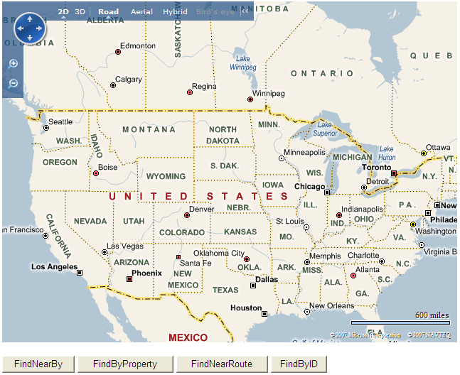
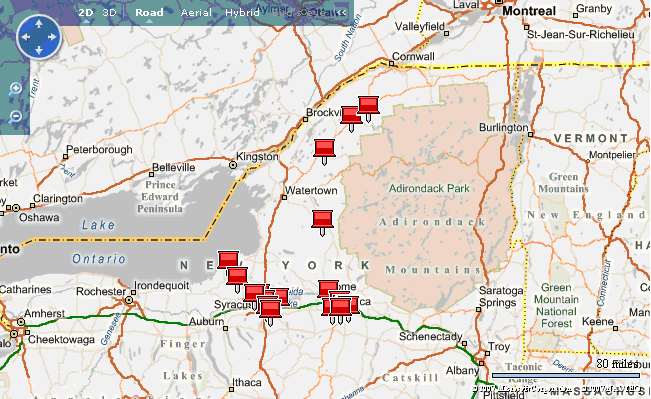
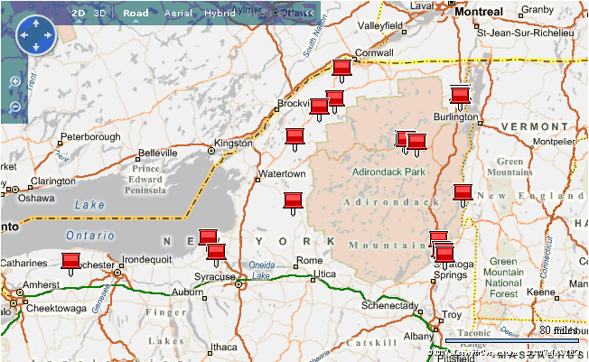
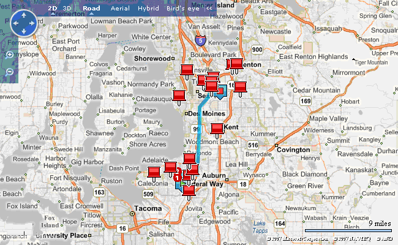
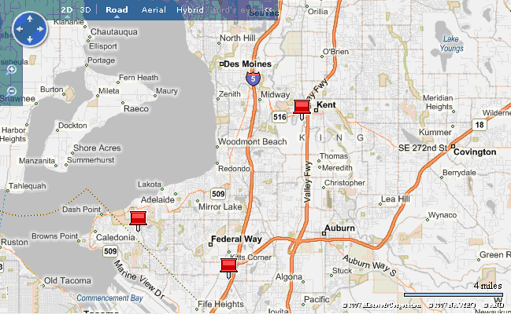

# Integrating MapPoint Web Services with Bing Maps
> [!IMPORTANT]
>  MapPoint Web Service is deprecated and will be retired November 18, 2011. For geocoding, imagery, and routing functionality, use the [Bing Maps REST Services](../rest-services/bing-maps-rest-services.md). Go to [http://www.microsoft.com/maps/mappoint.aspx](http://www.microsoft.com/maps/mappoint.aspx) for information about upgrading to Bing Maps.  
  
 In this article we will look at how to use ASP.Net to access the [!INCLUDE[mws_product_name](../articles/includes/mws-product-name-md.md)] and display the results on a [!INCLUDE[ve_product_name](../articles/includes/ve-product-name-md.md)] map. This article focuses on accessing data from custom data sources using the **FindNearBy**, **FindByProperty**, **FindByID**, and **FindNearRoute**[!INCLUDE[mws_product_name](../articles/includes/mws-product-name-md.md)] methods. The programming model we follow is the classic model, view, control model, where a front end component concerns itself with the user interface (view), a back end component concerns itself with making data requests (model), and a middle component mediates the requests and responses between the two (control).  
  
 Note that the complete listing of the source files developed in this article is available in the ***Source Listings*** section.  
  
## Getting Started  
 In order to make our application work, we will need to develop the following components, as illustrated in *Figure 1*.  
  
-   A front end (view) component that uses a [!INCLUDE[vemc_product_name](../articles/includes/vemc-product-name-md.md)] and sends an HTTP request to the middle component for [!INCLUDE[mappoint_product_name](../articles/includes/mappoint-product-name-md.md)] data, and displays that data.  
  
-   A middle (control) component that receives the front end component's HTTP requests, translates them into the back end component's [!INCLUDE[mws_product_name](../articles/includes/mws-product-name-md.md)] requests, and returns that data to the front end component.  
  
-   A back end (model) component that receives requests from the middle component, converts those into [!INCLUDE[mws_product_name](../articles/includes/mws-product-name-md.md)] requests, and returns that data to the middle component.  
  
   
  
 *Figure 1*. The integration data flow  
  
## Creating the ASP.Net Project  
 Open Visual Studio (2005 was used for this article, so some minor differences may occur if you use a different version), select New, Project, then ASP.Net Web Application. Name your project **MWSFind**.  
  
## Creating the Front End View Component  
 The front end component consists of some HTML and JavaScript methods that make HTTP requests to the middle component.  
  
### Adding the Initial HTML  
 If Solution Explorer is not visible, open it by clicking *View*, *Solution Explorer*. Right-click **MWSFind**, select *Add*, *New Item*. Select *HTML Page* and enter *Default.htm*. If Visual Studio does not open *Default.htm* in the editor, double-click *Default.htm* in Solution Explorer and replace its contents with that in *Listing 1*.  
  
```  
<!DOCTYPE html PUBLIC "-//W3C//DTD XHTML 1.0 Transitional//EN" "http://www.w3.org/TR/xhtml1/DTD/xhtml1-transitional.dtd">  
<html>  
   <head>  
      <title>Integrating MWS with Bing Maps</title>  
      <meta http-equiv="Content-Type" content="text/html; charset=utf-8"/>  
   </head>  
   <body onload="OnPageLoad('myMap')">  
      <div id="myMap" style="position:relative;width:640px;height:480px;"></div>  
  
      <br />    
  
      <input id="findNearBy" type="button" value="FindNearBy" onclick="FindNearBy();"/>  
      <input id="findByProperty" type="button" value="FindByProperty" onclick="FindByProperty();"/>  
      <input id="findNearRoute" type="button" value="FindNearRoute" onclick="FindNearRoute();"/>  
      <input id="findByID" type="button" value="FindByID" onclick="FindByID();"/>  
   </body>  
</html>  
```  
  
 *Listing 1*. Default.htm  
  
### Adding the JavaScript to Create a Map Control  
 *Listing 2* creates a reference to the [!INCLUDE[ve_product_name](../articles/includes/ve-product-name-md.md)]. Add this code to the HEAD section of *Default.htm*.  
  
```  
<script type="text/javascript" src="http://ecn.dev.virtualearth.net/mapcontrol/mapcontrol.ashx?v=6.3"></script>  
```  
  
 *Listing 2*. The Map Control reference in Default.htm  
  
 Listing 3 contains the **OnPageLoad** method through which we use to draw the map and defines some global variables that we use later. Add this code to the HEAD section of *Default.htm*.  
  
```  
<script type="text/javascript">  
   var map;  
   var datasource = "MapPoint.FourthCoffeeSample";  
   var entityName = "FourthCoffeeShops";  
   var searchRadius = 250;  
  
   function OnPageLoad(element)  
   {  
      map = new VEMap(element);  
      map.LoadMap();  
   }  
</script>  
```  
  
 *Listing 3*. The OnPageLoad function and some global variables  
  
### Creating a Virtual Directory to Test Your Code  
 Once you have saved Default.htm, one way to test it is by creating a Virtual Directory in Microsoft Internet Information Services (IIS) that points to your project. Open IIS (typically **start**, **Administrative Tools**, **Internet Information Services**), navigate to the Default Web Site, right-click the Default Web Site, and select New, Virtual Directory. Enter *MWSFind* as the alias, then the path to your **MWSFind** project to create a Virtual Directory that references **MWSFind**.  
  
 If you open *http://localhost/MWSFind* in a Web browser, you should see something like *Figure 2*.  
  
   
  
 *Figure 2*. The initial Web page  
  
### Adding the JavaScript for HTTP Requests  
 Add the code in *Listing 4* to initialize an XML HTTP object.  
  
```  
var xmlhttp=false;  
  
function InitXmlHttp()   
{  
   // Attempt to initialize xmlhttp object  
   try  
   {  
      xmlhttp = new ActiveXObject("Msxml2.XMLHTTP");  
   }  
   catch (e)  
   {  
      // Try to use different activex object  
      try  
      {  
         xmlhttp = new ActiveXObject("Microsoft.XMLHTTP");  
      }  
      catch (E)  
      {  
         xmlhttp = false;  
      }  
   }  
   // If not initialized, create XMLHttpRequest object  
   if (!xmlhttp && typeof XMLHttpRequest!='undefined')  
   {  
      xmlhttp = new XMLHttpRequest();  
   }  
  
   // Define function call for when Request obj state has changed  
   xmlhttp.onreadystatechange=SearchHandler;  
}  
  
function SearchHandler()  
{  
   if (xmlhttp.readyState==4)  
   {  
      eval(xmlhttp.responseText);  
   }  
}  
```  
  
 *Listing 4*. The HttpRequest code  
  
 Now we can make an HTTP call by initializing the **xmlhttp** object, and using its **open** and **send** methods. When the call is returned, it is automatically processed by the **SearchHandler** function.  
  
### Adding the AddPin Function  
 Our middle component is going to return a string representing a set of JavaScript calls. Although we could have it return a set of **map.AddPushpin** calls, that creates too much of a dependency between our front and back end. Instead, we are going to have our back end call the JavaScript function **AddPin**, as shown in *Listing 5*.  
  
```  
function AddPin(lat, lng, title, description)  
{  
   try   
   {  
      var shape = new VEShape(VEShapeType.Pushpin,   
                              new VELatLong(lat, lng));  
      shape.SetTitle(title);  
      shape.SetDescription(description);  
      map.AddShape(shape);  
   }   
   catch (err)  
   {  
      alert(err);  
   }  
}  
```  
  
 *Listing 5*. The AddPin function.  
  
### Adding the Button Handler Functions  
 You probably noticed that the four buttons we created in the BODY section refer to four missing functions, **FindNearBy**, **FindByProperty**, **FindNearRoute**, and **FindByID**. We will implement these four functions in this section.  
  
#### Adding the FindNearBy Function  
 The **FindNearBy** function shown in *Listing 6* uses the center of the map as the center of the search. It sends the name of the datasource, the entity type name, and the search radius to the middle component for processing.  
  
```  
function FindNearBy()  
{  
   map.DeleteAllShapes();  
  
   var ll = map.GetCenter();  
  
   InitXmlHttp();  
  
   var msg = "MWSFindHandler.ashx?&FT=FindNearBy&Lat=" +  
             ll.Latitude +  
             "&Lng=" +  
             ll.Longitude +  
             "&DBS=" +  
             datasource +  
       "&ENTY=" +  
             entityName +  
             "&Dis=" +  
             searchRadius;  
  
   xmlhttp.open("GET", msg, true);  
   xmlhttp.send(null);  
}  
```  
  
 *Listing 6*. The FindNearBy function  
  
#### Adding the FindByProperty Function  
 The **FindByProperty** function shown in *Listing 7* uses the center of the map as the center of the search. It sends the data source name, the entity type name, an expression and a list of parameters to the middle component for processing.  
  
```  
function FindByProperty()  
{  
   map.DeleteAllShapes();  
  
   var expression = "Subdivision = {0}";  
   var parameters = "NY"  
   var ll = map.GetCenter();  
  
   InitXmlHttp();  
  
   var msg = "MWSFindHandler.ashx?&FT=FindByProperty&DBS=" +  
             datasource +  
             "&ENTY=" +  
             entityName +  
             "&Exp=" +  
             expression +  
             "&PRM=" +  
             parameters;  
  
   xmlhttp.open("GET", msg, true);  
   xmlhttp.send(null);  
}  
```  
  
 *Listing 7*. The FindByProperty function  
  
#### Adding the FindByID Function  
 The **FindByID** function shown in *Listing 8* uses the center of the map as the center of the search. It sends a comma delimitated string representing the array of entity IDs, the datasource name, and the entity type name to the middle component for processing.  
  
```  
function FindByID()  
{  
   map.DeleteAllShapes();  
  
   var arrayID = "-11777,-11781,-11789";  
  
   InitXmlHttp();  
  
   var msg = "MWSFindHandler.ashx?&FT=FindByID&DBS=" +  
             datasource +  
       "&ENTY=" +  
             entityName +  
             "&ID=" +  
             arrayID;  
  
   xmlhttp.open("GET", msg, true);  
   xmlhttp.send(null);  
}  
```  
  
 *Listing 8*. The FindByID function  
  
#### Adding the FindNearRoute Function  
 The **FindNearRoute** function shown in *Listing 9* uses the center of the map as the center of the search. It uses the new GetDirections method in [!INCLUDE[ve_product_name](../articles/includes/ve-product-name-md.md)] to draw the route on the map. The route options are set so that it uses the [!INCLUDE[mws_product_abbr](../articles/includes/mws-product-abbr-md.md)] routing method. In our request to the handler we send the starting and ending coordinates along with [!INCLUDE[mappoint_product_name](../articles/includes/mappoint-product-name-md.md)] datasource name the route is being drawn in, the custom datasource the user is using, the entity type name, the route type and the distance from the route to search.  
  
```  
function FindNearRoute()  
{  
   map.DeleteAllShapes();  
  
   var startLocation = new VELatLong(47.301036844193135,   
                                     -122.32933044433595);  
   var endLocation = new VELatLong(47.441474801849466,   
                                   -122.24487304687503);  
   var mappointDatasource = "MapPoint.NA"  
   var distance = 5;  
   var routeType = "Quickest";  
  
   var options = new VERouteOptions;  
   options.UseMWS = true;  
   options.RouteOptimize = VERouteOptimize.MinimizeTime;  
  
   var locations = new Array(startLocation, endLocation);  
  
   map.GetDirections(locations, options);   
  
   InitXmlHttp();  
  
   var msg = "MWSFindHandler.ashx?&FT=FindNearRoute&sLat=" +  
             startLocation.Latitude +  
             "&sLng=" +  
             startLocation.Longitude +  
             "&eLat=" +  
             endLocation.Latitude +  
             "&eLng=" +  
             endLocation.Longitude +  
             "&mDBS=" +  
             mappointDatasource +  
             "&DBS=" +  
             datasource +  
             "&ENTY=" +  
             entityName +  
             "&RT=" +  
             routeType +  
             "&DIS=" +  
             distance;  
  
   xmlhttp.open("GET", msg, true);  
   xmlhttp.send(null);  
}  
```  
  
 *Listing 9*. The FindNearRoute function  
  
## Creating the Middle Control Component  
 The middle component is an ASHX page consisting of C# methods to mediate requests from the front end component and make calls to the back end [!INCLUDE[mws_product_abbr](../articles/includes/mws-product-abbr-md.md)] functions. This page has the following functionality.  
  
-   Validate the request  
  
-   Determine which method is being called  
  
-   Call the method in the back end component and pass the response back to the function in the front end component.  
  
### Creating the File and Adding the Initial C#  
 Right-click **MWSFind**, select *Add*, *New Item*. Select *Generic Handler* and enter *MWSFindHandler.ashx*.  
  
 Once we have our basic handler, we need to modify the **ProcessRequest** method to meet our needs. We need to determine which **find** method is being called, check the parameters, create our **MWSFindGenerator** class, get our data, and write it back to the requesting page. Replace **ProcessRequest** with the code shown in *Listing 10*.  
  
```  
public void ProcessRequest(HttpContext context)  
  
   context.Response.ContentType = "text/plain";  
   MWSFindGenerator fnbg = new MWSFindGenerator();  
  
   if (context.Request.QueryString["FT"] != null)   
   {  
      if (context.Request.QueryString["FT"].Equals("FindNearBy"))   
      {  
         if (context.Request.QueryString["lat"] != null  
             && context.Request.QueryString["lng"] != null  
             && context.Request.QueryString["dbs"] != null  
             && context.Request.QueryString["enty"] != null  
             && context.Request.QueryString["dis"] != null)   
         {  
            double lat = Double.Parse(context.Request.QueryString["Lat"]);  
            double lng = Double.Parse(context.Request.QueryString["Lng"]);  
            double dis = Double.Parse(context.Request.QueryString["Dis"]);  
  
            context.Response.Write(fnbg.FindNearBy(lat, lng,   
            context.Request.QueryString["DBS"],   
            context.Request.QueryString["ENTY"], dis));  
         }  
      }  
      else if(context.Request.QueryString["FT"].Equals("FindByProperty"))   
      {  
         if (context.Request.QueryString["DBS"] != null  
             && context.Request.QueryString["enty"] != null  
             && context.Request.QueryString["Exp"] != null  
             && context.Request.QueryString["PRM"] != null)  
         {  
            context.Response.Write(fnbg.FindByProperty(  
               context.Request.QueryString["DBS"],   
               context.Request.QueryString["ENTY"],  
               context.Request.QueryString["Exp"],   
               context.Request.QueryString["PRM"]));  
         }  
      }  
      else if(context.Request.QueryString["FT"].Equals("FindNearRoute"))   
      {  
         if (context.Request.QueryString["sLat"] != null  
             && context.Request.QueryString["sLng"] != null  
             && context.Request.QueryString["eLat"] != null  
             && context.Request.QueryString["eLng"] != null  
             && context.Request.QueryString["mDBS"] != null  
             && context.Request.QueryString["DBS"] != null  
             && context.Request.QueryString["enty"] != null  
             && context.Request.QueryString["RT"] != null  
             && context.Request.QueryString["Dis"] != null)  
         {  
            double slat = Double.Parse(context.Request.QueryString["sLat"]);  
            double slng = Double.Parse(context.Request.QueryString["sLng"]);  
            double elat = Double.Parse(context.Request.QueryString["eLat"]);  
            double elng = Double.Parse(context.Request.QueryString["eLng"]);  
            double dis = Double.Parse(context.Request.QueryString["Dis"]);  
            context.Response.Write(fnbg.FindNearRoute(  
               slat,slng,elat,elng,  
            context.Request.QueryString["mDBS"],  
               context.Request.QueryString["DBS"],   
               context.Request.QueryString["ENTY"],   
               context.Request.QueryString["RT"], dis));  
         }  
      }  
      else if (context.Request.QueryString["FT"].Equals("FindByID"))   
      {  
         if (context.Request.QueryString["DBS"] != null  
             && context.Request.QueryString["enty"] != null  
             && context.Request.QueryString["ID"] != null)   
         {  
            string tempString = (  
               context.Request.QueryString["ID"]).Replace(" ", "");  
            char[] sep = { ',' };  
            int[] arrayID = ParseIntValues(tempString.Split(sep));  
            context.Response.Write(fnbg.FindByID(  
               context.Request.QueryString["DBS"],   
               context.Request.QueryString["ENTY"], arrayID));  
         }  
      }  
   }  
}  
```  
  
 *Listing 10*. The ProcessRequest method  
  
 The **FindByID** function in the front end component sends a comma-delimited string to represent an array. Therefore, the middle component requires a function to convert this string into an integer array so that it can be sent to the [!INCLUDE[mws_product_name](../articles/includes/mws-product-name-md.md)]. This is done using the **ParseIntValues** method as shown in *Listing 11*.  
  
```  
private int[] ParseIntValues(string[] stringArray)  
{  
   int[] arrayID = new int[stringArray.Length];  
  
   for (int i = 0; i < stringArray.Length; i++)  
   {  
      arrayID[i] = Int32.Parse(stringArray[i]);  
   }  
  
   return arrayID;  
}  
```  
  
 *Listing 11*. The ParseIntValues method  
  
## Creating the Back End Model Component  
 The back end component is an ASPX page consisting of a C# method for each of the front end component's **Find** methods (**FindNearBy**, **FindByProperty**, **FindByID**, and **FindNearRoute**). These methods all return a string consisting of a semi-colon separated sequence of calls to **AddPin**. To make this work, we need to do the following.  
  
1.  Create a Web reference to [!INCLUDE[mws_product_name](../articles/includes/mws-product-name-md.md)]  
  
2.  Create an instance of the [!INCLUDE[mappoint_product_name](../articles/includes/mappoint-product-name-md.md)]**Find** proxy  
  
3.  Create an instance of the [!INCLUDE[mappoint_product_name](../articles/includes/mappoint-product-name-md.md)]**Route** proxy  
  
4.  Issue a call to the appropriate [!INCLUDE[mappoint_product_name](../articles/includes/mappoint-product-name-md.md)]**Find** method  
  
5.  Parse the results  
  
 We already have an ASPX page, *Default.aspx*, but you probably notice **ProcessRequest** creates a **MWSFindGenerator** object. We could just change the class name in *Default.aspx*, but that is confusing, so we next rename *Default.aspx* as *MWSFindGenerator.aspx*. Right-click *Default.aspx* in Solution Explorer and rename it as *MWSFindGenerator.aspx*.  
  
### Creating a Reference to the [!INCLUDE[mws_product_name](../articles/includes/mws-product-name-md.md)]  
 Right-click **MWSFind** and select *Add Web Reference*. Add the reference in *Listing 12* to the URL text box.  
  
```  
http://staging.mappoint.net/standard-30/mappoint.wsdl  
```  
  
 *Listing 12*. The [!INCLUDE[mws_product_name](../articles/includes/mws-product-name-md.md)] URL  
  
 Click the **Go** button. Under the *Web services found at this URL* text box you should see **mappoint**. Set the *Web reference name* to **MapPointService**. When you are done, the window should look like *Figure 3*.  
  
   
  
 *Figure 3*. The [!INCLUDE[mws_product_name](../articles/includes/mws-product-name-md.md)] reference  
  
 Click **Add Reference** and save your work. You now have access to the [!INCLUDE[mws_product_abbr](../articles/includes/mws-product-abbr-md.md)] proxy classes. Just make sure the using statement for **MapPointService** includes the **MWSFind** namespace.  
  
### Creating the Find Methods  
 Our code-behind file must contain the following methods to perform all of our [!INCLUDE[mappoint_product_name](../articles/includes/mappoint-product-name-md.md)] work.  
  
-   A constructor to instantiate the [!INCLUDE[mappoint_product_name](../articles/includes/mappoint-product-name-md.md)] proxy classes  
  
-   A public **FindNearBy** method  
  
-   A public **FindByProperty** method  
  
-   A public **FindByID** method  
  
-   A public **FindNearRoute** method  
  
-   A private **BuildPin** method  
  
 Open *MWSFindGenerator.aspx.cs* and add the code shown in *Listing 13*.  
  
```  
public class MWSFindGenerator  
{  
   private MapPointService.FindServiceSoap findService = null;  
   private MapPointService.RouteServiceSoap routeService = null;  
  
   //TODO:  Change the following values to your username and password  
   private String MPUser = ConfigurationManager.AppSettings["username"];  
   private String MPPass = ConfigurationManager.AppSettings["password"];  
  
   public MWSFindGenerator()  
   {  
      if (findService == null)  
      {  
         findService = new MapPointService.FindServiceSoap();  
      }  
  
      findService.Credentials = new System.Net.NetworkCredential(MPUser, MPPass);  
      findService.PreAuthenticate = true;  
  
      if (routeService == null)  
      {  
         routeService = new MapPointService.RouteServiceSoap();  
      }  
  
      routeService.Credentials = new System.Net.NetworkCredential(MPUser, MPPass);  
      routeService.PreAuthenticate = true;  
   }  
}  
```  
  
 *Listing 13*. The MWSFindGenerator class declaration  
  
 We start by declaring some internal constants for our user name and password (change these to your own values). We also need a member variable for our *Find* and *Route Services*.  
  
 Next, in the constructor, we create an instance of the *[!INCLUDE[mws_product_name](../articles/includes/mws-product-name-md.md)] Find Service* and *Route Service*. We also assign our username and password as credentials, and turn on pre-authentication to help speed up repeated requests to the service.  
  
### Adding the FindNearBy Method  
 This method is called with a latitude, a longitude, a custom datasource name, an entity type name, and a search radius. The **FindNearBy** method performs the following actions.  
  
1.  Creates a **FindNearbySpecification** object  
  
2.  Defines a datasource  
  
3.  Sets the latitude and longitude  
  
4.  Filters the results to only show results that match the entity type name  
  
5.  Execute a **FindNearby** call using the specified values  
  
6.  Parses the results  
  
 Add the code in *Listing 14* to the class.  
  
```  
public String FindNearBy(double latitude, double longitude, string datasource, string entityName, double distance)  
{  
   StringBuilder results = new StringBuilder();  
  
   try  
   {  
      FindNearbySpecification findNearbySpec = new FindNearbySpecification();  
  
      findNearbySpec.DataSourceName = datasource;  
      findNearbySpec.Distance = distance;  
      findNearbySpec.LatLong = new MapPointService.LatLong();  
      findNearbySpec.LatLong.Latitude = latitude;  
      findNearbySpec.LatLong.Longitude = longitude;  
      findNearbySpec.Filter = new MapPointService.FindFilter();  
      findNearbySpec.Filter.EntityTypeName = entityName;  
  
      FindResults foundResults = findService.FindNearby(findNearbySpec);  
  
      foreach (FindResult fr in foundResults.Results)  
      {  
         results.Append(BuildPin(fr.FoundLocation));  
      }  
   }  
   catch (Exception e)  
   {  
      results.Append("Alert('Error: ");  
      results.Append(e.ToString());  
      results.Append("');");  
   }  
  
   return results.ToString();  
}  
```  
  
 *Listing 14*. The FindNearBy method  
  
### Adding the FindByProperty Method  
 This method is called with a custom datasource name, an entity type name, an expression, and parameters. The **FindByProperty** method performs the following actions.  
  
1.  Creates a **FindByPropertySpecification** object  
  
2.  Defines a datasource  
  
3.  Filters the results to only show results that match the entity type name  
  
4.  Filters the results to only show results that match the expression  
  
5.  Executes a **FindByProperty** call using the specified values  
  
6.  Parses the results  
  
 Add the code in *Listing 15* to the class.  
  
```  
public String FindByProperty(string datasource, string entityName,   
    string findExpression, string parameters)  
{  
   StringBuilder results = new StringBuilder();  
  
   try  
   {  
      FindByPropertySpecification findByPropSpec = new FindByPropertySpecification();  
  
      findByPropSpec.DataSourceName = datasource;  
      findByPropSpec.Filter = new MapPointService.FindFilter();  
      findByPropSpec.Filter.EntityTypeName = entityName;  
      findByPropSpec.Filter.Expression = new FilterExpression();  
      findByPropSpec.Filter.Expression.Text = findExpression;  
      findByPropSpec.Filter.Expression.Parameters = new object[] {parameters};  
  
      FindResults foundResults = findService.FindByProperty(findByPropSpec);  
  
      foreach (FindResult fr in foundResults.Results)  
      {  
         results.Append(BuildPin(fr.FoundLocation));  
      }  
   }  
   catch (Exception e)  
   {  
      results.Append("Alert('Error: ");  
      results.Append(e.ToString());  
      results.Append("');");  
   }  
  
   return results.ToString();  
}  
```  
  
 *Listing 15*. The FindByProperty method  
  
### Adding the FindByID Method  
 This method is called with a custom datasource name, an entity type name, and an integer array of entity IDs. The **FindByID** method performs the following actions.  
  
1.  Creates a **FindByIDSpecification** object  
  
2.  Defines a datasource  
  
3.  Filters the results to only show results that match the entity type name  
  
4.  Specifies the Entity IDs  
  
5.  Executes a **FindByID** call using the specified values  
  
6.  Parses the results  
  
 Add the code in *Listing 16* to the class.  
  
```  
public String FindByID(string datasource, string entityTypeName, int[] arrayID)  
{  
   StringBuilder results = new StringBuilder();  
  
   try  
   {  
      FindByIDSpecification findByIDSpec = new FindByIDSpecification();  
  
      findByIDSpec.DataSourceName = datasource;  
      findByIDSpec.Filter = new MapPointService.FindFilter();  
      findByIDSpec.Filter.EntityTypeName = entityTypeName;  
      findByIDSpec.EntityIDs = arrayID;  
  
      FindResults foundResults = findService.FindByID(findByIDSpec);  
  
      foreach (FindResult fr in foundResults.Results)  
      {  
         results.Append(BuildPin(fr.FoundLocation));  
      }  
   }  
   catch (Exception e)  
   {  
      results.Append("Alert('Error: ");  
      results.Append(e.ToString());  
      results.Append("');");  
   }  
  
   return results.ToString();  
}  
```  
  
 *Listing 16*. The FindByID method  
  
### Adding the FindRoute Method  
 This method is called with a custom datasource name, an entity type name, the start and end coordinates of the route, the [!INCLUDE[mappoint_product_name](../articles/includes/mappoint-product-name-md.md)] datasource containing the route, the route type, and the distance around the route to search. The **FindNearRoute** method performs the following actions.  
  
1.  Creates a route object that is equivalent to the route in [!INCLUDE[ve_product_name](../articles/includes/ve-product-name-md.md)]  
  
2.  Creates a **FindNearRouteSpecification** object  
  
3.  Defines a datasource  
  
4.  Filters the results to only show results that match the entity type name  
  
5.  Defines the search distance  
  
6.  Defines the route  
  
7.  Executes a **FindNearRoute** call using the specified values  
  
8.  Parses the results  
  
 Add the code in *Listing 17* to the class.  
  
```  
public String FindNearRoute(double startLat, double startLong, double endLat, double endLong, string mappointDatasource, string customDatasource, string entityTypeName, string routeType, double distance)  
{  
   StringBuilder results = new StringBuilder();  
  
   try  
   {  
      LatLong[] latLongs = new LatLong[2];  
      latLongs[0] = new LatLong();  
      latLongs[1] = new LatLong();  
      latLongs[0].Latitude = startLat;  
      latLongs[0].Longitude = startLong;  
      latLongs[1].Latitude = endLat;  
      latLongs[1].Longitude = endLong;  
  
      SegmentPreference segPref = new SegmentPreference();  
  
      if(routeType.Equals("Quickest"))  
      {  
         segPref = SegmentPreference.Quickest;  
      }  
      else if(routeType.Equals("Shortest"))  
      {  
         segPref = SegmentPreference.Shortest;  
      }  
      else    //PreferredRoads  
      {  
         segPref = SegmentPreference.PreferredRoads;  
      }  
  
      Route route = routeService.CalculateSimpleRoute(latLongs, mappointDatasource, segPref);  
  
      FindNearRouteSpecification findRouteSpec = new FindNearRouteSpecification();  
  
      findRouteSpec.DataSourceName = customDatasource;  
      findRouteSpec.Filter = new MapPointService.FindFilter();  
      findRouteSpec.Filter.EntityTypeName = entityTypeName;  
      findRouteSpec.Distance = distance;  
      findRouteSpec.Route = route;  
  
      FindResults foundResults = findService.FindNearRoute(findRouteSpec);  
  
      foreach (FindResult fr in foundResults.Results)  
      {  
         results.Append(BuildPin(fr.FoundLocation));  
      }  
   }  
   catch (Exception e)  
   {  
      results.Append("Alert('Error: ");  
      results.Append(e.ToString());  
      results.Append("');");  
   }  
  
   return results.ToString();  
}  
```  
  
 *Listing 17*. The FindRoute method  
  
### Adding the BuildPin Method  
 This method processes each of the returned [!INCLUDE[mappoint_product_name](../articles/includes/mappoint-product-name-md.md)] result objects and generates a string calling the **AddPin** method. The most challenging part of this method is extracting the interesting properties out of the **Location** object. Since the [!INCLUDE[mappoint_product_name](../articles/includes/mappoint-product-name-md.md)]**Location** object's properties array is numerically indexed, we convert it to a **Dictionary** object so that we can extract values by name.  
  
 Add the code in *Listing 18* to the class.  
  
```  
private String BuildPin(Location result)  
{  
   Dictionary<String, String> props = new Dictionary<String, String>();  
  
   foreach (MapPointService.EntityPropertyValue prop in result.Entity.Properties)  
   {  
      props.Add(prop.Name, System.Convert.ToString(prop.Value));  
   }  
  
   System.Text.StringBuilder sb = new System.Text.StringBuilder();  
  
   sb.Append("'<table>");  
   sb.Append("<tr><td>{0}</td></tr>");  
   sb.Append("<tr><td>{1}, {2}</td></tr>");  
   sb.Append("<tr><td>{3}</td></tr>");  
   sb.Append("<tr><td>{4}</td></tr>");  
   sb.Append("<tr><td>{5}</td></tr>");  
   sb.Append("</table>'");  
  
   Object[] pinParams = new Object[4];  
  
   pinParams[0] = result.LatLong.Latitude;  
   pinParams[1] = result.LatLong.Longitude;  
   pinParams[2] = String.Format("'{0}'",result.Entity.Name);  
   pinParams[3] = String.Format(sb.ToString(),  
      new Object[] {props["AddressLine"], props["PrimaryCity"], props["Subdivision"],   
      props["CountryRegion"], props["PostalCode"],props["Phone"]});  
  
   return String.Format("AddPin({0},{1},{2},{3});", pinParams);  
}  
```  
  
 *Listing 18*. The BuildPin method  
  
## The Find Results  
 Once you have saved your work and rebuilt the project to ensure you have no errors, click each of the buttons in turn. You should see something like the results shown in *Figure 4* for **FindNearBy**, *Figure 5* for **FindByProperty**, *Figure 6* for **FindNearRoute** and *Figure 7* for **FindByID**.  
  
   
  
 *Figure 4*. The FindNearBy results  
  
   
  
 *Figure 5*. The FindByProperty results  
  
   
  
 *Figure 6*. The FindNearRoute results  
  
   
  
 *Figure 7*. The FindByID results  
  
## Conclusion  
 Once you understand the basic process in place for making AJAX calls, you can easily link to other datasources. You can also easily expand upon these methods to include other [!INCLUDE[mappoint_product_name](../articles/includes/mappoint-product-name-md.md)] methods.  
  
 This article was written by Richard Brundritt. Richard is a software development enginner at Infusion Development.  
  
## Source Listings  
 The sections contains a complete listing for the three source files in this article, *Default.htm*, *MWSFindGenerator.aspx.cs*, and *MWSFindHandler.ashx*.  
  
### The Source for Default.htm  
 *Listing 19* contains the source for *Default.htm*.  
  
```  
<!DOCTYPE html PUBLIC "-//W3C//DTD XHTML 1.0 Transitional//EN" "http://www.w3.org/TR/xhtml1/DTD/xhtml1-transitional.dtd">  
<html>  
   <head>  
      <title>Integrating MWS with Bing Maps</title>  
      <meta http-equiv="Content-Type" content="text/html; charset=utf-8" />  
  
      <script type="text/javascript" src="http://ecn.dev.virtualearth.net/mapcontrol/mapcontrol.ashx?v=6.3"></script>  
  
      <script type="text/javascript">  
         var map;  
         var datasource = "MapPoint.FourthCoffeeSample";  
         var entityName = "FourthCoffeeShops";  
         var searchRadius = 250;  
  
         function OnPageLoad(element)  
         {  
            map = new VEMap(element);  
            map.LoadMap();  
         }  
  
         var xmlhttp=false;  
  
         function InitXmlHttp()   
         {  
            // Attempt to initialize xmlhttp object  
            try  
            {  
               xmlhttp = new ActiveXObject("Msxml2.XMLHTTP");  
            }  
            catch (e)  
            {  
               // Try to use different activex object  
               try  
               {  
                  xmlhttp = new ActiveXObject("Microsoft.XMLHTTP");  
               }  
               catch (E)  
               {  
                  xmlhttp = false;  
               }  
            }  
            // If not initialized, create XMLHttpRequest object  
            if (!xmlhttp && typeof XMLHttpRequest != 'undefined')  
            {  
               xmlhttp = new XMLHttpRequest();  
            }  
  
            // Define function call for when Request obj state has changed  
            xmlhttp.onreadystatechange = SearchHandler;  
         }  
  
         function SearchHandler()  
         {  
            if (xmlhttp.readyState == 4)  
            {  
               alert("Got the response text:\n" + xmlhttp.responseText);  
  
               eval(xmlhttp.responseText);  
            }  
         }  
  
         function AddPin(lat, lng, title, description)  
         {  
            try   
            {  
               var shape = new VEShape(VEShapeType.Pushpin,   
                                       new VELatLong(lat, lng));  
               shape.SetTitle(title);  
               shape.SetDescription(description);  
               map.AddShape(shape);  
            }   
            catch (err)  
            {  
               alert(err);  
            }  
         }  
  
         function FindNearBy()  
         {  
            map.DeleteAllShapes();  
  
            var ll = map.GetCenter();  
  
            InitXmlHttp();  
  
            var msg = "MWSFindHandler.ashx?&FT=FindNearBy&Lat=" +  
                      ll.Latitude +  
                      "&Lng=" +  
                      ll.Longitude +  
                      "&DBS=" +  
                      datasource +  
                   "&ENTY=" +  
                      entityName +  
                      "&Dis=" +  
                      searchRadius;  
  
            xmlhttp.open("GET", msg, true);  
            xmlhttp.send(null);  
         }  
  
         function FindByProperty()  
         {  
            map.DeleteAllShapes();  
  
            var expression = "Subdivision = {0}";  
            var parameters = "NY"  
            var ll = map.GetCenter();  
  
            InitXmlHttp();  
  
            var msg = "MWSFindHandler.ashx?&FT=FindByProperty&DBS=" +  
                      datasource +  
                      "&ENTY=" +  
                      entityName +  
                      "&Exp=" +  
                      expression +  
                      "&PRM=" +  
                      parameters;  
  
            xmlhttp.open("GET", msg, true);  
            xmlhttp.send(null);  
         }  
  
         function FindByID()  
         {  
            map.DeleteAllShapes();  
  
            var arrayID = "-11777,-11781,-11789";  
  
            InitXmlHttp();  
  
            var msg = "MWSFindHandler.ashx?&FT=FindByID&DBS=" +  
                      datasource +  
                   "&ENTY=" +  
                      entityName +  
                      "&ID=" +  
                      arrayID;  
  
            xmlhttp.open("GET", msg, true);  
            xmlhttp.send(null);  
         }  
  
         function FindNearRoute()  
         {  
            map.DeleteAllShapes();  
  
            var startLocation = new VELatLong(47.301036844193135,   
                                              -122.32933044433595);  
            var endLocation = new VELatLong(47.441474801849466,   
                                            -122.24487304687503);  
            var mappointDatasource = "MapPoint.NA"  
            var distance = 5;  
            var routeType = "Quickest";  
  
            var options = new VERouteOptions;  
            options.UseMWS = true;  
            options.RouteOptimize = VERouteOptimize.MinimizeTime;  
  
            var locations = new Array(startLocation, endLocation);  
  
            map.GetDirections(locations, options);   
  
            InitXmlHttp();  
  
            var msg = "MWSFindHandler.ashx?&FT=FindNearRoute&sLat=" +  
                      startLocation.Latitude +  
                      "&sLng=" +  
                      startLocation.Longitude +  
                      "&eLat=" +  
                      endLocation.Latitude +  
                      "&eLng=" +  
                      endLocation.Longitude +  
                      "&mDBS=" +  
                      mappointDatasource +  
                      "&DBS=" +  
                      datasource +  
                      "&ENTY=" +  
                      entityName +  
                      "&RT=" +  
                      routeType +  
                      "&DIS=" +  
                      distance;  
  
            xmlhttp.open("GET", msg, true);  
            xmlhttp.send(null);  
         }  
  
      </script>  
  
   </head>  
   <body onload="OnPageLoad('myMap')">  
      <div id="myMap" style="position: relative; width: 640px; height: 480px;"></div>  
      <br />  
      <input id="findNearBy" type="button" value="FindNearBy" onclick="FindNearBy();" />  
      <input id="findByProperty" type="button" value="FindByProperty" onclick="FindByProperty();" />  
      <input id="findNearRoute" type="button" value="FindNearRoute" onclick="FindNearRoute();" />  
      <input id="findByID" type="button" value="FindByID" onclick="FindByID();" />  
   </body>  
</html>  
```  
  
 *Listing 19*. Default.htm  
  
### The Source for MWSFindGenerator.aspx.cs  
 *Listing 20* contains the source for *MWSFindGenerator.aspx.cs*.  
  
```  
using System;  
using System.Security.Authentication;  
using System.Collections.Generic;  
using System.Configuration;  
using MWSFind.MapPointService;  
using System.Text;  
  
namespace MWSFind  
{  
   public class MWSFindGenerator  
   {  
      private MapPointService.FindServiceSoap findService = null;  
      private MapPointService.RouteServiceSoap routeService = null;  
  
      //TODO:  Change the following values to your username and password  
      private String MPUser = ConfigurationManager.AppSettings["username"];  
      private String MPPass = ConfigurationManager.AppSettings["password"];  
  
      public MWSFindGenerator()  
      {  
         if (findService == null)  
         {  
            findService = new MapPointService.FindServiceSoap();  
         }  
         findService.Credentials = new System.Net.NetworkCredential(MPUser, MPPass);  
         findService.PreAuthenticate = true;  
  
         if (routeService == null)  
         {  
            routeService = new MapPointService.RouteServiceSoap();  
         }  
         routeService.Credentials = new System.Net.NetworkCredential(MPUser, MPPass);  
         routeService.PreAuthenticate = true;  
      }  
  
      public String FindNearBy(double latitude, double longitude, string datasource, string entityName, double distance)  
      {  
         StringBuilder results = new StringBuilder();  
  
         try  
         {  
            FindNearbySpecification findNearbySpec = new FindNearbySpecification();  
  
            findNearbySpec.DataSourceName = datasource;  
            findNearbySpec.Distance = distance;  
            findNearbySpec.LatLong = new MapPointService.LatLong();  
            findNearbySpec.LatLong.Latitude = latitude;  
            findNearbySpec.LatLong.Longitude = longitude;  
            findNearbySpec.Filter = new MapPointService.FindFilter();  
            findNearbySpec.Filter.EntityTypeName = entityName;  
  
            FindResults foundResults = findService.FindNearby(findNearbySpec);  
  
            foreach (FindResult fr in foundResults.Results)  
            {  
               results.Append(BuildPin(fr.FoundLocation));  
            }  
         }  
         catch (Exception e)  
         {  
            results.Append("Alert('Error: ");  
            results.Append(e.ToString());  
            results.Append("');");  
         }  
  
         return results.ToString();  
      }  
  
      public String FindByProperty(string datasource, string entityName, string findExpression, string parameters)  
      {  
         StringBuilder results = new StringBuilder();  
  
         try  
         {  
            FindByPropertySpecification findByPropSpec = new FindByPropertySpecification();  
  
            findByPropSpec.DataSourceName = datasource;  
            findByPropSpec.Filter = new MapPointService.FindFilter();  
            findByPropSpec.Filter.EntityTypeName = entityName;  
            findByPropSpec.Filter.Expression = new FilterExpression();  
            findByPropSpec.Filter.Expression.Text = findExpression;  
            findByPropSpec.Filter.Expression.Parameters = new object[] { parameters };  
  
            FindResults foundResults = findService.FindByProperty(findByPropSpec);  
  
            foreach (FindResult fr in foundResults.Results)  
            {  
               results.Append(BuildPin(fr.FoundLocation));  
            }  
         }  
         catch (Exception e)  
         {  
            results.Append("Alert('Error: ");  
            results.Append(e.ToString());  
            results.Append("');");  
         }  
  
         return results.ToString();  
      }  
  
      public String FindByID(string datasource, string entityTypeName, int[] arrayID)  
      {  
         StringBuilder results = new StringBuilder();  
  
         try  
         {  
            FindByIDSpecification findByIDSpec = new FindByIDSpecification();  
  
            findByIDSpec.DataSourceName = datasource;  
            findByIDSpec.Filter = new MapPointService.FindFilter();  
            findByIDSpec.Filter.EntityTypeName = entityTypeName;  
            findByIDSpec.EntityIDs = arrayID;  
  
            FindResults foundResults = findService.FindByID(findByIDSpec);  
  
            foreach (FindResult fr in foundResults.Results)  
            {  
               results.Append(BuildPin(fr.FoundLocation));  
            }  
         }  
         catch (Exception e)  
         {  
            results.Append("Alert('Error: ");  
            results.Append(e.ToString());  
            results.Append("');");  
         }  
  
         return results.ToString();  
      }  
  
      public String FindNearRoute(double startLat, double startLong, double endLat,  
         double endLong, string mappointDatasource, string customDatasource,  
         string entityTypeName, string routeType, double distance)  
      {  
         StringBuilder results = new StringBuilder();  
  
         try  
         {  
            LatLong[] latLongs = new LatLong[2];  
            latLongs[0] = new LatLong();  
            latLongs[1] = new LatLong();  
            latLongs[0].Latitude = startLat;  
            latLongs[0].Longitude = startLong;  
            latLongs[1].Latitude = endLat;  
            latLongs[1].Longitude = endLong;  
  
            SegmentPreference segPref = new SegmentPreference();  
  
            if (routeType.Equals("Quickest"))  
            {  
               segPref = SegmentPreference.Quickest;  
            }  
            else if (routeType.Equals("Shortest"))  
            {  
               segPref = SegmentPreference.Shortest;  
            }  
            else    //PreferredRoads  
            {  
               segPref = SegmentPreference.PreferredRoads;  
            }  
  
            Route route = routeService.CalculateSimpleRoute(latLongs, mappointDatasource,  
              segPref);  
  
            FindNearRouteSpecification findRouteSpec = new FindNearRouteSpecification();  
  
            findRouteSpec.DataSourceName = customDatasource;  
            findRouteSpec.Filter = new MapPointService.FindFilter();  
            findRouteSpec.Filter.EntityTypeName = entityTypeName;  
            findRouteSpec.Distance = distance;  
            findRouteSpec.Route = route;  
  
            FindResults foundResults = findService.FindNearRoute(findRouteSpec);  
  
            foreach (FindResult fr in foundResults.Results)  
            {  
               results.Append(BuildPin(fr.FoundLocation));  
            }  
         }  
         catch (Exception e)  
         {  
            results.Append("Alert('Error: ");  
            results.Append(e.ToString());  
            results.Append("');");  
         }  
         return results.ToString();  
      }  
  
      private String BuildPin(Location result)  
      {  
         Dictionary<String, String> props = new Dictionary<String, String>();  
  
         foreach (MapPointService.EntityPropertyValue prop in result.Entity.Properties)  
         {  
            props.Add(prop.Name, System.Convert.ToString(prop.Value));  
         }  
  
         System.Text.StringBuilder sb = new System.Text.StringBuilder();  
  
         sb.Append("'<table>");  
         sb.Append("<tr><td>{0}</td></tr>");  
         sb.Append("<tr><td>{1}, {2}</td></tr>");  
         sb.Append("<tr><td>{3}</td></tr>");  
         sb.Append("<tr><td>{4}</td></tr>");  
         sb.Append("<tr><td>{5}</td></tr>");  
         sb.Append("</table>'");  
  
         Object[] pinParams = new Object[4];  
  
         pinParams[0] = result.LatLong.Latitude;  
         pinParams[1] = result.LatLong.Longitude;  
         pinParams[2] = String.Format("'{0}'", result.Entity.Name);  
         pinParams[3] = String.Format(sb.ToString(),  
            new Object[] {props["AddressLine"], props["PrimaryCity"], props["Subdivision"],   
                          props["CountryRegion"], props["PostalCode"],props["Phone"]});  
  
         return String.Format("AddPin({0},{1},{2},{3});", pinParams);  
      }  
   }  
}  
```  
  
 *Listing 20*. MWSFindGenerator.aspx.cs  
  
### The Source for MWSFindHandler.ashx  
 *Listing 21* contains the source for *MWSFindHandler.ashx*.  
  
```  
using System;  
using System.Data;  
using System.Web;  
using System.Collections;  
using System.Web.Services;  
using System.Web.Services.Protocols;  
  
namespace MWSFind  
{  
   /// <summary>  
   /// Summary description for $codebehindclassname$  
   /// </summary>  
   [WebService(Namespace = "http://tempuri.org/")]  
   [WebServiceBinding(ConformsTo = WsiProfiles.BasicProfile1_1)]  
   public class MWSFindHandler : IHttpHandler  
   {  
  
      public void ProcessRequest(HttpContext context)  
      {  
         context.Response.ContentType = "text/plain";  
         MWSFindGenerator fnbg = new MWSFindGenerator();  
  
         if (context.Request.QueryString["FT"] != null)  
         {  
            if (context.Request.QueryString["FT"].Equals("FindNearBy"))  
            {  
               if (context.Request.QueryString["lat"] != null  
                   && context.Request.QueryString["lng"] != null  
                   && context.Request.QueryString["dbs"] != null  
                   && context.Request.QueryString["enty"] != null  
                   && context.Request.QueryString["dis"] != null)  
               {  
                  double lat = Double.Parse(context.Request.QueryString["Lat"]);  
                  double lng = Double.Parse(context.Request.QueryString["Lng"]);  
                  double dis = Double.Parse(context.Request.QueryString["Dis"]);  
  
                  context.Response.Write(fnbg.FindNearBy(lat, lng,  
                  context.Request.QueryString["DBS"],  
                  context.Request.QueryString["ENTY"], dis));  
               }  
            }  
            else if (context.Request.QueryString["FT"].Equals("FindByProperty"))  
            {  
               if (context.Request.QueryString["DBS"] != null  
                   && context.Request.QueryString["enty"] != null  
                   && context.Request.QueryString["Exp"] != null  
                   && context.Request.QueryString["PRM"] != null)  
               {  
                  context.Response.Write(fnbg.FindByProperty(  
                     context.Request.QueryString["DBS"],  
                     context.Request.QueryString["ENTY"],  
                     context.Request.QueryString["Exp"],  
                     context.Request.QueryString["PRM"]));  
               }  
            }  
            else if (context.Request.QueryString["FT"].Equals("FindNearRoute"))  
            {  
               if (context.Request.QueryString["sLat"] != null  
                   && context.Request.QueryString["sLng"] != null  
                   && context.Request.QueryString["eLat"] != null  
                   && context.Request.QueryString["eLng"] != null  
                   && context.Request.QueryString["mDBS"] != null  
                   && context.Request.QueryString["DBS"] != null  
                   && context.Request.QueryString["enty"] != null  
                   && context.Request.QueryString["RT"] != null  
                   && context.Request.QueryString["Dis"] != null)  
               {  
                  double slat = Double.Parse(context.Request.QueryString["sLat"]);  
                  double slng = Double.Parse(context.Request.QueryString["sLng"]);  
                  double elat = Double.Parse(context.Request.QueryString["eLat"]);  
                  double elng = Double.Parse(context.Request.QueryString["eLng"]);  
                  double dis = Double.Parse(context.Request.QueryString["Dis"]);  
                  context.Response.Write(fnbg.FindNearRoute(  
                     slat, slng, elat, elng,  
                  context.Request.QueryString["mDBS"],  
                     context.Request.QueryString["DBS"],  
                     context.Request.QueryString["ENTY"],  
                     context.Request.QueryString["RT"], dis));  
               }  
            }  
            else if (context.Request.QueryString["FT"].Equals("FindByID"))  
            {  
               if (context.Request.QueryString["DBS"] != null  
                   && context.Request.QueryString["enty"] != null  
                   && context.Request.QueryString["ID"] != null)  
               {  
                  string tempString = (  
                     context.Request.QueryString["ID"]).Replace(" ", "");  
                  char[] sep = { ',' };  
                  int[] arrayID = ParseIntValues(tempString.Split(sep));  
                  context.Response.Write(fnbg.FindByID(  
                     context.Request.QueryString["DBS"],  
                     context.Request.QueryString["ENTY"], arrayID));  
               }  
            }  
         }  
      }  
  
      private int[] ParseIntValues(string[] stringArray)  
      {  
         int[] arrayID = new int[stringArray.Length];  
  
         for (int i = 0; i < stringArray.Length; i++)  
         {  
            arrayID[i] = Int32.Parse(stringArray[i]);  
         }  
  
         return arrayID;  
      }  
  
      public bool IsReusable  
      {  
         get  
         {  
            return false;  
         }  
      }  
   }  
}  
```  
  
 *Listing 21*. MWSFindHandler.ashx