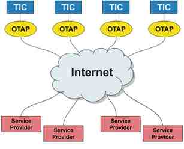
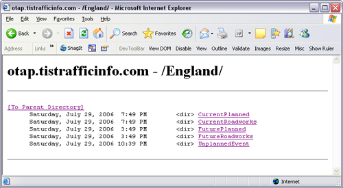
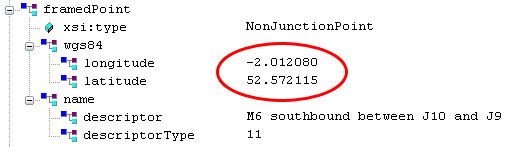
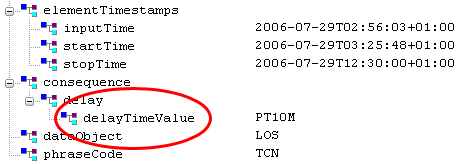

# Integrating Real-time Traffic Information
> [!CAUTION]
>  The content in this article may still be applicable to the current version of the [!INCLUDE[vemc_product_name](../articles/includes/vemc-product-name-md.md)], but it uses a previous version of the [!INCLUDE[vemc_product_name](../articles/includes/vemc-product-name-md.md)] which is no longer supported. More information about the current version of the [!INCLUDE[vemc_product_name](../articles/includes/vemc-product-name-md.md)] is found in the [Bing Map Control SDK](http://msdn.microsoft.com/en-us/library/bb429619.aspx).  
  
 In the United States, [!INCLUDE[winlive_local_name](../articles/includes/winlive-local-name-md.md)] already provides real-time traffic visualization. The data comes from Traffic.com and is available in several Metropolitan Areas, as shown on the following map:  
  
   
  
 Figure 1 *Metropolitan areas with real-time traffic information available*  
  
 The implementation in [!INCLUDE[winlive_local_name](../articles/includes/winlive-local-name-md.md)] is very nice and shows the consequences of traffic incidents and construction sites as color-coded overlays for both sides of the street.  
  
   
  
 Figure 2 *Traffic information overlays in [!INCLUDE[winlive_local_name](../articles/includes/winlive-local-name-md.md)]*  
  
 Unfortunately, these overlays are not available for maps outside of the United States, and even if they were, we couldn’t use them in a [!INCLUDE[ve_product_name](../articles/includes/ve-product-name-md.md)] custom application. An alternative is required in order to provide traffic data for European countries.  
  
## Acquiring Traffic Data  
 A very common source for real-time traffic information is the Traffic Message Channel (TMC), where the coded traffic messages are broadcasted by radio stations over an RDS-channel. TMC messages can be received by a TMC receiver which is often a component of Personal Navigation Devices (PND) or in-car navigation systems. Besides the fact that you would need a TMC receiver, the other drawback to working with TMC messages is that TMC uses a code to compress the messages and you would need to decode the message first before using it. In addition, you would need a location table to determine the position of the incident.  
  
 A better alternative in this scenario has been developed for the European Commission. There are a couple of telemetric services under the roof of CENTRICO ([http://www.centrico.org](http://www.centrico.org/)). CENTRICO is a Euro-regional Project implementing Intelligent Transport Systems (ITS) to improve the efficiency of the Trans European Road Network (TERN) in order to keep people and goods moving. The CENTRICO project is supported by the DG TREN of the European Commission.  
  
 One of CENTRICO’s projects is TIS (Traveler Information Services). It is the policy of most of the CENTRICO authorities that dissemination of traffic information should be eventually left to commercial service-providers. Therefore they make their information available to such service providers.  
  
 Within TIS there is the OTAP (Open Travel data Access Protocol) project ([http://www.itsproj.com/otap](http://www.itsproj.com/otap)). OTAP is an easy access point on the internet where Service Providers can retrieve traffic information from the different TICs (Traffic Information Centers) and other information suppliers within the CENTRICO area. The TICs make their traffic information available through the Internet by using standard technology and common formats based on XML and XSD.  
  
 Each center continues to provide and own data for its geographic area and is responsible for the quality of data and service. Contracting procedures and contracts can vary between TICs. The OTAP interface was made as 'easy' as possible by preferring widespread technologies with low technological entry thresholds and giving the highest priority to choices that offer harmonization, minimal costs, and maximal stability for both the centers and the service providers.  
  
   
  
 Figure 3 *TIC/OTAP model*  
  
 Quality of data will vary from country to country and so will the cost.  
  
 OTAP data is available as an XML stream. All of the streams are geo-coded for the start and end points and a point in the middle of the traffic disturbance. There are different streams for current and future planned events as well as unplanned events.  
  
   
  
 Figure 4 *Directory of OTAP data streams for England*  
  
 [!INCLUDE[ve_product_name](../articles/includes/ve-product-name-md.md)] can consume GeoRSS feeds and overlay the information. So the general strategy we will use is to use the Extensible Style Language Transformation (XSLT) to transform the XML stream in an GeoRSS feed and consume the feed in [!INCLUDE[ve_product_name](../articles/includes/ve-product-name-md.md)].  
  
## Requirements  
 To gain access to the OTAP XML streams you will need to e-mail the contact persons for the country in which you are interested. You will find the contact information here: [http://www.itsproj.com/otap/how.html](http://www.itsproj.com/otap/how.html).  
  
-   There is a Java SDK for development with OTAP data but since it is pure XML you can use various coding languages. I used a VB.NET application written with Microsoft Visual Studio 2005 to receive the XML stream and perform the transformation.  
  
-   You just need a text editor to create the file for the XSL Transformation but I used Stylus Studio 2006 XML because it is a very nice and easy-to-use tool.  
  
-   You also, of course, need [!INCLUDE[ve_product_name](../articles/includes/ve-product-name-md.md)]. There is an excellent interactive SDK and a reference SDK available here: [http://www.microsoft.com/maps/isdk/ajax](http://www.microsoft.com/maps/isdk/ajax). Optionally you can download the reference SDK here: [http://go.microsoft.com/?linkid=4932476](http://go.microsoft.com/?linkid=4932476).  
  
### Data Source  
 Let’s have a look at the data source first. We need to investigate the OTAP XML schema and the required format for the GeoRSS feed. Then we define the mapping rules for an XSLT and finally we write a small program to periodically pull and trans-form the data.  
  
### OTAP  
 You will find the OTAP specifications here: [http://www.itsproj.com/otap/otapspec.html](http://www.itsproj.com/otap/otapspec.html).  
  
 For the purposes of this article, we will concentrate only on unplanned events, but we could also retrieve current and future planned events in a similar fashion. In the screenshots below, you can see the XML tree for one incident including the data for the UK. Please note: In the UK there is currently information only for the motorways.  
  
 I am using the latitude and longitude of the framed point (the middle of the traffic incident), the description, and the estimated delay caused by this incidents.  
  
   
  
 Figure 5 *Partial view of XML file representing traffic incident data, showing location and description of incident*  
  
 As you can see, there is a lot more information that you could use, if necessary. For example, you could make use of the lat/long of start/end points of the incident.  
  
   
  
 Figure 6 *View of XML file representing traffic incident data, showing delay time caused by incident*  
  
### GeoRSS  
 There are various specifications for GeoRSS feeds. The [!INCLUDE[vemc_product_name](../articles/includes/vemc-product-name-md.md)] supports the W3C Basic Geo Vocabulary (see [http://www.w3.org/2003/01/geo/](http://www.w3.org/2003/01/geo/)). In this example, we use the WorldKit ([http://worldkit.org/doc/rss.php](http://worldkit.org/doc/rss.php)) implementation for which we simply need a `<geo:lat>` and a `<geo:long>` tag to describe the location.  
  
```  
<?xml version='1.0' ?>  
<rdf:RDF xmlns:rdf="http://www.w3.org/1999/02/22-rdf-syntax-ns#"   
  xmlns:geo="http://www.w3.org/2003/01/geo/wgs84_pos#"   
  xmlns="http://purl.org/rss/1.0/"   
  xmlns:xsi="http://www.w3.org/2001/XMLSchema-instance">  
  <item>  
    <title>M6 southbound between J10 and J9</title>  
    <description>PT10M</description>  
    <geo:lat>52.572115</geo:lat>  
    <geo:long>-2.012080</geo:long>  
  </item>  
</rdf:RDF>  
```  
  
 *Listing 1 GeoRSS feed XML*  
  
### XSL Transformation  
 Using Stylus Studio 2006 XML we define the mapping rules for the XSL Transformation.  
  
   
  
 Figure 7 *Creating an XSLT stylesheet in Stylus Studio 2006*  
  
 The XSL-file will look like this:  
  
```  
<?xml version='1.0' ?>  
<xsl:stylesheet version="1.0" xmlns:xsl="http://www.w3.org/1999/XSL/Transform">  
  <xsl:template match="/">  
    <rdf:RDF xmlns:rdf="http://www.w3.org/1999/02/22-rdf-syntax-ns#"   
       xmlns:geo="http://www.w3.org/2003/01/geo/wgs84_pos#"   
       xmlns="http://purl.org/rss/1.0/">  
    <xsl:for-each select="situationPublication/situation/situationElement">  
      <item>  
        <title>  
          <xsl:value-of select="elementlocation/framedPoint/name/descriptor"/>  
        </title>  
        <description>  
          <xsl:value-of select="consequence/delay/delayTimeValue"/>  
        </description>  
        <geo:lat>  
          <xsl:value-of select="elementlocation/framedPoint/wgs84/latitude"/>  
        </geo:lat>  
        <geo:long>  
          <xsl:value-of select="elementlocation/framedPoint/wgs84/longitude"/>  
        </geo:long>  
      </item>  
    </xsl:for-each>  
    </rdf:RDF>  
  </xsl:template>  
</xsl:stylesheet>  
```  
  
 *Listing 2 The Stylesheet to transform the data to GeoRSS*  
  
### Bringing it all together  
 Now that we know the source OTAP-format and destination GeoRSS-format and we have defined the rules for the XSL transformation, we need to make sure that we pull the data periodically from the OTAP server and apply the transformation to it.  
  
 In Visual Studio 2005, we create a new project for a Windows Application. On the Windows Form, we add a button and two disabled text boxes.  
  
   
  
 Figure 8 *Creating a Windows forms application to transform the feed*  
  
 We then write code to create a WebRequest to the OTAP server and capture the response in a data stream. We use an XmlTextWriter to write the data stream to the local hard drive into the file OTAPtemp.xml.  
  
 Finally, we use the XSL file we created earlier to transform the OTAPtemp.xml file into the GeoRSS format we need and write it back to the file GeoRSS.xml. The complete process is framed by a While…Do loop so that we refresh the data every minute. You’ll find the complete code below.  
  
```  
Imports System  
Imports System.IO  
Imports System.Xml  
Imports System.Xml.XPath  
Imports System.Xml.Xsl  
Imports System.Text  
Imports System.Net  
Imports System.Threading  
  
Public Class Form1  
  Private inputfilename As String = "OTAPtemp.xml"  
  Private outputfilename As String = "GeoRSS.xml"  
  Private stylesheet As String = "OTAP2GeoRSS.xsl"  
  
  Private Sub Button1_Click(ByVal sender As System.Object, _  
      ByVal e As System.EventArgs) Handles Button1.Click  
    Dim i As Integer = 0  
  
    Do Until txtStatus.Text = "Stopped"  
      txtStatus.Text = "Reading"  
      Me.Refresh()  
      Dim request As WebRequest = WebRequest.Create( _  
        "http://otap.tistrafficinfo.com/England/UnplannedEvent/content.xml")  
      Dim myCredentials As New NetworkCredential  
      myCredentials.UserName = "YOUR_USERNAME"  
      myCredentials.Password = "YOUR_PASSWORD"  
      request.Credentials = myCredentials  
      Dim response As WebResponse = request.GetResponse()  
      Dim dataStream As Stream = response.GetResponseStream()  
  
      Dim reader As New StreamReader(dataStream)  
      Dim responseFromServer As String = reader.ReadToEnd()  
      Dim OTAPWriter As New XmlTextWriter(inputfilename, Encoding.UTF8)  
      OTAPWriter.WriteRaw(responseFromServer)  
      OTAPWriter.Close()  
      reader.Close()  
      response.Close()  
  
      Dim xslt As New XslTransform  
      xslt.Load(stylesheet)  
      Dim xpathdocument As New XPathDocument(inputfilename)  
      Dim GeoRSSwriter As New XmlTextWriter(outputfilename, Encoding.UTF8)  
      GeoRSSwriter.Formatting = Formatting.Indented  
      xslt.Transform(xpathdocument, Nothing, GeoRSSwriter, Nothing)  
      GeoRSSwriter.Close()  
      txtStatus.Text = "Waiting"  
      i = i + 1  
      txtCycles.Text = i.ToString + " Cycles"  
      Me.Refresh()  
      Thread.Sleep(60000)  
    Loop  
  End Sub  
End Class  
```  
  
 *Listing 3 VB.NET code for regularly refreshing local traffic data*  
  
 Ideally, we would want to turn this process into a Windows Service and schedule it to run at intervals of our choosing. However, building a Windows Service is beyond the scope of this article.  
  
### Consuming the GeoRSS Feed in [!INCLUDE[ve_product_name](../articles/includes/ve-product-name-md.md)]  
 Consuming a GeoRSS feed in [!INCLUDE[ve_product_name](../articles/includes/ve-product-name-md.md)] is extremely simple. You only need to make sure that the GeoRSS feed and any images you might want to use can be described by a URL. We can create a Virtual Directory in Internet Information Service Manager (IIS) MMC and point it to the directory in which our application periodically writes the GeoRSS.xml file.  
  
 We can then create a simple HTML file with the following code in order to display the data visually.  
  
```  
<html>  
<head>  
<script src="http://dev.virtualearth.net/mapcontrol/v4/mapcontrol.js"></script>  
<script>  
  
  var map = null;  
  var layerid = 1;  
  
  function GetMap()  
  {  
    map = new VEMap('myMap');  
    map.LoadMap(new VELatLong(53.956, -17.5781), 7 ,'h' , false);  
    AddDataLayer( 'GeoRSS.xml', 'images/trafficicon.GIF' );  
  
  }  
  
   function AddDataLayer( dataSource, dataIcon )  
   {  
    var veLayerSpec = new VELayerSpecification();  
    veLayerSpec.Type = VELayerType.GeoRSS;  
    veLayerSpec.ID = layerid;  
    veLayerSpec.LayerSource = dataSource;  
    veLayerSpec.Method = 'get';  
    veLayerSpec.IconUrl = dataIcon;  
    veLayerSpec.FnCallback = onFeedLoad;  
    map.AddLayer(veLayerSpec);  
    layerid++;  
   }  
  
</script>  
</head>  
  
<body onload="GetMap();">  
  <div id='myMap' style="position:relative; width:400px; height:400px;"></div>  
  
</body>  
</html>  
```  
  
 *Listing 4 A[!INCLUDE[ve_product_abbr](../articles/includes/ve-product-abbr-md.md)]Based Traffic Report*  
  
 As long as our HTML page is in the same file as our GeoRSS.xml output file, then our users should see a map showing the United Kingdom, complete with all known traffic incidents.  
  
 As mentioned earlier you’ll find the complete interactive SDK as well as a reference SDK for the [!INCLUDE[vemc_product_name](../articles/includes/vemc-product-name-md.md)] here: [http://www.microsoft.com/maps/isdk/ajax](http://www.microsoft.com/maps/isdk/ajax).  
  
 This article is an updated revision of an original article contributed by [Johannes Kebeck](mailto:jkebeck@microsoft.com). The update was performed by [Robert McGovern MVP (Bing Maps/MapPoint)](https://mvp.support.microsoft.com/profile=A9159573-40DB-4BD1-A079-D57C675E1766).