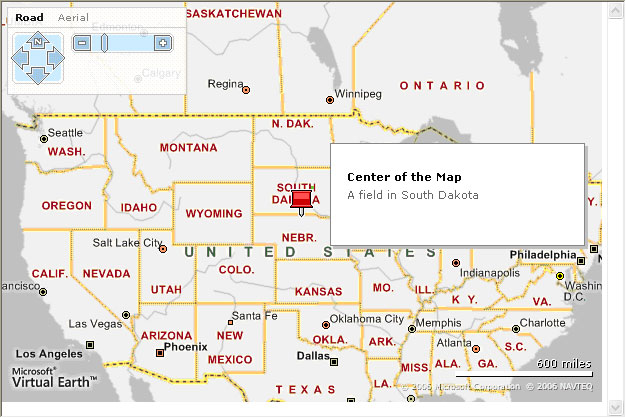
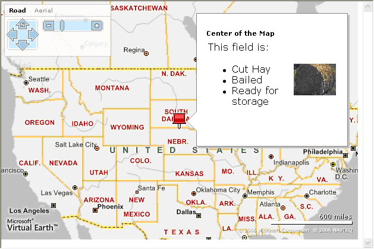
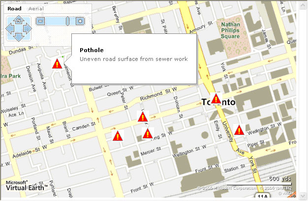

# Leveraging GeoRSS and Pushpin Layers
> [!CAUTION]
>  The content in this article may still be applicable to the current version of the [!INCLUDE[vemc_product_name](../articles/includes/vemc-product-name-md.md)], but it uses a previous version of the [!INCLUDE[vemc_product_name](../articles/includes/vemc-product-name-md.md)] which is no longer supported. More information about the current version of the [!INCLUDE[vemc_product_name](../articles/includes/vemc-product-name-md.md)] is found in the [Bing Map Control SDK](http://msdn.microsoft.com/en-us/library/bb429619.aspx).  
  
## Getting Started  
 Before we start working with push pins, let's start with a basic [!INCLUDE[ve_product_name](../articles/includes/ve-product-name-md.md)] map:  
  
```  
<html>  
<head>  
<script src="http://dev.virtualearth.net/mapcontrol/v4/mapcontrol.js"></script>  
<script>  
  var map;  
  function OnPageLoad()  
  {  
    map = new VEMap('myMap');  
    map.LoadMap();  
  }  
</script>  
<body onload="OnPageLoad();">  
    <div id="myMap" style="position:relative;width:600px;height:400px;"></div>  
</body>  
</html>  
```  
  
 *Listing 1 Basic Page (Find.html)*  
  
 If you load this page in a browser, you should see a map of the United States with the basic [!INCLUDE[ve_product_name](../articles/includes/ve-product-name-md.md)] navigation dashboard.  
  
## PushPin Basics  
 With a set of simple commands, you can add pushpins, delete pushpins and modify the way a pushpin displays.  
  
### Adding a PushPin  
 Adding a Push Pin to a [!INCLUDE[ve_product_name](../articles/includes/ve-product-name-md.md)] map is a very simple process.  We can add a center point pushpin to our basic map by adding the following code to the `OnPageLoad()` method:  
  
```  
var pin = new VEPushpin(1, map.GetCenter(), null,    
  'Center of the Map', 'A field in South Dakota');              
map.AddPushpin(pin);  
```  
  
 *Listing 2 Adding a PushPin*  
  
 There are five parameters we need to set:  
  
1.  PinID - The first parameter must be a unique pin identifier.  This value can be numeric or a string.  If you try to add a duplicate pin, you will get an exception.  Normally, you will create a global "pinID" integer value and simply increment it as you add pins.  
  
2.  Position - The second parameter is a `VELatLong` object defining the object's position.  In our example, we used the center of the map.  
  
3.  Picture URL - If you want to use a different icon, replace the third parameter with a URL to your icon of choice.  
  
4.  Title - The fourth parameter defines the title that will appear in the popup when a user moves the mouse over a pushpin.  
  
5.  Details - The fifth parameter is the text that will appear in the popup.  
  
 If you load your page in a browser, and move your mouse over the pushpin, you should see something like this:  
  
   
  
 Figure 1 *A basic pushpin*  
  
 You can add HTML markup to either the title or the description of your pushpin.  For instance, if you wanted to make the description a list of features, and add an image, you could use the following code:  
  
```  
var pin = new VEPushpin(1, map.GetCenter(), null,  
  'Center of the Map',   
  '<table><tr><td>This field is:<ul><li>Cut Hay</li><li>Bailed</li>' +  
  '<li>Ready for storage</li></ul></td><td></td></tr></table>');  
```  
  
 *Listing 3 Customizing a Description*  
  
 Your pushpin would look like this:  
  
   
  
 Figure 2 *Custom Pushpin Description*  
  
### Deleting a Push Pin  
 Deleting a pushpin is a one line command, provided you have the pushpin ID.  However, you generally want to wrap your delete commands in a try/catch block to ensure that your users don't see exceptions if you try to delete pushpins that don't exist.  
  
```  
try  
{  
  map.DeletePushpin(specificPinID);  
} catch (err)  
{  
  //take no action because pushPin does not exist  
}  
```  
  
 *Listing 4 Deleting a specific pushpin*  
  
 You can also delete all the pushpins on a map:  
  
```  
map.DeleteAllPushpins();  
```  
  
 *Listing 5 Deleting all pushpins*  
  
### Using a Callback with a Push Pin  
 One of the more interesting things you can do with a pushpin is to override the default behavior.  A simple pushpin displays a callout popup when the user moves their mouse over the pin.  However, you can change the behavior for all of your pushpins by overriding the default values in the `VEPushpin` prototype.  When you override the behavior, you will generally need to turn off the default view, and assign a callback function for the new mouse over behavior.  
  
```  
var pin = new VEPushpin(1, map.GetCenter(), null,   
  'Center of the Map', 'A field in South Dakota');  
  
VEPushpin.ShowDetailOnMouseOver = false;  
VEPushpin.OnMouseOverCallback = function(x, y, title, details) {  
   alert('your mouse is at : ' + x + ', ' + y +  
    ' and you can display the details from title: ' +  
    unescape(title) + ' and details: ' + unescape(details));            }  
  
map.AddPushpin(pin);  
```  
  
 *Listing 6 Using a callback with PushPins*  
  
 Note that if you use this override, you are changing the behavior of all pushpins on the map.  
  
### PushPin Layers  
 The [!INCLUDE[vemc_product_name](../articles/includes/vemc-product-name-md.md)] SDK currently exposes two types of Push Pin collections.  First, you can link to any publicly saved pushpin collection from [!INCLUDE[winlive_local_name](../articles/includes/winlive-local-name-md.md)].  Second, you can link to any geoRSS field and display all the entries as pushpins.  
  
### Linking to [!INCLUDE[winlive_local_name](../articles/includes/winlive-local-name-md.md)] Collection  
 [!INCLUDE[winlive_local_name](../articles/includes/winlive-local-name-md.md)]gives registered users the ability to create and save collections.  To create a collection, you need to:  
  
1.  Go to [Windows Live Local](http://local.live.com/).  
  
2.  Sign in to your account  
  
3.  Create a collection of pushpins on your scratch pad  
  
4.  Save the collection, providing a title and description.  Make sure you select to make the collection public.  
  
 Once you have your collection saved, you can select the "Share" option and then "Copy to link to clipboard".  You should be able to paste in a link similar to the following: [http://local.live.com/?v=2&cid=98C746DDDC3FE6CA!104](http://local.live.com/?v=2&cid=98C746DDDC3FE6CA!104).  This link goes to a short collection of US Civil War battlefields that I have visited.  If you click on the link, you will go to [!INCLUDE[winlive_local_name](../articles/includes/winlive-local-name-md.md)], and see my collection.  
  
 The next step is to create a map page that references this collection.  We start with our basic page from Listing 1.  We need to add some code to the end of the `OnPageLoad()` method to display our layer:  
  
```  
var veLayerSpec = new VELayerSpecification();  
veLayerSpec.Type = VELayerType.VECollection;  
veLayerSpec.ID = 'Battlefields';  
veLayerSpec.LayerSource = '98C746DDDC3FE6CA!104';  
map.AddLayer(veLayerSpec);  
```  
  
 *Listing 7 Adding a layer*  
  
 Just as with a Push Pin, you need to assign a unique ID to each layer.  You can use this ID later to hide the layer or delete it.  The layer source is the collection ID from the [!INCLUDE[winlive_local_name](../articles/includes/winlive-local-name-md.md)] link.  Note that you only need the part after the "cid=" parameter in the original URL.  
  
 If you load this page in a browser, we will see that the map automatically displays the collection as a set of pushpins.  It will also re-center the map to show all of the pushpins.  
  
   
  
 Figure 3 *A [!INCLUDE[winlive_local_name](../articles/includes/winlive-local-name-md.md)] Collection*  
  
### Linking to GeoRSS  
 From an enterprise perspective, linking to a [!INCLUDE[winlive_local_name](../articles/includes/winlive-local-name-md.md)] collection is less than ideal.  Although end users can easily create and manage small collections, the [!INCLUDE[winlive_local_name](../articles/includes/winlive-local-name-md.md)] interface isn't really designed to support dynamic, large or auto-generated collections.  Fortunately, we can create a pushpin layer based on a GeoRSS feed.  
  
### Creating a GeoRSS Feed  
 GeoRSS is an XML grammar for publishing events that are linked to a specific location.  [!INCLUDE[ve_product_name](../articles/includes/ve-product-name-md.md)] supports both the [W3C Basic Geo Vocabulary](http://www.w3.org/2003/01/geo/) as well as those defined by [GeoRSS](http://georss.org/).  In essence, both formats boil down to the basic RSS format, with an additional attribute for providing the latitude and longitude.  
  
 In this example, we are going to use a fake GeoRSS feed representing road hazards in the Toronto area.  Our XML file for the feed looks like this:  
  
```  
<?xml version="1.0" encoding="utf-8" ?>  
<rss version="2.0" xmlns:geo="http://www.w3.org/2003/01/geo/wgs84_pos#">  
  <channel>  
    <title>Reported Road Hazards</title>  
    <link/>  
    <description>Road hazards reported to the city</description>  
    <item>  
      <title>Traffic Light</title>  
      <description>Traffic light on north west corner out</description>  
      <geo:lat>43.64887</geo:lat>  
      <geo:long>-79.385362</geo:long>  
    </item>  
    <item>  
      <title>Traffic Signage</title>  
      <description>Stop sign missing</description>  
      <geo:lat>43.646870</geo:lat>  
      <geo:long>-79.383342</geo:long>  
    </item>  
    <item>  
      <title>Pothole</title>  
      <description>Large pothole on westbound lane</description>  
      <geo:lat>43.646511</geo:lat>  
      <geo:long>-79.393944</geo:long>  
    </item>  
    <item>  
      <title>Flooding</title>  
      <description>Flood drain blocked with branches on SW corner</description>  
      <geo:lat>43.646658</geo:lat>  
      <geo:long>-79.391345</geo:long>  
    </item>  
    <item>  
      <title>Traffic Signage</title>  
      <description>Street sign bent wrong way</description>  
      <geo:lat>43.647729</geo:lat>  
      <geo:long>-79.391741</geo:long>  
    </item>  
    <item>  
      <title>Pothole</title>  
      <description>Pothole forming in center of intersection</description>  
      <geo:lat>43.650537</geo:lat>  
      <geo:long>-79.390407</geo:long>  
    </item>  
    <item>  
      <title>Traffic Signage</title>  
      <description>Street sign upside down</description>  
      <geo:lat>43.651184</geo:lat>  
      <geo:long>-79.391702</geo:long>  
    </item>  
    <item>  
      <title>Pothole</title>  
      <description>Uneven road surface from sewer work</description>  
      <geo:lat>43.651090</geo:lat>  
      <geo:long>-79.399210</geo:long>  
    </item>  
  </channel>  
</rss>  
```  
  
 *Listing 8 The GeoRSS feed (hazards.xml)*  
  
 You might note that each item in the feed contains a title and a description.  These fields will automatically map to the title and details fields for our pushpins.  
  
 After you create your file, you need to host it somewhere to ensure that your map can access it.  With the current [!INCLUDE[vemc_product_name](../articles/includes/vemc-product-name-md.md)] API, the RSS file must be publicly accessible through either get or post.  
  
### Adding the GeoRSS Layer  
 Now that we have a GeoRSS source, we can add another Push Pin layer to our map:  
  
```  
var veLayerSpec = new VELayerSpecification();  
veLayerSpec.Type = VELayerType.GeoRSS;  
veLayerSpec.ID = 'Hazards';  
veLayerSpec.LayerSource = 'http://localhost/hazards/hazards.xml';  
veLayerSpec.Method = 'get';  
veLayerSpec.IconUrl = 'hazard.gif';  
map.AddLayer(veLayerSpec);  
```  
  
 *Listing 9 Adding a GeoRSS layer*  
  
 Note that we've changed the type to GeoRSS.  We've also chosen a new ID.  Because we are accessing a direct web source, our `LayerSource` property needs to be the actual URL for our GeoRSS feed.  We also need to set a method (either 'get' or 'post').  Finally, we set an `IconUrl` so that our traffic hazards use a custom pushpin.  
  
 If we load our page now, we should see a map of Toronto with some simulated road hazards:  
  
   
  
 Figure 4 *GeoRSS Layer in Action*  
  
### Working with Layers  
 Adding a static layer is just the beginning.  Whether you are working with a geoRSS feed or a [!INCLUDE[winlive_local_name](../articles/includes/winlive-local-name-md.md)] collection, you can turn hide or show layers, or delete them.  
  
### Deleting Layers  
 Deleting a layer works just like it does with individual push pins.  We can delete a layer by id, using a try/catch block in case the layer ID doesn't exist.  
  
```  
try{  
  map.DeleteLayer(layerID);  
} catch (err)   
{  
  //do nothing since layer doesn't exist  
}  
  
map.delete  
```  
  
 *Listing 10 Deleting a Layer*  
  
 Note that we don't have any way to delete all the layers at the same time  
  
### Hiding and Showing Layers  
 We can hide a layer by using the `HideLayer()` command, and show it using the `ShowLayer()` command.  In our example, we have two possible layers.  We'd like to have a check box to allow users to decide if they want to see battlefields, road hazards in Toronto or both.  The code we need for this is actually very simple.  Add the following input boxes to the end of your body element:  
  
```  
<div id="toggles">  
      <input type="checkbox" name="traffic" value="traffic"  
              onclick="this.checked ? map.ShowLayer('Hazards') : map.HideLayer('Hazards');"  
              checked>  
        Show Traffic<br>  
      <input type="checkbox" name="battlefields" value="battlefields"  
            onclick="this.checked ? map.ShowLayer('Battlefields') : map.HideLayer('Battlefields');"  
            checked>  
        Show Battlefields<br>  
</div>  
```  
  
 *Listing 11 Adding CheckBoxes to toggle layer visibility*  
  
 One thing to be aware of is that the `ShowLayer()` command will re-center and re-zoom the map to the items included in that layer.  In other words, your view will most likely jump around when you turn off Show Traffic and then turn it on again.  
  
 We can clean up our code, add some style information, and generate a map that looks like this:  
  
   
  
 Figure 5 *Map with Selectable PushPin layers*  
  
 The final code for this example is included at the end of the article.  
  
### The Layer Callback  
 The last important feature of layers involves a callback method that you can use to determine when a layer is loaded.  Remember that whether you are working with GeoRSS, or [!INCLUDE[winlive_local_name](../articles/includes/winlive-local-name-md.md)] collections, your map is going to require some processing time to generate the push pin collection and display it.  If you want to notify users when the layer is loaded, you can assign a callback method to your `VELayerSpecficiation`.  
  
```  
var veLayerSpec = new VELayerSpecification();  
veLayerSpec.Type = VELayerType.VECollection;  
veLayerSpec.ID = 'Battlefields';  
veLayerSpec.LayerSource = '98C746DDDC3FE6CA!104';  
veLayerSpec.FnCallback = onFeedLoad;  
map.AddLayer(veLayerSpec);  
```  
  
 *Listing 12 Referencing the callback*  
  
 Our Battlefield collection will now execute the `onFeedLoad()` method whenever the collection is finished loading.  Our `onFeedLoad()` method receives the collection of `VEPushPin` objects.  
  
```  
function onFeedLoad(pins)  
{  
  alert(pins.length + ' items loaded.');  
}  
```  
  
 *Listing 13 Using the Callback*  
  
### Conclusion  
 Now that you have mastered adding and removing pushpins, as well as manipulating push pin layers, you can create your own mapping applications that display useful information to your customers.  Whether your data source is a collection you put together on [!INCLUDE[winlive_local_name](../articles/includes/winlive-local-name-md.md)], or a GeoRSS feed published by your local government, you can map points of interest and enhance your maps with custom information displays.  
  
 This article was written by [Robert McGovern MVP (Bing Maps/MapPoint)](https://mvp.support.microsoft.com/profile=A9159573-40DB-4BD1-A079-D57C675E1766) from [Infusion Development](http://www.infusiondev.com/technology/Microsoft/MapPoint.htm).  
  
```  
<html>  
<head>  
<script src="http://dev.virtualearth.net/mapcontrol/v4/mapcontrol.js"></script>  
<script>  
  var map;  
  
  function addPin()  
  {  
    var pin = new VEPushpin(1, map.GetCenter(), null,  
      'Center of the Map', 'A field in South Dakota');  
    map.AddPushpin(pin);  
  }  
  
  function battlefields()  
  {  
  var veLayerSpec = new VELayerSpecification();  
  veLayerSpec.Type = VELayerType.VECollection;  
  veLayerSpec.ID = 'Battlefields';  
  veLayerSpec.LayerSource = '98C746DDDC3FE6CA!104';  
  map.AddLayer(veLayerSpec);  
  }  
  
  function hazards()  
  {  
  var veLayerSpec = new VELayerSpecification();  
  veLayerSpec.Type = VELayerType.GeoRSS;  
  veLayerSpec.ID = 'Hazards';  
  veLayerSpec.LayerSource = 'http://localhost/hazards/hazards.xml';  
  veLayerSpec.Method = 'get';  
  veLayerSpec.IconUrl = 'hazard.gif';  
  map.AddLayer(veLayerSpec);  
  }  
  
  function OnPageLoad()  
  {  
    map = new VEMap('myMap');  
    map.LoadMap();  
    addPin();  
    hazards();  
    battlefields();  
    var results = document.getElementById('toggles');  
    map.AddControl(results);  
    results.style.left = "445px";  
    results.style.top = "5px";  
  }  
  
</script>  
  
<style>  
  #toggles  
  {  
    width: 150px;  
    border-style: solid;  
    border-width: 1px;  
    border-color: lightgray;  
    background: white;  
  }  
</style>  
  
<body onload="OnPageLoad();">  
    <div id="myMap" style="position:relative;width:600px;height:400px;"></div>  
  <div id="toggles">  
    <input type="checkbox" name="traffic" value="traffic"  
        onclick="this.checked ? map.ShowLayer('Hazards') : map.HideLayer('Hazards');"  
        checked>  
      Show Traffic<br>  
    <input type="checkbox" name="battlefields" value="battlefields" onclick=  
      "this.checked ? map.ShowLayer('Battlefields') : map.HideLayer('Battlefields');"  
      checked>  
      Show Battlefields<br>  
  </div>  
</body>  
</html>  
```  
  
 *Listing 14 Final Source for Push Pin Layers*