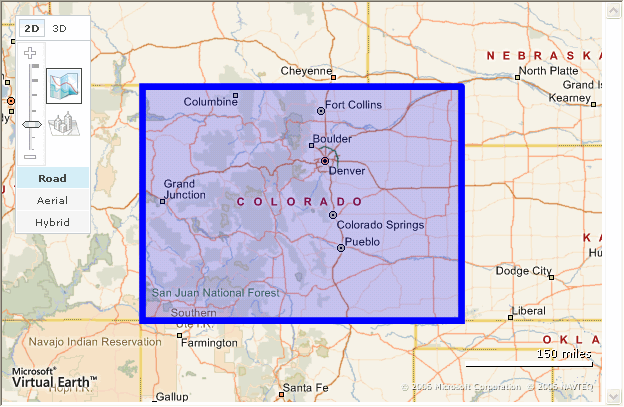
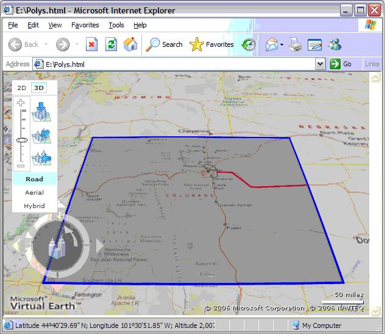

# Polygons and Polylines in Bing Maps
> [!CAUTION]
>  The content in this article may still be applicable to the current version of the [!INCLUDE[vemc_product_name](../articles/includes/vemc-product-name-md.md)], but it uses a previous version of the [!INCLUDE[vemc_product_name](../articles/includes/vemc-product-name-md.md)] which is no longer supported. More information about the current version of the [!INCLUDE[vemc_product_name](../articles/includes/vemc-product-name-md.md)] is found in the [Bing Map Control SDK](http://msdn.microsoft.com/en-us/library/bb429619.aspx).  
  
 Once you've mastered the basics of displaying a map, navigating around a map, and displaying one or more pushpins, the next most common task is to display custom lines and shapes.  That's where [!INCLUDE[ve_product_name](../articles/includes/ve-product-name-md.md)] Polygons and Polylines come into play.  
  
## Getting Started  
 Before we start working with push pins, let's start with a basic [!INCLUDE[ve_product_name](../articles/includes/ve-product-name-md.md)] map:  
  
```  
<html>  
<head>  
<script src="http://dev.virtualearth.net/mapcontrol/v4/mapcontrol.js"></script>  
<script>  
  var map;  
  function OnPageLoad()  
  {  
    map = new VEMap('myMap');  
    map.LoadMap();  
  }  
</script>  
<body onload="OnPageLoad();">  
    <div id="myMap" style="position:relative;width:600px;height:400px;"></div>  
</body>  
</html>  
```  
  
 *Listing 1 Basic Page (Polys.html)*  
  
 If you load this page in a browser, you should see a map of the United States with the basic [!INCLUDE[ve_product_name](../articles/includes/ve-product-name-md.md)] navigation dashboard.  
  
 A complete example is included at the end of this article in Listing 5.  
  
### Drawing a Line  
 Drawing a polyline in [!INCLUDE[ve_product_name](../articles/includes/ve-product-name-md.md)] involves very few steps.  All you need is a set of coordinates defining the corners, an ID value, a color and a width:  
  
```  
var points = [  
  new VELatLong(39.73676229957947, -104.710693359375),  
  new VELatLong(39.71563813479633,-104.25476074218751),  
  new VELatLong(39.26628442213065,-103.74389648437501),  
  new VELatLong(39.26203141523748,-103.5406494140625),  
  new VELatLong(39.325799417892966,-102.04101562500001)  
];  
  
var color = new VEColor(255,0,0,1);  
var width = 5;  
var id = 'I70';  
  
var poly = new VEPolyline(id, points, color, width);  
map.AddPolyline(poly);  
map.SetMapView(points);  
```  
  
 *Listing 2 Drawing a Poly Line*  
  
 As with a pushpin, the ID can be any unique string value.  If you are building many lines, you might want to use an incrementing integer.  If you are building a few specific lines, you might want to name them with meaningful ID values.  
  
 The array of points is actually an array of `VELatLong` objects.  Although you can type these points into your JavaScript manually, you will most likely want to store your line points in a file and load them into your page with some processing.  
  
 The color is a `VEColor` object, which defines red, green, and blue color values as well as the alpha, or transparency.  An alpha value of 1 means an opaque (solid) line.  A value of 0 means a fully transparent (invisible) line.  However, if you enter a value of 0, [!INCLUDE[ve_product_name](../articles/includes/ve-product-name-md.md)] will actually draw a solid line rather than an invisible one.  If you want a nearly invisible line, try an alpha value of 0.1.  
  
 The width parameter defines how thick your line will be in pixels.  A value of 5 is about two or three times as thick as a US Interstate or major highway line.  
  
 If you add the code in Listing 2 to the starter page in Listing 1, you should see a picture of Eastern Colorado with a thick red line roughly following the path of Interstate 70 from Denver to the Kansas border:  
  
   
  
 Figure 1 *A red polyline*  
  
### Drawing a Polygon  
 A polygon is very similar to a polyline.  However, you have an additional option to set the interior fill color.  We can draw a border around the state of Colorado (a nice rectangular state defined by simple latitude and longitude values) using the following code:  
  
```  
var points = [  
  new VELatLong(41,-102),  
  new VELatLong(37,-102),  
  new VELatLong(37,-109),  
  new VELatLong(41,-109),  
  new VELatLong(41,-102)  
];  
  
var outlineColor = new VEColor(0,0,255,1);  
var fillColor = new VEColor(0,0,255,.2);  
var outlineWidth = 5;  
var id = 'Colorado';  
  
var poly = new VEPolygon(id, points, fillColor, outlineColor, outlineWidth)  
map.AddPolygon(poly);  
```  
  
 *Listing 3 Drawing a Polygon*  
  
 Note that [!INCLUDE[ve_product_name](../articles/includes/ve-product-name-md.md)] will not automatically close our polygon.  That is, to complete our rectangle around Colorado, we need five points rather than the four we might expect.  Our first point has to be repeated as our last point to close the polygon.  We also have two color options.  The first sets the fill color of the polygon, and the second sets the outline color.  We can also set the outline width.  
  
 If we add the code in Listing 3 to the starter page in Listing 1, you should see a map of the United States with Colorado outlined in dark blue, and filled with a mostly transparent blue:  
  
   
  
 Figure 2 *A polygon*  
  
### Removing Polygons and Polylines  
 As with pushpins and pushpin layers, you can delete individual polygons and polylines, or delete all polygons and polylines:  
  
```  
//delete polyline by id  
map.DeletePolyline(lineID);  
  
//delete polygon by id  
map.DeletePolygon(lineID);  
  
//delete all polylines  
map.DeleteAllPolylines();  
  
//delete all polygons  
map.DeleteAllPolygons();  
```  
  
 *Listing 4 Deleting shapes and lines*  
  
 You may want to wrap your delete by ID calls in a try catch block, as the `VEMap` object will throw an exception if you try to delete a line or shape that doesn't exist.  
  
### Polygons and Polylines in 3D  
 If you are using Internet Explorer, you can take advantage of polygons and polylines in the 3D mapping mode.  Polygons and polylines should automatically appear on any 3D map, however they will appear "stretched" to match the terrain and view.  To force a map into 3D mode, simply add a line after you load the map control:  
  
```  
map.SetMapMode(VEMapMode.Mode3D);  
```  
  
 *Listing 5 Switching to 3D mode*  
  
 If your users already have the control installed, they should see something like this:  
  
   
  
 Figure 3 *A polygon in 3D (view adjusted to emphasize 3D stretching)*  
  
 If your users do not already have the 3D ActiveX control installed, they will be prompted to install the control.  However, if your users choose not to install the control, or choose to use a browser other than Internet Explorer, the maps will stay in 2D mode.  
  
### Formatting Data Points  
 In most cases, you will not want to create your polylines and polygons by hand, as we've done in this article.  You may already have your shapes and lines defined in another system such as an ESRI database.  The question is therefore how do you get your data files into a format that you can use inside of [!INCLUDE[ve_product_name](../articles/includes/ve-product-name-md.md)]?  
  
 Although [!INCLUDE[ve_product_name](../articles/includes/ve-product-name-md.md)] uses a Mercator projection, it does not use Universal Transverse Mercator (UTM) latitude and longitude values.  Instead, [!INCLUDE[ve_product_name](../articles/includes/ve-product-name-md.md)] requires WGS 84 notation, where the latitude is between -90 and + 90, and the longitude is between -180 and + 180.  
  
 Generally, your original data source should be able to generate data in the WGS 84 format.  If not, you can take advantage of one of the many co-ordinate translation programs available from third parties.  
  
### Conclusion  
 Drawing polylines and polygons gives you the ability to display additional content on your map.  In an enterprise setting, you would most likely want to create a sever side component that generates the JavaScript necessary to draw your lines and shapes.  You would also want to cache or save the results to save processing and loading time.  
  
 This article was written by [Robert McGovern MVP (Bing Maps/MapPoint)](https://mvp.support.microsoft.com/profile=A9159573-40DB-4BD1-A079-D57C675E1766) from [Infusion Development](http://www.infusiondev.com/technology/Microsoft/MapPoint.htm).  
  
```  
<html>  
<head>  
<script src="http://dev.virtualearth.net/mapcontrol/v4/mapcontrol.js"></script>  
<script>  
  var map;  
  
  function SetInfoBlock(e)  
  {  
    var lat = e.view.LatLong.Latitude;  
    var long = e.view.LatLong.Longitude;  
  
    document.getElementById("info").innerHTML =  
      'Latitude = ' + lat  
      + ', Longitude = '  + long  
      + ', Zoom=' + e.view.zoomLevel;  
  }  
  
  function OnPageLoad()  
  {  
    map = new VEMap('myMap');  
    map.LoadMap();  
    map.AttachEvent("onclick", SetInfoBlock);  
    DrawLine();  
    DrawPoly();  
  }  
  
  function DrawPoly()  
  {  
  var points = [  
    new VELatLong(41,-102),  
    new VELatLong(37,-102),  
    new VELatLong(37,-109),  
    new VELatLong(41,-109),  
    new VELatLong(41,-102)  
  ];  
  
  var outlineColor = new VEColor(0,0,255,1);  
  var fillColor = new VEColor(0,0,255,.2);  
  var outlineWidth = 5;  
  var id = 'Colorado';  
  
  var poly = new VEPolygon(id, points, fillColor, outlineColor, outlineWidth)  
  map.AddPolygon(poly);  
  map.SetMapView(points);  
  
  }  
  
  function DrawLine()  
  {  
  var points = [  
    new VELatLong(39.73676229957947, -104.710693359375),  
    new VELatLong(39.71563813479633,-104.25476074218751),  
    new VELatLong(39.26628442213065,-103.74389648437501),  
    new VELatLong(39.26203141523748,-103.5406494140625),  
    new VELatLong(39.325799417892966,-102.04101562500001)  
  ];  
  
  var color = new VEColor(255,0,0,1);  
  var width = 5;  
  var id = 'I70';  
  
  var poly = new VEPolyline(id,points, color, width);  
  map.AddPolyline(poly);  
  map.SetMapView(points);  
  }  
  
</script>  
  
<body onload="OnPageLoad();">  
   <div id="info" style="position:relative;height:50px;font-size:10pt"></div>  
   <div id="myMap" style="position:relative;width:600px;height:400px;"></div>  
</body>  
</html>  
</html>  
```  
  
 *Listing 5 Final Source for Polygons and Polylines*