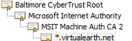
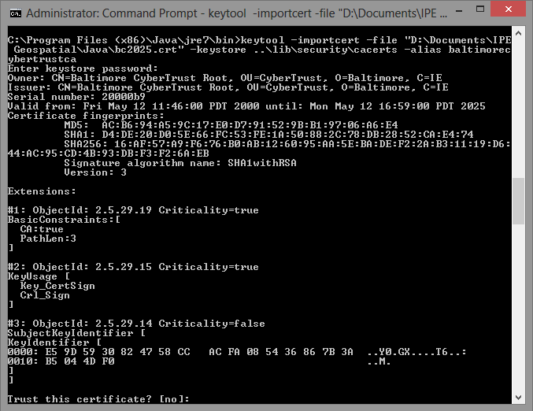
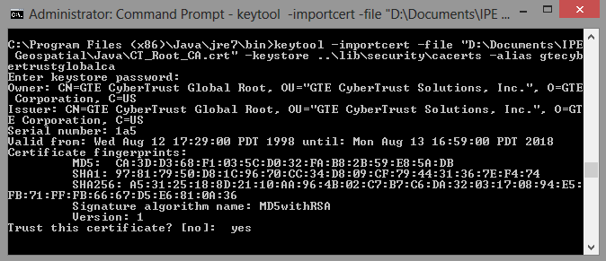

# SSL Certificate Validation for Java Applications
Bing Maps APIs support both HTTP and HTTPS requests that use Secure Sockets Layer (SSL) and Transport Layer Security (TLS) protocols. The SSL and TLS endpoints are secured by certificates. For example, when you query a data source directly from your browser by using the [Bing Spatial Data Services (SDS)](http://msdn.microsoft.com/en-us/library/ff701734.aspx), as in the following example, you can view the certificate chain by clicking the “lock” icon.  
  
```  
https://spatial.virtualearth.net/REST/v1/data/  
  f22876ec257b474b82fe2ffcb8393150/  
  NavteqNA/  
  NavteqPOIs  
  ?spatialFilter=nearby(40.83274904439099,-74.3163299560546935,5)  
  &$filter=EntityTypeID%20eq%20'6000'  
  &$select=EntityID,DisplayName,Latitude,Longitude,__Distance&  
  $top=3  
  &key=INSERT_YOUR_BING_MAPS_KEY  
```  
  
 The following image shows an example of a certificate chain.  
  
   
  
 Java applications that access the Bing Maps APIs using SSL must implement their own certificate validation checks. The level of validation can vary per application, and often includes validation of the root certificate against a trusted root list. The validation performed by an application is equivalent to the validation that your browser uses to verify an SSL certificate before showing the “lock” icon.  
  
 For Java applications, private keys and the associated X.509 certificate chains that authenticate the corresponding public keys are found in the “keystore”. The “keystore” also manages certificates from trusted entities. After you install the Java Runtime Environment (JRE) or the Java Development Kit (JDK), you will find the “keystore” in the `/lib/security` directory of your JRE. By default, this subdirectory contains a file named **cacerts** that contains certificates for many Root Certificate Authorities (Root CAs).  
  
 Java provides a [“keytool”](http://docs.oracle.com/javase/1.4.2/docs/tooldocs/solaris/keytool.html) in order to manage your “keystore”. To view a list of currently installed certificates, open a command prompt and run the following command from the `bin` directory of the JRE.  
  
```  
keytool -list -keystore ..\lib\security\cacerts  
```  
  
 If you access a Bing Maps API from a Java application via SSL and you do not have the certificate for the Root CA in your “keystore” you will see an error message similar to this:  
  
 `Exception in thread "main" com.sun.jersey.api.client.ClientHandlerException: javax.net.ssl.SSLHandshakeException: sun.security.validator.ValidatorException: PKIX path building failed: sun.security.provider.certpath.SunCertPathBuilderException: unable to find valid certification path to requested target…`  
  
## Configuring Root Certificates  
 The following steps show how to install the SSL certificates required to access Bing Maps APIs.  
  
> [!IMPORTANT]
>  Bing Maps is currently in the process of migrating from the GTE CyberTrust Global Root to the Baltimore CyberTrust Root. The new root certificate uses a stronger key length and hashing algorithm and ensures we remain consistent with industry-wide security best practices. If you have an existing application that uses the GTE CyberTrust Global Root, you must also download and configure the Baltimore CyberTrust Root by June 15th, 2013 to avoid certificate validation errors. Until the rollout of the Baltimore CyberTrust rooted certificates is complete, both GTE CyberTrust Global Root and the Baltimore CyberTrust Root must be in use. This article will be updated when the transition to the Baltimore CyberTrust Root is complete. While we seek to minimize the need for customers to take specific action based on changes we make to the Bing Maps APIs, we believe this is an important security improvement.  
  
### Baltimore CyberTrust Root  
 To configure the Baltimore CyberTrust Root:  
  
1.  Download the Baltimore CyberTrust Root from [https://cacert.omniroot.com/bc2025.crt](https://cacert.omniroot.com/bc2025.crt) and save it to a location on your computer. Note the location as you will need it for the install command below.  
  
2.  Open a command prompt and run the following “keytool” command from the `bin` directory of the JRE. This starts the certificate installation. You must insert the directory path to the downloaded certificate from step 1 before running the command. If you are running the Windows operating system, you will need to run the command prompt as an administrator.  
  
    ```  
    keytool -importcert -file "InsertCertificateDownloadLocation\bc2025.crt" -keystore ..\lib\security\cacerts -alias baltimorecybertrustca  
    ```  
  
     When you run the command, the information in the following screenshot appears. To verify the install, type **yes**.  
  
       
  
### GTE CyberTrust Global Root  
 To configure the GTE CyberTrust Global Root:  
  
1.  Download the GTE CyberTrust Global Root from [https://secure.omniroot.com/cacert/CT_Root_CA.crt](https://secure.omniroot.com/cacert/CT_Root_CA.crt) and save it to a location on your computer. Note the location as you will need it for the install command below.  
  
2.  Open a command prompt and run the following “keytool” command from from the `bin` directory of the JRE. This starts the certificate installation. You must insert the directory path to the downloaded certificate from step 1 before running the command. If you are running the Windows operating system, you will need to run the command prompt as an administrator.  
  
    ```  
    keytool -importcert -file "InsertCertificateDownloadLocation\CT_Root_CA.crt" -keystore ..\lib\security\cacerts -alias gtecybertrustglobalca  
    ```  
  
3.  When you run the command, the information in the following screenshot appears. To verify the install, type **yes**.  
  
     