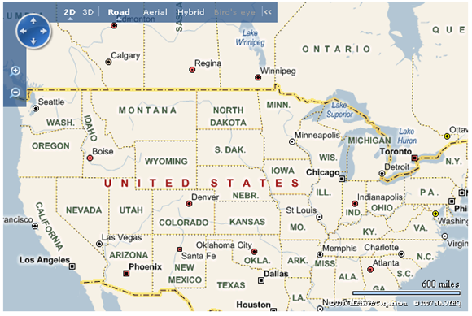
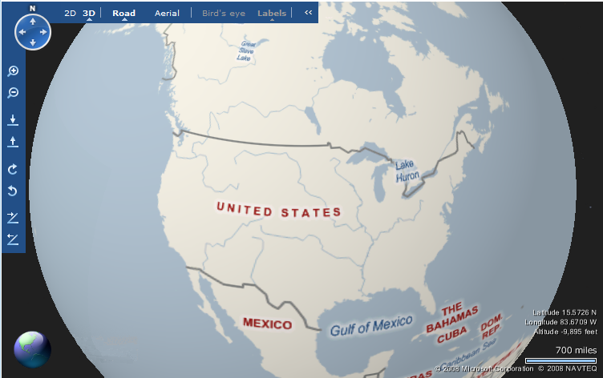
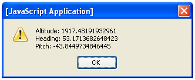
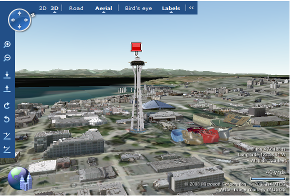
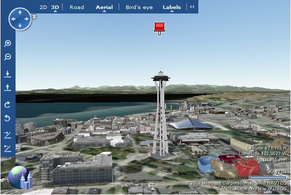
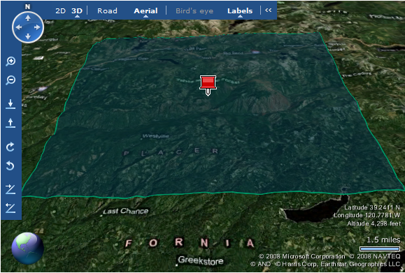
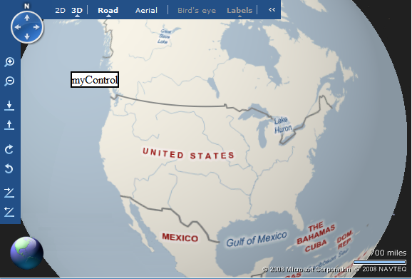
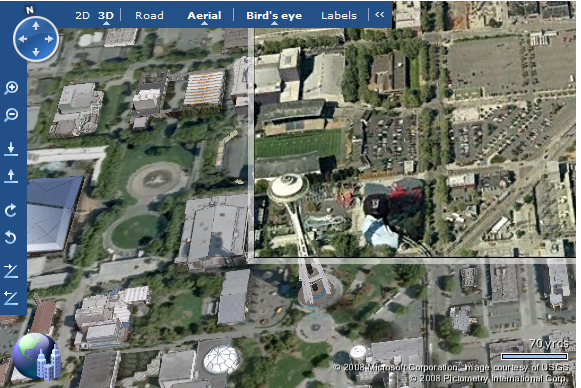
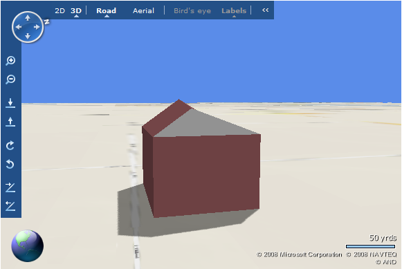

# Working with 3D
This article explores the basics of leveraging the many capabilities of the 3D map view in [!INCLUDE[ve_product_name](../articles/includes/ve-product-name-md.md)]. This article also explains how to import 3D objects that are made using the VE3DVIA tool.  
  
## Getting Started  
 The [!INCLUDE[ve3d_product_name](../articles/includes/ve3d-product-name-md.md)] control is an ActiveX plug-in that you must download into your Web browser. Start with a basic [!INCLUDE[ve_product_name](../articles/includes/ve-product-name-md.md)] map page  
  
```  
<html>  
<head>  
  <title>Map Query</title>  
  <meta http-equiv="Content-Type" content="text/html; charset=utf-8">  
  <script src="http://ecn.dev.virtualearth.net/mapcontrol/mapcontrol.ashx?v=6.3"></script>  
  <script>  
    var map = null;  
    function GetMap()  
    {  
      map = new VEMap('myMap');  
      map.LoadMap();  
    }  
  </script>  
</head>  
  
<body onload="GetMap();">  
    <div id='myMap' style="position:relative; width:600px; height:400px;"></div>  
</body>  
</html>  
```  
  
 If you load this page into a Web browser, you will see a basic [!INCLUDE[ve_product_name](../articles/includes/ve-product-name-md.md)] map.  
  
   
  
 *Figure 1.* Basic 2D map  
  
 Click on the 3D link in the navigation control to switch to 3D mode. If you haven’t used 3D mode before, you will be asked to download and install a control from Microsoft. The process for downloading the control may vary depending on your security settings.  
  
1.  Click on the 3D link in the navigation control  
  
2.  Click the Download button on the [!INCLUDE[ve3d_product_name](../articles/includes/ve3d-product-name-md.md)] (Beta) installation screen.  
  
3.  Choose “Run” on the File Download dialog.  
  
4.  Choose “Run” on the security warning dialog asking whether you want to run [!INCLUDE[ve3d_product_name](../articles/includes/ve3d-product-name-md.md)]from Microsoft Corporation.  
  
5.  Decide if you want to change your home page to [!INCLUDE[msn_brand](../articles/includes/msn-brand-md.md)], make [!INCLUDE[livesearch_name](../articles/includes/livesearch-name-md.md)] your default search engine, or find out more about the [!INCLUDE[ve3d_product_name](../articles/includes/ve3d-product-name-md.md)]VIA system (described later in this article).  
  
 Once you have 3D installed, your basic map will look very different.  
  
   
  
 *Figure 2.* Basic 3D map  
  
 Note that by switching to 3D mode, several new controls are displayed. These new 3D controls allow you to navigate 3D (rotation and pitch). Finally, the status text at the bottom of your browser displays the latitude, longitude, and altitude of the area of the map under the cursor. The globe on the right shows the current status of loading the view.  
  
## Programmatically Switching to 3D  
 You can programmatically switch between 2D and 3D modes using the [VEMap.SetMapMode Method](http://msdn.microsoft.com/en-us/97f610ec-a667-4fe4-a581-4e1cb212b44f). By adding the following function to your code as well as buttons to call this function, you can switch between 2D and 3D map views.  
  
```  
function switchMapView(show3D)  
{  
  if(show3D)  //switch to 3D map view  
  {  
    map.SetMapMode(VEMapMode.Mode3D);  
  }  
  else  //switch to 2D map view  
  {  
    map.SetMapMode(VEMapMode.Mode2D);  
  }  
}  
```  
  
## Map Mode Events  
 As part of the process of switching modes, you also have access to two events.  
  
 The [VEMap.oninitmode Event](http://msdn.microsoft.com/en-us/0bee7a8a-19fd-4c09-8e5a-032a33d3b28b) fires after the mode has been reset to either 2D or 3D. You can use a callback on this event to change your control display for the different modes. To make this event work you need to attach the event to the map. This can be done by adding the following line of code to the GetMap() function.  
  
```  
map.AttachEvent('oninitmode', modeChangeCallback);  
```  
  
 The [VEMap.onmodenotavailable Event](http://msdn.microsoft.com/en-us/bad4213c-5dd5-4315-a8f4-e4f8a47df8b2) fires only when a mode change is impossible. This event is triggered when the Web browser does not support the 3D mode, or the user cancels the installation of the 3D control. This event can also be attached to the map object using the following code in the GetMap() function.  
  
```  
map.AttachEvent(‘onmodenotavailable’, modeNotAvailableCallback);  
```  
  
## Navigation in 3D  
 Controlling the view in 3D mode requires that you provide altitude, pitch, and viewing direction, as well as latitude, longitude, and style that are also required in 2D. All of these values are set in a [VEMapViewSpecification Class](http://msdn.microsoft.com/en-us/b19f6f2d-92ff-45cc-ad88-4afe735a506e). The constructor for this class is:  
  
```  
var viewSpec = new VEMapViewSpecification(center, zoom, altitude, pitch, heading);  
```  
  
 The `center` parameter is a [VELatLong Class](http://msdn.microsoft.com/en-us/663fe8e0-447b-4fe7-b72b-d84aeb280950) object that specifies the center of the map. The `zoom` parameter is an integer that represents the zoom level of the map.  This value is ignored if an `altitude` parameter is specified. The `altitude` parameter is the altitude, in meters above the geoid, or mean ocean surface. Keep in mind that altitude is “absolute” rather than simply being above ground level.  Setting a zoom of 3000 meters on Mt Everest would set your view roughly 1/3 up the inside of the mountain.  The `pitch` of the view is in degrees where -90 represents straight down and 0 is level with the horizon. The `heading` parameter is a compass degree that the view is looking towards. 0 and 360 is true north.  
  
 Once you have your view specification, you pass it to the [VEMap.SetMapView Method](http://msdn.microsoft.com/en-us/cadcc506-7000-43a8-a847-1f1a61e0c659).  
  
```  
map.SetMapView(viewSpec);  
```  
  
 If you only want to set one parameter in the view then you can use one of the following methods to change the view:  
  
```  
var latlong = new VELatLong(45.0,-110.0);  
var zoom = 10;  
var altitude = 250.5;  
var heading = 180.0;  
var pitch = 15.0;  
  
map.SetCenter(latlong);  
map.SetCenterAndZoom(latlong, zoom);  
map.SetZoomLevel(zoom);  
map.SetAltitude(altitude);  
map.SetHeading(heading);  
map.SetPitch(pitch);  
```  
  
## Finding Altitude, Pitch, and Heading  
 There are three methods that can be used to extract the current altitude, pitch and heading from the map. To extract the altitude in meters, you use the [VEMap.GetAltitude Method](http://msdn.microsoft.com/en-us/e920d7bd-4537-4d0d-88c8-14d54053ddff).  Remember that the altitude references the distance above the geoid or mean sea level.  To extract the pitch of the current view, use the [VEMap.GetPitch Method](http://msdn.microsoft.com/en-us/b5dfaad6-172f-4871-9554-86da0c5909fb).  Finally, to extract the current heading, use the [VEMap.GetHeading Method](http://msdn.microsoft.com/en-us/39c2ecd0-d327-45c0-acce-4a17678838de).  
  
 The following function uses the three methods mentioned above and returns the view specification parameters to the user.  
  
```  
function get3DParameters()  
{  
  alert("Altitude: "+map.GetAltitude()+"\r\nHeading: "+map.GetHeading()+"\r\nPitch: "+map.GetPitch());    
}  
```  
  
 Calling this function after navigating in 3D mode would display an alert similar to this:  
  
   
  
 *Figure 3.* Viewing the specification  
  
 The altitude value is always set and retrieved in meters.  If you want to convert to feet, multiply by 3.2808399.  
  
 The pitch is the angle of the camera view with respect to the current earth surface. If you imagine a straight line from the camera projecting into the map, the angle between that line and the "drop shadow" version of that line is the pitch. However, pitch is measured from 0 (horizon view) to -90 degrees (straight down top view). Most of the time, you will want a pitch of between 30 and 45 degrees for the best looking views. Anything less than about 20 degrees creates a degree of visual distortion that many people find disorienting. Anything over 60 degrees and you are basically looking at a 2D view.  
  
 Heading is simply the current compass heading of the view. A value of 0 is true north, 90 is due east, 180 is due south, and 270 is due west.  
  
## Showing and Hiding the 3D Control  
 In 3D mode there are additional buttons displayed on the dashboard that allow you to use the mouse to navigate the 3D map. You can hide the 3D control using the [VEMap.Hide3DNavigationControl Method](http://msdn.microsoft.com/en-us/7e1688ec-d339-4b0b-8af5-7dd72f4826c4).  If you have hidden the 3D navigation control, you can later show it using the [VEMap.Show3DNavigationControl Method](http://msdn.microsoft.com/en-us/4e2d1294-9214-4087-b6d9-977af9c17ae1).  
  
## Adding Shapes  
 Adding and removing shapes works the same in 3D as in 2D. However, you can also set the altitude and the altitude mode for a shape. The altitude mode defines if the altitude specified is relative to the ground or absolute to the WGS 84 ellipsoid. By default the shapes altitude is relative to the ground.  
  
### Adding a Pushpin  
 A pushpin on a 3D map is drawn as a 2D icon at the altitude of the current zoom level of the map.  
  
```  
function addPin()  
{  
  var pin = new VEShape(VEShapeType.Pushpin,new VELatLong(47.62048276634572,-122.34932886660015));  
  map.AddShape(pin);    
}  
```  
  
 If you view this pushpin in 3D mode you will notice that the pushpin is located on top of the Space Needle instead of on the ground.  
  
   
  
 *Figure 4.* Pushpin on the Space Needle  
  
 By setting the altitude of the pushpin and defining the altitude mode to **VEAltitudeMode.Absolute**, you can display the pushpin at a specific distance above mean sea level. Making these modifications to the previous function looks like this:  
  
```  
function addPin()  
{  
  var pin = new VEShape(VEShapeType.Pushpin,new VELatLong(47.62048276634572,-122.34932886660015));  
  pin.SetAltitude(250);  
  pin.SetAltitudeMode(VEAltitudeMode.Absolute);  
  map.AddShape(pin);    
}  
```  
  
 Viewing this location in 3D mode would result in the pushpin being displayed 250 meters above the ground.  (The space needle is about 184 meters.)  
  
   
  
 *Figure 5.* Pushpin a distance above the Space Needle  
  
 Depending on how you rotate the view, the pushpin may disappear behind buildings. In some cases, a pushpin may appear to be partially embedded inside a building. If you set the altitude of the pushpin such that it is located inside of a building when using the absolute altitude mode, it might also appear partially embedded in the building.  
  
 Note that if you change the **VEAltitudeMode** to **VEAltitudeMode.Default**, or **VEAltitudeMode.RelativeToGround**, then your pushpin will be placed relative to the ground level (including buildings).  The previous code can be changed as follows:  
  
```  
function addPin()  
{  
  var pin = new VEShape(VEShapeType.Pushpin,new VELatLong(47.62048276634572,-122.34932886660015));  
  pin.SetAltitudeMode(VEAltitudeMode.RelativeToGround);  
  //Space needle is 184 meters, and we want to be 66 meters higher to match our 250  
  pin.SetAltitude(66);  
  map.AddShape(pin);    
}  
```  
  
### Adding Polygons and Polylines  
 When the altitude mode is in default mode or set to relative, polygons and polylines are affected by the 3D surface of the underlying map. In this case the lines will take the shape of the underlying surface. This is demonstrated using the following code:  
  
```  
function addPolygon()  
{  
  var points = new Array(new VELatLong(39.352888315733395,-120.70082956811164),  
  new VELatLong(39.352888315733395,-120.36280910683128),  
  new VELatLong(39.12689911735443,-120.36280910683128),  
  new VELatLong(39.12689911735443,-120.70082956811164));  
  
  var polygon = new VEShape(VEShapeType.Polygon,points);  
  polygon.SetLineColor(new VEColor(0,150,100,1.0));  
  polygon.SetFillColor(new VEColor(0,100,150,0.5));  
  map.AddShape(polygon);            
}  
```  
  
 Viewing this polygon in a browser while in 3D mode will look like this:  
  
   
  
 *Figure 6.* Polygon using relative altitude mode  
  
 By setting the altitude and the altitude mode you can draw the polygon so that it is drawn with an absolute height.  
  
```  
function addPolygon()  
{  
  var points = new Array(new VELatLong(39.352888315733395,-120.70082956811164),  
  new VELatLong(39.352888315733395,-120.36280910683128),  
  new VELatLong(39.12689911735443,-120.36280910683128),  
  new VELatLong(39.12689911735443,-120.70082956811164));  
  
  var polygon = new VEShape(VEShapeType.Polygon,points);  
  polygon.SetLineColor(new VEColor(0,150,100,1.0));  
  polygon.SetFillColor(new VEColor(0,100,150,0.5));  
  polygon.SetAltitude(2000);  
  polygon.SetAltitudeMode(VEAltitudeMode.Absolute);  
  map.AddShape(polygon);              
}  
```  
  
 Using the previous code, the following view is generated.  
  
   
  
 *Figure 7.* Polygon with set altitude and altitude mode  
  
 As you can see in Figure 7, the polygon appears to be slicing through the surface. This is because some areas on the map are higher than the polygon altitude so the tops of the mountains show through the polygon.  
  
## Adding Controls in 3D  
 The [!INCLUDE[ve3d_product_name](../articles/includes/ve3d-product-name-md.md)] map control is an ActiveX control. Unfortunately that means that Internet Explorer draws the map over the top of any HTML controls drawn on the page. In practical terms, this means that the normal mechanisms you use to overlay controls on a 2D map do not work the same way for a 3D map. Fortunately you can use the simple workaround of encapsulating your controls in an \<iframe> shim. Since Internet Explorer treats an \<iframe> as a separate window, your controls will be drawn over the top of your 3D map.  
  
### The IFrame Wrapper  
 The easiest way to encapsulate your objects in an iFrame is to use a JavaScript method that creates the frame and inserts it into your object model.  
  
```  
function addShim(el)  
{  
       var shim = document.createElement("iframe");  
       shim.id = "myShim";  
       shim.frameBorder = "0";  
       shim.style.position = "absolute";  
       shim.style.zIndex = "1";  
       shim.style.top  = el.offsetTop;  
       shim.style.left = el.offsetLeft;  
       shim.width  = el.offsetWidth;  
       shim.height = el.offsetHeight;  
       el.shimElement = shim;  
       el.parentNode.insertBefore(shim, el);  
}  
```  
  
 You can use this method to add a control.  
  
```  
function AddControl()  
{  
    var el = document.createElement("div");   
    el.id = "myControl";   
    el.style.top = 100;   
    el.style.left = 100;              
    el.style.border = "2px solid black";  
    el.style.background = "White";  
    el.innerHTML = el.id;    
    map.AddControl(el);  
    addShim(el);  
}  
```  
  
 Note that you insert the iFrame after adding the base control to the map. If you add the iFrame first, the panel is actually drawn behind the control. Additionally, if the user switches between 2D and 3D, the control is lost so you will have to use the [VEMap.oninitmode Event](http://msdn.microsoft.com/en-us/0bee7a8a-19fd-4c09-8e5a-032a33d3b28b) to monitor the switching of the modes. When the mode is switched, delete the control and then add it again.  
  
```  
function DeleteControl()  
{  
  var myControl = document.getElementById("myControl");  
  if (myControl!=null)  
  {  
      var myControlID = myControl.id;  
      map.DeleteControl(myControl);  
  }  
  else  
  {  
      return;  
  }  
  
  var myShim = document.getElementById("myShim");  
  if (myShim!=null)   
    myShim.parentNode.removeChild(myShim);  
  
  myShim = null;  
}  
```  
  
 Using the oninitmode callback defined earlier, you can create a function to delete and add the control:  
  
```  
function modeChangeCallback()  
{  
    DeleteControl();  
    AddControl();     
}  
```  
  
 Displaying this in a browser will result in the following:  
  
   
  
 *Figure 8.* Custom control in 3D  
  
## Birdseye View in 3D  
 You can view Birdseye in 3D mode using the [VEMap.Show3DBirdseye Method](http://msdn.microsoft.com/en-us/2d10546d-34b2-4682-b286-b79c571b9c0a). (Using the [VEMap.SetMapStyle Method](http://msdn.microsoft.com/en-us/370142af-d68c-4044-9243-d016e4ea558e) to set the map style to bird's eye does not work in 3D.) The 3D engine automatically sets the pitch and zoom level to match the Birdseye scene with the 3D map.  
  
   
  
 *Figure 9.* [!INCLUDE[ve3d_product_name](../articles/includes/ve3d-product-name-md.md)] and Birdseye  
  
 Note that the Birdseye image replaces the underlying 3D imagery with a higher quality picture.  However, as you rotate and zoom in 3D, the Birdseye picture will appear or disappear as the view changes. Birdseye imagery is only available in certain areas.  
  
## 3DVIA  
 3DVIA is a program that allows you to build three dimensional models and then import them into your [!INCLUDE[ve_product_name](../articles/includes/ve-product-name-md.md)] map. This tool can be downloaded here from [http://www.bing.com/Help/en-us/VE3DVIADownload.htm](http://www.bing.com/Help/en-us/VE3DVIADownload.htm).  
  
 After you install the 3DVIA software, go to bing.com/maps before building your model and select an area of the map to build your model. Here are the general steps required to import a 3D object into your [!INCLUDE[ve_product_name](../articles/includes/ve-product-name-md.md)] map.  
  
1.  Go to bing.com/maps  
  
2.  Sign in with your [!INCLUDE[winlive_id_name](../articles/includes/winlive-id-name-md.md)]  
  
3.  Switch from 2D to 3D view  
  
4.  Click the collections menu, then click “Open your collections” and then click on the house icon or right-click a location, then click “Add 3D model”.  
  
   
  
 *Figure 10.* Adding a 3D model using the collections menu  
  
   
  
 *Figure 11.* Adding a 3D model using the house icon on the collections menu  
  
1.  Create your 3D object in 3DVIA. It is recommended to start off with a simple box to verify you are able to get everything to work.  
  
2.  When you are done creating your 3D object click the publish button. You should be able to see your object on the map.  
  
   
  
 *Figure 12.* 3DVIA publish button  
  
1.  Next you will have to get the collection ID. This can be done by pressing the "Send in e-mail" button under the Share menu. An email should open up. There will be a URL available to load the map of your 3D object on the bing.com/maps page. In the URL query string there is a CID variable. This is the collection ID.  
  
   
  
 *Figure 13.* Send in email button  
  
 Now that you have the collection ID for your 3D object you can load this into your [!INCLUDE[ve_product_name](../articles/includes/ve-product-name-md.md)] map the same way you would load a regular collection. The following code will load a 3D collection that I have created:  
  
```  
var layer = new VEShapeLayer();  
  
function AddMyLayer()  
{  
    var veLayerSpec = new VEShapeSourceSpecification(VEDataType.VECollection, "E7DBA9A4BFD458C5!113", layer);  
    map.ImportShapeLayerData(veLayerSpec);  
}  
```  
  
 By loading this in a browser you see the simple 3D model that is created.  
  
   
  
 *Figure 14.* Uploaded 3D model  
  
 You can iterate through the shapes in the shape layer. However, you are limited in what you can do with shapes that are 3D models.  The [VEShape.IsModel Method](http://msdn.microsoft.com/en-us/38b283ba-f143-4d6a-95fc-2986671233da) will return a Boolean value indicating if a shape is a 3D model or not.  
  
```  
function find3DModel()  
{  
   for(var cnt = 0; cnt < layer.GetShapeCount(); cnt++)  
   {  
          shape = layer.GetShapeByIndex(cnt);  
          if(shape.IsModel())  
    {  
           alert("Found 3D model: "+shape.GetID());  
            break;     
    }  
   }     
}  
```  
  
 Note that you can also add textures to your 3D models using the 3DVIA tool. You can also import a variety of pre-built structures.  
  
## Conclusion  
 Mastering the 3D map control gives you a range of options for your [!INCLUDE[ve_product_name](../articles/includes/ve-product-name-md.md)] application. Whether you simply want to switch to 3D from 2D, or use 3D to create new visualizations of your data, you can leverage the basic methods described in this article.