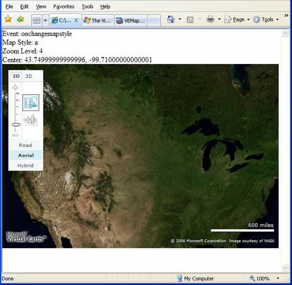
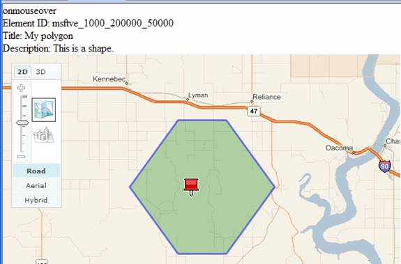

# Working with Events
The basic [!INCLUDE[ve_product_name](../articles/includes/ve-product-name-md.md)] map responds to numerous events including mouse clicks, drag and drop, scroll wheel motion and various key combinations.  Naturally, as an application developer, you would like to leverage these events to provide your own actions.  In [!INCLUDE[ve_product_name](../articles/includes/ve-product-name-md.md)] capturing, cancelling and working with events is an easy task.  In this article, you will learn how to work with [!INCLUDE[ve_product_name](../articles/includes/ve-product-name-md.md)] driven events.  
  
## Getting Started  
 Before we start working with events, let's start with a basic [!INCLUDE[ve_product_name](../articles/includes/ve-product-name-md.md)] map:  
  
```  
<html>  
<head>  
<script src="http://ecn.dev.virtualearth.net/mapcontrol/mapcontrol.ashx?v=6.3"></script>  
<script>  
  var map;  
  // add callbacks here  
  
  function OnPageLoad()  
  {  
    map = new VEMap('myMap');  
    map.LoadMap();  
    //attach events here  
  }  
</script>  
<body onload="OnPageLoad();">  
  <div id="resultDiv"></div>  
  <div id="myMap" style="position:relative;width:600px;height:400px;"></div>  
</body>  
</html>  
```  
  
 **Listing 1: Basic Page (Events.html)**  
  
 If you load this page in a browser, you should see a map of the United States with the basic [!INCLUDE[ve_product_name](../articles/includes/ve-product-name-md.md)] navigation dashboard.  
  
### Working with Events  
 Working with a [!INCLUDE[ve_product_name](../articles/includes/ve-product-name-md.md)] event can be divided into a two step process:  
  
1.  Create a callback method to respond to the event.  The callback method should be a JavaScript function that expects a single argument and optionally returns a Boolean value.  The argument will contain information related to the event, and the return value is an indicator of whether your callback completely processed the event.  If your callback completely handles the event, and you do not want any further processing, return true.  If you want to allow the default event action to continue (e.g. double click to zoom in), then return false.  
  
2.  Register the event with your map control using the `map.AttachEvent(eventname, functionname)` method.  
  
 When your selected event occurs, the map will automatically execute your callback function.  The event object that is passed to your function contains a set of properties that are event specific.  
  
 Using these basic guidelines, you can group the various available events into three categories:  
  
-   Map events – Map events relate to basic map navigation tasks such as zooming, panning and changing the view.  You will work with these events most often.  
  
-   Mouse events – Mouse events relate to mouse driven input such as left click, right click, mouseover, and so on.  You will use these events to control the way your users interact with the map.  You want to carefully consider your mouse events as most mouse actions are already mapped to standard navigation mechanics (e.g. mouse scroll wheel maps to zoom in/zoom out).  
  
-   Keyboard events – Keyboard events are the complement to mouse events, but relate to keyboard input.  Once again, some keys are already mapped to standard navigation (e.g. arrows map to pan functions) so you want to carefully consider modifying this functionality.  
  
 Each of these event types is examined in greater detail below.  In addition, the last section of this article describes how to override the default [!INCLUDE[ve_product_name](../articles/includes/ve-product-name-md.md)] events.  
  
## Map Events  
 The [map events](http://msdn2.microsoft.com/en-us/library/bb429568.aspx) are mostly secondary events that occur based on some programmatic or user input driven change in the map.  For example, you can capture events that occur when the map style (road, aerial, hybrid, oblique), mode (2D or 3D), or view (pan, zoom, resize) change.  You can also capture an event if an error occurs while loading the map.  
  
### Working with Map Style  
 Starting with our simple map in , add the following callback function to respond to a style change event:  
  
```  
function HandleSytleChange(e)  
  {  
  //Build result div  
    result = "Event: " + e.eventName + "<br>";  
    result = result + "Map Style: " + e.mapStyle + "<br>";  
    result = result + "Zoom Level: " + e.zoomLevel + "<br>";  
    result = result + "Center: " + map.GetCenter() + "<br>";  
  
  //Display event information  
    document.getElementById('resultDiv').innerHTML = result;  
  }  
```  
  
 **Listing 2: Style Change Callback**  
  
 Note that the event doesn't contain information about the current map center point.  We have to access the `GetCenter` method on the map object to find that information.  
  
 Finally, we need to attach to the event.  Add the following line of code to  in the `OnPageLoad` method.  
  
```  
map.AttachEvent("onchangemapstyle", HandleSytleChange);  
```  
  
 **Listing 3: Attaching the event**  
  
 Make sure you add this line of code after the comment indicating where to attach events.  If you try to attach events before loading the map, you will encounter JavaScript errors indicating that the object hasn't been initialized yet.  
  
 Now if we open events.html in a browser, and then switch views, we should see information about the current view:  
  
   
  
 **Figure 1: A Style Change Event**  
  
### Working with Map View  
 The other most common Map events relate to changes in the view.  View events can be divided into three groups:  
  
-   Start events – You can capture an event at the beginning of a pan or zoom.  This event is most commonly used to cancel the movement.  
  
-   End events – You can capture the end of a pan or zoom.  
  
-   Change view – This event is fired whenever the center point, zoom level or style of the map changes through user action or programmatic action.  
  
 To capture current view, we can reuse the Style Change handler in  and simply attach another event to OnPageLoad in :  
  
```  
map.AttachEvent("onchangeview", HandleSytleChange);  
```  
  
 **Listing 4: View Information Handler**  
  
 If you reload events.html, you will notice that you never see the style change event anymore, you only see the view change.  That's because the style change event occurs before the view change event.  If you add `alert(result);` to , you will see two alert boxes every time you change the style, but only one if you pan or zoom.  Note that the event firing order is controlled by the [!INCLUDE[vemc_product_name](../articles/includes/vemc-product-name-md.md)].  The order in which you attach events has no bearing on which events occur or the order in which those events occur.  
  
## Mouse Events  
 Mouse events are different from Map events in that mouse events are directly related to user actions.  Everything that the user does with the mouse in relation to amap can be captured.  Mouse events are captured whenever the user:  
  
-   Clicks a mouse button (left, middle or right) on a [!INCLUDE[ve_product_abbr](../articles/includes/ve-product-abbr-md.md)] Map.  
  
-   Double clicks a mouse button.  
  
-   Pushes a mouse button down, or releases the button.  
  
-   Rotates the scroll wheel (2D only).  
  
-   Moves a mouse over the map.  
  
-   Moves the mouse over a **VEShape** object, or off of a **VEShape** object.  
  
 All of these events return an object indicating whether the Alt, Ctrl or Shift key was pressed in conjunction with the event.  In addition, each of the callback objects gives you extensive information about where the cursor and what the map view looks like when the event occurred.  
  
 To capture mouse events, create a callback function and add it to :  
  
```  
function MouseHandler(e)  
{  
  var msg = "Event: ";  
  msg += e.eventName;  
  if (e.eventName == "onclick")  
  {  
    if (e.leftMouseButton)  
      msg += "- left";  
    else if (e.rightMouseButton)  
      msg += "- right";  
    else  
      msg += "- middle";;  
  }  
  
  msg += "<br>";  
  msg += "X:" + e.mapX + "  Y:" + e.mapY + "<br>";  
  msg += "Shift: " + e.shiftKey + "<br>";  
  msg += "Ctrl: " + e.ctrlKey + "<br>";  
  msg += "Alt: " + e.altKey + "<br>";  
  
  document.getElementById('resultDiv').innerHTML=msg;  
}  
```  
  
 **Listing 5: Handle Mouse Events**  
  
 Next, attach the following events to the OnLoadMap function:  
  
```  
map.AttachEvent("onclick",MouseHandler);  
map.AttachEvent("ondoubleclick",MouseHandler);  
map.AttachEvent("onmousedown",MouseHandler);  
map.AttachEvent("onmouseup",MouseHandler);  
map.AttachEvent("onmousewheel",MouseHandler);  
```  
  
 **Listing 6: Attaching Mouse Events**  
  
 If you load the map page, you will notice that the events fire in a specific order.  Much like with the change style and change view events, you may never see the results of onmouseup, because you always see onclick firing immediately afterwards.  
  
### Mouse Events and Shapes  
 Some of the most useful mouse events are onmouseover and onmouseout.  These events let you know when the user moves their mouse curser over the map, or over a specific VEShape (pushpin, polygon or polyline) within the map.  Among other information, these events give you the shape id which you can then use to gather information about the target shape.  
  
 Starting once again with , add the following callback to process the mouse over and mouse out events:  
  
```  
function MouseShapeHandler(e)  
{  
  var msg;  
  msg = e.eventName + "<br>" + "Element ID: ";  
  if (e.elementID != null)  
  {  
    msg += e.elementID + "<br>";  
    var shape = map.GetShapeByID(e.elementID);  
    msg += "Title: " + shape.GetTitle()+ "<br>";  
    msg += "Description: " + shape.GetDescription()+ "<br>";  
  }  
  else  
    msg += "map";  
  document.getElementById('resultDiv').innerHTML = msg;  
}  
```  
  
 **Listing 7: MouseShapeHandler**  
  
 Note that you always want to check whether or not the `elementID` is null.  The `onmouseover` and `onmouseout` events fire when the user moves over a shape, but also when the user moves onto (or off of) the map itself.  
  
 The next step is to create a shape to test.  Add the following polygon creator method:  
  
```  
function AddPolygon()  
{  
  var ll = map.GetCenter();  
  var lat = ll.Latitude;  
  var lon = ll.Longitude;  
  var shape = new VEShape(VEShapeType.Polygon,  
    [new VELatLong(lat,lon-0.15),  
     new VELatLong(lat+0.1,lon-0.05),  
     new VELatLong(lat+0.1,lon+0.05),  
     new VELatLong(lat,lon+0.15),  
     new VELatLong(lat-0.1,lon+0.05),  
     new VELatLong(lat-0.1,lon-0.05)]);  
  shape.SetTitle('My polygon');  
  shape.SetDescription('This is a shape.');  
  map.AddShape(shape);  
}  
```  
  
 **Listing 8: Polygon Creation Method**  
  
 This method draws a hexagon around the center of map.  
  
 Finally, we need to attach our events and draw the polygon.  Add the following code to the OnPageLoad method:  
  
```  
map.AttachEvent("onmouseover",MouseShapeHandler);  
map.AttachEvent("onmouseout",MouseShapeHandler);  
map.SetZoomLevel(10);  
AddPolygon();  
```  
  
 **Listing 9: Attaching the events and creating the polygon**  
  
 Note that we set the map zoom level to make the polygon a little easier to see.  
  
 Once you've saved your changes and reloaded your page, you should be able to see the onmouseover and onmouseout events in action.  Move the mouse over the polygon and then move it off again.  Also note what happens when you move the mouse completely off of the map and then back on again:  
  
   
  
 **Figure 2: Mouse and Shape Interaction**  
  
### Overriding Mouse Events  
 One of the challenges of working with mouse events is that your users may already be used to a certain style of map navigation using the mouse.  For example, most users will instinctively drag and drop the map to pan, or double click to re-center and zoom.  You therefore need to be very sure of your user needs before cancelling the built in processing for a mouse event.  If, for example, you change the mouse wheel from "adjust zoom" to "change style", you will break the convention found on most [!INCLUDE[ve_product_name](../articles/includes/ve-product-name-md.md)] maps.  
  
### Keyboard Events  
 Keyboard events are very similar to mouse events in that keyboard actions are the direct link to the user's actions.  There are three keyboard events that trap key press, key down and key up.  All three events behave similar to their mouse equivalents (click, mouse down, mouse up).  However, the object returned to your event handler contains a keyCode property.  This property maps to a standard JavaScript Key Code value.  
  
 As with mouse events, you should be careful overriding existing key combinations (arrows in particular) as your users are already used to those keys having special meanings.  Also, the keyboard events are not supported in 3D mode.  The 3D API uses a managed control rather than JavaScript, and the key actions are captured differently.  At present, there are no open API methods for capturing keyboard events in 3D.  
  
### Overriding Built In Events  
 Regardless of the type of event, you can override the default [!INCLUDE[ve_product_name](../articles/includes/ve-product-name-md.md)] behavior.  For example, the default behavior for a double-click is to re-center the map and zoom in an additional level.  For your application, you might want a double-click to create a new pushpin, but keep the view the same.  Using the mechanics described above, you can attach an event handler to listen for the double-click event.  Start once again with  and add the following code:  
  
```  
function DoubleClickHandler(e)  
{  
  var pixel = new VEPixel(e.mapX, e.mapY);  
  var point = map.PixelToLatLong(pixel);  
  var pin = new VEShape(VEShapeType.Pushpin, point);  
  pin.SetTitle("Double Click");  
  pin.SetDescription("DoubleClick Event");  
  map.AddShape(pin);  
  return true;  
}  
```  
  
 **Listing 10: Overriding a built in event**  
  
 Unlike in previous examples, we return a value from this callback.  The return true statement tells the [!INCLUDE[ve_product_name](../articles/includes/ve-product-name-md.md)] map that the event has been completely handled and that no further processing is necessary.  As soon as we attach the double click event to this callback, our users will be able to create a pushpin by double clicking:  
  
```  
map.AttachEvent("ondoubleclick",DoubleClickHandler);  
```  
  
 **Listing 11: Attaching the DoubleClick Handler**  
  
 Note that, once again, returning a value of true stops all further processing of the event.  Our users, who may be used to having the map re-center and zoom won't see that behavior anymore. Instead, a double click will simply put a pin on the map.  If you change the return value to false (the default), then a double click will add a pushpin, re-center and zoom in.  
  
### Overriding Events in 3D  
 With the 3D control, you have fewer options for overriding events.  The 3D control is an ActiveX control running under different security and programmatic rules than the basic 2D control.  As such, you cannot currently override any keyboard events in 3D.  You also have to be careful overriding other events as the behavior in 3D is often very different than 2D.  For example, the alt, shift and ctrl keys have much more power with regards to mouse events.  Similarly, some of the events return different information in 3D than in 2D.  As such, you want to very carefully test any custom event logic in 3D before deploying your application to your user base.  You may need to specifically attach or detach events when you detect a mode change to 3D.  
  
## Conclusion  
 With the event mechanism, you can quickly and easily configure your application to respond to user input in the way that best suits your needs.  Whether you simply capture events for information, or override keyboard behavior, you can use the event mechanism to control the way your users interact with your mapping applications.