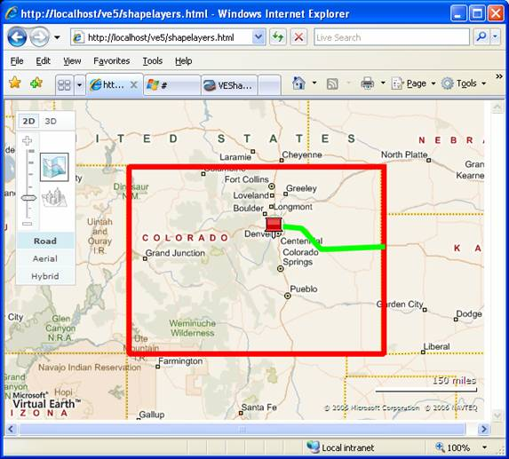

# Working with Shape Layers
One of the challenges in working with shapes on a map is that you often want to control and manage the shapes in a collection.  In [!INCLUDE[ve_product_name](../articles/includes/ve-product-name-md.md)], you can group shapes in shape layers.  Each layer provides a mechanism for adding shapes, removing shapes and accessing the shapes stored within the layer.  Each layer also provides controls for showing and hiding the entire layer.  The best part is that the shape layer is a container for all kinds of shapes.  You can group any combination of pushpins, polygons and polylines in the same layer and work with it as a single collection.  
  
## Getting Started  
 Before we start working with shape layers, let's start with a basic [!INCLUDE[ve_product_name](../articles/includes/ve-product-name-md.md)] map:  
  
```  
<html>  
<head>  
<script src="http://ecn.dev.virtualearth.net/mapcontrol/mapcontrol.ashx?v=6.3"></script>  
<script>  
  var map;  
  
  function OnPageLoad()  
  {  
    map = new VEMap('myMap');  
    map.LoadMap();  
  }  
</script>  
<body onload="OnPageLoad();">  
  <div id="myMap" style="position:relative;width:600px;height:400px;"></div>  
</body>  
</html>  
```  
  
 **Listing 1: Basic Page (ShapeLayers.html)**  
  
 If you load this page in a browser, you should see a map of the United States with the basic [!INCLUDE[ve_product_name](../articles/includes/ve-product-name-md.md)] navigation dashboard.  
  
## Collecting Shapes in a Layer  
 Every time you add a shape to the VEMap using the `AddShape` method, you are already working with a shape layer.  The `VEMap` contains a built in default or "hidden" shape layer that is always visible.  However, if you want to create your own layers, you need to start by creating an instance of `VEShapeLayer`.  Then you can add your shapes.  Finally, you can add the layer to the map using `map.AddShapeLayer`.  
  
 In this example, we will add a pushpin, a polygon and a polyline to a single layer.  Add the following method to :  
  
```  
function LoadShapes()  
{  
  
//create the layer  
var layer = new VEShapeLayer();  
  
//add a pin  
var pin = new VEShape(VEShapeType.Pushpin, new VELatLong(39.73, -105));  
pin.SetTitle("Denver");  
pin.SetDescription("This is a basic pushpin.");  
layer.AddShape(pin);  
  
//add a polygon  
var polygon = new VEShape(VEShapeType.Polygon,  
  [  
    new VELatLong(41,-102),  
    new VELatLong(37,-102),  
    new VELatLong(37,-109),  
    new VELatLong(41,-109)  
  ]);  
polygon.HideIcon();  
polygon.SetLineColor(new VEColor(255,0,0,1));  
polygon.SetFillColor(new VEColor(0,0,0,0));  
polygon.SetLineWidth(5);  
layer.AddShape(polygon);  
  
//Add a polyline  
var polyline = new VEShape(VEShapeType.Polyline,  
  [  
    new VELatLong(39.73676229957947, -104.710693359375),  
    new VELatLong(39.71563813479633, -104.25476074218751),  
    new VELatLong(39.26628442213065, -103.74389648437501),  
    new VELatLong(39.26203141523748, -103.5406494140625),  
    new VELatLong(39.32579941789296, -102.04101562500001)  
  ]);  
polyline.HideIcon();  
polyline.SetLineColor(new VEColor(0,255,0,1));  
polyline.SetFillColor(new VEColor(0,0,0,0));  
polyline.SetLineWidth(5);  
layer.AddShape(polyline);  
  
map.AddShapeLayer(layer);  
}  
```  
  
 **Listing 2: Creating a ShapeLayer**  
  
 If you add one more line to the OnPageLoad method to call LoadShapes, you should see an image that looks like this:  
  
   
  
 **Figure 1: A collection of Colorado Shapes**  
  
 At this point, shape layers may seem fairly uninteresting.  However, before you go back to adding all your shapes directly to the map, take a few minutes to look at the ways you can manipulate a shape layer.  
  
## Manipulating the ShapeLayer  
 Now that you have a `VEShapeLayer`, you can start working with the properties of the layer itself rather than the component shapes.  The first two properties to work with are the layer title and description.  These properties give us two convenient places to store information about the layer itself.  In our example, we could set the layer title to "Colorado" or any convenient string of HTML.  Similarly, we can set the description field to any text or HTML that we choose.  These two properties are very important because they allow you to, among other things, find a particular layer in a map:  
  
```  
function FindLayer(title)  
{  
  var layer = null;  
  for (var i = 0; i < map.GetShapeLayerCount(); i++)  
  {  
    layer = map.GetShapeLayerByIndex(i);  
    if (layer.GetTitle() == 'Colorado') break;  
    layer = null;   
  }  
  return layer;  
}  
```  
  
 **Listing 3: Find a Layer within a Map**  
  
 Once you have a pointer to your layer of interest, you can easily show or hide the layer:  
  
```  
//Show the layer  
layer.Show();  
//Hide the layer  
layer.Hide();  
```  
  
 **Listing 4: Show or Hide a layer**  
  
 You can also find the bounding box for all of the shapes contained in the layer.  This is particularly useful for resetting a map view to zoom in as close as possible to the objects in a layer:  
  
```  
var layer = FindLayer('Colorado');  
map.SetMapView(layer.GetBoundingRectangle());  
```  
  
 **Listing 5: Setting the best view for a layer**  
  
## Deleting Shapes  
 From time to time, you may find a need to delete some or all shapes from a layer.  Fortunately, you have several choices.  First, you can simply delete everything from the layer using the `DeleteAllShapes` command:  
  
```  
layer.DeleteAllShapes();  
```  
  
 **Listing 6: Delete All Shapes**  
  
 If you want to selectively delete a shape, you need an object that references the shape.  As you may not have such an object handy, you may want to use the `GetShapeByIndex` method to find your shape:  
  
```  
var shape;  
for (var i = 0; i < layer.GetShapeCount(); i++)  
{  
  shape = layer.GetShapeByIndex(i);  
  //do something with the shape to make sure it is the one you want  
  layer.DeleteShape(shape);  
}  
```  
  
 **Listing 7: Delete Single Shapes**  
  
## Conclusion  
 Shape layers provide a quick and easy way to organize shapes.  You can put any combination of points, lines and polygons into a layer, and then make the layer visible or hide it with a single command.  Any time you have a related group of objects, consider using a ShapeLayer rather than simply adding the objects directly to the map.