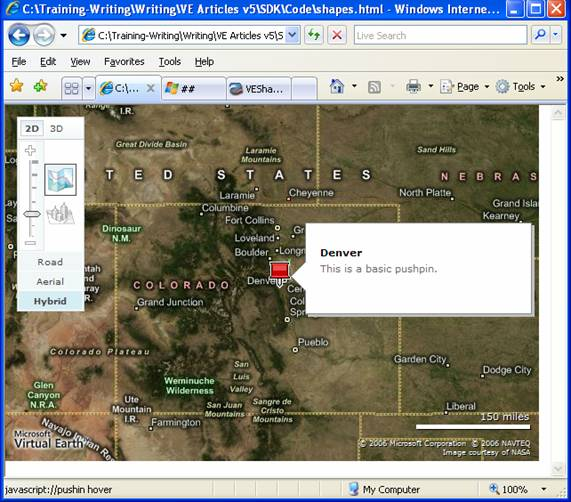
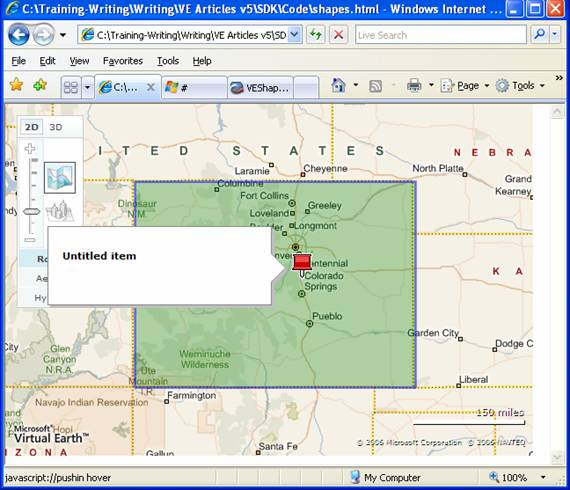
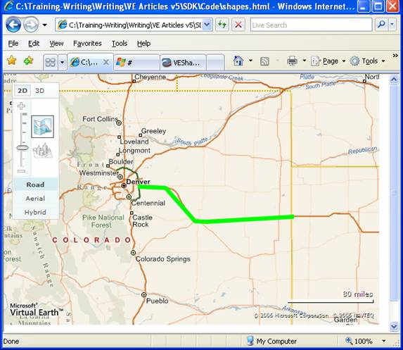
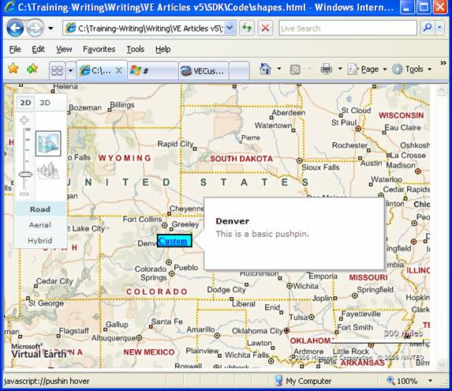
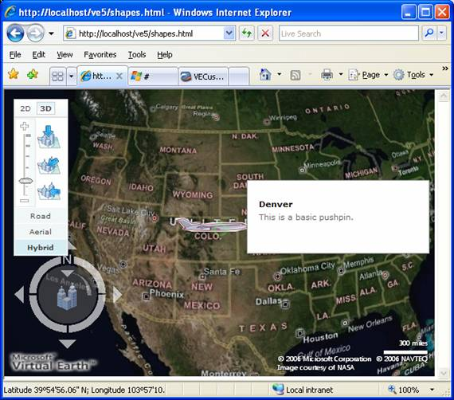
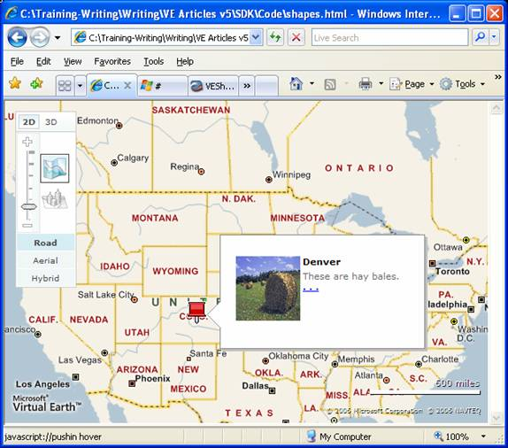
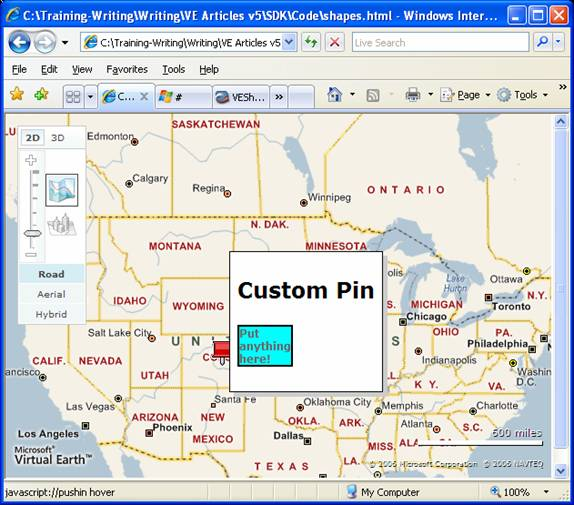

# Working with Shapes
One of the primary reasons to build your own [!INCLUDE[ve_product_name](../articles/includes/ve-product-name-md.md)] application is to display specific information on the map.  With [!INCLUDE[ve_product_name](../articles/includes/ve-product-name-md.md)], you have three primary shapes to work with for presenting information:  pushpins, polylines and polygons.  All three shape types are part of the same `VEShape` class.  You have access to all of the shape's properties through get and set methods.  
  
## Getting Started  
 Before we start working with shapes, let's start with a basic [!INCLUDE[ve_product_name](../articles/includes/ve-product-name-md.md)] map:  
  
```  
<html>  
<head>  
<script src="http://ecn.dev.virtualearth.net/mapcontrol/mapcontrol.ashx?v=6.3"></script>  
<script>  
  var map;  
  
  function OnPageLoad()  
  {  
    map = new VEMap('myMap');  
    map.LoadMap();  
  }  
</script>  
<body onload="OnPageLoad();">  
  <div id="myMap" style="position:relative;width:600px;height:400px;"></div>  
</body>  
</html>  
```  
  
 **Listing 1: Basic Page (Shapes.html)**  
  
 If you load this page in a browser, you should see a map of the United States with the basic [!INCLUDE[ve_product_name](../articles/includes/ve-product-name-md.md)] navigation dashboard.  
  
## Constructing Shapes  
 All shapes are constructed using the `VEShape` constructor method.  This method accepts a parameter indicating the shape type, and an array of `VELatLong` objects (or points).  However, simply creating the shape isn't enough.  You also need to set the shape properties and add the shape to the map.  
  
 Every shape object has a set of get and set methods that allow you to interact with the shapes.  For example, you can add a title and description to each pushpin.  For polygons and polylines, you can adjust the color and thickness.  
  
 Add the following code to the OnPageLoad method of Listing 1:  
  
```  
//create a pushpin  
var pin = new VEShape(VEShapeType.Pushpin, new VELatLong(39.73, -105));  
pin.SetTitle("Denver");  
pin.SetDescription("This is a basic pushpin.");  
map.AddShape(pin);  
```  
  
 **Listing 2: Adding a Pushpin**  
  
 If you save your changes and load the page, you should see a map of the United States with a pushpin over Denver, Colorado.  
  
   
  
 Figure 1: A default Pushpin  
  
### Adding a Polygon  
 The process for adding a polygon is very similar to adding a pushpin.  However, you have to create an array of points representing the vertices (corners) of the polygon.  
  
```  
//create a polygon  
var polygon = new VEShape(VEShapeType.Polygon,  
  [  
    new VELatLong(41,-102),  
    new VELatLong(37,-102),  
    new VELatLong(37,-109),  
    new VELatLong(41,-109)  
  ]);  
  
map.AddShape(polygon);  
```  
  
 **Listing 3: Creating a Polygon**  
  
 If you save your work and load the page, you should see something similar to Figure 2:  
  
   
  
 **Figure 2: A default Polygon**  
  
 By default, a polygon will have a thin blue border, a transparent green fill, and a pushpin sitting somewhere in the middle of the area.  You can change all of that with a few property settings.  Replace Listing 3 with the following:  
  
```  
//create a polygon  
var polygon = new VEShape(VEShapeType.Polygon,  
  [  
    new VELatLong(41,-102),  
    new VELatLong(37,-102),  
    new VELatLong(37,-109),  
    new VELatLong(41,-109)  
  ]);  
  
polygon.HideIcon();  
polygon.SetLineColor(new VEColor(255,0,0,1));  
polygon.SetFillColor(new VEColor(0,0,0,0));  
polygon.SetLineWidth(5);  
  
map.AddShape(polygon);  
```  
  
 **Listing 4: Customizing the Polygon**  
  
 This code will result in a thick, red polygon with no fill.  Also the icon won't appear.  Note that every method for setting color requires a `VEColor` object.  The constructor for the color object accepts a red, green, and blue value (0 to 255), and an alpha or transparency value (0 – transparent to 1 – opaque).  The width parameter is in pixels.  
  
### Adding a Polyline  
 The last shape choice is a polyline.  There really isn't much difference between a polyline and a polygon except that the shape won't be closed.  
  
```  
var polyline = new VEShape(VEShapeType.Polyline,  
  [  
    new VELatLong(39.73676229957947, -104.710693359375),  
    new VELatLong(39.71563813479633, -104.25476074218751),  
    new VELatLong(39.26628442213065, -103.74389648437501),  
    new VELatLong(39.26203141523748, -103.5406494140625),  
    new VELatLong(39.32579941789296, -102.04101562500001)  
  ]);  
  
polyline.HideIcon();  
polyline.SetLineColor(new VEColor(0,255,0,1));  
polyline.SetFillColor(new VEColor(0,0,0,0));  
polyline.SetLineWidth(5);  
map.AddShape(polyline);  
```  
  
 **Listing 5: Adding a Polyline**  
  
 As with a polygon, you can turn off the icon and set the color and thickness of the line.  
  
   
  
## Advanced Shape Properties  
 Once you have mastered the basics of adding shapes, you can leverage some special shape properties to radically change the appearance and behavior of your objects.  
  
### Custom Pins  
 The first thing you might consider is modifying the default icon.  You can replace the icon by setting the Custom Icon property.  This property can point to:  
  
-   The URL of an image  
  
-   A raw string of HTML  
  
-   A VECustomIconSpecification object.  
  
 Each approach has different advantages and disadvantages.  The easiest approach to changing the icon is to simply create your own icon and set the Custom Icon property to point to the URL for that image.  However, you can do so much more with custom HTML.  Going back to the basic pushpin example from Listing 2, we can change the icon as follows:  
  
```  
//create a pushpin  
var pin = new VEShape(VEShapeType.Pushpin, new VELatLong(39.73, -105));  
pin.SetTitle("Denver");  
pin.SetDescription("This is a basic pushpin.");  
  
var icon = "<div style='font-size:12px;font-weight:bold;border:solid 2px   
Black;background-color:Aqua;width:50px;'>Custom</div>";  
pin.SetCustomIcon(icon);  
map.AddShape(pin);  
```  
  
 **Listing 6: Creating a custom Icon**  
  
 Running the code will now show the blue box with a black border that should be familiar to any user of the [Interactive SDK](http://www.microsoft.com/maps/isdk/ajax):  
  
   
  
 **Figure 4: A Customized Icon**  
  
 The point is that, for any shape where you display an icon, you can change the icon to any image or any HTML string you choose.  
  
#### The VECustomIconSpecification  
 The last option for changing the icon is the VECustomIconSpecification object.  Unfortunately, the 3D map control cannot display custom HTML.  Therefore, if you plan on using the 3D control, and you want to use HTML icons in 2D, you must use the `VECustomIconSpecification` wrapper.  This wrapper lets you create custom HTML icons in 2D and use images plus text in 3D.  
  
 The constructor takes a variety of parameters that let you mimic raw HTML inside the 3D control.  Specifically, you can set a custom image, the text to display over the image, the font, fore color and back color.  You can also work with the `ImageOffset` property to determine where the custom icon appears with respect to location of the shape.  
  
 In this example, we will simply set the 3D view to show an airplane rather than the custom text box that we made for 2D views.  
  
```  
//create a pushpin  
var pin = new VEShape(VEShapeType.Pushpin, new VELatLong(39.73, -105));  
pin.SetTitle("Denver");  
pin.SetDescription("This is a basic pushpin.");  
  
var icon = "<div style='font-size:12px;font-weight:bold;border:solid 2px Black;background-color:Aqua;width:50px;'>Custom</div>";  
  
var spec = new VECustomIconSpecification();  
spec.CustomHTML = icon;  
spec.Image = 'http://www.geocities.com/cmpoet/Airplane1.png'  
  
pin.SetCustomIcon(spec);  
map.AddShape(pin);  
```  
  
 **Listing 7: Creating a custom 3D pushpin**  
  
 When you set the Image property, you need to make sure that the target URL is a fully qualified and externally accessible URL.  If you try to connect to localhost or a relative path, you will see the default icon rather than your desired image.  Unfortunately, because the 3D control is an ActiveX control, it works under security restrictions that do not allow access to the local web namespace.  
  
 In 2D, the icon will appear as in Figure 4.  However, in 3D, the icon will look like this:  
  
   
  
 **Figure 5: Custom Icon in 3D**  
  
### Custom Info Boxes  
 One of the other major advancements in shapes is the ability to fully control the info box (or popup or bubble) that appears when you hover over an icon.  The default infobox contains fields for:  
  
-   Title – The title appears in bold at the top of the box  
  
-   Description – The description is a text field that fills up most of the box  
  
-   PhotoURL – You can set the PhotoURL to display an image on the left side of the info box.  The URL has to be a fully formed URL.  
  
-   MoreInfoURL – If you set this property, your info box will show a ". . ." section below the main description.  This will be a link pointing to your MoreInfoURL  
  
 If you use all of these methods, your default info box might look something like Figure 6.  
  
```  
//create a pushpin  
var pin = new VEShape(VEShapeType.Pushpin, new VELatLong(39.73, -105));  
pin.SetTitle("Denver");  
pin.SetDescription("These are hay bales.");  
pin.SetPhotoURL("http://localhost/ve5/Hay.jpg");  
pin.SetMoreInfoURL("http://search.live.com/results.aspx?q=hay&mkt=en-us&FORM=LVCP");  
map.AddShape(pin);  
```  
  
 **Listing 8: The Default Info Box**  
  
   
  
 **Figure 6: The Default Info Box**  
  
 Although the basic info box will be enough for many people, you may decide you need something entirely custom to meet your needs.  In that case, you can completely clear the default styles and create a totally custom info box.  
  
 To create a custom info box, you need to clear the default map styles and then leverage a special details parameter in the div you create for your description and title.  
  
```  
var infobox = "<div style='font-size:12px;font-weight:bold;border:solid 2px Black;background-color:Aqua;width:50px;'>Put anything here!</div>";  
var pin = new VEShape(VEShapeType.Pushpin, new VELatLong(39.73, -105));  
pin.SetTitle("Denver");  
map.ClearInfoBoxStyles();  
pin.SetTitle("<h2>Custom Pin</h2>");  
pin.SetDescription(infobox);  
map.AddShape(pin);  
```  
  
 **Listing 9: A Custom InfoBox**  
  
 This code leads to the rather ugly custom info box below:  
  
   
  
 **Figure 7: A Custom Info Box**  
  
 Note that once you clear the default styles, you affect every single info box on your map.  You can't use the default style for some boxes and custom styles for others.  Once you go custom, you go custom all the way.  
  
## Conclusion  
 The VEShape object combines the best of both worlds.  Not only can you quickly and easily create different types of shapes, you have complete control over the appearance and behavior of what you display.  The best part is that all of this functionality is now built directly into the API.  All you need to do is create your shapes, set a few properties and attach your shapes to the map.  You can then access the shapes through the map control and see information from your shapes using the get methods.  Please read the articles Working with Shape Layers and Working with Events for more details on how to interact with shapes.