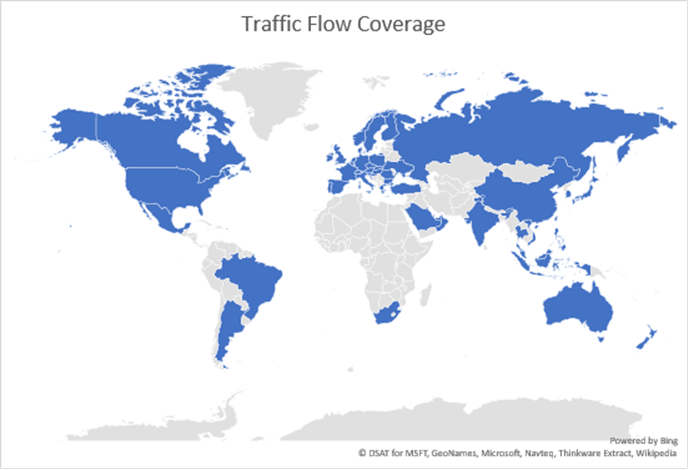

# Bing Maps Traffic Coverage
Bing Maps APIs provide traffic coverage for the following countries. Traffic incident text is provided in the primary language of the country where the incident occurs.  
  
 **Traffic Flow**: Traffic flow refers lines of color representing different levels of traffic congestion that display on a Bing map.  
  
 **Traffic Incidents**: Traffic incidents are reports of traffic issues, such as the report of an accident. Traffic incidents are provided by APIs such as the Bing Maps REST Services[Traffic API](http://msdn.microsoft.com/en-us/library/hh441725) and the Bing Maps V8 Web Control [Microsoft.Maps.Traffic API](../v8-web-control/traffic-module.md).  
  
   
  
   
  
|Country|Traffic Flow|Traffic Incidents|  
|-------------|------------------|-----------------------|  
|Andorra|x||  
|Argentina|x||  
|Austaralia|x|x|  
|Austria|x|x|  
|Bahrain|x||  
|Belgium|x|x|  
|Brazil|x|x|  
|Bulgaria|x||  
|Canada|x|x|  
|China|x||  
|Croatia|x|x|  
|Czech Republic|x|x|  
|Denmark|x|x|  
|Finland|x|x|  
|France|x|x|  
|Germany|x|x|  
|Greece|x|x|  
|Hungary|x|x|  
|India|x||  
|Indonesia|x||  
|Ireland|x|x|  
|Italy|x|x|  
|Japan|x||  
|Kuwait|x||  
|Luxembourg|x||  
|Malaysia|x||  
|Mexico|x|x|  
|Netherlands|x|x|  
|New Zealand|x|x|  
|Norway|x|x|  
|Oman|x||  
|Philippines|x||  
|Poland|x|x|  
|Portugal|x|x|  
|Puerto Rico|x|x|  
|Qatar|x||  
|Romania|x||  
|Russia|x|x|  
|Saudi Arabia|x||  
|Singapore|x||  
|Slovakia|x||  
|Slovenia|x|x|  
|South Africa|x|x|  
|South Korea|x||  
|Spain|x|x|  
|Sweden|x|x|  
|Switzerland|x|x|  
|Taiwan|x||  
|Thailand|x||  
|Turkey|x|x|  
|Ukraine|x||  
|United Arab Emirates|x||  
|United Kingdom|x|x|  
|United States|x|x|  
|Vietnam|x||