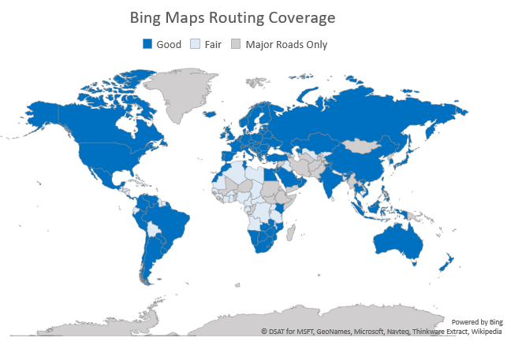
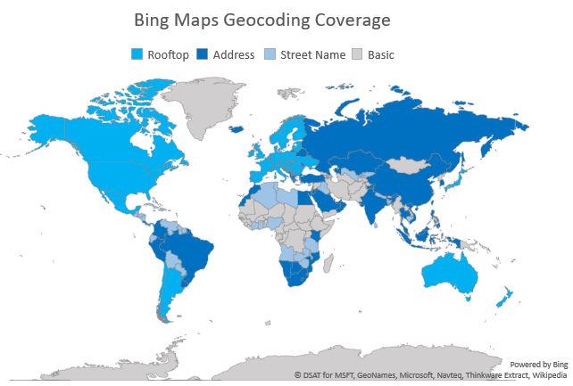

# Bing Maps Geographic Coverage

Bing Maps contains different levels of geographic coverage for every country/region in the world. The following tables contain details about base map data, routing (driving and walking), and geocoding support for each country/region. Also see [Bing Maps Transit Coverage](../coverage/bing-maps-transit-coverage.md) and [Bing Maps Traffic Coverage](../coverage/bing-maps-traffic-coverage.md).  
  
 A set of values are given for road data, geocoding precision and route support. The following list defines these values.  
  
 **Road Data / Routing (Driving and Walking)**  
  
-   **Good** - The country/region has detailed road data available in most populated centers and most of these have been verified for accuracy.  Coverage is updated frequently. Remote areas may lack some road information.  
  
-   **Fair** - At a minimum, the country/region has major road data available as well as some detailed road data. Most often, these roads have not been verified for accuracy. Coverage is updated over time. Please visit the map to assess if the current version meets the needs of your application.  
  
-   **Major Roads Only** - At a minimum, the country/region coverage includes major roads.  These roads have not been verified for accuracy. Coverage is updated over time. Please visit the map to assess if the current version meets the needs of your application.  
  

  
 **Geocoding Precision**  
  
> [!NOTE]
>  The ability to geocode in a country is dependent upon the road data coverage and the geocoding precision of the geocoding service. For example, a country/region may have 'Address' geocoding precision, but if there is 'Fair' road data coverage, you can only geocode addresses on the available streets and roads. Typically, geocoding precision also applies to reverse-geocoding.  
  
-   **Rooftop** – Most addresses are resolved to the latitude/longitude coordinate at the center of the address parcel (property boundary). Rooftop has the highest level of accuracy support. Its coverage varies by country.  
  
-   **Address** – Addresses are interpolated to a latitude/longitude coordinate on the street.  
  
-   **Street Name** – Addresses are resolved to the latitude/longitude coordinate of the street that contains the address. The address number is not processed.  
  
-   **Basic** - Geocoding support is limited and primarily only accurate to the city level. If an address is valid, Bing Maps attempts to resolve it, but a result is not guaranteed.  
  

  
> [!NOTE]
>  Countries that are not listed in the tables below have limited **Major Roads Only** Road Data coverage, **Basic** Geocoding Precision, and **Major Roads Only** Routing.  
  
## Africa and the Middle East  
  
|Country/Region|Road Data / Routing (Driving and Walking)|Geocoding Precision|  
|---------------------|--------------------------------------------------|-------------------------|  
|Afghanistan|Major Roads Only|Basic|  
|Algeria|Fair|Street Name|  
|Angola|Fair|Street Name|  
|Bahrain|Good|Address|  
|Benin|Major Roads Only|Basic|  
|Botswana|Good|Address|  
|Bouvet Island|Major Roads Only|Basic|  
|Burkina Faso|Fair|Basic|  
|Burundi|Fair|Street Name|  
|Cameroon|Fair|Basic|  
|Cape Verde|Major Roads Only|Basic|  
|Central African Republic|Fair|Basic|  
|Chad|Fair|Basic|  
|Comoros|Major Roads Only|Basic|  
|Congo|Fair|Basic|  
|Congo, The Democratic Republic of|Major Roads Only|Basic|  
|Côte d’Ivoire|Fair|Street Name|  
|Cyprus|Good|Street Name|  
|Djibouti|Major Roads Only|Basic|  
|Egypt|Good|Address|  
|Equatorial Guinea|Fair|Basic|  
|Eritrea|Major Roads Only|Basic|  
|Ethiopia|Major Roads Only|Basic|  
|French Southern and Antarctic Lands|Major Roads Only|Basic|  
|Gabon|Fair|Basic|  
|Gambia|Major Roads Only|Basic|  
|Ghana|Fair|Street Name|  
|Guinea|Fair|Basic|  
|Guinea-Bissau|Major Roads Only|Basic|  
|Iran|Major Roads Only|Basic|  
|Iraq|Fair|Street Name|  
|Israel|Good|Address|  
|Jordan|Good|Address|  
|Kenya|Good|Address|  
|Kuwait|Good|Address|  
|Lebanon|Good|Address|  
|Lesotho|Good|Address|  
|Liberia|Major Roads Only|Basic|  
|Libya|Fair|Street Name|  
|Madagascar|Major Roads Only|Basic|  
|Malawi|Fair|Street Name|  
|Mali|Major Roads Only|Basic|  
|Mauritania|Fair|Basic|  
|Mauritius|Fair|Basic|  
|Mayotte|Good|Address|  
|Morocco|Good|Address|  
|Mozambique|Good|Address|  
|Namibia|Good|Address|  
|Niger|Major Roads Only|Basic|  
|Nigeria|Fair|Street Name|  
|Oman|Good|Address|  
|Pakistan|Major Roads Only|Basic|  
|Qatar|Good|Address|  
|Réunion|Good|Address|  
|Rwanda|Fair|Street Name|  
|São Tomé and Príncipe|Fair|Basic|  
|Saudi Arabia|Good|Address|  
|Senegal|Fair|Basic|  
|Seychelles|Major Roads Only|Basic|  
|Sierra Leone|Major Roads Only|Basic|  
|Somalia|Major Roads Only|Basic|  
|South Africa|Good|Address|  
|St Helena, Ascension, Tristan da Cunha|Major Roads Only|Basic|  
|Sudan|Major Roads Only|Basic|  
|Swaziland|Good|Address|  
|Syria|Major Roads Only|Basic|  
|Tanzania|Fair|Street Name|  
|Togo|Fair|Basic|  
|Tunisia|Good|Street Name|  
|Turkey|Good|Address|  
|Uganda|Fair|Street Name|  
|United Arab Emirates|Good|Address|  
|Yemen|Major Roads Only|Basic|  
|Zambia|Good|Street Name|  
|Zimbabwe|Good|Street Name|  
  
## Asia  
  
|Country/Region|Road Data / Routing (Driving and Walking)|Geocoding Precision|  
|---------------------|--------------------------------------------------|-------------------------|  
|Armenia|Major Roads Only|Basic|  
|Azerbaijan|Fair|Street Name|  
|Bangladesh|Fair|Street Name|  
|Bhutan|Major Roads Only|Basic|  
|British Indian Ocean Territory|Major Roads Only|Basic|  
|Brunei|Good|Address|  
|Cambodia|Fair|Street Name|  
|China|Good|Address|  
|Georgia|Major Roads Only|Basic|  
|Hong Kong SAR|Good|Rooftop|  
|India|Good|Address|  
|Indonesia|Good|Address|  
|Japan|Good|Rooftop|  
|Kazakhstan|Good|Address|  
|Kyrgyzstan|Fair|Street Name|  
|Laos|Major Roads Only|Basic|  
|Macao SAR|Good|Address|  
|Malaysia|Good|Address|  
|Maldives|Fair|Street Name|  
|Mongolia|Major Roads Only|Basic|  
|Myanmar|Major Roads Only|Basic|  
|Nepal|Fair|Street Name|  
|North Korea|Major Roads Only|Basic|  
|Philippines|Good|Address|  
|Russia|Good|Address|  
|Singapore|Good|Address|  
|South Korea|Good|Address|  
|Sri Lanka|Fair|Street Name|  
|Taiwan|Good|Address|  
|Tajikistan|Major Roads Only|Basic|  
|Thailand|Good|Address|  
|Timor-Leste|Major Roads Only|Basic|  
|Turkmenistan|Major Roads Only|Basic|  
|Uzbekistan|Fair|Street Name|  
|Vietnam|Good|Address|  
  
## Australia/Pacific  
  
|Country/Region|Road Data / Routing (Driving and Walking)|Geocoding Precision|  
|---------------------|--------------------------------------------------|-------------------------|  
|American Samoa|Major Roads Only|Basic|  
|Australia|Good|Rooftop|  
|Christmas Island|Major Roads Only|Basic|  
|Cocos (Keeling) Islands|Major Roads Only|Basic|  
|Cook Islands|Major Roads Only|Basic|  
|Fiji|Fair|Street Name|  
|French Polynesia|Major Roads Only|Basic|  
|Guam|Fair|Basic|  
|Heard Island and McDonald Islands|Major Roads Only|Basic|  
|Kiribati|Major Roads Only|Basic|  
|Marshall Islands|Major Roads Only|Basic|  
|Micronesia|Major Roads Only|Basic|  
|Nauru|Major Roads Only|Basic|  
|New Caledonia|Major Roads Only|Basic|  
|New Zealand|Good|Rooftop|  
|Niue|Major Roads Only|Basic|  
|Norfolk Island|Fair|Address|  
|Northern Mariana Islands|Major Roads Only|Basic|  
|Palau|Major Roads Only|Basic|  
|Papua New Guinea|Major Roads Only|Basic|  
|Pitcairn Islands|Major Roads Only|Basic|  
|Samoa|Major Roads Only|Basic|  
|Solomon Islands|Major Roads Only|Basic|  
|Tokelau|Major Roads Only|Basic|  
|Tonga|Fair|Basic|  
|Tuvalu|Major Roads Only|Basic|  
|Vanuatu|Major Roads Only|Basic|  
|Wallis and Futuna Islands|Major Roads Only|Basic|  
  
## Europe  
  
|Country/Region|Road Data / Routing (Driving and Walking)|Geocoding Precision|  
|---------------------|--------------------------------------------------|-------------------------|  
|Åland Islands|Good|Address|  
|Albania|Good|Address|  
|Andorra|Good|Address|  
|Austria|Good|Rooftop|  
|Belarus|Good|Address|  
|Belgium|Good|Rooftop|  
|Bosnia and Herzegovina|Good|Rooftop|  
|Bulgaria|Good|Rooftop|  
|Croatia|Good|Rooftop|  
|Czech Republic|Good|Rooftop|  
|Denmark|Good|Rooftop|  
|Estonia|Good|Rooftop|  
|Faroe Islands|Major Roads Only|Basic|  
|Finland|Good|Rooftop|  
|France|Good|Rooftop|  
|Germany|Good|Rooftop|  
|Gibraltar|Good|Rooftop|  
|Greece|Good|Address|  
|Guernsey|Good|Address|  
|Hungary|Good|Rooftop|  
|Iceland|Good|Address|  
|Ireland|Good|Rooftop|  
|Isle of Man|Good|Address|  
|Italy|Good|Rooftop|  
|Jan Mayen|Major Roads Only|Basic|  
|Jersey|Good|Address|  
|Kosovo|Good|Address|  
|Latvia|Good|Rooftop|  
|Liechtenstein|Good|Rooftop|  
|Lithuania|Good|Rooftop|  
|Luxembourg|Good|Rooftop|  
|Macedonia, FYRO|Good|Rooftop|  
|Malta|Good|Rooftop|  
|Moldova|Good|Address|  
|Monaco|Good|Rooftop|  
|Montenegro|Good|Address|  
|Netherlands|Good|Rooftop|  
|Norway|Good|Rooftop|  
|Poland|Good|Rooftop|  
|Portugal|Good|Rooftop|  
|Romania|Good|Rooftop|  
|San Marino|Good|Address|  
|Serbia|Good|Rooftop|  
|Slovakia|Good|Rooftop|  
|Slovenia|Good|Rooftop|  
|Spain|Good|Rooftop|  
|Svalbard|Major Roads Only|Basic|  
|Sweden|Good|Rooftop|  
|Switzerland|Good|Rooftop|  
|Ukraine|Good|Rooftop|  
|United Kingdom|Good|Rooftop|  
|Vatican City|Good|Address|  
  
## North America/Central America/Caribbean  
  
|Country/Region|Road Data / Routing (Driving and Walking)|Geocoding Precision|  
|---------------------|--------------------------------------------------|-------------------------|  
|Anguilla|Major Roads Only|Basic|  
|Antigua and Barbuda|Major Roads Only|Basic|  
|Aruba|Fair|Street Name|  
|Bahamas|Good|Address|  
|Barbados|Fair|Street Name|  
|Belize|Fair|Street Name|  
|Bermuda|Fair|Street Name|  
|Bonaire|Major Roads Only|Basic|  
|Canada|Good|Rooftop|  
|Cayman Islands|Good|Address|  
|Costa Rica|Good|Address|  
|Cuba|Fair|Street Name|  
|Curaçao|Major Roads Only|Basic|  
|Dominica|Major Roads Only|Basic|  
|Dominican Republic|Fair|Street Name|  
|El Salvador|Fair|Street Name|  
|Greenland|Major Roads Only|Basic|  
|Grenada|Major Roads Only|Basic|  
|Guadeloupe|Good|Address|  
|Guatemala|Fair|Street Name|  
|Haiti|Major Roads Only|Basic|  
|Honduras|Fair|Street Name|  
|Jamaica|Fair|Street Name|  
|Martinique|Good|Address|  
|Mexico|Good|Rooftop|  
|Montserrat|Major Roads Only|Basic|  
|Nicaragua|Fair|Street Name|  
|Panama|Good|Rooftop|  
|Puerto Rico|Good|Rooftop|  
|Saba|Major Roads Only|Basic|  
|Saint Barthélemy|Good|Address|  
|Saint Kitts and Nevis|Fair|Street Name|  
|Saint Lucia|Major Roads Only|Basic|  
|Saint Martin|Major Roads Only|Basic|  
|Saint Pierre and Miquelon|Major Roads Only|Basic|  
|Saint Vincent and the Grenadines|Fair|Street Name|  
|Sint Eustatius|Major Roads Only|Basic|  
|Sint Eustatius|Major Roads Only|Basic|  
|Sint Maarten|Major Roads Only|Basic|  
|Trinidad and Tobago|Fair|Street Name|  
|Turks and Caicos Islands|Major Roads Only|Basic|  
|United States|Good|Rooftop|  
|Virgin Islands, British|Major Roads Only|Basic|  
|Virgin Islands, U.S.|Good|Address|  
  
## South America  
  
|Country/Region|Road Data / Routing (Driving and Walking)|Geocoding Precision|  
|---------------------|--------------------------------------------------|-------------------------|  
|Argentina|Good|Rooftop|  
|Bolivia|Fair|Street Name|  
|Brazil|Good|Address|  
|Chile|Good|Rooftop|  
|Colombia|Good|Address|  
|Ecuador|Fair|Street Name|  
|Falkland Islands|Good|Street Name|  
|French Guiana|Good|Address|  
|Guyana|Fair|Street Name|  
|Paraguay|Good|Street Name|  
|Peru|Good|Address|  
|South Georgia and South Sandwich Islands|Major Roads Only|Basic|  
|Suriname|Fair|Street Name|  
|Uruguay|Good|Address|  
|Venezuela|Good|Street Name|  
  
## Antarctica  
  
|Country/Region|Road Data / Routing (Driving and Walking)|Geocoding Precision|  
|---------------------|--------------------------------------------------|-------------------------|  
|Antarctica|Major Roads Only|Basic|
