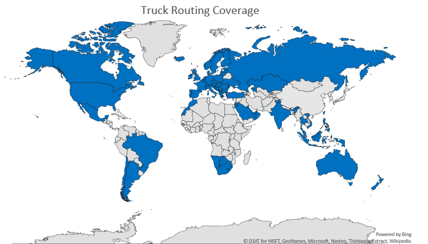

# Truck Routing Coverage
The Bing Maps Truck Routing API provides travel routes which take truck attributes such as size, weight and type of cargo. This is important as not all trucks can travel the same routes as other vehicles. Here are some examples:

* Bridges have heights and weight limits.
* Tunnels often have restrictions on flammable or hazardous materials.
* Longer trucks have difficulty making tight turns.
* Highways often have a separate speed limit for trucks.
* Certain trucks may want to avoid roads that have steep gradients.

Bing Maps supports truck routing in the following countries.

> [!NOTE]
> Not all truck restrictions may be supported or apply to all countries.

| Country/Region         | Truck Routing Coverage     |
|------------------------|----------------------------|
| Albania                | x                          |
| Andorra                | x                          |
| Argentina              | x                          |
| Australia              | x                          |
| Austria                | x                          |
| Bahrain                | x                          |
| Belgium                | x                          |
| Bosnia and Herzegovina | x                          |
| Botswana               | x                          |
| Brazil                 | x                          |
| Brunei                 | x                          |
| Bulgaria               | x                          |
| Canada                 | x                          |
| Chile                  | x                          |
| Croatia                | x                          |
| Czech Republic         | x                          |
| Denmark                | x                          |
| Estonia                | x                          |
| Finland                | x                          |
| France                 | x                          |
| Germany                | x                          |
| Gibraltar              | x                          |
| Greece                 | x                          |
| Hungary                | x                          |
| Iceland                | x                          |
| India                  | x                          |
| Indonesia              | x                          |
| Ireland                | x                          |
| Isle of Man            | x                          |
| Israel                 | x                          |
| Italy                  | x                          |
| Jordan                 | x                          |
| Kazakhstan             | x                          |
| Kosovo                 | x                          |
| Kuwait                 | x                          |
| Latvia                 | x                          |
| Lesotho                | x                          |
| Liechtenstein          | x                          |
| Lithuania              | x                          |
| Luxembourg             | x                          |
| Macedonia, FYRO        | x                          |
| Malaysia               | x                          |
| Malta                  | x                          |
| Mexico                 | x                          |
| Moldova                | x                          |
| Monaco                 | x                          |
| Montenegro             | x                          |
| Morocco                | x                          |
| Namibia                | x                          |
| Netherlands            | x                          |
| New Zealand            | x                          |
| Norway                 | x                          |
| Oman                   | x                          |
| Philippines            | x                          |
| Poland                 | x                          |
| Portugal               | x                          |
| Qatar                  | x                          |
| Réunion                | x                          |
| Romania                | x                          |
| Russia                 | x                          |
| San Marino             | x                          |
| Saudi Arabia           | x                          |
| Serbia                 | x                          |
| Singapore              | x                          |
| Slovakia               | x                          |
| Slovenia               | x                          |
| South Africa           | x                          |
| Spain                  | x                          |
| Swaziland              | x                          |
| Sweden                 | x                          |
| Switzerland            | x                          |
| Taiwan                 | x                          |
| Thailand               | x                          |
| Turkey                 | x                          |
| Ukraine                | x                          |
| United Arab Emirates   | x                          |
| United Kingdom         | x                          |
| United States          | x                          |
| Vatican City           | x                          |
| Vietnam                | x                          |
