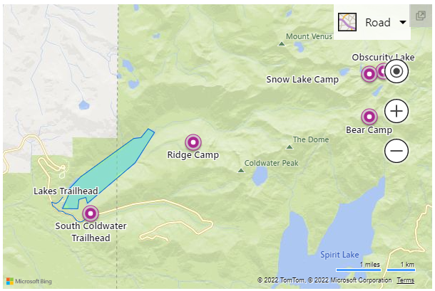

# Migrating Google Maps to Bing Maps

This article provides the information you need to migrate an application built using the Google Maps V3 JavaScript API to a Bing Maps application, built using the Bing Maps V8 web control API. This includes a suggested migration plan, useful tools and support, migration code examples, API class mapping along with other tips to help ensure a successful migration.

**Why Migrate?**

If you are still evaluating Bing Maps to determine if you should migrate, you may find the following information helpful:

- [Why Bing Maps?](why-bing-maps.md)
- [Key features in Bing Maps](key-features-in-bing-maps.md)

## Migration Plan

This section provides you with a suggested migration plan to help you plan your migration. The following steps are intended as a starting point that you can use to plan the migration of your Google Maps V3 JavaScript application to Bing Maps V8. Your final plan will need to take into account the specifics of your application.

1. Create a Bing Maps account at the [Bing Maps Dev Center](https://www.bingmapsportal.com/).
   You can find more information about creating a Bing Maps account in the [Microsoft
   Docs](https://docs.microsoft.com/bingmaps/getting-started/bing-maps-dev-center-help/creating-a-bing-maps-account).

1. Create a Bing Maps key.

    a.  We invite you to use the "basic" key type and free use terms
        outlined in the [Bing Maps Terms of Use] (https://www.microsoft.com/maps/product)
        (TOU) as you migrate to Bing Maps. Production applications outside the free
        use thresholds in the TOU will need a Bing Maps Enterprise
        account. For assistance with Bing Maps licensing, please contact
        <maplic@microsoft.com> (North/South America) or
        <mapemea@microsoft.com> (rest of world).

    b.  Enterprise customers are advised to use keys of type "basic" for
        all pre‐production application testing.

    c.  See Microsoft Docs for more information on [Getting a Bing Maps
        key](https://docs.microsoft.com/bingmaps/getting-started/bing-maps-dev-center-help/getting-a-bing-maps-key).

1. Download any location data that you have hosted in Google Fusion tables. For more information, see [Download location data hosted in Google Fusion tables](hosted-data.md).

1. Reformat location data to match the required schema for the Bing [Spatial Data Services](https://docs.microsoft.com/bingmaps/spatial-data-services/) API.
   See [Load Data Source Data Schema](https://docs.microsoft.com/bingmaps/spatial-data-services/data-source-management-api/load-data-source-dataflow/load-data-source-data-schema-and-sample-input) for documentation outlining the required schema.

> [!Tip]
> The Bing Spatial Data Services supports uploading [Keyhole Markup Language](https://en.wikipedia.org/wiki/Keyhole_Markup_Language) (KML) files.

1. Migrate your spatial search queries to the Bing [Spatial Data Services
   queries](https://docs.microsoft.com/bingmaps/spatial-data-services/query-api/).

1. Migrate your application code to use the Bing Maps web control.

1. Test your migrated application.

1. For *Bing Maps Enterprise customer applications*, you will need to Update the Bing
   Maps type key in the [Bing Maps Dev Center](https://www.bingmapsportal.com/)
   to "Enterprise" when ready to deploy to production.

1. Deploy your application to your production environment.

### Next Steps

The remaining sections of this Migration Guide provide links to [Useful Tools & Support](#useful-tools--support), [migration code examples](#migration-code-examples), [Google Maps to Bing Maps class mapping](#google-maps-to-bing-maps-class-mapping) tables as well as some [Additional Bing Maps Tips](#additional-bing-maps-tips) that will introduce you to the basics of how to leverage the most commonly used Google Maps functionality using the Bing Maps web control.

## Useful Tools & Support

Here are some great tools that can be used to make your migration to
Bing Maps easy.

### Migration Support

#### Technical support

If you are a licensed Bing Maps Enterprise Customer, you can contact the
Bing Maps Enterprise support team for assistance with any technical
issue you have. They are available by email during EU and NA business
hours. You can find contact details for the support team at
[Bing Maps support](https://www.microsoft.com/maps/support).

#### Developer Forums

The Bing Maps developer forums is also a good place to find migration assistance,
especially if you are not an Enterprise customer with access to the Enterprise
Support team. The Bing Maps developer forums are regularly monitored by community
developers and by members of the Bing Maps team. You can find and ask questions
in [Microsoft Q&A](https://docs.microsoft.com/answers/products/).

#### Licensing Queries

If you have licensing-related questions you should take them to your
Bing Maps account manager if you know who they are. If not, you can send
queries to the Bing Maps licensing team, and they will assist. For
queries inside of North or South America, you can contact them at
<maplic@microsoft.com>, for queries in the rest of the world you can
contact them at <mapemea@microsoft.com>.

### Bing Maps Blog

The [Bing Maps blog](https://blogs.bing.com/maps) is where the Bing Maps team
announces any new features about Bing Maps. In addition, regular technical
posts showing how to do new and interesting things with the Bing Maps
controls are made available.

You can also keep up to date with new features that have been added to
the Bing Maps control at the [V8 Web Controls developer resources](https://docs.microsoft.com/bingmaps/v8-web-control/developer-resources) page. Note that this is only for the Bing Maps control,
and not all Bing Maps services and API's.

### Technical Resources

Here is a list of useful technical resources for the Bing Maps web control:

- [Bing Maps Interactive SDK](https://www.bing.com/api/maps/sdk/mapcontrol/isdk)
- [Bing Maps Code Samples](https://samples.bingmapsportal.com/)
- [Bing Maps web control documentation](https://docs.microsoft.com/bingmaps/v8-web-control/)
- [Bing Maps TypeScript Definitions](https://github.com/Microsoft/Bing-Maps-V8-TypeScript-Definitions)
- [Bing Maps documentation](https://docs.microsoft.com/bingmaps/) (All Bing Maps APIs)
- [Microsoft Q&A](https://docs.microsoft.com/answers/products/)
- [Bing Maps Dev Center](https://www.bingmapsportal.com/)
- [Bing Maps REST Services](https://docs.microsoft.com/bingmaps/rest-services/)
- [Bing Spatial Data Services](https://docs.microsoft.com/bingmaps/spatial-data-services/query-api/)
- [Bing Maps Terms of Use](https://www.microsoft.com/maps/product)

## Migration Code Examples

This section provides descriptions and examples of how to migrate your
applications using the Google Maps V3 control to the Bing Maps V8 web
control. Before going into detail about any single migration scenario,
it is worth looking at some basic examples that demonstrate Bing Maps
equivalents for the most commonly used Google Maps functionality.

This section of the migration guide shows Bing Maps equivalents for the
following Google Maps functions.

> [!NOTE]
>
> JavaScript code samples are provided throughout this guide; in most cases, these are comparative samples that highlight the differences between Google Maps code samples and their Bing Maps counterparts. If you prefer developing with TypeScript, see [Bing Maps V8 TypeScript Definitions](https://github.com/Microsoft/Bing-Maps-V8-TypeScript-Definitions) in GitHub.

### Authenticating the Map

To use Bing Maps in your own application you will need a Bing Maps key.
All Bing Maps map controls and services use a Bing Maps key for
authentication. You can get a Bing Maps key in two ways:

- Create a Bing Maps account and key through the Bing Maps Dev Center.
    This is recommended if you are a Microsoft Volume license customer.
- If you are an Azure user, create a Bing Maps key through [Azure
    Maps](https://azure.microsoft.com/services/azure-maps/)
    (available late 2022).

To find out more about licensing options and learn about Bing Maps
control, please visit [Bing Maps Platform](http://www.microsoft.com/maps).

When it comes to authentication, the main difference between Google and
Bing Maps is that Google Maps uses a Google Maps key in the map script
URL for authentication, while Bing Maps requires a Bing Maps key in the
map loading code.

**Before: Google Maps**

Google Maps API uses an API key for authentication. This API key must be
specified in the URL to Google Maps map control as shown below.

```javascript
<script async src="https://maps.googleapis.com/maps/api/js?key=yourBingMapsKey&callback=initMap">
</script>
```

**After: Bing Maps**

The Bing Maps control requires specifying authentication credentials
when creating a new instance of the map control in JavaScript rather
than specifying it in the map control URL reference. You can load the
map control by adding a script reference to the API:

```javascript
//Async script executes immediately and must be after any DOM elements used in callback.

<script async src="https://www.bing.com/api/maps/mapcontrol?key=yourBingMapsKey&callback=initMap">
</script>
```

See the [Getting Started documentation](https://docs.microsoft.com/bingmaps/v8-web-control/creating-and-hosting-map-controls/) for additional options around loading the Bing Maps map control.

### Loading the Map

Both Google Maps and Bing Maps allow you to add a dynamic map to your
page, which can be manipulated and interacted with by a user. Loading a
map in both API's follows the same set of steps:

- Add a JavaScript reference to the Map API.
- Add a div tag to the body of the page which will act as a placeholder for the map.
- Create a JavaScript function that gets called when the page has loaded.
- Create an instance of the respective map class.

The examples below show how to load a basic map such that it is centered
over New York at coordinates (40.747, -73.985) and is at zoom level 12.

**Before: Google Maps**

The following code is an example of how to display a Google Map centered
and zoomed over a location.

```html
<!DOCTYPE html>
<html>
<head>
    <title></title>
    <script>
        var map;
        function initMap() {
            map = new google.maps.Map(document.getElementById('myMap'), {
            center: new google.maps.LatLng(40.747, -73.985),
            zoom: 12
            });
        }
    </script>
</head>
<body>
    <div id="myMap"
    style="position:relative;width:600px;height:400px;"></div>
    <!-- Google Maps Script Reference  -->
    <script async
    src="https://maps.googleapis.com/maps/api/js?callback=initMap&key=yourBingMapsKey">
    </script>
</body>
</html>
```

Running this code in a browser will display a map that looks like the
following image:


**After: Bing Maps**

Bing Maps is very similar. In order to get the map to load the only
additional step is to make sure you specify your Bing Maps key.

```html
<!DOCTYPE html>
<html>
<head>
    <title></title>
    <script>
        var map;
            function initMap() {
            map = new Microsoft.Maps.Map('#myMap', {
                center: new Microsoft.Maps.Location(40.747, -73.985),
                zoom: 12
            });
        }
    </script>
</head>
<body>
    <div id="myMap" style="position:relative;width:600px;height:400px;"></div>
    <!-- Bing Maps Script Reference -->
    <script async src="https://www.bing.com/api/maps/mapcontrol?callback=initMap&key=yourBingMapsKey"></script>
</body>
</html>
```

Running this code in a browser will display a map that looks like the
following image:


> [!TIP]
> When loading the map, the reference to the map div can be
either a DOM element such as document.getElementById('myMap') or a CSS
selector such as #myMap.

> [!NOTE]
> Unlike Google Maps, Bing Maps does not require an initial
center and zoom level to be specified when loading the map. If this
information isn't provided when loading the map, the map will try and
determine which location the user is in and will center and zoom the map
there.

### Localizing the Map

If your audience is spread across multiple countries or speaks different
languages, localization is important.

**Before: Google Maps**

To get a localized map using the Google Maps API, add a language
parameter in the initialization <script\> tag.

```html
<script async src="https://maps.googleapis.com/maps/api/js?callback=initMap&key=yourBingMapsKey&language=your_language_code&region=your_region_code">
</script>
```

Here is an example of Google Maps with the language set to "fr" and the region set to "FR".


**After: Bing Maps**

The Bing Maps web control does not require manually setting the language
and region/locale parameters. By default, the map will automatically
attempt to set the language of the map based on the user's browser
settings and/or location.

That said, it is possible to override the detected settings if desired.
This is useful if you want to test your application using different
settings. Bing Maps has three URL parameters that can be used to
localize the map.

| URL Parameter| Description                                           |
|--------------|-------------------------------------------------------|
| setLang      | Specifies the language to use for the map labels and navigation controls. Example: *en* |
| setMkt       | This is a market parameter that provides insights into the user's location. This is used to determine which features are available on the map in this area. For example, if the user is in an area where streetside imagery isn't available, the map won't list it as an option in the navigation bar. If the locale parameter is set to "en-US", an area where streetside imagery is available, this option will appear.|
| UR           | A user region string that contains an ISO 3166-1 alpha-2 country region code. The user region value is used to ensure that disputed borders and location names align with the views of the specified user region. <br/><br/> For a list of values, see the Region Localities section in the [Geospatial Endpoint Service](https://docs.microsoft.com/bingmaps/articles/geospatial-endpoint-service) article. <br/><br/> Due to the sensitivity of this feature, it is recommended to only use this when testing and to let the map automatically set this value in your production application.|

These parameters can be specified in the map script URL as shown below.

```html
<script async src="https://www.bing.com/api/maps/mapcontrol?callback=initMap&key=yourBingMapsKey&setLang=your_language_code&setMkt=your_locale_code">
</script>
```

Here is an example of Bing Maps with the language parameter set to "fr"
and the locale parameter set to "fr-FR".


A list of support culture parameters is documented in the
[Supported Languages](/bingmaps/v8-web-control/creating-and-hosting-map-controls/setting-map-control-parameters#supported-languages) table in the Setting Map Control Parameters article.

### Setting the Map View

Dynamic maps in both Bing Maps and Google Maps can be programmatically
moved to new geographic locations by calling the appropriate functions
in JavaScript. The examples below show how to make the map display
satellite aerial imagery, center the map over a location with
coordinates (35.0272, -111.0225) and change the zoom level to 15.

**Before: Google Maps**

The Google Maps map control can be programmatically moved using the
setOptions() method which allows you to specify the center of the map
and a zoom level.

```javascript
<script>
    var map;
    function initMap() {
        map = new google.maps.Map(document.getElementById('myMap'), {
            center: new google.maps.LatLng(0, 0),
            zoom: 2
        });
        
        // Change the map type, center and zoom.
        map.setOptions({
            mapTypeId: google.maps.MapTypeId.SATELLITE,
            center: new google.maps.LatLng(35.0272, -111.0225),
            zoom: 15
        });
    }
</script>
```

**After: Bing Maps**

In Bing Map, you can use the setView() method to accomplish the same
behavior as the Google Maps example. The setView() method takes in a set
of view options which are used to define how the map should be
displayed.

```javascript
<script>
    var map;
    function initMap() {
        map = new Microsoft.Maps.Map('#myMap', {
        center: new Microsoft.Maps.Location(0, 0),
        zoom: 2
        });
        // Change the map type, center and zoom.
        map.setView({
            mapTypeId: Microsoft.Maps.MapTypeId.aerial,
            center: new Microsoft.Maps.Location(35.0272, -111.0225),
            zoom: 15
        });
    }
</script>
```

Running this code in a browser will display a map that looks like the
following image: [[Try it now](https://www.bing.com/api/maps/sdk/mapcontrol/isdk#setMapViewOptions+JS)]


Bing Maps also provides a setOptions function which allows you to modify
how the map functions. For example, you can disable panning or hide the
navigation bar using these options.

**Additional Resources:**

- [Map Class](https://docs.microsoft.com/bingmaps/v8-web-control/map-control-api/map-class)
- [View Options](https://docs.microsoft.com/bingmaps/v8-web-control/map-control-api/viewoptions-object)
- [Map Options](https://docs.microsoft.com/bingmaps/v8-web-control/map-control-api/mapoptions-object)

### Adding a Pushpin (Marker)

Both Bing and Google Maps allow you to add one or more pushpins
to the map. Pushpins are used to mark specific locations on a map. The
following examples create a pushpin in the center of the map and sets
the pushpin options such that the pushpin is draggable.

**Before: Google Maps**

Markers identify points on the map. The google.maps.Marker constructor
takes a set of options.

```javascript
<script>
    var map;
    function initMap() {
        map = new google.maps.Map(document.getElementById('myMap'), {
            center: new google.maps.LatLng(0, 0),
            zoom: 2
        });

        // Get the center of the map.
        Var center = map.getCenter();

        // Create a marker and make it draggable.
        Var marker = new google.maps.Marker({
            position: center,
            draggable: true
        });

        // Add the marker to the map.
        Marker.setMap(map);
    }
</script>
```


**After: Bing Maps**

In Bing Maps, Markers are known as Pushpins. Pushpins in Bing Maps have
a lot of the same options as Google Maps and are added to the map in a
very similar way.

```javascript
<script>
    var map;
    function initMap() {
        map = new Microsoft.Maps.Map('#myMap', {
            center: new Microsoft.Maps.Location(0, 0),
            zoom: 2
        });
    
        // Get the center of the map.
        Var center = map.getCenter();
        
        // Create a pushpin and make it draggable.
        Var pin = new Microsoft.Maps.Pushpin(center, {
            draggable: true
        });
        
        // Add the pushpin to the map
        map.entities.push(pin);
    }
</script>
```


\[[Try it now](https://www.bing.com/api/maps/sdk/mapcontrol/isdk#addDefaultPushpin+JS)\]

**Additional Resources:**

- [Pushpin Class](https://docs.microsoft.com/bingmaps/v8-web-control/map-control-api/pushpin-class)
- [Pushpin Options](https://docs.microsoft.com/bingmaps/v8-web-control/map-control-api/pushpinoptions-object)
- [Pushpin examples](https://docs.microsoft.com/bingmaps/v8-web-control/map-control-concepts/pushpins/#examples)
- [Additional Pushpin examples](https://samples.bingmapsportal.com/?search=Pushpins)

### Creating a custom Pushpin

The default pushpin in Bing Maps looks great, but often there are
scenarios where a custom pushpin is needed. The following examples
create a custom pushpin using a URL to an image and add "1" as text on
top of the pushpin.

**Before: Google Maps**

In Google Maps, a custom pushpin is created by specifying an Icon object
the contains the url to the image, an anchor point for which part of the
image to bind to the coordinate on the map, and a labelOrigin which
specifies where on the image to place the text label.

```javascript
<script>
    var map;
    function initMap() {
        map = new google.maps.Map(document.getElementById('myMap'), {
            center: new google.maps.LatLng(47.615, -122.194),
            zoom: 15
        });
        var pushpin = new google.maps.Marker({
            position: map.getCenter(),

            // Specify a text label to the marker
            label: '1',
            
            // Specify a custom icon
            icon: {
            
            // Specify the URL to the custom icon image
            url: 'https://www.bingmapsportal.com/Content/images/poi_custom.png,
            
            // The anchor for this image is the tip of the point at (12, 39).
            anchor: new google.maps.Point(12, 39),
            
            // Where the label should be positioned over top of the image.
            labelOrigin: new google.maps.Point(12, 13)
        }
        });
    
        // Add marker to map
        pushpin.setMap(map);
    }
</script>
```

Running this code in a browser will display a map that looks like the
following image:


**After: Bing Maps**

In Bing Maps a custom pushpin is created by specifying a URL to an image
as the icon property, an anchor point is specified for which part of the
image to bind to the coordinate on the map, and a textOffset value is
used to specify where on the image to place the text label. There are
two key differences between Google's labelOrigin and Bing's textOffset:

- In Google Maps labelOrigin horizontal position (x) is relative to
    the left edge of the image. While in Bing Maps, the textOffset is
    relative to the center of the image.
- In Google Maps labelOrigin vertical position (y) is relative to the
    bottom of the text. While in Bing Maps, the textOffset is relative
    to the top of the text.

```javascript
<script>
    var map;
    function initMap() {
        map = new Microsoft.Maps.Map('#myMap', {
            center: new Microsoft.Maps.Location(47.615, -122.194),
            zoom: 15
        });

        var pushpin = new Microsoft.Maps.Pushpin(map.getCenter(), {
        
            // Specify a text label for the pushpin
            text: '1',
            
            // Specify the URL to the custom icon image
            icon: 'https://www.bingmapsportal.com/Content/images/poi_custom.png',
            
            // Set the anchor point of the custom image.
            anchor: new Microsoft.Maps.Point(12, 39),
            
            // Where the label should be positioned over top of the image.
            textOffset: new Microsoft.Maps.Point(0, 5)
        });
        
        // Add pushpin to map
        map.entities.push(pushpin);
    }
</script>
```

Running this code in a browser will display a map that looks like the
following image:


\[[Try it now](https://www.bing.com/api/maps/sdk/mapcontrol/isdk#createPushpinFromImage+JS)\]

Bing Maps provides several ways to create custom pushpins. Here are some
of the ways that customer pushpins can be created. The simplest is the
ability to change the color of the default pushpin using the color
pushpin option. Here is a list of some other ways to create custom
pushpins in Bing Maps with links to code examples.

- [Change the color of the default
     pushpin](https://docs.microsoft.com/bingmaps/v8-web-control/map-control-concepts/pushpins/changing-the-color-of-the-default-pushpin)

- [Use a URL to an SVG
    image](https://docs.microsoft.com/bingmaps/v8-web-control/map-control-concepts/pushpins/custom-svg-file-pushpin-example)

- [Use an inline SVG
    image](https://docs.microsoft.com/bingmaps/v8-web-control/map-control-concepts/pushpins/custom-inline-svg-pushpin-example)

- [Create a Font based
    pushpin](https://docs.microsoft.com/bingmaps/v8-web-control/map-control-concepts/pushpins/font-based-pushpins)

- [Create a custom overlay for HTML
    pushpins](https://docs.microsoft.com/bingmaps/v8-web-control/map-control-concepts/custom-overlays/html-pushpin-overlay)

- [Use a custom overlay to draw tens of thousands of data
    points](https://docs.microsoft.com/bingmaps/v8-web-control/map-control-concepts/custom-overlays/dynamic-canvas-overlay)

**Additional Resources:**

- [Pushpin
    Class](https://docs.microsoft.com/bingmaps/v8-web-control/map-control-api/pushpin-class)

- [Pushpin
    Options](https://docs.microsoft.com/bingmaps/v8-web-control/map-control-api/pushpinoptions-object)

- [Pushpin
    examples](https://docs.microsoft.com/bingmaps/v8-web-control/map-control-concepts/pushpins/#examples)

- [Additional Pushpin
    examples](https://samples.bingmapsportal.com/?search=Pushpins)

### Create a Polyline

Polylines are used to represent a line or path on the map. The following
examples show how to create a dashed polyline on the map.

**Before: Google Maps**

In Google Maps, the Polyline class takes in a set of options. An array
of coordinates is passed in the path option of the polyline.

```javascript
<script>
    var map;
    function initMap() {
        map = new google.maps.Map(document.getElementById('myMap'), {
            center: new google.maps.LatLng(40.747, -73.985),
            zoom: 8
        });
        
        var center = map.getCenter();
        
        // Create array of locations.
        var linePath = [
            center,
            new google.maps.LatLng(center.lat() - 0.5, center.lng() - 1),
            new google.maps.LatLng(center.lat() - 0.5, center.lng() + 1)
        ];
        
        // Define a symbol using SVG path notation, with an opacity of 1.
        var lineSymbol = {
            path: M 0,-1 0,1,
            strokeOpacity: 1,
            scale: 4
        };
        
        // Create the polyline.
        var line = new google.maps.Polyline({
            path: linePath,
            strokeColor: red,
            strokeOpacity: 0,
            strokeWeight: 4,
            icons: [{
                icon: lineSymbol,
                offset: 0,
                repeat: 20px
            }]
        });
        
        // Add the polyline to the map.
        line.setMap(map);
    }
</script>
```

Running this code in a browser will display a map that looks like the
following image:


**After: Bing Maps**

Bing Maps also supports polylines. One key difference is that the
Polyline class in Bing Maps accepts two parameters, the first is an
array of coordinates that define the path of the polyline, the second is
a set of options that define how to render the polyline. Another key
difference is that creating dashed lines is much easier.

```javascript
<script>
    var map;
    function initMap() {
        map = new Microsoft.Maps.Map('#myMap', {
            center: new Microsoft.Maps.Location(40.747, -73.985),
            zoom: 8
        });
        
        var center = map.getCenter();
        
        // Create array of locations.
        var linePath = \[
            center,
            new Microsoft.Maps.Location(center.latitude-0.5, center.longitude-1),
            new Microsoft.Maps.Location(center.latitude-0.5, center.longitude+1)
        \];
        
        // Create a polyline
        var line = new Microsoft.Maps.Polyline(linePath, {
            strokeColor: red,
            strokeDashArray: \[4, 4\],
            strokeThickness: 4
        });
        
        // Add the polyline to map
        map.entities.push(line);
    }
</script>
```

Running this code in a browser will display a map that looks like the
following image:


\[[Try it now](https://www.bing.com/api/maps/sdk/mapcontrol/isdk#addStyledPolyline+JS)\]

**Additional Resources:**

- [Polyline
    Class](https://docs.microsoft.com/bingmaps/v8-web-control/map-control-api/polyline-class)

- [Polyline
    Options](https://docs.microsoft.com/bingmaps/v8-web-control/map-control-api/polylineoptions-object)

- [Polyline
    Examples](https://docs.microsoft.com/bingmaps/v8-web-control/map-control-concepts/map-shapes-polylines-and-polygons/#examples)

- [Colors in Bing
    Maps](https://docs.microsoft.com/bingmaps/v8-web-control/map-control-concepts/colors)

### Create a Polygon

Polygons are used to represent an area on the map. Bing Maps and Google
Maps provide very similar support for polygons. The following examples
show how to create a polygon that forms a triangle based on the center
coordinate of the map.

**Before: Google Maps**

In Google Maps, the Polygon class takes in a set of options. An array of
coordinates is passed in the paths option of the polygon.

```javascript
<script>
    var map;
    function initMap() {
        map = new google.maps.Map(document.getElementById('myMap'), {
            center: new google.maps.LatLng(40.747, -73.985),
            zoom: 8
        });
        var center = map.getCenter();
        
        // Create array of locations to form a ring.
        var exteriorRing = \[
            center,
            new google.maps.LatLng(center.lat() - 0.5, center.lng() - 1),
            new google.maps.LatLng(center.lat() - 0.5, center.lng() + 1),
            center
        \];
        
        // Create a polygon.
        var polygon = new google.maps.Polygon({
            paths: exteriorRing,
            strokeColor: red,
            strokeWeight: 2,
            fillColor: rgba(0, 255, 0, 0.5)
        });
        
        // Add the polygon to the map
        polygon.setMap(map);
    }
</script>
```

Running this code in a browser will display a map that looks like the following image:


**After: Bing Maps**

Bing Maps also supports polygons. One key difference is that the Polygon
class in Bing Maps accepts two parameters, the first is an array of
coordinates that define the shape of the polygon, the second is a set of
options that define how to render the polygon.

```javascript
<script>
var map;
    function initMap() {
        map = new Microsoft.Maps.Map('#myMap', {
            center: new Microsoft.Maps.Location(40.747, -73.985),
            zoom: 8
        });
        
        var center = map.getCenter();
        
        // Create array of locations to form a ring.
        var exteriorRing = [
            center,
            new Microsoft.Maps.Location(center.latitude-0.5, center.longitude-1),
            new Microsoft.Maps.Location(center.latitude-0.5, center.longitude+1),
            center
        ];
        
        // Create a polygon
        var polygon = new Microsoft.Maps.Polygon(exteriorRing, {
            fillColor: 'rgba(0, 255, 0, 0.5)',
            strokeColor: 'red',
            strokeThickness: 2
        });
        
        // Add the polygon to map
        map.entities.push(polygon);
    }
</script>
```

Running this code in a browser will display a map that looks like the following image:


\[[Try it now](https://www.bing.com/api/maps/sdk/mapcontrol/isdk#addStyledPolygon+JS)\]

**Additional Resources:**

- [Polygon
    Class](https://docs.microsoft.com/bingmaps/v8-web-control/map-control-api/polygon-class)

- [Polygon
    Options](https://docs.microsoft.com/bingmaps/v8-web-control/map-control-api/polygonoptions-object)

- [Polygon
    Examples](https://docs.microsoft.com/bingmaps/v8-web-control/map-control-concepts/map-shapes-polylines-and-polygons/#examples)

- [Colors in Bing
    Maps](https://docs.microsoft.com/bingmaps/v8-web-control/map-control-concepts/colors)

### Geocoding an Address

Geocoding is the process of determining a specific latitude and
longitude for a street address or other geographic feature. The
following examples highlight the differences in geocoding syntax between
the Google Maps control and the Bing Maps control.

**Before: Google Maps**

In Google maps there is a class called google.maps.Geocoder which can be
used to make Geocoding requests. Here is an example of a basic
implementation used to geocode an address in Google maps:

```javascript
<script>
    var map;
    function initMap() {
        map = new google.maps.Map(document.getElementById('myMap'), {
            center: new google.maps.LatLng(40.714224, -73.961452),
            zoom: 8
        });

        var geocoder = new google.maps.Geocoder();

        geocoder.geocode(
            { 'address': '1 Microsoft Way, Redmond, WA' },
            GeocodeCallback);
        }
        function GeocodeCallback(result) {
        
        // Do something with the result
        alert(result[0].geometry.location)
    }
</script>
```

**After: Bing Maps**

When using Bing Maps, geocoding can be accomplished by using the Search
module. Bing Maps uses modules to allow you to delay the loading of
functionalities that are not needed when the application loads. This
means your users will only download the functionality that they need.
This will result in improved performance and allow you to delay the
loading of this functionality until the user decides they want to
geocode an address. You can load the search module using the following
code.

Microsoft.Maps.loadModule(Microsoft.Maps.Search,
searchModuleLoaded);

Once the module is loaded you can use the SearchManager class in this
module to perform your geocode request. Here is an example of a basic
implementation used to geocode an address in Bing maps:

```javascript
<script>
    var map;
    function initMap() {
        map = new Microsoft.Maps.Map('#myMap');
        
        // Load the search module.
        Microsoft.Maps.loadModule('Microsoft.Maps.Search', function () {
            var searchManager = new Microsoft.Maps.Search.SearchManager(map);
            searchManager.geocode({
                where: '1 Microsoft Way, Redmond, WA',
                callback: GeocodeCallback
            });
        });
    }

    function GeocodeCallback(result, userData) {
        // Do something with the result
        alert(result.results[0].location);
    }
</script>
```

\[[Try it now](https://www.bing.com/api/maps/sdk/mapcontrol/isdk#searchByAddress+JS)\]

**Additional Resources:**

- [Search
    Module](https://docs.microsoft.com/bingmaps/v8-web-control/modules/search-module/)

- [SearchManager
    Class](https://docs.microsoft.com/bingmaps/v8-web-control/modules/search-module/searchmanager-class)

- [Search Module
    examples](https://docs.microsoft.com/bingmaps/v8-web-control/map-control-concepts/search-module-examples/)

### Reverse Geocoding a Location

The term geocoding generally refers to translating a human-readable
address into a point on the map. The process of doing the converse,
translating a point into a human-readable address, is known as reverse
geocoding.

**Before: Google Maps**

In Google maps, reverse geocoding is done using the google.maps.Geocoder
class. Here is an example of a basic implementation used to reverse
geocode a coordinate in Google maps.

```javascript
<script>
    var map;
    function initMap() {
        map = new google.maps.Map(document.getElementById('myMap'), {
            center: new google.maps.LatLng(40.714224, -73.961452),
            zoom: 8
        });

        var geocoder = new google.maps.Geocoder();
        geocoder.geocode({ latLng: coordinate }, ReverseGeocodeCallback);
    }

    function ReverseGeocodeCallback(result) {
        // Do something with the result.
        alert(result\[0\].formatted_address);
    }
</script>
```

**After: Bing Maps**

In Bing Maps reverse geocoding can be accomplished using the Search
module. You can load the search module using the following code.

```javascript
Microsoft.Maps.loadModule(Microsoft.Maps.Search, searchModuleLoaded);
```

Once the module is loaded you can use the SearchManager class in this
module to perform your reverse geocode request. Here is an example of a
basic implementation used to reverse geocode a coordinate in Bing maps:

```javascript
<script>
    var map;
    function initMap() {
        map = new Microsoft.Maps.Map('#myMap');
        
            // Load the directions module.
            Microsoft.Maps.loadModule('Microsoft.Maps.Search', function () {
                var searchManager = new Microsoft.Maps.Search.SearchManager(map);
                searchManager.reverseGeocode({
                location: map.getCenter(),
                callback: ReverseGeocodeCallback
                });
            });
        }
        
        function ReverseGeocodeCallback(result, userData) {
        // Do something with the result
        alert(result.address.formattedAddress);
    }
</script>
```

\[[Try it now](https://www.bing.com/api/maps/sdk/mapcontrol/isdk#searchByPoint+JS)\]

**Additional Resources:**

- [Search
    Module](https://docs.microsoft.com/bingmaps/v8-web-control/modules/search-module/)

- [SearchManager
    Class](https://docs.microsoft.com/bingmaps/v8-web-control/modules/search-module/searchmanager-class)

- [Search Module
    examples](https://docs.microsoft.com/bingmaps/v8-web-control/map-control-concepts/search-module-examples/)

### Calculate Directions

Both Bing Maps and Google Maps provide ways to calculate directions and
display them on the map. The following examples calculate driving
directions from "Redmond, WA" to "Seattle, WA" and not only displays the
route on the map, but the instructions as well under the map.

**Before: Google Maps**

Directions in Google Maps are requested using the DirectionsService
class. If you also want to render the directions on the map, you need to
use the DirectionsRenderer class as well.

```javascript
<script>
    var map;
    var directionsService;
    var directionsDisplay;
    function initMap() {
        map = new google.maps.Map(document.getElementById('myMap'), {
        center: new google.maps.LatLng(40.747, -73.985),
        zoom: 12
        });
        
        // Create an instance of the Directions service.
        directionsService = new google.maps.DirectionsService();
        
        // Create an instance of the Directions render.
        directionsDisplay = new google.maps.DirectionsRenderer();
        
        // Set the map of the directions render.
        directionsDisplay.setMap(map);
        
        // Specify the element in which the itinerary will be rendered.
        directionsDisplay.setPanel(
        document.getElementById(directionsItinerary)
        );
        
        // Calculate directions.
        directionsService.route({
            origin: 'Redmond, WA',
            destination: 'Seattle, WA,
            travelMode: 'DRIVING'
        }, function (response, status) {
            if (status === 'OK') {
            directionsDisplay.setDirections(response);
            }
        });
    }
</script>
```

Running this code in a browser will display a map that looks like the following image:


**After: Bing Maps**

Directions can be calculated in Bing Maps using the [Directions
module](https://docs.microsoft.com/bingmaps/v8-web-control/modules/directions-module/).
This is an easy-to-use module that allows you to import the directions
functionality when needed. In addition to being able to render a route
on the map it can also generate nicely styled instructions.

```javascript
<script>
    var map;
    var directionsManager;

    function initMap() {
        map = new Microsoft.Maps.Map(#myMap);
        
        // Load the directions module.
        Microsoft.Maps.loadModule(Microsoft.Maps.Directions, function () {
        
        // Create an instance of the directions manager.
        directionsManager =
        new Microsoft.Maps.Directions.DirectionsManager(map);
        
        // Create start and end waypoints
        directionsManager.addWaypoint(
            new Microsoft.Maps.Directions.Waypoint({
            address: 'Redmond, WA'
        }));

        directionsManager.addWaypoint(
            new Microsoft.Maps.Directions.Waypoint({
            address: 'Seattle, WA'
        }));
        
        // Specify the element in which the itinerary will be rendered.
        directionsManager.setRenderOptions({
            itineraryContainer: '#directionsItinerary'
        });
        
        // Calculate directions.
        directionsManager.calculateDirections();
        });
    }
</script>
```

Running this code in a browser will display a map that looks like the following image:


\[[Try it now](https://www.bing.com/api/maps/sdk/mapcontrol/isdk#directionsCreateDrivingRoute+JS)\]

By default, Bing Maps displays up to [2 additional alternate
routes]{.underline}. You can disable this or specify the number of
alternate routes to display using the directions request options.

**Additional Resources:**

- [Directions
    Module](https://docs.microsoft.com/bingmaps/v8-web-control/modules/directions-module/)

- [DirectionsManager
    Class](https://docs.microsoft.com/bingmaps/v8-web-control/modules/directions-module/directionsmanager-class)

- [Direction Module
    examples](https://docs.microsoft.com/bingmaps/v8-web-control/map-control-concepts/directions-module-examples/)

### Autosuggest

Autosuggest, also known as Autocomplete, provides suggestions as you
type. Both Bing Maps and Google Maps have an autosuggest feature which
provides suggestions for addresses and places. The following examples
add autosuggest functionality to a textbox and bind the suggestions to
the map so that the current map view can be used to influence the
results. The selected suggestion is then displayed on the map with a
pushpin, and the map center and zoomed over it.

**Before: Google Maps**

Google Maps uses the Autocomplete class to provide suggestions.

```javascript
<script>
    var map;
    var pushpin;

    function initMap() {
        map = new google.maps.Map(document.getElementById('myMap'), {
        center: new google.maps.LatLng(51.51, -0.13),
        zoom: 11
    });
    
    // Create an instance of the Autocomplete control.
    var autocomplete = new google.maps.places.Autocomplete(
        document.getElementById('searchBox')
    );
    
    // Bind it to the map so that suggestions are based on where the map is centered.
    autocomplete.bindTo(bounds, map);
    
    // Add a listener to the search box.
    autocomplete.addListener('searchBox', function () {
    
    // If there is a pushpin already on the map, remove it.
    if (pushpin) {
        pushpin.setMap(null);
        pushpin = null;
    }
    
    // Get the selected suggestion.
    var place = autocomplete.getPlace();
    
    // Verify the suggestion has geometry information.
    if (!place.geometry) {
    return;
    }
    
    // Create a pushpin to mark the suggestion on the map.
    pushpin = new google.maps.Marker({
        position: place.geometry.location
    });
    
    // Add the pushpin to the map.
    pushpin.setMap(map);
    
    // If the results have viewport bounds, center the map using that.
    if (place.geometry.viewport) {
        map.fitBounds(place.geometry.viewport);
    } else {
    
    // Otherwise, center the map on the suggestion and specify a zoom level.
    map.setCenter(place.geometry.location);
    map.setZoom(17);
    }
    });
    }
</script>
```

Running this code in a browser and typing in "Lon" will display a map
that looks like the following image:


**After: Bing Maps**

Bing Maps makes Autosuggest available as a module which can be loaded in
as needed. Once the module is loaded, the AutosuggestManager class is
used to add autosuggest functionality to a textbox.

```html
<!DOCTYPE html>
<html>
<head>
    <title></title>
    <script>
    var map;
    function initMap() {
        map = new Microsoft.Maps.Map('#myMap', {
            center: new Microsoft.Maps.Location(51.51, -0.13),
            zoom: 11
        });
        
        // Load the autosuggest module.
        Microsoft.Maps.loadModule(Microsoft.Maps.AutoSuggest, function () {
            
            // Create an instance of the AutosuggestManager and
            // pass in the map to bind to.
            
            var manager = new Microsoft.Maps.AutosuggestManager({
            map: map
            });
            
            // Attach the AutosuggestManager to the input search box, and
            // the container to display the suggestions. Specify a callback
            // function for the selected suggestion.
            manager.attachAutosuggest(#searchBox, #searchBoxContainer,
            function (place) {
                
                // Clear the map.
                map.entities.clear();
                
                // Create a pushpin to mark the suggestion on the map.
                var pushpin = new Microsoft.Maps.Pushpin(place.location);
                
                // Add the pushpin to the map.
                map.entities.push(pushpin);
                
                // Set the map view for the selected suggestion.
                map.setView({ bounds: place.bestView });
            });
        });
    }
    </script>
</head>

<body>
    <div id="searchBoxContainer">
        <input type="text\" id="searchBox\" />
    </div>
    
    <div id="myMap" style="position:relative;width:600px;height:400px;"></div>
    
    //Bing Maps Script Reference 
    <script async
        src="https://www.bing.com/api/maps/mapcontrol?callback=initMap&key=yourBingMapsKey">
    </script>
</body>
</html>
```

Running this code in a browser and typing in "Lon" will display a map
that looks like the following image:


\[[Try it now](https://www.bing.com/api/maps/sdk/mapcontrol/isdk#autoSuggestUi+JS)\]

**Additional Resources:**

- [Autosuggest
    Module](https://docs.microsoft.com/bingmaps/v8-web-control/modules/autosuggest-module/)
- [AutosuggestManager
    Class](https://docs.microsoft.com/bingmaps/v8-web-control/modules/autosuggest-module/autosuggestmanager-class)
- [Autosuggest
    examples](https://docs.microsoft.com/bingmaps/v8-web-control/map-control-concepts/autosuggest-module-examples/)
- [Additional Autosuggest
    examples](https://samples.bingmapsportal.com/?search=Autosuggest)

### Mouse Events

Displaying data is usually only part of what is needed in an
application. Often the user needs some way to interact with the data.
Events are often used to find out when a user has interacted with the
data. The following examples show how to add a click event to a pushpin.
When this event fires, it then centers and zooms the map over the
pushpin that was clicked.

**Before: Google Maps**

In Google Maps pushpins/markers have an addListener function which is
used to attach an event.

```javascript
<script>
    var map;
    function initMap() {
        map = new google.maps.Map(document.getElementById('myMap'), {
            center: new google.maps.LatLng(51.51, -0.13),
            zoom: 11
        });
        
        // Create a pushpin.
        var marker = new google.maps.Marker({
            position: map.getCenter()
        });
        
        // Add pushpin to map.
        marker.setMap(map);
        
        // Add a click event to the pushpin.
        marker.addListener(click, function () {
            // When clicked zoom the map and center it over the pushpin.
            map.setZoom(8);
            map.setCenter(marker.getPosition());
        });
    }
</script>
```

Running this code will display a pushpin on the map. If you click it the
map will zoom out and stay centered over the pushpin.

**After: Bing Maps**

In Bing Maps, a center Events class is used to manage all events. Events
can be added to individual shapes, the map, and even data layers.

```javascript
<script>
    var map;

    function initMap() {
        map = new Microsoft.Maps.Map('#myMap', {
            center: new Microsoft.Maps.Location(51.51, -0.13),
            zoom: 11
        });
        
        // Create a pushpin.
        var pushpin = new Microsoft.Maps.Pushpin(map.getCenter());
        
        // Add pushpin to map.
        map.entities.push(pushpin);
        
        // Add a click event to the pushpin.
        Microsoft.Maps.Events.addHandler(pushpin, click, function (e) {
        
            // You can also get a reference to the pushpin by using e.target
            // When clicked zoom the map and center it over the pushpin.
            map.setView({
                center: pushpin.getLocation(),
                zoom: 8
            });
        });
    }
</script>
```

Running this code will display a pushpin on the map. If you click it the
map will zoom out and stay centered over the pushpin.

**Additional Resources:**

- [Event
    Class](https://docs.microsoft.com/bingmaps/v8-web-control/map-control-api/events-class)
- [Events in Bing
    Maps](https://docs.microsoft.com/bingmaps/v8-web-control/map-control-concepts/event-examples/)
- [Interactive Event
    examples](https://www.bing.com/api/maps/sdk/mapcontrol/isdk#pushpinAllEvents+JS)

### Import Hosted Data

Most applications are powered by a set of data. This data is often
stored somewhere. Both Bing Maps and Google Maps provide ways to host
data on their platforms. The following examples show how data hosted in
either platform can be accessed and displayed on the map.

**Before: Google Maps**

Google Maps provides their Fusion Tables solution to host data and have
a FusionTablesLayer class in their map control for querying and
displaying the data. This example searches a table for all locations
where the Age property is greater than 20.

```javascript
<script>
    var map;
    
    function initMap() {
        map = new google.maps.Map(document.getElementById('myMap'), {
            center: new google.maps.LatLng(41.850033, -87.6500523),
            zoom: 11
        });
    
        var layer = new google.maps.FusionTablesLayer({
            query: {
                select: 'Geocodable address',
                from: '1mZ53Z70NsChnBMm-qEYmSDOvLXgrreLTkQUvvg',
                where: 'Age > 20'
            }
        });
        layer.setMap(map);
    }
</script>
```

Running this code in a browser will display a map that looks like the
following image:


**After: Bing Maps**

Bing Maps provides the **Bing Spatial Data Services** (SDS) for hosting
data. Once a data set is uploaded a unique "query" URL is provided which
can be used to perform spatial queries against the data set, such as
find by property, find nearby, find in bounding box, find along route,
and all that intersects a geometry. Bing Mas has a Spatial Data Services
module which provides an easy-to-use set of tools for accessing data
from the Bing Spatial Data Services. Once this module is loaded you can
create a query and pass it into the search function of the
QueryAPIManager class. A callback function returns an array of results
which you can add to the map or perform some other operation if you
desire. The following example queries an example data source for Fourth
Coffee which are within 10 kilometers of the Redmond, WA.

```javascript
<script>
    var map;
    
    function initMap() {
        map = new Microsoft.Maps.Map('#myMap', {
            center: new Microsoft.Maps.Location(47.678, -122.133),
            zoom: 13
        });
    
        // Example data Fourth Coffee Shops
        var sdsDataSourceUrl =
        'https://spatial.virtualearth.net/REST/v1/data/20181f26d9e94c81acdf9496133d4f23/FourthCoffeeSample/FourthCoffeeShops';
        
        // Load the Bing Spatial Data Services module
        Microsoft.Maps.loadModule(Microsoft.Maps.SpatialDataService,
            
            function () {
                // Create a search query
                var queryOptions = {
                    queryUrl: sdsDataSourceUrl,
                    spatialFilter: {
                        spatialFilterType: 'nearby',
                        location: map.getCenter(),
                        radius: 25
                    }
                };
                
                // Process the query: getting all Fourth Coffee Shops within
                // 10km of Redmond, WA
                Microsoft.Maps.SpatialDataService.QueryAPIManager.search(
                    queryOptions,
                    map,
                    function (data) {
                        // Add the results to the map.
                        map.entities.push(data);
                    }
                );
            }
        );
    }
</script>
```

\[[Try it now](https://www.bing.com/api/maps/sdk/mapcontrol/isdk/sdspageresults#JS)\]

**Additional Resources:**

- [Spatial Data Services
    module](https://docs.microsoft.com/bingmaps/v8-web-control/modules/spatial-data-service-module/)
- [Query API Manager
    Class](https://docs.microsoft.com/bingmaps/v8-web-control/modules/spatial-data-service-module/queryapimanager-class)
- [Spatial Data Services
    examples](https://docs.microsoft.com/bingmaps/v8-web-control/map-control-concepts/spatial-data-services-module-examples/)
- [Additional Spatial Data Services
    examples](https://samples.bingmapsportal.com/?search=Spatial%20Data%20Services)

### Ground Overlays

Ground Overlays lets you easily overlay georeferenced images on top of
the map so that they move and scale as you pan and zoom the map. This is
great for building floor plans, overlaying old maps or imagery from a
drone.

**Before: Google Maps**

Both Bing Maps and Google maps support ground overlays. When creating a
ground overlay, you need to specify the URL to the image to overlay and
a bounding box to bind the image to on the map. This example overlays a
map image of [Newark New Jersey from
1922](https://maps.lib.utexas.edu/maps/historical/newark_nj_1922.jpg) on
the map.

```javascript
<script>
    var map, historicalOverlay;
    
    function initMap() {
        map = new google.maps.Map(document.getElementById('myMap'), {
            zoom: 12,
            center: new google.maps.LatLng(40.740, -74.18)
        });
        var imageBounds = {
            north: 40.773941,
            south: 40.712216,
            east: -74.12544,
            west: -74.22655
        };
        
        historicalOverlay = new google.maps.GroundOverlay(
            'https://maps.lib.utexas.edu/maps/historical/newark_nj_1922.jpg',
            imageBounds);
        historicalOverlay.setMap(map);
    }
</script>
```

Running this code in a browser will display a map that looks like the
following image:


**After: Bing Maps**

In Bing Maps, ground overlays have a few more options. Since Bing Maps
uses vector labels it is possible to have a ground overlay render above
or below the labels depending on your preference.

```javascript
<script>
    var map;
    
    function initMap() {
        map = new Microsoft.Maps.Map('#myMap', {
        center: new Microsoft.Maps.Location(40.740, -74.18),
        zoom: 12
        });
        var imageBounds = Microsoft.Maps.LocationRect.fromEdges(
            40.773941, // north
            -74.22655, // west
            40.712216, // south
            -74.12544);// east
        
        // Create the Ground Overlay
        var overlay = new Microsoft.Maps.GroundOverlay({
            bounds: imageBounds,
            imageUrl:
            'https://maps.lib.utexas.edu/maps/historical/newark_nj_1922.jpg',
            beneathLabels: false
        });
        
        // Add the Ground Overlay to the Map
        map.layers.insert(overlay);
    }
</script>
```

Running this code in a browser will display a map that looks like the
following image:


\[[Try it now](https://samples.bingmapsportal.com/?sample=newark-new-jersey-1922-ground-overlay)\]

**Additional Resources:**

- [GroundOverlay
    class](https://docs.microsoft.com/bingmaps/v8-web-control/map-control-api/groundoverlay-class)
- [GroundOverlayOptions
    object](https://docs.microsoft.com/bingmaps/v8-web-control/map-control-api/groundoverlayoptions-object)
- [GroundOverlay
    example](https://www.bing.com/api/maps/mapcontrol/isdk?autoRedirect=false#simpleGroundOverlay+JS)
- [Additional Ground Overlay
    examples](https://samples.bingmapsportal.com/?search=Ground%20Overlay)

### Displaying KML Data

Keyhole Markup Language (KML) is a common XML file format used for storing and sharing geospatial data.

**Before: Google Maps**

This example shows how to load a KML file into Google Maps using a KmlLayer.

```javascript
<script>
    var map, kmlLayer;
    
    function initMap() {
        map = new google.maps.Map(document.getElementById('myMap'), {
            center: new google.maps.LatLng(40.747, -73.985),
            zoom: 12
        });
        
        kmlLayer = new google.maps.KmlLayer(
            'https://samples.bingmapsportal.com/data/kml/SampleKml.kml', {
            preserveViewport: false,
            map: map
        });
    }
</script>
```

Running this code in a browser will display a map that looks like the following image:


**After: Bing Maps**

In Bing Maps, KML support is exposed through the GeoXml module. This
module not only supports KML it also supports KMX, GeoRSS, GML, and GPX
file formats as well. This module can both read and write data in these
formats. This data can be read in two ways; through the GeoXmlLayer
which handles all the rendering for you similar to Google Map's KmlLayer
class. Alternatively, it can also be read as raw data which provides the
option to completely customize how the data is rendered, if you decide
to render it at all.



**Additional Resources:**

- [GeoXml
    module](https://docs.microsoft.com/bingmaps/v8-web-control/modules/geoxml-module/)
- [GeoXmlLayer
    class](https://docs.microsoft.com/bingmaps/v8-web-control/modules/geoxml-module/geoxmllayer-class)
- [GeoXmlLayerOptions
    object](https://docs.microsoft.com/bingmaps/v8-web-control/modules/geoxml-module/geoxmllayeroptions-object)
- [GeoXml
    examples](https://samples.bingmapsportal.com/?search=xml&sample=read-geospatial-xml-from-url)

### Drawing Tools

Both Bing Maps and Google Maps provide tools for drawing on the map.
Both map API's expose these tools available as a module/library.

**Before: Google Maps**

In Google Maps you must specify in the map script URL that you want the
drawing tools to be loaded. This example shows how to show the default
drawing tools.

```html
<!DOCTYPE html>
<html>
<head>
    <title></title>
    <script>
        var map, drawingManager;
        function initMap() {
            map = new google.maps.Map(document.getElementById('myMap'), {
            center: new google.maps.LatLng(40.747, -73.985),
            zoom: 2
            });

            drawingManager = new google.maps.drawing.DrawingManager();
            drawingManager.setMap(map);
        }
    </script>
</head>

<body>
    <div id="myMap"
    style="position:relative;width:600px;height:400px;"></div>
    
    <!-- Google Maps Script Reference  -->
    <script async src="https://maps.googleapis.com/maps/api/js?callback=initMap&libraries=your_drawing&key=yourBingMapsKey">
    </script>
</body>
</html>
```

Running this code in a browser will display a map that looks like the following image:


**After: Bing Maps**

In Bing Maps drawing functionality is made available through the
DrawingTools module.

```javascript
<script>
    var map, drawingManager;
    function initMap() {
        map = new Microsoft.Maps.Map('#myMap', {
            center: new Microsoft.Maps.Location(40.747, -73.985),
            zoom: 2
        });
        
        // Load the DrawingTools module
        Microsoft.Maps.loadModule('Microsoft.Maps.DrawingTools', function () {
            // Create an instance of the DrawingTools and bind it to the map.
            var tools = new Microsoft.Maps.DrawingTools(map);
            
            // Show the drawing toolbar and enable editing on the map.
            tools.showDrawingManager(function (manager) {
                // Store a reference to the drawing manager for later use.
                drawingManager = manager;
            });
        });
    }
</script>
```

Running this code in a browser will display a map that looks like the
following image:


\[[Try it now](https://www.bing.com/api/maps/sdkrelease/mapcontrol/isdk#dtDrawThings+JS)\]

**Additional Resources:**

- [Drawing Tools
    module](https://docs.microsoft.com/bingmaps/v8-web-control/map-control-api/groundoverlay-class)
- [DrawingTools
    class](https://docs.microsoft.com/bingmaps/v8-web-control/modules/drawing-tools-module/drawingtools-class)
- [DrawingManager
    class](https://docs.microsoft.com/bingmaps/v8-web-control/modules/drawing-tools-module/drawingmanager-class)
- [Additional Drawing Tools
    examples](https://samples.bingmapsportal.com/?search=Drawing)

## Additional Bing Maps Tips

## Optimizing Transactions with the REST services

If you are using the Bing Maps REST or Spatial Data Services with a Bing
Maps controls, you can optimize your application to reduce the number of
transactions it uses. This can be done by making use of **sessions**. A
session occurs when a map is loaded and lasts until it is unloaded or
the page it is on is refreshed. To take advantage of sessions you need
to generate a session key from the map. A session key is a special Bing
Maps key that when used with the Bing Maps REST services marks all the
requests as **non-billable transactions**. If for example your
application uses the REST services to geocode a location instead of the
built-in modules, sessions can drastically reduce the number of
**billable transactions** that occur. To make things easy it is best to
generate a session key right after the map loads and store it like this:

```javascript
<script>
    var map, sessionKey;

    function initMap() {
        map = new Microsoft.Maps.Map('#myMap');
        map.getCredentials(function (session) {
            sessionKey = session;
        });
    }
</script>
```

Once you have a session key simply use this instead of your Bing Maps
keys in your REST service requests. See the [Understanding Bing Maps
Transactions
documentation](https://docs.microsoft.com/bingmaps/getting-started/bing-maps-dev-center-help/understanding-bing-maps-transactions)
for more details on **billable** and **non-billable** transactions.

Here are a few tips to maximize your use of sessions:

1. Avoid post backs that cause the page to fully reload on pages that
    have maps. Every time the page reloads a new session is created.
    Instead look at using fetch() to pull in data and make requests
    without refreshing the page.
1. Keep the user on a single page. Spreading the mapping functionality
    across multiple pages causes multiple page loads/refreshes which
    generate a lot of sessions. In many cases, not only does keeping the
    user on a single page and pulling in data accordingly reduce the
    number of sessions created but it also makes for a much better user
    experience.
1. Generate a session key right after the map loads and store it in a
    global variable inside your app. This will save you time later in
    your application when you need to use it.
1. If you have a long running application where you expect the user to
    be using the app for more than 30 minutes, then generate the session
    key for each request to ensure the key doesn't time out.

### Data Tips & Tricks

The following are a few useful tips and tricks when using spatial data
with the Bing Maps control.

#### Spatial Data in SQL

If your application is storing data in a spatial database and have
created a custom web service to return the data to the webpage, send the
spatial data back as [Well Known
Text](https://docs.microsoft.com/bingmaps/v8-web-control/modules/well-known-text-module).
In SQL if you use the `STAsText` or the `ToString` methods on a `SqlGeometry`
or `SqlGeography` object, it will return a Well Known Text string. Bing
Maps has a Well Known Text module that can easily parse this for you.
This would be a much better approach than creating custom data models
for handling the spatial data. You can find documentation on this in the
[Well Known Text Module](https://docs.microsoft.com/bingmaps/v8-web-control/modules/well-known-text-module) article.
Interactive code samples can be found at the Bing Maps
[Dev Center](https://www.bing.com/api/maps/sdk/mapcontrol/isdk#wktAddPoint+JS).

#### Host your data in the Bing Spatial Data Services

Rather than storing your data in a database and creating a custom web
service, or even worse, storing your data in flat files, upload the data
to the Bing Spatial Data Services. This service will expose it for you
as a spatial REST service that you can easily connect to using the
Spatial Data Services module. There are many benefits to doing this.

- Your hosting requirements are less.
- If you use a session key from the map, the first 9 million requests
    for this service are non-billable which would help reduce your
    overall costs.
- The amount of code that would need to be maintained by your
    development team is very small compared to a custom database/web
    service solution.

Here are some useful resources:

- [Spatial Data Services module
    documentation](https://docs.microsoft.com/bingmaps/v8-web-control/modules/spatial-data-service-module/queryapimanager-class)
- [Spatial Data Services module interactive code
    samples](https://www.bing.com/api/maps/sdk/mapcontrol/isdk/sdspageresults#JS)
- [Managing data sources through the Bing Maps
    portal](https://docs.microsoft.com/bingmaps/getting-started/bing-maps-dev-center-help/geocoding-and-managing-data-sources/)
- [Bing Spatial Data Services REST
    API's](https://docs.microsoft.com/bingmaps/spatial-data-services/)

### Determining a User's Location

Bing Maps provides a button that will center the map over the user's
location, however, depending on your application, you may want to do
other things with the user's location.

Obtaining a user's location can easily be done using the W3C Geolocation
API. This API is exposed through the `navigator.geolocation` property in
the browser. The browser will display a notification to the user the
first time this API tries to get the user's location, and ask permission
to share this data.

**Example - Display user's location**

This example shows how to request the user's location and then display
it on the map using a pushpin.
```javascript
<script>
var map;
function initMap() {
var map = new Microsoft.Maps.Map('#myMap',);

// Request the users location
navigator.geolocation.getCurrentPosition(function (position) {
var location = new Microsoft.Maps.Location(
position.coords.latitude,
position.coords.longitude);

// Add a pushpin at the users location.
var pin = new Microsoft.Maps.Pushpin(location);
map.entities.push(pin);

// Center the map on the users location.
map.setView({ center: location, zoom: 15 });
});
}
</script>
```

If you run this code a notification will be displayed asking if you want
to share your location. If you allow it to use your location the map
will center on your location and a pushpin will be displayed.

**Example -- Continuously track user's location**

This example shows how to monitor the user's location and update the
position of a pushpin as the user moves.

```html
<!DOCTYPE html>
<html>
<head>
    <title></title>
    <script>
        var map, watchId, userPin;
        
        function initMap() {
            map = new Microsoft.Maps.Map(#myMap);
            }
        function StartTracking() {
            // Add a pushpin to show the users location.
            userPin = new Microsoft.Maps.Pushpin(map.getCenter(), {
            visible: false
        });
            
        map.entities.push(userPin);
            
            //Watch the users location.
            watchId = navigator.geolocation.watchPosition(UsersLocationUpdated);
        }
            
        function UsersLocationUpdated(position) {
            var location = new Microsoft.Maps.Location(
                position.coords.latitude,
                position.coords.longitude);
            
            // Update the user pushpin.
            userPin.setLocation(location);
            userPin.setOptions({ visible: true });
            
            // Center the map on the users location.
            map.setView({ center: location });
        }
            
        function StopTracking() {
            // Cancel the geolocation updates.
            navigator.geolocation.clearWatch(watchId);
            
            // Remove the user pushpin.
            map.entities.clear();
        }
    </script>
</head>
<body>
    <div id="myMap"
    style="position:relative;width:600px;height:400px;"></div>
    <input type="button" value="Start Continuous Tracking"
        onclick="StartTracking()" />
    <input type="button" value="Stop Continuous Tracking"
        onclick="StopTracking()" />
    // Bing Maps Script Reference 
    <script async
        src="https://www.bing.com/api/maps/mapcontrol?callback=initMap&key=yourBingMapsKey">
    </script>
</body>
</html>
```

### Custom HTML Pushpins

The Bing Maps control uses the HTML5 canvas for rendering data. The
HTML5 canvas is used as it provides improved performance and the ability
to create richer and more powerful features. However, the HTML5 canvas
doesn't support rendering HTML content. Bing Maps does, however, provide
several ways to create custom pushpins.

- [URL to custom
    image](https://samples.bingmapsportal.com/?search=Pushpin)
- [URL to an SVG](https://samples.bingmapsportal.com/?search=Pushpin)
- [Data URI of an
    image](https://samples.bingmapsportal.com/?search=Pushpin)
- [Inline SVG
    string](https://samples.bingmapsportal.com/?search=Pushpin)
- [Canvas Data
    URIs](https://samples.bingmapsportal.com/?search=Pushpin)

### Bing Maps Samples

The [Bing Maps Web Control Sample
Gallery](https://samples.bingmapsportal.com/) is a collection of
hundreds code samples that have been made open source on GitHub.

### Protecting and Hiding your Bing Maps Key

When using Bing Maps for Enterprise in your solution/application, you
need a **Basic Key** (limited free trial) or an **Enterprise key** to
use the services. For example, you would add a Bing Maps Key to the
script URL loading the Bing Maps Web Control like this:

```javascript
<script async src="https://www.bing.com/api/maps/mapcontrol?key=yourBingMapsKey&callback=initMap">
</script>
```

Now your key is open text on your site source code and people who look
can find and use your key. Search engines will index your page and, as a
result, will also store your key. Is this a problem? Not really.

#### Protecting

The Bing Maps key is mainly used to determine the usage and allow access
to Bing Maps features. To protect your Bing Maps key, so it can't be
misused on other websites, there is an option in the [Bing Maps Dev
Center](https://www.bingmapsportal.com/) to protect your key. This
security option allows you to specify a list of referrers (website URLs)
and IP numbers who can use your key. When at least one referrer rule is
active, any requests that omit a referrer and any requests from
non-approved referrers will be blocked, preventing others from using
your key for requests. You can have up to 300 referrer and IP security
rules per key.


Your key is now protected but is still visible in your website code. So
how do I hide my Bing Maps key?

> [!TIP]
> *A best practice is never to store any keys or certificates in source code.*

#### Hiding

To hide the Bing Maps key, you create a simple API endpoint that
only returns the Bing Maps key if the request comes from a trusted
referral URL. The [Bing Maps Samples site](https://samples.bingmapsportal.com/)
is a good example that uses this approach.

In this example we are using an Anonymous `HttpTrigger`
[Azure Function](https://azure.microsoft.com/services/functions/)
written in **C#** that returns the Bing Maps key:

```csharp
public static class GetBingMapsKey
{
    private static readonly string[] allowd = {
        "https://samples.bingmapsportal.com/",
        "http://localhost"};

    [FunctionName("GetBingMapsKey")]

    public static IActionResult 
        Run([HttpTrigger(AuthorizationLevel.Anonymous, "get", Route = null)] HttpRequest req)
    {
        string referrer = req.Headers["Referrer"];
        
        if (string.IsNullOrEmpty(referrer))
            return new UnauthorizedResult();
        
        string result = Array.Find(allowd, site => referer.StartsWith(site,
            StringComparison.OrdinalIgnoreCase));
        
        if (string.IsNullOrEmpty(result))
            return new UnauthorizedResult();
        
        // Get your Bing Maps key from https://www.bingmapsportal.com/
        string key = Environment.GetEnvironmentVariable("BING_MAPS_SUBSCRIPTION_KEY");
        
        return new OkObjectResult(key);
    }
}
```

The Bing Maps key is stored server-side in this Azure Function
Application settings field. We are using the `GetEnvironmentVariable()` to
get the key.


Next, we need to load the Bing Maps script and get the key from the API
client-side. Finally, we use the following code snippet to load Bing
Maps dynamically:

```javascript
<script>
    // Dynamic load the Bing Maps Key and Script
    // Get your own Bing Maps key at https://www.microsoft.com/maps
    (async () => {
    let script = document.createElement("script");
        let bingKey = await
    fetch("https://...../api/GetBingMapsKey").then(r =>
        r.text()).then(key => { return key });
    script.setAttribute("src",
        `https://www.bing.com/api/maps/mapcontrol?callback=initMap&key=$yourBingKey`);
    document.body.appendChild(script);
    })();
</script>
```

The browser will run this code and create at runtime in the DOM the same
line of `<script>` tag we have seen at the beginning of this paragraph
to load Bing Maps and the Key. An additional advantage is that the Bing
Maps key is not stored in the source code anymore and that you can use
`IaC` and build pipelines to deploy the solution.

> [!Note]
> Hiding the Bing Maps key is not an adequate security measure.
> It is recommended that you also enable the security option in
> the Bing Maps Dev Center

## Google Maps to Bing Maps Class Mapping

The following appendix provides a cross reference mapping of
commonly used classes in Google Maps V3 to their Bing Maps V8
equivalents.

### Core Classes

|  Google Maps                    | Bing Maps                              |
|  -------------------------------|----------------------------------------|
|  google.maps.Map                | Microsoft.Maps.Map                     |
|  google.maps.InfoWindow         | Microsoft.Maps.Infobox                 |
|  google.maps.InfoWindowOptions  | Microsoft.Maps.InfoboxOptions          |
|  google.maps.LatLng             | Microsoft.Maps.Location                |
|  google.maps.LatLngBounds       | Microsoft.Maps.LocationRect            |
|  google.maps.MapOptions         | Microsoft.Maps.MapOptions              |
| google.maps.Point               |Microsoft.Maps.Point                    |

### Overlay Classes

|  Google Maps                     |  Bing Maps                                         |
|--------------------------------- |----------------------------------------------------|
|  google.maps.MarkerImage         |  Use Microsoft.Maps.PushpinOptions <br> Microsoft.Maps.Layer |
|  google.maps.Marker              | Microsoft.Maps.Pushpin |
|  google.maps.Polygon             |  Microsoft.Maps.Polygon     |
|  google.maps.PolygonOptions      |  Microsoft.Maps.PolygonOptions     |
|  google.maps.Polyline            |  Microsoft.Maps.Polyline     |
|  google.maps.PolylineOptions     |  Microsoft.Maps.PolylineOptions     |
|  google.maps.Circle              |  Use the getRegularPolygon function in [Spatial Math Module](https://docs.microsoft.com/bingmaps/v8-web-control/modules/spatial-math-module/). |
|  google.maps.ImageMapType        | Microsoft.Maps.TileLayer     |
|  google.maps.ImageMapTypeOptions | Microsoft.Maps.TileLayerOptions     |
|  google.maps.GroundOverlay       |  See the [Topography Overlay](https://docs.microsoft.com/bingmaps/v8-web-control/map-control-concepts/custom-overlays/topography-overlay)     |
|  google.maps.KmlLayer            |  Microsoft.Maps.GeoXmlLayer via the [ module](https://docs.microsoft.com/bingmaps/v8-web-control/modules/geoxml-module/)     |
|  google.maps.OverlayView          | Microsoft.Maps.CustomOverlay     |

### Service Classes

Bing Maps makes use of modules to pull in additional functionality as
needed. This makes the core Bing Maps much lighter and results in better
loading performance. As such some functionalities are available as
modules that can be loaded. For geocoding you will want to use the
Search module and for routing the Directions module.

- Geocoding Functionality -\> [Search
    Module](https://docs.microsoft.com/bingmaps/v8-web-control/modules/search-module/)
- Routing Functionality -\> [Directions
    Module](https://docs.microsoft.com/bingmaps/v8-web-control/modules/directions-module/)
- Traffic Information -\> [Traffic
    Module](https://docs.microsoft.com/bingmaps/v8-web-control/modules/traffic-module/)

|  Google Maps                     |  Bing Maps                                               |
|  --------------------------------|----------------------------------------------------------|
|  google.maps.Geocoder            | Microsoft.Maps.Search.SearchManager                      |
|  google.maps.DirectionsService   | Microsoft.Maps.Directions.DirectionsManager              |
|  google.maps.DirectionsRequest   | Microsoft.Maps.Directions.DirectionsRequestOptions <br> Microsoft.Maps.Directions.DirectionsRenderOptions |
|  google.maps.ElevationService    | Bing Maps REST [Elevation Service](https://docs.microsoft.com/bingmaps/rest-services/elevations) |
|  google.maps.TravelMode          | Microsoft.Maps.Directions.RouteMode                      |
|  google.maps.UnitSystem          | Microsoft.Maps.Directions.DistanceUnit                   |
|  google.maps.TransitOptions      | Microsoft.Maps.Directions.DirectionsRequestOptions       |
|  google.maps.DirectionsWaypoint  | Microsoft.Maps.Directions.Waypoint                       |
|  google.maps.TrafficLayer        | Microsoft.Maps.Traffic.TrafficManager                    |

### Libraries

Libraries add additional functionality to the map. Bing Maps uses a
modular approach to allow you to pull in additional libraries on demand.
Here are some equivalent modules to use in place of some of the Google
Maps libraries.

 | Google Maps                | Bing Maps
 | ---------------------------| ----------------------------------------------------------------------------------------------------------------------------|
 | Autocomplete Library       | [Autosuggest Module](https://docs.microsoft.com/bingmaps/v8-web-control/modules/autosuggest-module/)                        |
 | Drawing Library            | [Drawing Tools Module](https://docs.microsoft.com/bingmaps/v8-web-control/modules/drawing-tools-module/drawingmanager-class)|
 | Geometry Library           | [Spatial Math Module](https://docs.microsoft.com/bingmaps/v8-web-control/modules/spatial-math-module)                       |
 | Visualization Library      | [Clustering Module](https://docs.microsoft.com/bingmaps/v8-web-control/modules/clustering-module/) <br> [Contour Module](https://docs.microsoft.com/bingmaps/v8-web-control/modules/contour-module) <br> [Data binning Module](https://docs.microsoft.com/bingmaps/v8-web-control/modules/data-binning-module) <br> [Heatmap Module](https://docs.microsoft.com/bingmaps/v8-web-control/modules/heat-map-module) |

## Next steps

> [!div class="nextstepaction"]
> [Map Control Concepts](https://docs.microsoft.com/en-us/bingmaps/v8-web-control/map-control-concepts/)

> [!div class="nextstepaction"]
> [Understanding Bing Maps Transactions](https://docs.microsoft.com/bingmaps/getting-started/bing-maps-dev-center-help/understanding-bing-maps-transactions)
