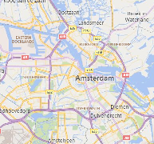
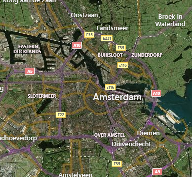
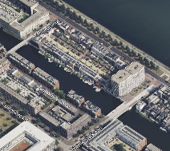
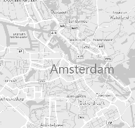
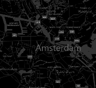
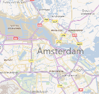
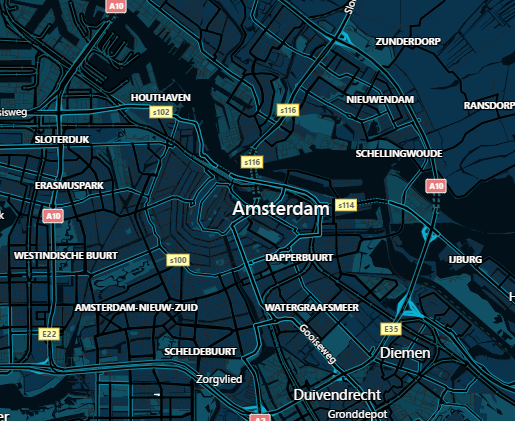
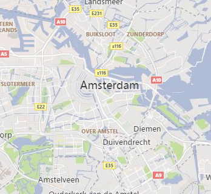
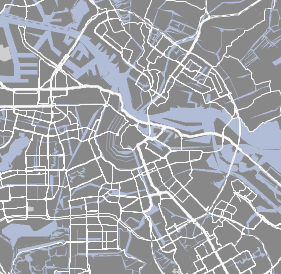

# Key features in Bing Maps

The following is a list of some of the key features in Bing Maps along with links to documentation and interactive code samples.

## Additional Road Map styles

In addition to the standard road map style there are:

| Road | Aerial | Bird's eye | Grayscale | Canvas Dark | Canvas Light |
|:----:|:------:|:----------:|:---------:|:-----------:|:------------:|
|||||||

To see an interactive code sample in both JavaScript and TypeScript that demonstrates
how to set your map type to Grayscale, see the
[Grayscale Map Type](https://www.bing.com/api/maps/sdk/mapcontrol/isdk#grayscaleMapType+JS)
sample in the Bing Maps Dev Center.

For more information, see the [MapTypeId Enumeration](../../v8-web-control/map-control-api/maptypeid-enumeration.md) documentation.

## Autosuggest

Provides suggestions as you type a location in a search box.

:::image type="content" source="./media/image10.png" alt-text="Screen shot of Bing maps Autosuggest.":::

To see an interactive code sample in both JavaScript and TypeScript that demonstrates
how to add the default autosuggest functionality to a textbox, see the
[Autosuggest UI](https://www.bing.com/api/maps/sdk/mapcontrol/isdk#autoSuggestUi+JS)
sample in the Bing Maps Dev Center.

For more information, see the [Autosuggest Module](../../v8-web-control/modules/autosuggest-module/index.md) documentation.

## Birdseye Imagery

This provides high resolution aerial imagery taken at 45 degrees to the ground from 4 different directions.

| North | East | South | West |
|:-----:|:----:|:-----:|:----:|
|||||

To see an interactive code sample in both JavaScript and TypeScript that demonstrates
how to show bird's eye view, see the
[Birdseye](https://www.bing.com/api/maps/sdk/mapcontrol/isdk#birdseyeV2+JS)
sample in the Bing Maps Dev Center.

## Data Binning

This powerful data visualization combines the power of clustering with
the richness of heat maps.

:::image type="content" source="./media/image15.png" alt-text="Screen shot of Data Binning example in Bing maps.":::

To see an interactive code sample in both JavaScript and TypeScript that demonstrates
how to render data bins with a gradient color that scales with pushpin density, see the
[Binning with gradient color scale](https://www.bing.com/api/maps/sdk/mapcontrol/isdk#gradientColorScaleBinning+JS)
sample in the Bing Maps Dev Center.

For more information, see the [Data Binning Module](../../v8-web-control/modules/data-binning-module/index.md) documentation.

## Clustering

Visualize large sets of pushpins, by having overlapping pushpins group
together as clusters and break apart as you zoom in automatically.

To see an interactive code sample in both JavaScript and TypeScript that demonstrates
how to use the Clustering module, see the
[Add clustering layer to map](https://www.bing.com/api/maps/sdk/mapcontrol/isdk#clusteringMeanAverage+JS)
sample in the Bing Maps Dev Center.

For more information, see the [Clustering Module](../../v8-web-control/modules/clustering-module/index.md) documentation.

## Enhanced Localization

Bing Maps has excellent localization support for 79 languages.

For more information, see the [Setting Map Control Parameters](../../v8-web-control/creating-and-hosting-map-controls/setting-map-control-parameters.md#localizing-the-map) documentation.

## Drawing tools

Want to draw a pushpin, polygon, or some other shape on the map? The
drawing tools module lets you do this easily. This can be used in many
different types of scenarios such as providing the user the ability to
draw a search area or providing tools for managing sales territories.

:::image type="content" source="./media/image16.png" alt-text="Screen shot showing the Drawing Tools in Bing maps.":::

To see an interactive code sample in both JavaScript and TypeScript that demonstrates
how to show drawing manager, see the
[Show drawing manager](https://www.bing.com/api/maps/sdk/mapcontrol/isdk#dtDrawThings+JS)
sample in the Bing Maps Dev Center.

For more information, see the [Drawing Tools Module](../../v8-web-control/modules/drawing-tools-module/index.md) documentation.

## Custom Map Styles

Customize the look and feel of the road maps inside of your application.
Change the colors of the roads and land, hide certain types of labels.
Create a style that aligns with your applications UI, company branding
or change it just for fun.

| | | | |
|:----:|:----:|:----:|:----:|
|  |  |  |  |

To see an interactive code sample in both JavaScript and TypeScript that demonstrates
Custom Styles & ARGB color, see the
[Custom Styles & ARGB color](https://www.bing.com/api/maps/sdk/mapcontrol/isdk#CustomMapTileStylesAndHexColor+JS)
sample in the Bing Maps Dev Center.

For more information, see the [Custom Map Styles in Bing Maps](../../articles/custom-map-styles-in-bing-maps.md) documentation.

## GeoJSON Support

GeoJSON is one of the most common file formats used for sharing and
storing spatial data. With Bing Maps you can easily import and export
GeoJSON data.

To see an interactive code sample in both JavaScript and TypeScript that demonstrates
how to read from a GeoJSON string and render it as a polygon on the map, see the
[Read GeoJSON object](https://www.bing.com/api/maps/sdk/mapcontrol/isdk#geoJsonReadObject+JS)
sample in the Bing Maps Dev Center.

For more information, see the [GeoJSON Module](../../v8-web-control/modules/geojson-module/index.md) documentation.

## KML, KMZ, GeoRSS, GML, and GPX support

The GeoXml module makes it easy to read and write common geospatial XML
file formats such as:

- [KML](https://en.wikipedia.org/wiki/Keyhole_Markup_Language) (Keyhole Markup Language) and KMZ (compressed KML)
- [GeoRSS](https://en.wikipedia.org/wiki/GeoRSS)
- [GML](https://en.wikipedia.org/wiki/Geography_Markup_Language) (Geography Markup Language, exposed via GeoRSS
- [GPX](https://en.wikipedia.org/wiki/GPS_Exchange_Format) (GPS Exchange Format).

To see an interactive code sample in both JavaScript and TypeScript that demonstrates
how to read from a URL which points to a GPX file and show the shapes on the map, see the
[GeoXml Read From a URL](https://www.bing.com/api/maps/sdk/mapcontrol/isdk#geoXMLReadFromUrl+JS)
sample in the Bing Maps Dev Center.

For more information, see the [GeoXml Module](../../v8-web-control/modules/geoxml-module/index.md) documentation.

## Heat Maps

Visualize the density of data points as a heatmap.

:::image type="content" source="./media/image21.png" alt-text="Screenshot showing an example of a heatmap in Bing Maps.":::

To see an interactive code sample in both JavaScript and TypeScript that demonstrates
how to generate a heat map layer with 500 random locations and 500 weighted locations that are within the initial view of a loaded map, see the
[Add default heatmap](https://www.bing.com/api/maps/sdk/mapcontrol/isdk#defaultHeatMap+JS)
sample in the Bing Maps Dev Center.

For more information, see the [Heat Map Module](../../v8-web-control/modules/heat-map-module/index.md) documentation.

## High Contrast support

Bing Maps automatically detects when the user's device is in high
contrast module and renders the road maps accordingly to provide easy
accessibility.

:::image type="content" source="./media/image22.png" alt-text="Screenshot showing an example of a High Contrast map in Bing Maps.":::

For more information, see the [MapTypeId Enumeration](../../v8-web-control/map-control-api/maptypeid-enumeration.md#high-contrast-support) documentation.

## Point Compression

Some of the Bing Maps services compress arrays of locations using a
compression algorithm. These tools make it easy to encode and decode
this data when using these services. Additionally, this algorithm can
also be used with your own data if sending it between a client app and a
server.

> *Original Values*
>
> points=35.894309002906084,-110.72522000409663,35.893930979073048,-110.72577999904752,35.893744984641671,-110.72606003843248,35.893366960808635,-110.72661500424147
>
> *Equivalent Compressed Value*
>
> points=vx1vilihnM6hR7mEl2Q

To see an interactive code sample in both JavaScript and TypeScript that demonstrates
how to decoded an encoded string into an array of Locations then display it on a map as a Polyline, see the
[Decode a compressed string](https://www.bing.com/api/maps/sdk/mapcontrol/isdk#decodeCompressedString+JS)
sample in the Bing Maps Dev Center.

For more information, see the [Point Compression Algorithm](../../rest-services/elevations/point-compression-algorithm.md) documentation.

## Real-time Traffic data

View real-time traffic flow and incidents on the map.

:::image type="content" source="./media/image23.png" alt-text="Screenshot showing an example of Real-time Traffic data in Bing Maps.":::

To see an interactive code sample in both JavaScript and TypeScript that demonstrates
how to create a traffic maps with color coded roads that indicate the flow of traffic
and possibly triangle icons indicating traffic incidents on the road, see the
[Add/Show traffic layer](https://www.bing.com/api/maps/sdk/mapcontrol/isdk#trafficHideShowTraffic+JS)
sample in the Bing Maps Dev Center.

For more information, see the [Traffic Module](../../v8-web-control/modules/traffic-module/index.md) documentation.

## Spatial Data Services

The Bing Spatial Data Services (SDS) provides two key features; the
ability to upload, host and expose location data as a spatial REST
service, and the ability to retrieve administrative boundaries data such
as zip codes, cities, states and more from Bing Maps. The Bing Maps SDK
exposes a set of useful tools for accessing this data and integrating it
with the map seamlessly.

To see an interactive code sample in both JavaScript and TypeScript that
demonstrates how to use the Spatial Data Services, see the
[Area and distance conversions](https://www.bing.com/api/maps/sdk/mapcontrol/isdk#areaDistanceConversion+JS)
sample in the Bing Maps Dev Center.

For more information, see the [Spatial Data Service Module](../../v8-web-control/modules/spatial-data-service-module/index.md) documentation.

## Spatial Math

When analyzing business data on a map it is often useful to be able to
perform a spatial formula or two. One of the most common being the
ability to calculate the distance (as the crow flies) between two
locations.

To see an interactive code sample in both JavaScript and TypeScript that
demonstrates how to convert kilometers to miles, and acres to square kilometers using the SpatialMath module,
see the [Area and distance conversions](https://www.bing.com/api/maps/sdk/mapcontrol/isdk#areaDistanceConversion+JS)
sample in the Bing Maps Dev Center.

For more information, see the [Spatial Math Module](../../v8-web-control/modules/spatial-math-module/index.md) documentation.

## Test Data Generator

When developing your app, you may find that you need some data to test
parts of your application. Bing Maps includes a test data generator that
can create random locations, pushpin, polylines, polygons and colors.

To see an interactive code sample in both JavaScript and TypeScript that
demonstrates the automatic creation of pushpins using `Microsoft.Maps.TestDataGenerator`,
see the [Create pushpins](https://www.bing.com/api/maps/sdk/mapcontrol/isdk#createPushpins+JS)
sample in the Bing Maps Dev Center.

For more information, see the [TestDataGenerator
Class](../../v8-web-control/map-control-api/testdatagenerator-class.md) article.

## Streetside imagery

Explore 360-degrees of street level imagery.

:::image type="content" source="./media/image24.png" alt-text="Screenshot showing an example of Street side imagery displaying Seattle's space needle in Bing Maps.":::

To see an interactive code sample in both JavaScript and TypeScript that shows
how to load the streetside mode by specifying map bounds, see the
[Load using bounds](https://www.bing.com/api/maps/sdk/mapcontrol/isdk#loadStreetsideUsingBounds+JS)
sample in the Bing Maps Dev Center.

## TypeScript Definitions

TypeScript is a superset of JavaScript and provides static typing,
classes, and interfaces. It trans compiles into JavaScript which your
application uses. These provide intellisense and richer error catching
functionality to your development environment. If you haven't used
TypeScript before we highly recommend you give it a try as it fills a
lot of gaps that you wished JavaScript supported and makes development
easier. In fact, we wrote the Bing Maps web control using TypeScript.

For additional information and to download the NuGet package, see [Bing Maps V8
TypeScript Definitions](https://github.com/Microsoft/Bing-Maps-V8-TypeScript-Definitions)
in GitHub.

## Vector Map Labels

The map labels in the Bing Maps SDK are separate from the base map and
sit above the data on the map. This ensures that the labels can be
clearly visible no matter what data is added to the map. When pushpins
overlap labels, the labels can detect this and move out of the way. If
it is a road label it will move along the road. If it is a city name it
may move up a bit. If there are a lot of pushpins in an area the label
may be hidden entirely.

For more information, see the [Vector Map Labels](../../v8-web-control/articles/vector-map-labels.md) article.

## Well Known Text support

This is a standard way of representing spatial objects as a string and use supported by all
Open Geospatial Consortium (OGC) systems and databases. Easily import and export spatial
data with a spatial database and Bing Maps. A list of features comparing Bing Maps with other
controls and services in the Bing Maps platform, see
[Explore the Bing Maps API Platform](https://www.microsoft.com/maps/choose-your-bing-maps-api).

To see an interactive code sample in both JavaScript and TypeScript that shows how to parse a
*Well Known Text* string value into a Bing Maps shape and display it on the map, see the
[Add Point as Pushpin](https://www.bing.com/api/maps/sdk/mapcontrol/isdk#wktAddPoint+JS)
sample in the Bing Maps Dev Center.

For more information, see the [Well Known Text Module](../../v8-web-control/modules/well-known-text-module.md) article.

## Map API Nomenclature

Bing Maps and Google Maps have a lot of common features and
functionalities, however there are some differences in naming
conventions. To start off with the Google Maps V3 API uses a google.maps
namespace, while Bing Maps uses a Microsoft.Maps namespace. Here are the
naming differences for some of the most used classes in these APIs:

|  Google Maps V3 |  Bing Maps V8 |  Description                          |
|-----------------|-------------- |---------------------------------------|
| InfoWindow      | Infobox       | A simple class for displaying information to a user as a dialog on the map.|
| LatLng          | Location      | An object that represents a geographical coordinate. To access the coordinates values, in Google Maps the lat() and lng() functions are used. In Bing Maps, use the latitude and longitude properties.|
| LatLngBounds    | LocationRect  | An object that represents a geographical bounding rectangle.|
| Marker          | Pushpin       | A class used to represent a single data point on the map.|

For more information, see [Google Maps to Bing Maps Class Mapping](Google-Maps-to-Bing-Maps-Migration-Guide.md#google-maps-to-bing-maps-class-mapping)

## Next steps

> [!div class="nextstepaction"]
> [Migrating Google Maps to Bing Maps](Google-Maps-to-Bing-Maps-Migration-Guide.md)
