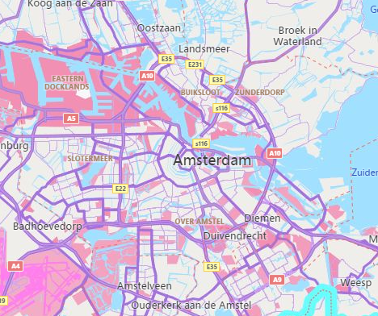

## Key features in Bing Maps

The following is a list of some of the key features in Bing Maps along with links to documentation and interactive code samples.

### Additional Road Map styles

\[[docs](https://docs.microsoft.com/bingmaps/v8-web-control/map-control-api/maptypeid-enumeration),
[samples](https://www.bing.com/api/maps/sdkrelease/mapcontrol/isdk#grayscaleMapType+JS)\]

In addition to the standard road map style there are:

| Road | Aerial | Bird's eye | Grayscale | Canvas Dark | Canvas Light |
|:----:|:------:|:----------:|:---------:|:-----------:|:------------:|
|||||||

### Autosuggest

\[[docs](https://docs.microsoft.com/bingmaps/v8-web-control/modules/autosuggest-module/),
[samples](https://www.bing.com/api/maps/sdk/mapcontrol/isdk#autoSuggestUi+JS)\]

Provides suggestions as you type a location in a search box.

### Birdseye Imagery

\[[samples](https://www.bing.com/api/maps/sdkrelease/mapcontrol/isdk#birdseyeV2+JS)\]

This provides high resolution aerial imagery taken at 45 degrees to the ground from 4 different directions.

| North | East | South | West |
|:-----:|:----:|:-----:|:----:|
|||||

### Data Binning

\[[docs](https://docs.microsoft.com/bingmaps/v8-web-control/modules/data-binning-module/),
[samples](https://www.bing.com/api/maps/sdkrelease/mapcontrol/isdk#gradientColorScaleBinning+JS)\]

This powerful data visualization combines the power of clustering with
the richness of heat maps.

### Clustering

\[[docs](https://docs.microsoft.com/bingmaps/v8-web-control/modules/clustering-module/),
[samples](https://www.bing.com/api/maps/sdk/mapcontrol/isdk#clusteringMeanAverage+JS)\]

Visualize large sets of pushpins, by having overlapping pushpins group
together as clusters and break apart as you zoom in automatically.

### Enhanced Localization

\[[docs](https://docs.microsoft.com/bingmaps/v8-web-control/creating-and-hosting-map-controls/setting-map-control-parameters#localizing-the-map)\]

Bing Maps has excellent localization support for 79 languages.

### Drawing tools

\[[docs](https://docs.microsoft.com/bingmaps/v8-web-control/modules/drawing-tools-module/), [samples](https://www.bing.com/api/maps/sdk/mapcontrol/isdk#dtDrawThings+JS)\]

Want to draw a pushpin, polygon, or some other shape on the map? The
drawing tools module lets you do this easily. This can be used in many
different types of scenarios such as providing the user the ability to
draw a search area or providing tools for managing sales territories.

### Custom Map Styles

\[[docs](https://docs.microsoft.com/bingmaps/articles/custom-map-styles-in-bing-maps),
[samples](https://www.bing.com/api/maps/sdkrelease/mapcontrol/isdk#CustomMapTileStylesAndHexColor+JS)\]

Customize the look and feel of the road maps inside of your application.
Change the colors of the roads and land, hide certain types of labels.
Create a style that aligns with your applications UI, company branding
or change it just for fun.

|                          |                          |                          |                          |
|:------------------------:|:------------------------:|:------------------------:|:------------------------:|
|  |  |  |  |

### GeoJSON Support

\[[docs](https://docs.microsoft.com/bingmaps/v8-web-control/modules/geojson-module/),
[samples](https://www.bing.com/api/maps/sdk/mapcontrol/isdk#geoJsonReadObject+JS)\]

GeoJSON is one of the most common file formats used for sharing and
storing spatial data. With Bing Maps you can easily import and export
GeoJSON data.

### KML, KMZ, GeoRSS, GML, and GPX support

\[[docs](https://docs.microsoft.com/bingmaps/v8-web-control/modules/geoxml-module/),
[samples](https://www.bing.com/api/maps/sdkrelease/mapcontrol/isdk#geoXMLReadFromUrl+JS)\]

The GeoXml module makes it easy to read and write common geospatial XML
file formats such as:

- [KML](https://en.wikipedia.org/wiki/Keyhole_Markup_Language) (Keyhole Markup Language) and KMZ (compressed KML)
- [GeoRSS](https://en.wikipedia.org/wiki/GeoRSS)
- [GML](https://en.wikipedia.org/wiki/Geography_Markup_Language) (Geography Markup Language, exposed via GeoRSS
- [GPX](https://en.wikipedia.org/wiki/GPS_Exchange_Format) (GPS Exchange Format).

### Heat Maps

\[[docs](https://docs.microsoft.com/bingmaps/v8-web-control/modules/heat-map-module/),
[samples](https://www.bing.com/api/maps/sdk/mapcontrol/isdk#defaultHeatMap+JS)\]

Visualize the density of data points as a heatmap.

### High Contrast support

\[[docs](https://docs.microsoft.com/bingmaps/v8-web-control/map-control-api/maptypeid-enumeration#high-contrast-support)\]

Bing Maps automatically detects when the user's device is in high
contrast module and renders the road maps accordingly to provide easy
accessibility.

### Point Compression

\[[docs](https://docs.microsoft.com/bingmaps/rest-services/elevations/point-compression-algorithm),
[samples](https://www.bing.com/api/maps/sdk/mapcontrol/isdk#decodeCompressedString+JS)\]

Some of the Bing Maps services compress arrays of locations using a
compression algorithm. These tools make it easy to encode and decode
this data when using these services. Additionally, this algorithm can
also be used with your own data if sending it between a client app and a
server.

> *Original Values*
>
> points=35.894309002906084,-110.72522000409663,35.893930979073048,-110.72577999904752,35.893744984641671,-110.72606003843248,35.893366960808635,-110.72661500424147
>
> *Equivalent Compressed Value*
>
> points=vx1vilihnM6hR7mEl2Q

### Real-time Traffic data

\[[docs](https://docs.microsoft.com/bingmaps/v8-web-control/modules/traffic-module/),
[samples](https://www.bing.com/api/maps/sdkrelease/mapcontrol/isdk#trafficHideShowTraffic+JS)\]

View real-time traffic flow and incidents on the map.

### Spatial Data Services

\[[docs](https://docs.microsoft.com/bingmaps/v8-web-control/modules/spatial-data-service-module/),
[samples](https://www.bing.com/api/maps/sdk/mapcontrol/isdk/sdspageresults#JS)\]

The Bing Spatial Data Services (SDS) provides two key features; the
ability to upload, host and expose location data as a spatial REST
service, and the ability to retrieve administrative boundaries data such
as zip codes, cities, states and more from Bing Maps. The Bing Maps SDK
exposes a set of useful tools for accessing this data and integrating it
with the map seamlessly.

### Spatial Math

\[[docs](https://docs.microsoft.com/bingmaps/v8-web-control/modules/spatial-math-module/),
[samples](https://www.bing.com/api/maps/sdk/mapcontrol/isdk#areaDistanceConversion+JS)\]

When analyzing business data on a map it is often useful to be able to
perform a spatial formula or two. One of the most common being the
ability to calculate the distance (as the crow flies) between two
locations.

### Test Data Generator

\[[docs](https://docs.microsoft.com/bingmaps/v8-web-control/map-control-api/testdatagenerator-class),
[samples](https://www.bing.com/api/maps/sdk/mapcontrol/isdk#createPushpins+JS)\]

When developing your app, you may find that you need some data to test
parts of your application. Bing Maps includes a test data generator that
can create random locations, pushpin, polylines, polygons and colors.

### Streetside imagery

\[[samples](https://www.bing.com/api/maps/sdk/mapcontrol/isdk#loadStreetsideUsingBounds+JS)\]

Explore 360-degrees of street level imagery.

### TypeScript Definitions

\[[details](https://github.com/Microsoft/Bing-Maps-V8-TypeScript-Definitions)\]

TypeScript is a superset of JavaScript and provides static typing,
classes, and interfaces. It trans compiles into JavaScript which your
application uses. These provide intellisense and richer error catching
functionality to your development environment. If you haven't used
TypeScript before we highly recommend you give it a try as it fills a
lot of gaps that you wished JavaScript supported and makes development
easier. In fact, we wrote the Bing Maps web control using TypeScript.

### Vector Map Labels

\[[docs](https://docs.microsoft.com/bingmaps/v8-web-control/articles/vector-map-labels)\]

The map labels in the Bing Maps SDK are separate from the base map and
sit above the data on the map. This ensures that the labels can be
clearly visible no matter what data is added to the map. When pushpins
overlap labels, the labels can detect this and move out of the way. If
it is a road label it will move along the road. If it is a city name it
may move up a bit. If there are a lot of pushpins in an area the label
may be hidden entirely.

### Well Known Text support

\[[docs](https://docs.microsoft.com/bingmaps/v8-web-control/modules/well-known-text-module),
[samples](https://www.bing.com/api/maps/sdk/mapcontrol/isdk#wktAddPoint+JS)\]

This is a standard way of representing spatial objects as a string and
use supported by all Open Geospatial Consortium (OGC) systems and
databases. Easily import and export spatial data with a spatial database
and Bing Maps. A list of features comparing Bing Maps with other
controls and services in the Bing Maps platform, see
[Explore the Bing Maps API Platform](https://www.microsoft.com/maps/choose-your-bing-maps-api).

### Map API Nomenclature

Bing Maps and Google Maps have a lot of common features and
functionalities, however there are some differences in naming
conventions. To start off with the Google Maps V3 API uses a google.maps
namespace, while Bing Maps uses a Microsoft.Maps namespace. Here are the
naming differences for some of the most used classes in these APIs:

|  Google Maps V3 |  Bing Maps V8 |  Description                          |
|-----------------|-------------- |---------------------------------------|
| InfoWindow      | Infobox       | A simple class for displaying information to a user as a dialog on the map.|
| LatLng          | Location      | An object that represents a geographical coordinate. To access the coordinates values, in Google Maps the lat() and lng() functions are used. In Bing Maps, use the latitude and longitude properties.|
| LatLngBounds    | LocationRect  | An object that represents a geographical bounding rectangle.|
| Marker          | Pushpin       | A class used to represent a single data point on the map.|

For more information, see [Google Maps to Bing Maps Class Mapping](#google-maps-to-bing-maps-class-mapping)

## Next steps

> [!div class="nextstepaction"]
> [Migrating Google Maps to Bing Maps](Google-Maps-to-Bing-Maps-Migration-Guide.md)
