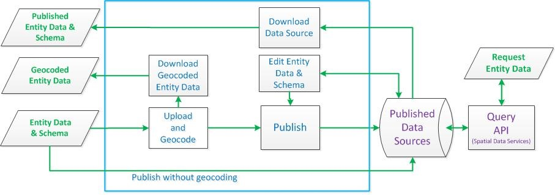

# Uploading and Publishing Entity Data to a Data Source
You can upload, geocode, and publish entity data to a data source by using the Bing Maps Dev Center.  
  
 After the entity data is published to a data source, you can query the data source by using the [Query API](http://msdn.microsoft.com/en-us/library/gg585126.aspx). You can also edit published entity data as described in [Editing a Data Source](../getting-started/editing-a-data-source.md). Enterprise accounts can have up to 25 published data sources. For non-enterprise accounts, the limit is 5 published data sources. The complete data source process is shown in the following diagram and further explanation for the geocoding and publishing steps is provided below.  
  
   
  
> [!NOTE]
>  For information on data source limits that apply to this feature, see [Geocode and Data Source Limits](../spatial-data-services/geocode-and-data-source-limits.md)  
  
## Entity Data and Data Schema  
 To upload, geocode and publish entity data to a data source, you must create a file that contains a data schema and a set of entity data. Supported data file formats include KML, ESRI Shapefiles (SHP), XML, comma-separated values (CSV), tab-delimited values and pipe-delimited (&#124;) values. The data file that you upload must use UTF-8 encoding.  
  
 Data sources that use Enterprise keys can contain up to 300 MB of uncompressed data or 200,000 entities. Compressed data files are accepted, but your uncompressed data must be no more than 300 MB. Data sources that use Basic keys can have a maximum of 50 entities.  
  
 The data schema defines the properties of an entity type including location properties (latitude, longitude and address information) and additional user-defined properties such as phone number and hours of operation. The entity data values must match the data schema. Examples for each data format are provided below.  
  
### Location Properties  
 The location properties in the following table are used for geocoding and reverse-geocoding entity locations. The latitude and longitude properties must be included in your data schema. The remaining address properties are optional for your input data. However, they are required for a data source, so any address properties that you do not include in your data schema are added when you upload your data.  
  
|Property|Description|  
|--------------|-----------------|  
|Latitude|[**Required in data schema**]. A double value that represents degrees of latitude.<br /><br /> Valid range of latitude values: [-90, +90]<br /><br /> **Example**: 47.673099|  
|Longitude|[**Required in data schema**] A double value that represents degrees of latitude.<br /><br /> Valid range of longitude values: [-180, +180]<br /><br /> **Example**: -122.11871|  
|AddressLine|The official street line of an address relative to the area, as specified by the Locality, or PostalCode, properties. Typical use of this element would be to provide a street address or any official address.<br /><br /> **Example**: 1 Microsoft Way|  
|Locality|A string specifying the populated place for the address. This typically refers to a city, but may refer to a suburb or a neighborhood in certain countries.<br /><br /> **Example**: Seattle|  
|AdminDistrict|A string specifying the subdivision name in the country or region for an address. This element is typically treated as the first order administrative subdivision, but in some cases it is the second, third, or fourth order subdivision in a country, dependency, or region.<br /><br /> **Example**: WA|  
|PostalCode|A string specifying the post code, postal code, or ZIP Code of an address.<br /><br /> **Example**: 98178|  
|CountryRegion|A string specifying the country or region name of an address.<br /><br /> **Example**: United States|  
  
 If you provide complete address data and latitude and longitude values, your entity data is not changed by the upload and geocode process. However, if you want to reverse geocode latitude and longitude values from address data, leave the latitude properties fields empty. Similarly, if you provide address data and do not provide latitude and longitude values, the address data is geocoded.  
  
### Entity Data Types  
 You can have a total of 350 properties in your schema. The latitude and longitude properties do not count towards this maximum.  
  
 The following table shows the supported data types for the data schema. These data types map to a set of OData types that are used by the data source. You must use the XML data types in an XML data schema. If you use one of the delimited formats for your data and data schema (values separated by commas, tabs or pipe (&#124;) characters), you must use the OData types in the data schema. Descriptions of OData types are found in the [OData Protocol Overview](http://www.odata.org/developers/protocols/overview).  
  
|XML Data Type|OData Type|  
|-------------------|----------------|  
|string|Edm.String<br /><br /> The maximum string length is 2560 characters.|  
|long|Edm.Int64|  
|Boolean|Edm.Boolean|  
|double|Edm.Double|  
|dateTime|Edm.DateTime|  
|anyType|Edm.Geography<br /><br /> A Well-Known Text representation of the geographical shape.<br /><br /> The maximum number of points a single geography object can have is 100,000.|  
  
### Property Name Requirements  
 Property names must meet the following requirements:  
  
-   The property name can have up to 50 characters.  
  
-   The property name must contain alphanumeric characters and underscores (_) only.  
  
-   The first character of the property name must be a letter or an underscore.  
  
-   The property name cannot start with a two underscores (__).  
  
-   Property names are case-insensitive.  
  
### Data Source Name Requirements  
 A data source name can have up to 50 characters and can contain alphanumeric characters and any of the following special characters. Blank spaces are not allowed:  
  
 ~ ` ! $ ^ _ = { }  
  
### Example: XML Schema and Entity Data  
 The following is an XML data schema and input data example. The data schema specifies a set of location properties, an entity ID property and two other entity properties for phone and manager information.  
  
 Note that the input data does not contain values for all of the location properties. For example, one set of entity data contains address information while the other set contains only latitude and longitude coordinates. When this data is uploaded to the Bing Maps Dev Center, the geocode process can geocode (get latitude and longitude values for) the address data, and can reverse-geocode (get address information for) the latitude and longitude values. Geocoding or reverse-geocoding only occurs when address information is missing (reverse-geocoding) or when latitude and longitude values are missing (geocoding). If address information and latitude and longitude values are both provided for an entity, no changes are made to the data. You also have the option to upload and directly publish the data to the data source with no changes.  
  
 In addition to other characters, such a comma or a hyphen (-), you can use the pipe (&#124;) character in XML entity values. The entity type name (FourthCoffeeShops in the example) supports hyphens (-) and underscores (_).  
  
 For additional information about creating a data schema and input values including available types and limits, see [Load Data Source Data Schema and Sample Input](http://msdn.microsoft.com/en-us/library/gg585138.aspx).  
  
```  
<?xml version="1.0" standalone="yes"?>  
<FourthCoffeeSample>  
  <xs:schema id="FourthCoffeeSample" xmlns="" xmlns:xs="http://www.w3.org/2001/XMLSchema" xmlns:msdata="urn:schemas-microsoft-com:xml-msdata">  
    <xs:element name="FourthCoffeeSample" msdata:IsDataSet="true" msdata:UseCurrentLocale="true">  
      <xs:complexType>  
        <xs:choice minOccurs="0" maxOccurs="unbounded">  
          <xs:element name="FourthCoffeeShops">  
            <xs:complexType>  
              <xs:sequence>  
                <xs:element name="AddressLine" type="xs:string" minOccurs="0" />  
                <xs:element name="Locality" type="xs:string" minOccurs="0" />  
                <xs:element name="AdminDistrict" type="xs:string" minOccurs="0" />  
                <xs:element name="PostalCode" type="xs:string" minOccurs="0" />  
                <xs:element name="CountryRegion" type="xs:string" minOccurs="0" />  
                <xs:element name="Phone" type="xs:string" minOccurs="0" />  
                <xs:element name="Manager" type="xs:string" minOccurs="0" />  
                <xs:element name="EntityID" type="xs:string" />  
                <xs:element name="Longitude" type="xs:double" minOccurs="0" />  
                <xs:element name="Latitude" type="xs:double" minOccurs="0" />  
              </xs:sequence>  
            </xs:complexType>  
          </xs:element>  
        </xs:choice>  
      </xs:complexType>  
      <xs:unique name="Constraint1" msdata:PrimaryKey="true">  
        <xs:selector xpath=".//FourthCoffeeShops" />  
        <xs:field xpath="EntityID" />  
      </xs:unique>  
    </xs:element>  
  </xs:schema>  
  <FourthCoffeeShops>  
    <EntityID>1000</EntityID>  
    <AddressLine>1 Microsoft Way</AddressLine>  
    <Locality>Redmond</Locality>  
    <AdminDistrict>WA</AdminDistrict>  
    <PostalCode>98052</PostalCode>  
    <Phone>303-555-0188</Phone>  
    <Manager>Alan Steiner | Pannarat Pattanapitakkul</Manager>  
 </FourthCoffeeShops>  
  <FourthCoffeeShops>  
    <EntityID>1001</EntityID>  
    <Latitude>47.64054</Latitude>  
    <Longitude>-122.12934</Longitude>  
    <Phone>425-555-0111</Phone>  
    <Manager>Phil Spencer</Manager>  
  </FourthCoffeeShops>  
</FourthCoffeeSample>  
```  
  
### Example: CSV Data Schema and Entity Data  
 The following is an example of a comma-separated value (CSV) data schema and input data. The header is required and specifies the data schema version. For more information about this format including available types and limits, see [Load Data Source Data Schema and Sample Input](http://msdn.microsoft.com/en-us/library/gg585138.aspx). Save your CSV file with a .txt file name extension for upload.  
  
```  
Bing Spatial Data Services, 1.0, FourthCoffeeShops  
EntityID(Edm.String,primaryKey),AddressLine(Edm.String),Locality(Edm.String),AdminDistrict(Edm.String),PostalCode(Edm.String),CountryRegion(Edm.String),Phone(Edm.String),Manager(Edm.String),Latitude(Edm.Double),Longitude(Edm.Double)  
1000,1 Microsoft Way,Redmond,WA,98052,,303-555-0188,Alan Steiner,,  
1001,,,,,,425-555-0111,Phil Spencer,47.639767,-122.129959  
```  
  
### Example: TAB Data Schema and Entity Data  
 The following is an example of tab-delimited value data schema and input data. Tabs are represented in this example by "->" **for illustration purposes only**. Do not use "->" in your input file. Insert tabs as separators instead. The header is required and specifies the data schema version. For more information about this format including available types and limits, see [Load Data Source Data Schema and Sample Input](http://msdn.microsoft.com/en-us/library/gg585138.aspx). Save your tab-delimited file with a .txt file name extension for upload.  
  
```  
Bing Spatial Data Services,1.0,FourthCoffeeShops  
EntityID(Edm.String,primaryKey)->AddressLine(Edm.String)->Locality(Edm.String)->AdminDistrict(Edm.String)->PostalCode(Edm.String)->CountryRegion(Edm.String)->Phone(Edm.String)->Manager(Edm.String)->Latitude(Edm.Double)->Longitude(Edm.Double)  
1000->1 Microsoft Way->Redmond->WA->98052->->303-555-0188->Alan Steiner->->  
1001->->->->->->425-555-0111->Phil Spencer->47.639767->-122.129959  
```  
  
### Sample Pipe Data Schema and Input Data  
 The following is an example of pipe-delimited value data schema and input data. The header is required and specifies the data schema version. For more information about this format including available types and limits, see [Load Data Source Data Schema and Sample Input](http://msdn.microsoft.com/en-us/library/gg585138.aspx).  
  
```  
Bing Spatial Data Services,1.0,FourthCoffeeShops  
EntityID(Edm.String,primaryKey)|AddressLine(Edm.String)|Locality(Edm.String)|AdminDistrict(Edm.String)|PostalCode(Edm.String)|CountryRegion(Edm.String)|Phone(Edm.String)|Manager(Edm.String)|Latitude(Edm.Double)|Longitude(Edm.Double)  
1000|1 Microsoft Way|Redmond|WA|98052||303-555-0188|Alan Steiner||  
1001||||||425-555-0111|Phil Spencer|47.639767|-122.129959  
```  
  
<a name="BKMK_uploadgeocode"></a>   
## Upload and Geocode Entity Data  
  
> [!NOTE]
>  If you want to upload and publish your entity data to a data source without geocoding the data, select **Publish without geocoding** when you upload the data. When you choose this option, the data is published to the data source in one step.  
  
 When you upload entity data to the Bing Maps Dev Center, the location information is geocoded or reverse-geocoded depending on the location information you provide. You can determine if an entity is geocode by what fields you specify. For each entity, if you:  
  
-   **Want to geocode (compute latitude and longitude values from) the address data**, then provide complete address information and **do not provide latitude and longitude values**. During the upload process, the address properties (AddressLine, Locality, AdminDistrict, PostalCode, CountryRegion) are used to compute the latitude and longitude values. The address information is not changed.  
  
-   **Want to reverse-geocode (compute address values from) latitude and longitude values**, then do not include any address property values or leave them blank, and the upload process will reverse-geocode the latitude and longitude values and save the results in the address properties.  
  
-   **Do not want to geocode or reverse-geocode the entity data**, then make sure you provide latitude and longitude values as well as one or more address values and the upload process will not make any changes to the entity data.  
  
 If you do not include address fields in your data schema, these fields are created when you upload your entity data.  
  
 **To upload the file that contains your data schema and entity data, follow these steps.**  
  
1.  Sign in to the [Bing Maps Dev Center](https://www.bingmapsportal.com/) with your Bing Maps account. If you do not have a Bing Maps account, see [Creating a Bing Maps Account](../getting-started/creating-a-bing-maps-account.md).  
  
2.  In the Bing Maps Dev Center, select the **Upload data to a data source** under **Data Sources**.  
  
3.  Provide the following information  
  
    -   **Data source name**: The name of the data source where you want to publish the data. If a data source with this name does not exist, it will be created when you publish the data. For data source name requirements, see the preceding **Data Source Name Requirements** section.  
  
    -   **Master key**: Select the Bing Maps Key to use for the data source.  
  
        -   If you are creating a new data source, select the Bing Maps Key that you want to use to manage the data source.  
  
        -   If you are updating a data source with new data, you must use the master key that you specified when you created the data source. To view a list of master and query keys for data sources, click the **View data source information** link under **Data Sources** on the Bing Maps Dev Center.  
  
    -   **Query key** [new data sources only]: If you are creating a new data source, you can select a Bing Maps Key to use to query the data source. The query key must be a different Bing Maps Key than the master key.  
  
    -   **Data format**: Select the type of input file you want to upload.  
  
    -   **Data file** : Browse to the file that contains the data (schema and entity data) that you want to publish. You can format your data by using XML, CSV (comma-separated value), TAB (tab-delimited) or PIPE (pipe-delimited) formats. The file extensions expected for each file type are:  
  
        -   .xml :XML  
  
        -   .csv :comma-separated value  
  
        -   .txt :pipe-delimited  
  
        -   .txt :tab-delimited  
  
    -   **Publish without geocoding**: Select this option if you want to upload and publish your data to a data source in one step without geocoding the entity location data.  
  
    -   **Set data source access to public or private**: When you choose to publish without geocoding, you have the option to make the data source public or private. A public data source can be queried by anyone with a Bing Maps Key and the query URL. If you are updating an existing URL, make sure you choose the correct access setting because it overrides the existing setting.  
  
         After a data source is published, you can change the data source access at any time from the **Manage my data sources** page.  
  
4.  Click **Submit** to start the upload.  
  
## Download Geocoded Entity Data [optional]  
 After you have submitted your entity data for the upload and geocode process, go to **Manage my data sources** under **Data Sources** to see the status of your upload. Click **Refresh** on the **Geocoded Data Sources** tab until you see one or more links appear in the **Download** column. A **Geocoded** link downloads all entities that were geocoded successfully. If a **Failed** link appears, one or more entities could not be geocoded and the link will download the entities that failed to geocode. Both **Geocoded** and **Failed** downloads are provided in XML format.  
  
 Note that geocoded data downloads are not available after you publish the entity data to a data source. If you do not publish your geocoded data, it will be available for 14 days.  
  
## Publish Entity Data to a Data Source [optional]  
 When you are ready to publish entities that geocoded successfully, click **Publish**. When you publish your data, the published data source appears on the **Published Data Sources** tab and the **Geocoded** and **Failed** download files are no longer available. To query the data source, you will need a using the [Query API](http://msdn.microsoft.com/en-us/library/gg585126.aspx). You can find this URL on the **View Data Source Information** page under **Data Sources**. You can also edit the entity data and the data scheme of the published data source. For more information about editing the entity data of a published data source, see [Editing a Data Source](../getting-started/editing-a-data-source.md).  
  
## Transaction Accounting  
 Transactions are counted when you use the Bing Maps Dev Center to create and manage data sources. For more information about these transactions, see [Understanding Bing Maps Transactions](../getting-started/understanding-bing-maps-transactions.md).  
  
## See Also  
 [Getting Data Source Information](../getting-started/getting-data-source-information.md)   
 [Editing a Data Source](../getting-started/editing-a-data-source.md)   
 [Downloading a Data Source](../getting-started/downloading-a-data-source.md)   
 [Deleting a Data Source](../getting-started/deleting-a-data-source.md)