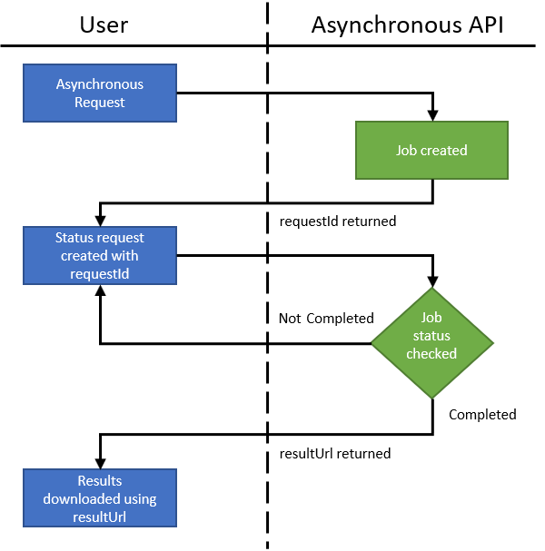

# Asynchronous Requests
Several of the Bing Maps REST API’s such as; truck routing, distance matrix, and isochrones, support asynchronous requests for queries that may take more than a few seconds to process. An asynchronous request to these APIs consists of the following dataflow:

1.	Make an asynchronous request to the API.
2.	The API will start a job to process your request and return a response that includes a requestId and an estimated amount of time to wait before checking the status. Be sure to check for an error message as one will be returned if the request is invalid. 
3.	Use this requestId to request status updates from the API. If complete, the results will be returned in the response, if it isn’t complete, an estimated amount of time to wait before checking the status again will be provided in the response. Repeat this process until either the results or an error message is returned.

Here is a diagram that visualizes this dataflow.

## RouteProxyAsyncResult Resource

A `RouteProxyAsyncResult` resource is returned as a response when making an asynchronous request using the truck routing, isochrone or distance matrix APIs. This resource provides the status of the asynchronous request which includes an estimated amount of time left to process the request, the unique `requestId` to use when checking the status, as well as information on if the request was had any errors or not.

| JSON              | XML               | Type    | Description   |
|-------------------|-------------------|---------|---------------|
| callbackInSeconds | CallbackInSeconds | integer | An estimated number of seconds remaining to complete the request. Wait this long before checking the status again. |
| callbackUrl       | CallbackUrl       | string  | The callback URL to use to check the status of the request. |
| isAccepted        | IsAccepted        | boolean | Specifies if the request is accepted. A request will not be accepted if it is not valid, or is not within the coordinate pair limits. |
| isCompleted       | IsCompleted       | boolean | Specifies is the request has completed. |
| requestId         | RequestId         | string  | A unique identifier for an asynchronous request. This can be used to retrieve the results of an asynchronous request when it has completed. |
| resultUrl         | ResultUrl         | string  | When completed, this field will be populated with a URL which can be used to download the results. The downloaded results will be a `Response` object that contains the result. The format of the result will be in JSON or XML depending on the the output specified in the initial request. |