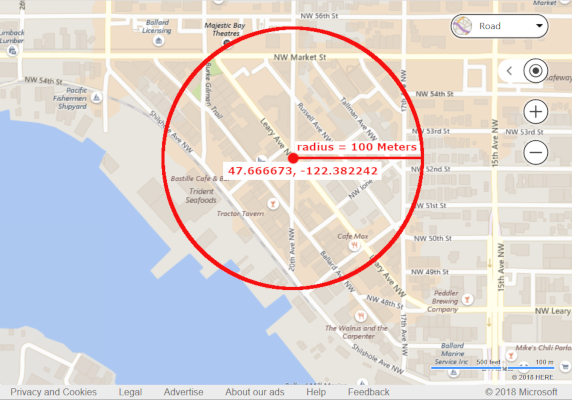
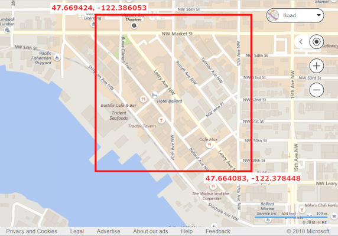

# Bing Maps Autosuggest API

Given a request with a user’s location and a partial query (called a `query prefix`), the Bing Maps Autosuggest API returns a list of suggested entities which the user is most likely searching for. These entities are ranked from most to least likely. Requests can be called using user locations (as the geocoordinates of the user, including a radius representing your confidence in the accuracy of the user’s location), and/or as a geographic region (either a circle or rectangle, but not both).  

> [!NOTE]
> Geographic regions defined using map view parameters only influence suggested entity rankings.
>
> Suggested entities are **not** guaranteed to lie inside geographic regions.

There are three possible kinds of entities: Addresses/Roads, Places, and Businesses. Requests can be specified to return any combination of these entities.

Presently, `Business` entities are only available in the `en-US` culture.

## API Signature

```url
http://dev.virtualearth.net/REST/v1/Autosuggest?query=<user_prefix>&userLocation=<lat,long,confidence_radius>&userCircularMapView=<lat,long,radius>&userMapView=<nw_lat,nw_long,se_lat,se_long>&maxResults=<max_results>&includeEntityTypes=<Place,Address,Business>&culture=<culture_code>&userRegion=<country_code>&countryFilter=<country_code_or_none>&key=<BingMapKey>
```

>[!NOTE]
> Only the `query` parameter is unconditionally required. The `userLocation` parameter is required if neither of the optional parameters `userCircularMapView` nor `userMapView` are provided.
> 
> The parameters `userCircularMapView` and `userMapView` are mutually exclusive.

## Query Parameters


|Parameters |Alias |Description |
|---------|:-------:|---------|
|`query` | `q` | **Required.** The user's query prefix.<br /><br />Example: "1 Micro" or "El Gaucho". |
|`userLocation` | `ul` | **Required if neither `userCircularMapView` nor `userMapView` are provided.** A comma separated list of the user’s location (latitude, longitude) and radius, in meters, representing the confidence in the accuracy of the user’s location.<br /><br />Example: `48.604311,-122.981998,5000`<br /><br />**Note:** `userLocation` becomes a secondary signal if either `UserCircularMapView` or `UserMapView` is provided. |
|`userCircularMapView` |  `ucmv` | **Optional.** A circular geographic region specified by a comma separated list of the latitude and longitude of the center of the circle, and the radius of the circle, in meters.<br /><br />Example: `48.604311,-122.981998,5000`<br /><br />**Note.** Mutually exclusive from `userMapView`.|
|`userMapView` |`umv` | **Optional.** A rectangular region (a bounding box) specified by a comma separated list of the latitudes and longitudes of two corners of the rectangle:<br /><br />- Latitude of the Northwest corner<br />- Longitude of the Northwest corner<br />- Latitude of the Southeast corner<br />- Longitude of the Southeast corner<br /><br />Example: `29.8171041,-122.981995,48.604311,-95.5413725`<br /><br />**Note**: Mutually exclusive from `userCircularMapView`.|
|`maxResults` |`maxRes` | **Optional.** The maximum number of returned suggestions and can be any integer in `[1, 10]`.<br /><br />Default: `7`. |
|`includeEntityTypes` | `inclenttype` | **Optional.** A comma separated list of returned entity types. The possible values are:<br /> <br />- `Address`<br />- `Place`<br />- `Business`<br /><br />**Note:** These types are mutually inclusive. `Place` represents points of interest, like natural landmarks.<br /><br />Default: `Address,Place,Business` |
|`culture` | `c` | **Optional.** The language of query prefixes.<br /><br />Example: `en-GB`.<br /><br />Default: `en-US`. |
|`userRegion` |`ur` | **Optional**. The user’s market denoted by 2-letter country code abbreviations.<br /><br />Example: `DE`.<br /><br />Default: `US`. |
|`countryFilter` | `cf` | **Optional**. Used to constrain entity suggestions to a single country denoted by a 2-letter country code abbreviation.<br /><br />Example: `DE`.<br /><br />Default: `none`. |
|`output` | `o`  |**Optional**. Format of the response:<br /><br />- `JSON`<br />- `XML`<br /><br />Default: `JSON`. |

## Response Format

Response formats are available in both JSON and XML.

## Response Fields

As shown in the table below, the response format of the three resource entities -- `Business`, `Place`, and `Address` -- vary.
 
|Resource Type Field  |Resource Fields  |
|---------|---------|
|`__type: “Address”` | - houseNumber<br />- streetName<br />- addressLine<br />- locality<br />- adminDistrict<br />- adminDistrict2<br />- countryRegion<br />- countryRegionIso2<br />- neighborhood<br />- postalCode<br />- formattedAddress |
|`__type: “Place”` |- entityType<br />- name<br />- addressLine<br />- locality<br />- adminDistrict<br />- adminDistrict2<br />- countryRegion<br />- countryRegionIso2<br />- neighborhood<br />- postalCode<br />- formattedAddress |
|`__type: “LocalBusiness”` | - entityType<br />- name<br />- addressLine<br />- locality<br />- adminDistrict<br />- adminDistrict2<br /> - countryRegion<br />- countryRegionIso2<br />- neighborhood<br />- postalCode<br />- formattedAddress |

|Response Fields  |Description  |
|---------|---------|
|`ResourceSets` | Container of returned resources. |
|`Resources` | Structured entity suggestion.|
|`Error` | If an error occurred, defines the errors.|
|`__type` | The type of resource. |
|`houseNumber` | The house number for a street address. e.g. `2100`. May be blank for road entities. |
|`streetName` |The street name of a street address, e.g. `Westlake Ave N`. |
|`addressLine` |The street address of a resource, e.g. `2100 Westlake Ave N`. |
|`locality` |The city in which a resource is located, e.g. `Seattle`. |
|`adminDistrict2` | The name of the county in which a resource is located, e.g. `King`.|
|`adminDistrict`  |The state or province code for a street address. Usually a two-letter code, e.g. `WA`, or the full name, e.g. `Washington`. |
|`countryRegion`  |The name of the country or region in which the street address is located, e.g. `United States`. |
|`countryRegionIso2` |The two-letter ISO code for the country or region in which the street address is located, e.g. `US`.  |
|`Neighborhood` |The neighborhood in which the street address is located, e.g. `Westlake`.  |
|`PostalCode` |The zip or postal code for the the street address , e.g. `98052`. |
|`formattedAddress`  |The complete address of the resource, e.g. `7625 170th Ave NE, Redmond, WA 98052`. |
|`entityType`  |A list of hints which indicate the resource type.<br />The list may contain a single hint such as `PopulatedPlace` or a list of hints such as `Place,LocalBusiness,Restaurant`.<br />Each successive hint in the list narrows down the entity's type. |
|`name` |Name of a place or business, e.g. `Washington`,  or `Starbucks`.<br />All places of interest have names, but the name may be located in the address fields.|

## Examples

### Example: Searching for a business

Consider the case of a user typing in an HTML form to search for a place to eat, and that we are sure the user’s location is in the Ballard neighborhood of Seattle, e.g. at the location `47.668697,-122.376373`.

As the user starts typing, we can use a partial query like “El bur” as a query prefix, and send the following URL request:

```url
http://dev.virtualearth.net/REST/v1/Autosuggest?query=El%20bur&userLocation=47.668697,-122.376373,5&includeEntityTypes=Business&key=<BingMapsKey>
```

And the JSON response:

```json
{
    "authenticationResultCode": "ValidCredentials",
    "brandLogoUri": "http:\/\/dev.virtualearth.net\/Branding\/logo_powered_by.png",
    "copyright": "Copyright c 2018 Microsoft and its suppliers. All rights reserved. This API cannot be accessed and the content and any results may not be used, reproduced or transmitted in any manner without express written permission from Microsoft Corporation.",
    "resourceSets": [
        {
            "estimatedTotal": 1,
            "resources": [
                {
                    "__type": "Autosuggest:http:\/\/schemas.microsoft.com\/search\/local\/ws\/rest\/v1",
                    "value": [
                        {
                            "__type": "LocalBusiness",
                            "address": {
                                "countryRegion": "United States",
                                "locality": "Kirkland",
                                "adminDistrict": "WA",
                                "countryRegionIso2": "US",
                                "postalCode": "98034",
                                "addressLine": "12412 116th Ave NE",
                                "formattedAddress": "12412 116th Ave NE, Kirkland, WA 98034"
                            },
                            "name": "El Burrito Mojado"
                        },
                        {
                            "__type": "LocalBusiness",
                            "address": {
                                "countryRegion": "United States",
                                "locality": "Kirkland",
                                "adminDistrict": "WA",
                                "countryRegionIso2": "US",
                                "postalCode": "98032",
                                "addressLine": "111 116th Ave NE",
                                "formattedAddress": "111 116th Ave NE, Kirkland, WA 98032"
                            },
                            "name": "El Burrito Mojado"
                        },
                        {
                            "__type": "LocalBusiness",
                            "address": {
                                "countryRegion": "United States",
                                "locality": "Portland",
                                "adminDistrict": "OR",
                                "countryRegionIso2": "US",
                                "postalCode": "97213",
                                "addressLine": "6728 NE Sandy Blvd",
                                "formattedAddress": "6728 NE Sandy Blvd, Portland, OR 97213"
                            },
                            "name": "El Burrito Azteca"
                        },
                        {
                            "__type": "LocalBusiness",
                            "address": {
                                "countryRegion": "United States",
                                "locality": "Portland",
                                "adminDistrict": "OR",
                                "countryRegionIso2": "US",
                                "postalCode": "97217",
                                "addressLine": "1942 N Rosa Parks Way",
                                "formattedAddress": "1942 N Rosa Parks Way, Portland, OR 97217"
                            },
                            "name": "El Burrito Azteca"
                        },
                        {
                            "__type": "LocalBusiness",
                            "address": {
                                "countryRegion": "United States",
                                "locality": "Portland",
                                "adminDistrict": "OR",
                                "countryRegionIso2": "US",
                                "postalCode": "97220",
                                "addressLine": "3126 NE 82nd Ave",
                                "formattedAddress": "3126 NE 82nd Ave, Portland, OR 97220"
                            },
                            "name": "El Burrito Loco"
                        },
                        {
                            "__type": "LocalBusiness",
                            "address": {
                                "countryRegion": "United States",
                                "locality": "Welches",
                                "adminDistrict": "OR",
                                "countryRegionIso2": "US",
                                "postalCode": "97067",
                                "addressLine": "67211 E Highway 26",
                                "formattedAddress": "67211 E Highway 26, Welches, OR 97067"
                            },
                            "name": "El Burro Loco"
                        },
                        {
                            "__type": "LocalBusiness",
                            "address": {
                                "countryRegion": "United States",
                                "locality": "Portland",
                                "adminDistrict": "OR",
                                "countryRegionIso2": "US",
                                "postalCode": "97203",
                                "addressLine": "7316 N Lombard St",
                                "formattedAddress": "7316 N Lombard St, Portland, OR 97203"
                            },
                            "name": "El Burrito Mojado"
                        }
                    ]
                }
            ]
        }
    ],
    "statusCode": 200,
    "statusDescription": "OK",
    "traceId": "b9a0e48d52164cdfa239f4152a7940e4|CO36161B45|7.7.0.0"
}
```

There are seven suggested entities returned by the Autosuggest API. The first two entities are businesses near Seattle (in Kirkland). There are also four businesses in Portland, Oregon, and another business in Welches, Oregon.

### Example: Searching for Addresses and Places of Interest

Using the same query prefix as above, suppose you change the `includeEntityTypes` to exclude businesses and only search for suggested addresses and points of interest.

Here is the URL request:

```url
http://dev.virtualearth.net/REST/v1/Autosuggest?query=El%20bur&userLocation=47.668697,-122.376373,5&includeEntityTypes=Address,Place&key=<BingMapsKey>
```

And the JSON response:

```json
{
    "authenticationResultCode": "ValidCredentials",
    "brandLogoUri": "http:\/\/dev.virtualearth.net\/Branding\/logo_powered_by.png",
    "copyright": "Copyright c 2018 Microsoft and its suppliers. All rights reserved. This API cannot be accessed and the content and any results may not be used, reproduced or transmitted in any manner without express written permission from Microsoft Corporation.",
    "resourceSets": [
        {
            "estimatedTotal": 1,
            "resources": [
                {
                    "__type": "Autosuggest:http:\/\/schemas.microsoft.com\/search\/local\/ws\/rest\/v1",
                    "value": [
                        {
                            "__type": "Place",
                            "address": {
                                "countryRegion": "Mexico",
                                "locality": "El Burrión",
                                "adminDistrict": "Sinaloa",
                                "adminDistrict2": "Guasave Municipality",
                                "countryRegionIso2": "MX",
                                "formattedAddress": "El Burrión, Sinaloa"
                            }
                        },
                        {
                            "__type": "Place",
                            "address": {
                                "countryRegion": "Mexico",
                                "locality": "El Burro",
                                "adminDistrict": "Chihuahua",
                                "countryRegionIso2": "MX",
                                "formattedAddress": "El Burro, Chihuahua"
                            }
                        },
                        {
                            "__type": "Place",
                            "address": {
                                "countryRegion": "Mexico",
                                "locality": "El Burócrata",
                                "adminDistrict": "Durango",
                                "adminDistrict2": "Durango",
                                "countryRegionIso2": "MX",
                                "formattedAddress": "El Burócrata, Durango"
                            }
                        }
                    ]
                }
            ]
        }
    ],
    "statusCode": 200,
    "statusDescription": "OK",
    "traceId": "2132c961bd0e455fa21402c38b5e3dd6|CO389F482F|7.7.0.0"
}
```

Instead of returning a list of suggested businesses similar to the query prefix "El Bur", the Autosuggest API returns of list of suggested places and addresses. In this case, a list of three suggested addresses in Mexico.

You can restrict suggested entities to a single country by specifying the `countryFilter` parameter. For example, we could set `countryFilter` to `US`.

Here is the URL request:

```url
http://dev.virtualearth.net/REST/v1/Autosuggest?query=El%20bur&userLocation=47.668697,-122.376373,5&includeEntityTypes=Address,Place&countryFilter=US&key=<BingMapKey>
```

However, in this case, the JSON response returns an empty list of suggested entities!

But that’s alright. The Autosuggest API is meant to be called multiple times, with the same user location information, but with different query prefixes.

For example, suppose the same user changes the partial query from "El Bur" to "Buri" -- perhaps because they are looking for addresses with the keyword "Burien".

Here is the new URL request:

```url
http://dev.virtualearth.net/REST/v1/Autosuggest?query=Buri&userLocation=47.668697,-122.376373,5&includeEntityTypes=Address,Place&countryFilter=US&key=<BingMapKey>
```

And the JSON response:

```json
{
    "authenticationResultCode": "ValidCredentials",
    "brandLogoUri": "http:\/\/dev.virtualearth.net\/Branding\/logo_powered_by.png",
    "copyright": "Copyright c 2018 Microsoft and its suppliers. All rights reserved. This API cannot be accessed and the content and any results may not be used, reproduced or transmitted in any manner without express written permission from Microsoft Corporation.",
    "resourceSets": [
        {
            "estimatedTotal": 1,
            "resources": [
                {
                    "__type": "Autosuggest:http:\/\/schemas.microsoft.com\/search\/local\/ws\/rest\/v1",
                    "value": [
                        {
                            "__type": "Place",
                            "address": {
                                "countryRegion": "United States",
                                "locality": "Burien",
                                "adminDistrict": "Washington",
                                "adminDistrict2": "King County",
                                "countryRegionIso2": "US",
                                "formattedAddress": "Burien, Washington"
                            }
                        }, {   
                            "__type": "Place",
                            "address": {
                                "countryRegion": "United States",
                                "locality": "Burien",
                                "adminDistrict": "Washington",
                                "adminDistrict2": "King County",
                                "countryRegionIso2": "US",
                                "formattedAddress": "Burien, Washington"
                            },
                            "name": "Burien Community Center Park"
                        },
                        {
                            "__type": "Address",
                            "address": {
                                "countryRegion": "United States",
                                "locality": "Seattle",
                                "adminDistrict": "Washington",
                                "adminDistrict2": "King County",
                                "countryRegionIso2": "US",
                                "houseNumber": "",
                                "addressLine": "Burien Fwy",
                                "streetName": "Burien Fwy",
                                "formattedAddress": "Burien Fwy, Seattle, Washington"
                            }
                        },
                        {
                            "__type": "Address",
                            "address": {
                                "countryRegion": "United States",
                                "locality": "Burien",
                                "adminDistrict": "Washington",
                                "adminDistrict2": "King County",
                                "countryRegionIso2": "US",
                                "houseNumber": "",
                                "addressLine": "Burien Fwy",
                                "streetName": "Burien Fwy",
                                "formattedAddress": "Burien Fwy, Burien, Washington"
                            }
                        },
                        {
                            "__type": "Place",
                            "address": {
                                "countryRegion": "United States",
                                "adminDistrict": "California",
                                "adminDistrict2": "San Mateo County",
                                "countryRegionIso2": "US",
                                "formattedAddress": "California"
                            },
                            "name": "Buri Buri Park"
                        },
                        {
                            "__type": "Place",
                            "address": {
                                "countryRegion": "United States",
                                "adminDistrict": "Nevada",
                                "countryRegionIso2": "US",
                                "formattedAddress": "Nevada"
                            },
                            "name": "Buried Hills"
                        },
                        {
                            "__type": "Place",
                            "address": {
                                "countryRegion": "United States",
                                "adminDistrict": "California",
                                "adminDistrict2": "Riverside County",
                                "countryRegionIso2": "US",
                                "formattedAddress": "California"
                            },
                            "name": "Buried Mountain"
                        }
                    ]
                }
            ]
        }
    ],
    "statusCode": 200,
    "statusDescription": "OK",
    "traceId": "69d954d4ecfa45209bfb5574ac48e35f|CO320968BC|7.7.0.0"
}
```

The same user can now be shown a new list of suggested entities. This time a list of addresses and places of interest in Washington, Nevada, and California.

### Example: Searching by Geographical Region

Geographical regions have many applications. Like using a circular region to rank higher those entities that are in walking range, or drawing a bounding box to cover a map currently being shown on the user’s mobile screen.

Consider this URL request:

```url
http://dev.virtualearth.net/REST/v1/Autosuggest?query=fish&userLocation=47.668697,-122.376373,5&userCircularMapView=47.668697,-122.376373,100&includeEntityTypes=Business&key=<BingMapKey>
```

Here is the JSON response:

```json
{
    "authenticationResultCode": "ValidCredentials",
    "brandLogoUri": "http:\/\/dev.virtualearth.net\/Branding\/logo_powered_by.png",
    "copyright": "Copyright c 2018 Microsoft and its suppliers. All rights reserved. This API cannot be accessed and the content and any results may not be used, reproduced or transmitted in any manner without express written permission from Microsoft Corporation.",
    "resourceSets": [
        {
            "estimatedTotal": 1,
            "resources": [
                {
                    "__type": "Autosuggest:http:\/\/schemas.microsoft.com\/search\/local\/ws\/rest\/v1",
                    "value": [
                        {
                            "__type": "LocalBusiness",
                            "address": {
                                "countryRegion": "United States",
                                "locality": "Seattle",
                                "adminDistrict": "WA",
                                "countryRegionIso2": "US",
                                "postalCode": "98119",
                                "addressLine": "3919 18th Ave W",
                                "formattedAddress": "3919 18th Ave W, Seattle, WA 98119"
                            },
                            "name": "Fishermen's Terminal"
                        },
                        {
                            "__type": "LocalBusiness",
                            "address": {
                                "countryRegion": "United States",
                                "locality": "Seattle",
                                "adminDistrict": "WA",
                                "countryRegionIso2": "US",
                                "postalCode": "98119",
                                "addressLine": "1511 W Thurman St",
                                "formattedAddress": "1511 W Thurman St, Seattle, WA 98119"
                            },
                            "name": "Fishing Vessel Owners Marine Ways"
                        },
                        {
                            "__type": "LocalBusiness",
                            "address": {
                                "countryRegion": "United States",
                                "locality": "Seattle",
                                "adminDistrict": "WA",
                                "countryRegionIso2": "US",
                                "postalCode": "98103",
                                "addressLine": "1900 N Northlake Way",
                                "formattedAddress": "1900 N Northlake Way, Seattle, WA 98103"
                            },
                            "name": "Fisheries Supply"
                        },
                        {
                            "__type": "LocalBusiness",
                            "address": {
                                "countryRegion": "United States",
                                "locality": "Seattle",
                                "adminDistrict": "WA",
                                "countryRegionIso2": "US",
                                "postalCode": "98101",
                                "addressLine": "1301 Alaskan Way",
                                "formattedAddress": "1301 Alaskan Way, Seattle, WA 98101"
                            },
                            "name": "Fisherman's Restaurant"
                        },
                        {
                            "__type": "LocalBusiness",
                            "address": {
                                "countryRegion": "United States",
                                "locality": "Seattle",
                                "adminDistrict": "WA",
                                "countryRegionIso2": "US",
                                "postalCode": "98109",
                                "addressLine": "298 2nd Ave N",
                                "formattedAddress": "298 2nd Ave N, Seattle, WA 98109"
                            },
                            "name": "Fisher Pavilion"
                        },
                        {
                            "__type": "LocalBusiness",
                            "address": {
                                "countryRegion": "United States",
                                "locality": "Seattle",
                                "adminDistrict": "WA",
                                "countryRegionIso2": "US",
                                "postalCode": "98107",
                                "addressLine": "5200 Ballard Ave NW",
                                "formattedAddress": "5200 Ballard Ave NW, Seattle, WA 98107"
                            },
                            "name": "Macleod's Scottish Pub"
                        },
                        {
                            "__type": "LocalBusiness",
                            "address": {
                                "countryRegion": "United States",
                                "locality": "Seattle",
                                "adminDistrict": "WA",
                                "countryRegionIso2": "US",
                                "postalCode": "98109",
                                "addressLine": "305 Harrison St",
                                "formattedAddress": "305 Harrison St, Seattle, WA 98109"
                            },
                            "name": "Seattle Center"
                        }
                    ]
                }
            ]
        }
    ],
    "statusCode": 200,
    "statusDescription": "OK",
    "traceId": "a682402a1b6e426a9f177c0dc67f7b06|CO3230EE0A|7.7.0.0"
}
```

In this response, several suggested businesses are returned. Notice that the list is not ordered by increasing distance from the user. Indeed, except for Macleod’s Scottish Pub, none of the suggested entities are near downtown Ballard. In fact, all the business entities are outside the circular geographical region. Geography regions influence the list of suggested entities, but entities outside of the specified geographic regions may still be in the returned list of suggested entities.

> [!NOTE]
> Different kinds of businesses are also returned. In the above response, for example, restaurants that serve fish are in the same list as fishing supply stores.
>
> This diversity of business entities is a feature of the Autosuggest API.

### Example: Providing Geographic Regions

This section briefly shows how to provide geographic parameters when sending a URL request to the Autosuggest API.

#### Circular Geographic Region

Example:
> `userCircularMapView=47.666673,-122.382242,100`




#### Bounding Box Geographic Region

Example: 
> `userMapView=47.669424,-122.386053,47.664083,-122.378448`



## HTTP Status Codes

> [!NOTE]
> For more about these HTTP codes, see [Status Codes and Error Handling](https://msdn.microsoft.com/library/ff701703.aspx).

When the request is successful, the following HTTP status code is returned.
- `200`

When the request is not successful, the response returns one of the following errors.
- `400`