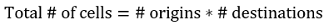
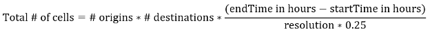
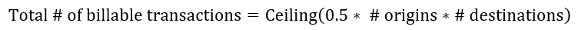
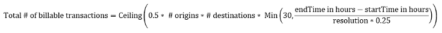

# Calculate a Distance Matrix
The Bing Maps Distance Matrix API provides travel time and distances for a set of origins and destinations. The distances and times returned are based on the routes calculated by the Bing Maps Route API. Times are based on predictive traffic information, depending on the start time specified in the request. Distance matrices can be calculated for driving, walking and public transit routes. This API can also generate distance matrices that optionally includes a histogram of travel times over a period of time with a set interval that takes into consideration the predicted traffic at those times.

Distance matrices are used in several different types of applications. The most common is to power algorithms which solve the [Travelling Salesman Problem (TSP)](https://en.wikipedia.org/wiki/Travelling_salesman_problem) and [Vehicle Routing Problem (VRP)](https://en.wikipedia.org/wiki/Vehicle_routing_problem). Some other common applications include:

* Sorting search results by their actual travel distance or time.
* Determine arrival times based on travel times.
* Calculate the difference in commute times between locations. For example: We are looking to move to a new office, what is the impact on commute times for our staff?
* Clustering data based on travel time and distances. For example: Find all homes that are within 1 mile of a corner store.

When you make a request by using one of the following URL templates, the response returns a Distance Matrix resource that contains either an array of Distance Matrix cells or information on the asynchronous request that was made to calculate a distance matrix. Each distance matrix cell contains the location and index of the origin and destination it is related to, the travel time, and distance. If a distance matrix histogram is requested, a departure time for when in the histogram the cell it is related to will be included. For more information about the Distance Matrix resource, see [Distance Matrix Data](../rest-services/distance-matrix-data.md). You can also view the example URL and response values in the **Examples** section.

## API Limits

Requests to the distance matrix API can be done in one of two ways:

* Most requests can be made with a simple synchronous GET or POST request.
* More complex driving related requests which take longer to process, such as calculating a histogram of travel times and distances for each cell of a matrix, can be made by making an asynchronous Distance Matrix request. This type of request is only accepted when the travel mode is set to driving and a start time has been specified.

A distance matrix can be requested that has up to 625 origins-destinations pairs which is calculated by multiplying the number of origins, by the number of destinations. For example, you can have 1 origin, and 625 destinations, or 25 origins and 25 destinations.

A histogram of travel times and distances can be requested but is limited to a distance matrix that has a maximum of 100 origins-destinations pairs when the request is made asynchronously, and 10 origins-destinations pairs when made synchronously. The maximum time interval between the start and end time when calculating a distance matrix histogram is 24 hours.

**When to use synchronous vs asynchronous requests**

Make synchronous request if the travel mode is driving, walking or transit and:

* The total number of origins-destinations pairs is less than or equal to 625 and no start time is specified.

&nbsp;&nbsp;&nbsp;&nbsp;**or**

* The travel mode is for driving, the number of origins-destinations pairs is less than or equal to 10 and a start time is specified, but not an end time. This will simply return a single cell for each origin-destination pair that is calculated using predictive traffic data.

Make an Asynchronous request if the travel mode is for driving, a start time is specified and:

* The number of origins-destinations pairs is less than or equal to 100, a start time and an end time is specified.

If your scenario doesn’t fit either of the parameters outlined above for synchronous and asynchronous requests, you will need to break your request up into smaller chunks. Note that transactions are based on the total number of cells in the resulting matrix and not on the number of requests, so the same number of transactions would be generated if you make two requests that generate 100 cells each or 1 request that generates 200 cells.

**How asynchronous requests work**

See [Asynchronous Requests documentation](../rest-services/asynchronous-requests.md).

**How to calculate number of cells a response will have**

When calculating a simple distance matrix each origin-destination pair will generate a single cell in the matrix.



For example, a matrix that has 2 origins, and 5 destinations, will generate 10 cells where 2 \* 5 = 10.

When a matrix includes a histogram, each origin-destination pair will have a cell in the matrix for each time interval. The number of time intervals that a request will have depends on the resolution, start and end times.



For example, a matrix that has 2 origins, 5 destinations, and retrieves time intervals in 15-minute increments (resolution = 1) over 24 hours, will generate 960 cells where 2 \* 5 \* 24/0.25 = 2 \* 5 \* 24 \* 4 = 960.

> [!NOTE]
> Cells will not be generated for origin-destination pairs that have the same index and coordinate. These will not be included in the transaction counts. If these exist in your query, you can subtract these from the calculated number of cells above to get a more accurate number for estimating transaction counts. 

**How to calculate total number of billable transactions a request will generate**

A billable transaction is generated for every 2 cells in a matrix, rounded up to the nearest whole integer. For a simple matrix, billable transactions will be calculated using the following formula:



For example, a matrix that has 2 origins, and 5 destinations, will generate 5 billable transactions where Ceiling(0.5 \* 2 \* 5) = 5.

When calculating a matrix which includes a histogram, only the first 30 time intervals in each origin-destination pair are counted towards billable transactions, any additional time intervals are provided for free.



For example, a matrix that has 2 origins, 5 destinations, and retrieves time intervals in 15 minute increments (resolution = 1) over 24 hours, will generate 150 cells where Ceiling(0.5 \* 2 \* 5 \* Min(30, 24/0.25)) = Ceiling(0.5 \* 2 \* 5 \* Min(30, 96)) = Ceiling(0.5 \* 2 \* 5 \* **30**) = 150. Note that 24/0.25 = 24 \* 4 = 96, but since only the first increments per origin-destination pair is counted towards billable transaction, 66 time intervals are excluded from the transaction calculation per origin-destination pair, thus saving you a total of 330 billable transactions in this scenario.

## Supported HTTP Methods

GET, POST

POST requests require all parameters to be passed into the body of the request as a JSON object. This API is [CORs enabled](https://en.wikipedia.org/wiki/Cross-origin_resource_sharing).

**When to use HTTP GET vs POST**

Many developers prefer the simplicity of HTTP GET requests which simply require generating a URL. However, browsers and servers have limits on the maximum length that URLs can be. Typically, it is best to keep your URLs under 2083 characters in length. With this in mind, it is recommended to only use HTTP GET requests when your request has less than a total of 50 origins and destinations.

## URL Template

> [!NOTE]
> These templates support both HTTP and HTTPS protocols. To use this API, you must have a [Bing Maps key](../getting-started/getting-a-bing-maps-key.md). 

**Synchronous Distance Matrix Request URL (GET)**

Retrieves a simple distance matrix for a set of origins and destinations using a HTTP GET request.

```
https://dev.virtualearth.net/REST/v1/Routes/DistanceMatrix?origins={lat0,long0;lat1,lon1;latM,lonM}&destinations={lat0,lon0;lat1,lon1;latN,longN}&travelMode={travelMode}&startTime={startTime}&timeUnit={timeUnit}&key={BingMapsKey}
```

**Synchronous Distance Matrix Request URL (POST)**

Retrieves a simple distance matrix for a set of origins and destinations using a HTTP POST request.

*HTTP POST Request URL*

```
https://dev.virtualearth.net/REST/v1/Routes/DistanceMatrix?key={BingMapsKey}
```

*POST Header*

```
Content-Length: insertLengthOfHTTPBody
Content-Type: application/json
```

*POST body*

```json
{
    "origins": [{
        "latitude": lat0,
        "longitude": lon0
    },
    {
        "latitude": latM,
        "longitude": lonM
    }],
    "destinations": [{
        "latitude": lat0,
        "longitude": lon0
    }, 
    {
        "latitude": latN,
        "longitude": lonN
    }],
    "travelMode": travelMode,
    "startTime": startTime,
    "timeUnit": timeUnit
}
```

**Asynchronous Distance Matrix Request URL (GET)**

Creates a job to calculate a distance matrix using an asynchronous GET request. This type of request is only supported when the travel mode is set to driving. A start time must be specified when making asynchronous requests.

```
https://dev.virtualearth.net/REST/v1/Routes/DistanceMatrixAsync?origins={lat0,long0;lat1,lon1;latM,lonM}&destinations={lat0,lon0;lat1,lon1;latN,longN}&travelMode={travelMode}&startTime={startTime}&timeUnit={timeUnit}&key={BingMapsKey}
```

**Asynchronous Distance Matrix Request URL (POST)**

Creates a job to calculate a distance matrix using an asynchronous POST request. This type of request is only supported when the travel mode is set to driving. A start time must be specified when making asynchronous requests.

*HTTP POST Request URL*

```
https://dev.virtualearth.net/REST/v1/Routes/DistanceMatrixAsync?key={BingMapsKey}
```

*HTTP POST Header*

```
Content-Length: insertLengthOfHTTPBody
Content-Type: application/json
```

*HTTP POST body*

```json
{
    "origins": [{
        "latitude": lat0,
        "longitude": lon0
    },
    {
        "latitude": latM,
        "longitude": lonM
    }],
    "destinations": [{
        "latitude": lat0,
        "longitude": lon0
    }, 
    {
        "latitude": latN,
        "longitude": lonN
    }],
    "travelMode": travelMode,
    "startTime": startTime, 
    "endTime": endTime,
    "resolution": resolution,
    "timeUnit": timeUnit
}
```

**URL for checking Asynchronous Request status (GET)**

The initial asynchronous response includes a `callbackUrl` property which contains the URL that can be used to check the status of the job. Alternatively, the callback URL can also be generated by appending the `requestId` that is returned in the initial asynchronous request along with the same Bing Maps key used, with the **DistanceMatrixAsyncCallback** endpoint as shown below. The response from this request will indicate if the request is complete or not, if complete it will provide a `resultUrl` property which is a URL that can be used to download the results.

```
https://dev.virtualearth.net/REST/v1/Routes/DistanceMatrixAsyncCallback?requestId={requestId}&key={BingMapsKey}
```

## Template Parameters

> [!NOTE]
> Additional parameters, such as output and JSON callback parameters, are found in [Output Parameters](../rest-services/output-parameters.md). 

| Parameters | Description |
|------------|-------------|
| origins    | **Required**. List of origins described as coordinate pairs with latitudes and longitudes. The format of each coordinate pair must use one of the following formats:<br/><br/>For GET requests: lat0,lon0;lat1,lon1;...;latM,lonM<br/><br/>**Example**: origins=37.77916,-122.42;32.71568,-117.16172<br/><br/>For POST requests:<br/><br/>[<br/>&nbsp;&nbsp;&nbsp;&nbsp;{<br/>&nbsp;&nbsp;&nbsp;&nbsp;&nbsp;&nbsp;&nbsp;&nbsp;"latitude": lat0,<br/>&nbsp;&nbsp;&nbsp;&nbsp;&nbsp;&nbsp;&nbsp;&nbsp;"longitude": lon0<br/>&nbsp;&nbsp;&nbsp;&nbsp;},<br/>&nbsp;&nbsp;&nbsp;&nbsp;{<br/>&nbsp;&nbsp;&nbsp;&nbsp;&nbsp;&nbsp;&nbsp;&nbsp;"latitude": lat1,<br/>&nbsp;&nbsp;&nbsp;&nbsp;&nbsp;&nbsp;&nbsp;&nbsp;"longitude": lon1<br/>&nbsp;&nbsp;&nbsp;&nbsp;},<br/>&nbsp;&nbsp;&nbsp;&nbsp;.<br/>&nbsp;&nbsp;&nbsp;&nbsp;.<br/>&nbsp;&nbsp;&nbsp;&nbsp;.<br/>&nbsp;&nbsp;&nbsp;&nbsp;{<br/>&nbsp;&nbsp;&nbsp;&nbsp;&nbsp;&nbsp;&nbsp;&nbsp;"latitude": latN,<br/>&nbsp;&nbsp;&nbsp;&nbsp;&nbsp;&nbsp;&nbsp;&nbsp;"longitude": lonN<br/>&nbsp;&nbsp;&nbsp;&nbsp;}<br/>]<br/><br/>**Example:**<br/><br/>"origins": [<br/>&nbsp;&nbsp;&nbsp;&nbsp;{<br/>&nbsp;&nbsp;&nbsp;&nbsp;&nbsp;&nbsp;&nbsp;&nbsp;"latitude": 37.77916,<br/>&nbsp;&nbsp;&nbsp;&nbsp;&nbsp;&nbsp;&nbsp;&nbsp;"longitude":  -122.42<br/>&nbsp;&nbsp;&nbsp;&nbsp;},<br/>&nbsp;&nbsp;&nbsp;&nbsp;{<br/>&nbsp;&nbsp;&nbsp;&nbsp;&nbsp;&nbsp;&nbsp;&nbsp;"latitude": 32.71568,<br/>&nbsp;&nbsp;&nbsp;&nbsp;&nbsp;&nbsp;&nbsp;&nbsp;"longitude": -117.16172<br/>&nbsp;&nbsp;&nbsp;&nbsp;}<br/>] |
| destinations   | **Optional**. List of destinations described as coordinate pairs with latitudes and longitudes. If not specified, an n x n matrix will be generated using the origins. The format of each coordinate pair must have the following format:<br/><br/>For GET requests: lat0,lon0;lat1,lon1;...;latM,lonM<br/><br/>**Example**: destinations=37.77916,-122.42;32.71568,-117.16172<br/><br/>For POST requests:<br/><br/>[<br/>&nbsp;&nbsp;&nbsp;&nbsp;{<br/>&nbsp;&nbsp;&nbsp;&nbsp;&nbsp;&nbsp;&nbsp;&nbsp;"latitude": lat0,<br/>&nbsp;&nbsp;&nbsp;&nbsp;&nbsp;&nbsp;&nbsp;&nbsp;"longitude": lon0<br/>&nbsp;&nbsp;&nbsp;&nbsp;},<br/>&nbsp;&nbsp;&nbsp;&nbsp;{<br/>&nbsp;&nbsp;&nbsp;&nbsp;&nbsp;&nbsp;&nbsp;&nbsp;"latitude": lat1,<br/>&nbsp;&nbsp;&nbsp;&nbsp;&nbsp;&nbsp;&nbsp;&nbsp;"longitude": lon1<br/>&nbsp;&nbsp;&nbsp;&nbsp;},<br/>&nbsp;&nbsp;&nbsp;&nbsp;.<br/>&nbsp;&nbsp;&nbsp;&nbsp;.<br/>&nbsp;&nbsp;&nbsp;&nbsp;.<br/>&nbsp;&nbsp;&nbsp;&nbsp;{<br/>&nbsp;&nbsp;&nbsp;&nbsp;&nbsp;&nbsp;&nbsp;&nbsp;"latitude": latN,<br/>&nbsp;&nbsp;&nbsp;&nbsp;&nbsp;&nbsp;&nbsp;&nbsp;"longitude": lonN<br/>&nbsp;&nbsp;&nbsp;&nbsp;}<br/>]<br/><br/>**Example:**<br/><br/>"destinations": [<br/>&nbsp;&nbsp;&nbsp;&nbsp;{<br/>&nbsp;&nbsp;&nbsp;&nbsp;&nbsp;&nbsp;&nbsp;&nbsp;"latitude": 37.77916,<br/>&nbsp;&nbsp;&nbsp;&nbsp;&nbsp;&nbsp;&nbsp;&nbsp;"longitude":  -122.42<br/>&nbsp;&nbsp;&nbsp;&nbsp;},<br/>&nbsp;&nbsp;&nbsp;&nbsp;{<br/>&nbsp;&nbsp;&nbsp;&nbsp;&nbsp;&nbsp;&nbsp;&nbsp;"latitude": 32.71568,<br/>&nbsp;&nbsp;&nbsp;&nbsp;&nbsp;&nbsp;&nbsp;&nbsp;"longitude": -117.16172<br/>&nbsp;&nbsp;&nbsp;&nbsp;}<br/>] |
| travelMode     | **Required**. Specifies the mode of transportation to use when calculating the distance matrix. Can be one of the following values:<br/><br/> • driving<br/> • walking (North America only, rest of world coming soon)<br/> • transit<br/><br/>**Example**: travelMode=driving  |
| startTime      | **Optional for Driving**. Specifies the start or departure time of the matrix to calculate and uses predictive traffic data. This should be a date string in a format that can be parsed by [DateTimeOffset.Parse](https://msdn.microsoft.com/library/bb351654.aspx). This option is only supported when the travel mode is set to driving.<br/><br/>**Example**: startTime=2017-06-15T8:00:00-07:00 |
| endTime        | **Optional for Driving**. If specified, a matrix based on traffic data with contain a histogram of travel times and distances for the specified resolution intervals (default is 15 minutes) between the start and end times. A start time must be specified for the request to be valid and the total time between start and end cannot be greater than 24 hours. This should be a date string in a format that can be parsed by [DateTimeOffset.Parse](https://msdn.microsoft.com/library/bb351654.aspx). This option is only supported when the travel mode is set to driving.<br/><br/>**Example**: endTime=2017-06-15T13:00:00-07:00 |
| resolution     | **Optional for Driving**. The number of intervals to calculate a histogram of data for each cell where a single interval is a quarter of an hour. Can be one of the following values:<br/><br/> • **1** - 15 minutes<br/> • **2** - 30 minutes<br/> • **3** - 45 minutes<br/> • **4** - an hour<br/><br/>If start time is specified and `resolution` is not, it will default to an interval of 1 (15 minutes).<br/><br/>**Example**: resolution=2 |
| distanceUnit   | **Optional.** The units to use for distances in the response. One of the following values:<br/><br/> • mile or mi<br/> • kilometer or km \[default\]<br/><br/>**Example**: distanceUnit=mi  |
| timeUnit       | **Optional.** The units to use for time durations in the response. One of the following values:<br/><br/> • minute \[default\]<br/> • second<br/><br/>**Example**: timeUnit=second |

> [!TIP]
> Geocode your origins and destinations ahead of time and store that information if you plan to use those locations in future requests. The Bing Maps terms of use allow the geocode result data to be stored for as long as you have a Bing Maps license. This can help speed up future requests and reduce transactions as geocoding of origin and destinations won’t be needed. 

## Response

A `DistanceMatrix` resource is returned when you make a request with one of the following URLs. For more information about the `DistanceMatrix` resource, see [Distance Matrix Data](../rest-services/distance-matrix-data.md). For more information about the common response syntax for the Bing Maps REST Services, see [Common Response Description](../rest-services/common-response-description.md). JSON and XML responses are provided for the URL examples in the following section.

These URLs support JSON (**application/json**) and XML (**application/xml**) response formats. A JSON response is provided by default unless you request XML output by setting the output (o) parameter. For more information, see [Output Parameters](../rest-services/output-parameters.md).

## Examples

All examples include a GET and its equivalent POST and will use the following set of origins and destinations.

Origins:

* Seattle, WA (47.6044, -122.3345)
* Redmond, WA (47.6731, -122.1185)
* Bellevue, WA (47.6149, -122.1936)

Destinations:

* Portland, OR (45.5347, -122.6231)
* Renton, WA (47.4747, -122.2057)

**Calculate a simple driving based Distance Matrix (synchronous)**

The following example shows how to request a simple driving based distance matrix for the set of origins and destinations. To view the complete XML and JSON responses, see [Distance Matrix Example](../rest-services/distance-matrix-example.md).

*HTTP GET Request URL*

```
https://dev.virtualearth.net/REST/v1/Routes/DistanceMatrix?origins=47.6044,-122.3345;47.6731,-122.1185;47.6149,-122.1936&destinations=45.5347,-122.6231;47.4747,-122.2057&travelMode=driving&key=BingMapsKey
```

*HTTP POST Request URL*

```
https://dev.virtualearth.net/REST/v1/Routes/DistanceMatrix?key=BingMapsKey
```

*HTTP POST Header*

```
Content-Length: 450
Content-Type: application/json
```

*HTTP POST Body*

```json
{
    "origins": [{
        "latitude": 47.6044,
        "longitude": -122.3345
    },
    {
        "latitude": 47.6731,
        "longitude": -122.1185
    },
    {
        "latitude": 47.6149,
        "longitude": -122.1936
    }],
    "destinations": [{
        "latitude": 45.5347,
        "longitude": -122.6231
    }, 
    {
        "latitude": 47.4747,
        "longitude": -122.2057
    }],
    "travelMode": "driving"
}
```

**Calculate a simple driving based Distance Matrix for specific time (synchronous)**

The following example shows how to request a simple driving based distance matrix for the set of origins and destinations for a specified time, June 15<sup>th</sup>, 2017 at 1PM PST. This request will automatically use predictive traffic data to provide accurate estimates.

*HTTP GET Request URL*

```
https://dev.virtualearth.net/REST/v1/Routes/DistanceMatrix?origins=47.6044,-122.3345;47.6731,-122.1185;47.6149,-122.1936&destinations=45.5347,-122.6231;47.4747,-122.2057&travelMode=driving&startTime=2017-06-15T13:00:00-07:00&key=BingMapsKey
```

*HTTP POST Request URL*

```
https://dev.virtualearth.net/REST/v1/Routes/DistanceMatrix?key=BingMapsKey
```

*HTTP POST Header*

```
Content-Length: 497
Content-Type: application/json
```

*HTTP POST Body*

```json
{
    "origins": [{
        "latitude": 47.6044,
        "longitude": -122.3345
    },
    {
        "latitude": 47.6731,
        "longitude": -122.1185
    },
    {
        "latitude": 47.6149,
        "longitude": -122.1936
    }],
    "destinations": [{
        "latitude": 45.5347,
        "longitude": -122.6231
    }, 
    {
        "latitude": 47.4747,
        "longitude": -122.2057
    }],
    "travelMode": "driving",
    "startTime": "2017-06-15T13:00:00-07:00"
}
```

**Calculate a simple driving based Distance Matrix for specific time (asynchronous)**

The following example shows how to request a simple driving based distance matrix for the set of origins and destinations for a specified time, June 15<sup>th</sup>, 2017 at 1PM PST. This request will automatically use predictive traffic data to provide accurate estimates. To view the complete XML and JSON responses, see [Distance Matrix Asynchronous Example](../rest-services/distance-matrix-asynchronous-example.md).

*HTTP GET Request URL*

```
https://dev.virtualearth.net/REST/v1/Routes/DistanceMatrixAsync?origins=47.6044,-122.3345;47.6731,-122.1185;47.6149,-122.1936&destinations=45.5347,-122.6231;47.4747,-122.2057&travelMode=driving&startTime=2017-06-15T13:00:00-07:00&key=BingMapsKey
```

*HTTP POST Request URL*

```
https://dev.virtualearth.net/REST/v1/Routes/DistanceMatrixAsync?key=BingMapsKey
```

*HTTP POST Header*

```
Content-Length: 497
Content-Type: application/json
```

*HTTP POST Body*

```json
{
    "origins": [{
        "latitude": 47.6044,
        "longitude": -122.3345
    },
    {
        "latitude": 47.6731,
        "longitude": -122.1185
    },
    {
        "latitude": 47.6149,
        "longitude": -122.1936
    }],
    "destinations": [{
        "latitude": 45.5347,
        "longitude": -122.6231
    }, 
    {
        "latitude": 47.4747,
        "longitude": -122.2057
    }],
    "travelMode": "driving",
    "startTime": "2017-06-15T13:00:00-07:00"
}
```

Once the initial request is made a `requestId` will be returned. A `requestId` is a unique identifier for the asynchronous request. This can be used to monitor the status of the request until it is completed, at which point the response will include a `resultUrl` property which the resulting distance matrix can be downloaded from. The following URL checks that status of an asynchronous request that has a `requestId` of “90b07189-33d8-4cbf-866a-1bd5c5b4f474”.

```
https://dev.virtualearth.net/REST/v1/Routes/DistanceMatrixAsyncCallback?requestId=90b07189-33d8-4cbf-866a-1bd5c5b4f474&key=BingMapsKey
```

**Calculate a driving based Distance Matrix Histogram (asynchronous)**

The following example shows how to request a driving based distance matrix histogram for the set of origins and destinations between June 15<sup>th</sup>, 2017 at 1PM PST and June 15<sup>th</sup>, 2017 at 5PM PST with a resolution of 2 (30-minute intervals). This request will automatically use predictive traffic data to provide accurate estimates. To view the complete XML and JSON responses, see [Distance Matrix Histogram Example](../rest-services/distance-matrix-histogram-example.md).

*HTTP GET Request URL*

```
https://dev.virtualearth.net/REST/v1/Routes/DistanceMatrixAsync?origins=47.6044,-122.3345;47.6731,-122.1185;47.6149,-122.1936&destinations=45.5347,-122.6231;47.4747,-122.2057&travelMode=driving&startTime=2017-06-15T13:00:00-07:00&endTime=2017-06-15T17:00:00-7:00&resolution=2&key=BingMapsKey
```

*HTTP POST Request URL*

```
https://dev.virtualearth.net/REST/v1/Routes/DistanceMatrixAsync?key=BingMapsKey
```

*HTTP POST Header*

```
Content-Length: 564
Content-Type: application/json
```

*HTTP POST Body*

```json
{
    "origins": [{
        "latitude": 47.6044,
        "longitude": -122.3345
    },
    {
        "latitude": 47.6731,
        "longitude": -122.1185
    },
    {
        "latitude": 47.6149,
        "longitude": -122.1936
    }],
    "destinations": [{
        "latitude": 45.5347,
        "longitude": -122.6231
    }, 
    {
        "latitude": 47.4747,
        "longitude": -122.2057
    }],
    "travelMode": "driving",
    "startTime": "2017-06-15T13:00:00-07:00",
    "endTime": "2017-06-15T17:00:00-07:00",
    "resolution": 2
}
```

Once the initial request is made a `requestId` will be returned. A `requestId` is a unique identifier for the asynchronous request. This can be used to monitor the status the request until it is completed, at which point the response will include a `resultUrl` property which the resulting distance matrix histogram can be downloaded from. The following URL checks that status of an asynchronous request that has a `requestId` of "90b07189-33d8-4cbf-866a-1bd5c5b4f474".

```
https://dev.virtualearth.net/REST/v1/Routes/DistanceMatrixAsyncCallback?requestId=90b07189-33d8-4cbf-866a-1bd5c5b4f474&key=BingMapsKey
```

## HTTP Status Codes

> [!NOTE]
> For more details about these HTTP status codes, see [Status Codes and Error Handling](../rest-services/status-codes-and-error-handling.md). 

When the request is successful, the following HTTP status code is returned.

* 200

When the request is not successful, the response returns one of the following errors.

* 400
* 401
* 404
* 429
* 500
* 503

## See Also

* [Using the REST Services with .NET](../rest-services/using-the-rest-services-with-net.md)
* [Distance Matrix Data](../rest-services/distance-matrix-data.md)
* [Distance Matrix Example](../rest-services/distance-matrix-example.md)
* [Distance Matrix Asynchronous Example](../rest-services/distance-matrix-asynchronous-example.md)
* [Distance Matrix Histogram Example](../rest-services/distance-matrix-histogram-example.md)
