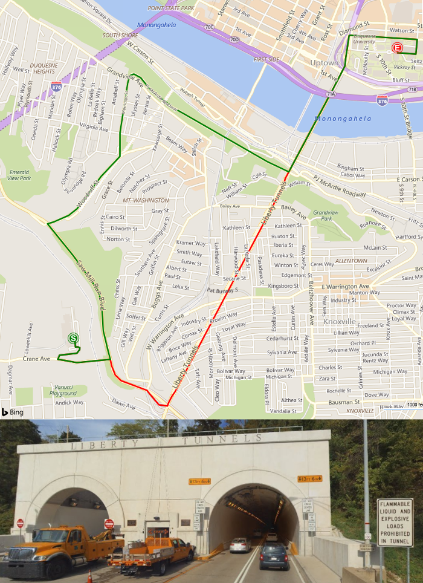

# Calculate a Truck Route
The Bing Maps Truck Routing API provides travel routes which take truck attributes such as size, weight and type of cargo. This is important as not all trucks can travel the same routes as other vehicles. Here are some examples:

* Bridges have heights and weight limits.
* Tunnels often have restrictions on flammable or hazardous materials.
* Longer trucks have difficulty making tight turns.
* Highways often have a separate speed limit for trucks.
* Certain trucks may want to avoid roads that have steep gradients.

The Bing Maps Truck Routing API is an extension of the existing Bing Maps Routing API and supports many of the same request parameters, and responds with the same Route resource class. Note that each request to the Truck Routing API generates three (3) billable transactions.

When you make a request by using one of the following URL templates, the response returns either a **Route** resource that contains the truck based routing information or `RouteProxyAsyncResult` resource which contains information on the asynchronous request that was made to calculate a truck route. For more information about the Route resource, see [Route Data](../rest-services/route-data.md). You can also view the example URL and response values in the **Examples** section.

Truck routing is only available in certain countries/regions, see the [Truck Routing Coverage documentation](../coverage/truck-routing-coverage.md) for details.

## API Limits

Requests to the Truck Routing API can be done in one of two ways:

* Most requests can be made with a simple synchronous GET or POST request. Recommended for shorter routes within a single city or state.
* Longer routes which take longer to process, such as multiple state or cross-country routes can be made by making an asynchronous Truck routing request.

If you are not sure which one to use, it is recommended to use the asynchronous method as this will work for all scenarios.

**How asynchronous requests work**

See [Asynchronous Requests documentation](../rest-services/asynchronous-requests.md).

## Supported HTTP Methods

GET, POST

POST requests require all parameters to be passed into the body of the request as a JSON object. This API is [CORs enabled](https://en.wikipedia.org/wiki/Cross-origin_resource_sharing).

**When to use HTTP GET vs POST**

Many developers prefer the simplicity of HTTP GET requests which simply require generating a URL. However, browsers and servers have limits on the maximum length that URLs can be. Typically, it is best to keep your URLs under 2083 characters in length. With this in mind, it is recommended to only use HTTP GET requests when your request is between a few waypoints and only some of the truck attributes options are specified.

## URL Template

> [!NOTE]
>  These templates support both HTTP and HTTPS protocols. To use this API, you must have a [Bing Maps key](../getting-started/getting-a-bing-maps-key.md). 

Truck route calculations require a lot more processing than standard driving route calculations, as such synchronous and asynchronous requests are supported. It is recommended to use the asynchronous request when calculating longer routes.

There are a lot of options available for truck routes. As such, some requests could result in long URL’s which may exceed browser limits. As such requests can be made using **GET** and **POST**. CORs is enabled to allow cross platform POST requests.

**Synchronous Truck Routing Request URL (GET)**

```
https://dev.virtualearth.net/REST/v1/Routes/Truck?wayPoint.1={wayPpoint1}&viaWaypoint.2={viaWaypoint2}&waypoint.3={waypoint3}&wayPoint.n={waypointN}&heading={heading}&optimize={optimize}&avoid={avoid}&distanceBeforeFirstTurn={distanceBeforeFirstTurn}&routeAttributes={routeAttributes}&dateTime={dateTime}&tolerances={tolerances}&distanceUnit={distanceUnit}&vehicleHeight={vehicleHeight}&vehicleWidth={vehicleWidth}&vehicleLength={vehicleLength}&vehicleWeight={vehicleWeight}&vehicleAxles={vehicleAxles}&vehicleTrailers={vehicleTrailers}&vehicleSemi={vehicleSemi}&vehicleMaxGradient={vehicleMaxGradient}&vehicleMinTurnRadius={vehicleMinTurnRadius}&vehicleAvoidCrossWind={vehicleAvoidCrossWind}&vehicleAvoidGroundingRisk={vehicleAvoidGroundingRisk}&vehicleHazardousMaterials={vehicleHazardousMaterials}&vehicleHazardousPermits={vehicleHazardousPermits}&key={BingMapsKey}
```

**Synchronous Truck Routing Request URL (POST)**

*HTTP POST Request URL*

```
https://dev.virtualearth.net/REST/v1/Routes/Truck?key={BingMapsKey}
```

*POST Header*

```
Content-Length: insertLengthOfHTTPBody
Content-Type: application/json
```

*POST body*

```
{
    "waypoints": [{
        "address": string,
        "latitude": number,
         "longitude": number,
        "isViaPoint": bool
    },
    …],
    "avoid": string,
    "dateTime": string,
    "distanceBeforeFirstTurn": number,
    "distanceUnit": string,
    "heading": number,
    "optimize": string,
    "routeAttributes": string,
    "tolerances": number[], 
    "vehicleSpec": {
        "dimensionUnit": string,
        "weightUnit": string,
        "vehicleHeight": number,
        "vehicleWidth": number,
        "vehicleLength": number,
        "vehicleWeight": number,
        "vehicleAxles": number,
        "vehicleTrailers": number,
        "vehicleSemi": bool,
        "vehicleMaxGradient": number,
        "vehicleMinTurnRadius": number,
        "vehicleAvoidCrossWind": bool,
        "vehicleAvoidGroundingRisk": bool,
        "vehicleHazardousMaterials": string,
        "vehicleHazardousPermits": string
    }
}
```

> [!NOTE]
>  For truck routing, vehicle attributes are specified inside of a `vehicleSpec` object in POST requests.

**Asynchronous Truck Routing Request URL (GET)**

```
https://dev.virtualearth.net/REST/v1/Routes/TruckAsync?wayPoint.1={wayPpoint1}&viaWaypoint.2={viaWaypoint2}&waypoint.3={waypoint3}&wayPoint.n={waypointN}&heading={heading}&optimize={optimize}&avoid={avoid}&distanceBeforeFirstTurn={distanceBeforeFirstTurn}&routeAttributes={routeAttributes}&dateTime={dateTime}&tolerances={tolerances}&distanceUnit={distanceUnit}&vehicleHeight={vehicleHeight}&vehicleWidth={vehicleWidth}&vehicleLength={vehicleLength}&vehicleWeight={vehicleWeight}&vehicleAxles={vehicleAxles}&vehicleTrailers={vehicleTrailers}&vehicleSemi={vehicleSemi}&vehicleMaxGradient={vehicleMaxGradient}&vehicleMinTurnRadius={vehicleMinTurnRadius}&vehicleAvoidCrossWind={vehicleAvoidCrossWind}&vehicleAvoidGroundingRisk={vehicleAvoidGroundingRisk}&vehicleHazardousMaterials={vehicleHazardousMaterials}&vehicleHazardousPermits={vehicleHazardousPermits}&key={BingMapsKey}
```

**Synchronous Truck Routing Request URL (POST)**

*HTTP POST Request URL*

```
https://dev.virtualearth.net/REST/v1/Routes/TruckAsync?key={BingMapsKey}
```

*POST Header*

```
Content-Length: insertLengthOfHTTPBody
Content-Type: application/json
```

*POST body*

```
{
    "waypoints": [{
        "address": string,
        "latitude": number,
         "longitude": number,
        "isViaPoint": bool
    },
    …],
    "avoid": string,
    "dateTime": string,
    "distanceBeforeFirstTurn": number,
    "distanceUnit": string,
    "heading": number,
    "optimize": string,
    "routeAttributes": string,
    "tolerances": number[], 
    "vehicleSpec": {
        "dimensionUnit": string,
        "weightUnit": string,
        "vehicleHeight": number,
        "vehicleWidth": number,
        "vehicleLength": number,
        "vehicleWeight": number,
        "vehicleAxles": number,
        "vehicleTrailers": number,
        "vehicleSemi": bool,
        "vehicleMaxGradient": number,
        "vehicleMinTurnRadius": number,
        "vehicleAvoidCrossWind": bool,
        "vehicleAvoidGroundingRisk": bool,
        "vehicleHazardousMaterials": string,
        "vehicleHazardousPermits": string
    }
}
```

> [!NOTE]
> For truck routing, vehicle attributes are specified inside of a `vehicleSpec` object in POST requests. 

**URL for checking Asynchronous request status (GET)**

The initial asynchronous response includes a *callbackUrl* property which contains the URL that can be used to check the status of the job. Alternatively, the callback URL can also be generated by appending the *requestId* that is returned in the initial asynchronous request along with the same Bing Maps key used, with the **TruckAsyncCallback** endpoint as shown below. The response from this request will indicate if the request is complete or not, if complete it will provide a *resultUrl* property which is a URL that can be used to download the results.

```
https://dev.virtualearth.net/REST/v1/Routes/TruckAsyncCallback?requestId={requestId}&key={BingMapsKey}
```

## Template Parameters

> [!NOTE]
>  Additional parameters, such as output and JSON callback parameters, are found in [Output Parameters](../rest-services/output-parameters.md).<br/><br/>An alias can be used for a URL parameter when making a GET request to shorten the length of the query parameter. For example, waypoint.1=47.610,-122.107 can be shortened to wp.1=47.610,-122.107.  

| Parameters            | GET Alias | Description  |
|-----------------------|-----------|--------------|
| waypoint.n<br/><br/>viaWaypoint.n  | wp.n<br/><br/>vwp.n | **Required**. A route is defined by a set of waypoints and viaWaypoints (intermediate locations that the route must pass through). The index (n value) for the set of waypoints and viaWaypoints is an integer starting with **0** or **1**. The waypoint and viaWaypoint index values must be sequential and must always increment by 1.<br/><br/>Both waypoint and viaWaypoint locations can be specified as a Point, a landmark, or an address. For more information about Point values, see [Location and Area Types](../rest-services/location-and-area-types.md).<br/><br/>You can have a maximum of 25 waypoints or viaWaypoints in a request. The start and end points of the route cannot be viaWaypoints.<br/><br/>**GET Examples**:<br/><br/>waypoint.1=47.610,-122.107 \[Point\] <br/><br/>wp.1=Seattle,WA \[landmark\]<br/><br/>waypoint.1=1%20Microsoft%20Way%20Redmond%20WA%20 \[address\]<br/><br/>&waypoint.1=Seattle&viaWaypoint.2=Kirkland&waypoint.3=Redmond \[viaWaypoint\]<br/><br/>**POST Examples:** <br/><br/>"waypoints": \[{<br/>&nbsp;&nbsp;&nbsp;&nbsp;"latitude": 47.610,<br/>&nbsp;&nbsp;&nbsp;&nbsp;"longitude": -122.107<br/>},{<br/>&nbsp;&nbsp;&nbsp;&nbsp;"address": "Seattle",<br/>&nbsp;&nbsp;&nbsp;&nbsp;"isViaPoint": true<br/>},{<br/>&nbsp;&nbsp;&nbsp;&nbsp;"address": "1 Microsoft Way, Redmond, WA",<br/>}\] |
| avoid  |               | **Optional.** Specifies the road types to minimize or avoid when a route is created for the driving travel mode. A comma-separated list of values from the following list that limit the use of highways and toll roads in the route. In the definitions below, "highway" also refers to a "limited-access highway". If no values are specified, highways and tolls are allowed in the route. Can consist of the following values:<br/><br/> • **highways**: Avoids the use of highways in the route.<br/> • **tolls**: Avoids the use of toll roads in the route.<br/> • **minimizeHighways**: Minimizes (tries to avoid) the use of highways in the route.<br/> • **minimizeTolls**: Minimizes (tries to avoid) the use of toll roads in the route.<br/><br/>**Note:**<br/><br/>If you specify more than one option for a road type, then the most restrictive option is used. For example, if you set the avoid parameter to both *highways* and *minimizeHighways*, the *highways* option is used and all highways are avoided.<br/><br/> **Examples**:<br/><br/> avoid=highways<br/><br/> avoid=highways,tolls |
| distanceBeforeFirstTurn   | dbft          | **Optional.** Specifies the distance before the first turn is allowed in the route. An integer distance specified in meters. Use this parameter to make sure that the moving vehicle has enough distance to make the first turn.<br/><br/>**Examples**: distanceBeforeFirstTurn=500 |
| heading                   | hd            | **Optional.** Specifies the initial heading for the route. An integer value between 0 and 359 that represents degrees from north where north is 0 degrees and the heading is specified clockwise from north. For example, setting the heading of 270 degrees creates a route that initially heads west.<br/><br/>**Example**: heading=90 |
| optimize                  | optmz         | **Optional.** Specifies what parameters to use to optimize the route. Can be one of the following values: <br/><br/> • **time** \[default\]: The route is calculated to minimize the time. Traffic information is not used.<br/> • **timeWithTraffic**: The route is calculated to minimize the time and uses current traffic information.<br/><br/>**Example**: optimize=time|
| routeAttributes           | ra            | **Optional.** Specify to include or exclude parts of the routes response. Can be one of the following values: <br/><br/> • **routePath**: Include a set of point (latitude and longitude) values that describe the route’s path in the response.<br/><br/>**Example**: routeAttributes=routePath |
| distanceUnit              | du            | **Optional.** The units to use for distance in the response. Can be one of the following values:<br/><br/> • **mile** or **mi**<br/> • **kilometer** or **km** \[default\] <br/><br/>**Example**: distanceUnit=mile |
| dateTime                  | dt            | **Optional**. When specified and the route is optimized for timeWithTraffic, predictive traffic data is used to calculate the best route for the specified date time of departure. A string that contains the date and time formatted as a [DateTime](https://msdn.microsoft.com/library/03ybds8y.aspx) value. For information about the string representation options for DateTime values, see [DateTime.Parse Method (String)](https://msdn.microsoft.com/library/1k1skd40.aspx). <br/><br/>**Examples**:<br/><br/>dateTime=03/01/2011 05:42:00<br/><br/>dateTime=05:42:00 \[assumes the current day\]<br/><br/>dateTime=03/01/2011 \[assumes the current time\] |
| tolerances | tl | **Optional.** A set of double values. Each value specifies a tolerance that is used to reduce the number of points needed to display a route on a map and still maintain the route shape. If a point is removed and the new route still falls within the specified tolerance of the old route, then the point is not included in the subset of points returned for that tolerance.<br/><br/>**GET format:** A comma-separated string of numbers.<br/><br/>**POST format:** An array of numbers.<br/><br/>You may find it useful to define tolerances for different zoom levels, screen resolutions or other display parameters.<br/><br/>You can specify a maximum of seven (7) tolerance values.<br/><br/>The tolerance is specified in degrees. A degree of latitude is approximately 60 nautical miles, 111 kilometers or 69 statute miles. Therefore, a tolerance value of 0.00001 represents a distance of about one (1) meter in the north-south direction. The distance represented by a degree of longitude varies with latitude. For example at 45 degrees of longitude, a degree of latitude is 111.132 km and a degree of longitude is 78.847 km. At the equator, these values are almost equal with latitude at 100.754 km and longitude at 111.320 km. As you approach the poles, the distance associated with a degree of latitude decreases, and fewer points will be excluded for the same tolerance value. For more information about how longitude distances change with latitude, see [Longitude (Wikipedia)](http://en.wikipedia.org/wiki/Longitude).<!--<br/><br/>The following diagram illustrates how a tolerance value is used.<br/><br/>--><br/><br/>**GET Example:**<br/><br/>tolerances=0.00000344,0.0005978<br/><br/>**POST Example:**<br/><br/>tolerances: [0.00000344, 0.0005] |
| dimensionUnit             | dims          | **Optional**. The unit of measurement of width, height, length. Can be one of the following values:<br/><br/> • **meter** or **m**\[default\]<br/> • **foot** or **ft**<br/><br/>**Example**: dimensionUnit=ft |
| weightUnit                | wu            | **Optional**. The unit of measurement of weight. Can be one of the following values.<br/><br/> • **kilogram** or **kg** \[default\]<br/> • **pound** or **lb**<br/><br/>**Example**: weightUnit=lb |
| vehicleHeight             | height        | **Optional**. The height of the vehicle in the specified dimension units.<br/><br/>**Example**: vehicleHeight=5 |
| vehicleWidth              | width         | **Optional**. The width of the vehicle in the specified dimension units.<br/><br/>**Example**: vehicleWidth=3.5 |
| vehicleLength             | vl            | **Optional**. The length of the vehicle in the specified dimension units.<br/><br/>**Example**: vehicleLength=30 |
| vehicleWeight             | weight        | **Optional**. The weight of the vehicle in the specified weight units.<br/><br/>**Example**: vehicleWeight=30000 |
| vehicleAxles              | axles         | **Optional**. The number of axles.<br/><br/>**Example**: vehicleAxles=3 |
| vehicleTrailers           | vt            | **Optional**. The number of trailers. <br/><br/>**Example**: vehicleTrailers=2 |
| vehicleSemi               | semi          | **Optional**. Indicates if the truck is pulling a semi-trailer. Semi-trailer restrictions are mostly used in North America. <br/><br/>**Example**: vehicleSemi=true  |
| vehicleMaxGradient        | vmg           | **Optional**. The maximum gradient the vehicle can drive measured in degrees.<br/><br/>**Example**: vehicleMaxGradient=10 |
| vehicleMinTurnRadius      | vmtr          | **Optional**. The minimum required radius for the vehicle to turn in the specified dimension units.<br/><br/>**Example**: vehicleMinTurnRadius=15 |
| vehicleAvoidCrossWind     | vacw          | **Optional**. Indicates if the vehicle shall avoid crosswinds.<br/><br/>**Example**: vehicleAvoidCrossWind=true |
| vehicleAvoidGroundingRisk | vagr          | **Optional**. Indicates if the route shall avoid the risk of grounding.<br/><br/>**Example**: vehicleAvoidGroundingRisk=true |
| vehicleHazardousMaterials | vhm           | **Optional**. A comma separated and case-sensitive list of one or more hazardous materials for which the vehicle is transporting. Possible values and their aliases are:<br/><br/> • **Combustable** or **C**<br/> • **Corrosive** or **Cr**<br/> • **Explosive** or **E**<br/> • **Flammable** or **F**<br/> • **FlammableSolid** or **FS**<br/> • **Gas** or **G**<br/> • **GoodsHarmfulToWater** or **WH**<br/> • **Organic** or **O**<br/> • **Other**<br/> • **Poison** or **P**<br/> • **PoisonousInhalation** or **PI**<br/> • **Radioactive** or **R**<br/> • **None**<br/><br/>**Examples**<br/><br/>vehicleHazardousMaterials=Explosive,Corrosive<br/><br/>vehicleHazardousMaterials=E,Cr |
| vehicleHazardousPermits   | vhp           | **Optional**. A comma separated and case-sensitive list of one or more hazardous materials for which the vehicle has a permit. Possible values and their aliases are:<br/><br/> • **AllAppropriateForLoad**<br/> • **Combustible** or **C**<br/> • **Corrosive** or **Cr**<br/> • **Explosive** or **E**<br/> • **Flammable** or **F**<br/> • **FlammableSolid** or **FS**<br/> • **Gas** or **G**<br/> • **Organic** or **O**<br/> • **Poison** or **P**<br/> • **PoisonousInhalation** or **PI**<br/> • **Radioactive** or **R**<br/> • **None**<br/><br/>**Examples**<br/><br/>vehicleHazardousPermits=Explosive,Corrosive<br/><br/>vehicleHazardousPermits=E,Cr  |

> [!TIP]
> Geocoding your waypoints ahead of time and store that information if you plan to use those locations in future requests. The Bing Maps terms of use allow the geocode result data to be stored for as long as you have a Bing Maps license. This can help speed up future requests. 

## Hazardous Materials Restrictions

These restrictions apply to truck cargo, where the resulting route excludes roads on which hazardous materials are prohibited from being transported. The rules for excluding roads with such restrictions include:

* when the truck contains hazardous materials, roads prohibited for shipment of dangerous materials are always excluded from route calculation.
* when the request specifies `vehicleHazardousMaterials=GoodsHarmfulToWater`, roads prohibited for shipment of water pollutants are excluded from route calculation.
* when the request specifies `vehicleHazardousMaterials=Explosive,Flammable`, roads prohibited for shipment of explosive and flammable materials are excluded from route calculation.
* when the request specifies a hazardous material that is in the truck, roads prohibited for shipment of that specific hazardous material are excluded from the route calculation.

Although some hazardous material categories overlap, the routing engine does not implicitly map the hazardous materials to restricted goods. For example, if the request specifies combustible materials or gas (which could be flammable), roads prohibited for flammable materials are not excluded from the route calculations.

## Trailer Restrictions

The Routing API can distinguish between trailer and semi-trailer restrictions. The rules for excluding roads with trailer restrictions are as follows:

* if `vehicleTrailers > 0` – roads prohibited for trucks with trailers are excluded from route calculation.
* if `vehicleSemi=true` and `vehicleTrailers > 0` – roads prohibited for trucks with semi-trailers are excluded from route calculation.

> [!NOTE]
> Semi-trailer restrictions are mostly used in North America. 

## Examples
The following example shows how to request a truck route. In this case, consider a truck that may be transporting a flammable material between Pittsburgh Brashear High School (590 Crane Ave, Pittsburgh, PA) and Duquesne University (600 Forbes Ave, Pittsburgh, PA). For comparison, the following image shows the calculated truck route in green and the route a vehicle not carrying flammable material would typically take in red. The primary reason for the difference in routes in this case is that flammable and explosive materials are prohibited inside the Liberty Tunnel. As a result, the route for this truck is 3.9 miles while the route a vehicle that isn’t carrying flammable or explosive material is only 3.1 miles.



All examples include a GET and its equivalent POST.

**Calculate a truck based route (synchronous)**

The following shows how to synchronously calculate the truck route.

*HTTP GET Request URL*

```
https://dev.virtualearth.net/REST/v1/Routes/Truck?wp.0=590%20Crane%20Ave%2C%20Pittsburgh%2C%20PA&wp.1=600%20Forbes%20Ave%2C%20Pittsburgh%2C%20PA&vehicleHazardousMaterials=Flammable&key=BingMapsKey
```

*HTTP POST Request URL*

```
https://dev.virtualearth.net/REST/v1/Routes/Truck?key=BingMapsKey
```

*HTTP POST Header*

```
Content-Length: 227                             
Content-Type: application/json
```

*HTTP POST Body*

```
{
    "waypoints": [{
        "address": "590 Crane Ave, Pittsburgh, PA"
    },{
        "address": "600 Forbes Ave, Pittsburgh, PA"
    }],
    "vehicleSpec": {
        "vehicleHazardousMaterials": "Flammable"
    }
}
```

For comparison the following image shows this truck route in green and a vehicle not carrying flammable material would typically take in red. The primary reason for the difference in routes in this case is that flammable and explosive materials are prohibited inside the Liberty Tunnel. As a result, the route for this truck is 3.9 miles while the route a vehicle that isn’t carrying flammable or explosive material is only 3.1 miles.

To view the complete XML and JSON responses, see [Truck Route Example](../rest-services/truck-route-example.md).

**Calculate a truck based route (asynchronous)**

The following shows how to asynchronously calculate the truck route.

*HTTP GET Request URL*

```
https://dev.virtualearth.net/REST/v1/Routes/TruckAsync?wp.0=590%20Crane%20Ave%2C%20Pittsburgh%2C%20PA&wp.1=600%20Forbes%20Ave%2C%20Pittsburgh%2C%20PA&vehicleHazardousMaterials=Flammable&key=BingMapsKey
```

*HTTP POST Request URL*

```
https://dev.virtualearth.net/REST/v1/Routes/TruckAsync?key=BingMapsKey
```

*HTTP POST Header*

```
Content-Length: 227                             
Content-Type: application/json
```

*HTTP POST Body*

```
{
    "waypoints": [{
        "address": "590 Crane Ave, Pittsburgh, PA"
    },{
        "address": "600 Forbes Ave, Pittsburgh, PA"
    }],
    "vehicleSpec": {
        "vehicleHazardousMaterials": "Flammable"
    }
}
```

Once the initial request is made a *requestId* will be returned. A *requestId* is a unique identifier for the asynchronous request. This can be used to monitor the status of the request until it is completed, at which point the response will include a *resultURl* property which the resulting truck route can be downloaded from. The following URL checks that status of an asynchronous request that has a *requestId* of "90b07189-33d8-4cbf-866a-1bd5c5b4f474".

```
https://dev.virtualearth.net/REST/v1/Routes/TruckAsyncCallback?requestId=90b07189-33d8-4cbf-866a-1bd5c5b4f474&key=BingMapsKey
```

To view the complete XML and JSON responses, see [Truck Route Asynchronous Example](../rest-services/truck-route-asynchronous-example.md).

## HTTP Status Codes

> [!NOTE]
> For more details about these HTTP status codes, see [Status Codes and Error Handling](../rest-services/status-codes-and-error-handling.md).

When the request is successful, the following HTTP status code is returned.

* 200

When the request is not successful, the response returns one of the following errors.

* 400
* 401
* 404
* 429
* 500
* 503

## See Also

* [Using the REST Services with .NET](../rest-services/using-the-rest-services-with-net.md)
* [Truck Route Example](../rest-services/truck-route-example.md)
* [Truck Route Asynchronous Example](../rest-services/truck-route-asynchronous-example.md)
