# Pushpin Syntax and Icon Styles

[!INCLUDE [bing-maps-get-a-static-map-api-retirement-banner](../../includes/bing-maps-get-a-static-map-api-retirement-banner.md)]

Pushpins identify locations on a map. You can specify an icon style and a label for a pushpin, in addition to its location.  
  
> [!NOTE]
>  You can specify up to 18 pushpins within a [Get a Static Map](../imagery/get-a-static-map.md) URL that uses HTTP GET protocol. However, if you use the HTTP POST method option, you can specify up to 100 pushpins by inserting them into the request body. See the **HTTP POST Syntax** section below for information about how to format the pushpins in a request body. The [Get a Static Map](../imagery/get-a-static-map.md) topic provides more details and an example.
  
 The following table shows the syntax to use to specify a pushpin location.  
  
> `pushpin=latitude,longitude;iconStyle;label`

 You can use the alias `pp` if you do not want to spell out `pushpin`.  
  
 A latitude and a longitude are required. You can optionally specify an icon style and a label for the pushpin. A length of a label string is limited to three characters.  
  
 The following table shows the options for specifying a pushpin.  

|Description|Syntax|  
|-----|------|
|Specify a pushpin location.|`latitude,longitude`<br /><br /> Example: `pushpin=47.620548,-122.34874`|
|Specify a pushpin location and an icon style.|`latitude,longitude;iconStyle`<br /><br />Example: `pushpin=47.620548,-122.34874;5`|  
|Specify a pushpin location and a label.|`latitude,longitude;;label`<br /><br />**Note:**  The order of the syntax requires that if you specify a label without specifying an icon style, you must preserve the syntax and put two semi-colons between the coordinates and the label. <br /><br />Example: `pushpin=47.620548,-122.34874;;P10`|  
|Specify a pushpin location, an icon style, and a label.|`latitude,longitude;iconStyle;label`<br /><br />**Note**: A label can have up to three (3) characters.<br /><br />Example: `pushpin=47.620548,-122.34874;5;P10`|
  
## HTTP POST Syntax

If you use the HTTP POST method for specifying pushpins on a static map, you must include the pushpins in the body of the request.  
  
When specifying multiple pushpins in the request body, you must the ampersand character (`&`) or a carriage return (`\r\n`) as a delimiter. Pushpins that follow a carriage return (appear on a new line) do not have ampersands.  
  
The following examples show how to specify pushpins in the body of an HTTP POST request. For more information about this type of request, see [Get a Static Map](../imagery/get-a-static-map.md).  
  
## Examples

### Example 1
  
```url
pp=38.889586530732335,-77.05010175704956;23;LMT\r\n  
pp=38.88772364638439,-77.0472639799118;7;KMT\r\n  
pp=38.890479451480054,-77.04744637012482;1;VMT\r\n  
pp=38.8896854931628,-77.03519403934479;45;WMT  
```
  
### Example 2

```url
pp=38.889586530732335,-77.05010175704956;23;LMT&pp=38.88772364638439,-77.0472639799118;7;KMT\r\n  
pp=38.890479451480054,-77.04744637012482;1;VMT&pp=38.8896854931628,-77.03519403934479;45;WMT  
```  
  
## Icon Styles  

The following table shows the available pushpin icon styles.  
  
|IconStyle|Icon|  
|---------------|----------|  
|0||  
|1 **[default]**||  
|2||  
|3||  
|4||  
|5||  
|6||  
|7||  
|8||  
|9||  
|10||  
|11||  
|12||  
|13||  
|14||  
|15||  
|16||  
|17||  
|18||  
|19||  
|20||  
|21||  
|22||  
|23||  
|24||  
|25||  
|26||  
|27||  
|28||  
|29||  
|30||  
|31||  
|32||  
|33|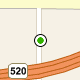|  
|34|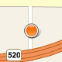|  
|35|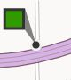|  
|36|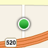|  
|37||  
|38|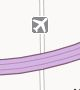|  
|39||  
|40|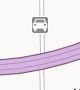|  
|41|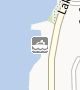|  
|42|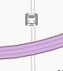|  
|43|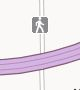|  
|44|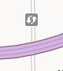|  
|45|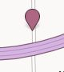|  
|46|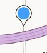|  
|47|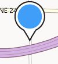|  
|48|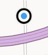|  
|49|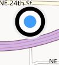|  
|50|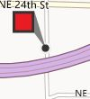|  
|51|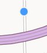|  
|52|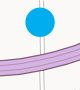|  
|53||  
|54|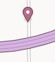|  
|55|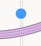|  
|56|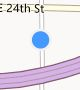|  
|57|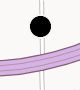|  
|58|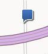|  
|59|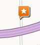|  
|60|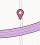|  
|61|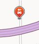|  
|62||  
|63|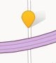|  
|64||  
|65|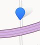|  
|66|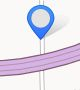|  
|67|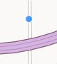|  
|68|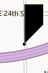|  
|69|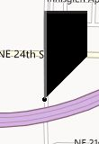|  
|70|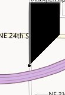|  
|71|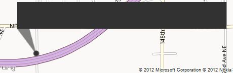|  
|72|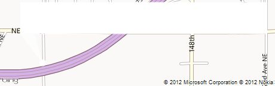|  
|73|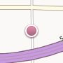|  
|74|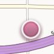|  
|75|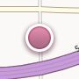|  
|76|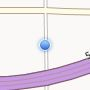|  
|77|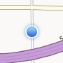|  
|78|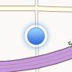|  
|79|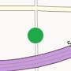|  
|80|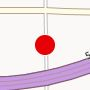|  
|81|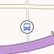|  
|82|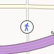|  
|83|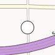|  
|84|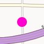|  
|85|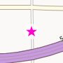|  
|86||  
|87|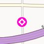|  
|88||  
|89|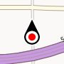|  
|90||  
|91||  
|92||  
|93||  
|94||  
|95||  
|96||  
|97||  
|98||  
|99||  
|100||  
|101||  
|102||  
|103||  
|104||  
|105||  
|106||  
|107||  
|108||  
|109||  
|110||  
|111||  
|112||  
|113||  
|114||  
|115||  
|116||  
|117||  
|118||  
|119||  
|120||  
|121||  
|122||  
|123||  
|124||  
|125||  
|126||  
|127||  
|128||  
|129||  
|130||  
|131||  
|132||  
|133||  
|134||  
|135||  
|136||