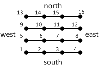
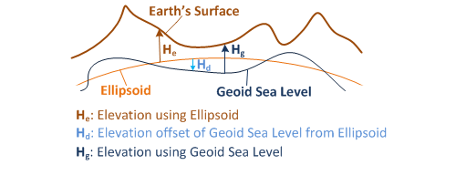

# Get Elevations
Use the following URLs to get elevation values (in meters) for a set of locations, a polyline path or area on the Earth.  
  
## URL Templates  
  
> [!Note]
> These templates support both HTTP and HTTPS protocols. To use this API, you must have a [Bing Maps key](../getting-started/getting-a-bing-maps-key.md). 
  
 **Unit of elevation**: meters  
  
 **Get elevations for latitude and longitude coordinates.**  
  
 Elevations are returned for each set of coordinates.  
  
 **Required parameters**: points, key  
  
```  
http://dev.virtualearth.net/REST/v1/Elevation/List?points={lat1,long1,lat2,long2,latN,longnN}&heights={heights}&key={BingMapsKey}  
```  
  
 **Get elevations at equally-spaced locations along a polyline path.**  
  
 A polyline path is computed from the coordinates, and then elevation values at both endpoints and equally-spaced locations along the polyline are returned. The samples parameter specifies the number of elevations to return.  
  
 **Required parameters**: points, samples, key  
  
```  
http://dev.virtualearth.net/REST/v1/Elevation/Polyline?points={lat1,long1,lat2,long2,latN,longN}&heights={heights}&samples={samples}&key={BingMapsKey}  
```  
  
 **Get elevations at equally-spaced locations within an area on the Earth defined as a bounding box.**  
  
 The rectangular area defined by the four (4) bounding box coordinates (south latitude, west longitude, north latitude, east longitude) is divided into rows and columns. The edges of the bounding box account for two (2) of the rows and two (2) of the columns. Elevations are returned for the vertices of the grid created by the rows and columns. For example, if you had specified `rows=4` and `columns=4`, then 16 elevations are returned. The elevation values are ordered starting with the southwest corner, and then proceed west to east and south to north. This is illustrated in the following diagram. The elevation points are numbered in the order that they are returned.  
  
   
  
 **Required parameters**: bounds, rows, cols, key  
  
```  
http://dev.virtualearth.net/REST/v1/Elevation/{Bounds}?bounds={boundingBox}&rows={rows}&cols={cols}&heights={heights}&key={BingMapsKey}  
```  
  
 **Get the offset of the geoid sea level Earth model from the ellipsoid Earth model at a set of latitude and longitude coordinates.**  
  
 This request returns the offset in meters of the geoid model (heights=sealevel) from the ellipsoid model (heights=ellipsoid) at each location (difference = geoid_sealevel - ellipsoid_sealevel).  
  
 **Required parameters**: points, key  
  
```  
http://dev.virtualearth.net/REST/v1/Elevation/SeaLevel?points={lat1,long1,lat2,long2,latN,longN}&key={BingMapsKey}  
```  
  
 **About Elevations and Coordinate Values:**  
  
-   Elevation values can be calculated using to two different Earth models – the ellipsoid model and the geoid sea level model. The ellipsoid model uses the [World Geodetic System (WGS84)](http://en.wikipedia.org/wiki/WGS84) which is an ellipsoidal approximation of the Earth. The geoid sea level model uses the [Earth Gravitational Model 2008 (EGM2008 2.5’)](http://earth-info.nga.mil/GandG/wgs84/gravitymod/egm2008/index.html) and computes a sea level based on the local value of gravity. The ellipsoid model is equivalent to GPS and the geoid sea level model is equivalent what is commonly known as the height above sea level. For a more detailed description of the two models, see the **Earth Models and Zoom Level** section below. Set the `heights` parameter to `ellipsoid` or `sealevel` to specify the model to use. If the heights parameter is not specified, the sea level model is used  
  
-   Latitudes and longitudes in the URL are expected to be in WGS84 decimal degrees. (Example: 34.2412,-119.3829)  
  
-   The maximum number of elevations returned in a request is 1024.  
  
> [!CAUTION]
>  There is a limitation in that latitude coordinates outside of the range of -85 and 85 are not supported.  
  
 If you are submitting a large number of locations, you can use the HTTP POST protocol or the [Point Compression Algorithm](../rest-services/point-compression-algorithm.md).  
  
## Template Parameters  
  
> [!NOTE]
>  -   Parameters and parameter values are not case-sensitive.  
> -   Additional parameters, such output and JSON callback parameters, are found in [Output Parameters](../rest-services/output-parameters.md).  
  
 **Parameters in the following table are valid for a URL only when they appear in the templates above.**  
  
|Parameters|Alias|Description|Values|  
|----------------|-----------|-----------------|------------|  
|points=lat1,long1,lat2,long2,latn,longn|pts|**Required**. A set of coordinates on the Earth to use in elevation calculations. The exact use of these points depends on the type of elevation request.|A set of latitude and longitude values in WGS84 decimal degrees. If you are requesting elevations or elevation offsets for a set of points, the maximum number of points is 1024.<br /><br /> If you have a large number of values, you can use the HTTP POST protocol or the [Point Compression Algorithm](../rest-services/point-compression-algorithm.md).<br /><br /> **Example:**<br /><br /> points=35.89431,-110.72522,35.89393,-110.72578,35.89374|  
|bounds||**Required**. Specifies the rectangular area over which to provide elevation values.|A bounding box defined as a set of WGS84 latitudes and longitudes in the following order:<br /><br /> south latitude, west longitude, north latitude, east longitude<br /><br /> **Example**:<br /><br /> bounds=45.219,-122.234,47.61,-122.07|  
|rows, cols||**Required**. Specifies the number of rows and columns to use to divide the bounding box area into a grid. The rows and columns that define the bounding box each count as two (2) of the rows and columns. Elevation values are returned for all vertices of the grid.|Integers with a value of two (2) or greater. The number of rows and columns can define a maximum of 1024 locations (rows * cols <= 1024).<br /><br /> **Examples**:<br /><br /> rows=30<br /><br /> cols=15|  
|samples|samp|**Required**. Specifies the number of equally-spaced elevation values to provide along a polyline path.|A positive integer. The maximum number of samples is 1024.<br /><br /> **Example**: samples=30|  
|heights|hts|**Optional**. Specifies which sea level model to use to calculate elevation.|One of the following values.<br /><br /> sealevel [**default**]: Use the geoid Earth model (EGM2008 2.5’).<br /><br /> ellipsoid: Use the ellipsoid Earth model (WGS84).<br /><br /> For more information about these models, see the **Earth Models and Zoom Level** section below.<br /><br /> **Example**: heights=ellipsoid|  
|key||**Required**. A Bing Maps Key.|If you do not have a Bing Maps Key, see [Getting a Bing Maps Key](http://msdn.microsoft.com/en-us/library/ff428642).|  
  
## Earth Models and Zoom Level  
 Elevation calculations can vary based on the model of the Earth used and the zoom level.  
  
 **Earth model**: The Elevations API uses two Earth models – an ellipsoid model that is equivalent to a GPS calculation, and geoid sea level model that is what is commonly referred to as altitude above sea level.  
  
 The ellipsoid model approximates the Earth as an ellipsoid and uses the [World Geodetic System (WGS84)](http://en.wikipedia.org/wiki/World_Geodetic_Systemhttp://en.wikipedia.org/wiki/World_Geodetic_System). With the ellipsoid model, the elevation is calculated as a height above the ellipsoid.  
  
 The geoid sea level model is an approximation of Mean Sea Level that uses an equipotential surface of the Earth’s gravitational field. The geoid model uses the Earth Gravitational Model 2008 (EGM2008 2.5’). Because gravity varies by location, the geoid sea level model is not a smooth shape like the ellipsoid model.  
  
 You can specify the Earth model by setting the `heights` parameter to `ellipsoid` or `sealevel` (geoid).  
  
 The following diagram shows how the ellipsoid and geoid sea level models can vary and how elevation is measured for both models.  
  
   
  
 **Zoom level** : A zoom level is returned in the response, and reflects the resolution of the data used to compute the elevation. A higher zoom level indicates higher resolution data and more accurate elevation values. At lower zoom levels, the data is further apart and interpolated points are less accurate. For information about the data resolution at different zoom levels, see [Understanding Scale and Resolution](http://msdn.microsoft.com/en-us/library/aa940990.aspx).  
  
 Typically, lower zoom levels are used for areas that have limited data or when you request elevations for points or a polyline that covers a large distance. For example if you request a polyline that covers a large distance across the Earth, such as the distance between Paris and Beijing, the points used to compute elevation are associated with a higher zoom level and are further apart.  
  
## Elevation Coverage and Resolution  
 The following table shows the minimum elevation resolution by area. Actual elevation resolution may be may be higher.  
  
|**Coverage Area**|**Resolution (in meters)**|  
|-----------------------|----------------------------------|  
|Global (including poles)|900 m|  
|Global 56° S - 60° N|90 m|  
|United States|10 m|  
  
## Response  
 A set of elevations and the associated zoom level is returned in the responses that request elevation values. For descriptions of the data returned in the response, see [Elevation Data](../rest-services/elevation-data.md). For more information about the common values that are also returned in the response, see [Common Response Description](../rest-services/common-response-description.md).  
  
 You can choose JSON (application/json) or XML (application/xml) format for the response. JSON is returned by default. To specify the format, set the output (o) parameter to `json` or `xml`. For more information, see [Output Parameters](../rest-services/output-parameters.md).  
  
## Examples  
  
 **Get elevations for a set of latitude and longitude coordinates.**  
  
 The geoid Earth model is used to compute elevations for the coordinates provided.  
  
```  
http://dev.virtualearth.net/REST/v1/Elevation/List?points=35.89431,-110.72522,35.89393,-110.72578,35.89374,-110.72606,35.89337,-110.72662&key=BingMapsKey  
```  
  
 **JSON Response**  
  
 This example returns the following response where `values` are the elevation values and `zoomLevel` is the zoom level used.  
  
```  
{  
   "authenticationResultCode":"ValidCredentials",  
   "brandLogoUri":"http:\/\/dev.virtualearth.net\/Branding\/logo_powered_by.png",  
   "copyright":"Copyright © 2012 Microsoft and its suppliers. All rights reserved. This API cannot be accessed and the content and any results may not be used, reproduced or transmitted in any manner without express written permission from Microsoft Corporation.",  
   "resourceSets":[  
      {  
         "estimatedTotal":1,  
         "resources":[  
            {  
               "__type":"ElevationData:http:\/\/schemas.microsoft.com\/search\/local\/ws\/rest\/v1",  
               "elevations":[1776,1775,1777,1776],  
               "zoomLevel":14  
            }  
         ]  
      }  
   ],  
   "statusCode":200,  
   "statusDescription":"OK",  
   "traceId":"8d57dbeb0bb94e7ca67fd25b4114f5c3"  
}  
```  
  
 **XML Response**  
  
 This XML response is returned when `output=xml` is added to the URL.  
  
```  
<Response xmlns:xsi="http://www.w3.org/2001/XMLSchema-instance" xmlns:xsd="http://www.w3.org/2001/XMLSchema" xmlns="http://schemas.microsoft.com/search/local/ws/rest/v1">  
  <Copyright>  
    Copyright © 2012 Microsoft and its suppliers. All rights reserved. This API cannot be accessed and the content and any results may not be used, reproduced or transmitted in any manner without express written permission from Microsoft Corporation.  
  </Copyright>  
  <BrandLogoUri>http://dev.virtualearth.net/Branding/logo_powered_by.png</BrandLogoUri>  
  <StatusCode>200</StatusCode>  
  <StatusDescription>OK</StatusDescription>  
  <AuthenticationResultCode>ValidCredentials</AuthenticationResultCode>  
  <TraceId>  
    3e6771dbe66045a18f72a787dc8c8deb  
  </TraceId>  
  <ResourceSets>  
    <ResourceSet>  
      <EstimatedTotal>1</EstimatedTotal>  
      <Resources>  
        <ElevationData>  
          <ZoomLevel>14</ZoomLevel>  
          <Elevations>  
            <int>1776</int>  
            <int>1775</int>  
            <int>1777</int>  
            <int>1776</int>  
          </Elevations>  
        </ElevationData>  
      </Resources>  
    </ResourceSet>  
  </ResourceSets>  
</Response>  
  
```  
  
 **Get the elevations for a rectangular area on the Earth.**  
  
 The geoid model is used to compute the elevations at the vertices of a rectangular grid. The bounds (bounding box) values specify an area that is further divided by the number of rows and columns specified. Two (2) rows and two (2) columns represent the bounding box.  
  
```  
http://dev.virtualearth.net/REST/v1/Elevation/Bounds?bounds=50.995391,-1.320763,51.000577,-1.311836&rows=4&cols=4&key=BingMapsKey  
```  
  
 **JSON Response**  
  
 This example returns the following response where `values` are the elevation values and `zoomLevel` is the zoom level used.  
  
```  
{  
   "authenticationResultCode":"ValidCredentials",  
   "brandLogoUri":"http:\/\/dev.virtualearth.net\/Branding\/logo_powered_by.png",  
   "copyright":"Copyright © 2012 Microsoft and its suppliers. All rights reserved. This API cannot be accessed and the content and any results may not be used, reproduced or transmitted in any manner without express written permission from Microsoft Corporation.",  
   "resourceSets":[  
      {  
         "estimatedTotal":1,  
         "resources":[  
            {  
               "__type":"ElevationData:http:\/\/schemas.microsoft.com\/search\/local\/ws\/rest\/v1",  
               "elevations":[35,39,42,41,35,37,39,43,38,37,41,40,37,41,48,49],  
               "zoomLevel":11  
            }  
         ]  
      }  
   ],  
   "statusCode":200,  
   "statusDescription":"OK",  
   "traceId":"55ae05364e3d4ca3a6b6ed864b9e652a"  
}  
```  
  
 **XML Response**  
  
 This XML response is returned when `output=xml` is added to the URL.  
  
```  
<Response xmlns:xsi="http://www.w3.org/2001/XMLSchema-instance" xmlns:xsd="http://www.w3.org/2001/XMLSchema" xmlns="http://schemas.microsoft.com/search/local/ws/rest/v1">  
  <Copyright>  
    Copyright © 2012 Microsoft and its suppliers. All rights reserved. This API cannot be accessed and the content and any results may not be used, reproduced or transmitted in any manner without express written permission from Microsoft Corporation.  
  </Copyright>  
  <BrandLogoUri>  
    http://dev.virtualearth.net/Branding/logo_powered_by.png  
  </BrandLogoUri>  
  <StatusCode>200</StatusCode>  
  <StatusDescription>OK</StatusDescription>  
  <AuthenticationResultCode>ValidCredentials</AuthenticationResultCode>  
  <TraceId>  
    e039402824834526bd60c8db99c3e837  
  </TraceId>  
  <ResourceSets>  
    <ResourceSet>  
      <EstimatedTotal>1</EstimatedTotal>  
      <Resources>  
        <ElevationData>  
          <ZoomLevel>11</ZoomLevel>  
          <Elevations>  
            <int>35</int>  
            <int>39</int>  
            <int>42</int>  
            <int>41</int>  
            <int>35</int>  
            <int>37</int>  
            <int>39</int>  
            <int>43</int>  
            <int>38</int>  
            <int>37</int>  
            <int>41</int>  
            <int>40</int>  
            <int>37</int>  
            <int>41</int>  
            <int>48</int>  
            <int>49</int>  
          </Elevations>  
        </ElevationData>  
      </Resources>  
    </ResourceSet>  
  </ResourceSets>  
</Response>  
  
```  
  
 **Get the elevations at equally-spaced locations along a polyline.**  
  
 A polyline path is computed from the latitude and longitude values. Elevations are computed for the endpoints and eight (8) equally-spaced points in between. The ellipsoid Earth model is used to compute the elevations because `heights=ellipsoid` is specified.  
  
```  
http://dev.virtualearth.net/REST/v1/Elevation/Polyline?points=35.89431,-110.72522,35.89393,-110.72578,35.89374,-110.72606,35.89337,-110.72662&heights=ellipsoid&samples=10&key=BingMapsKey  
```  
  
 **JSON Response**  
  
 This example returns the following response where `values` are the elevation values and `zoomLevel` is the zoom level used.  
  
```  
{  
   "authenticationResultCode":"ValidCredentials",  
   "brandLogoUri":"http:\/\/dev.virtualearth.net\/Branding\/logo_powered_by.png",  
   "copyright":"Copyright © 2012 Microsoft and its suppliers. All rights reserved. This API cannot be accessed and the content and any results may not be used, reproduced or transmitted in any manner without express written permission from Microsoft Corporation.",  
   "resourceSets":[  
      {  
         "estimatedTotal":1,  
         "resources":[  
            {  
               "__type":"ElevationData:http:\/\/schemas.microsoft.com\/search\/local\/ws\/rest\/v1",  
               "elevations":[1753,1752,1752,1752,1752,1754,1754,1754,1754,1753],  
               "zoomLevel":14  
            }  
         ]  
      }  
   ],  
   "statusCode":200,  
   "statusDescription":"OK",  
   "traceId":"3080e93328564e91abb68493ae826e2d"  
}  
```  
  
 **XML Response**  
  
 This XML response is returned when `output=xml` is added to the URL.  
  
```  
<Response xmlns:xsi="http://www.w3.org/2001/XMLSchema-instance" xmlns:xsd="http://www.w3.org/2001/XMLSchema" xmlns="http://schemas.microsoft.com/search/local/ws/rest/v1">  
  <Copyright>  
    Copyright © 2012 Microsoft and its suppliers. All rights reserved. This API cannot be accessed and the content and any results may not be used, reproduced or transmitted in any manner without express written permission from Microsoft Corporation.  
  </Copyright>  
  <BrandLogoUri>  
    http://veintplat2.live-int.com/Branding/logo_powered_by.png  
  </BrandLogoUri>  
  <StatusCode>200</StatusCode>  
  <StatusDescription>OK</StatusDescription>  
  <AuthenticationResultCode>ValidCredentials</AuthenticationResultCode>  
  <TraceId>  
    38ef4ca6e6da45508a3ea5225e730fca  
  </TraceId>  
  <ResourceSets>  
    <ResourceSet>  
      <EstimatedTotal>1</EstimatedTotal>  
      <Resources>  
        <ElevationData>  
          <ZoomLevel>14</ZoomLevel>  
          <Elevations>  
            <int>1753</int>  
            <int>1752</int>  
            <int>1752</int>  
            <int>1752</int>  
            <int>1752</int>  
            <int>1754</int>  
            <int>1754</int>  
            <int>1754</int>  
            <int>1754</int>  
            <int>1753</int>  
          </Elevations>  
        </ElevationData>  
      </Resources>  
    </ResourceSet>  
  </ResourceSets>  
</Response>  
  
```  
  
 **Get the offset of the geoid sea level model from the ellipsoid model at the specified locations.**  
  
```  
http://dev.virtualearth.net/REST/v1/Elevation/SeaLevel?points=35.89431,-110.72522,35.89393,-110.72578,35.89374,-110.72606,35.89337,-110.72662&key=BingMapsKey  
```  
  
 **JSON Response**  
  
 This example returns the following response where `values` show that the geoid sea level approximation is 23 meters below the ellipsoid at each location.  
  
```  
{  
   "authenticationResultCode":"ValidCredentials",  
   "brandLogoUri":"http:\/\/dev.virtualearth.net\/Branding\/logo_powered_by.png",  
   "copyright":"Copyright © 2012 Microsoft and its suppliers. All rights reserved. This API cannot be accessed and the content and any results may not be used, reproduced or transmitted in any manner without express written permission from Microsoft Corporation.",  
   "resourceSets":[  
      {  
         "estimatedTotal":1,  
         "resources":[  
            {  
               "__type":"SeaLevelData:http:\/\/schemas.microsoft.com\/search\/local\/ws\/rest\/v1",  
               "offsets":[-23, -23, -23, -23],  
               "zoomLevel":14  
            }  
         ]  
      }  
   ],  
   "statusCode":200,  
   "statusDescription":"OK",  
   "traceId":"ec8ceb0a09754aa3b9e981cb13a4282a"  
}  
```  
  
 **XML Response**  
  
 This XML response is returned when `output=xml` is added to the URL.  
  
```  
<Response xmlns:xsi="http://www.w3.org/2001/XMLSchema-instance" xmlns:xsd="http://www.w3.org/2001/XMLSchema" xmlns="http://schemas.microsoft.com/search/local/ws/rest/v1">  
  <Copyright>  
    Copyright © 2012 Microsoft and its suppliers. All rights reserved. This API cannot be accessed and the content and any results may not be used, reproduced or transmitted in any manner without express written permission from Microsoft Corporation.  
  </Copyright>  
  <BrandLogoUri>http://dev.virtualearth.net/Branding/logo_powered_by.png</BrandLogoUri>  
  <StatusCode>200</StatusCode>  
  <StatusDescription>OK</StatusDescription>  
  <AuthenticationResultCode>ValidCredentials</AuthenticationResultCode>  
  <TraceId>  
    e55037868ba34371a859462f7a0c59f3  
  </TraceId>  
  <ResourceSets>  
    <ResourceSet>  
      <EstimatedTotal>1</EstimatedTotal>  
      <Resources>  
        <SeaLevelData>  
          <ZoomLevel>14</ZoomLevel>  
          <Offsets>  
            <int>-23</int>  
            <int>-23</int>  
            <int>-23</int>  
            <int>-23</int>  
          </Offsets>  
        </SeaLevelData>  
      </Resources>  
    </ResourceSet>  
  </ResourceSets>  
</Response>  
  
```  
  
 **Use HTTP POST to get elevations**  
  
 You can use HTTP POST protocol to make any request that takes the `points` parameter. You may want to do this if you have a large number of locations in your request. If you are typically requesting elevations for 400 points or less, you may want to implement the [Point Compression Algorithm](../rest-services/point-compression-algorithm.md).  
  
 **HTTP POST URL**  
  
```  
http://dev.virtualearth.net/REST/v1/Elevation/List?key=BingMapsKey  
```  
  
 **HTTP POST Header**  
  
```  
Content-Length: insertLengthOfHTTPBody  
Content-Type: text/plain; charset=utf-8  
  
```  
  
 **HTTP POST Body**  
  
```  
points=38.8895,77.0501,38.8877,-77.0472,38.8904,-77.0474,38.8896,77.0351  
```  
  
## HTTP Status Codes  
  
> [!NOTE]
>  For more details about these HTTP status codes, see [Status Codes and Error Handling](../rest-services/status-codes-and-error-handling.md).  
  
 When the request is successful, the following HTTP status code is returned.  
  
* 200

When the request is not successful, the response returns one of the following errors.

* 400
* 401
* 404
* 429
* 500
* 503 
  
## See Also  
 [Using the REST Services with .NET](../rest-services/using-the-rest-services-with-net.md)   
 [JSON Data Contracts](../rest-services/json-data-contracts.md)