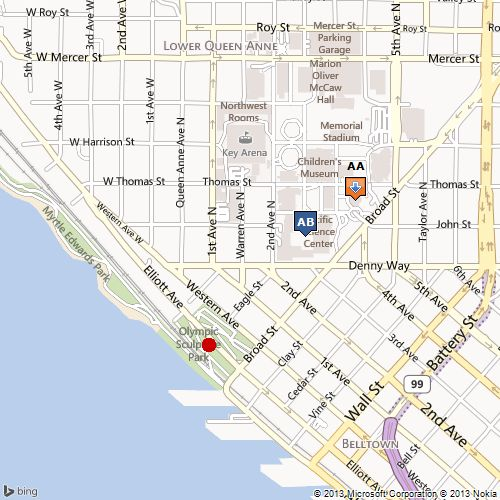

# Static Map Data

When you use the [Get a Static Map](get-a-static-map.md) API to request static map image metadata, the response returns a Static Map Metadata resource that contains metadata about the static map including the absolute (latitude and longitude) and relative (with respect to the map) coordinates and size of pushpins, as well as the map area, size and center point. When you request static map metadata, the response does not return the map image. This topic contains descriptions of the static map metadata, followed by JSON and XML examples.  
  
[!INCLUDE [get-common-response-note](../../includes/get-common-response-note.md)] 
  
## Static Map Metadata  
 The following fields are returned when you request image metadata for a static map.  
  
|JSON|XML|Type|Description|  
|----------|---------|----------|-----------------|  
|bbox|BoundingBox|BoundingBox. For more information about the BoundingBox type, see [Location and Area Types](../common-parameters-and-types/location-and-area-types.md).|A geographic area that contains the location. A bounding box contains SouthLatitude, WestLongitude, NorthLatitude, and EastLongitude values in units of degrees.|  
|imageWidth|ImageWidth|integer|The width of static map.|  
|imageHeight|ImageHeight|integer|The height of the static map.|  
|mapCenter|MapCenter|Point. For more information about the Point type, see [Location and Area Types](../common-parameters-and-types/location-and-area-types.md).|The centerpoint of the static map.|  
|zoom|Zoom|integer|The zoom level of the static map.|  
|pushpinMetadata|PushpinMetadata|collection|A collection of metadata for each pushpin on the static map. See the **Pushpin Metadata** section below for more information.|  
  
## Pushpin Metadata

 If a static map contains pushpins, a request for static map metadata returns following information for each pushpin.  
  
|JSON|XML|Type|Description|  
|----------|---------|----------|-----------------|  
|point|Point|Point. For more information about the Point type, see [Location and Area Types](../common-parameters-and-types/location-and-area-types.md).|The latitude and longitude coordinates of the pushpin.|  
|anchor|Anchor|An x (horizontal) and y (vertical) offset in pixels.|The placement of the pushpin on the static map that is defined by an offset in pixels from the upper left hand corner of the map.|  
|topLeftOffset|TopLeftOffset|An x (horizontal) and y (vertical) offset in pixels.|The offset of the top left corner of the pushpin icon with respect to the anchor point.|  
|bottomRightOffset|BottomRightOffset|An x (horizontal) and y (vertical) offset in pixels.|The offset of the bottom right corner of the pushpin icon with respect to the anchor point.|  
  
## Examples

 The following examples show the metadata that is returned for a static map. The static map is also shown for reference. When you request metadata for a static map, the map image is not returned.  
  
### Static Map Metadata Resource Example
 
The following URL gets static map metadata for the map image. The map image is not returned with static map metadata. XML and JSON static metadata responses are shown below.  
  
```url
http://dev.virtualearth.net/REST/v1/Imagery/Map/Road/47.619048,-122.35384/15?mapSize=500,500&pp=47.620495,-122.34931;21;AA&pp=47.619385,-122.351485;;AB&pp=47.616295,-122.3556;22&mapMetadata=1&o=xml&key=BingMapsKey  
```  
  
  
  
 This example returns the following response.  
  
 **XML Response**  
  
```xml
<Response xmlns:xsi="http://www.w3.org/2001/XMLSchema-instance" xmlns:xsd="http://www.w3.org/2001/XMLSchema" xmlns="http://schemas.microsoft.com/search/local/ws/rest/v1">  
  <Copyright>  
    Copyright © 2011 Microsoft and its suppliers. All rights reserved. This API cannot be accessed and the content and any results may not be used, reproduced or transmitted in any manner without express written permission from Microsoft Corporation.  
  </Copyright>  
  <BrandLogoUri>  
    http://dev.virtualearth.net/Branding/logo_powered_by.png  
  </BrandLogoUri>  
  <StatusCode>200</StatusCode>  
  <StatusDescription>OK</StatusDescription>  
  <AuthenticationResultCode>ValidCredentials</AuthenticationResultCode>  
  <TraceId>  
    d7718f0fa2344b23ad73ac2dd8788eec  
  </TraceId>  
  <ResourceSets>  
    <ResourceSet>  
      <EstimatedTotal>1</EstimatedTotal>  
      <Resources>  
        <StaticMapMetadata>  
          <BoundingBox>  
            <SouthLatitude>47.611833900404896</SouthLatitude>  
            <WestLongitude>-122.36456394195557</WestLongitude>  
            <NorthLatitude>47.626268662877358</NorthLatitude>  
            <EastLongitude>-122.34314918518068</EastLongitude>  
          </BoundingBox>  
          <MapCenter>  
            <Latitude>47.619048</Latitude>  
            <Longitude>-122.35384</Longitude>  
          </MapCenter>  
          <ImageWidth>500</ImageWidth>  
          <ImageHeight>500</ImageHeight>  
          <Zoom>15</Zoom>  
          <Pushpins>  
            <PushpinMetadata>  
              <Point>  
                <Latitude>47.620495</Latitude>  
                <Longitude>-122.34931</Longitude>  
              </Point>  
              <Anchor>  
                <X>355</X>  
                <Y>200</Y>  
              </Anchor>  
              <TopLeftOffset>  
                <X>12</X>  
                <Y>25</Y>  
              </TopLeftOffset>  
              <BottomRightOffset>  
                <X>13</X>  
                <Y>2</Y>  
              </BottomRightOffset>  
            </PushpinMetadata>  
            <PushpinMetadata>  
              <Point>  
                <Latitude>47.619385</Latitude>  
                <Longitude>-122.351485</Longitude>  
              </Point>  
              <Anchor>  
                <X>305</X>  
                <Y>238</Y>  
              </Anchor>  
              <TopLeftOffset>  
                <X>12</X>  
                <Y>28</Y>  
              </TopLeftOffset>  
              <BottomRightOffset>  
                <X>13</X>  
                <Y>0</Y>  
              </BottomRightOffset>  
            </PushpinMetadata>  
            <PushpinMetadata>  
              <Point>  
                <Latitude>47.616295</Latitude>  
                <Longitude>-122.3556</Longitude>  
              </Point>  
              <Anchor>  
                <X>209</X>  
                <Y>345</Y>  
              </Anchor>  
              <TopLeftOffset>  
                <X>8</X>  
                <Y>8</Y>  
              </TopLeftOffset>  
              <BottomRightOffset>  
                <X>8</X>  
                <Y>8</Y>  
              </BottomRightOffset>  
            </PushpinMetadata>  
          </Pushpins>  
        </StaticMapMetadata>  
      </Resources>  
    </ResourceSet>  
  </ResourceSets>  
</Response>  
  
```  
  
 **JSON Response**  
  
 The following response is returned if the output parameter (`o=xml`) is not specified in the URL or is set to json (`o=json`).  
  
```json
{  
   "authenticationResultCode":"ValidCredentials",  
   "brandLogoUri":"http:\/\/dev.virtualearth.net\/Branding\/logo_powered_by.png",  
   "copyright":"Copyright © 2011 Microsoft and its suppliers. All rights reserved. This API cannot be accessed and the content and any results may not be used, reproduced or transmitted in any manner without express written permission from Microsoft Corporation.",  
   "resourceSets":[  
      {  
         "estimatedTotal":1,  
         "resources":[  
            {  
               "__type":"StaticMapMetadata:http:\/\/schemas.microsoft.com\/search\/local\/ws\/rest\/v1",  
               "bbox":[  
                  47.611833900404896,  
                  -122.36456394195557,  
                  47.626268662877358,  
                  -122.34314918518068  
               ],  
               "imageHeight":"500",  
               "imageWidth":"500",  
               "mapCenter":{  
                  "type":"Point",  
                  "coordinates":[  
                     "47.619048",  
                     "-122.35384"  
                  ]  
               },  
               "pushpins":[  
                  {  
                     "anchor":{  
                        "x":"355",  
                        "y":"200"  
                     },  
                     "bottomRightOffset":{  
                        "x":"13",  
                        "y":"2"  
                     },  
                     "point":{  
                        "type":"Point",  
                        "coordinates":[  
                           "47.620495",  
                           "-122.34931"  
                        ]  
                     },  
                     "topLeftOffset":{  
                        "x":"12",  
                        "y":"25"  
                     }  
                  },  
                  {  
                     "anchor":{  
                        "x":"305",  
                        "y":"238"  
                     },  
                     "bottomRightOffset":{  
                        "x":"13",  
                        "y":"0"  
                     },  
                     "point":{  
                        "type":"Point",  
                        "coordinates":[  
                           "47.619385",  
                           "-122.351485"  
                        ]  
                     },  
                     "topLeftOffset":{  
                        "x":"12",  
                        "y":"28"  
                     }  
                  },  
                  {  
                     "anchor":{  
                        "x":"209",  
                        "y":"345"  
                     },  
                     "bottomRightOffset":{  
                        "x":"8",  
                        "y":"8"  
                     },  
                     "point":{  
                        "type":"Point",  
                        "coordinates":[  
                           "47.616295",  
                           "-122.3556"  
                        ]  
                     },  
                     "topLeftOffset":{  
                        "x":"8",  
                        "y":"8"  
                     }  
                  }  
               ],  
               "zoom":"15"  
            }  
         ]  
      }  
   ],  
   "statusCode":200,  
   "statusDescription":"OK",  
   "traceId":"bfc64b786a054288a4b160743ddfec65"  
}  
```